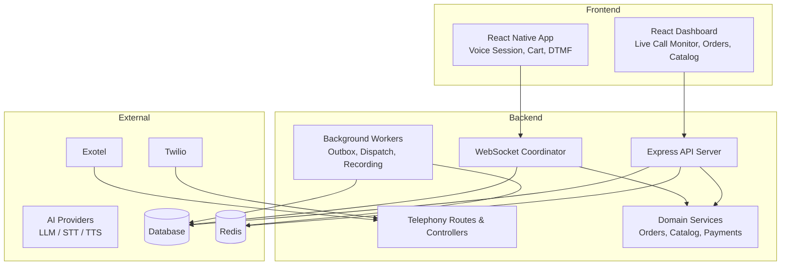
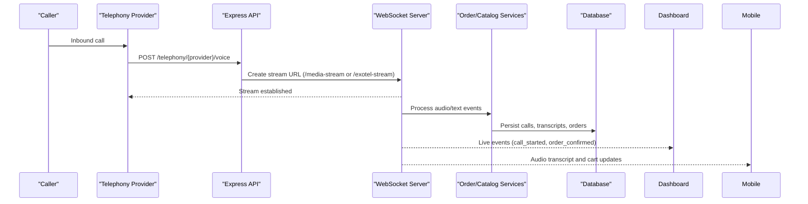
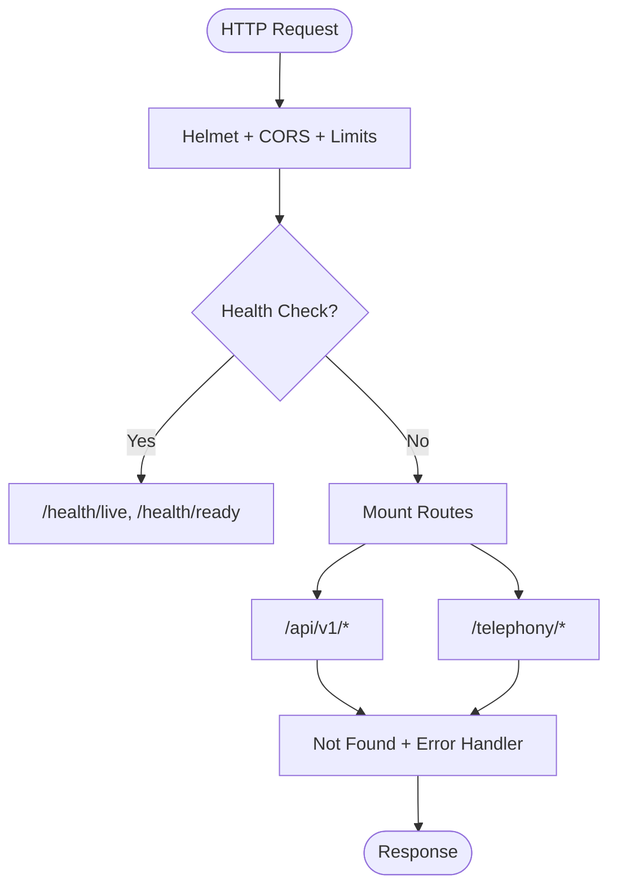
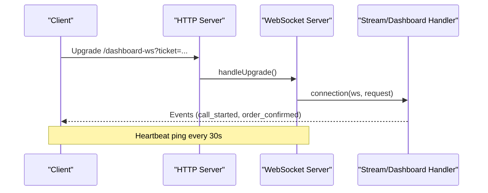
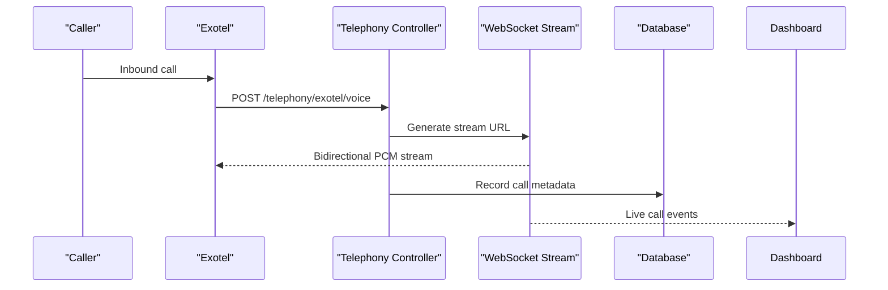
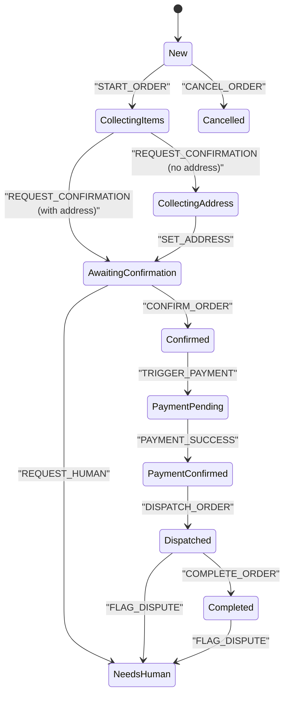
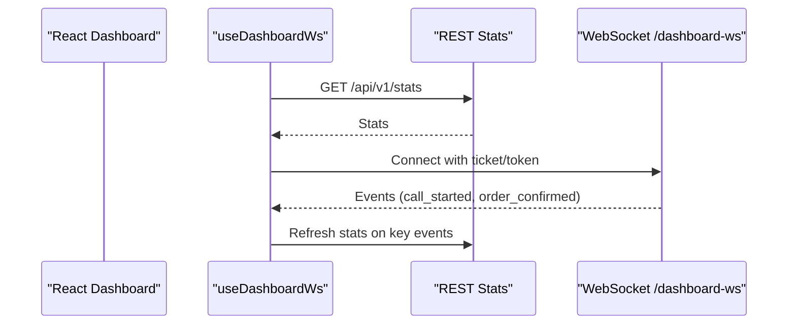
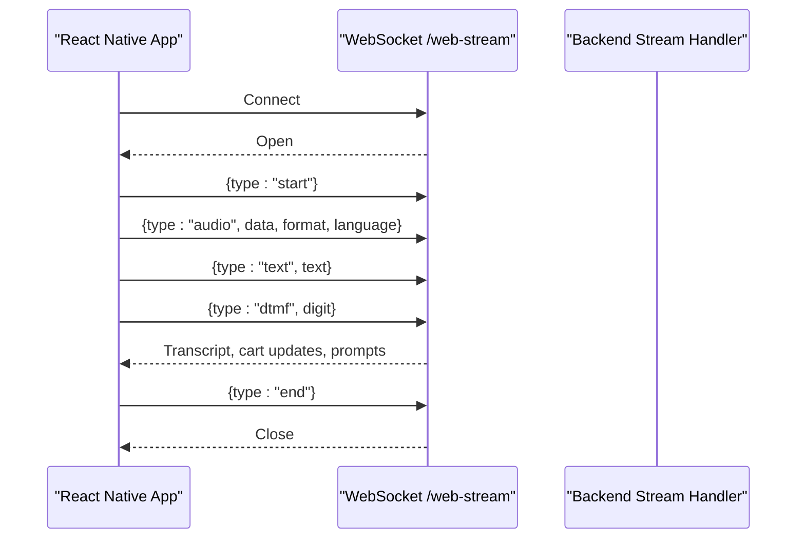
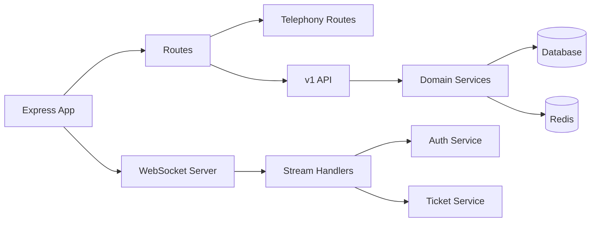

# Architecture Overview

<cite>
**Referenced Files in This Document**
- [app.js](file://server/src/app.js)
- [env.js](file://server/src/config/env.js)
- [wsServer.js](file://server/src/websocket/wsServer.js)
- [telephony.routes.js](file://server/src/routes/telephony.routes.js)
- [exotelService.js](file://server/src/services/exotelService.js)
- [useDashboardWs.js](file://client/src/hooks/useDashboardWs.js)
- [App.jsx](file://client/src/App.jsx)
- [voiceSocketService.js](file://mobile/src/services/voiceSocketService.js)
- [001_initial_multitenant_schema.sql](file://server/src/db/migrations/001_initial_multitenant_schema.sql)
- [rbac.middleware.js](file://server/src/middleware/rbac.middleware.js)
- [auth.service.js](file://server/src/services/auth.service.js)
- [order.controller.js](file://server/src/controllers/order.controller.js)
- [orderStateMachine.js](file://server/src/domain/orders/orderStateMachine.js)
- [docker-compose.yml](file://docker-compose.yml)
</cite>

## Table of Contents
1. Introduction
2. Project Structure
3. Core Components
4. Architecture Overview
5. Detailed Component Analysis
6. Dependency Analysis
7. Performance Considerations
8. Troubleshooting Guide
9. Conclusion

## Introduction
This document describes the Inkiro Voice Commerce Platform architecture with a focus on multi-tenant design, role-based access control (RBAC), and the three-tier structure: backend API server, React dashboard frontend, and React Native mobile application. It explains real-time communication via WebSockets for live call monitoring and order updates, integration points with telephony providers (Twilio/Exotel), and AI services for voice processing. It also covers scalability, deployment topology, and infrastructure requirements.

## Project Structure
The platform is organized into three primary layers:
- Backend API server (Express + WebSocket) providing REST APIs, telephony webhooks, WebSocket streams, background workers, and domain logic.
- React dashboard frontend for staff operations, live call monitoring, order management, catalog administration, analytics, and enterprise console.
- React Native mobile application enabling voice-first ordering with real-time audio streaming, conversation UI, cart, and DTMF support.



**Diagram sources**
- [app.js:15-99](file://server/src/app.js#L15-L99)
- [wsServer.js:17-161](file://server/src/websocket/wsServer.js#L17-L161)
- [telephony.routes.js:1-23](file://server/src/routes/telephony.routes.js#L1-L23)
- [docker-compose.yml:3-45](file://docker-compose.yml#L3-L45)

**Section sources**
- [app.js:15-99](file://server/src/app.js#L15-L99)
- [docker-compose.yml:3-45](file://docker-compose.yml#L3-L45)

## Core Components
- Express application with security middleware, CORS policy, request limits, health endpoints, route mounting, error handling, and outbox worker initialization.
- WebSocket coordinator that authenticates and routes upgrades to dashboard, media stream, web stream, and exotel stream handlers.
- Telephony routes exposing provider-specific inbound voice webhooks, missed-call and DTMF webhooks, and pin-drop confirmation endpoints.
- Multi-tenant database schema including tenants, users, restaurants, branches, catalog, customers, calls, conversations, orders, and recordings.
- RBAC guard enforcing role-based access across protected resources.
- Authentication service issuing short-lived JWTs, refresh tokens, and verifying credentials securely.
- Order state machine governing authoritative transitions from creation through completion or cancellation.
- Frontend hooks and components connecting to the dashboard WebSocket for live metrics and events.
- Mobile voice socket service managing audio streaming, text, and DTMF over WebSocket.

**Section sources**
- [app.js:15-99](file://server/src/app.js#L15-L99)
- [wsServer.js:17-161](file://server/src/websocket/wsServer.js#L17-L161)
- [telephony.routes.js:1-23](file://server/src/routes/telephony.routes.js#L1-L23)
- [001_initial_multitenant_schema.sql:12-222](file://server/src/db/migrations/001_initial_multitenant_schema.sql#L12-L222)
- [rbac.middleware.js:1-32](file://server/src/middleware/rbac.middleware.js#L1-L32)
- [auth.service.js:47-120](file://server/src/services/auth.service.js#L47-L120)
- [orderStateMachine.js:8-41](file://server/src/domain/orders/orderStateMachine.js#L8-L41)
- [useDashboardWs.js:14-128](file://client/src/hooks/useDashboardWs.js#L14-L128)
- [voiceSocketService.js:1-129](file://mobile/src/services/voiceSocketService.js#L1-L129)

## Architecture Overview
The system follows a three-tier architecture:
- Backend API server exposes versioned REST APIs and telephony webhooks, manages WebSocket connections for real-time features, and orchestrates domain logic and background jobs.
- React dashboard provides operational views for staff, including live call monitoring, order dispatch, catalog management, analytics, and enterprise console.
- React Native mobile app enables voice-first ordering with real-time audio streaming, conversation UI, cart management, and DTMF input.

Real-time communication uses WebSockets:
- Dashboard connects to /dashboard-ws using single-use tickets or bearer tokens to receive live events and metrics.
- Media streams connect to /media-stream (Twilio) and /exotel-stream (Exotel) for bidirectional audio streaming.
- Browser/mobile clients connect to /web-stream for direct voice streaming and session control.

Integration points:
- Telephony providers (Twilio/Exotel) send inbound voice webhooks routed to controllers that generate stream URLs and manage sessions.
- AI services are configured via environment variables and used for speech-to-text, text-to-speech, and LLM-driven dialogue.

Scalability and deployment:
- Docker Compose defines the server and Redis services with health checks and persistent volumes.
- Environment validation ensures secure configuration at startup.



**Diagram sources**
- [telephony.routes.js:8-22](file://server/src/routes/telephony.routes.js#L8-L22)
- [wsServer.js:23-146](file://server/src/websocket/wsServer.js#L23-L146)
- [orderStateMachine.js:154-324](file://server/src/domain/orders/orderStateMachine.js#L154-L324)
- [useDashboardWs.js:45-109](file://client/src/hooks/useDashboardWs.js#L45-L109)

**Section sources**
- [app.js:15-99](file://server/src/app.js#L15-L99)
- [wsServer.js:17-161](file://server/src/websocket/wsServer.js#L17-L161)
- [telephony.routes.js:1-23](file://server/src/routes/telephony.routes.js#L1-L23)
- [docker-compose.yml:3-45](file://docker-compose.yml#L3-L45)
- [env.js:1-42](file://server/src/config/env.js#L1-L42)

## Detailed Component Analysis

### Backend API Server
- Security and observability: Helmet CSP, correlation ID middleware, strict body limits, liveness/readiness probes.
- Route mounting: Telephony webhooks under root path; canonical v1 API under /api/v1 and alias /api.
- Error handling: Centralized not-found and error handlers.
- Background processing: Outbox worker initialized unless in test mode.



**Diagram sources**
- [app.js:15-99](file://server/src/app.js#L15-L99)

**Section sources**
- [app.js:15-99](file://server/src/app.js#L15-L99)

### WebSocket Real-Time Layer
- Upgrade authentication per endpoint:
  - /dashboard-ws: Single-use ticket or bearer token; role check for ADMIN, RESTAURANT_MANAGER, STAFF, KITCHEN.
  - /web-stream: Ticket or bearer token for voice streaming.
  - /media-stream and /exotel-stream: Stream ticket for telephony audio streams.
- Connection routing to specific handlers; heartbeat ping/pong every 30 seconds.
- Shared session map passed to handlers to coordinate multi-stream sessions.



**Diagram sources**
- [wsServer.js:23-146](file://server/src/websocket/wsServer.js#L23-L146)

**Section sources**
- [wsServer.js:17-161](file://server/src/websocket/wsServer.js#L17-L161)

### Telephony Integration (Twilio/Exotel)
- Inbound voice webhooks for Exotel and Twilio with provider-specific auth middleware.
- Missed-call and DTMF webhooks protected by webhook auth and idempotency.
- Pin-drop page rendering and confirmation with idempotency protection.
- Exotel service generates VoiceXML for bidirectional streaming and can trigger outbound calls.



**Diagram sources**
- [telephony.routes.js:8-22](file://server/src/routes/telephony.routes.js#L8-L22)
- [exotelService.js:17-83](file://server/src/services/exotelService.js#L17-L83)

**Section sources**
- [telephony.routes.js:1-23](file://server/src/routes/telephony.routes.js#L1-L23)
- [exotelService.js:1-90](file://server/src/services/exotelService.js#L1-L90)

### Multi-Tenant Schema and RBAC
- Tenants, users, restaurants, branches form the isolation boundary; all entities include tenant_id and many include restaurant_id.
- RBAC guard enforces roles: ADMIN, RESTAURANT_MANAGER, STAFF, KITCHEN.
- Auth service issues JWTs with tenant and restaurant context; refresh tokens persisted and rotated securely.

```mermaid
classDiagram
class Tenant {
+string id
+string name
+string slug
+string status
}
class User {
+string id
+string tenant_id
+string restaurant_id
+string email
+string role
}
class Restaurant {
+string id
+string tenant_id
+string name
}
class Branch {
+string id
+string restaurant_id
+string name
}
Tenant ||--o{ User : "has many"
Tenant ||--o{ Restaurant : "has many"
Restaurant ||--o{ Branch : "has many"
```

**Diagram sources**
- [001_initial_multitenant_schema.sql:12-58](file://server/src/db/migrations/001_initial_multitenant_schema.sql#L12-L58)
- [rbac.middleware.js:1-32](file://server/src/middleware/rbac.middleware.js#L1-L32)
- [auth.service.js:47-120](file://server/src/services/auth.service.js#L47-L120)

**Section sources**
- [001_initial_multitenant_schema.sql:12-222](file://server/src/db/migrations/001_initial_multitenant_schema.sql#L12-L222)
- [rbac.middleware.js:1-32](file://server/src/middleware/rbac.middleware.js#L1-L32)
- [auth.service.js:47-120](file://server/src/services/auth.service.js#L47-L120)

### Order Lifecycle and State Machine
- Authoritative state machine governs transitions from new through collecting items/address, validation, confirmation, payment, dispatch, completion, cancellation, and human intervention.
- Controllers enforce tenant-scoped access and persist state changes with audit logs.



**Diagram sources**
- [orderStateMachine.js:8-41](file://server/src/domain/orders/orderStateMachine.js#L8-L41)
- [orderStateMachine.js:154-324](file://server/src/domain/orders/orderStateMachine.js#L154-L324)
- [order.controller.js:48-99](file://server/src/controllers/order.controller.js#L48-L99)

**Section sources**
- [orderStateMachine.js:8-325](file://server/src/domain/orders/orderStateMachine.js#L8-L325)
- [order.controller.js:1-136](file://server/src/controllers/order.controller.js#L1-L136)

### Frontend Real-Time Dashboard
- Custom hook manages WebSocket connection to /dashboard-ws using single-use tickets or bearer tokens.
- Buffers events, auto-reconnects with exponential backoff, and periodically fetches stats to update metrics.
- Updates active call counts and order-related counters based on event types.



**Diagram sources**
- [useDashboardWs.js:14-128](file://client/src/hooks/useDashboardWs.js#L14-L128)
- [App.jsx:15-161](file://client/src/App.jsx#L15-L161)

**Section sources**
- [useDashboardWs.js:14-128](file://client/src/hooks/useDashboardWs.js#L14-L128)
- [App.jsx:15-161](file://client/src/App.jsx#L15-L161)

### Mobile Voice Session
- Resilient WebSocket client sends start handshake, audio chunks, text messages, and DTMF digits.
- Emits typed events for open, message, close, and errors; supports disconnect with end signal.



**Diagram sources**
- [voiceSocketService.js:11-99](file://mobile/src/services/voiceSocketService.js#L11-L99)

**Section sources**
- [voiceSocketService.js:1-129](file://mobile/src/services/voiceSocketService.js#L1-L129)

## Dependency Analysis
Key dependencies and interactions:
- Express app mounts telephony and API routes; health checks validate database connectivity.
- WebSocket coordinator depends on auth service and ticket service for upgrade authentication.
- Telephony routes depend on provider-specific controllers and middleware for webhook verification.
- Domain services rely on database and Redis for persistence and caching.
- Frontend and mobile clients depend on WebSocket endpoints and REST APIs for real-time updates and data.



**Diagram sources**
- [app.js:15-99](file://server/src/app.js#L15-L99)
- [wsServer.js:17-161](file://server/src/websocket/wsServer.js#L17-L161)
- [telephony.routes.js:1-23](file://server/src/routes/telephony.routes.js#L1-L23)

**Section sources**
- [app.js:15-99](file://server/src/app.js#L15-L99)
- [wsServer.js:17-161](file://server/src/websocket/wsServer.js#L17-L161)
- [telephony.routes.js:1-23](file://server/src/routes/telephony.routes.js#L1-L23)

## Performance Considerations
- Request limits: JSON bodies limited to 256kb; URL-encoded bodies limited to 64kb with parameter caps to prevent abuse.
- WebSocket payload limit: 512kb maximum per message to accommodate audio streaming.
- Heartbeat: Ping/pong every 30 seconds to detect dead connections and free resources.
- Database readiness: Health endpoints verify DB connectivity before marking service ready.
- Background workers: Outbox worker runs outside test mode to ensure reliable event delivery.
- Environment validation: Strict schema enforcement prevents misconfiguration at startup.

[No sources needed since this section provides general guidance]

## Troubleshooting Guide
Common issues and diagnostics:
- WebSocket upgrade failures: Ensure correct path (/dashboard-ws, /media-stream, /web-stream, /exotel-stream) and valid ticket/token; unauthorized attempts return 401/403.
- Dashboard offline: Hook sets serverStatus to offline on close; reconnects with exponential backoff; verify CORS origins and network reachability.
- Telephony webhook errors: Verify provider-specific auth middleware and idempotency; check logs for malformed payloads.
- Order state transitions: Use state machine to validate allowed actions; illegal transitions return errors with current state.
- Health checks: /health/live returns service status; /health/ready includes database readiness; use these for container orchestration probes.

**Section sources**
- [wsServer.js:23-127](file://server/src/websocket/wsServer.js#L23-L127)
- [useDashboardWs.js:45-109](file://client/src/hooks/useDashboardWs.js#L45-L109)
- [telephony.routes.js:8-22](file://server/src/routes/telephony.routes.js#L8-L22)
- [orderStateMachine.js:154-163](file://server/src/domain/orders/orderStateMachine.js#L154-L163)
- [app.js:58-80](file://server/src/app.js#L58-L80)

## Conclusion
The Inkiro Voice Commerce Platform implements a robust, multi-tenant architecture with clear separation between backend, dashboard, and mobile layers. Real-time communication via WebSockets enables live call monitoring and order updates, while telephony integrations provide scalable voice channels. The order state machine ensures authoritative lifecycle management, and RBAC plus JWT-based authentication enforce secure access. Deployment via Docker Compose with Redis and environment validation supports reliable operation. For further scaling, consider horizontal pod autoscaling for the API server, managed Redis, and externalizing storage for recordings and databases.

[No sources needed since this section summarizes without analyzing specific files]