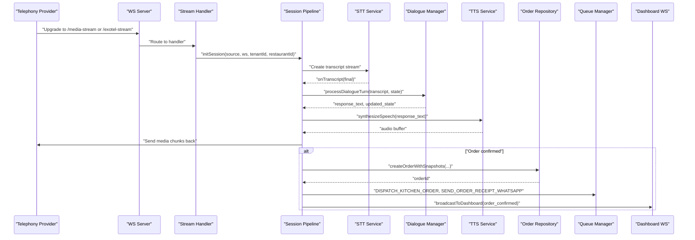
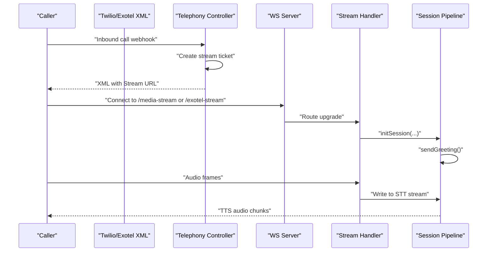
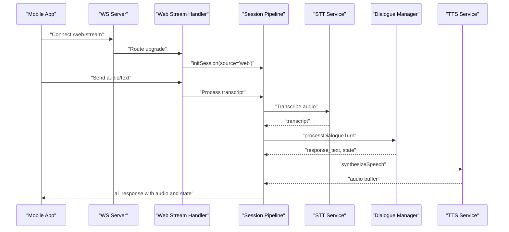
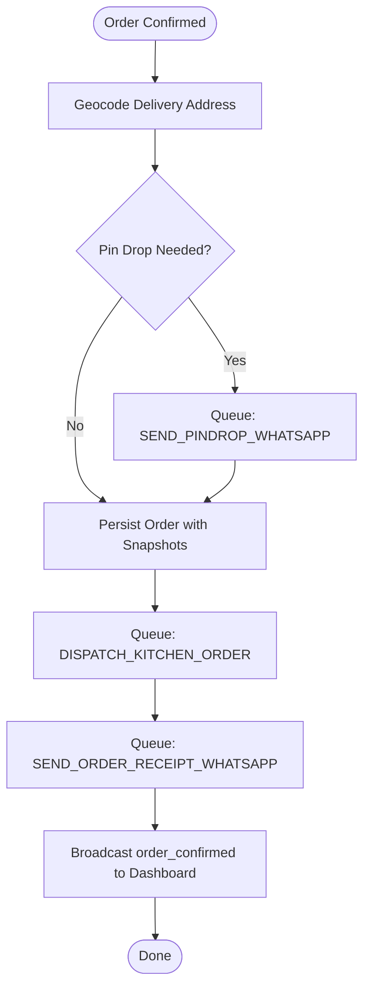
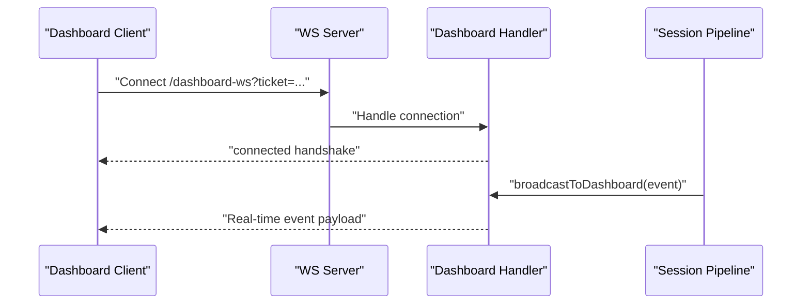
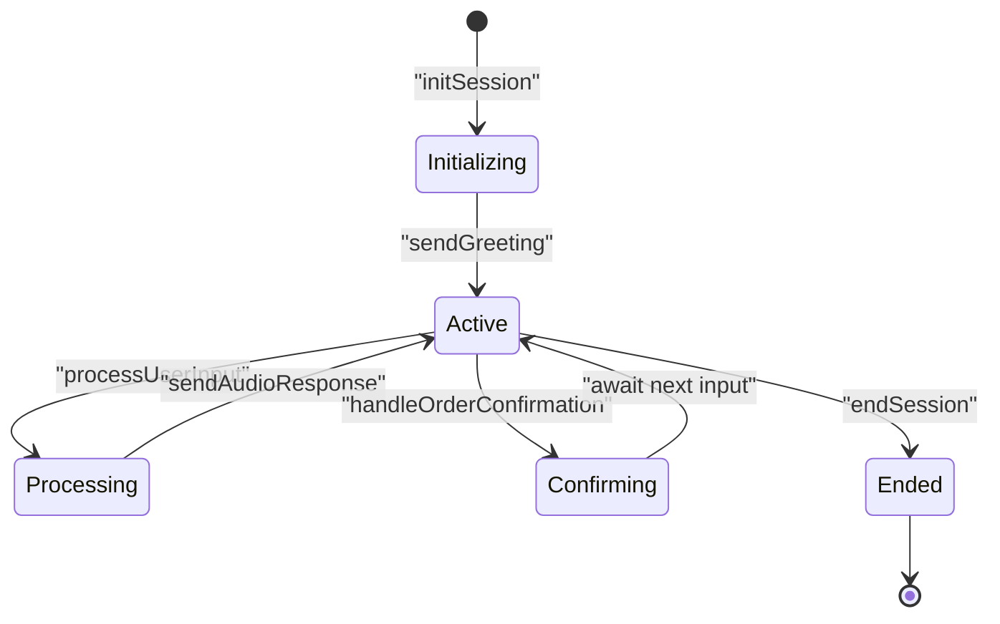
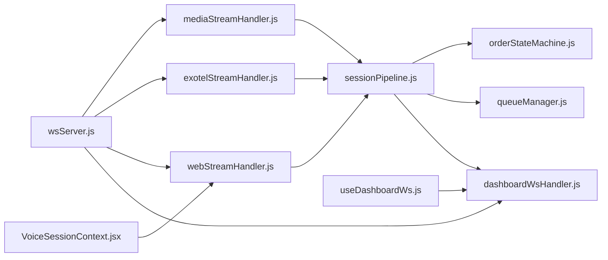

# Component Interactions & Data Flow

<cite>
**Referenced Files in This Document**
- [wsServer.js](file://server/src/websocket/wsServer.js)
- [dashboardWsHandler.js](file://server/src/websocket/dashboardWsHandler.js)
- [mediaStreamHandler.js](file://server/src/websocket/mediaStreamHandler.js)
- [exotelStreamHandler.js](file://server/src/websocket/exotelStreamHandler.js)
- [webStreamHandler.js](file://server/src/websocket/webStreamHandler.js)
- [sessionPipeline.js](file://server/src/websocket/sessionPipeline.js)
- [telephony.controller.js](file://server/src/controllers/telephony.controller.js)
- [orderStateMachine.js](file://server/src/domain/orders/orderStateMachine.js)
- [queueManager.js](file://server/src/queue/queueManager.js)
- [useDashboardWs.js](file://client/src/hooks/useDashboardWs.js)
- [LiveCallMonitor.jsx](file://client/src/components/LiveCallMonitor.jsx)
- [voiceSocketService.js](file://mobile/src/services/voiceSocketService.js)
- [VoiceSessionContext.jsx](file://mobile/src/context/VoiceSessionContext.jsx)
</cite>

## Table of Contents
1. [Introduction](#introduction)
2. [Project Structure](#project-structure)
3. [Core Components](#core-components)
4. [Architecture Overview](#architecture-overview)
5. [Detailed Component Analysis](#detailed-component-analysis)
6. [Dependency Analysis](#dependency-analysis)
7. [Performance Considerations](#performance-considerations)
8. [Troubleshooting Guide](#troubleshooting-guide)
9. [Conclusion](#conclusion)

## Introduction
This document explains how voice calls from telephony providers flow through the Inkiro platform’s WebSocket pipeline to AI processing services and finally to order management. It also details real-time communication patterns between the React dashboard, mobile app, and backend services using WebSockets. The focus is on session lifecycle, message routing, event propagation, sequence flows for call initiation, voice processing, order creation, and status updates, as well as error handling, retry mechanisms, and connection resilience.

## Project Structure
The platform consists of:
- Backend WebSocket server that authenticates and routes connections to specialized handlers (Twilio media stream, Exotel AgentStream, web audio stream, and dashboard events).
- Session pipeline that manages STT, dialogue processing, TTS, order confirmation, and asynchronous side effects via queues.
- Frontend clients: a React dashboard for monitoring and operations, and a mobile app for push-to-talk ordering with live transcription and AI responses.

```mermaid
graph TB
subgraph "Telephony Providers"
Twilio["Twilio PSTN"]
Exotel["Exotel PSTN"]
end
subgraph "Backend Server"
WSS["WebSocket Server<br/>wsServer.js"]
MediaH["Media Stream Handler<br/>mediaStreamHandler.js"]
ExoH["Exotel Stream Handler<br/>exotelStreamHandler.js"]
WebH["Web Stream Handler<br/>webStreamHandler.js"]
DashH["Dashboard WS Handler<br/>dashboardWsHandler.js"]
Pipeline["Session Pipeline<br/>sessionPipeline.js"]
SM["Order State Machine<br/>orderStateMachine.js"]
QMgr["Queue Manager<br/>queueManager.js"]
end
subgraph "Clients"
Dashboard["React Dashboard<br/>useDashboardWs.js"]
Mobile["Mobile App<br/>VoiceSessionContext.jsx + voiceSocketService.js"]
end
Twilio --> WSS
Exotel --> WSS
WSS --> MediaH
WSS --> ExoH
WSS --> WebH
WSS --> DashH
MediaH --> Pipeline
ExoH --> Pipeline
WebH --> Pipeline
Pipeline --> SM
Pipeline --> QMgr
Pipeline --> DashH
Dashboard <- --> DashH
Mobile <- --> WebH
```

**Diagram sources**
- [wsServer.js:17-160](file://server/src/websocket/wsServer.js#L17-L160)
- [mediaStreamHandler.js:7-69](file://server/src/websocket/mediaStreamHandler.js#L7-L69)
- [exotelStreamHandler.js:9-80](file://server/src/websocket/exotelStreamHandler.js#L9-L80)
- [webStreamHandler.js:7-81](file://server/src/websocket/webStreamHandler.js#L7-L81)
- [dashboardWsHandler.js:10-69](file://server/src/websocket/dashboardWsHandler.js#L10-L69)
- [sessionPipeline.js:24-437](file://server/src/websocket/sessionPipeline.js#L24-L437)
- [orderStateMachine.js:8-325](file://server/src/domain/orders/orderStateMachine.js#L8-L325)
- [queueManager.js:1-122](file://server/src/queue/queueManager.js#L1-L122)
- [useDashboardWs.js:14-128](file://client/src/hooks/useDashboardWs.js#L14-L128)
- [VoiceSessionContext.jsx:13-302](file://mobile/src/context/VoiceSessionContext.jsx#L13-L302)
- [voiceSocketService.js:3-129](file://mobile/src/services/voiceSocketService.js#L3-L129)

**Section sources**
- [wsServer.js:17-160](file://server/src/websocket/wsServer.js#L17-L160)
- [sessionPipeline.js:24-437](file://server/src/websocket/sessionPipeline.js#L24-L437)
- [useDashboardWs.js:14-128](file://client/src/hooks/useDashboardWs.js#L14-L128)
- [VoiceSessionContext.jsx:13-302](file://mobile/src/context/VoiceSessionContext.jsx#L13-L302)

## Core Components
- WebSocket Coordinator: Accepts upgrades for /media-stream, /exotel-stream, /web-stream, and /dashboard-ws; enforces authentication and routes to handlers.
- Telephony Handlers: Convert provider-specific events into normalized sessions and feed audio to STT.
- Web Stream Handler: Supports browser/mobile push-to-talk or text input, transcribing and forwarding to dialogue engine.
- Session Pipeline: Orchestrates STT streaming, dialogue turns, TTS audio streaming, order confirmation, and queue-based side effects.
- Order State Machine: Authoritative transitions for order lifecycle and validation.
- Queue Manager: Durable, idempotent workers for notifications, dispatch, and recording persistence.
- Dashboard WS: Real-time broadcast to authenticated dashboard clients with tenant/restaurant scoping.
- Clients: React dashboard monitors live calls and metrics; mobile app handles voice capture, transcription feedback, and AI speech playback.

**Section sources**
- [wsServer.js:17-160](file://server/src/websocket/wsServer.js#L17-L160)
- [mediaStreamHandler.js:7-69](file://server/src/websocket/mediaStreamHandler.js#L7-L69)
- [exotelStreamHandler.js:9-80](file://server/src/websocket/exotelStreamHandler.js#L9-L80)
- [webStreamHandler.js:7-81](file://server/src/websocket/webStreamHandler.js#L7-L81)
- [sessionPipeline.js:24-437](file://server/src/websocket/sessionPipeline.js#L24-L437)
- [orderStateMachine.js:8-325](file://server/src/domain/orders/orderStateMachine.js#L8-L325)
- [queueManager.js:1-122](file://server/src/queue/queueManager.js#L1-L122)
- [dashboardWsHandler.js:10-69](file://server/src/websocket/dashboardWsHandler.js#L10-L69)
- [useDashboardWs.js:14-128](file://client/src/hooks/useDashboardWs.js#L14-L128)
- [VoiceSessionContext.jsx:13-302](file://mobile/src/context/VoiceSessionContext.jsx#L13-L302)

## Architecture Overview
The system uses a hub-and-spoke WebSocket architecture with strict per-path authentication and tenant-scoped broadcasting. Telephony streams are normalized into a shared session pipeline that coordinates STT, LLM-driven dialogue, TTS, and order fulfillment. Clients receive real-time updates via dedicated dashboards or direct web-stream channels.



**Diagram sources**
- [wsServer.js:23-146](file://server/src/websocket/wsServer.js#L23-L146)
- [mediaStreamHandler.js:21-55](file://server/src/websocket/mediaStreamHandler.js#L21-L55)
- [exotelStreamHandler.js:23-67](file://server/src/websocket/exotelStreamHandler.js#L23-L67)
- [sessionPipeline.js:24-389](file://server/src/websocket/sessionPipeline.js#L24-L389)
- [dashboardWsHandler.js:43-69](file://server/src/websocket/dashboardWsHandler.js#L43-L69)

## Detailed Component Analysis

### Telephony Inbound Call Flow (Twilio and Exotel)
- Webhook endpoints generate secure stream tickets and return XML/Twiml directing providers to WebSocket endpoints.
- On provider “start” events, handlers initialize sessions with tenant context and send an initial greeting.
- Audio frames are streamed to STT; final transcripts trigger dialogue processing and TTS responses.



**Diagram sources**
- [telephony.controller.js:15-41](file://server/src/controllers/telephony.controller.js#L15-L41)
- [wsServer.js:99-146](file://server/src/websocket/wsServer.js#L99-L146)
- [mediaStreamHandler.js:21-55](file://server/src/websocket/mediaStreamHandler.js#L21-L55)
- [exotelStreamHandler.js:23-67](file://server/src/websocket/exotelStreamHandler.js#L23-L67)
- [sessionPipeline.js:116-127](file://server/src/websocket/sessionPipeline.js#L116-L127)

**Section sources**
- [telephony.controller.js:15-41](file://server/src/controllers/telephony.controller.js#L15-L41)
- [mediaStreamHandler.js:7-69](file://server/src/websocket/mediaStreamHandler.js#L7-L69)
- [exotelStreamHandler.js:9-80](file://server/src/websocket/exotelStreamHandler.js#L9-L80)

### Web/Mobile Voice Interaction Flow
- Mobile app connects to /web-stream with optional auth/ticket, sends recorded audio or text, receives STT transcripts and AI responses.
- React dashboard can also use /web-stream for simulation or testing.



**Diagram sources**
- [webStreamHandler.js:7-81](file://server/src/websocket/webStreamHandler.js#L7-L81)
- [sessionPipeline.js:132-294](file://server/src/websocket/sessionPipeline.js#L132-L294)
- [voiceSocketService.js:11-89](file://mobile/src/services/voiceSocketService.js#L11-L89)
- [VoiceSessionContext.jsx:42-130](file://mobile/src/context/VoiceSessionContext.jsx#L42-L130)

**Section sources**
- [webStreamHandler.js:7-81](file://server/src/websocket/webStreamHandler.js#L7-L81)
- [voiceSocketService.js:3-129](file://mobile/src/services/voiceSocketService.js#L3-L129)
- [VoiceSessionContext.jsx:13-302](file://mobile/src/context/VoiceSessionContext.jsx#L13-L302)

### Order Confirmation and Fulfillment
- When the dialogue state reaches “confirmed,” the pipeline persists the order with snapshots, updates caller history, and offloads dispatch and notifications to queues.
- Address geocoding and pin-drop prompts are triggered asynchronously when needed.



**Diagram sources**
- [sessionPipeline.js:299-389](file://server/src/websocket/sessionPipeline.js#L299-L389)
- [queueManager.js:15-75](file://server/src/queue/queueManager.js#L15-L75)
- [dashboardWsHandler.js:43-69](file://server/src/websocket/dashboardWsHandler.js#L43-L69)

**Section sources**
- [sessionPipeline.js:299-389](file://server/src/websocket/sessionPipeline.js#L299-L389)
- [orderStateMachine.js:154-325](file://server/src/domain/orders/orderStateMachine.js#L154-L325)
- [queueManager.js:1-122](file://server/src/queue/queueManager.js#L1-L122)

### Real-Time Dashboard Communication
- Dashboard clients authenticate via single-use tickets or bearer tokens and receive tenant-scoped events.
- Events include call_started, stt_transcript, ai_response, tts_complete, order_confirmed, call_ended, and more.



**Diagram sources**
- [wsServer.js:34-72](file://server/src/websocket/wsServer.js#L34-L72)
- [dashboardWsHandler.js:10-69](file://server/src/websocket/dashboardWsHandler.js#L10-L69)
- [sessionPipeline.js:54-73](file://server/src/websocket/sessionPipeline.js#L54-L73)
- [useDashboardWs.js:45-109](file://client/src/hooks/useDashboardWs.js#L45-L109)

**Section sources**
- [dashboardWsHandler.js:10-69](file://server/src/websocket/dashboardWsHandler.js#L10-L69)
- [useDashboardWs.js:14-128](file://client/src/hooks/useDashboardWs.js#L14-L128)
- [LiveCallMonitor.jsx:10-50](file://client/src/components/LiveCallMonitor.jsx#L10-L50)

### Session Lifecycle Management
- Initialization sets up STT stream, conversation history, tenant context, and DB record.
- Processing user input updates state, logs latency, and triggers order confirmation if applicable.
- Ending sessions closes STT, persists recordings, and broadcasts call summary.



**Diagram sources**
- [sessionPipeline.js:24-111](file://server/src/websocket/sessionPipeline.js#L24-L111)
- [sessionPipeline.js:132-219](file://server/src/websocket/sessionPipeline.js#L132-L219)
- [sessionPipeline.js:299-389](file://server/src/websocket/sessionPipeline.js#L299-L389)
- [sessionPipeline.js:394-437](file://server/src/websocket/sessionPipeline.js#L394-L437)

**Section sources**
- [sessionPipeline.js:24-437](file://server/src/websocket/sessionPipeline.js#L24-L437)

## Dependency Analysis
Key dependencies and coupling:
- wsServer.js depends on all stream handlers and ticket verification; it centralizes upgrade and routing.
- Stream handlers depend on sessionPipeline for lifecycle and orchestration.
- sessionPipeline depends on STT/TTS services, dialogue manager, order repository, geocoding service, and queue manager.
- dashboardWsHandler provides tenant-scoped broadcasting used by sessionPipeline and controllers.
- Clients depend on their respective services to connect and handle events.



**Diagram sources**
- [wsServer.js:17-160](file://server/src/websocket/wsServer.js#L17-L160)
- [mediaStreamHandler.js:7-69](file://server/src/websocket/mediaStreamHandler.js#L7-L69)
- [exotelStreamHandler.js:9-80](file://server/src/websocket/exotelStreamHandler.js#L9-L80)
- [webStreamHandler.js:7-81](file://server/src/websocket/webStreamHandler.js#L7-L81)
- [sessionPipeline.js:24-437](file://server/src/websocket/sessionPipeline.js#L24-L437)
- [orderStateMachine.js:8-325](file://server/src/domain/orders/orderStateMachine.js#L8-L325)
- [queueManager.js:1-122](file://server/src/queue/queueManager.js#L1-L122)
- [useDashboardWs.js:14-128](file://client/src/hooks/useDashboardWs.js#L14-L128)
- [VoiceSessionContext.jsx:13-302](file://mobile/src/context/VoiceSessionContext.jsx#L13-L302)

**Section sources**
- [wsServer.js:17-160](file://server/src/websocket/wsServer.js#L17-L160)
- [sessionPipeline.js:24-437](file://server/src/websocket/sessionPipeline.js#L24-L437)

## Performance Considerations
- Streaming audio in small chunks reduces latency for TTS playback to callers.
- Ephemeral session cache and in-memory Map provide fast access to active sessions.
- Asynchronous queues decouple heavy tasks (dispatch, notifications, recording) from the hot path.
- Heartbeat liveness checks prevent stale connections and free resources.
- Latency tracing records turn stages (LLM, TTS) to identify bottlenecks.

[No sources needed since this section provides general guidance]

## Troubleshooting Guide
Common issues and recovery strategies:
- Authentication failures: Ensure valid tickets or bearer tokens for /dashboard-ws and /web-stream; production rejects unauthorized upgrades.
- Connection drops: Dashboard client implements exponential backoff reconnection; mobile app emits close/error events and resets state.
- STT/TTS errors: Pipeline logs errors and continues; web clients may receive fallback messages without audio.
- Order confirmation failures: Errors are logged; ensure queues are running and idempotency keys are unique.
- Tenant scoping: Dashboard broadcasts enforce tenant/restaurant boundaries; verify client roles and IDs.

**Section sources**
- [wsServer.js:34-116](file://server/src/websocket/wsServer.js#L34-L116)
- [useDashboardWs.js:80-109](file://client/src/hooks/useDashboardWs.js#L80-L109)
- [VoiceSessionContext.jsx:108-121](file://mobile/src/context/VoiceSessionContext.jsx#L108-L121)
- [sessionPipeline.js:214-219](file://server/src/websocket/sessionPipeline.js#L214-L219)
- [queueManager.js:15-75](file://server/src/queue/queueManager.js#L15-L75)

## Conclusion
The Inkiro platform orchestrates voice calls from telephony providers through a robust WebSocket pipeline that integrates STT, LLM-driven dialogue, TTS, and order management. Real-time updates reach the React dashboard and mobile app via dedicated channels, while asynchronous queues ensure reliable fulfillment and notifications. Strict authentication, tenant scoping, and resilient connection patterns maintain reliability across components.

[No sources needed since this section summarizes without analyzing specific files]