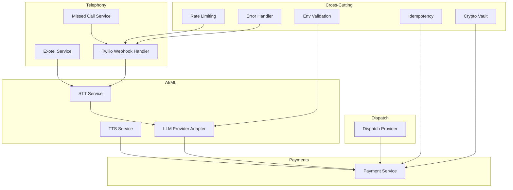
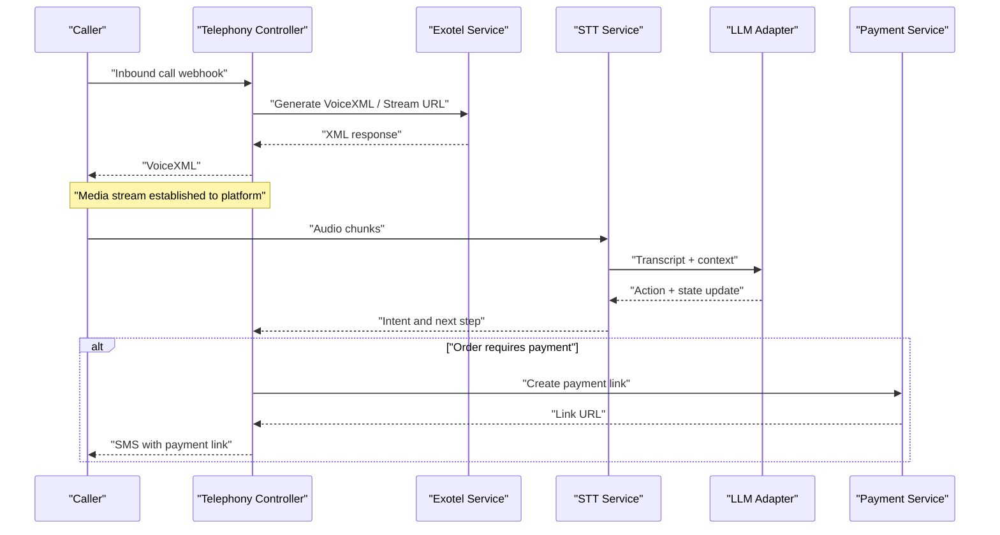
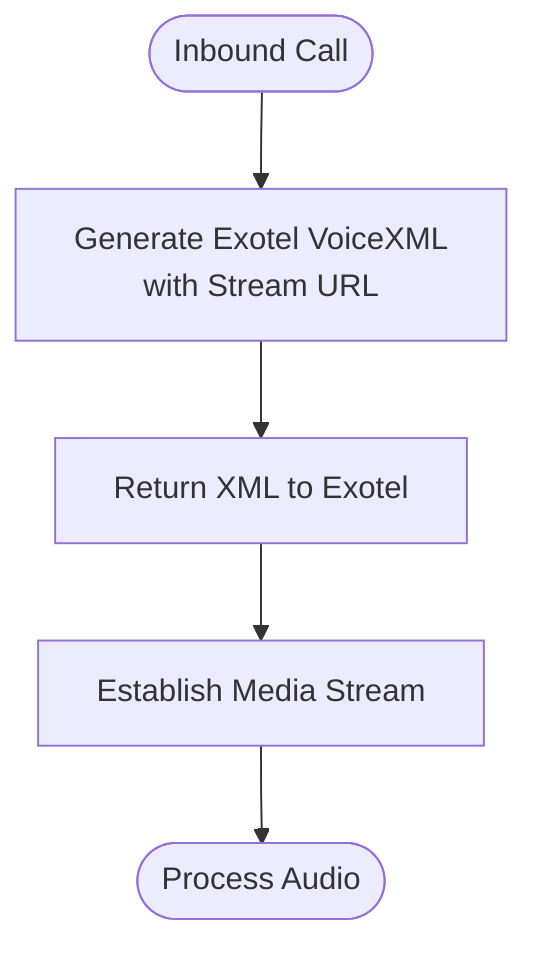
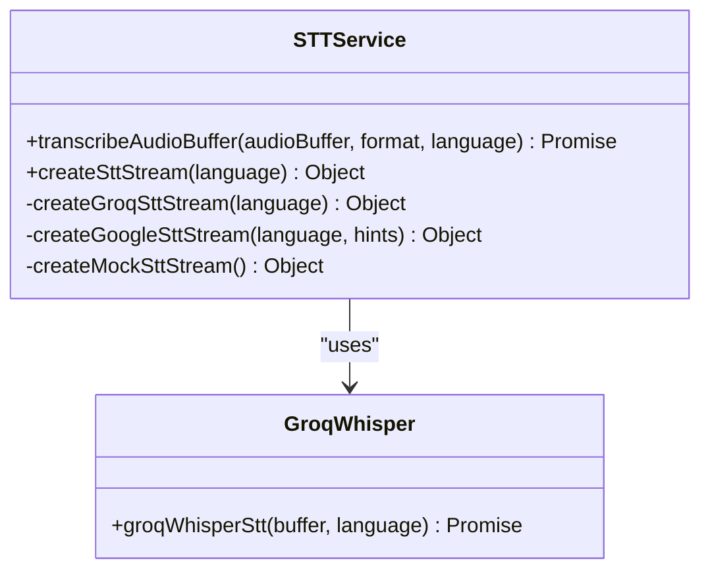
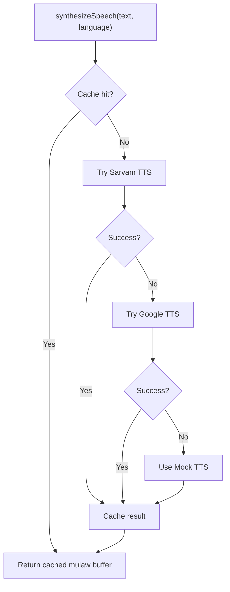
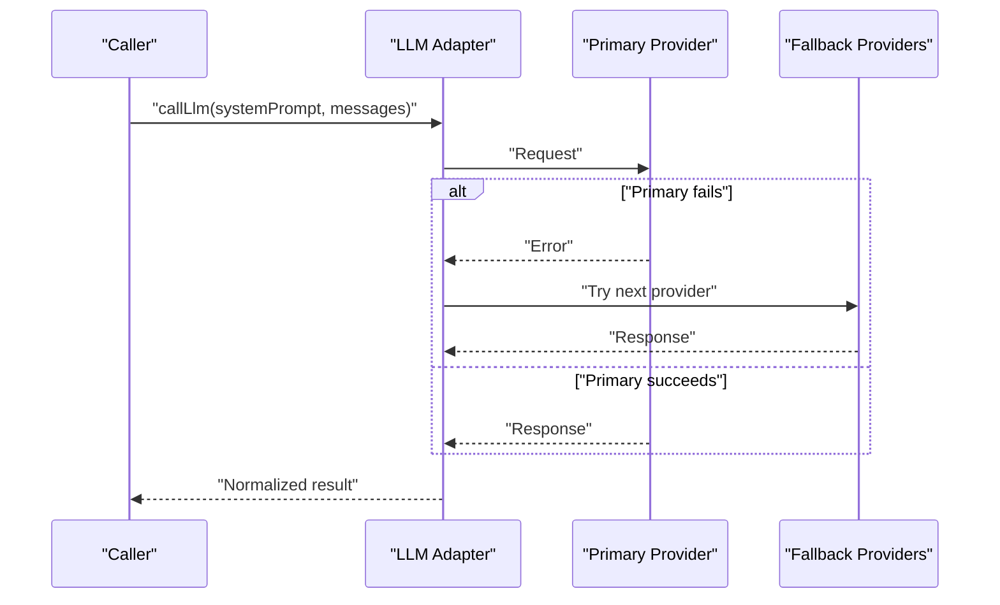
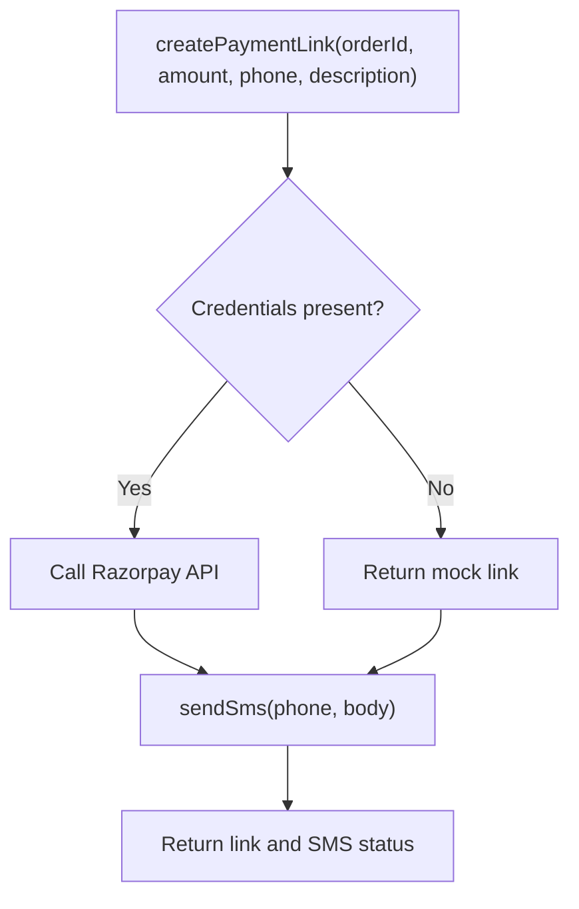
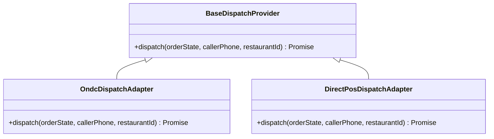
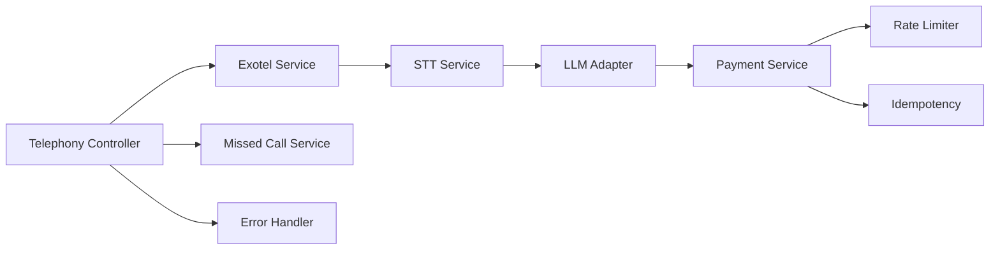

# Integration Patterns & External Services

<cite>
**Referenced Files in This Document**
- [exotelService.js](file://server/src/services/exotelService.js)
- [sttService.js](file://server/src/services/sttService.js)
- [ttsService.js](file://server/src/services/ttsService.js)
- [paymentService.js](file://server/src/services/paymentService.js)
- [llmProviderAdapter.js](file://server/src/services/llmProviderAdapter.js)
- [env.js](file://server/src/config/env.js)
- [telephony.controller.js](file://server/src/controllers/telephony.controller.js)
- [rateLimit.middleware.js](file://server/src/middleware/rateLimit.middleware.js)
- [idempotency.middleware.js](file://server/src/middleware/idempotency.middleware.js)
- [errorHandler.middleware.js](file://server/src/middleware/errorHandler.middleware.js)
- [cryptoVault.js](file://server/src/utils/cryptoVault.js)
- [DispatchProvider.js](file://server/src/integrations/dispatch/DispatchProvider.js)
- [missedCallService.js](file://server/src/services/missedCallService.js)
</cite>

## Table of Contents
1. [Introduction](#introduction)
2. [Project Structure](#project-structure)
3. [Core Components](#core-components)
4. [Architecture Overview](#architecture-overview)
5. [Detailed Component Analysis](#detailed-component-analysis)
6. [Dependency Analysis](#dependency-analysis)
7. [Performance Considerations](#performance-considerations)
8. [Troubleshooting Guide](#troubleshooting-guide)
9. [Conclusion](#conclusion)
10. [Appendices](#appendices)

## Introduction
This document explains how the Inkiro platform integrates external services through a pluggable adapter pattern. It covers telephony providers (Exotel and Twilio), AI/ML services for speech-to-text and text-to-speech, payment gateways, and LLM routing with automatic fallbacks. It also documents configuration management, error handling strategies, security considerations, rate limiting, idempotency, and guidance for integrating new providers.

## Project Structure
The integration surface is implemented as modular services under server/src/services, controllers for inbound webhooks, middleware for cross-cutting concerns (rate limits, idempotency, error handling), and adapters for dispatch to external networks or POS systems. Configuration is validated at startup.

**Diagram sources**
- [exotelService.js:1-90](file://server/src/services/exotelService.js#L1-L90)
- [telephony.controller.js:1-245](file://server/src/controllers/telephony.controller.js#L1-L245)
- [missedCallService.js:1-106](file://server/src/services/missedCallService.js#L1-L106)
- [sttService.js:1-603](file://server/src/services/sttService.js#L1-L603)
- [ttsService.js:1-187](file://server/src/services/ttsService.js#L1-L187)
- [llmProviderAdapter.js:1-283](file://server/src/services/llmProviderAdapter.js#L1-L283)
- [paymentService.js:1-114](file://server/src/services/paymentService.js#L1-L114)
- [DispatchProvider.js:1-93](file://server/src/integrations/dispatch/DispatchProvider.js#L1-L93)
- [rateLimit.middleware.js:1-52](file://server/src/middleware/rateLimit.middleware.js#L1-L52)
- [idempotency.middleware.js:1-63](file://server/src/middleware/idempotency.middleware.js#L1-L63)
- [errorHandler.middleware.js:1-42](file://server/src/middleware/errorHandler.middleware.js#L1-L42)
- [env.js:1-42](file://server/src/config/env.js#L1-L42)
- [cryptoVault.js:1-59](file://server/src/utils/cryptoVault.js#L1-L59)

**Section sources**
- [env.js:1-42](file://server/src/config/env.js#L1-L42)

## Core Components
- Telephony adapters: Exotel voice XML generation and outbound calls; Twilio webhook handler that streams media to the platform.
- AI/ML services: Multi-provider STT (Groq Whisper, Google Cloud, local Whisper, mock), multi-provider TTS (Sarvam, Google Cloud, mock), and LLM provider adapter with auto-fallback cascade.
- Payments: Razorpay payment link creation and SMS notifications via Twilio.
- Dispatch adapters: ONDC Beckn flow and direct POS fallback with a factory selector.
- Cross-cutting: Environment validation, rate limiting, idempotency, centralized error handling, and encryption utilities.

**Section sources**
- [exotelService.js:1-90](file://server/src/services/exotelService.js#L1-L90)
- [telephony.controller.js:1-245](file://server/src/controllers/telephony.controller.js#L1-L245)
- [sttService.js:1-603](file://server/src/services/sttService.js#L1-L603)
- [ttsService.js:1-187](file://server/src/services/ttsService.js#L1-L187)
- [llmProviderAdapter.js:1-283](file://server/src/services/llmProviderAdapter.js#L1-L283)
- [paymentService.js:1-114](file://server/src/services/paymentService.js#L1-L114)
- [DispatchProvider.js:1-93](file://server/src/integrations/dispatch/DispatchProvider.js#L1-L93)
- [rateLimit.middleware.js:1-52](file://server/src/middleware/rateLimit.middleware.js#L1-L52)
- [idempotency.middleware.js:1-63](file://server/src/middleware/idempotency.middleware.js#L1-L63)
- [errorHandler.middleware.js:1-42](file://server/src/middleware/errorHandler.middleware.js#L1-L42)
- [env.js:1-42](file://server/src/config/env.js#L1-L42)
- [cryptoVault.js:1-59](file://server/src/utils/cryptoVault.js#L1-L59)

## Architecture Overview
The system uses an adapter pattern to abstract external providers behind stable interfaces. Providers are selected via environment variables and fall back gracefully when unavailable. Rate limiting protects endpoints, idempotency prevents duplicate mutations, and a centralized error handler standardizes responses.

**Diagram sources**
- [telephony.controller.js:1-245](file://server/src/controllers/telephony.controller.js#L1-L245)
- [exotelService.js:1-90](file://server/src/services/exotelService.js#L1-L90)
- [sttService.js:1-603](file://server/src/services/sttService.js#L1-L603)
- [llmProviderAdapter.js:1-283](file://server/src/services/llmProviderAdapter.js#L1-L283)
- [paymentService.js:1-114](file://server/src/services/paymentService.js#L1-L114)

## Detailed Component Analysis

### Telephony Adapters (Exotel and Twilio)
- Exotel: Generates bidirectional streaming VoiceXML and triggers outbound calls. Uses environment-based credentials and falls back to mock mode when keys are missing.
- Twilio: Handles inbound webhooks by returning TwiML that connects to a WebSocket media stream. Supports missed-call callbacks and DTMF quick-reorder flows.

**Diagram sources**
- [exotelService.js:1-90](file://server/src/services/exotelService.js#L1-L90)
- [telephony.controller.js:1-245](file://server/src/controllers/telephony.controller.js#L1-L245)

**Section sources**
- [exotelService.js:1-90](file://server/src/services/exotelService.js#L1-L90)
- [telephony.controller.js:1-245](file://server/src/controllers/telephony.controller.js#L1-L245)
- [missedCallService.js:1-106](file://server/src/services/missedCallService.js#L1-L106)

### Speech-to-Text (STT) Service
- Provider selection via environment variable supports Groq Whisper, Google Cloud, local Whisper, and mock.
- Streaming interface normalizes provider differences into a common write/onTranscript/end contract.
- Includes VAD-like chunking for batch providers and catalog hints for accuracy.

**Diagram sources**
- [sttService.js:1-603](file://server/src/services/sttService.js#L1-L603)

**Section sources**
- [sttService.js:1-603](file://server/src/services/sttService.js#L1-L603)

### Text-to-Speech (TTS) Service
- Provider selection via environment variable supports Sarvam, Google Cloud, and mock.
- Returns mulaw audio buffers suitable for telephony playback.
- Caches repeated prompts to reduce latency and API usage.

**Diagram sources**
- [ttsService.js:1-187](file://server/src/services/ttsService.js#L1-L187)

**Section sources**
- [ttsService.js:1-187](file://server/src/services/ttsService.js#L1-L187)

### LLM Provider Adapter
- Universal router supporting Ollama, Groq, Gemini, and OpenRouter with automatic fallback chain based on configured primary and available keys.
- Normalizes responses to a consistent JSON schema and validates actions and items strictly.

**Diagram sources**
- [llmProviderAdapter.js:1-283](file://server/src/services/llmProviderAdapter.js#L1-L283)

**Section sources**
- [llmProviderAdapter.js:1-283](file://server/src/services/llmProviderAdapter.js#L1-L283)

### Payment Gateway Integration
- Creates Razorpay payment links with callback URLs and sends order confirmation SMS via Twilio.
- Falls back to mock implementations when credentials are not configured.

**Diagram sources**
- [paymentService.js:1-114](file://server/src/services/paymentService.js#L1-L114)

**Section sources**
- [paymentService.js:1-114](file://server/src/services/paymentService.js#L1-L114)

### Dispatch Adapters
- Abstract base provider with concrete ONDC Beckn and Direct POS adapters.
- Factory selects active provider based on environment configuration and includes fallback from ONDC to Direct POS on failure.

**Diagram sources**
- [DispatchProvider.js:1-93](file://server/src/integrations/dispatch/DispatchProvider.js#L1-L93)

**Section sources**
- [DispatchProvider.js:1-93](file://server/src/integrations/dispatch/DispatchProvider.js#L1-L93)

## Dependency Analysis
- Telephony controller depends on Exotel service and stream ticket service to establish media sessions.
- STT and TTS services depend on environment variables to select providers and may fall back to mocks.
- LLM adapter composes multiple providers and enforces a normalized response schema.
- Payment service depends on Razorpay and Twilio SDKs, with graceful fallbacks.
- Middleware provides rate limiting, idempotency, and centralized error handling across all endpoints.

**Diagram sources**
- [telephony.controller.js:1-245](file://server/src/controllers/telephony.controller.js#L1-L245)
- [exotelService.js:1-90](file://server/src/services/exotelService.js#L1-L90)
- [missedCallService.js:1-106](file://server/src/services/missedCallService.js#L1-L106)
- [sttService.js:1-603](file://server/src/services/sttService.js#L1-L603)
- [llmProviderAdapter.js:1-283](file://server/src/services/llmProviderAdapter.js#L1-L283)
- [paymentService.js:1-114](file://server/src/services/paymentService.js#L1-L114)
- [rateLimit.middleware.js:1-52](file://server/src/middleware/rateLimit.middleware.js#L1-L52)
- [idempotency.middleware.js:1-63](file://server/src/middleware/idempotency.middleware.js#L1-L63)
- [errorHandler.middleware.js:1-42](file://server/src/middleware/errorHandler.middleware.js#L1-L42)

**Section sources**
- [telephony.controller.js:1-245](file://server/src/controllers/telephony.controller.js#L1-L245)
- [exotelService.js:1-90](file://server/src/services/exotelService.js#L1-L90)
- [sttService.js:1-603](file://server/src/services/sttService.js#L1-L603)
- [llmProviderAdapter.js:1-283](file://server/src/services/llmProviderAdapter.js#L1-L283)
- [paymentService.js:1-114](file://server/src/services/paymentService.js#L1-L114)
- [rateLimit.middleware.js:1-52](file://server/src/middleware/rateLimit.middleware.js#L1-L52)
- [idempotency.middleware.js:1-63](file://server/src/middleware/idempotency.middleware.js#L1-L63)
- [errorHandler.middleware.js:1-42](file://server/src/middleware/errorHandler.middleware.js#L1-L42)

## Performance Considerations
- STT streaming uses energy-based silence detection to batch audio before transcription, reducing API calls and latency.
- TTS caches repeated prompts to avoid redundant synthesis.
- LLM adapter sets timeouts per provider and logs latency for observability.
- Rate limiting protects high-throughput endpoints like telephony webhooks.

[No sources needed since this section provides general guidance]

## Troubleshooting Guide
- Centralized error handler returns standardized JSON errors with correlation IDs and masks internal details for non-client errors.
- Idempotency middleware intercepts duplicate requests using Redis-backed keys derived from headers or payloads, preventing duplicate charges or state mutations.
- Rate limiters enforce per-endpoint quotas and return consistent 429 responses.
- Crypto vault encrypts sensitive fields and safely decrypts them, falling back to sanitized values on decryption failures.

**Section sources**
- [errorHandler.middleware.js:1-42](file://server/src/middleware/errorHandler.middleware.js#L1-L42)
- [idempotency.middleware.js:1-63](file://server/src/middleware/idempotency.middleware.js#L1-L63)
- [rateLimit.middleware.js:1-52](file://server/src/middleware/rateLimit.middleware.js#L1-L52)
- [cryptoVault.js:1-59](file://server/src/utils/cryptoVault.js#L1-L59)

## Conclusion
The Inkiro platform implements a robust, pluggable integration architecture using adapters for telephony, AI/ML, payments, and dispatch. Provider selection is driven by environment configuration with safe fallbacks. Cross-cutting concerns such as rate limiting, idempotency, and centralized error handling ensure reliability and security. The design enables easy addition of new providers while maintaining a consistent interface and predictable behavior.

[No sources needed since this section summarizes without analyzing specific files]

## Appendices

### How to Integrate a New Telephony Provider
- Implement a provider-specific module that generates the required markup (e.g., TwiML or VoiceXML) and handles inbound webhooks similarly to Exotel/Twilio handlers.
- Wire it into the telephony controller by adding a route and mapping incoming events to your adapter.
- Use environment variables to enable/disable the provider and provide mock fallbacks during development.

**Section sources**
- [telephony.controller.js:1-245](file://server/src/controllers/telephony.controller.js#L1-L245)
- [exotelService.js:1-90](file://server/src/services/exotelService.js#L1-L90)

### How to Add a New STT Provider
- Implement a function that accepts audio buffers and returns normalized results (transcript, language, confidence).
- Register the provider in the STT service’s provider selection logic and expose a streaming interface compatible with existing consumers.
- Ensure proper error handling and fallback to other providers or mock mode.

**Section sources**
- [sttService.js:1-603](file://server/src/services/sttService.js#L1-L603)

### How to Add a New TTS Provider
- Implement synthesis that returns mulaw audio buffers for telephony playback.
- Add provider selection logic similar to existing TTS implementation and integrate caching if appropriate.
- Provide mock output for development environments.

**Section sources**
- [ttsService.js:1-187](file://server/src/services/ttsService.js#L1-L187)

### How to Add a New LLM Provider
- Define provider configuration including base URL, model(s), and environment key.
- Implement a call function that conforms to the adapter’s expected input/output shape.
- Update the fallback chain to include the new provider and ensure timeout and error handling are consistent.

**Section sources**
- [llmProviderAdapter.js:1-283](file://server/src/services/llmProviderAdapter.js#L1-L283)

### Security Considerations
- Store API keys in environment variables and validate required keys at startup where applicable.
- Encrypt sensitive PII using the crypto vault before storage and decrypt only when necessary.
- Apply rate limiting to all public and webhook endpoints to mitigate abuse.
- Use idempotency keys for state-changing operations to prevent duplicates from retries.

**Section sources**
- [env.js:1-42](file://server/src/config/env.js#L1-L42)
- [cryptoVault.js:1-59](file://server/src/utils/cryptoVault.js#L1-L59)
- [rateLimit.middleware.js:1-52](file://server/src/middleware/rateLimit.middleware.js#L1-L52)
- [idempotency.middleware.js:1-63](file://server/src/middleware/idempotency.middleware.js#L1-L63)