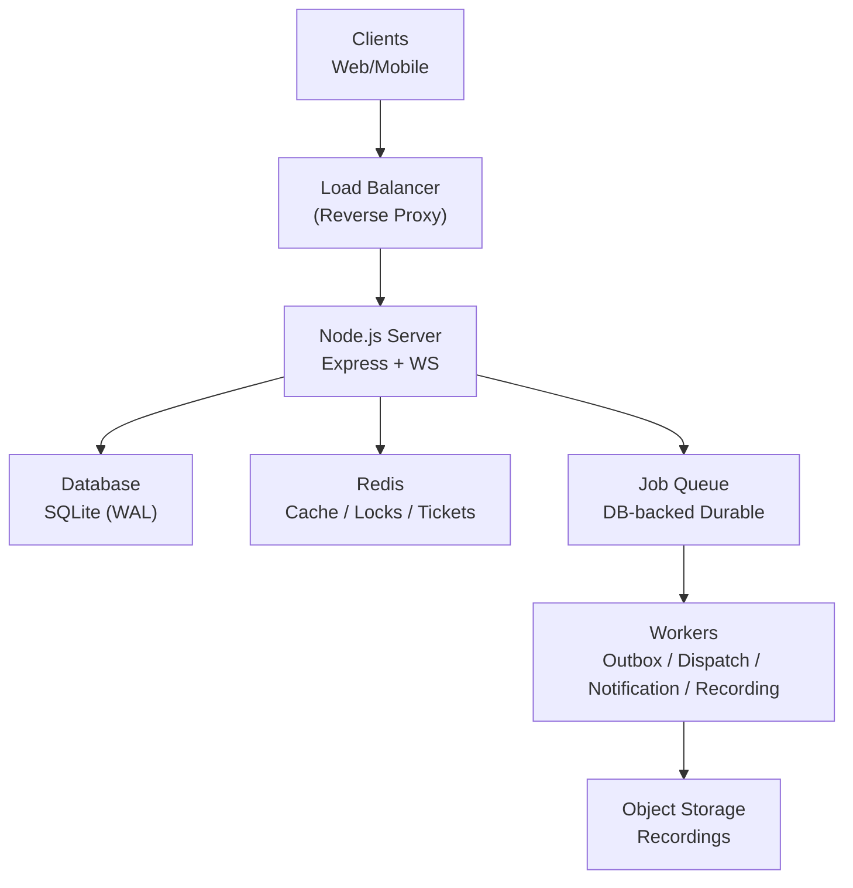
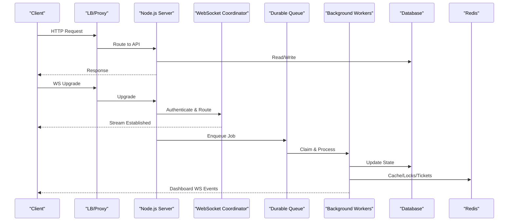
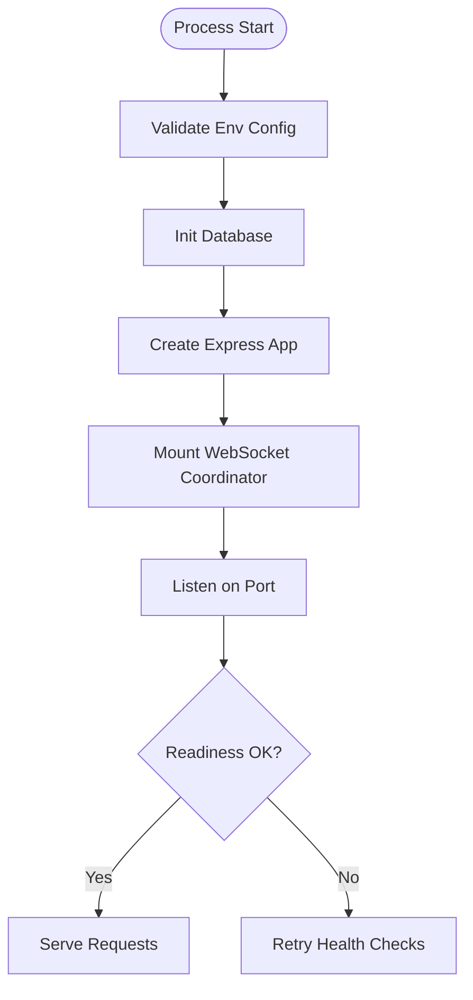
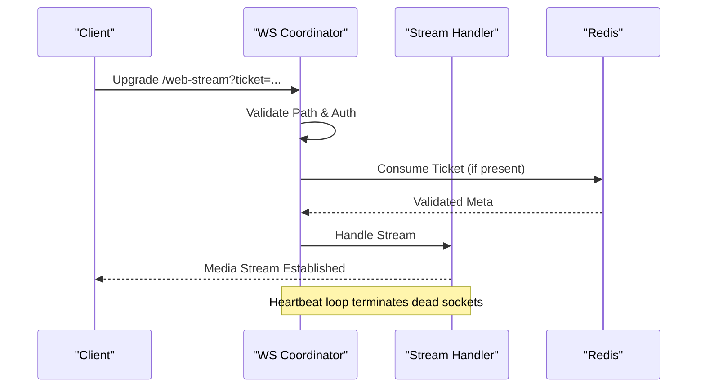
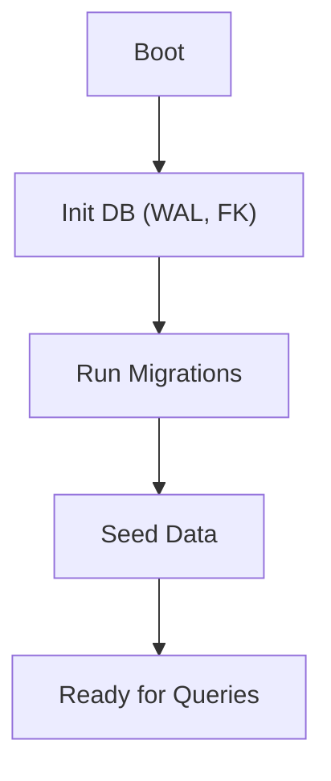
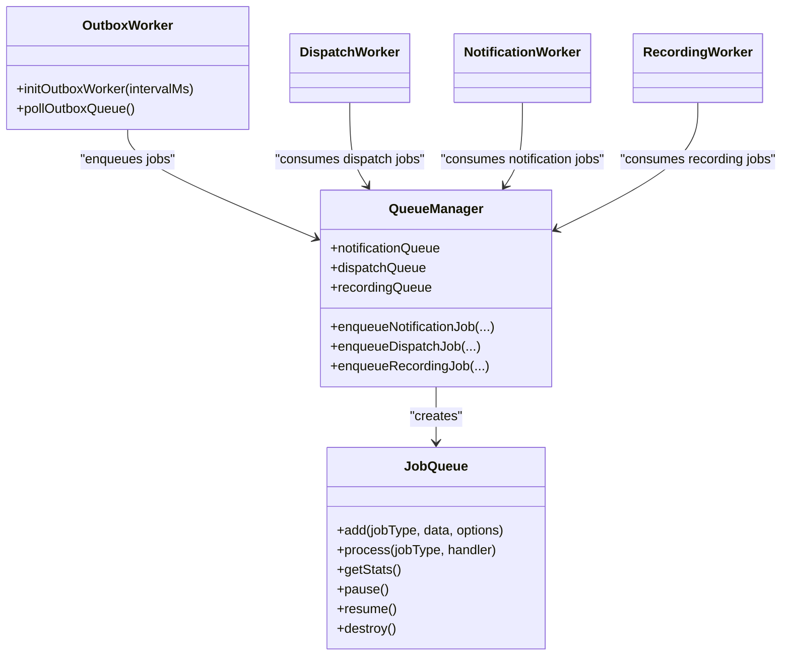
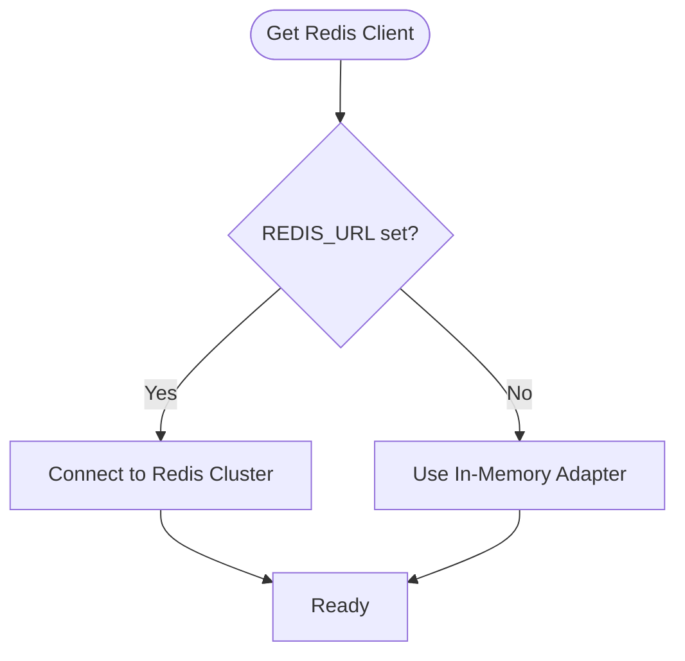
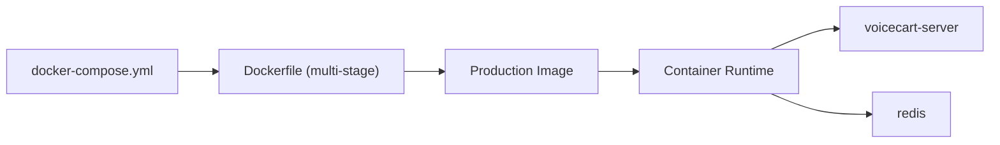
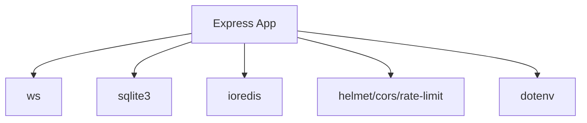

# Scalability & Deployment Architecture

<cite>
**Referenced Files in This Document**
- [Dockerfile](file://Dockerfile)
- [docker-compose.yml](file://docker-compose.yml)
- [server.js](file://server/server.js)
- [app.js](file://server/src/app.js)
- [env.js](file://server/src/config/env.js)
- [wsServer.js](file://server/src/websocket/wsServer.js)
- [jobQueue.js](file://server/src/queue/jobQueue.js)
- [queueManager.js](file://server/src/queue/queueManager.js)
- [outbox.worker.js](file://server/src/workers/outbox.worker.js)
- [dispatch.worker.js](file://server/src/workers/dispatch.worker.js)
- [notification.worker.js](file://server/src/workers/notification.worker.js)
- [recording.worker.js](file://server/src/workers/recording.worker.js)
- [db.js](file://server/src/db.js)
- [redisClient.js](file://server/src/infra/redisClient.js)
</cite>

## Table of Contents
1. Introduction
2. Project Structure
3. Core Components
4. Architecture Overview
5. Detailed Component Analysis
6. Dependency Analysis
7. Performance Considerations
8. Troubleshooting Guide
9. Conclusion
10. Appendices

## Introduction
This document provides a comprehensive scalability and deployment guide for the Inkiro Voice Commerce Platform. It focuses on horizontal scaling strategies for the Node.js backend, WebSocket connection management under load, database scaling considerations, containerization with Docker and docker-compose for development, worker process architecture for background jobs, queue management, caching with Redis, deployment topologies, environment-specific configurations, monitoring setup, performance optimization techniques, load balancing considerations, and disaster recovery planning for production.

## Project Structure
The platform is composed of:
- A Node.js Express HTTP server that exposes REST APIs and mounts WebSocket endpoints for media streams, web audio streaming, and dashboard updates.
- A durable, database-backed job queue engine for asynchronous tasks (notifications, dispatching, recordings).
- Background workers for outbox events, order dispatch, notifications, and recording persistence.
- A Redis client adapter that supports external Redis in production and an in-memory fallback in development.
- SQLite as the default database with migrations and seed data; designed to be replaceable or scaled via WAL mode and read replicas when needed.
- Container definitions for local development using Docker and docker-compose.

**Diagram sources**
- [server.js:18-47](file://server/server.js#L18-L47)
- [app.js:15-99](file://server/src/app.js#L15-L99)
- [wsServer.js:17-161](file://server/src/websocket/wsServer.js#L17-L161)
- [jobQueue.js:14-249](file://server/src/queue/jobQueue.js#L14-L249)
- [queueManager.js:1-122](file://server/src/queue/queueManager.js#L1-L122)
- [redisClient.js:82-125](file://server/src/infra/redisClient.js#L82-L125)
- [db.js:11-44](file://server/src/db.js#L11-L44)

**Section sources**
- [server.js:18-47](file://server/server.js#L18-L47)
- [app.js:15-99](file://server/src/app.js#L15-L99)
- [docker-compose.yml:1-51](file://docker-compose.yml#L1-L51)
- [Dockerfile:1-35](file://Dockerfile#L1-L35)

## Core Components
- HTTP API and health probes: The application sets up security headers, CORS, request limits, and readiness/liveness endpoints for orchestration.
- WebSocket coordinator: Centralized upgrade handling with per-path authentication and routing to stream handlers.
- Durable job queue: Database-backed queue with atomic claiming, retries, backoff, DLQ, and stale job recovery.
- Background workers: Outbox poller and dedicated workers for dispatch, notifications, and recordings.
- Redis client adapter: Production-grade Redis connectivity with in-memory fallback for dev/test.
- Database layer: SQLite initialization with WAL and foreign keys, plus migration and seed execution.

**Section sources**
- [app.js:15-99](file://server/src/app.js#L15-L99)
- [wsServer.js:17-161](file://server/src/websocket/wsServer.js#L17-L161)
- [jobQueue.js:14-249](file://server/src/queue/jobQueue.js#L14-L249)
- [queueManager.js:1-122](file://server/src/queue/queueManager.js#L1-L122)
- [redisClient.js:82-125](file://server/src/infra/redisClient.js#L82-L125)
- [db.js:11-44](file://server/src/db.js#L11-L44)

## Architecture Overview
The system boots a single Node.js process that serves HTTP and WebSocket traffic, persists state to a database, uses Redis for caching and distributed locks/tickets, and offloads long-running or side-effect work to background workers via a durable queue.

**Diagram sources**
- [server.js:18-47](file://server/server.js#L18-L47)
- [app.js:15-99](file://server/src/app.js#L15-L99)
- [wsServer.js:17-161](file://server/src/websocket/wsServer.js#L17-L161)
- [jobQueue.js:14-249](file://server/src/queue/jobQueue.js#L14-L249)
- [queueManager.js:1-122](file://server/src/queue/queueManager.js#L1-L122)
- [redisClient.js:82-125](file://server/src/infra/redisClient.js#L82-L125)
- [db.js:11-44](file://server/src/db.js#L11-L44)

## Detailed Component Analysis

### Horizontal Scaling Strategy for Node.js Backend
- Stateless processes: The HTTP server is stateless except for in-memory session maps used by WebSocket handlers. For multi-process or multi-container scaling, ensure shared state (sessions, tickets, locks) is stored in Redis.
- Process isolation: Each container runs one Node.js process. Scale horizontally by running multiple containers behind a reverse proxy/load balancer.
- Health checks: Liveness and readiness endpoints enable orchestrators to route traffic only to healthy instances.
- Environment validation: Startup validates required environment variables to fail fast on misconfiguration.

**Diagram sources**
- [env.js:28-40](file://server/src/config/env.js#L28-L40)
- [server.js:18-47](file://server/server.js#L18-L47)
- [app.js:58-80](file://server/src/app.js#L58-L80)

**Section sources**
- [env.js:28-40](file://server/src/config/env.js#L28-L40)
- [server.js:18-47](file://server/server.js#L18-L47)
- [app.js:58-80](file://server/src/app.js#L58-L80)

### WebSocket Connection Management Under Load
- Single coordinator: All WebSocket upgrades are handled centrally with path-based routing and strict authentication per endpoint.
- Session map: Active sessions are tracked in memory within the process; for multi-instance deployments, store session metadata in Redis to allow cross-process visibility.
- Heartbeat: Ping/pong liveness checks terminate dead connections automatically.
- Payload limits: Maximum payload size is enforced to protect resources.

**Diagram sources**
- [wsServer.js:17-161](file://server/src/websocket/wsServer.js#L17-L161)
- [redisClient.js:82-125](file://server/src/infra/redisClient.js#L82-L125)

**Section sources**
- [wsServer.js:17-161](file://server/src/websocket/wsServer.js#L17-L161)

### Database Scaling Considerations
- Current implementation uses SQLite with WAL enabled for better concurrency and durability.
- Migrations and seed data run at startup to ensure schema consistency.
- For higher throughput or multi-node write scaling, consider migrating to a relational database with connection pooling and read replicas, while preserving transactional guarantees for critical paths.

**Diagram sources**
- [db.js:11-44](file://server/src/db.js#L11-L44)

**Section sources**
- [db.js:11-44](file://server/src/db.js#L11-L44)

### Worker Process Architecture and Queue Management
- Durable queue: Jobs are persisted to the database with atomic claiming, retry with exponential backoff, and DLQ routing for unrecoverable failures.
- Dedicated queues: Separate queues for notifications, dispatch, and recordings with configurable concurrency and retries.
- Workers:
  - Outbox worker polls and processes outbox events, enqueues downstream jobs, and broadcasts dashboard updates.
  - Dispatch worker integrates with dispatch providers and updates order states.
  - Notification worker sends SMS/WhatsApp receipts and pin-drop requests.
  - Recording worker persists audio to storage and records metadata.

**Diagram sources**
- [jobQueue.js:14-249](file://server/src/queue/jobQueue.js#L14-L249)
- [queueManager.js:1-122](file://server/src/queue/queueManager.js#L1-L122)
- [outbox.worker.js:1-131](file://server/src/workers/outbox.worker.js#L1-L131)
- [dispatch.worker.js:1-56](file://server/src/workers/dispatch.worker.js#L1-L56)
- [notification.worker.js:1-72](file://server/src/workers/notification.worker.js#L1-L72)
- [recording.worker.js:1-53](file://server/src/workers/recording.worker.js#L1-L53)

**Section sources**
- [jobQueue.js:14-249](file://server/src/queue/jobQueue.js#L14-L249)
- [queueManager.js:1-122](file://server/src/queue/queueManager.js#L1-L122)
- [outbox.worker.js:1-131](file://server/src/workers/outbox.worker.js#L1-L131)
- [dispatch.worker.js:1-56](file://server/src/workers/dispatch.worker.js#L1-L56)
- [notification.worker.js:1-72](file://server/src/workers/notification.worker.js#L1-L72)
- [recording.worker.js:1-53](file://server/src/workers/recording.worker.js#L1-L53)

### Caching Strategies with Redis
- Production requirement: REDIS_URL must be set in production; otherwise, the service fails fast to avoid silent degradation.
- Development fallback: An in-memory adapter mimics Redis behavior for local development without external dependencies.
- Use cases: Distributed locks, single-use tickets for WebSocket upgrades, cache hot paths, and cluster-wide session visibility.

**Diagram sources**
- [redisClient.js:82-125](file://server/src/infra/redisClient.js#L82-L125)

**Section sources**
- [redisClient.js:82-125](file://server/src/infra/redisClient.js#L82-L125)

### Containerization and Orchestration (Development)
- Multi-stage build: Frontend assets are built in a separate stage and copied into the final image to minimize size.
- Health check: The container exposes a health endpoint for orchestrators to verify readiness.
- docker-compose: Defines the server and Redis services with persistent volumes and environment configuration for local development.

**Diagram sources**
- [docker-compose.yml:1-51](file://docker-compose.yml#L1-L51)
- [Dockerfile:1-35](file://Dockerfile#L1-L35)

**Section sources**
- [docker-compose.yml:1-51](file://docker-compose.yml#L1-L51)
- [Dockerfile:1-35](file://Dockerfile#L1-L35)

### Deployment Topologies for Cloud Platforms
- Reverse proxy/load balancer: Place a managed load balancer (e.g., cloud LB, NGINX, Traefik) in front of multiple Node.js containers to distribute HTTP and WebSocket traffic.
- Stateless app scaling: Scale horizontally by increasing container count; ensure Redis and database are externally managed and highly available.
- Worker scaling: Run additional worker processes or containers consuming from the same durable queues to increase throughput.
- Observability: Expose health endpoints and integrate metrics/logs to your observability stack.

[No sources needed since this section provides general guidance]

### Environment-Specific Configurations
- Required variables include port, environment mode, JWT secret, encryption key, database path, Redis URL, public URL, CORS origins, and provider keys.
- Validation occurs at startup to prevent runtime surprises.

**Section sources**
- [env.js:3-40](file://server/src/config/env.js#L3-L40)

### Monitoring Setup
- Health endpoints: Liveness (/health/live) and readiness (/health, /health/ready) provide signals for orchestration and load balancers.
- Queue stats: Queues expose statistics for operational visibility.
- Logging: Structured logging throughout components aids debugging and alerting.

**Section sources**
- [app.js:58-80](file://server/src/app.js#L58-L80)
- [jobQueue.js:214-234](file://server/src/queue/jobQueue.js#L214-L234)

## Dependency Analysis
Key runtime dependencies and their roles:
- Express: HTTP framework and middleware pipeline.
- ws: WebSocket server for real-time streams and dashboards.
- ioredis: Redis client for caching, locks, and tickets.
- sqlite3: Embedded database with WAL for durability and concurrency.
- dotenv: Environment loading.
- helmet/cors/rate-limit: Security and request controls.

**Diagram sources**
- [app.js:1-10](file://server/src/app.js#L1-L10)
- [server/package.json:12-26](file://server/package.json#L12-L26)

**Section sources**
- [server/package.json:12-26](file://server/package.json#L12-L26)

## Performance Considerations
- Connection limits: Enforce maximum payload sizes and request body limits to mitigate resource exhaustion.
- Queue concurrency: Tune queue concurrency and retries to match workload characteristics and downstream capacity.
- Database tuning: Keep SQLite WAL enabled; consider read replicas or a managed SQL database for high write throughput.
- Redis usage: Use Redis for hot caches and distributed locks; ensure network latency is minimized.
- WebSocket heartbeats: Configure ping intervals to detect dead peers quickly and free resources.
- Backpressure: Apply rate limiting and graceful degradation under load spikes.

[No sources needed since this section provides general guidance]

## Troubleshooting Guide
- Startup failures: Invalid environment variables cause immediate failure during validation; correct missing or malformed values.
- Redis errors: In production, missing REDIS_URL or connection errors will fail fast; ensure Redis is reachable and credentials are correct.
- Database issues: If migrations fail, inspect logs and ensure the database file path is writable and accessible.
- Queue stalls: Check queue stats and DLQ entries; investigate failed jobs and adjust concurrency or retry policies.
- WebSocket disconnects: Monitor heartbeat failures and ensure clients send pongs; verify firewall rules for WS upgrades.

**Section sources**
- [env.js:28-40](file://server/src/config/env.js#L28-L40)
- [redisClient.js:82-125](file://server/src/infra/redisClient.js#L82-L125)
- [db.js:11-44](file://server/src/db.js#L11-L44)
- [jobQueue.js:182-211](file://server/src/queue/jobQueue.js#L182-L211)
- [wsServer.js:149-158](file://server/src/websocket/wsServer.js#L149-L158)

## Conclusion
The Inkiro Voice Commerce Platform is designed for scalable, resilient operations through a stateless Node.js backend, robust WebSocket handling, durable background processing, and flexible caching via Redis. With containerized development and clear health endpoints, it can be deployed across cloud platforms with horizontal scaling, proper load balancing, and comprehensive monitoring. Adopting these practices ensures reliability under load and maintainability in production.

[No sources needed since this section summarizes without analyzing specific files]

## Appendices

### Disaster Recovery Planning
- Database backups: Schedule regular backups of the database file or migrate to a managed service with automated snapshots and point-in-time recovery.
- Redis persistence: Enable Redis persistence (AOF/RDB) and configure replication for resilience.
- Queue integrity: Leverage the durable queue’s DLQ to capture and reprocess failed jobs after incidents.
- Rollback strategy: Maintain versioned images and use blue/green or rolling updates to minimize downtime during deployments.

[No sources needed since this section provides general guidance]