# System Design & Architecture Patterns

<cite>
**Referenced Files in This Document**
- [app.js](file://server/src/app.js)
- [package.json](file://server/package.json)
- [Dockerfile](file://Dockerfile)
- [docker-compose.yml](file://docker-compose.yml)
- [001_initial_multitenant_schema.sql](file://server/src/db/migrations/001_initial_multitenant_schema.sql)
- [rbac.middleware.js](file://server/src/middleware/rbac.middleware.js)
- [orderStateMachine.js](file://server/src/domain/orders/orderStateMachine.js)
- [dispatchStateMachine.js](file://server/src/domain/dispatch/dispatchStateMachine.js)
- [wsServer.js](file://server/src/websocket/wsServer.js)
- [App.jsx](file://client/src/App.jsx)
- [useDashboardWs.js](file://client/src/hooks/useDashboardWs.js)
- [voiceSocketService.js](file://mobile/src/services/voiceSocketService.js)
- [auth.service.js](file://server/src/services/auth.service.js)
- [env.js](file://server/src/config/env.js)
- [redisClient.js](file://server/src/infra/redisClient.js)
- [index.js](file://server/src/routes/v1/index.js)
</cite>

## Table of Contents
1. Introduction
2. Project Structure
3. Core Components
4. Architecture Overview
5. Detailed Component Analysis
6. Dependency Analysis
7. Performance Considerations
8. Troubleshooting Guide
9. Conclusion

## Introduction
This document describes the system design and architectural patterns of the Inkiro Voice Commerce Platform. It explains multi-tenant isolation, role-based access control (RBAC), data segregation, and the three-tier structure: an Express.js backend API server, a React dashboard frontend, and a React Native mobile application. It also documents Domain-Driven Design with state machines, Repository-style data access, Event-Driven Architecture for real-time communication, service decomposition, technology stack decisions, scalability considerations, containerization with Docker, and deployment topology across development and production environments.

## Project Structure
The platform is organized into three primary applications plus shared infrastructure and security tooling:
- Backend API server (Express.js) under server/src
- Dashboard frontend (React + Vite) under client/src
- Mobile app (React Native + Expo) under mobile/src
- Infrastructure and configuration: Dockerfile, docker-compose.yml, environment validation, Redis client
- Security suite for auditing and sandboxing

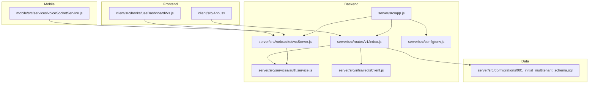

**Diagram sources**
- [app.js:15-100](file://server/src/app.js#L15-L100)
- [index.js:27-140](file://server/src/routes/v1/index.js#L27-L140)
- [wsServer.js:17-162](file://server/src/websocket/wsServer.js#L17-L162)
- [auth.service.js:50-120](file://server/src/services/auth.service.js#L50-L120)
- [env.js:1-42](file://server/src/config/env.js#L1-L42)
- [redisClient.js:82-127](file://server/src/infra/redisClient.js#L82-L127)
- [001_initial_multitenant_schema.sql:12-222](file://server/src/db/migrations/001_initial_multitenant_schema.sql#L12-L222)
- [App.jsx:15-161](file://client/src/App.jsx#L15-L161)
- [useDashboardWs.js:14-128](file://client/src/hooks/useDashboardWs.js#L14-L128)
- [voiceSocketService.js:3-129](file://mobile/src/services/voiceSocketService.js#L3-L129)

**Section sources**
- [app.js:15-100](file://server/src/app.js#L15-L100)
- [package.json:1-32](file://server/package.json#L1-L32)
- [Dockerfile:1-35](file://Dockerfile#L1-L35)
- [docker-compose.yml:1-51](file://docker-compose.yml#L1-L51)

## Core Components
- Multi-tenant schema and data segregation: Tenants, restaurants, branches, catalog, customers, orders, calls, conversations, recordings are scoped by tenant_id and restaurant_id to enforce isolation at the database level.
- RBAC enforcement: Role guards restrict access to endpoints and resources based on user roles (ADMIN, RESTAURANT_MANAGER, STAFF, KITCHEN).
- State machines for domain logic: Order lifecycle and dispatch/kitchen fulfillment are modeled as explicit state machines with strict transitions and history tracking.
- Real-time eventing: WebSocket server coordinates dashboard updates and media streams with secure upgrade flows and per-path authentication.
- Authentication and tokens: JWT-based auth with short-lived access tokens and refresh token rotation persisted in the database; environment validation ensures secure defaults.
- Resilient clients: Dashboard uses a custom hook to manage authenticated WebSocket connections with auto-reconnect backoff; mobile provides a resilient voice socket service for streaming audio/text/DTMF.

**Section sources**
- [001_initial_multitenant_schema.sql:12-222](file://server/src/db/migrations/001_initial_multitenant_schema.sql#L12-L222)
- [rbac.middleware.js:1-32](file://server/src/middleware/rbac.middleware.js#L1-L32)
- [orderStateMachine.js:8-325](file://server/src/domain/orders/orderStateMachine.js#L8-L325)
- [dispatchStateMachine.js:9-147](file://server/src/domain/dispatch/dispatchStateMachine.js#L9-L147)
- [wsServer.js:17-162](file://server/src/websocket/wsServer.js#L17-L162)
- [auth.service.js:50-203](file://server/src/services/auth.service.js#L50-L203)
- [env.js:1-42](file://server/src/config/env.js#L1-L42)
- [useDashboardWs.js:14-128](file://client/src/hooks/useDashboardWs.js#L14-L128)
- [voiceSocketService.js:3-129](file://mobile/src/services/voiceSocketService.js#L3-L129)

## Architecture Overview
The platform follows a three-tier architecture with clear boundaries:
- Frontend tier: React dashboard and React Native mobile app communicate via REST APIs and WebSockets.
- Application tier: Express.js server exposes versioned REST routes, middleware for security and rate limiting, and WebSocket handlers for real-time features.
- Data tier: SQLite/PostgreSQL schema enforces multi-tenancy; Redis provides caching, sessions, and distributed state where needed.

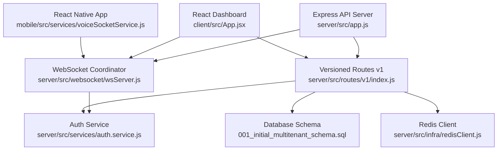

**Diagram sources**
- [App.jsx:15-161](file://client/src/App.jsx#L15-L161)
- [voiceSocketService.js:3-129](file://mobile/src/services/voiceSocketService.js#L3-L129)
- [app.js:15-100](file://server/src/app.js#L15-L100)
- [wsServer.js:17-162](file://server/src/websocket/wsServer.js#L17-L162)
- [auth.service.js:50-120](file://server/src/services/auth.service.js#L50-L120)
- [index.js:27-140](file://server/src/routes/v1/index.js#L27-L140)
- [001_initial_multitenant_schema.sql:12-222](file://server/src/db/migrations/001_initial_multitenant_schema.sql#L12-L222)
- [redisClient.js:82-127](file://server/src/infra/redisClient.js#L82-L127)

## Detailed Component Analysis

### Multi-Tenant Architecture and Data Segregation
- Tenant scoping: All core entities include tenant_id and many include restaurant_id to ensure strict data isolation across tenants and locations.
- Schema design: Tables for tenants, users, restaurants, branches, catalog items/categories, customers, addresses, calls, conversations, orders, order items, and call recordings provide a normalized foundation for voice commerce workflows.
- Access control: RBAC middleware enforces role-based permissions on protected routes, while route-level guards further constrain operations by role.

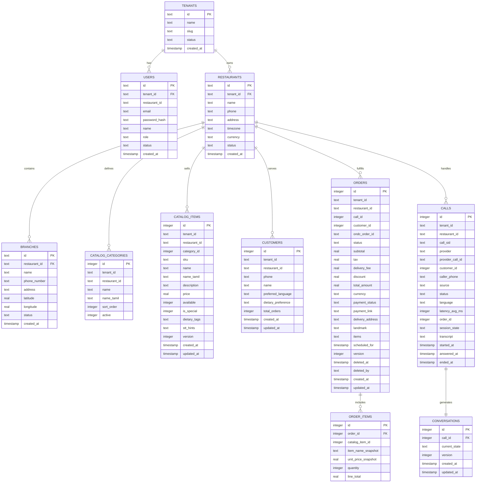

**Diagram sources**
- [001_initial_multitenant_schema.sql:12-222](file://server/src/db/migrations/001_initial_multitenant_schema.sql#L12-L222)

**Section sources**
- [001_initial_multitenant_schema.sql:12-222](file://server/src/db/migrations/001_initial_multitenant_schema.sql#L12-L222)
- [rbac.middleware.js:1-32](file://server/src/middleware/rbac.middleware.js#L1-L32)
- [index.js:27-140](file://server/src/routes/v1/index.js#L27-L140)

### Role-Based Access Control (RBAC)
- Roles: ADMIN, RESTAURANT_MANAGER, STAFF, KITCHEN defined centrally.
- Guard: requireRole middleware checks user role from request context and denies access if insufficient, returning standardized errors.
- Route protection: Protected routes apply authMiddleware and requireRole to enforce least privilege.

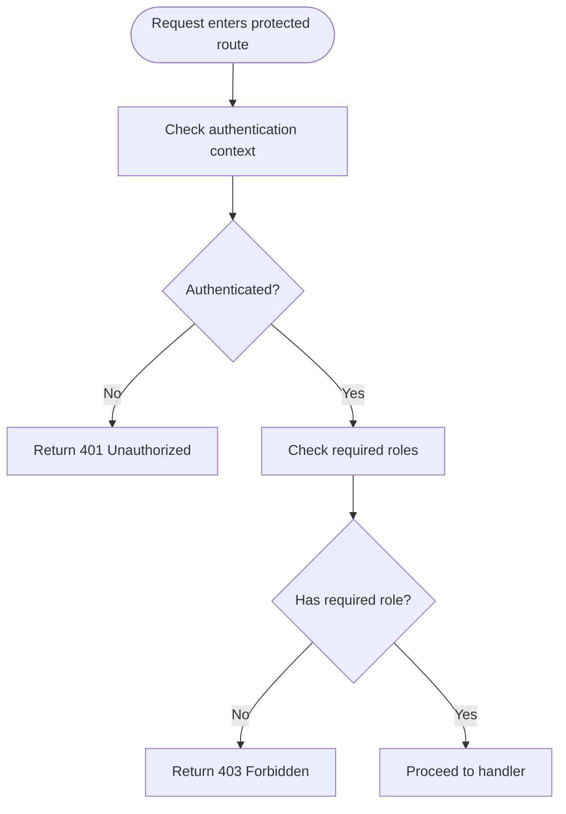

**Diagram sources**
- [rbac.middleware.js:1-32](file://server/src/middleware/rbac.middleware.js#L1-L32)
- [index.js:35-137](file://server/src/routes/v1/index.js#L35-L137)

**Section sources**
- [rbac.middleware.js:1-32](file://server/src/middleware/rbac.middleware.js#L1-L32)
- [index.js:35-137](file://server/src/routes/v1/index.js#L35-L137)

### Domain-Driven Design with State Machines
- Order state machine: Governs order lifecycle from creation through confirmation, payment, dispatch, completion, cancellation, and dispute handling. Enforces legal transitions and maintains history.
- Dispatch state machine: Separates kitchen/delivery workflow from order lifecycle, supporting modes like direct or ONDC integration.

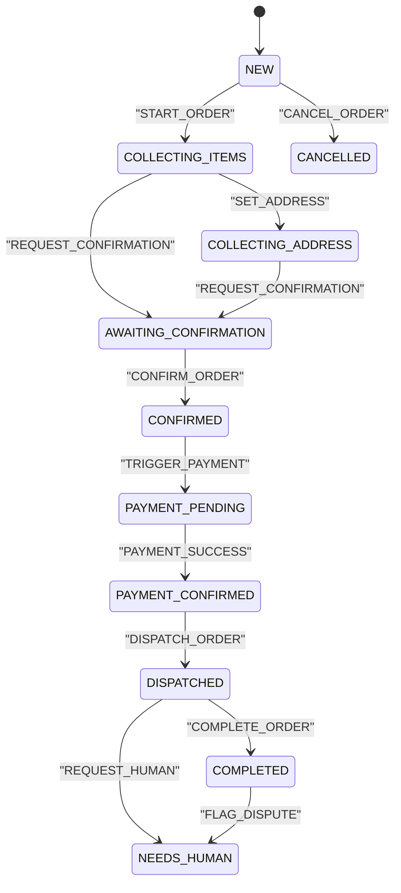

**Diagram sources**
- [orderStateMachine.js:8-325](file://server/src/domain/orders/orderStateMachine.js#L8-L325)

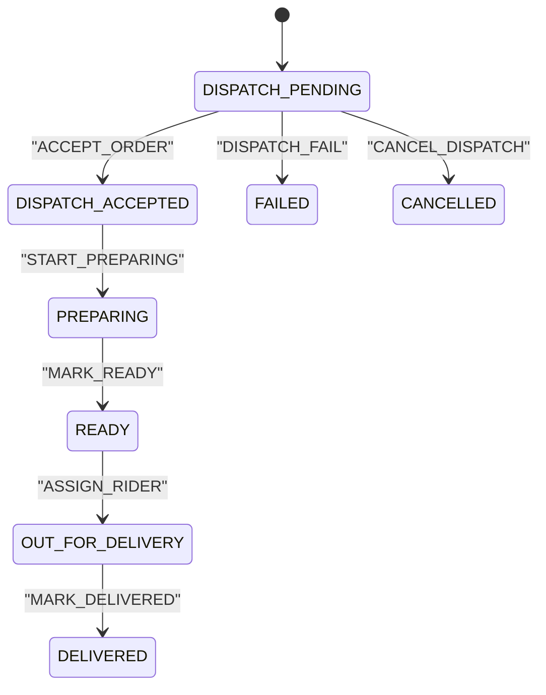

**Diagram sources**
- [dispatchStateMachine.js:9-147](file://server/src/domain/dispatch/dispatchStateMachine.js#L9-L147)

**Section sources**
- [orderStateMachine.js:8-325](file://server/src/domain/orders/orderStateMachine.js#L8-L325)
- [dispatchStateMachine.js:9-147](file://server/src/domain/dispatch/dispatchStateMachine.js#L9-L147)

### Repository Pattern for Data Access
- Centralized DB helpers: Database queries are encapsulated via dbGet/dbRun abstractions used by services and controllers, promoting consistent access patterns.
- Migration-driven schema: Versioned migrations define the authoritative schema, ensuring reproducible deployments and backward compatibility.
- Redis adapter: A unified Redis client abstracts external Redis in production and in-memory fallback in development, enabling consistent caching/session usage.

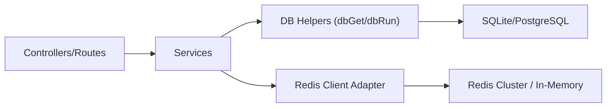

**Diagram sources**
- [index.js:27-140](file://server/src/routes/v1/index.js#L27-L140)
- [redisClient.js:82-127](file://server/src/infra/redisClient.js#L82-L127)
- [001_initial_multitenant_schema.sql:12-222](file://server/src/db/migrations/001_initial_multitenant_schema.sql#L12-L222)

**Section sources**
- [redisClient.js:82-127](file://server/src/infra/redisClient.js#L82-L127)
- [001_initial_multitenant_schema.sql:12-222](file://server/src/db/migrations/001_initial_multitenant_schema.sql#L12-L222)

### Event-Driven Architecture for Real-Time Communication
- WebSocket coordinator: Handles upgrades for multiple paths (/dashboard-ws, /media-stream, /web-stream, /exotel-stream) with per-path authentication and authorization.
- Dashboard events: The React dashboard hook manages authenticated WebSocket connections using single-use tickets or bearer tokens, with auto-reconnect backoff and live stats synchronization.
- Mobile voice streaming: The mobile voice socket service connects to the server’s web stream endpoint to send/receive audio, text, and DTMF events.

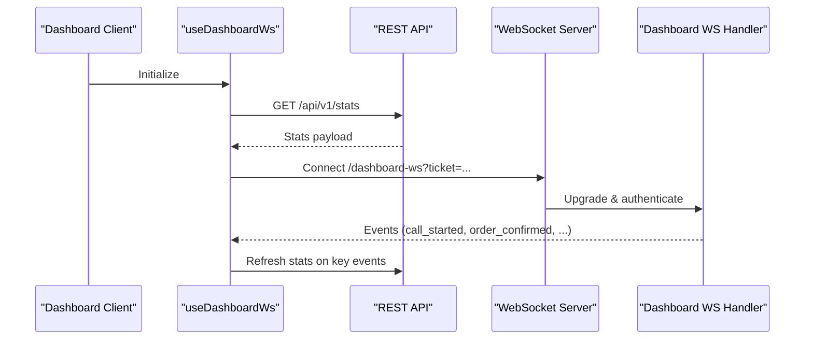

**Diagram sources**
- [useDashboardWs.js:14-128](file://client/src/hooks/useDashboardWs.js#L14-L128)
- [wsServer.js:17-162](file://server/src/websocket/wsServer.js#L17-L162)
- [index.js:27-140](file://server/src/routes/v1/index.js#L27-L140)

**Section sources**
- [wsServer.js:17-162](file://server/src/websocket/wsServer.js#L17-L162)
- [useDashboardWs.js:14-128](file://client/src/hooks/useDashboardWs.js#L14-L128)
- [voiceSocketService.js:3-129](file://mobile/src/services/voiceSocketService.js#L3-L129)

### Authentication and Token Management
- JWT issuance: Short-lived access tokens include tenant and restaurant context; refresh tokens are persisted with JTI for rotation and revocation.
- Verification: Tokens are verified against configured issuer and audience; invalid tokens result in standardized errors.
- Environment validation: Strict schema validates critical secrets and URLs at startup to prevent misconfiguration.

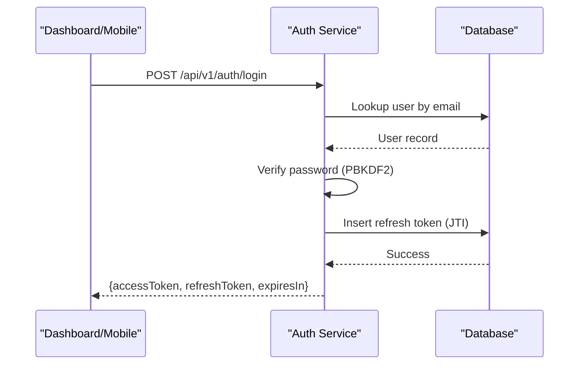

**Diagram sources**
- [auth.service.js:50-203](file://server/src/services/auth.service.js#L50-L203)
- [env.js:1-42](file://server/src/config/env.js#L1-L42)

**Section sources**
- [auth.service.js:50-203](file://server/src/services/auth.service.js#L50-L203)
- [env.js:1-42](file://server/src/config/env.js#L1-L42)

### Three-Tier Application Structure
- Backend API server: Express application configures security headers, CORS, body limits, health probes, mounts routers, and starts background workers.
- Dashboard frontend: React app renders views, manages theme, displays metrics, and integrates with WebSocket events for live updates.
- Mobile application: React Native app provides voice interaction capabilities via resilient WebSocket streaming and controls.

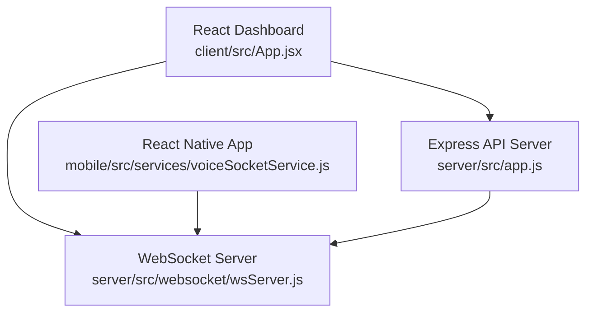

**Diagram sources**
- [App.jsx:15-161](file://client/src/App.jsx#L15-L161)
- [app.js:15-100](file://server/src/app.js#L15-L100)
- [voiceSocketService.js:3-129](file://mobile/src/services/voiceSocketService.js#L3-L129)
- [wsServer.js:17-162](file://server/src/websocket/wsServer.js#L17-L162)

**Section sources**
- [app.js:15-100](file://server/src/app.js#L15-L100)
- [App.jsx:15-161](file://client/src/App.jsx#L15-L161)
- [voiceSocketService.js:3-129](file://mobile/src/services/voiceSocketService.js#L3-L129)

## Dependency Analysis
- External dependencies: Express, ws, ioredis, jose (JWT), sqlite3, zod (validation), helmet/cors for security, Twilio for telephony, and AI providers via environment keys.
- Internal coupling: Routes depend on auth, RBAC, validation, and queue managers; WebSocket server depends on auth service and ticket services; domain state machines are decoupled from I/O layers.
- Potential circularities: None observed; modules follow layered architecture with clear import directions.

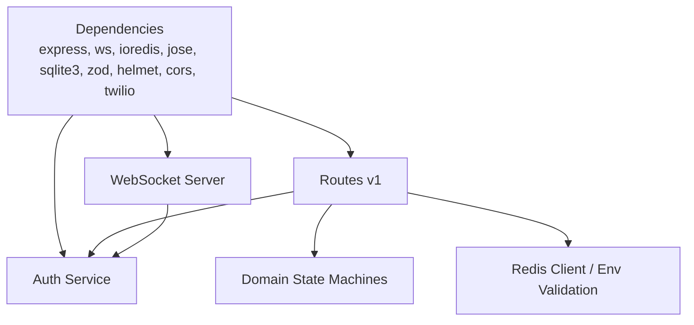

**Diagram sources**
- [package.json:12-27](file://server/package.json#L12-L27)
- [index.js:27-140](file://server/src/routes/v1/index.js#L27-L140)
- [wsServer.js:17-162](file://server/src/websocket/wsServer.js#L17-L162)
- [auth.service.js:50-120](file://server/src/services/auth.service.js#L50-L120)
- [orderStateMachine.js:8-325](file://server/src/domain/orders/orderStateMachine.js#L8-L325)
- [redisClient.js:82-127](file://server/src/infra/redisClient.js#L82-L127)
- [env.js:1-42](file://server/src/config/env.js#L1-L42)

**Section sources**
- [package.json:12-27](file://server/package.json#L12-L27)
- [index.js:27-140](file://server/src/routes/v1/index.js#L27-L140)
- [wsServer.js:17-162](file://server/src/websocket/wsServer.js#L17-L162)
- [redisClient.js:82-127](file://server/src/infra/redisClient.js#L82-L127)
- [env.js:1-42](file://server/src/config/env.js#L1-L42)

## Performance Considerations
- Request limits: JSON and URL-encoded bodies are limited to reduce abuse and memory pressure.
- Health checks: Liveness and readiness endpoints enable orchestrators to scale and restart instances safely.
- Redis fallback: Development uses in-memory storage for speed; production requires Redis for durability and clustering.
- WebSocket heartbeats: Periodic pings detect dead connections and free resources.
- Background workers: Outbox worker persists events reliably without blocking request paths.

[No sources needed since this section provides general guidance]

## Troubleshooting Guide
- Authentication failures: Invalid or expired tokens return standardized errors; verify JWT_SECRET length and configuration.
- WebSocket upgrade errors: Unauthorized or forbidden responses indicate missing or invalid tickets/tokens; ensure correct query parameters and environment mode.
- Redis connectivity: Production requires REDIS_URL; connection errors will fail closed to protect stability.
- Environment validation: Startup fails fast if required variables are missing or invalid; check PORT, NODE_ENV, JWT_SECRET, ENCRYPTION_KEY, and CORS_ORIGINS.

**Section sources**
- [auth.service.js:110-120](file://server/src/services/auth.service.js#L110-L120)
- [wsServer.js:34-116](file://server/src/websocket/wsServer.js#L34-L116)
- [redisClient.js:82-127](file://server/src/infra/redisClient.js#L82-L127)
- [env.js:28-42](file://server/src/config/env.js#L28-L42)

## Conclusion
The Inkiro Voice Commerce Platform implements a robust, multi-tenant, role-aware architecture with clear separation between presentation, application, and data layers. Domain state machines enforce business rules, while event-driven WebSockets deliver real-time experiences across dashboard and mobile clients. Containerization and environment validation support reliable deployments, and Redis-backed services enable scalable performance. This design balances security, maintainability, and extensibility for voice commerce at scale.

[No sources needed since this section summarizes without analyzing specific files]