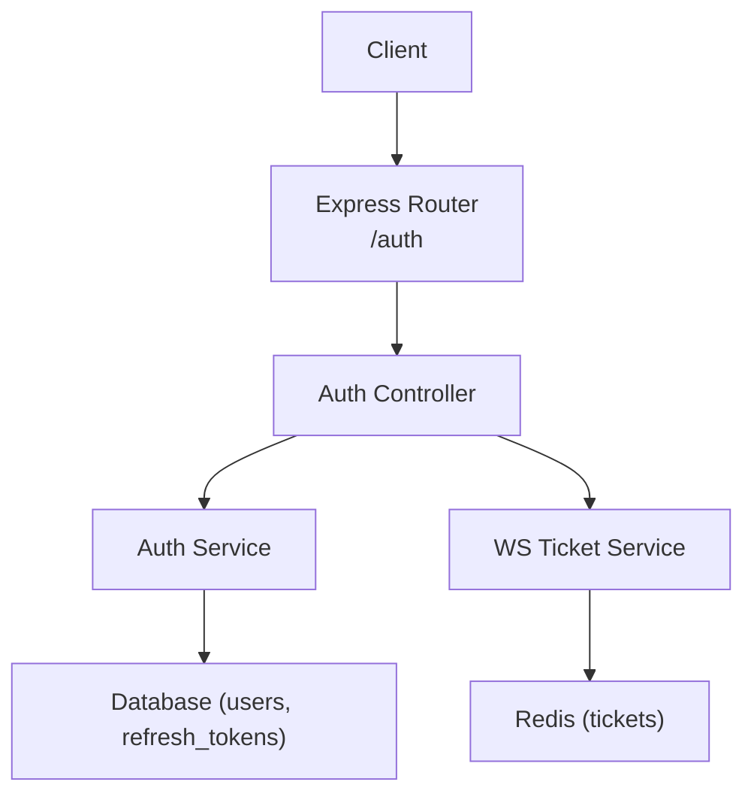
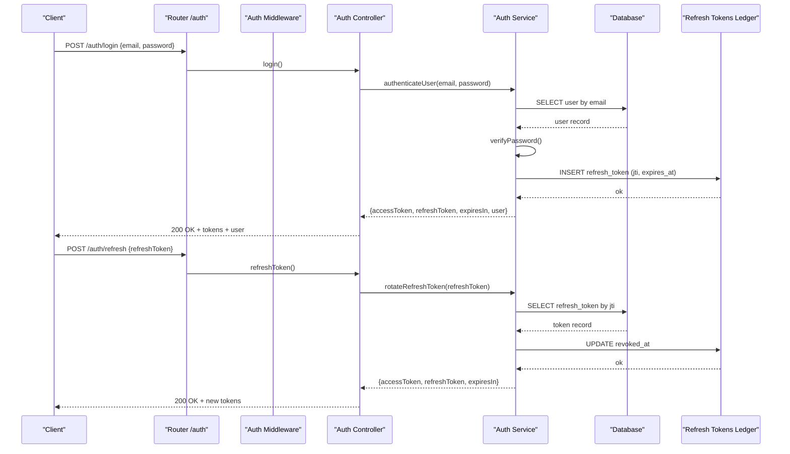
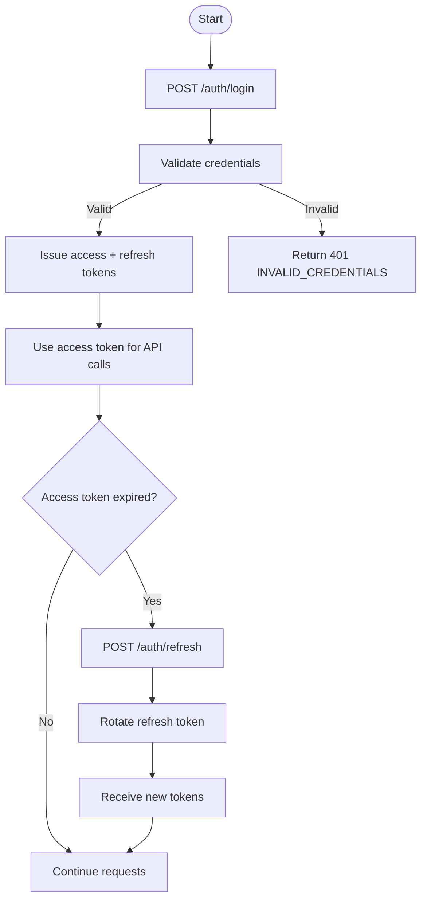
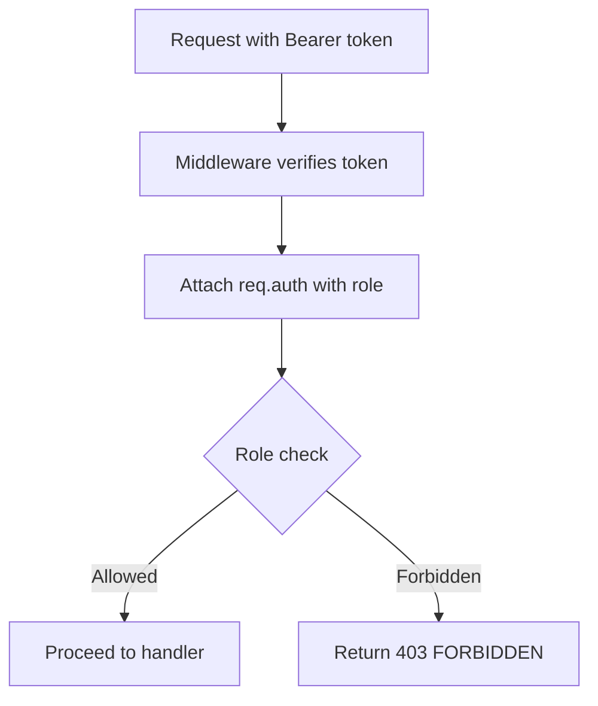
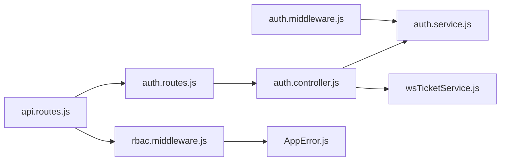

# Authentication API

<cite>
**Referenced Files in This Document**
- [auth.routes.js](file://server/src/routes/auth.routes.js)
- [auth.controller.js](file://server/src/controllers/auth.controller.js)
- [auth.service.js](file://server/src/services/auth.service.js)
- [auth.middleware.js](file://server/src/middleware/auth.middleware.js)
- [rbac.middleware.js](file://server/src/middleware/rbac.middleware.js)
- [wsTicketService.js](file://server/src/services/wsTicketService.js)
- [api.routes.js](file://server/src/routes/api.routes.js)
- [auth.schema.js](file://server/src/schemas/auth.schema.js)
- [AppError.js](file://server/src/utils/AppError.js)
- [001_initial_multitenant_schema.sql](file://server/src/db/migrations/001_initial_multitenant_schema.sql)
- [006_refresh_tokens.sql](file://server/src/db/migrations/006_refresh_tokens.sql)
</cite>

## Table of Contents
1. Introduction
2. Project Structure
3. Core Components
4. Architecture Overview
5. Detailed Component Analysis
6. Dependency Analysis
7. Performance Considerations
8. Troubleshooting Guide
9. Conclusion

## Introduction
This document provides comprehensive API documentation for the authentication subsystem, covering login, token refresh, session management, and role-based authorization. It explains the authentication flow, JWT token lifecycle, security measures, request/response schemas, error responses, and common usage patterns.

Note: User registration is not implemented as an endpoint in this codebase. Authentication relies on existing users stored in the database.

## Project Structure
The authentication system is organized into routes, controllers, middleware, services, and persistence layers:
- Routes define HTTP endpoints under /auth.
- Controllers handle request/response logic.
- Middleware validates tokens and enforces roles.
- Services implement JWT issuance/verification, password hashing, and token rotation.
- Database migrations define user and refresh token storage.

**Diagram sources**
- [auth.routes.js:1-12](file://server/src/routes/auth.routes.js#L1-L12)
- [auth.controller.js:1-52](file://server/src/controllers/auth.controller.js#L1-L52)
- [auth.service.js:1-203](file://server/src/services/auth.service.js#L1-L203)
- [wsTicketService.js:1-86](file://server/src/services/wsTicketService.js#L1-L86)

**Section sources**
- [auth.routes.js:1-12](file://server/src/routes/auth.routes.js#L1-L12)
- [api.routes.js:1-119](file://server/src/routes/api.routes.js#L1-L119)

## Core Components
- Authentication endpoints:
  - POST /auth/login: Authenticates a user and returns access and refresh tokens along with user profile.
  - POST /auth/refresh: Rotates a valid refresh token to obtain a new access token pair.
  - POST /auth/ws-ticket: Issues a short-lived WebSocket ticket for authenticated users.
  - GET /auth/me: Returns the current authenticated user profile.
- Token handling:
  - Access tokens are short-lived (15 minutes).
  - Refresh tokens are long-lived (7 days), single-use, and persisted in the database for revocation.
- Authorization:
  - Bearer token validation via middleware.
  - Role-based access control using predefined roles.

**Section sources**
- [auth.routes.js:1-12](file://server/src/routes/auth.routes.js#L1-L12)
- [auth.controller.js:1-52](file://server/src/controllers/auth.controller.js#L1-L52)
- [auth.service.js:47-105](file://server/src/services/auth.service.js#L47-L105)
- [auth.service.js:122-161](file://server/src/services/auth.service.js#L122-L161)
- [auth.middleware.js:1-55](file://server/src/middleware/auth.middleware.js#L1-L55)
- [rbac.middleware.js:1-32](file://server/src/middleware/rbac.middleware.js#L1-L32)

## Architecture Overview
The authentication architecture follows a layered approach:
- Client sends credentials or tokens to the API.
- Routes delegate to controllers.
- Controllers call services for business logic (authentication, token generation/rotation).
- Middleware validates tokens and attaches identity to requests.
- RBAC middleware enforces role-based permissions.
- Persistence uses a relational database for users and refresh tokens; Redis for short-lived tickets.

**Diagram sources**
- [auth.routes.js:1-12](file://server/src/routes/auth.routes.js#L1-L12)
- [auth.controller.js:1-52](file://server/src/controllers/auth.controller.js#L1-L52)
- [auth.service.js:163-203](file://server/src/services/auth.service.js#L163-L203)
- [auth.service.js:122-161](file://server/src/services/auth.service.js#L122-L161)
- [006_refresh_tokens.sql:1-16](file://server/src/db/migrations/006_refresh_tokens.sql#L1-L16)

## Detailed Component Analysis

### Endpoints

#### POST /auth/login
- Purpose: Authenticate user credentials and issue tokens.
- Request body schema:
  - email: string, valid email format
  - password: string, minimum length enforced
- Response (200 OK):
  - accessToken: string (JWT, 15m TTL)
  - refreshToken: string (JWT, 7d TTL, single-use)
  - expiresIn: number (seconds until access token expiry)
  - user: object
    - id: string
    - email: string
    - name: string
    - tenantId: string
    - restaurantId: string
    - role: string
- Errors:
  - 400 VALIDATION_ERROR: Missing or invalid fields
  - 401 INVALID_CREDENTIALS: Invalid email/password or inactive user

Example request headers:
- Content-Type: application/json

Example response:
- JSON object containing accessToken, refreshToken, expiresIn, and user profile

**Section sources**
- [auth.routes.js:1-12](file://server/src/routes/auth.routes.js#L1-L12)
- [auth.controller.js:1-52](file://server/src/controllers/auth.controller.js#L1-L52)
- [auth.schema.js:1-7](file://server/src/schemas/auth.schema.js#L1-L7)
- [auth.service.js:163-203](file://server/src/services/auth.service.js#L163-L203)
- [001_initial_multitenant_schema.sql:21-32](file://server/src/db/migrations/001_initial_multitenant_schema.sql#L21-L32)

#### POST /auth/refresh
- Purpose: Rotate a valid refresh token to obtain a new access token pair.
- Request body schema:
  - refreshToken: string (JWT REFRESH type with registered JTI)
- Response (200 OK):
  - accessToken: string (JWT, 15m TTL)
  - refreshToken: string (JWT, 7d TTL, single-use)
  - expiresIn: number (seconds until access token expiry)
- Errors:
  - 400 VALIDATION_ERROR: Missing refreshToken
  - 401 INVALID_REFRESH_TOKEN: Not a refresh token or unregistered JTI
  - 401 REFRESH_TOKEN_REVOKED: Previously used or revoked token
  - 401 USER_NOT_FOUND: Associated user no longer exists

Example request headers:
- Content-Type: application/json

Example response:
- JSON object containing new accessToken, refreshToken, and expiresIn

**Section sources**
- [auth.routes.js:1-12](file://server/src/routes/auth.routes.js#L1-L12)
- [auth.controller.js:1-52](file://server/src/controllers/auth.controller.js#L1-L52)
- [auth.service.js:122-161](file://server/src/services/auth.service.js#L122-L161)
- [006_refresh_tokens.sql:1-16](file://server/src/db/migrations/006_refresh_tokens.sql#L1-L16)

#### POST /auth/ws-ticket
- Purpose: Issue a single-use, short-lived WebSocket ticket for authenticated clients.
- Authorization: Requires valid Bearer token.
- Response (200 OK):
  - ticket: string (single-use, short TTL)
  - expiresInSeconds: number (ticket lifetime)
- Errors:
  - 401 AUTH_REQUIRED: Missing or invalid token

Example request headers:
- Authorization: Bearer <access_token>

Example response:
- JSON object containing ticket and expiresInSeconds

**Section sources**
- [auth.routes.js:1-12](file://server/src/routes/auth.routes.js#L1-L12)
- [auth.controller.js:1-52](file://server/src/controllers/auth.controller.js#L1-L52)
- [wsTicketService.js:1-86](file://server/src/services/wsTicketService.js#L1-L86)

#### GET /auth/me
- Purpose: Retrieve the current authenticated user profile.
- Authorization: Requires valid Bearer token.
- Response (200 OK):
  - user: object
    - userId: string
    - email: string
    - name: string
    - tenantId: string
    - restaurantId: string
    - role: string
- Errors:
  - 401 AUTH_REQUIRED: Missing or invalid token

Example request headers:
- Authorization: Bearer <access_token>

Example response:
- JSON object containing user profile

**Section sources**
- [auth.routes.js:1-12](file://server/src/routes/auth.routes.js#L1-L12)
- [auth.controller.js:1-52](file://server/src/controllers/auth.controller.js#L1-L52)
- [auth.middleware.js:1-55](file://server/src/middleware/auth.middleware.js#L1-L55)

### Authentication Flow
- Login flow:
  - Client submits email and password.
  - Server verifies credentials and issues a token pair.
  - Client stores both tokens and uses access token for protected endpoints.
- Refresh flow:
  - Client presents a valid refresh token.
  - Server verifies and rotates it, issuing a new token pair.
  - Old refresh token is marked as revoked.
- Session management:
  - Short-lived WebSocket tickets issued for authenticated users.
  - Tickets are single-use and expire quickly.

**Diagram sources**
- [auth.controller.js:1-52](file://server/src/controllers/auth.controller.js#L1-L52)
- [auth.service.js:163-203](file://server/src/services/auth.service.js#L163-L203)
- [auth.service.js:122-161](file://server/src/services/auth.service.js#L122-L161)

### Security Measures
- Strong JWT secret enforcement with minimum length requirement.
- HS256 algorithm with issuer and audience validation.
- Password hashing using PBKDF2 with high iteration count and unique salts.
- Single-use refresh tokens with database-backed ledger and revocation tracking.
- Strict token verification rejecting tampered or malformed tokens.
- Role-based access control with predefined roles and admin override.

**Section sources**
- [auth.service.js:7-21](file://server/src/services/auth.service.js#L7-L21)
- [auth.service.js:23-45](file://server/src/services/auth.service.js#L23-L45)
- [auth.service.js:47-105](file://server/src/services/auth.service.js#L47-L105)
- [auth.service.js:107-120](file://server/src/services/auth.service.js#L107-L120)
- [rbac.middleware.js:1-32](file://server/src/middleware/rbac.middleware.js#L1-L32)

### Role-Based Authorization Middleware
- Roles:
  - ADMIN
  - RESTAURANT_MANAGER
  - STAFF
  - KITCHEN
- Behavior:
  - Enforces that the authenticated user has one of the allowed roles.
  - Admin role can bypass specific role checks where configured.
- Usage:
  - Applied to protected routes to restrict access based on roles.

**Diagram sources**
- [auth.middleware.js:1-55](file://server/src/middleware/auth.middleware.js#L1-L55)
- [rbac.middleware.js:1-32](file://server/src/middleware/rbac.middleware.js#L1-L32)

**Section sources**
- [rbac.middleware.js:1-32](file://server/src/middleware/rbac.middleware.js#L1-L32)
- [api.routes.js:25-119](file://server/src/routes/api.routes.js#L25-L119)

### Data Models

#### Users
- Fields relevant to authentication:
  - id: string (primary key)
  - tenant_id: string (foreign key to tenants)
  - restaurant_id: string
  - email: string (unique)
  - password_hash: string (PBKDF2 hashed)
  - name: string
  - role: string (default staff)
  - status: string (active/inactive)

**Section sources**
- [001_initial_multitenant_schema.sql:21-32](file://server/src/db/migrations/001_initial_multitenant_schema.sql#L21-L32)

#### Refresh Tokens
- Fields:
  - id: integer (primary key)
  - user_id: string (foreign key to users)
  - jti: string (unique identifier)
  - expires_at: timestamp
  - revoked_at: timestamp (nullable)
  - created_at: timestamp

**Section sources**
- [006_refresh_tokens.sql:1-16](file://server/src/db/migrations/006_refresh_tokens.sql#L1-L16)

### Common Patterns and Examples

#### Authentication Headers
- Bearer token:
  - Authorization: Bearer <access_token>
- Query parameter fallback:
  - Some middleware also accepts access_token in query string for compatibility.

**Section sources**
- [auth.middleware.js:1-55](file://server/src/middleware/auth.middleware.js#L1-L55)

#### Error Responses
- Standardized error structure:
  - statusCode: number
  - code: string (machine-readable)
  - message: string (user-facing)
  - details: optional additional context
- Common codes:
  - AUTH_REQUIRED
  - INVALID_TOKEN
  - INVALID_CREDENTIALS
  - INVALID_REFRESH_TOKEN
  - REFRESH_TOKEN_REVOKED
  - USER_NOT_FOUND
  - VALIDATION_ERROR
  - FORBIDDEN

**Section sources**
- [AppError.js:1-20](file://server/src/utils/AppError.js#L1-L20)
- [auth.controller.js:1-52](file://server/src/controllers/auth.controller.js#L1-L52)
- [auth.service.js:107-161](file://server/src/services/auth.service.js#L107-L161)

## Dependency Analysis
The authentication subsystem depends on several components:
- Routes depend on controllers and middleware.
- Controllers depend on services for core logic.
- Services depend on database and Redis for persistence and caching.
- Middleware depends on services for token verification.
- RBAC depends on roles defined in middleware.

**Diagram sources**
- [auth.routes.js:1-12](file://server/src/routes/auth.routes.js#L1-L12)
- [auth.controller.js:1-52](file://server/src/controllers/auth.controller.js#L1-L52)
- [auth.service.js:1-203](file://server/src/services/auth.service.js#L1-L203)
- [wsTicketService.js:1-86](file://server/src/services/wsTicketService.js#L1-L86)
- [auth.middleware.js:1-55](file://server/src/middleware/auth.middleware.js#L1-L55)
- [rbac.middleware.js:1-32](file://server/src/middleware/rbac.middleware.js#L1-L32)
- [api.routes.js:1-119](file://server/src/routes/api.routes.js#L1-L119)
- [AppError.js:1-20](file://server/src/utils/AppError.js#L1-L20)

**Section sources**
- [auth.routes.js:1-12](file://server/src/routes/auth.routes.js#L1-L12)
- [api.routes.js:1-119](file://server/src/routes/api.routes.js#L1-L119)

## Performance Considerations
- Short-lived access tokens reduce exposure window and minimize server-side state.
- Single-use refresh tokens prevent replay attacks and enable instant revocation.
- Database indexes on refresh tokens improve lookup performance during rotation.
- Redis-backed tickets provide fast, scalable, single-use authentication for WebSocket connections.
- High PBKDF2 iterations ensure secure password hashing at acceptable cost.

[No sources needed since this section provides general guidance]

## Troubleshooting Guide
Common issues and resolutions:
- Missing or invalid Bearer token:
  - Ensure Authorization header is set correctly.
  - Verify token has not expired.
- Invalid credentials:
  - Confirm email and password match an active user.
- Refresh token errors:
  - Ensure the refresh token is valid and registered.
  - Check if the token was already used or revoked.
- Forbidden access:
  - Verify user role meets endpoint requirements.

Debugging steps:
- Inspect error responses for machine-readable codes.
- Log token verification failures and credential checks.
- Validate database records for users and refresh tokens.

**Section sources**
- [auth.controller.js:1-52](file://server/src/controllers/auth.controller.js#L1-L52)
- [auth.service.js:107-203](file://server/src/services/auth.service.js#L107-L203)
- [AppError.js:1-20](file://server/src/utils/AppError.js#L1-L20)

## Conclusion
The authentication API provides secure, efficient mechanisms for user login, token refresh, and session management. It leverages short-lived access tokens, single-use refresh tokens with database-backed revocation, and role-based authorization to protect resources. WebSocket tickets offer secure, scalable access to real-time features. Follow the documented request/response schemas and error codes to integrate clients effectively.

[No sources needed since this section summarizes without analyzing specific files]