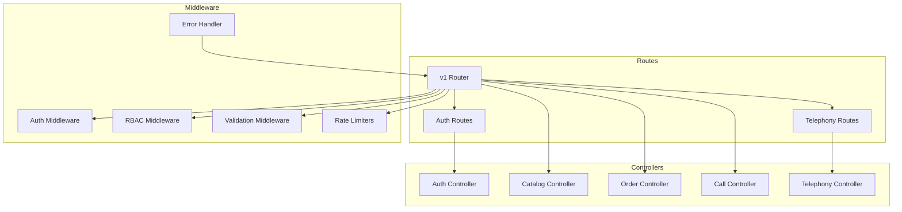
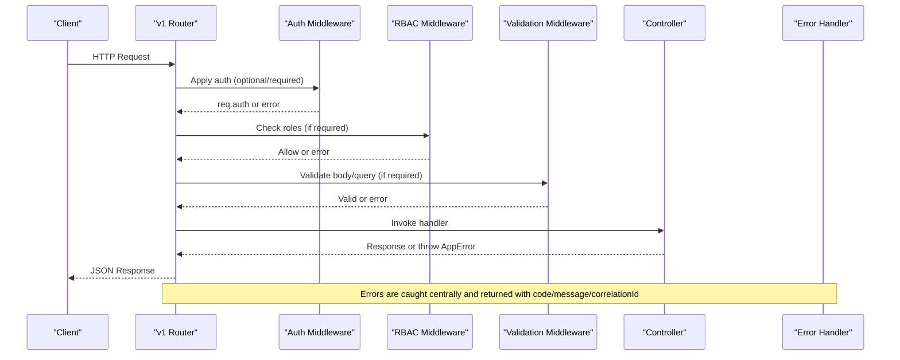
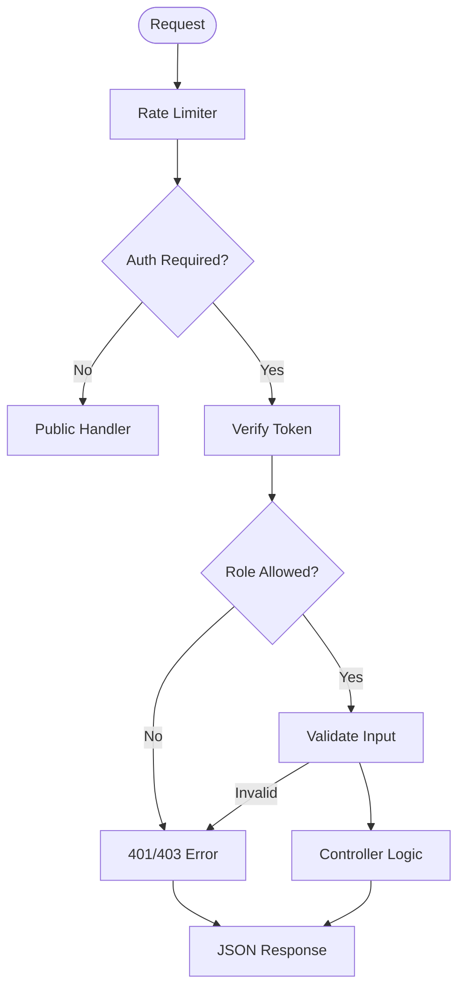

# Backend API

<cite>
**Referenced Files in This Document**
- [v1/index.js](file://server/src/routes/v1/index.js)
- [api.routes.js](file://server/src/routes/api.routes.js)
- [auth.routes.js](file://server/src/routes/auth.routes.js)
- [telephony.routes.js](file://server/src/routes/telephony.routes.js)
- [auth.controller.js](file://server/src/controllers/auth.controller.js)
- [catalog.controller.js](file://server/src/controllers/catalog.controller.js)
- [order.controller.js](file://server/src/controllers/order.controller.js)
- [call.controller.js](file://server/src/controllers/call.controller.js)
- [telephony.controller.js](file://server/src/controllers/telephony.controller.js)
- [auth.schema.js](file://server/src/schemas/auth.schema.js)
- [order.schema.js](file://server/src/schemas/order.schema.js)
- [catalog.schema.js](file://server/src/schemas/catalog.schema.js)
- [common.schema.js](file://server/src/schemas/common.schema.js)
- [rateLimit.middleware.js](file://server/src/middleware/rateLimit.middleware.js)
- [auth.middleware.js](file://server/src/middleware/auth.middleware.js)
- [rbac.middleware.js](file://server/src/middleware/rbac.middleware.js)
- [errorHandler.middleware.js](file://server/src/middleware/errorHandler.middleware.js)
</cite>

## Table of Contents
1. Introduction
2. Project Structure
3. Core Components
4. Architecture Overview
5. Detailed Component Analysis
6. Dependency Analysis
7. Performance Considerations
8. Troubleshooting Guide
9. Conclusion
10. Appendices

## Introduction
This document provides comprehensive API documentation for the Inkiro backend REST API, focusing on the versioned v1 endpoints. It covers authentication, catalog management, order processing, call handling, and telephony webhooks. For each endpoint, it specifies HTTP methods, URL patterns, request/response schemas, authentication requirements, parameter validation rules, error response formats, status codes, rate limiting policies, security headers, and practical examples. It also documents the API versioning strategy and deprecation approach.

## Project Structure
The API is organized by feature with clear separation between routes, controllers, middleware, and schemas:
- Routes define URL patterns and apply middleware (authentication, RBAC, validation, rate limiting).
- Controllers implement business logic and interact with repositories or services.
- Middleware enforces cross-cutting concerns like auth, roles, validation, and error handling.
- Schemas define strict input validation using Zod.

**Diagram sources**
- [v1/index.js:1-140](file://server/src/routes/v1/index.js#L1-L140)
- [auth.routes.js:1-13](file://server/src/routes/auth.routes.js#L1-L13)
- [telephony.routes.js:1-23](file://server/src/routes/telephony.routes.js#L1-L23)
- [auth.controller.js:1-53](file://server/src/controllers/auth.controller.js#L1-L53)
- [catalog.controller.js:1-96](file://server/src/controllers/catalog.controller.js#L1-L96)
- [order.controller.js:1-136](file://server/src/controllers/order.controller.js#L1-L136)
- [call.controller.js:1-114](file://server/src/controllers/call.controller.js#L1-L114)
- [telephony.controller.js:1-245](file://server/src/controllers/telephony.controller.js#L1-L245)
- [auth.middleware.js:1-55](file://server/src/middleware/auth.middleware.js#L1-L55)
- [rbac.middleware.js:1-32](file://server/src/middleware/rbac.middleware.js#L1-L32)
- [rateLimit.middleware.js:1-52](file://server/src/middleware/rateLimit.middleware.js#L1-L52)
- [errorHandler.middleware.js:1-43](file://server/src/middleware/errorHandler.middleware.js#L1-L43)

**Section sources**
- [v1/index.js:1-140](file://server/src/routes/v1/index.js#L1-L140)
- [api.routes.js:1-119](file://server/src/routes/api.routes.js#L1-L119)

## Core Components
- Authentication: Login, refresh token, WebSocket ticket issuance, current user info.
- Catalog: Read-only public access to catalog items, categories, merchants; protected write access for adding items.
- Orders: List, retrieve, update status, dispute flagging, and resolution.
- Calls: Dashboard stats, recent calls, call details, and audio retrieval.
- Telephony: Webhooks for inbound voice, missed calls, DTMF, and pin-drop confirmation.

Key middleware:
- Authentication via Bearer tokens or query access_token.
- Role-based access control with predefined roles.
- Request validation using Zod schemas.
- Rate limiting per route group.
- Centralized error handling with structured responses.

**Section sources**
- [auth.controller.js:1-53](file://server/src/controllers/auth.controller.js#L1-L53)
- [catalog.controller.js:1-96](file://server/src/controllers/catalog.controller.js#L1-L96)
- [order.controller.js:1-136](file://server/src/controllers/order.controller.js#L1-L136)
- [call.controller.js:1-114](file://server/src/controllers/call.controller.js#L1-L114)
- [telephony.controller.js:1-245](file://server/src/controllers/telephony.controller.js#L1-L245)
- [auth.middleware.js:1-55](file://server/src/middleware/auth.middleware.js#L1-L55)
- [rbac.middleware.js:1-32](file://server/src/middleware/rbac.middleware.js#L1-L32)
- [rateLimit.middleware.js:1-52](file://server/src/middleware/rateLimit.middleware.js#L1-L52)
- [errorHandler.middleware.js:1-43](file://server/src/middleware/errorHandler.middleware.js#L1-L43)

## Architecture Overview
The v1 router composes public and protected endpoints with layered middleware:
- Public endpoints: /auth, /catalog, /categories, /merchants (rate limited).
- Protected endpoints: require authentication and role checks; include metrics, sessions, calls, orders, and enterprise governance.
- Telephony endpoints: provider-specific inbound webhooks with idempotency and webhook auth.

**Diagram sources**
- [v1/index.js:1-140](file://server/src/routes/v1/index.js#L1-L140)
- [auth.middleware.js:1-55](file://server/src/middleware/auth.middleware.js#L1-L55)
- [rbac.middleware.js:1-32](file://server/src/middleware/rbac.middleware.js#L1-L32)
- [errorHandler.middleware.js:1-43](file://server/src/middleware/errorHandler.middleware.js#L1-L43)

## Detailed Component Analysis

### Authentication Endpoints
- POST /v1/auth/login
  - Purpose: Authenticate user and return tokens.
  - Auth: None.
  - Rate limit: auth limiter (10/min per IP).
  - Request schema: email (string, valid email), password (string, min 6 chars).
  - Response: Token pair (access and refresh tokens) from service.
  - Errors: Validation errors, invalid credentials.
- POST /v1/auth/refresh
  - Purpose: Rotate refresh token to obtain new token pair.
  - Auth: None.
  - Rate limit: auth limiter.
  - Request schema: refreshToken (string, required).
  - Response: New token pair.
  - Errors: Missing or invalid refresh token.
- POST /v1/auth/ws-ticket
  - Purpose: Obtain a WebSocket stream ticket for real-time media streaming.
  - Auth: Required (Bearer token).
  - Rate limit: dashboard limiter.
  - Request schema: None.
  - Response: Ticket data including stream URL parameters.
  - Errors: Authentication required.
- GET /v1/auth/me
  - Purpose: Retrieve current authenticated user context.
  - Auth: Required.
  - Rate limit: dashboard limiter.
  - Request schema: None.
  - Response: User object bound by auth middleware.
  - Errors: Authentication required.

Security and headers:
- Authentication via Authorization: Bearer <token> or query access_token.
- Rate limit headers enabled by express-rate-limit standardHeaders.

Examples:
- Login: POST /v1/auth/login with { email, password }.
- Refresh: POST /v1/auth/refresh with { refreshToken }.
- WS Ticket: POST /v1/auth/ws-ticket with Authorization header.
- Me: GET /v1/auth/me with Authorization header.

**Section sources**
- [auth.routes.js:1-13](file://server/src/routes/auth.routes.js#L1-L13)
- [auth.controller.js:1-53](file://server/src/controllers/auth.controller.js#L1-L53)
- [auth.schema.js:1-7](file://server/src/schemas/auth.schema.js#L1-L7)
- [rateLimit.middleware.js:1-52](file://server/src/middleware/rateLimit.middleware.js#L1-L52)
- [auth.middleware.js:1-55](file://server/src/middleware/auth.middleware.js#L1-L55)

### Catalog Management Endpoints
- GET /v1/catalog
  - Purpose: Retrieve active catalog items for a tenant/restaurant.
  - Auth: None (public).
  - Rate limit: public limiter (60/min per IP).
  - Query params: tenant_id (string, required), restaurant_id (string, required).
  - Response: Array of catalog items.
  - Errors: Missing tenant/restaurant context.
- GET /v1/categories
  - Purpose: Retrieve categories for a tenant/restaurant.
  - Auth: None (public).
  - Rate limit: public limiter.
  - Query params: tenant_id (string, required), restaurant_id (string, required).
  - Response: Array of categories.
  - Errors: Missing tenant/restaurant context.
- GET /v1/merchants
  - Purpose: List restaurants under a tenant.
  - Auth: None (public).
  - Rate limit: public limiter.
  - Query params: tenant_id (string, required).
  - Response: Array of restaurants.
  - Errors: Missing tenant context.
- POST /v1/catalog
  - Purpose: Add a new catalog item.
  - Auth: Required.
  - Roles: RESTAURANT_MANAGER or ADMIN.
  - Rate limit: dashboard limiter.
  - Request schema: name (string, min 2), category_id (number, min 1), price (number, >=0), available (0/1), is_special (0/1), dietary_tags (veg|non-veg|none), stt_hints (array or comma-separated string).
  - Response: Success payload with id, name, price.
  - Errors: Validation errors, missing auth context.

Examples:
- Get catalog: GET /v1/catalog?tenant_id=...&restaurant_id=...
- Add item: POST /v1/catalog with Authorization and validated body.

**Section sources**
- [v1/index.js:29-33](file://server/src/routes/v1/index.js#L29-L33)
- [v1/index.js:131-137](file://server/src/routes/v1/index.js#L131-L137)
- [catalog.controller.js:1-96](file://server/src/controllers/catalog.controller.js#L1-L96)
- [catalog.schema.js:1-16](file://server/src/schemas/catalog.schema.js#L1-L16)
- [rateLimit.middleware.js:1-52](file://server/src/middleware/rateLimit.middleware.js#L1-L52)

### Order Processing Endpoints
- GET /v1/orders
  - Purpose: List recent orders for the authenticated tenant/restaurant.
  - Auth: Required.
  - Roles: KITCHEN, STAFF, RESTAURANT_MANAGER, ADMIN.
  - Rate limit: dashboard limiter.
  - Query params: limit (int, 1..100, default 50), offset (int, >=0, default 0).
  - Response: Array of orders.
  - Errors: Missing auth context.
- GET /v1/orders/:id
  - Purpose: Retrieve an order with items.
  - Auth: Required.
  - Roles: KITCHEN, STAFF, RESTAURANT_MANAGER, ADMIN.
  - Rate limit: dashboard limiter.
  - Path param: id (string/number).
  - Response: Order object with items.
  - Errors: Order not found.
- PATCH /v1/orders/:id
  - Purpose: Update order status with optimistic concurrency support.
  - Auth: Required.
  - Roles: KITCHEN, STAFF, RESTAURANT_MANAGER, ADMIN.
  - Rate limit: dashboard limiter.
  - Request schema: status (enum: pending|confirmed|preparing|ready|dispatched|delivered|cancelled), expectedVersion (positive int, optional), notes (string, max 500, optional).
  - Response: Success payload with id, status, version.
  - Errors: Validation errors, order not found, version conflict.
- POST /v1/orders/:id/dispute
  - Purpose: Flag an order for dispute.
  - Auth: Required.
  - Roles: STAFF, RESTAURANT_MANAGER, ADMIN.
  - Rate limit: dashboard limiter.
  - Request schema: reason (string, min 3, max 500), notes (string, max 1000, optional).
  - Response: Success payload with id and dispute_status flagged.
  - Errors: Order not found.
- POST /v1/orders/:id/resolve-dispute
  - Purpose: Resolve an order dispute.
  - Auth: Required.
  - Roles: RESTAURANT_MANAGER, ADMIN.
  - Rate limit: dashboard limiter.
  - Request schema: resolutionNotes (string, min 3, max 1000), action (enum: refund|reorder|dismiss).
  - Response: Success payload with id, dispute_status resolved, action.
  - Errors: Order not found.

Examples:
- List orders: GET /v1/orders?limit=50&offset=0 with Authorization.
- Update status: PATCH /v1/orders/123 with { status: "preparing", expectedVersion: 1 }.
- Dispute: POST /v1/orders/123/dispute with { reason: "...", notes: "..." }.
- Resolve: POST /v1/orders/123/resolve-dispute with { resolutionNotes: "...", action: "refund" }.

**Section sources**
- [v1/index.js:109-129](file://server/src/routes/v1/index.js#L109-L129)
- [order.controller.js:1-136](file://server/src/controllers/order.controller.js#L1-L136)
- [order.schema.js:1-22](file://server/src/schemas/order.schema.js#L1-L22)
- [common.schema.js:1-7](file://server/src/schemas/common.schema.js#L1-L7)
- [rateLimit.middleware.js:1-52](file://server/src/middleware/rateLimit.middleware.js#L1-L52)

### Call Handling Endpoints
- GET /v1/stats
  - Purpose: Dashboard statistics for calls and orders.
  - Auth: Required.
  - Roles: STAFF, RESTAURANT_MANAGER, ADMIN.
  - Rate limit: dashboard limiter.
  - Response: Counts for total_calls, active_calls, total_orders, confirmed_orders, revenue, avg_latency_ms.
  - Errors: Missing auth context.
- GET /v1/calls
  - Purpose: List recent calls for the authenticated tenant/restaurant.
  - Auth: Required.
  - Roles: STAFF, RESTAURANT_MANAGER, ADMIN.
  - Rate limit: dashboard limiter.
  - Query params: limit (int, 1..100, default 50), offset (int, >=0, default 0).
  - Response: Array of call records.
  - Errors: Missing auth context.
- GET /v1/calls/:id
  - Purpose: Retrieve call details including transcript and logs.
  - Auth: Required.
  - Roles: STAFF, RESTAURANT_MANAGER, ADMIN.
  - Rate limit: dashboard limiter.
  - Path param: id (string/number).
  - Response: Call object with session_state, transcript, logs.
  - Errors: Call not found.
- GET /v1/calls/:id/audio
  - Purpose: Retrieve call audio recording.
  - Auth: Required.
  - Roles: STAFF, RESTAURANT_MANAGER, ADMIN.
  - Rate limit: dashboard limiter.
  - Path param: id (string/number).
  - Response: audio/wav stream.
  - Errors: Call not found, audio not found.

Examples:
- Stats: GET /v1/stats with Authorization.
- Recent calls: GET /v1/calls?limit=50 with Authorization.
- Call detail: GET /v1/calls/123 with Authorization.
- Audio: GET /v1/calls/123/audio with Authorization.

**Section sources**
- [v1/index.js:54-107](file://server/src/routes/v1/index.js#L54-L107)
- [call.controller.js:1-114](file://server/src/controllers/call.controller.js#L1-L114)
- [rateLimit.middleware.js:1-52](file://server/src/middleware/rateLimit.middleware.js#L1-L52)

### Telephony Webhook Endpoints
- POST /telephony/exotel/voice and /exotel/voice
  - Purpose: Exotel inbound voice webhook; returns XML to connect to AgentStream with a secure ticket.
  - Auth: Provider-specific signature verification.
  - Rate limit: telephony limiter (120/min).
  - Request: Exotel call payload.
  - Response: XML instructing provider to stream media to WebSocket endpoint with ticket.
  - Errors: Invalid provider signature.
- POST /telephony/twilio/voice and /voice
  - Purpose: Twilio inbound voice webhook; returns TwiML to connect to media-stream with a secure ticket.
  - Auth: Provider-specific signature verification.
  - Rate limit: telephony limiter.
  - Request: Twilio call payload.
  - Response: TwiML XML connecting to media stream.
  - Errors: Invalid provider signature.
- POST /api/missed-call
  - Purpose: Missed call callback webhook; triggers callback and broadcasts to dashboard.
  - Auth: Telephony webhook auth + idempotency.
  - Rate limit: telephony limiter.
  - Request: Phone identifier fields.
  - Response: Result payload.
  - Errors: Missing phone number.
- POST /api/telephony/dtmf
  - Purpose: DTMF quick-reorder webhook; processes digit and may trigger reorder flow.
  - Auth: Telephony webhook auth + idempotency.
  - Rate limit: telephony limiter.
  - Request: Digit and caller fields.
  - Response: XML for provider interaction.
  - Errors: Processing errors.
- GET /pin/:orderId
  - Purpose: Render secure pin-drop page for delivery location confirmation.
  - Auth: None (uses token or orderId).
  - Rate limit: telephony limiter.
  - Query params: lat, lng (numbers, defaults applied).
  - Response: HTML page with embedded safe config and map integration.
  - Errors: Internal server errors.
- POST /api/pin-confirm
  - Purpose: Confirm delivery coordinates using token or orderId; updates order address and marks token used.
  - Auth: Idempotency protection.
  - Rate limit: telephony limiter.
  - Request schema: token or orderId (required), lat (number), lng (number).
  - Response: Success payload with order_id.
  - Errors: Missing token, already used token, expired token, invalid token.

Examples:
- Exotel voice: POST /telephony/exotel/voice with Exotel signature and call payload.
- Twilio voice: POST /telephony/twilio/voice with Twilio signature and call payload.
- Missed call: POST /api/missed-call with phone field.
- DTMF: POST /api/telephony/dtmf with digits and caller.
- Pin drop: GET /pin/abc123?lat=11.0168&lng=76.9558.
- Pin confirm: POST /api/pin-confirm with { token: "abc123", lat: 11.0168, lng: 76.9558 }.

**Section sources**
- [telephony.routes.js:1-23](file://server/src/routes/telephony.routes.js#L1-L23)
- [telephony.controller.js:1-245](file://server/src/controllers/telephony.controller.js#L1-L245)
- [rateLimit.middleware.js:1-52](file://server/src/middleware/rateLimit.middleware.js#L1-L52)

### Enterprise Governance and Operational Endpoints
- GET /v1/metrics
  - Purpose: Metrics and telemetry.
  - Auth: Required.
  - Roles: RESTAURANT_MANAGER, ADMIN.
  - Rate limit: dashboard limiter.
  - Response: Metrics data via metrics router.
- GET /v1/audit-logs
  - Purpose: Audit log retrieval.
  - Auth: Required.
  - Roles: RESTAURANT_MANAGER, ADMIN.
  - Rate limit: dashboard limiter.
  - Response: Audit logs via metrics router handle.
- GET /v1/queues
  - Purpose: Queue statistics.
  - Auth: Required.
  - Roles: RESTAURANT_MANAGER, ADMIN.
  - Rate limit: dashboard limiter.
  - Response: Queue stats.
- GET /v1/engine-status
  - Purpose: Engine health/status.
  - Auth: Required.
  - Roles: STAFF, RESTAURANT_MANAGER, ADMIN.
  - Rate limit: dashboard limiter.
  - Response: Engine status.
- GET /v1/sessions
  - Purpose: Active sessions across cluster and local.
  - Auth: Required.
  - Roles: STAFF, RESTAURANT_MANAGER, ADMIN.
  - Rate limit: dashboard limiter.
  - Response: Array of active sessions with metadata.
- Enterprise flags and backups:
  - GET /v1/enterprise/flags, POST /v1/enterprise/flags (ADMIN only).
  - POST /v1/enterprise/backup (ADMIN only).
  - GET /v1/enterprise/slos (RESTAURANT_MANAGER, ADMIN).
  - GET /v1/enterprise/ai-costs (RESTAURANT_MANAGER, ADMIN).
  - GET /v1/enterprise/audit-verify (ADMIN).
  - GET /v1/enterprise/outbox (ADMIN).

**Section sources**
- [v1/index.js:35-57](file://server/src/routes/v1/index.js#L35-L57)
- [v1/index.js:60-102](file://server/src/routes/v1/index.js#L60-L102)

## Dependency Analysis
- Route composition:
  - v1 router mounts auth router and applies rate limits to public endpoints.
  - Protected router applies auth and RBAC before routing to controllers.
- Middleware chain:
  - Auth middleware binds req.auth from JWT claims.
  - RBAC middleware enforces role constraints.
  - Validation middleware enforces Zod schemas for bodies and queries.
  - Rate limiters enforce per-route quotas and set standard headers.
  - Error handler centralizes error responses with correlation IDs.

**Diagram sources**
- [v1/index.js:29-137](file://server/src/routes/v1/index.js#L29-L137)
- [auth.middleware.js:1-55](file://server/src/middleware/auth.middleware.js#L1-L55)
- [rbac.middleware.js:1-32](file://server/src/middleware/rbac.middleware.js#L1-L32)
- [rateLimit.middleware.js:1-52](file://server/src/middleware/rateLimit.middleware.js#L1-L52)
- [errorHandler.middleware.js:1-43](file://server/src/middleware/errorHandler.middleware.js#L1-L43)

**Section sources**
- [v1/index.js:29-137](file://server/src/routes/v1/index.js#L29-L137)
- [auth.middleware.js:1-55](file://server/src/middleware/auth.middleware.js#L1-L55)
- [rbac.middleware.js:1-32](file://server/src/middleware/rbac.middleware.js#L1-L32)
- [rateLimit.middleware.js:1-52](file://server/src/middleware/rateLimit.middleware.js#L1-L52)
- [errorHandler.middleware.js:1-43](file://server/src/middleware/errorHandler.middleware.js#L1-L43)

## Performance Considerations
- Pagination: Use limit and offset to avoid large payloads; defaults cap at 100.
- Rate limiting: Protects against abuse; tune windows and max per environment.
- Database queries: Controllers use scoped queries by tenant and restaurant to minimize scope and improve performance.
- Streaming: Audio retrieval streams files directly to reduce memory usage.
- Idempotency: Telephony webhooks use idempotency middleware to prevent duplicate processing.

[No sources needed since this section provides general guidance]

## Troubleshooting Guide
Common error responses follow a standardized format:
- Status code: HTTP status indicating failure.
- Error object:
  - code: Machine-readable error code (e.g., AUTH_REQUIRED, TOO_MANY_REQUESTS, ORDER_NOT_FOUND).
  - message: Human-readable message (safe exposure for client errors; internal messages hidden for server errors).
  - details: Optional additional context when exposed.
  - correlationId: Unique ID for tracing requests through logs.

Typical causes:
- Authentication failures: Missing or invalid Bearer token; ensure Authorization header or access_token query param.
- Role violations: Insufficient roles; verify user role matches endpoint requirements.
- Validation errors: Invalid or missing fields; check Zod schemas for exact requirements.
- Rate limiting: Too many requests; back off and retry after window expires.
- Not found: Resource identifiers incorrect; verify IDs and scoping.

Example error response shape:
{
  "error": {
    "code": "AUTH_REQUIRED",
    "message": "Authentication required. Please provide a valid Bearer token.",
    "correlationId": "req-12345"
  }
}

**Section sources**
- [errorHandler.middleware.js:1-43](file://server/src/middleware/errorHandler.middleware.js#L1-L43)
- [AppError.js:1-20](file://server/src/utils/AppError.js#L1-L20)

## Conclusion
The Inkiro v1 API provides a robust, secure, and scalable interface for authentication, catalog management, order processing, call handling, and telephony integrations. Strict validation, role-based access control, rate limiting, and centralized error handling ensure reliability and safety. The versioned router structure supports future evolution while maintaining backward compatibility.

[No sources needed since this section summarizes without analyzing specific files]

## Appendices

### API Versioning Strategy and Deprecation Policy
- Versioning:
  - Base path includes version prefix (/v1) to isolate breaking changes.
  - Public and protected endpoints are grouped under the v1 router.
- Deprecation:
  - Maintain parallel versions during transition periods.
  - Communicate deprecation timelines via documentation and headers if applicable.
  - Provide migration guides for clients moving between versions.
- Backward compatibility:
  - Avoid removing fields in responses; mark as deprecated instead.
  - Preserve existing request schemas; add new optional fields where possible.

[No sources needed since this section provides general guidance]

### Security Headers and Policies
- Rate limit headers: Standard headers enabled by express-rate-limit indicate remaining quota and reset time.
- Authentication: Enforced via Bearer tokens; optional query access_token supported for convenience.
- CORS and transport security: Configure HTTPS and CORS per deployment environment (not shown in analyzed files).
- Telephony webhook auth: Provider-specific signature verification protects inbound webhooks.

**Section sources**
- [rateLimit.middleware.js:1-52](file://server/src/middleware/rateLimit.middleware.js#L1-L52)
- [auth.middleware.js:1-55](file://server/src/middleware/auth.middleware.js#L1-L55)