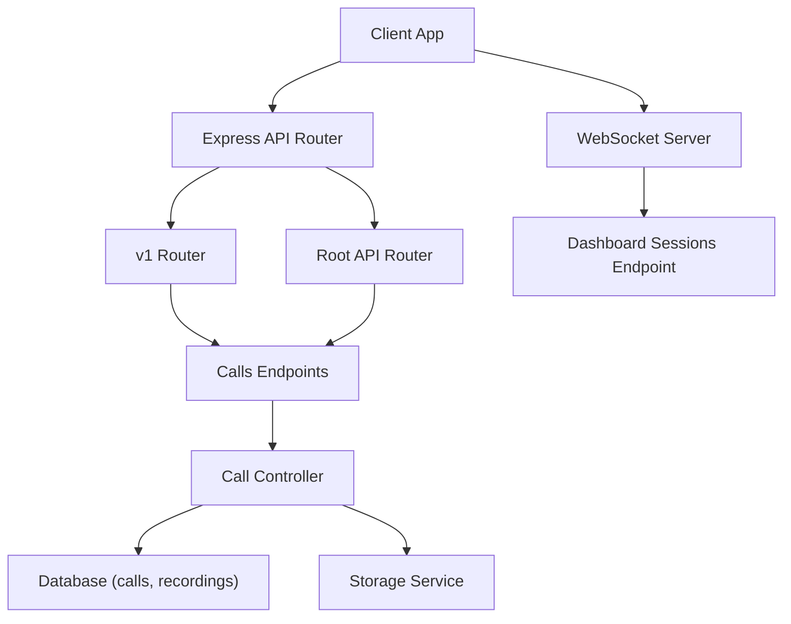
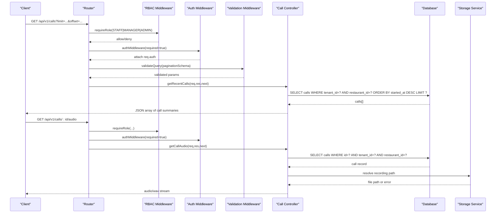
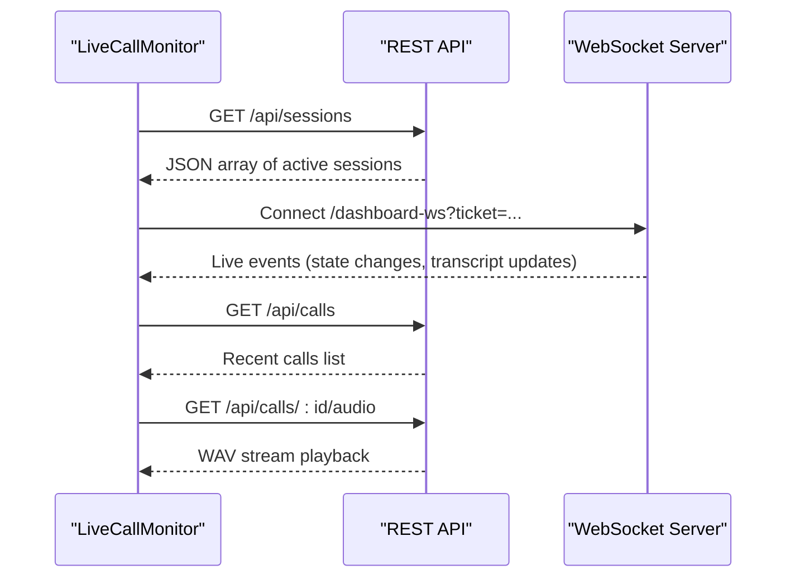
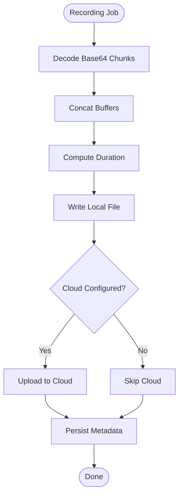
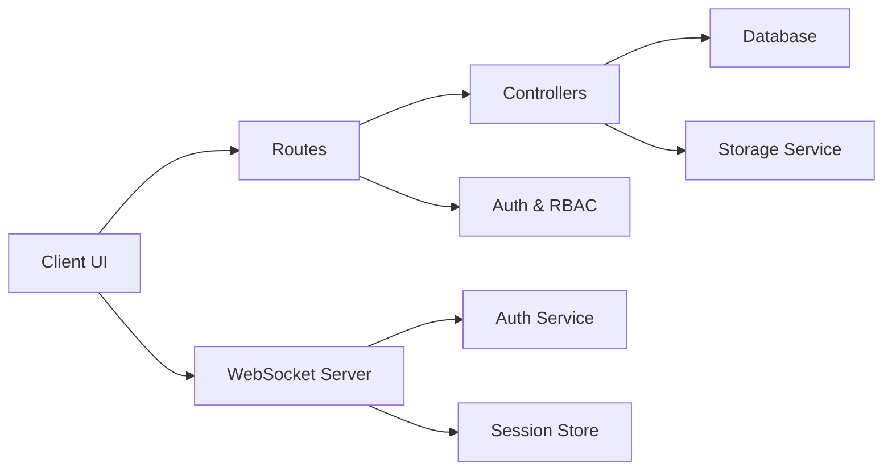

# Call Management API

<cite>
**Referenced Files in This Document**
- [call.controller.js](file://server/src/controllers/call.controller.js)
- [api.routes.js](file://server/src/routes/api.routes.js)
- [v1/index.js](file://server/src/routes/v1/index.js)
- [common.schema.js](file://server/src/schemas/common.schema.js)
- [rbac.middleware.js](file://server/src/middleware/rbac.middleware.js)
- [001_initial_multitenant_schema.sql](file://server/src/db/migrations/001_initial_multitenant_schema.sql)
- [wsServer.js](file://server/src/websocket/wsServer.js)
- [LiveCallMonitor.jsx](file://client/src/components/LiveCallMonitor.jsx)
- [recording.worker.js](file://server/src/workers/recording.worker.js)
- [storageService.js](file://server/src/infra/storageService.js)
</cite>

## Table of Contents
1. Introduction
2. Project Structure
3. Core Components
4. Architecture Overview
5. Detailed Component Analysis
6. Dependency Analysis
7. Performance Considerations
8. Troubleshooting Guide
9. Conclusion

## Introduction
This document provides detailed API documentation for call management endpoints, including retrieving recent calls, getting call details, and accessing call audio recordings. It also covers pagination parameters, filtering options, call session management via real-time monitoring, and access controls based on user roles. Examples are provided for call history queries, audio download requests, and real-time call monitoring.

## Project Structure
The call management functionality is implemented as protected REST endpoints under both the root API router and the versioned v1 router. Controllers enforce tenant and restaurant scoping and return call metadata, transcripts, and audio streams. Real-time call sessions are exposed through a WebSocket endpoint and aggregated into a dashboard endpoint.

**Diagram sources**
- [api.routes.js:1-119](file://server/src/routes/api.routes.js#L1-L119)
- [v1/index.js:1-140](file://server/src/routes/v1/index.js#L1-L140)
- [call.controller.js:1-114](file://server/src/controllers/call.controller.js#L1-L114)
- [wsServer.js:1-162](file://server/src/websocket/wsServer.js#L1-L162)

**Section sources**
- [api.routes.js:1-119](file://server/src/routes/api.routes.js#L1-L119)
- [v1/index.js:1-140](file://server/src/routes/v1/index.js#L1-L140)

## Core Components
- Call controller: Provides endpoints to list recent calls, retrieve call details with transcript and logs, and stream audio recordings. Enforces tenant and restaurant context.
- Routes: Expose protected endpoints under /api and /api/v1 with role-based access control and query validation for pagination.
- Schemas: Define pagination parameters (limit, offset).
- RBAC middleware: Restricts access to STAFF, RESTAURANT_MANAGER, and ADMIN roles for call endpoints.
- Database schema: Defines calls table fields used by the API responses.
- Storage service and worker: Persist and serve audio recordings; streaming uses WAV format.
- WebSocket server: Manages live sessions and exposes a dashboard endpoint aggregating active sessions.

**Section sources**
- [call.controller.js:1-114](file://server/src/controllers/call.controller.js#L1-L114)
- [api.routes.js:1-119](file://server/src/routes/api.routes.js#L1-L119)
- [v1/index.js:1-140](file://server/src/routes/v1/index.js#L1-L140)
- [common.schema.js:1-7](file://server/src/schemas/common.schema.js#L1-L7)
- [rbac.middleware.js:1-32](file://server/src/middleware/rbac.middleware.js#L1-L32)
- [001_initial_multitenant_schema.sql:128-148](file://server/src/db/migrations/001_initial_multitenant_schema.sql#L128-L148)
- [storageService.js:1-118](file://server/src/infra/storageService.js#L1-L118)
- [recording.worker.js:1-53](file://server/src/workers/recording.worker.js#L1-L53)
- [wsServer.js:1-162](file://server/src/websocket/wsServer.js#L1-L162)

## Architecture Overview
The call management API follows a layered architecture:
- HTTP layer: Express routers define routes with authentication and role checks.
- Controller layer: Business logic for querying calls, assembling response payloads, and streaming audio.
- Data layer: SQL queries against the calls table and related tables; storage service handles local/cloud audio persistence.
- Real-time layer: WebSocket server manages live sessions and aggregates them for dashboard consumption.

**Diagram sources**
- [api.routes.js:83-86](file://server/src/routes/api.routes.js#L83-L86)
- [v1/index.js:104-107](file://server/src/routes/v1/index.js#L104-L107)
- [call.controller.js:46-113](file://server/src/controllers/call.controller.js#L46-L113)
- [common.schema.js:1-7](file://server/src/schemas/common.schema.js#L1-L7)
- [rbac.middleware.js:10-29](file://server/src/middleware/rbac.middleware.js#L10-L29)

## Detailed Component Analysis

### REST Endpoints

#### GET /api/v1/calls
- Purpose: Retrieve recent calls scoped to the authenticated tenant and restaurant.
- Authentication: Required (Bearer token or ticket).
- Authorization: Roles STAFF, RESTAURANT_MANAGER, ADMIN.
- Query Parameters:
  - limit: integer, min 1, max 100, default 50.
  - offset: integer, min 0, default 0.
- Response: Array of call summaries with fields such as id, tenant_id, restaurant_id, call_sid, caller_phone, source, status, duration_seconds, latency_avg_ms, started_at, ended_at.
- Notes: The controller enforces tenant and restaurant scoping from req.auth.

Example request:
- GET /api/v1/calls?limit=20&offset=0

Example response (array):
- Each element includes: id, tenant_id, restaurant_id, call_sid, caller_phone, source, status, duration_seconds, latency_avg_ms, started_at, ended_at.

**Section sources**
- [v1/index.js:104-107](file://server/src/routes/v1/index.js#L104-L107)
- [api.routes.js:83-86](file://server/src/routes/api.routes.js#L83-L86)
- [call.controller.js:46-63](file://server/src/controllers/call.controller.js#L46-L63)
- [common.schema.js:1-7](file://server/src/schemas/common.schema.js#L1-L7)
- [001_initial_multitenant_schema.sql:128-148](file://server/src/db/migrations/001_initial_multitenant_schema.sql#L128-L148)

#### GET /api/v1/calls/:id
- Purpose: Get full call details including session state, transcript, and logs.
- Authentication: Required.
- Authorization: Roles STAFF, RESTAURANT_MANAGER, ADMIN.
- Path Parameter: id (call id).
- Response: Object containing call fields plus parsed session_state (object), transcript (array of turns), and logs (array of log entries).
- Notes: Transcript and session_state are stored as strings in the database but returned as parsed objects/arrays.

Example request:
- GET /api/v1/calls/123

Example response:
- { id, tenant_id, restaurant_id, call_sid, caller_phone, source, status, duration_seconds, latency_avg_ms, started_at, ended_at, session_state: {...}, transcript: [{role, text, ...}], logs: [...] }

**Section sources**
- [v1/index.js:104-107](file://server/src/routes/v1/index.js#L104-L107)
- [api.routes.js:83-86](file://server/src/routes/api.routes.js#L83-L86)
- [call.controller.js:65-89](file://server/src/controllers/call.controller.js#L65-L89)
- [001_initial_multitenant_schema.sql:128-148](file://server/src/db/migrations/001_initial_multitenant_schema.sql#L128-L148)

#### GET /api/v1/calls/:id/audio
- Purpose: Stream an audio recording for a specific call.
- Authentication: Required.
- Authorization: Roles STAFF, RESTAURANT_MANAGER, ADMIN.
- Path Parameter: id (call id).
- Response: Binary stream with Content-Type: audio/wav.
- Notes: If the recording file does not exist, returns a 404 error.

Example request:
- GET /api/v1/calls/123/audio

Response:
- Binary WAV stream.

**Section sources**
- [v1/index.js:104-107](file://server/src/routes/v1/index.js#L104-L107)
- [api.routes.js:83-86](file://server/src/routes/api.routes.js#L83-L86)
- [call.controller.js:91-113](file://server/src/controllers/call.controller.js#L91-L113)

### Pagination and Filtering
- Pagination: Implemented via query parameters validated by paginationSchema (limit, offset). The controller currently applies limit to ordering by most recent calls; offset is validated but not applied in the current implementation.
- Filtering: No explicit filter parameters are enforced at the route level. Scoping is performed by tenant_id and restaurant_id derived from req.auth.

Recommendation:
- Extend the controller to honor offset for true pagination and add optional filters (e.g., status, source, date range) if needed.

**Section sources**
- [common.schema.js:1-7](file://server/src/schemas/common.schema.js#L1-L7)
- [call.controller.js:46-63](file://server/src/controllers/call.controller.js#L46-L63)

### Access Controls
- Role-Based Access Control: Call endpoints require one of STAFF, RESTAURANT_MANAGER, or ADMIN roles.
- Tenant and Restaurant Scoping: Controllers enforce tenantId and restaurantId from req.auth to ensure data isolation.
- Error Handling: Unauthorized or forbidden requests return appropriate errors via AppError.

**Section sources**
- [rbac.middleware.js:10-29](file://server/src/middleware/rbac.middleware.js#L10-L29)
- [call.controller.js:11-20](file://server/src/controllers/call.controller.js#L11-L20)

### Real-Time Call Monitoring
- Active Sessions Endpoint: GET /api/v1/sessions (and /api/sessions) aggregates cluster-wide and local live sessions, returning caller info, source, state, and transcript snippets. Requires STAFF, RESTAURANT_MANAGER, or ADMIN roles.
- WebSocket Upgrade: /dashboard-ws supports ticket or bearer token authentication and connects clients to live updates.
- Live UI: The client component polls /api/calls and /api/sessions and plays audio via /api/calls/:id/audio.

**Diagram sources**
- [v1/index.js:54-102](file://server/src/routes/v1/index.js#L54-L102)
- [wsServer.js:17-162](file://server/src/websocket/wsServer.js#L17-L162)
- [LiveCallMonitor.jsx:1-210](file://client/src/components/LiveCallMonitor.jsx#L1-L210)

**Section sources**
- [v1/index.js:54-102](file://server/src/routes/v1/index.js#L54-L102)
- [api.routes.js:34-81](file://server/src/routes/api.routes.js#L34-L81)
- [wsServer.js:17-162](file://server/src/websocket/wsServer.js#L17-L162)
- [LiveCallMonitor.jsx:1-210](file://client/src/components/LiveCallMonitor.jsx#L1-L210)

### Audio Recording Pipeline
- Recording Worker: Processes jobs to persist PCM buffers to storage, computes duration, and saves metadata to the database.
- Storage Service: Persists audio locally and optionally uploads to cloud storage; generates structured object keys per tenant/restaurant.
- Playback: The audio endpoint serves recorded files as WAV streams.

**Diagram sources**
- [recording.worker.js:10-50](file://server/src/workers/recording.worker.js#L10-L50)
- [storageService.js:22-90](file://server/src/infra/storageService.js#L22-L90)

**Section sources**
- [recording.worker.js:1-53](file://server/src/workers/recording.worker.js#L1-L53)
- [storageService.js:1-118](file://server/src/infra/storageService.js#L1-L118)

## Dependency Analysis
- Routes depend on controllers and middleware for auth, RBAC, and validation.
- Controllers depend on database utilities and storage services.
- WebSocket server depends on ticket/token verification and session stores.
- Client components depend on REST endpoints and WebSocket connections for live monitoring.

**Diagram sources**
- [api.routes.js:1-119](file://server/src/routes/api.routes.js#L1-L119)
- [v1/index.js:1-140](file://server/src/routes/v1/index.js#L1-L140)
- [call.controller.js:1-114](file://server/src/controllers/call.controller.js#L1-L114)
- [wsServer.js:1-162](file://server/src/websocket/wsServer.js#L1-L162)

**Section sources**
- [api.routes.js:1-119](file://server/src/routes/api.routes.js#L1-L119)
- [v1/index.js:1-140](file://server/src/routes/v1/index.js#L1-L140)
- [call.controller.js:1-114](file://server/src/controllers/call.controller.js#L1-L114)
- [wsServer.js:1-162](file://server/src/websocket/wsServer.js#L1-L162)

## Performance Considerations
- Pagination: Ensure large datasets use limit and offset effectively; consider adding indexes on started_at and status for faster queries.
- Streaming: Audio streaming uses file I/O; ensure efficient disk access and consider caching hot recordings.
- Real-time: WebSocket heartbeat and payload limits are configured; monitor memory usage for large session maps.

[No sources needed since this section provides general guidance]

## Troubleshooting Guide
- 401 Unauthorized: Missing or invalid authentication token/ticket on protected endpoints.
- 403 Forbidden: Insufficient role for the requested resource.
- 404 Not Found: Call or audio recording not found; verify call id and that recording exists.
- Validation Errors: Invalid pagination parameters; ensure limit and offset conform to schema constraints.

Common checks:
- Verify req.auth contains tenantId and restaurantId.
- Confirm RBAC roles include STAFF, RESTAURANT_MANAGER, or ADMIN.
- Validate query parameters using paginationSchema.

**Section sources**
- [rbac.middleware.js:10-29](file://server/src/middleware/rbac.middleware.js#L10-L29)
- [call.controller.js:11-20](file://server/src/controllers/call.controller.js#L11-L20)
- [call.controller.js:65-113](file://server/src/controllers/call.controller.js#L65-L113)
- [common.schema.js:1-7](file://server/src/schemas/common.schema.js#L1-L7)

## Conclusion
The Call Management API provides secure, role-scoped access to call metadata, transcripts, and audio recordings. It supports pagination, real-time session monitoring, and robust audio persistence. For enhanced usability, consider implementing offset-based pagination and additional filtering options while maintaining strict tenant and restaurant scoping.

[No sources needed since this section summarizes without analyzing specific files]