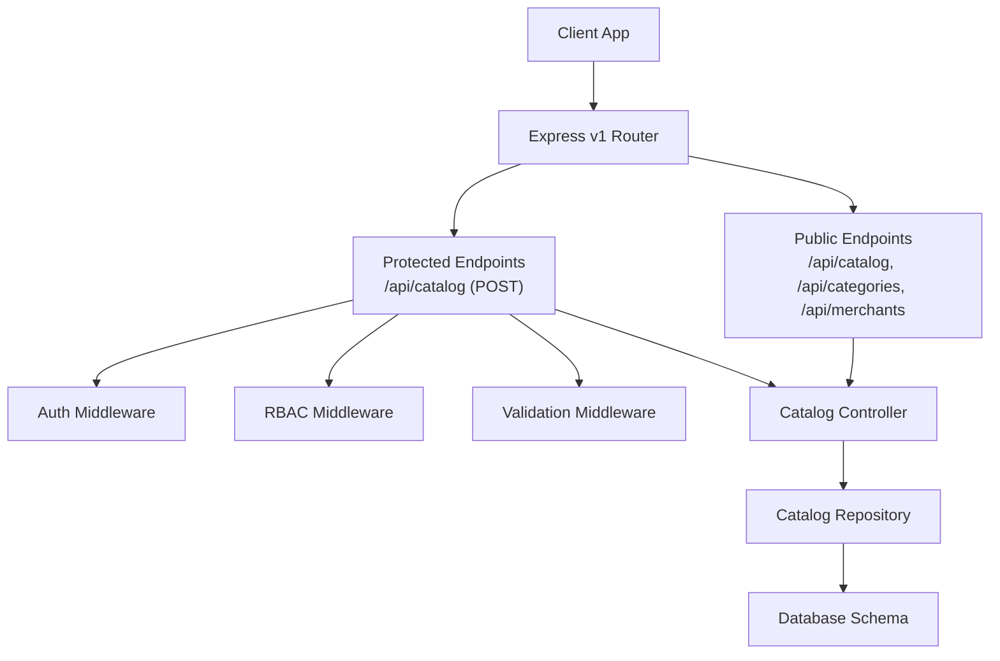
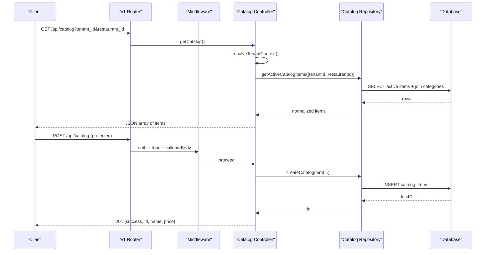
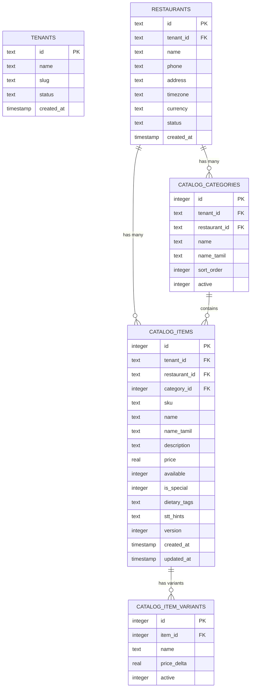
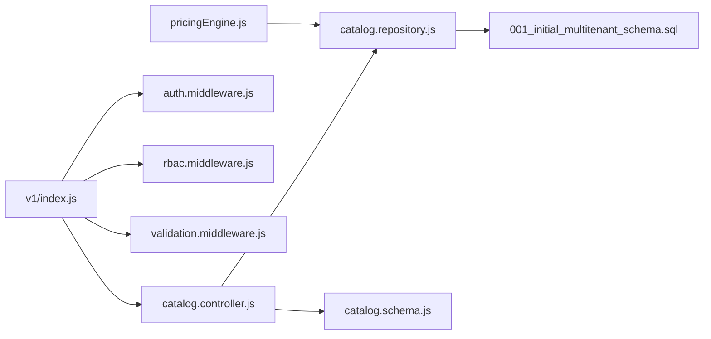

# Catalog Management API

<cite>
**Referenced Files in This Document**
- [catalog.controller.js](file://server/src/controllers/catalog.controller.js)
- [catalog.repository.js](file://server/src/domain/catalog/catalog.repository.js)
- [catalog.schema.js](file://server/src/schemas/catalog.schema.js)
- [common.schema.js](file://server/src/schemas/common.schema.js)
- [v1/index.js](file://server/src/routes/v1/index.js)
- [auth.middleware.js](file://server/src/middleware/auth.middleware.js)
- [rbac.middleware.js](file://server/src/middleware/rbac.middleware.js)
- [validation.middleware.js](file://server/src/middleware/validation.middleware.js)
- [001_initial_multitenant_schema.sql](file://server/src/db/migrations/001_initial_multitenant_schema.sql)
- [pricingEngine.js](file://server/src/domain/orders/pricingEngine.js)
- [useCatalog.js](file://client/src/hooks/useCatalog.js)
- [CatalogManager.jsx](file://client/src/components/CatalogManager.jsx)
</cite>

## Table of Contents
1. [Introduction](#introduction)
2. [Project Structure](#project-structure)
3. [Core Components](#core-components)
4. [Architecture Overview](#architecture-overview)
5. [Detailed Component Analysis](#detailed-component-analysis)
6. [Dependency Analysis](#dependency-analysis)
7. [Performance Considerations](#performance-considerations)
8. [Troubleshooting Guide](#troubleshooting-guide)
9. [Conclusion](#conclusion)
10. [Appendices](#appendices)

## Introduction
This document provides detailed API documentation for catalog management endpoints that enable retrieving catalogs, categories, merchants, and adding new catalog items. It covers request/response schemas for menu items, pricing, availability, and category hierarchies; explains validation rules, business logic for catalog updates, multi-tenant data isolation, role-based access controls, and usage examples including search queries and bulk update guidance.

## Project Structure
The catalog system is implemented as a layered Express application:
- Routes define public and protected endpoints under v1.
- Controllers orchestrate requests and enforce tenant scoping.
- Repositories perform database operations with strict multi-tenant filters.
- Schemas validate incoming payloads using Zod.
- Middleware enforces authentication, authorization (RBAC), and input validation.
- The client uses hooks to fetch and manage catalog data.

**Diagram sources**
- [v1/index.js:29-137](file://server/src/routes/v1/index.js#L29-L137)
- [catalog.controller.js:10-95](file://server/src/controllers/catalog.controller.js#L10-L95)
- [catalog.repository.js:9-108](file://server/src/domain/catalog/catalog.repository.js#L9-L108)
- [001_initial_multitenant_schema.sql:60-98](file://server/src/db/migrations/001_initial_multitenant_schema.sql#L60-L98)

**Section sources**
- [v1/index.js:29-137](file://server/src/routes/v1/index.js#L29-L137)
- [catalog.controller.js:10-95](file://server/src/controllers/catalog.controller.js#L10-L95)
- [catalog.repository.js:9-108](file://server/src/domain/catalog/catalog.repository.js#L9-L108)
- [001_initial_multitenant_schema.sql:60-98](file://server/src/db/migrations/001_initial_multitenant_schema.sql#L60-L98)

## Core Components
- Catalog Controller: Resolves tenant context from auth or query/header, exposes GET catalog, GET categories, POST add item, and GET merchants.
- Catalog Repository: Enforces strict multi-tenant scoping on all queries and writes; returns normalized fields for booleans and arrays.
- Validation Schemas: Define constraints for creating catalog items (name, price, category_id, dietary tags, STT hints).
- RBAC and Auth: Protect write endpoints with JWT authentication and role checks; read endpoints are public but require tenant scoping.
- Database Schema: Defines tables for tenants, restaurants, categories, items, variants, and related entities.

Key responsibilities:
- Multi-tenant isolation via tenant_id and restaurant_id on every query.
- Input validation for creation endpoints.
- Role-based authorization for modifications.
- Normalized responses for availability flags and STT hints.

**Section sources**
- [catalog.controller.js:10-95](file://server/src/controllers/catalog.controller.js#L10-L95)
- [catalog.repository.js:9-108](file://server/src/domain/catalog/catalog.repository.js#L9-L108)
- [catalog.schema.js:3-15](file://server/src/schemas/catalog.schema.js#L3-L15)
- [rbac.middleware.js:3-28](file://server/src/middleware/rbac.middleware.js#L3-L28)
- [auth.middleware.js:10-51](file://server/src/middleware/auth.middleware.js#L10-L51)
- [001_initial_multitenant_schema.sql:60-98](file://server/src/db/migrations/001_initial_multitenant_schema.sql#L60-L98)

## Architecture Overview
The API follows a clear separation of concerns:
- Public read endpoints return active catalog items and categories scoped by tenant and restaurant.
- Protected write endpoint creates catalog items after validation and role checks.
- Repository layer ensures strict tenant scoping and normalizes data types.
- Pricing engine caches active catalog items for deterministic pricing during order processing.

**Diagram sources**
- [v1/index.js:29-137](file://server/src/routes/v1/index.js#L29-L137)
- [catalog.controller.js:21-82](file://server/src/controllers/catalog.controller.js#L21-L82)
- [catalog.repository.js:23-108](file://server/src/domain/catalog/catalog.repository.js#L23-L108)

## Detailed Component Analysis

### API Endpoints

#### GET /api/catalog
- Purpose: Retrieve active menu items for a tenant and restaurant.
- Access: Public (rate-limited), requires tenant context.
- Query parameters:
  - tenant_id: string (required if not provided via auth context)
  - restaurant_id: string (required if not provided via auth context)
  - Optional headers: x-tenant-id, x-restaurant-id
- Response: Array of catalog items with category details and normalized fields.

Response schema (item):
- id: integer
- tenant_id: string
- restaurant_id: string
- category_id: integer
- sku: string | null
- name: string
- name_tamil: string
- description: string
- price: number (>= 0)
- available: boolean
- is_special: boolean
- dietary_tags: enum ["veg", "non-veg", "none"]
- stt_hints: array of strings
- category_name: string
- category_name_tamil: string

Notes:
- Only items with available = true are returned.
- Items are ordered by category sort_order then item name.

**Section sources**
- [v1/index.js:31-33](file://server/src/routes/v1/index.js#L31-L33)
- [catalog.controller.js:21-29](file://server/src/controllers/catalog.controller.js#L21-L29)
- [catalog.repository.js:23-46](file://server/src/domain/catalog/catalog.repository.js#L23-L46)

#### GET /api/categories
- Purpose: Retrieve active categories for a tenant and restaurant.
- Access: Public (rate-limited), requires tenant context.
- Query parameters: same as GET /api/catalog.
- Response: Array of categories with sort order and bilingual names.

Category schema:
- id: integer
- tenant_id: string
- restaurant_id: string
- name: string
- name_tamil: string
- sort_order: integer
- active: boolean

**Section sources**
- [v1/index.js:31-33](file://server/src/routes/v1/index.js#L31-L33)
- [catalog.controller.js:31-39](file://server/src/controllers/catalog.controller.js#L31-L39)
- [catalog.repository.js:9-21](file://server/src/domain/catalog/catalog.repository.js#L9-L21)

#### POST /api/catalog
- Purpose: Add a new menu item to the catalog.
- Access: Protected (requires authentication and role check).
- Roles allowed: RESTAURANT_MANAGER, ADMIN.
- Request body schema:
  - name: string (trim, min 2, max 100)
  - name_tamil: string (optional, trim, max 100, default "")
  - category_id: integer (coerced, >= 1)
  - price: number (coerced, >= 0, max 100000)
  - available: integer 0|1 (optional, default 1)
  - is_special: integer 0|1 (optional, default 0)
  - dietary_tags: enum ["veg", "non-veg", "none"] (optional, default "none")
  - stt_hints: array of strings or comma-separated string (optional, default [])
- Response: 201 Created with success flag, created id, name, price.

Validation rules:
- Strict parsing via Zod schema; invalid inputs return 400 with field-level errors.
- Tenant and restaurant context must be present in authenticated claims.

Business logic:
- Creates a catalog item scoped to tenant and restaurant.
- Stores stt_hints as JSON array.
- Normalizes boolean flags on read paths.

**Section sources**
- [v1/index.js:131-137](file://server/src/routes/v1/index.js#L131-L137)
- [catalog.schema.js:3-15](file://server/src/schemas/catalog.schema.js#L3-L15)
- [catalog.controller.js:41-82](file://server/src/controllers/catalog.controller.js#L41-L82)
- [catalog.repository.js:69-108](file://server/src/domain/catalog/catalog.repository.js#L69-L108)

#### GET /api/merchants
- Purpose: List active restaurants (merchants) for a tenant.
- Access: Public (rate-limited), requires tenant context.
- Query parameters:
  - tenant_id: string (required if not provided via auth context)
  - Optional headers: x-tenant-id
- Response: Array of restaurant records with status filter applied.

Merchant schema:
- id: string
- tenant_id: string
- name: string
- phone: string | null
- address: string | null
- timezone: string
- currency: string
- status: string ("active")

**Section sources**
- [v1/index.js:31-33](file://server/src/routes/v1/index.js#L31-L33)
- [catalog.controller.js:84-95](file://server/src/controllers/catalog.controller.js#L84-L95)

### Data Models and Relationships

**Diagram sources**
- [001_initial_multitenant_schema.sql:12-98](file://server/src/db/migrations/001_initial_multitenant_schema.sql#L12-L98)

### Business Logic and Validation Rules

- Multi-tenant isolation:
  - All catalog reads/writes enforce tenant_id and restaurant_id at controller and repository layers.
  - Missing context results in explicit error codes (e.g., TENANT_REQUIRED, AUTH_CONTEXT_MISSING).

- Input validation:
  - Creation payload validated via Zod schema with type coercion and constraints.
  - Errors include field-level details for client handling.

- Availability and special flags:
  - available and is_special are stored as integers but normalized to booleans on read.
  - Only available items are returned by default.

- STT hints:
  - Stored as JSON array; supports both array and comma-separated string inputs.
  - Parsed into arrays on read for consistent consumption.

- Category hierarchy:
  - Categories have sort_order to control display ordering.
  - Items inherit category ordering when listing.

**Section sources**
- [catalog.controller.js:10-19](file://server/src/controllers/catalog.controller.js#L10-L19)
- [catalog.repository.js:9-46](file://server/src/domain/catalog/catalog.repository.js#L9-L46)
- [catalog.schema.js:3-15](file://server/src/schemas/catalog.schema.js#L3-L15)

### Role-Based Access Controls

- Public read endpoints:
  - GET /api/catalog, GET /api/categories, GET /api/merchants are rate-limited and do not require authentication but still require tenant context.

- Protected write endpoint:
  - POST /api/catalog requires authentication and one of roles: RESTAURANT_MANAGER or ADMIN.
  - RBAC middleware enforces role checks; unauthorized attempts return 401/403.

- Authentication:
  - JWT token verified; claims bound to req.auth including tenantId, restaurantId, role.

**Section sources**
- [v1/index.js:29-137](file://server/src/routes/v1/index.js#L29-L137)
- [rbac.middleware.js:3-28](file://server/src/middleware/rbac.middleware.js#L3-L28)
- [auth.middleware.js:10-51](file://server/src/middleware/auth.middleware.js#L10-L51)

### Search Queries and Filtering

- Client-side filtering:
  - Supports category selection, dietary tag filtering, and search across English name, Tamil name, and STT hints.
  - Uses useMemo for efficient re-computation.

- Server-side behavior:
  - No server-side search/filter parameters are defined for catalog endpoints; clients fetch full sets and filter locally.

Example usage patterns:
- Filter by category ID or category name.
- Filter by dietary_tags (veg, non-veg, none).
- Search by substring matching against name, name_tamil, and stt_hints.

**Section sources**
- [useCatalog.js:58-85](file://client/src/hooks/useCatalog.js#L58-L85)
- [CatalogManager.jsx:64-107](file://client/src/components/CatalogManager.jsx#L64-L107)

### Bulk Updates Guidance

- Current implementation supports single-item creation only.
- For bulk updates:
  - Implement a batch endpoint (e.g., POST /api/catalog/bulk) with an array of item payloads.
  - Apply per-item validation using the existing schema.
  - Use transactions to ensure atomicity and rollback on partial failures.
  - Enforce RBAC and tenant scoping consistently.
  - Return aggregated results with per-item status and error details.

[No sources needed since this section provides general guidance]

## Dependency Analysis

**Diagram sources**
- [v1/index.js:29-137](file://server/src/routes/v1/index.js#L29-L137)
- [catalog.controller.js:1-95](file://server/src/controllers/catalog.controller.js#L1-L95)
- [catalog.repository.js:1-108](file://server/src/domain/catalog/catalog.repository.js#L1-L108)
- [001_initial_multitenant_schema.sql:60-98](file://server/src/db/migrations/001_initial_multitenant_schema.sql#L60-L98)
- [pricingEngine.js:1-45](file://server/src/domain/orders/pricingEngine.js#L1-L45)

**Section sources**
- [v1/index.js:29-137](file://server/src/routes/v1/index.js#L29-L137)
- [catalog.controller.js:1-95](file://server/src/controllers/catalog.controller.js#L1-L95)
- [catalog.repository.js:1-108](file://server/src/domain/catalog/catalog.repository.js#L1-L108)
- [pricingEngine.js:1-45](file://server/src/domain/orders/pricingEngine.js#L1-L45)

## Performance Considerations
- Read endpoints return only active items; consider pagination for large catalogs.
- Pricing engine caches active catalog items for 60 seconds to reduce DB load during order processing.
- Client-side filtering reduces network overhead by fetching once and applying local filters.
- Avoid unnecessary re-fetches; use refresh actions when needed.

[No sources needed since this section provides general guidance]

## Troubleshooting Guide
Common issues and resolutions:
- Missing tenant context:
  - Ensure tenant_id and restaurant_id are provided via auth claims or query/headers for read endpoints.
  - Error code: TENANT_REQUIRED or AUTH_CONTEXT_MISSING.

- Validation errors:
  - Check payload against schema constraints (name length, price range, category_id validity).
  - Error code: VALIDATION_ERROR with field-level details.

- Authorization failures:
  - Verify JWT token and role assignment for write endpoints.
  - Error codes: AUTH_REQUIRED (401) or FORBIDDEN (403).

- Empty results:
  - Confirm items are marked available and categories are active.
  - Verify tenant and restaurant scoping matches expected values.

**Section sources**
- [catalog.controller.js:10-19](file://server/src/controllers/catalog.controller.js#L10-L19)
- [catalog.schema.js:3-15](file://server/src/schemas/catalog.schema.js#L3-L15)
- [validation.middleware.js:7-18](file://server/src/middleware/validation.middleware.js#L7-L18)
- [rbac.middleware.js:15-28](file://server/src/middleware/rbac.middleware.js#L15-L28)

## Conclusion
The Catalog Management API provides secure, multi-tenant access to menu items and categories with robust validation and role-based controls. Public read endpoints expose active catalogs scoped by tenant and restaurant, while protected write endpoints allow authorized managers to add items. The repository layer enforces strict tenant isolation and normalizes data for consistent consumption. Clients can efficiently filter and search catalogs locally, and future enhancements can introduce server-side search and bulk operations with transactional guarantees.

[No sources needed since this section summarizes without analyzing specific files]

## Appendices

### Example Requests and Responses

- GET /api/catalog
  - Query: ?tenant_id=t_abc&restaurant_id=r_001
  - Response: Array of items with category_name, price, available, is_special, dietary_tags, stt_hints

- GET /api/categories
  - Query: ?tenant_id=t_abc&restaurant_id=r_001
  - Response: Array of categories with sort_order and bilingual names

- POST /api/catalog
  - Body: { name, category_id, price, dietary_tags, stt_hints, ... }
  - Response: 201 { success: true, id, name, price }

- GET /api/merchants
  - Query: ?tenant_id=t_abc
  - Response: Array of active restaurants

[No sources needed since this section provides general guidance]

### Client Integration Notes
- useCatalog hook fetches catalog and categories concurrently and applies client-side filters.
- CatalogManager component demonstrates UI interactions for adding items and filtering by category and dietary tags.

**Section sources**
- [useCatalog.js:23-56](file://client/src/hooks/useCatalog.js#L23-L56)
- [CatalogManager.jsx:31-45](file://client/src/components/CatalogManager.jsx#L31-L45)