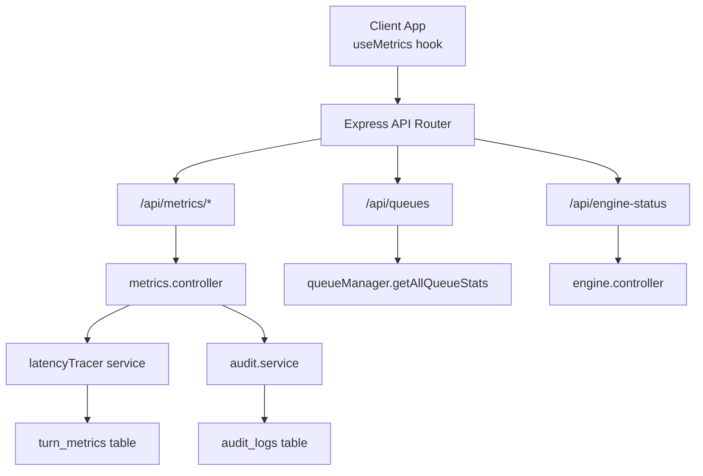
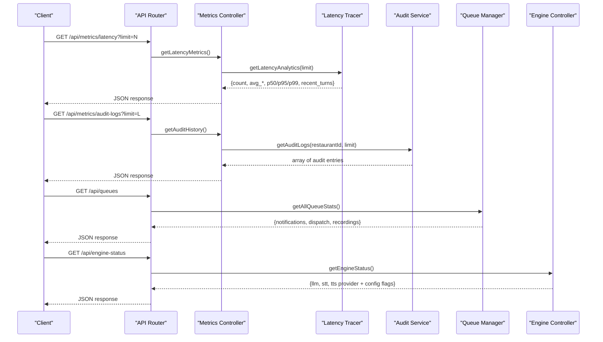
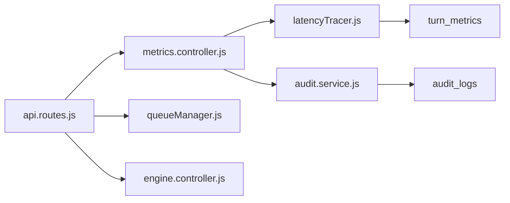

# Metrics & Monitoring API

<cite>
**Referenced Files in This Document**
- [metrics.controller.js](file://server/src/controllers/metrics.controller.js)
- [metrics.routes.js](file://server/src/routes/metrics.routes.js)
- [api.routes.js](file://server/src/routes/api.routes.js)
- [latencyTracer.js](file://server/src/services/latencyTracer.js)
- [audit.service.js](file://server/src/services/audit.service.js)
- [queueManager.js](file://server/src/queue/queueManager.js)
- [engine.controller.js](file://server/src/controllers/engine.controller.js)
- [002_audit_logs_and_metrics.sql](file://server/src/db/migrations/002_audit_logs_and_metrics.sql)
- [useMetrics.js](file://client/src/hooks/useMetrics.js)
- [VoiceAnalytics.jsx](file://client/src/components/VoiceAnalytics.jsx)
</cite>

## Table of Contents
1. Introduction
2. Project Structure
3. Core Components
4. Architecture Overview
5. Detailed Component Analysis
6. Dependency Analysis
7. Performance Considerations
8. Troubleshooting Guide
9. Conclusion
10. Appendices

## Introduction
This document provides comprehensive API documentation for metrics and monitoring endpoints exposed by the server. It covers system statistics, engine status, queue metrics, and audit logs. It also explains metric collection methods, aggregation strategies, data retention considerations, example monitoring queries, dashboard integrations, alerting configurations, and administrative access requirements for sensitive metrics.

## Project Structure
The metrics and monitoring features are implemented across controllers, routes, services, queues, and database migrations:
- Routes expose protected endpoints under /api with role-based access control.
- Controllers orchestrate requests to services and return JSON responses.
- Services implement metric collection, aggregation, and audit logging.
- Queues provide operational health metrics for background workers.
- Database migrations define tables for turn latency metrics and audit logs.

**Diagram sources**
- [api.routes.js:25-36](file://server/src/routes/api.routes.js#L25-L36)
- [metrics.routes.js:4-7](file://server/src/routes/metrics.routes.js#L4-L7)
- [metrics.controller.js:9-28](file://server/src/controllers/metrics.controller.js#L9-L28)
- [latencyTracer.js:95-132](file://server/src/services/latencyTracer.js#L95-L132)
- [audit.service.js:79-91](file://server/src/services/audit.service.js#L79-L91)
- [queueManager.js:104-110](file://server/src/queue/queueManager.js#L104-L110)
- [engine.controller.js:6-24](file://server/src/controllers/engine.controller.js#L6-L24)

**Section sources**
- [api.routes.js:25-36](file://server/src/routes/api.routes.js#L25-L36)
- [metrics.routes.js:4-7](file://server/src/routes/metrics.routes.js#L4-L7)

## Core Components
- Metrics Controller: Exposes latency analytics and audit log retrieval.
- Latency Tracer Service: Collects per-turn latencies (VAD, STT, LLM, TTS), persists them, and computes percentiles and averages.
- Audit Service: Records tamper-evident state transition logs using a cryptographic hash chain and provides retrieval and verification.
- Queue Manager: Manages named job queues and exposes aggregate stats (pending, active, dead-letter counts).
- Engine Controller: Reports configured providers and their configuration status for LLM, STT, and TTS.
- API Routes: Protects observability endpoints with role-based access control and mounts sub-routers.

**Section sources**
- [metrics.controller.js:9-28](file://server/src/controllers/metrics.controller.js#L9-L28)
- [latencyTracer.js:12-132](file://server/src/services/latencyTracer.js#L12-L132)
- [audit.service.js:19-91](file://server/src/services/audit.service.js#L19-L91)
- [queueManager.js:104-110](file://server/src/queue/queueManager.js#L104-L110)
- [engine.controller.js:6-24](file://server/src/controllers/engine.controller.js#L6-L24)
- [api.routes.js:25-36](file://server/src/routes/api.routes.js#L25-L36)

## Architecture Overview
The monitoring stack integrates real-time client polling with server-side services that query persisted metrics and live queue states. Role-based middleware ensures only authorized roles can access sensitive telemetry.

**Diagram sources**
- [metrics.controller.js:9-28](file://server/src/controllers/metrics.controller.js#L9-L28)
- [latencyTracer.js:95-132](file://server/src/services/latencyTracer.js#L95-L132)
- [audit.service.js:79-91](file://server/src/services/audit.service.js#L79-L91)
- [queueManager.js:104-110](file://server/src/queue/queueManager.js#L104-L110)
- [engine.controller.js:6-24](file://server/src/controllers/engine.controller.js#L6-L24)
- [api.routes.js:25-36](file://server/src/routes/api.routes.js#L25-L36)

## Detailed Component Analysis

### Endpoints Reference

- GET /api/metrics/latency
  - Purpose: Retrieve aggregated voice turn latency analytics including percentiles and recent turns.
  - Query parameters:
    - limit: integer, default 100, clamped between 1 and 200.
  - Access: Requires RESTAURANT_MANAGER or ADMIN role.
  - Response schema:
    - count: number
    - avg_total_ms: number
    - avg_stt_ms: number
    - avg_llm_ms: number
    - avg_tts_ms: number
    - p50_ms: number
    - p95_ms: number
    - p99_ms: number
    - recent_turns: array of objects with fields like session_id, call_id, turn_number, vad_ms, stt_ms, llm_ms, tts_ms, total_ms, provider_llm, provider_tts, language, created_at
  - Notes: Percentiles computed over the last N records ordered by creation time.

- GET /api/metrics/audit-logs
  - Purpose: Retrieve immutable audit trail entries for a restaurant.
  - Query parameters:
    - limit: integer, default 50, clamped between 1 and 100.
  - Access: Requires RESTAURANT_MANAGER or ADMIN role.
  - Response schema:
    - Array of objects with fields: id, tenant_id, restaurant_id, actor_type, actor_id, action, resource_type, resource_id, before_state, after_state, metadata, previous_hash, hash, created_at
  - Notes: before_state, after_state, and metadata are parsed from stored JSON strings.

- GET /api/queues
  - Purpose: Get operational health metrics for background worker queues.
  - Access: Requires RESTAURANT_MANAGER or ADMIN role.
  - Response schema:
    - notifications: object with pending, active, dlqCount
    - dispatch: object with pending, active, dlqCount
    - recordings: object with pending, active, dlqCount

- GET /api/engine-status
  - Purpose: Report AI pipeline provider configuration and readiness indicators.
  - Access: Protected route boundary; typically requires authentication.
  - Response schema:
    - llm: object with provider and additional status fields
    - stt: object with provider and boolean flags indicating configured providers
    - tts: object with provider and boolean flags indicating configured providers

**Section sources**
- [metrics.controller.js:9-28](file://server/src/controllers/metrics.controller.js#L9-L28)
- [latencyTracer.js:95-132](file://server/src/services/latencyTracer.js#L95-L132)
- [audit.service.js:79-91](file://server/src/services/audit.service.js#L79-L91)
- [queueManager.js:104-110](file://server/src/queue/queueManager.js#L104-L110)
- [engine.controller.js:6-24](file://server/src/controllers/engine.controller.js#L6-L24)
- [api.routes.js:25-36](file://server/src/routes/api.routes.js#L25-L36)

### Metric Collection Methods

- Turn Latency Collection
  - A trace is started per voice session and turn, recording stage durations for VAD, STT, LLM, and TTS.
  - On completion, totals are computed and persisted to the turn_metrics table.
  - Aggregation returns average values and percentiles (P50, P95, P99) over recent records.

- Audit Log Recording
  - Each state mutation records before/after snapshots and metadata.
  - A cryptographic hash chain links each block to the previous one for tamper evidence.
  - Retrieval parses stored JSON fields into structured objects.

- Queue Health Metrics
  - Named queues track pending jobs, active processing, and dead-letter queue counts.
  - Aggregated stats are exposed via a single endpoint for all queues.

- Engine Status
  - Reports configured providers and environment-based configuration flags for LLM, STT, and TTS.

**Section sources**
- [latencyTracer.js:12-90](file://server/src/services/latencyTracer.js#L12-L90)
- [latencyTracer.js:95-132](file://server/src/services/latencyTracer.js#L95-L132)
- [audit.service.js:19-77](file://server/src/services/audit.service.js#L19-L77)
- [audit.service.js:79-91](file://server/src/services/audit.service.js#L79-L91)
- [queueManager.js:104-110](file://server/src/queue/queueManager.js#L104-L110)
- [engine.controller.js:6-24](file://server/src/controllers/engine.controller.js#L6-L24)

### Data Retention Policies
- Persistence:
  - Turn metrics are inserted into the turn_metrics table on each completed turn.
  - Audit logs are inserted into the audit_logs table for every state change.
- Indexes:
  - Indices exist on audit_logs(resource_type, resource_id), audit_logs(restaurant_id), turn_metrics(session_id), and turn_metrics(call_id) to support efficient querying.
- Retention:
  - No explicit cleanup or TTL logic is present in the referenced files. Implement retention policies at the database level (e.g., scheduled jobs to archive or delete older rows) based on operational needs.

**Section sources**
- [latencyTracer.js:64-86](file://server/src/services/latencyTracer.js#L64-L86)
- [audit.service.js:48-76](file://server/src/services/audit.service.js#L48-L76)
- [002_audit_logs_and_metrics.sql:6-46](file://server/src/db/migrations/002_audit_logs_and_metrics.sql#L6-L46)

### Administrative Access Requirements
- Observability endpoints (/api/metrics/*) require RESTAURANT_MANAGER or ADMIN roles.
- Queue stats (/api/queues) require RESTAURANT_MANAGER or ADMIN roles.
- Engine status (/api/engine-status) is within the protected route boundary and typically requires authentication.
- The client uses these endpoints to render dashboards; ensure tokens include appropriate roles.

**Section sources**
- [api.routes.js:25-36](file://server/src/routes/api.routes.js#L25-L36)

### Example Monitoring Queries
- Latency Analytics
  - GET /api/metrics/latency?limit=100
  - Use recent_turns to inspect per-turn breakdowns and identify outliers.
- Audit Logs
  - GET /api/metrics/audit-logs?limit=50
  - Filter client-side by action or resource_type for targeted investigations.
- Queue Health
  - GET /api/queues
  - Monitor dlqCount to detect failures; alert when thresholds exceed targets.
- Engine Status
  - GET /api/engine-status
  - Check provider flags to validate environment configuration.

**Section sources**
- [metrics.controller.js:9-28](file://server/src/controllers/metrics.controller.js#L9-L28)
- [queueManager.js:104-110](file://server/src/queue/queueManager.js#L104-L110)
- [engine.controller.js:6-24](file://server/src/controllers/engine.controller.js#L6-L24)

### Dashboard Integrations
- Client Hook
  - useMetrics periodically fetches latency, queue stats, audit logs, and engine status, then updates UI state.
- Voice Analytics UI
  - Displays percentile cards, queue depths, and audit log tables for observability.

**Section sources**
- [useMetrics.js:14-70](file://client/src/hooks/useMetrics.js#L14-L70)
- [VoiceAnalytics.jsx:5-159](file://client/src/components/VoiceAnalytics.jsx#L5-L159)

### Alerting Configurations
- Latency Alerts
  - Trigger alerts when p95_ms or p99_ms exceed target thresholds (e.g., >800ms).
- Queue Alerts
  - Alert when dlqCount increases beyond acceptable levels or when pending/backlog grows rapidly.
- Engine Alerts
  - Alert if provider configuration flags indicate missing credentials or if provider status reports unhealthy conditions.

[No sources needed since this section provides general guidance]

## Dependency Analysis
The monitoring stack has clear separation of concerns:
- Routes depend on controllers and middleware for authorization.
- Controllers depend on services for data aggregation and persistence.
- Services depend on database operations and external provider adapters.
- Queues encapsulate worker logic and expose stats through a unified interface.

**Diagram sources**
- [api.routes.js:25-36](file://server/src/routes/api.routes.js#L25-L36)
- [metrics.controller.js:9-28](file://server/src/controllers/metrics.controller.js#L9-L28)
- [latencyTracer.js:95-132](file://server/src/services/latencyTracer.js#L95-L132)
- [audit.service.js:79-91](file://server/src/services/audit.service.js#L79-L91)
- [queueManager.js:104-110](file://server/src/queue/queueManager.js#L104-L110)
- [engine.controller.js:6-24](file://server/src/controllers/engine.controller.js#L6-L24)

**Section sources**
- [api.routes.js:25-36](file://server/src/routes/api.routes.js#L25-L36)

## Performance Considerations
- Limit Parameter Clamping
  - Latency and audit endpoints clamp limits to prevent excessive payloads and database scans.
- Asynchronous Persistence
  - Turn metrics are persisted asynchronously to avoid blocking request flows.
- Index Usage
  - Existing indexes on audit_logs and turn_metrics improve query performance for common filters.
- Aggregation Strategy
  - Percentiles are computed in-memory over recent rows; consider pre-aggregation for very large datasets.

**Section sources**
- [metrics.controller.js:10-13](file://server/src/controllers/metrics.controller.js#L10-L13)
- [latencyTracer.js:64-86](file://server/src/services/latencyTracer.js#L64-L86)
- [latencyTracer.js:95-132](file://server/src/services/latencyTracer.js#L95-L132)
- [002_audit_logs_and_metrics.sql:41-46](file://server/src/db/migrations/002_audit_logs_and_metrics.sql#L41-L46)

## Troubleshooting Guide
- Missing or Incorrect Roles
  - Ensure the authenticated user has RESTAURANT_MANAGER or ADMIN roles to access metrics and queue endpoints.
- Empty Metrics
  - If latency analytics return zeroed aggregates, verify that turn traces are being started and finished correctly.
- Audit Chain Integrity
  - Use the audit chain verification function to detect tampering or broken chains.
- Queue Backlogs
  - Investigate high dlqCount or pending counts; check worker processors and idempotency keys for duplicates.

**Section sources**
- [api.routes.js:25-36](file://server/src/routes/api.routes.js#L25-L36)
- [latencyTracer.js:12-90](file://server/src/services/latencyTracer.js#L12-L90)
- [audit.service.js:96-141](file://server/src/services/audit.service.js#L96-L141)
- [queueManager.js:15-75](file://server/src/queue/queueManager.js#L15-L75)

## Conclusion
The Metrics & Monitoring API provides robust observability for voice interactions, background processing, and system configuration. With role-protected endpoints, clear schemas, and strong audit trails, teams can build dashboards, set up alerts, and maintain high reliability. For long-term scalability, consider implementing data retention policies and pre-aggregation strategies for large-scale deployments.

## Appendices

### Request/Response Schemas Summary
- Latency Analytics
  - Request: GET /api/metrics/latency?limit=[1..200]
  - Response: { count, avg_total_ms, avg_stt_ms, avg_llm_ms, avg_tts_ms, p50_ms, p95_ms, p99_ms, recent_turns[] }
- Audit Logs
  - Request: GET /api/metrics/audit-logs?limit=[1..100]
  - Response: [{ id, tenant_id, restaurant_id, actor_type, actor_id, action, resource_type, resource_id, before_state, after_state, metadata, previous_hash, hash, created_at }]
- Queue Stats
  - Request: GET /api/queues
  - Response: { notifications: { pending, active, dlqCount }, dispatch: {...}, recordings: {...} }
- Engine Status
  - Request: GET /api/engine-status
  - Response: { llm: { provider, ... }, stt: { provider, groq_configured, google_configured }, tts: { provider, sarvam_configured, google_configured } }

**Section sources**
- [metrics.controller.js:9-28](file://server/src/controllers/metrics.controller.js#L9-L28)
- [latencyTracer.js:95-132](file://server/src/services/latencyTracer.js#L95-L132)
- [audit.service.js:79-91](file://server/src/services/audit.service.js#L79-L91)
- [queueManager.js:104-110](file://server/src/queue/queueManager.js#L104-L110)
- [engine.controller.js:6-24](file://server/src/controllers/engine.controller.js#L6-L24)