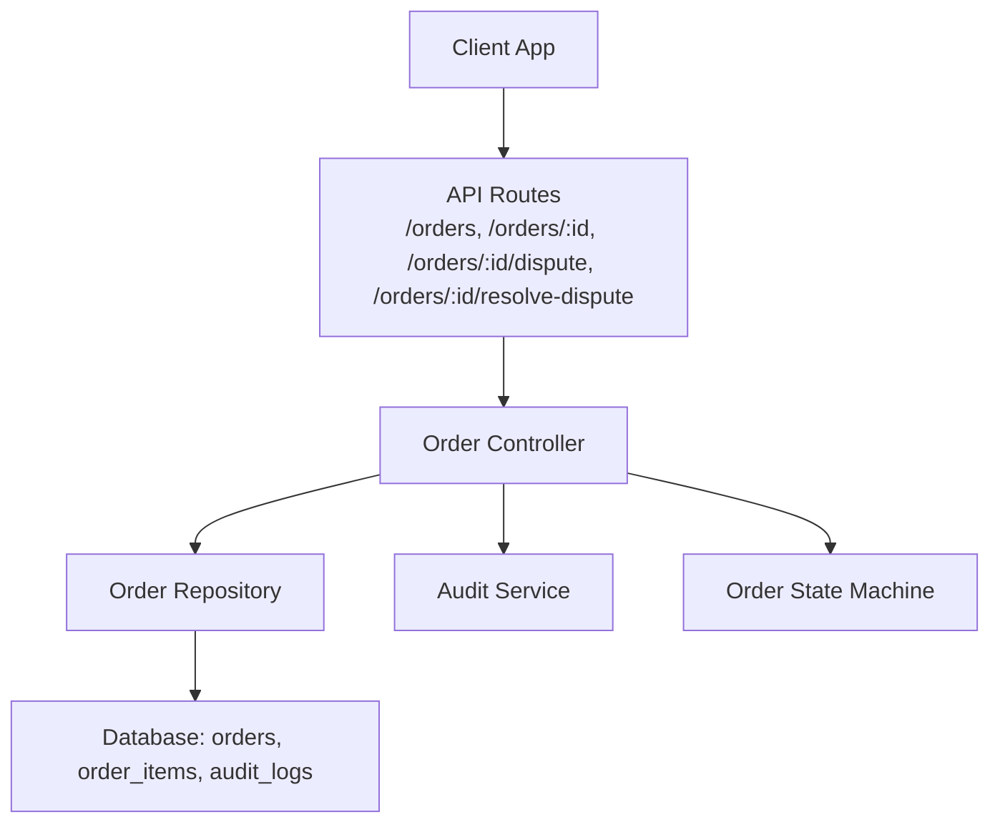
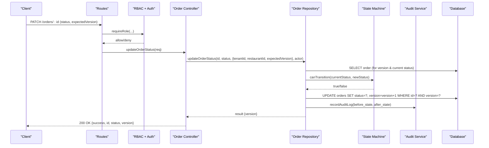
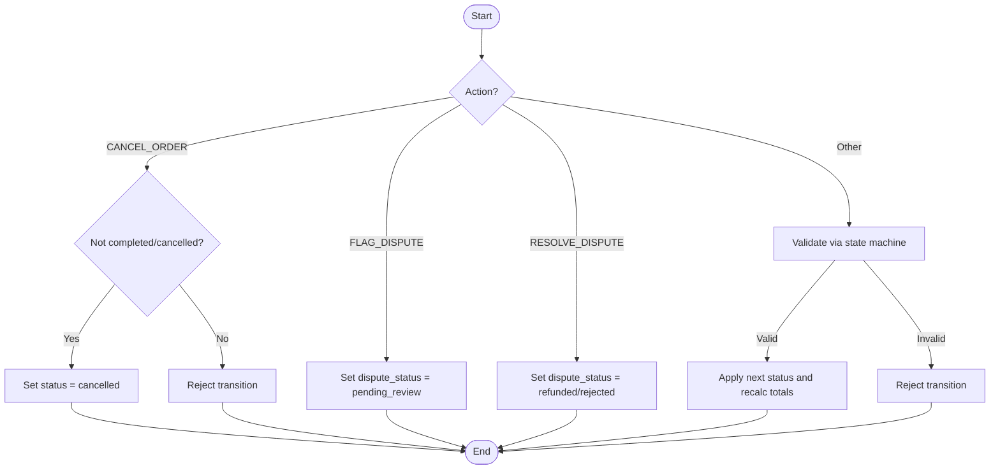
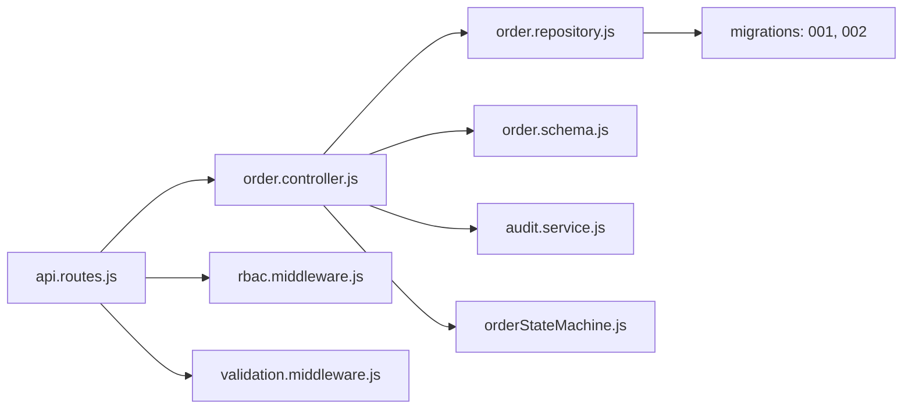

# Order Management API

<cite>
**Referenced Files in This Document**
- [order.controller.js](file://server/src/controllers/order.controller.js)
- [orderStateMachine.js](file://server/src/domain/orders/orderStateMachine.js)
- [order.repository.js](file://server/src/domain/orders/order.repository.js)
- [order.schema.js](file://server/src/schemas/order.schema.js)
- [api.routes.js](file://server/src/routes/api.routes.js)
- [rbac.middleware.js](file://server/src/middleware/rbac.middleware.js)
- [validation.middleware.js](file://server/src/middleware/validation.middleware.js)
- [audit.service.js](file://server/src/services/audit.service.js)
- [001_initial_multitenant_schema.sql](file://server/src/db/migrations/001_initial_multitenant_schema.sql)
- [002_audit_logs_and_metrics.sql](file://server/src/db/migrations/002_audit_logs_and_metrics.sql)
</cite>

## Table of Contents
1. Introduction
2. Project Structure
3. Core Components
4. Architecture Overview
5. Detailed Component Analysis
6. Dependency Analysis
7. Performance Considerations
8. Troubleshooting Guide
9. Conclusion

## Introduction
This document provides comprehensive API documentation for order management endpoints, including order retrieval, status updates, dispute handling, and resolution workflows. It details request/response schemas, state transitions, business rules, audit logging, role-based permissions, and examples for typical order lifecycle operations. The system enforces strict multi-tenant scoping, optimistic concurrency control, and an authoritative state machine to ensure data integrity and compliance.

## Project Structure
The order management feature spans controllers, domain logic (state machine and repository), schema validation, routes with RBAC guards, and audit services. Database migrations define the orders, order items, and audit logs tables used by these components.

**Diagram sources**
- [api.routes.js:88-108](file://server/src/routes/api.routes.js#L88-L108)
- [order.controller.js:22-136](file://server/src/controllers/order.controller.js#L22-L136)
- [order.repository.js:24-322](file://server/src/domain/orders/order.repository.js#L24-L322)
- [orderStateMachine.js:8-325](file://server/src/domain/orders/orderStateMachine.js#L8-L325)
- [audit.service.js:19-77](file://server/src/services/audit.service.js#L19-L77)
- [001_initial_multitenant_schema.sql:173-210](file://server/src/db/migrations/001_initial_multitenant_schema.sql#L173-L210)
- [002_audit_logs_and_metrics.sql:7-22](file://server/src/db/migrations/002_audit_logs_and_metrics.sql#L7-L22)

**Section sources**
- [api.routes.js:88-108](file://server/src/routes/api.routes.js#L88-L108)
- [order.controller.js:22-136](file://server/src/controllers/order.controller.js#L22-L136)
- [order.repository.js:24-322](file://server/src/domain/orders/order.repository.js#L24-L322)
- [orderStateMachine.js:8-325](file://server/src/domain/orders/orderStateMachine.js#L8-L325)
- [audit.service.js:19-77](file://server/src/services/audit.service.js#L19-L77)
- [001_initial_multitenant_schema.sql:173-210](file://server/src/db/migrations/001_initial_multitenant_schema.sql#L173-L210)
- [002_audit_logs_and_metrics.sql:7-22](file://server/src/db/migrations/002_audit_logs_and_metrics.sql#L7-L22)

## Core Components
- Order Controller: Exposes REST endpoints for listing orders, retrieving a single order, updating order status, flagging disputes, and resolving disputes. Enforces tenant/restaurant scoping and records audit events.
- Order Repository: Provides persistence functions for creating orders, querying recent orders and order details, updating statuses with state machine validation and optimistic locking, and soft deletion. Emits outbox events and writes audit logs.
- Order State Machine: Defines valid states, actions, transition rules, and state mutation logic for order lifecycles and dispute handling.
- Schema Validation: Zod schemas validate request bodies for status updates and dispute operations.
- RBAC Middleware: Restricts access based on roles (Kitchen, Staff, Restaurant Manager, Admin).
- Audit Service: Records tamper-evident audit logs with cryptographic hash chaining for compliance.

**Section sources**
- [order.controller.js:22-136](file://server/src/controllers/order.controller.js#L22-L136)
- [order.repository.js:24-322](file://server/src/domain/orders/order.repository.js#L24-L322)
- [orderStateMachine.js:8-325](file://server/src/domain/orders/orderStateMachine.js#L8-L325)
- [order.schema.js:1-22](file://server/src/schemas/order.schema.js#L1-L22)
- [rbac.middleware.js:1-32](file://server/src/middleware/rbac.middleware.js#L1-L32)
- [audit.service.js:19-77](file://server/src/services/audit.service.js#L19-L77)

## Architecture Overview
The API follows a layered architecture:
- Routes enforce authentication and role-based access, then delegate to controller methods.
- Controllers extract tenant/restaurant context from authenticated requests, validate inputs via schemas, and call repository functions.
- Repositories perform database operations within transactions, enforce state transitions, update versions for optimistic concurrency, write audit logs, and enqueue outbox events.
- The state machine defines permissible transitions and dispute lifecycle behavior.

**Diagram sources**
- [api.routes.js:91-96](file://server/src/routes/api.routes.js#L91-L96)
- [order.controller.js:48-63](file://server/src/controllers/order.controller.js#L48-L63)
- [order.repository.js:220-287](file://server/src/domain/orders/order.repository.js#L220-L287)
- [orderStateMachine.js:73-148](file://server/src/domain/orders/orderStateMachine.js#L73-L148)
- [audit.service.js:19-77](file://server/src/services/audit.service.js#L19-L77)

## Detailed Component Analysis

### Endpoints

#### List Orders
- Method: GET
- Path: /orders
- Roles: Kitchen, Staff, Restaurant Manager, Admin
- Query Parameters:
  - limit: integer, default 50, min 1, max 100
- Response: Array of order objects with embedded items
- Notes: Multi-tenant scoped by tenantId and restaurantId from auth context

Request Example
- Headers: Authorization: Bearer <token>
- Query: ?limit=20

Response Example
- 200 OK: Array of order objects

Error Responses
- 401 Unauthorized: Missing or invalid authentication
- 403 Forbidden: Insufficient role
- 400 Bad Request: Invalid query parameters

**Section sources**
- [api.routes.js:89-90](file://server/src/routes/api.routes.js#L89-L90)
- [order.controller.js:22-32](file://server/src/controllers/order.controller.js#L22-L32)
- [order.repository.js:145-186](file://server/src/domain/orders/order.repository.js#L145-L186)
- [rbac.middleware.js:15-28](file://server/src/middleware/rbac.middleware.js#L15-L28)

#### Get Order By ID
- Method: GET
- Path: /orders/:id
- Roles: Kitchen, Staff, Restaurant Manager, Admin
- Path Parameter: id (order identifier)
- Response: Order object with items array
- Notes: Multi-tenant scoped; returns 404 if not found

Request Example
- Headers: Authorization: Bearer <token>

Response Example
- 200 OK: Order object

Error Responses
- 404 Not Found: Order not found for tenant/restaurant

**Section sources**
- [api.routes.js:90-90](file://server/src/routes/api.routes.js#L90-L90)
- [order.controller.js:34-46](file://server/src/controllers/order.controller.js#L34-L46)
- [order.repository.js:188-218](file://server/src/domain/orders/order.repository.js#L188-L218)

#### Update Order Status
- Method: PATCH
- Path: /orders/:id
- Roles: Kitchen, Staff, Restaurant Manager, Admin
- Request Body:
  - status: enum ["pending", "confirmed", "preparing", "ready", "dispatched", "delivered", "cancelled"]
  - expectedVersion: positive integer (optional)
  - notes: string up to 500 chars (optional)
- Response: Success object with id, status, version
- Business Rules:
  - Valid transitions enforced by repository using allowed transitions map
  - Optimistic concurrency via version field; conflict returns 409
  - Audit log recorded with before/after state
  - Outbox event emitted for status change

Request Example
- Headers: Authorization: Bearer <token>
- Body: { "status": "confirmed", "expectedVersion": 1 }

Response Example
- 200 OK: { "success": true, "id": "<orderId>", "status": "confirmed", "version": 2 }

Error Responses
- 400 Bad Request: Validation error
- 404 Not Found: Order not found
- 409 Conflict: Illegal state transition or optimistic lock conflict

**Section sources**
- [api.routes.js:91-96](file://server/src/routes/api.routes.js#L91-L96)
- [order.schema.js:3-9](file://server/src/schemas/order.schema.js#L3-L9)
- [order.controller.js:48-63](file://server/src/controllers/order.controller.js#L48-L63)
- [order.repository.js:220-287](file://server/src/domain/orders/order.repository.js#L220-L287)
- [validation.middleware.js:7-18](file://server/src/middleware/validation.middleware.js#L7-L18)

#### Flag Order Dispute
- Method: POST
- Path: /orders/:id/dispute
- Roles: Staff, Restaurant Manager, Admin
- Request Body:
  - reason: string min 3, max 500
  - notes: string up to 1000 chars (optional)
- Response: Success object with id and dispute_status set to flagged
- Notes: Updates dispute fields atomically within a transaction; audit log recorded

Request Example
- Headers: Authorization: Bearer <token>
- Body: { "reason": "Wrong item delivered", "notes": "Customer reported missing side dish" }

Response Example
- 200 OK: { "success": true, "id": "<orderId>", "dispute_status": "flagged" }

Error Responses
- 400 Bad Request: Validation error
- 404 Not Found: Order not found

**Section sources**
- [api.routes.js:97-102](file://server/src/routes/api.routes.js#L97-L102)
- [order.schema.js:11-14](file://server/src/schemas/order.schema.js#L11-L14)
- [order.controller.js:65-100](file://server/src/controllers/order.controller.js#L65-L100)

#### Resolve Order Dispute
- Method: POST
- Path: /orders/:id/resolve-dispute
- Roles: Restaurant Manager, Admin
- Request Body:
  - resolutionNotes: string min 3, max 1000
  - action: enum ["refund", "reorder", "dismiss"]
- Response: Success object with id, dispute_status set to resolved, and action
- Notes: Updates dispute fields atomically within a transaction; audit log recorded

Request Example
- Headers: Authorization: Bearer <token>
- Body: { "resolutionNotes": "Issued refund per policy", "action": "refund" }

Response Example
- 200 OK: { "success": true, "id": "<orderId>", "dispute_status": "resolved", "action": "refund" }

Error Responses
- 400 Bad Request: Validation error
- 404 Not Found: Order not found

**Section sources**
- [api.routes.js:103-108](file://server/src/routes/api.routes.js#L103-L108)
- [order.schema.js:16-21](file://server/src/schemas/order.schema.js#L16-L21)
- [order.controller.js:102-135](file://server/src/controllers/order.controller.js#L102-L135)

### Data Models

#### Order Object
- Fields:
  - id: integer
  - tenant_id: text
  - restaurant_id: text
  - call_id: integer (nullable)
  - customer_id: integer (nullable)
  - ondc_order_id: text (nullable)
  - status: text ("pending", "confirmed", "preparing", "ready", "dispatched", "delivered", "cancelled")
  - subtotal: real
  - tax: real
  - delivery_fee: real
  - discount: real
  - total_amount: real
  - currency: text (default "INR")
  - payment_status: text (default "pending")
  - payment_link: text (nullable)
  - delivery_address: text (nullable)
  - landmark: text (nullable)
  - items: text (JSON array of line items)
  - scheduled_for: timestamp (nullable)
  - version: integer (default 1)
  - deleted_at: timestamp (nullable)
  - deleted_by: text (nullable)
  - created_at: timestamp
  - updated_at: timestamp
- Items Array:
  - catalog_item_id: integer (nullable)
  - name: text
  - price: real
  - quantity: integer
  - line_total: real

**Section sources**
- [001_initial_multitenant_schema.sql:173-210](file://server/src/db/migrations/001_initial_multitenant_schema.sql#L173-L210)
- [order.repository.js:188-218](file://server/src/domain/orders/order.repository.js#L188-L218)

#### Dispute Metadata
- Fields:
  - dispute_status: text (default "none"; transitions include flagged/resolved)
  - dispute_reason: text (nullable)
  - dispute_notes: text (nullable)
  - dispute_resolved_by: text (nullable)
- Notes: Updated via dispute flag and resolve endpoints; audit logs capture changes

**Section sources**
- [order.controller.js:65-135](file://server/src/controllers/order.controller.js#L65-L135)
- [001_initial_multitenant_schema.sql:213-221](file://server/src/db/migrations/001_initial_multitenant_schema.sql#L213-L221)

### Order State Machine Integration
- States: new, collecting_items, collecting_address, validating, awaiting_confirmation, confirmed, payment_pending, payment_confirmed, dispatch_pending, dispatched, completed, cancelled, needs_human
- Actions: START_ORDER, ADD_ITEM, REMOVE_ITEM, CLEAR_ITEMS, SET_ADDRESS, SET_LANDMARK, REQUEST_CONFIRMATION, CONFIRM_ORDER, CANCEL_ORDER, TRIGGER_PAYMENT, PAYMENT_SUCCESS, DISPATCH_ORDER, COMPLETE_ORDER, REQUEST_HUMAN, FLAG_DISPUTE, RESOLVE_DISPUTE
- Transition Rules:
  - Global actions like CANCEL_ORDER are allowed except from terminal states
  - Dispute actions (FLAG_DISPUTE, RESOLVE_DISPUTE) are permitted from multiple states including dispatched, completed, cancelled, needs_human
- State Mutation:
  - Computes totals, updates history, and sets dispute fields when applicable

**Diagram sources**
- [orderStateMachine.js:8-41](file://server/src/domain/orders/orderStateMachine.js#L8-L41)
- [orderStateMachine.js:73-148](file://server/src/domain/orders/orderStateMachine.js#L73-L148)
- [orderStateMachine.js:154-325](file://server/src/domain/orders/orderStateMachine.js#L154-L325)

**Section sources**
- [orderStateMachine.js:8-325](file://server/src/domain/orders/orderStateMachine.js#L8-L325)

### Business Rules for Status Changes
- Allowed transitions are enforced server-side:
  - pending -> confirmed, preparing, cancelled
  - confirmed -> preparing, cancelled
  - preparing -> ready, cancelled
  - ready -> dispatched, cancelled
  - dispatched -> delivered, cancelled
  - delivered -> no further transitions
  - cancelled -> no further transitions
- Optimistic Concurrency:
  - Version increments on each status update
  - Conflicts return 409 with message instructing refresh
- Audit Logging:
  - Before and after states captured
  - Actor type and ID recorded
- Outbox Events:
  - ORDER_STATUS_CHANGED emitted for downstream consumers

**Section sources**
- [order.repository.js:9-17](file://server/src/domain/orders/order.repository.js#L9-L17)
- [order.repository.js:220-287](file://server/src/domain/orders/order.repository.js#L220-L287)
- [audit.service.js:19-77](file://server/src/services/audit.service.js#L19-L77)

### Role-Based Permissions
- Roles: ADMIN, RESTAURANT_MANAGER, STAFF, KITCHEN
- Endpoint Access:
  - GET /orders, GET /orders/:id: Kitchen, Staff, Restaurant Manager, Admin
  - PATCH /orders/:id: Kitchen, Staff, Restaurant Manager, Admin
  - POST /orders/:id/dispute: Staff, Restaurant Manager, Admin
  - POST /orders/:id/resolve-dispute: Restaurant Manager, Admin

**Section sources**
- [rbac.middleware.js:3-8](file://server/src/middleware/rbac.middleware.js#L3-L8)
- [api.routes.js:88-108](file://server/src/routes/api.routes.js#L88-L108)

### Examples

#### Order Lifecycle Operations
- Create Order: Handled by voice/cart flow; creates order with snapshots and emits ORDER_CONFIRMED outbox event
- Confirm Order: Transition from pending to confirmed via status update
- Prepare Order: Transition from confirmed to preparing
- Ready for Dispatch: Transition from preparing to ready
- Dispatch: Transition from ready to dispatched
- Deliver: Transition from dispatched to delivered
- Cancel: Any non-terminal state allows cancellation

**Section sources**
- [order.repository.js:24-143](file://server/src/domain/orders/order.repository.js#L24-L143)
- [order.repository.js:220-287](file://server/src/domain/orders/order.repository.js#L220-L287)

#### Bulk Status Updates
- Note: No bulk endpoint is defined in the current codebase. To implement bulk updates, consider adding a batch endpoint that iterates over order IDs, validates transitions per order, applies optimistic concurrency checks, and records audit logs per update. Ensure idempotency and transaction boundaries where appropriate.

[No sources needed since this section proposes conceptual implementation]

#### Dispute Management
- Flag Dispute: Staff/Manager/Admin flags an order with reason and optional notes; dispute_status becomes flagged
- Resolve Dispute: Manager/Admin resolves with action (refund, reorder, dismiss) and resolution notes; dispute_status becomes resolved

**Section sources**
- [order.controller.js:65-135](file://server/src/controllers/order.controller.js#L65-L135)
- [order.schema.js:11-21](file://server/src/schemas/order.schema.js#L11-L21)

### Audit Logging
- Immutable, tamper-evident audit trail using cryptographic hash chains
- Captures tenant, restaurant, actor, action, resource, before/after states, and metadata
- Verification function available to validate chain integrity

**Section sources**
- [audit.service.js:19-77](file://server/src/services/audit.service.js#L19-L77)
- [002_audit_logs_and_metrics.sql:7-22](file://server/src/db/migrations/002_audit_logs_and_metrics.sql#L7-L22)

## Dependency Analysis

**Diagram sources**
- [api.routes.js:88-108](file://server/src/routes/api.routes.js#L88-L108)
- [order.controller.js:22-136](file://server/src/controllers/order.controller.js#L22-L136)
- [order.repository.js:24-322](file://server/src/domain/orders/order.repository.js#L24-L322)
- [order.schema.js:1-22](file://server/src/schemas/order.schema.js#L1-L22)
- [audit.service.js:19-77](file://server/src/services/audit.service.js#L19-L77)
- [orderStateMachine.js:8-325](file://server/src/domain/orders/orderStateMachine.js#L8-L325)
- [rbac.middleware.js:1-32](file://server/src/middleware/rbac.middleware.js#L1-L32)
- [validation.middleware.js:1-48](file://server/src/middleware/validation.middleware.js#L1-L48)
- [001_initial_multitenant_schema.sql:173-210](file://server/src/db/migrations/001_initial_multitenant_schema.sql#L173-L210)
- [002_audit_logs_and_metrics.sql:7-22](file://server/src/db/migrations/002_audit_logs_and_metrics.sql#L7-L22)

**Section sources**
- [api.routes.js:88-108](file://server/src/routes/api.routes.js#L88-L108)
- [order.controller.js:22-136](file://server/src/controllers/order.controller.js#L22-L136)
- [order.repository.js:24-322](file://server/src/domain/orders/order.repository.js#L24-L322)
- [order.schema.js:1-22](file://server/src/schemas/order.schema.js#L1-L22)
- [audit.service.js:19-77](file://server/src/services/audit.service.js#L19-L77)
- [orderStateMachine.js:8-325](file://server/src/domain/orders/orderStateMachine.js#L8-L325)
- [rbac.middleware.js:1-32](file://server/src/middleware/rbac.middleware.js#L1-L32)
- [validation.middleware.js:1-48](file://server/src/middleware/validation.middleware.js#L1-L48)
- [001_initial_multitenant_schema.sql:173-210](file://server/src/db/migrations/001_initial_multitenant_schema.sql#L173-L210)
- [002_audit_logs_and_metrics.sql:7-22](file://server/src/db/migrations/002_audit_logs_and_metrics.sql#L7-L22)

## Performance Considerations
- Pagination: Use limit parameter to cap results; defaults to 50 with hard caps at 100
- Optimistic Concurrency: Prevents race conditions by requiring expectedVersion; reduces contention compared to row locks
- Transactional Writes: All mutations occur within transactions to ensure consistency
- Audit Logs: Append-only logs with hashing; consider indexing strategies for large datasets
- Outbox Events: Decouple downstream processing; monitor queue backlogs

[No sources needed since this section provides general guidance]

## Troubleshooting Guide
Common Errors and Resolutions
- VALIDATION_ERROR (400):
  - Cause: Request body or query parameters fail schema validation
  - Resolution: Ensure status values match allowed enums; provide required fields like reason and resolutionNotes
- ORDER_NOT_FOUND (404):
  - Cause: Order does not exist for the given tenant/restaurant or has been soft-deleted
  - Resolution: Verify order ID and tenant/restaurant context
- ILLEGAL_STATE_TRANSITION (409):
  - Cause: Attempted status change not allowed by business rules
  - Resolution: Review current order status and allowed transitions
- OPTIMISTIC_LOCK_CONFLICT (409):
  - Cause: Another user updated the order concurrently
  - Resolution: Refresh order data and retry with updated expectedVersion
- AUTH_REQUIRED (401):
  - Cause: Missing or invalid authentication
  - Resolution: Provide valid bearer token
- FORBIDDEN (403):
  - Cause: Insufficient role for the requested operation
  - Resolution: Ensure user role matches endpoint requirements

**Section sources**
- [validation.middleware.js:7-18](file://server/src/middleware/validation.middleware.js#L7-L18)
- [order.controller.js:34-63](file://server/src/controllers/order.controller.js#L34-L63)
- [order.repository.js:220-287](file://server/src/domain/orders/order.repository.js#L220-L287)
- [rbac.middleware.js:15-28](file://server/src/middleware/rbac.middleware.js#L15-L28)

## Conclusion
The Order Management API provides robust, secure, and compliant endpoints for managing orders and disputes. It enforces strict state transitions, optimistic concurrency, multi-tenant isolation, and tamper-evident audit logging. Role-based access ensures appropriate permissions across operational roles. For bulk operations, consider extending the API with batch endpoints while preserving transactional integrity and auditability.

[No sources needed since this section summarizes without analyzing specific files]