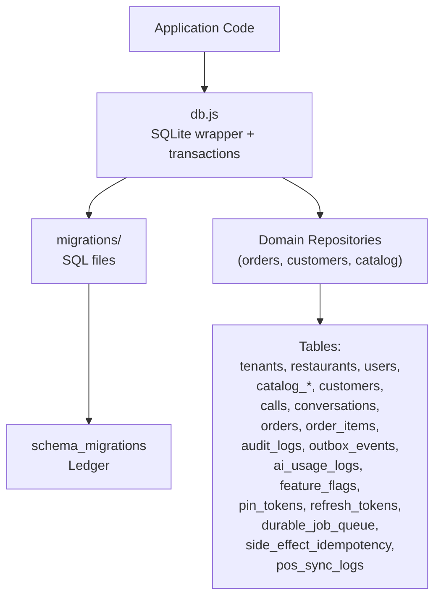
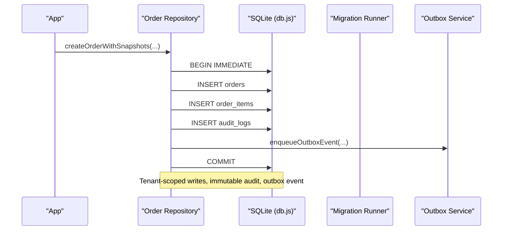
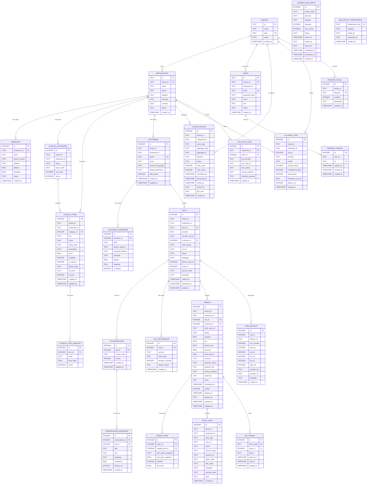

# Database Schema & Migrations

<cite>
**Referenced Files in This Document**
- [001_initial_multitenant_schema.sql](file://server/src/db/migrations/001_initial_multitenant_schema.sql)
- [002_audit_logs_and_metrics.sql](file://server/src/db/migrations/002_audit_logs_and_metrics.sql)
- [003_disputes_and_pos_support.sql](file://server/src/db/migrations/003_disputes_and_pos_support.sql)
- [004_pin_tokens_and_security.sql](file://server/src/db/migrations/004_pin_tokens_and_security.sql)
- [005_enterprise_patterns.sql](file://server/src/db/migrations/005_enterprise_patterns.sql)
- [006_refresh_tokens.sql](file://server/src/db/migrations/006_refresh_tokens.sql)
- [007_durable_job_queue.sql](file://server/src/db/migrations/007_durable_job_queue.sql)
- [008_durable_idempotency.sql](file://server/src/db/migrations/008_durable_idempotency.sql)
- [migrationRunner.js](file://server/src/db/migrations/migrationRunner.js)
- [db.js](file://server/src/db.js)
- [seed.js](file://server/src/db/seed.js)
- [order.repository.js](file://server/src/domain/orders/order.repository.js)
- [customer.repository.js](file://server/src/domain/customers/customer.repository.js)
- [catalog.repository.js](file://server/src/domain/catalog/catalog.repository.js)
</cite>

## Table of Contents
1. [Introduction](#introduction)
2. [Project Structure](#project-structure)
3. [Core Components](#core-components)
4. [Architecture Overview](#architecture-overview)
5. [Detailed Component Analysis](#detailed-component-analysis)
6. [Dependency Analysis](#dependency-analysis)
7. [Performance Considerations](#performance-considerations)
8. [Troubleshooting Guide](#troubleshooting-guide)
9. [Conclusion](#conclusion)
10. [Appendices](#appendices)

## Introduction
This document provides comprehensive database schema documentation for the multi-tenant Inkiro system. It covers all tables, relationships, constraints, and indexes that ensure data integrity across orders, customers, catalog items, calls, and audit logs. It also explains multi-tenant isolation patterns, migration architecture, sample reporting queries, performance optimization, backup and disaster recovery strategies, and data retention policies.

## Project Structure
The database layer is implemented with SQLite (configurable via environment), migrations are versioned SQL files executed by a Node.js runner, and domain repositories enforce strict multi-tenant scoping. The seed script populates initial tenants, restaurants, categories, menu items, and staff users.

**Diagram sources**
- [db.js:11-44](file://server/src/db.js#L11-L44)
- [migrationRunner.js:10-164](file://server/src/db/migrations/migrationRunner.js#L10-L164)
- [001_initial_multitenant_schema.sql:13-221](file://server/src/db/migrations/001_initial_multitenant_schema.sql#L13-L221)
- [002_audit_logs_and_metrics.sql:7-46](file://server/src/db/migrations/002_audit_logs_and_metrics.sql#L7-L46)
- [003_disputes_and_pos_support.sql:2-12](file://server/src/db/migrations/003_disputes_and_pos_support.sql#L2-L12)
- [004_pin_tokens_and_security.sql:6-22](file://server/src/db/migrations/004_pin_tokens_and_security.sql#L6-L22)
- [005_enterprise_patterns.sql:6-62](file://server/src/db/migrations/005_enterprise_patterns.sql#L6-L62)
- [006_refresh_tokens.sql:5-16](file://server/src/db/migrations/006_refresh_tokens.sql#L5-L16)
- [007_durable_job_queue.sql:5-22](file://server/src/db/migrations/007_durable_job_queue.sql#L5-L22)
- [008_durable_idempotency.sql:5-14](file://server/src/db/migrations/008_durable_idempotency.sql#L5-L14)

**Section sources**
- [db.js:11-44](file://server/src/db.js#L11-L44)
- [migrationRunner.js:10-164](file://server/src/db/migrations/migrationRunner.js#L10-L164)

## Core Components
- Multi-tenant root entities: tenants, restaurants, branches, users
- Catalog: categories, items, variants
- Customers and addresses
- Calls, conversations, messages, recordings
- Orders and order items snapshots
- Audit logs, turn metrics, AI usage logs
- Enterprise features: outbox events, feature flags, durable job queue, idempotency ledger, POS sync logs, PIN tokens, refresh tokens

Key design principles:
- Strict multi-tenant scoping enforced at repository level (fail-closed).
- Soft deletes for business records (e.g., orders).
- Versioning and optimistic concurrency on mutable entities.
- Immutable audit trails with optional hash chaining.
- Transactional outbox for reliable event delivery.

**Section sources**
- [001_initial_multitenant_schema.sql:13-221](file://server/src/db/migrations/001_initial_multitenant_schema.sql#L13-L221)
- [002_audit_logs_and_metrics.sql:7-46](file://server/src/db/migrations/002_audit_logs_and_metrics.sql#L7-L46)
- [005_enterprise_patterns.sql:6-62](file://server/src/db/migrations/005_enterprise_patterns.sql#L6-L62)
- [order.repository.js:24-143](file://server/src/domain/orders/order.repository.js#L24-L143)
- [catalog.repository.js:9-109](file://server/src/domain/catalog/catalog.repository.js#L9-L109)
- [customer.repository.js:14-53](file://server/src/domain/customers/customer.repository.js#L14-L53)

## Architecture Overview
The database architecture centers around tenant-scoped resources. All write paths go through domain repositories that enforce tenant context and use transactions. Migrations evolve schema safely, and an outbox pattern ensures eventual consistency with downstream systems.

**Diagram sources**
- [order.repository.js:58-143](file://server/src/domain/orders/order.repository.js#L58-L143)
- [db.js:108-120](file://server/src/db.js#L108-L120)
- [002_audit_logs_and_metrics.sql:7-22](file://server/src/db/migrations/002_audit_logs_and_metrics.sql#L7-L22)
- [005_enterprise_patterns.sql:6-27](file://server/src/db/migrations/005_enterprise_patterns.sql#L6-L27)

## Detailed Component Analysis

### Tenants, Restaurants, Branches, Users
- tenants: root SaaS entity with unique slug and status.
- restaurants: scoped to tenant; includes phone, address, timezone, currency, status.
- branches: child of restaurant; supports location coordinates and contact info.
- users: scoped to tenant; includes role, status, email, password_hash.

Relationships:
- users.tenant_id -> tenants.id
- restaurants.tenant_id -> tenants.id
- branches.restaurant_id -> restaurants.id

Indexes and constraints:
- tenants.slug UNIQUE
- users.email UNIQUE
- Foreign keys enforced at runtime via PRAGMA foreign_keys = ON.

Multi-tenant isolation:
- All queries must include tenant_id and often restaurant_id to scope data.

**Section sources**
- [001_initial_multitenant_schema.sql:13-58](file://server/src/db/migrations/001_initial_multitenant_schema.sql#L13-L58)
- [001_initial_multitenant_schema.sql:22-45](file://server/src/db/migrations/001_initial_multitenant_schema.sql#L22-L45)
- [db.js:29-30](file://server/src/db.js#L29-L30)

### Catalog Categories, Items, Variants
- catalog_categories: name, sort_order, active flag; bilingual support via name_tamil.
- catalog_items: belongs to category; SKU, pricing, availability, dietary tags, STT hints, versioning.
- catalog_item_variants: per-item options with price delta.

Constraints:
- catalog_items.price >= 0
- order_items.quantity > 0 (via schema constraint)
- Foreign keys to categories and items.

Indexes:
- Performance indexes created by migration runner for restaurant-scoped lookups.

**Section sources**
- [001_initial_multitenant_schema.sql:61-98](file://server/src/db/migrations/001_initial_multitenant_schema.sql#L61-L98)
- [migrationRunner.js:156-161](file://server/src/db/migrations/migrationRunner.js#L156-L161)

### Customers and Addresses
- customers: phone-based identity per restaurant; preferences and lifetime order count.
- customer_addresses: multiple labels, geolocation, default selection.

Constraints:
- Unique(restaurant_id, phone) prevents duplicate customers per restaurant.
- cascade delete from customers to addresses.

**Section sources**
- [001_initial_multitenant_schema.sql:101-126](file://server/src/db/migrations/001_initial_multitenant_schema.sql#L101-L126)

### Calls, Conversations, Messages, Recordings
- calls: provider metadata, language, latency, transcript snapshot, linked order and customer.
- conversations: stateful session tied to call.
- conversation_messages: per-turn text, confidence, latency.
- call_recordings: audio path, duration, dispute status.

Indexes:
- calls.call_sid UNIQUE
- Additional tenant/restaurant-scoped indexes added by migration runner.

**Section sources**
- [001_initial_multitenant_schema.sql:129-171](file://server/src/db/migrations/001_initial_multitenant_schema.sql#L129-L171)
- [001_initial_multitenant_schema.sql:213-221](file://server/src/db/migrations/001_initial_multitenant_schema.sql#L213-L221)
- [migrationRunner.js:156-161](file://server/src/db/migrations/migrationRunner.js#L156-L161)

### Orders and Order Items
- orders: authoritative record with monetary fields, payment status, scheduling, soft delete, versioning.
- order_items: snapshot of line items at time of order creation.

Constraints:
- total_amount >= 0
- quantity > 0
- Foreign keys to calls, customers, orders.

Optimistic concurrency:
- version column incremented on updates; repository enforces expectedVersion.

Audit and outbox:
- CREATE_ORDER and UPDATE_STATUS recorded in audit_logs.
- ORDER_CONFIRMED and ORDER_STATUS_CHANGED written to outbox_events.

**Section sources**
- [001_initial_multitenant_schema.sql:174-210](file://server/src/db/migrations/001_initial_multitenant_schema.sql#L174-L210)
- [order.repository.js:58-143](file://server/src/domain/orders/order.repository.js#L58-L143)
- [order.repository.js:220-287](file://server/src/domain/orders/order.repository.js#L220-L287)
- [002_audit_logs_and_metrics.sql:7-22](file://server/src/db/migrations/002_audit_logs_and_metrics.sql#L7-L22)
- [005_enterprise_patterns.sql:6-27](file://server/src/db/migrations/005_enterprise_patterns.sql#L6-L27)

### Audit Logs and Metrics
- audit_logs: actor type/action/resource/before-after states; optional hash chain.
- turn_metrics: granular voice pipeline timing per turn.
- ai_usage_logs: provider/model/token counts and cost estimates.

Indexes:
- resource_type, resource_id
- restaurant_id
- session_id, call_id
- tenant_id, created_at

**Section sources**
- [002_audit_logs_and_metrics.sql:7-46](file://server/src/db/migrations/002_audit_logs_and_metrics.sql#L7-L46)
- [005_enterprise_patterns.sql:28-45](file://server/src/db/migrations/005_enterprise_patterns.sql#L28-L45)

### Enterprise Patterns: Outbox, Feature Flags, Job Queue, Idempotency
- outbox_events: pending/processing lifecycle with retry and locking.
- feature_flags: per-tenant toggles with defaults.
- durable_job_queue: crash-safe queue with attempts and scheduling.
- side_effect_idempotency: deduplication key for external side effects.

Indexes:
- Pending outbox scan index
- Aggregate lookup index
- Queue priority index
- Category-scoped idempotency index

**Section sources**
- [005_enterprise_patterns.sql:6-27](file://server/src/db/migrations/005_enterprise_patterns.sql#L6-L27)
- [005_enterprise_patterns.sql:47-62](file://server/src/db/migrations/005_enterprise_patterns.sql#L47-L62)
- [007_durable_job_queue.sql:5-22](file://server/src/db/migrations/007_durable_job_queue.sql#L5-L22)
- [008_durable_idempotency.sql:5-14](file://server/src/db/migrations/008_durable_idempotency.sql#L5-L14)

### Security: PIN Tokens and Refresh Tokens
- pin_tokens: single-use cryptographic token per order with expiration and usage tracking.
- refresh_tokens: rotation ledger with revocation support.

Indexes:
- token_hash, order_id
- jti, user_id

**Section sources**
- [004_pin_tokens_and_security.sql:6-22](file://server/src/db/migrations/004_pin_tokens_and_security.sql#L6-L22)
- [006_refresh_tokens.sql:5-16](file://server/src/db/migrations/006_refresh_tokens.sql#L5-L16)

### POS Synchronization Logs
- pos_sync_logs: tracks synchronization attempts with POS providers, payloads, and outcomes.

**Section sources**
- [003_disputes_and_pos_support.sql:2-12](file://server/src/db/migrations/003_disputes_and_pos_support.sql#L2-L12)

## Dependency Analysis

**Diagram sources**
- [001_initial_multitenant_schema.sql:13-221](file://server/src/db/migrations/001_initial_multitenant_schema.sql#L13-L221)
- [002_audit_logs_and_metrics.sql:7-46](file://server/src/db/migrations/002_audit_logs_and_metrics.sql#L7-L46)
- [003_disputes_and_pos_support.sql:2-12](file://server/src/db/migrations/003_disputes_and_pos_support.sql#L2-L12)
- [004_pin_tokens_and_security.sql:6-22](file://server/src/db/migrations/004_pin_tokens_and_security.sql#L6-L22)
- [005_enterprise_patterns.sql:6-62](file://server/src/db/migrations/005_enterprise_patterns.sql#L6-L62)
- [006_refresh_tokens.sql:5-16](file://server/src/db/migrations/006_refresh_tokens.sql#L5-L16)
- [007_durable_job_queue.sql:5-22](file://server/src/db/migrations/007_durable_job_queue.sql#L5-L22)
- [008_durable_idempotency.sql:5-14](file://server/src/db/migrations/008_durable_idempotency.sql#L5-L14)

## Performance Considerations
- WAL mode and foreign key enforcement enabled at connection initialization.
- Migration runner creates additional indexes for common query patterns:
  - customers(phone)
  - catalog_items(restaurant_id)
  - orders(restaurant_id), orders(status)
  - calls(restaurant_id)
  - order_items(order_id)
- Tenant-scoped indexes:
  - orders(tenant_id, restaurant_id, created_at DESC)
  - catalog_items(tenant_id, restaurant_id)
  - calls(tenant_id, restaurant_id, started_at DESC)
- Query profiling warns on slow queries (>100ms).

Recommendations:
- Always filter by tenant_id and restaurant_id in queries.
- Use pagination and limit clauses for list endpoints.
- Monitor slow queries and add targeted indexes if needed.
- Keep JSON fields (items, transcripts) small; prefer normalized structures for heavy analytics.

**Section sources**
- [db.js:29-30](file://server/src/db.js#L29-L30)
- [db.js:49-55](file://server/src/db.js#L49-L55)
- [migrationRunner.js:156-161](file://server/src/db/migrations/migrationRunner.js#L156-L161)
- [004_pin_tokens_and_security.sql:18-22](file://server/src/db/migrations/004_pin_tokens_and_security.sql#L18-L22)

## Troubleshooting Guide
Common issues and resolutions:
- Foreign key violations: Ensure referenced IDs exist and tenant context matches.
- Duplicate customer: Unique(restaurant_id, phone) constraint; update existing instead of insert.
- State transition errors: Validate allowed transitions before updating order status.
- Optimistic lock conflicts: Refresh and retry with latest version when updating orders.
- Migration failures: Check schema_migrations ledger and rollback plan; verify SQL compatibility.

Operational checks:
- Verify WAL mode and foreign keys are set on startup.
- Confirm indexes exist for high-frequency queries.
- Inspect audit_logs for unexpected mutations.

**Section sources**
- [order.repository.js:220-287](file://server/src/domain/orders/order.repository.js#L220-L287)
- [001_initial_multitenant_schema.sql:101-113](file://server/src/db/migrations/001_initial_multitenant_schema.sql#L101-L113)
- [db.js:29-30](file://server/src/db.js#L29-L30)

## Conclusion
The Inkiro database schema implements robust multi-tenant isolation, strong referential integrity, and enterprise-grade reliability via audit trails, outbox events, durable queues, and idempotency. With careful indexing and transactional boundaries, it supports real-time voice-driven ordering while maintaining scalability and observability.

## Appendices

### Multi-Tenant Isolation Patterns
- Every table relevant to business data includes tenant_id and/or restaurant_id.
- Repositories enforce explicit tenant context; missing context throws errors.
- Seed data initializes a default tenant and restaurant for demo purposes.

**Section sources**
- [001_initial_multitenant_schema.sql:13-221](file://server/src/db/migrations/001_initial_multitenant_schema.sql#L13-L221)
- [order.repository.js:24-30](file://server/src/domain/orders/order.repository.js#L24-L30)
- [catalog.repository.js:9-15](file://server/src/domain/catalog/catalog.repository.js#L9-L15)
- [seed.js:22-37](file://server/src/db/seed.js#L22-L37)

### Migration System Architecture
- Versioned SQL migrations tracked in schema_migrations.
- Runner applies only unapplied migrations and adds safe columns for legacy upgrades.
- Post-migration indexes are created defensively.

Rollback procedure:
- Maintain reverse SQL scripts per migration.
- Apply reverse scripts in descending order.
- Update schema_migrations to reflect rollbacks.
- Re-apply forward migrations if necessary.

**Section sources**
- [migrationRunner.js:14-147](file://server/src/db/migrations/migrationRunner.js#L14-L147)
- [migrationRunner.js:149-164](file://server/src/db/migrations/migrationRunner.js#L149-L164)

### Sample Reporting Queries
Note: Replace placeholders with actual tenant_id and restaurant_id values.

- Recent orders with items:
  - Select recent orders filtered by tenant and restaurant, then join order_items.
  - See [getRecentOrders:145-186](file://server/src/domain/orders/order.repository.js#L145-L186)

- Customer profile and last order:
  - Lookup customer by phone and restaurant, then fetch last order.
  - See [getLastOrderForPhone:190-194](file://server/src/db.js#L190-L194)

- Turn latency analysis:
  - Aggregate average latencies per call or session.
  - See [turn_metrics:25-39](file://server/src/db/migrations/002_audit_logs_and_metrics.sql#L25-L39)

- AI cost tracking:
  - Sum estimated costs by provider/model within a date range.
  - See [ai_usage_logs:29-42](file://server/src/db/migrations/005_enterprise_patterns.sql#L29-L42)

- POS sync success rate:
  - Count successes vs failures grouped by provider.
  - See [pos_sync_logs:2-12](file://server/src/db/migrations/003_disputes_and_pos_support.sql#L2-L12)

### Backup Strategies and Disaster Recovery
- SQLite backups:
  - Use consistent snapshots (WAL mode recommended) and copy database file.
  - Schedule periodic backups and retain offsite copies.
- Restore:
  - Stop application, replace database file, restart.
  - Verify schema_migrations and run migrations if needed.
- Monitoring:
  - Track backup success/failure and validate integrity post-restore.

[No sources needed since this section provides general guidance]

### Data Retention Policies and Archival
- Audit logs and turn metrics grow quickly; consider partitioning or archival to cold storage.
- Call recordings may be large; store references in DB and archive media separately.
- Soft deletes for orders preserve history; purge soft-deleted records beyond retention policy.
- Pin tokens and refresh tokens should expire and be purged regularly.

[No sources needed since this section provides general guidance]