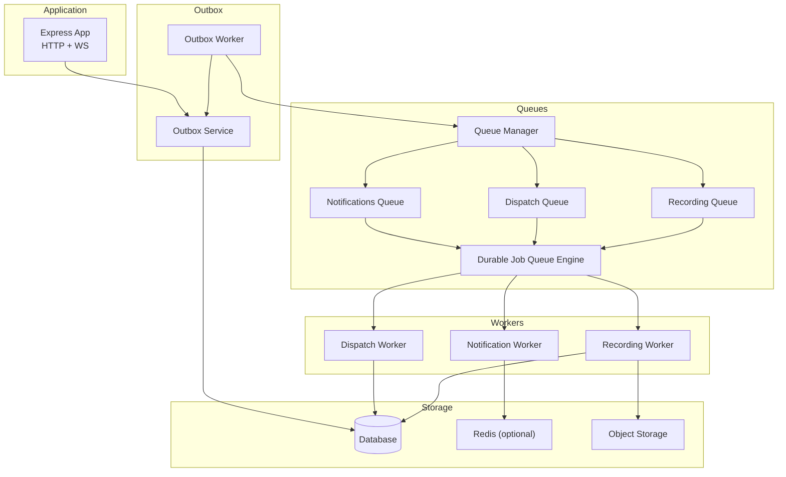
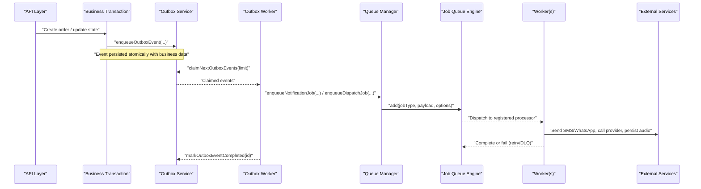
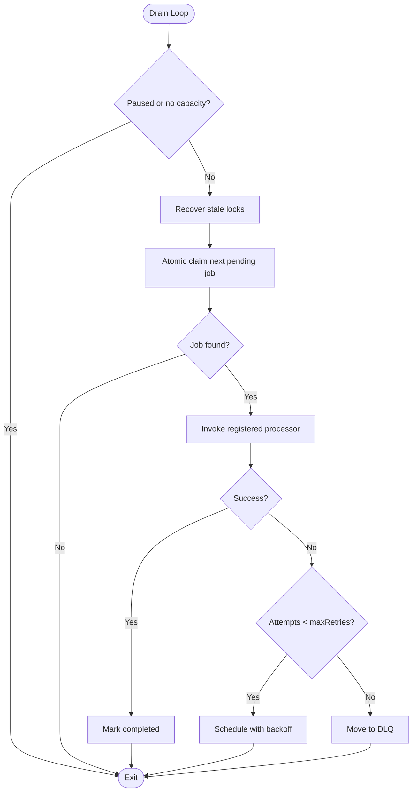
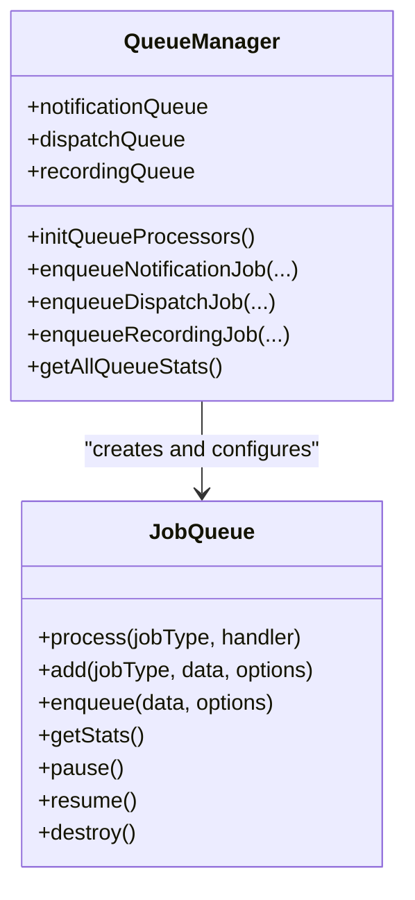
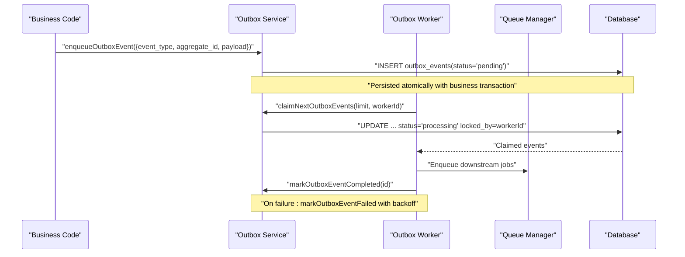
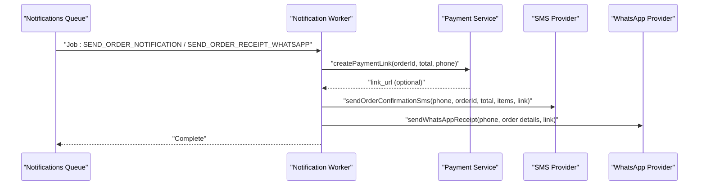
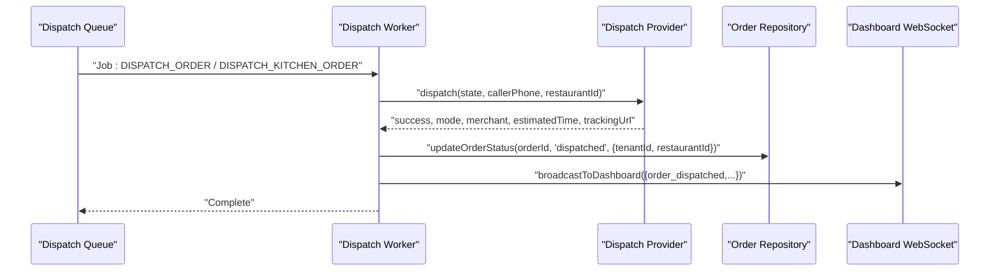
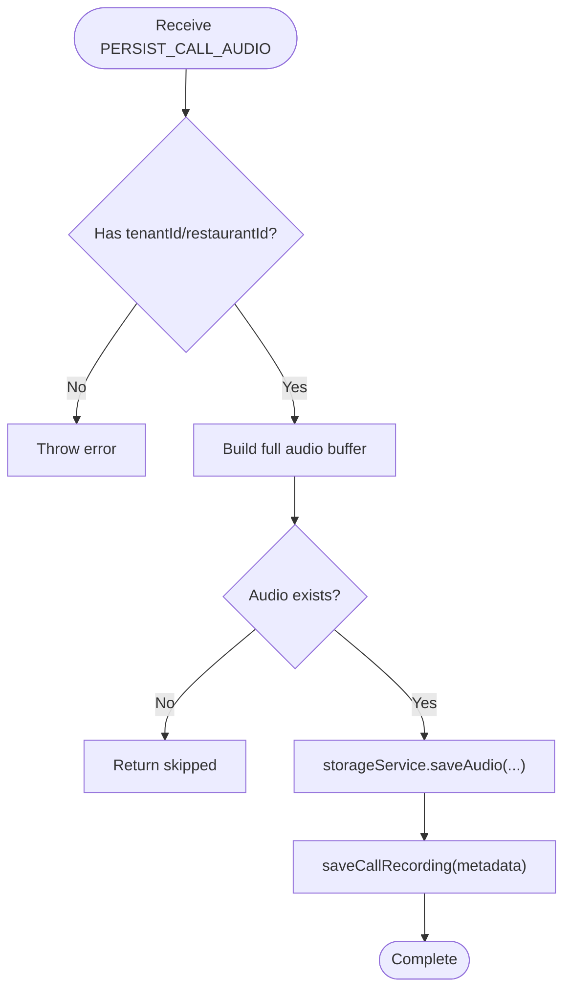
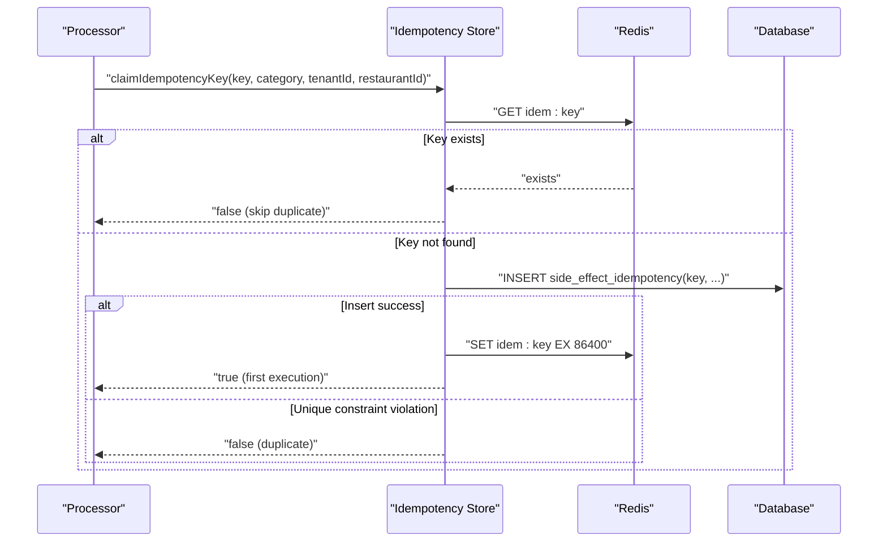
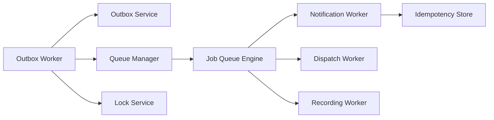

# Background Workers & Job Processing

<cite>
**Referenced Files in This Document**
- [jobQueue.js](file://server/src/queue/jobQueue.js)
- [queueManager.js](file://server/src/queue/queueManager.js)
- [outbox.worker.js](file://server/src/workers/outbox.worker.js)
- [notification.worker.js](file://server/src/workers/notification.worker.js)
- [dispatch.worker.js](file://server/src/workers/dispatch.worker.js)
- [recording.worker.js](file://server/src/workers/recording.worker.js)
- [outbox.service.js](file://server/src/services/outbox.service.js)
- [idempotencyStore.js](file://server/src/infra/idempotencyStore.js)
- [lockService.js](file://server/src/infra/lockService.js)
- [007_durable_job_queue.sql](file://server/src/db/migrations/007_durable_job_queue.sql)
- [008_durable_idempotency.sql](file://server/src/db/migrations/008_durable_idempotency.sql)
- [sloTracker.js](file://server/src/services/sloTracker.js)
- [logger.js](file://server/src/utils/logger.js)
- [app.js](file://server/src/app.js)
- [server.js](file://server/server.js)
</cite>

## Table of Contents
1. [Introduction](#introduction)
2. [Project Structure](#project-structure)
3. [Core Components](#core-components)
4. [Architecture Overview](#architecture-overview)
5. [Detailed Component Analysis](#detailed-component-analysis)
6. [Dependency Analysis](#dependency-analysis)
7. [Performance Considerations](#performance-considerations)
8. [Troubleshooting Guide](#troubleshooting-guide)
9. [Conclusion](#conclusion)
10. [Appendices](#appendices)

## Introduction
This document explains the background worker processes and job queue management in the Inkiro platform. It covers:
- The outbox pattern for reliable event delivery and processing
- A durable, database-backed job queue with prioritization, retries, and dead-letter handling
- Worker process management for long-running tasks such as order dispatch, notifications, and recording persistence
- Monitoring, logging, and error tracking strategies
- Guidance for creating custom workers, defining job schemas, and implementing idempotent operations
- Scaling considerations for high-volume job processing and worker pool management

## Project Structure
The background processing system is composed of:
- A durable job queue engine that persists jobs to a relational database and supports atomic claiming, retry with backoff, and DLQ routing
- Dedicated queues for notifications, dispatch, and recordings
- An outbox worker that polls transactional outbox events and fans them into downstream queues and dashboards
- Idempotency and distributed locking utilities to prevent duplicate side effects and ensure safe concurrency
- Structured logging and SLO tracking for observability

**Diagram sources**
- [app.js:94-97](file://server/src/app.js#L94-L97)
- [outbox.service.js:8-30](file://server/src/services/outbox.service.js#L8-L30)
- [outbox.worker.js:97-127](file://server/src/workers/outbox.worker.js#L97-L127)
- [queueManager.js:1-122](file://server/src/queue/queueManager.js#L1-L122)
- [jobQueue.js:14-250](file://server/src/queue/jobQueue.js#L14-L250)
- [notification.worker.js:1-72](file://server/src/workers/notification.worker.js#L1-L72)
- [dispatch.worker.js:1-56](file://server/src/workers/dispatch.worker.js#L1-L56)
- [recording.worker.js:1-53](file://server/src/workers/recording.worker.js#L1-L53)

**Section sources**
- [app.js:94-97](file://server/src/app.js#L94-L97)
- [server.js:18-47](file://server/server.js#L18-L47)

## Core Components
- Durable Job Queue Engine: A database-backed queue that guarantees zero-lost jobs across crashes and restarts, with atomic claiming, automatic recovery of stale locks, exponential backoff retries, and strict DLQ routing.
- Queue Manager: Defines named queues (notifications, dispatch, recordings), registers processors, and exposes enqueue helpers.
- Outbox Pattern: Transactional outbox service persists events atomically with business transactions; an outbox worker claims and fans out events to queues and dashboards.
- Workers: Specialized processors for notifications, dispatch, and recording persistence.
- Idempotency and Locking: Redis-backed and database-backed idempotency keys and distributed locks to avoid duplicate side effects and protect concurrent operations.
- Observability: Structured logger and SLO tracker for metrics and error budget monitoring.

**Section sources**
- [jobQueue.js:7-13](file://server/src/queue/jobQueue.js#L7-L13)
- [queueManager.js:7-122](file://server/src/queue/queueManager.js#L7-L122)
- [outbox.service.js:4-141](file://server/src/services/outbox.service.js#L4-L141)
- [outbox.worker.js:11-131](file://server/src/workers/outbox.worker.js#L11-L131)
- [idempotencyStore.js:5-43](file://server/src/infra/idempotencyStore.js#L5-L43)
- [lockService.js:7-82](file://server/src/infra/lockService.js#L7-L82)
- [logger.js:1-132](file://server/src/utils/logger.js#L1-L132)
- [sloTracker.js:3-65](file://server/src/services/sloTracker.js#L3-L65)

## Architecture Overview
The system uses two complementary reliability mechanisms:
- Outbox pattern ensures events are persisted atomically with business data and later delivered reliably by a background poller.
- Durable job queue ensures side-effect work (notifications, dispatch, storage) is executed exactly-once or at-least-once with retries and DLQ fallback.

**Diagram sources**
- [outbox.service.js:8-30](file://server/src/services/outbox.service.js#L8-L30)
- [outbox.worker.js:97-127](file://server/src/workers/outbox.worker.js#L97-L127)
- [queueManager.js:80-122](file://server/src/queue/queueManager.js#L80-L122)
- [jobQueue.js:47-76](file://server/src/queue/jobQueue.js#L47-L76)

## Detailed Component Analysis

### Durable Job Queue Engine
Responsibilities:
- Persist jobs to a dedicated table with status, attempts, scheduled_at, and lock metadata
- Atomic claim-and-process cycle with per-worker instance ID
- Automatic recovery of stale locks from crashed workers
- Exponential backoff retries and dead-letter queue routing on exhaustion
- Concurrency control via configurable concurrency and pause/resume

Key behaviors:
- Jobs are inserted with status pending and optional scheduling time
- Drain loop periodically claims one pending job per iteration within concurrency limits
- Failed jobs schedule future execution with backoff; exhausted jobs move to DLQ
- Stats endpoint provides counts by status

**Diagram sources**
- [jobQueue.js:107-211](file://server/src/queue/jobQueue.js#L107-L211)

**Section sources**
- [jobQueue.js:14-250](file://server/src/queue/jobQueue.js#L14-L250)
- [007_durable_job_queue.sql:5-22](file://server/src/db/migrations/007_durable_job_queue.sql#L5-L22)

### Queue Manager and Named Queues
- Creates named queues: notifications, dispatch, recordings
- Registers explicit processors for each job type
- Provides enqueue helpers to add jobs with idempotency keys where applicable
- Aggregates stats across all queues

**Diagram sources**
- [queueManager.js:1-122](file://server/src/queue/queueManager.js#L1-L122)
- [jobQueue.js:14-250](file://server/src/queue/jobQueue.js#L14-L250)

**Section sources**
- [queueManager.js:7-122](file://server/src/queue/queueManager.js#L7-L122)

### Outbox Pattern Implementation
- Enqueue outbox events atomically with business transactions
- Poller claims batches of pending events, processes them, and marks completion or failure
- Supports stale event recovery and exponential backoff for failures
- Fans out to queues and dashboard broadcasts based on event type

**Diagram sources**
- [outbox.service.js:8-30](file://server/src/services/outbox.service.js#L8-L30)
- [outbox.service.js:54-93](file://server/src/services/outbox.service.js#L54-L93)
- [outbox.service.js:110-141](file://server/src/services/outbox.service.js#L110-L141)
- [outbox.worker.js:97-127](file://server/src/workers/outbox.worker.js#L97-L127)

**Section sources**
- [outbox.service.js:4-141](file://server/src/services/outbox.service.js#L4-L141)
- [outbox.worker.js:11-131](file://server/src/workers/outbox.worker.js#L11-L131)

### Notification Worker
Handles asynchronous notifications:
- Payment link creation and SMS confirmation
- WhatsApp receipt and pin-drop messaging
- Uses idempotency keys to prevent duplicate sends

**Diagram sources**
- [notification.worker.js:10-72](file://server/src/workers/notification.worker.js#L10-L72)
- [queueManager.js:17-44](file://server/src/queue/queueManager.js#L17-L44)

**Section sources**
- [notification.worker.js:1-72](file://server/src/workers/notification.worker.js#L1-L72)
- [queueManager.js:17-44](file://server/src/queue/queueManager.js#L17-L44)

### Dispatch Worker
Handles asynchronous restaurant dispatching:
- Integrates with ONDC Beckn or POS via a dispatch provider
- Updates order status and broadcasts to dashboard
- Uses tenant and restaurant context for multi-tenancy

**Diagram sources**
- [dispatch.worker.js:12-56](file://server/src/workers/dispatch.worker.js#L12-L56)

**Section sources**
- [dispatch.worker.js:1-56](file://server/src/workers/dispatch.worker.js#L1-L56)

### Recording Worker
Persists call audio:
- Accepts base64 PCM chunks or full buffer
- Saves to object storage and records metadata in the database
- Validates tenant and restaurant context

**Diagram sources**
- [recording.worker.js:10-53](file://server/src/workers/recording.worker.js#L10-L53)

**Section sources**
- [recording.worker.js:1-53](file://server/src/workers/recording.worker.js#L1-L53)

### Idempotency and Distributed Locking
- Idempotency store claims unique keys atomically using Redis cache and database ledger to prevent duplicate side effects
- Distributed lock service provides Redis-based mutex with in-memory fallback for single-process scenarios
- Used to guard critical sections like outbox event processing

**Diagram sources**
- [idempotencyStore.js:10-43](file://server/src/infra/idempotencyStore.js#L10-L43)
- [008_durable_idempotency.sql:5-14](file://server/src/db/migrations/008_durable_idempotency.sql#L5-L14)

**Section sources**
- [idempotencyStore.js:5-43](file://server/src/infra/idempotencyStore.js#L5-L43)
- [lockService.js:7-82](file://server/src/infra/lockService.js#L7-L82)
- [008_durable_idempotency.sql:5-14](file://server/src/db/migrations/008_durable_idempotency.sql#L5-L14)

## Dependency Analysis
- Outbox worker depends on outbox service for event claiming and marking, and on queue manager to fan out to specific queues
- Queue manager composes multiple JobQueue instances and registers processors
- Workers depend on external services (payment, SMS, WhatsApp, dispatch providers) and infrastructure (storage, database)
- Idempotency and locking are cross-cutting dependencies used by workers and outbox processing

**Diagram sources**
- [outbox.worker.js:1-131](file://server/src/workers/outbox.worker.js#L1-L131)
- [outbox.service.js:1-141](file://server/src/services/outbox.service.js#L1-L141)
- [queueManager.js:1-122](file://server/src/queue/queueManager.js#L1-L122)
- [jobQueue.js:14-250](file://server/src/queue/jobQueue.js#L14-L250)
- [idempotencyStore.js:1-43](file://server/src/infra/idempotencyStore.js#L1-L43)
- [lockService.js:1-82](file://server/src/infra/lockService.js#L1-L82)

**Section sources**
- [outbox.worker.js:1-131](file://server/src/workers/outbox.worker.js#L1-L131)
- [queueManager.js:1-122](file://server/src/queue/queueManager.js#L1-L122)
- [jobQueue.js:14-250](file://server/src/queue/jobQueue.js#L14-L250)

## Performance Considerations
- Concurrency tuning: Adjust queue concurrency per workload (e.g., higher for notifications, lower for I/O-heavy dispatch/recording)
- Batch sizing: Tune outbox claim limit to balance throughput and memory usage
- Backoff strategy: Exponential backoff prevents thundering herds during transient failures
- Idempotency caching: Use Redis TTL to reduce database contention for duplicate detection
- Storage efficiency: Concatenate PCM chunks efficiently and compute duration accurately to minimize overhead
- Observability: Use structured logs and SLO metrics to detect degradation early

[No sources needed since this section provides general guidance]

## Troubleshooting Guide
Common issues and remedies:
- Stale locks: Ensure recovery routines run to re-queue stuck jobs/events
- Duplicate deliveries: Verify idempotency keys are set and Redis cache is available
- DLQ accumulation: Investigate failed jobs, fix handlers, and reprocess if necessary
- High latency: Monitor SLO metrics and adjust concurrency/backoff settings
- Missing tenant/restaurant context: Enforce validation in workers to avoid silent skips

**Section sources**
- [outbox.service.js:35-49](file://server/src/services/outbox.service.js#L35-L49)
- [jobQueue.js:92-102](file://server/src/queue/jobQueue.js#L92-L102)
- [sloTracker.js:15-65](file://server/src/services/sloTracker.js#L15-L65)
- [logger.js:83-129](file://server/src/utils/logger.js#L83-L129)

## Conclusion
The Inkiro platform implements a robust background processing architecture combining a transactional outbox pattern with a durable, database-backed job queue. This design ensures reliable event delivery, resilient job execution with retries and DLQ handling, and strong idempotency guarantees. With clear separation of concerns across queues and workers, structured logging, and SLO tracking, the system scales to handle high-volume workloads while maintaining operational visibility and safety.

[No sources needed since this section summarizes without analyzing specific files]

## Appendices

### Creating Custom Workers and Jobs
Steps:
- Define a new named queue in the queue manager or reuse an existing one
- Register a processor function for your job type
- Implement idempotency keys for side-effect operations
- Add enqueue helpers to submit jobs from application code
- Ensure tenant and restaurant context are included for multi-tenancy

**Section sources**
- [queueManager.js:15-75](file://server/src/queue/queueManager.js#L15-L75)
- [queueManager.js:80-122](file://server/src/queue/queueManager.js#L80-L122)

### Defining Job Schemas
Guidelines:
- Include stable identifiers (orderId, callId) and contextual fields (tenantId, restaurantId)
- Provide idempotencyKey when performing external side effects
- Keep payloads small and serializable; use references for large assets

**Section sources**
- [queueManager.js:17-75](file://server/src/queue/queueManager.js#L17-L75)
- [notification.worker.js:10-72](file://server/src/workers/notification.worker.js#L10-L72)
- [dispatch.worker.js:12-56](file://server/src/workers/dispatch.worker.js#L12-L56)
- [recording.worker.js:10-53](file://server/src/workers/recording.worker.js#L10-L53)

### Implementing Idempotent Operations
- Use idempotency keys around external calls (payments, SMS, WhatsApp)
- Combine Redis caching with database ledger for durability
- Guard critical sections with distributed locks when necessary

**Section sources**
- [idempotencyStore.js:10-43](file://server/src/infra/idempotencyStore.js#L10-L43)
- [lockService.js:14-82](file://server/src/infra/lockService.js#L14-L82)

### Monitoring and Logging Strategies
- Use structured logger for machine-parseable JSON in production
- Mask sensitive fields (phone numbers) automatically
- Track SLOs and error budgets to maintain reliability targets

**Section sources**
- [logger.js:1-132](file://server/src/utils/logger.js#L1-L132)
- [sloTracker.js:3-65](file://server/src/services/sloTracker.js#L3-L65)

### Bootstrapping and Lifecycle
- Application boot initializes database, creates Express app, mounts WebSocket coordinator, and starts the outbox worker
- Graceful shutdown handles SIGTERM/SIGINT

**Section sources**
- [server.js:18-66](file://server/server.js#L18-L66)
- [app.js:94-97](file://server/src/app.js#L94-L97)