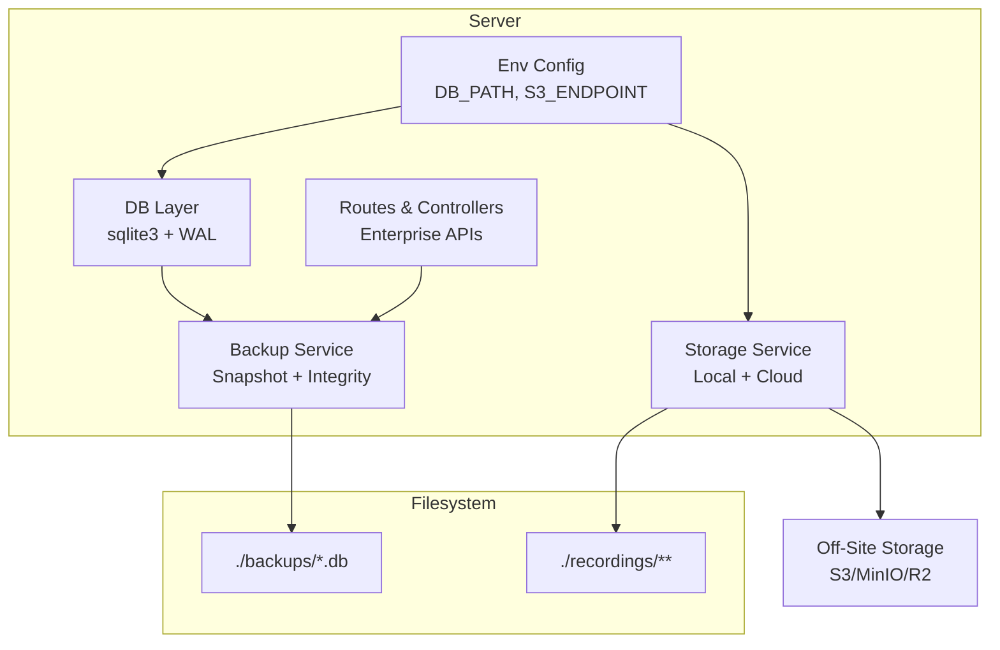
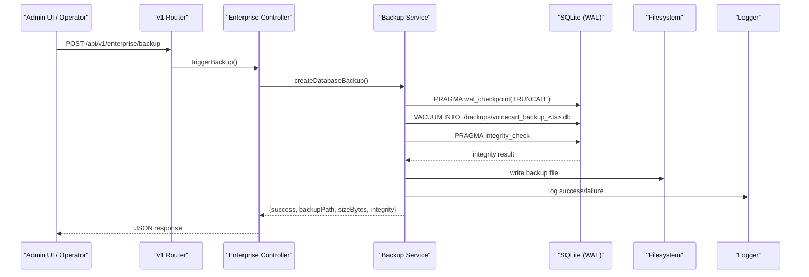
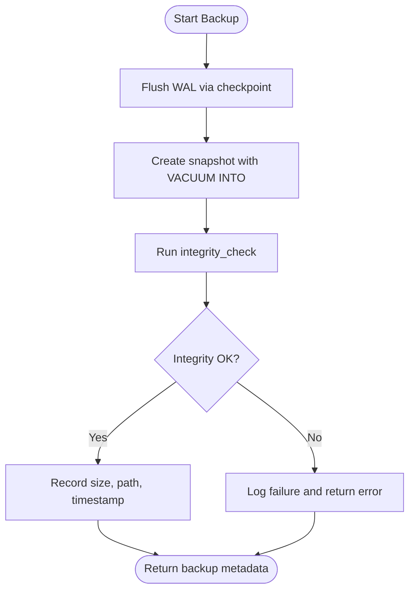
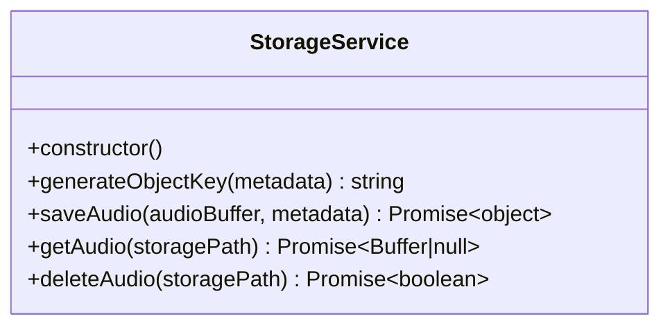
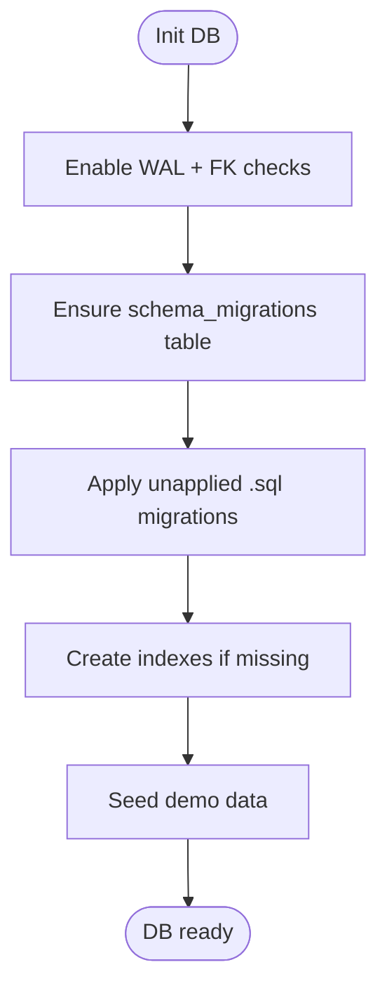
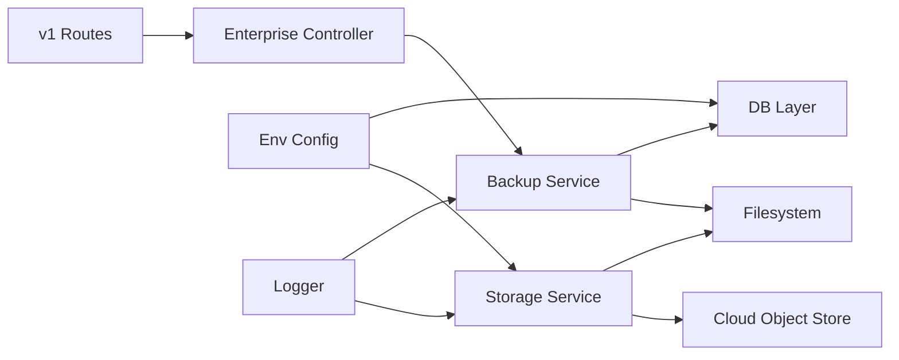

# Backup & Recovery Procedures

<cite>
**Referenced Files in This Document**
- [backup.service.js](file://server/src/services/backup.service.js)
- [db.js](file://server/src/db.js)
- [env.js](file://server/src/config/env.js)
- [storageService.js](file://server/src/infra/storageService.js)
- [migrationRunner.js](file://server/src/db/migrations/migrationRunner.js)
- [001_initial_multitenant_schema.sql](file://server/src/db/migrations/001_initial_multitenant_schema.sql)
- [enterprise.controller.js](file://server/src/controllers/enterprise.controller.js)
- [index.js](file://server/src/routes/v1/index.js)
- [logger.js](file://server/src/utils/logger.js)
</cite>

## Table of Contents
1. Introduction
2. Project Structure
3. Core Components
4. Architecture Overview
5. Detailed Component Analysis
6. Dependency Analysis
7. Performance Considerations
8. Troubleshooting Guide
9. Conclusion
10. Appendices

## Introduction
This document provides comprehensive backup and recovery procedures for the Inkiro platform. It covers automated SQLite database backups, file storage (call recordings), application configuration, scheduling strategies, retention policies, off-site replication, and disaster recovery runbooks. It also documents migration rollback approaches, data integrity validation, backup verification, and regular recovery testing to ensure operational resilience.

## Project Structure
The backup and recovery capabilities are implemented within the server module:
- Database layer with WAL mode and migrations
- Backup service that creates point-in-time snapshots
- Storage service for call recordings with optional cloud upload
- Environment configuration for DB path and storage settings
- Enterprise API endpoints to trigger backups and access operational data

**Diagram sources**
- [db.js:11-44](file://server/src/db.js#L11-L44)
- [backup.service.js:10-49](file://server/src/services/backup.service.js#L10-L49)
- [storageService.js:15-90](file://server/src/infra/storageService.js#L15-L90)
- [env.js:1-42](file://server/src/config/env.js#L1-L42)
- [index.js:35-52](file://server/src/routes/v1/index.js#L35-L52)

**Section sources**
- [db.js:11-44](file://server/src/db.js#L11-L44)
- [backup.service.js:10-49](file://server/src/services/backup.service.js#L10-L49)
- [storageService.js:15-90](file://server/src/infra/storageService.js#L15-L90)
- [env.js:1-42](file://server/src/config/env.js#L1-L42)
- [index.js:35-52](file://server/src/routes/v1/index.js#L35-L52)

## Core Components
- SQLite database with WAL enabled for consistent online backups
- Backup service that performs a checkpoint, snapshot via VACUUM INTO, and integrity check
- Storage service that persists audio files locally and optionally uploads to cloud object storage
- Migration runner that applies schema changes idempotently and tracks applied versions
- Environment configuration validating DB path and storage endpoints
- Enterprise API exposing protected endpoints to trigger backups and view operational status

Key responsibilities:
- Ensure database consistency during backups using WAL checkpointing
- Validate backup integrity post-snapshot
- Provide structured logging for auditability
- Support multi-tenant scoping for stored files

**Section sources**
- [db.js:29-44](file://server/src/db.js#L29-L44)
- [backup.service.js:10-49](file://server/src/services/backup.service.js#L10-L49)
- [storageService.js:15-90](file://server/src/infra/storageService.js#L15-L90)
- [migrationRunner.js:10-164](file://server/src/db/migrations/migrationRunner.js#L10-L164)
- [env.js:1-42](file://server/src/config/env.js#L1-L42)
- [enterprise.controller.js:46-53](file://server/src/controllers/enterprise.controller.js#L46-L53)
- [index.js:45-52](file://server/src/routes/v1/index.js#L45-L52)

## Architecture Overview
The backup and recovery architecture integrates database snapshots, file storage, and environment-driven configuration. Backups are triggered via a protected enterprise endpoint and produce timestamped .db files under a dedicated directory. Recordings are persisted locally and can be replicated to cloud storage when configured.

**Diagram sources**
- [index.js:45-52](file://server/src/routes/v1/index.js#L45-L52)
- [enterprise.controller.js:46-53](file://server/src/controllers/enterprise.controller.js#L46-L53)
- [backup.service.js:10-49](file://server/src/services/backup.service.js#L10-L49)
- [db.js:29-44](file://server/src/db.js#L29-L44)
- [logger.js:83-100](file://server/src/utils/logger.js#L83-L100)

## Detailed Component Analysis

### SQLite Backup Service
- Performs WAL checkpoint to flush pending writes
- Creates an online snapshot using VACUUM INTO
- Validates integrity using PRAGMA integrity_check
- Logs detailed results including size and integrity status
- Returns metadata for downstream automation (path, timestamp, size)

Operational notes:
- Backups are written to a local directory; integrate external sync for off-site copies
- Schedule periodic runs via OS-level cron or a job scheduler
- Use integrity PASS as a gate for off-site replication

**Diagram sources**
- [backup.service.js:10-49](file://server/src/services/backup.service.js#L10-L49)

**Section sources**
- [backup.service.js:10-49](file://server/src/services/backup.service.js#L10-L49)

### File Storage Service (Call Recordings)
- Generates multi-tenant object keys for isolation
- Persists audio files asynchronously to a tenant-scoped directory
- Optionally uploads to cloud object storage (S3/MinIO/R2) when configured
- Provides read/delete operations and returns playback URLs

Operational notes:
- Local path is under a recordings directory; back up this directory alongside DB snapshots
- Off-site replication should mirror both DB snapshots and recordings
- Validate cloud upload success and handle failures gracefully

**Diagram sources**
- [storageService.js:15-118](file://server/src/infra/storageService.js#L15-L118)

**Section sources**
- [storageService.js:15-118](file://server/src/infra/storageService.js#L15-L118)

### Database Initialization and Migrations
- Initializes SQLite with WAL and foreign keys
- Applies SQL migrations idempotently and records applied versions
- Adds performance indexes safely
- Seeds initial demo data

Operational notes:
- Keep migration files versioned and ordered
- Before rolling back, ensure you have a recent valid backup
- Use the migrations ledger to track applied versions

**Diagram sources**
- [db.js:11-44](file://server/src/db.js#L11-L44)
- [migrationRunner.js:10-164](file://server/src/db/migrations/migrationRunner.js#L10-L164)
- [001_initial_multitenant_schema.sql:7-222](file://server/src/db/migrations/001_initial_multitenant_schema.sql#L7-L222)

**Section sources**
- [db.js:11-44](file://server/src/db.js#L11-L44)
- [migrationRunner.js:10-164](file://server/src/db/migrations/migrationRunner.js#L10-L164)
- [001_initial_multitenant_schema.sql:7-222](file://server/src/db/migrations/001_initial_multitenant_schema.sql#L7-L222)

### Environment Configuration
- Validates required environment variables at startup
- Defines DB_PATH defaulting to a local SQLite file
- Supports optional Redis URL and other integrations

Operational notes:
- Centralize secrets and paths in environment management
- Validate DB_PATH points to a persistent volume in production

**Section sources**
- [env.js:1-42](file://server/src/config/env.js#L1-L42)

### Enterprise API for Backups
- Protected endpoint to trigger backups
- Requires admin role per RBAC middleware
- Returns backup metadata for automation and UI feedback

Operational notes:
- Restrict access to trusted operators or CI/CD pipelines
- Integrate with monitoring/alerting on backup outcomes

**Section sources**
- [index.js:45-52](file://server/src/routes/v1/index.js#L45-L52)
- [enterprise.controller.js:46-53](file://server/src/controllers/enterprise.controller.js#L46-L53)

## Dependency Analysis
- Backup service depends on DB layer for WAL operations and integrity checks
- Storage service depends on filesystem and optional cloud endpoints from environment
- Routes and controllers expose protected APIs that orchestrate backup triggers
- Logger provides structured logs for observability across components

**Diagram sources**
- [index.js:45-52](file://server/src/routes/v1/index.js#L45-L52)
- [enterprise.controller.js:46-53](file://server/src/controllers/enterprise.controller.js#L46-L53)
- [backup.service.js:10-49](file://server/src/services/backup.service.js#L10-L49)
- [db.js:11-44](file://server/src/db.js#L11-L44)
- [storageService.js:15-90](file://server/src/infra/storageService.js#L15-L90)
- [env.js:1-42](file://server/src/config/env.js#L1-L42)
- [logger.js:83-100](file://server/src/utils/logger.js#L83-L100)

**Section sources**
- [index.js:45-52](file://server/src/routes/v1/index.js#L45-L52)
- [enterprise.controller.js:46-53](file://server/src/controllers/enterprise.controller.js#L46-L53)
- [backup.service.js:10-49](file://server/src/services/backup.service.js#L10-L49)
- [db.js:11-44](file://server/src/db.js#L11-L44)
- [storageService.js:15-90](file://server/src/infra/storageService.js#L15-L90)
- [env.js:1-42](file://server/src/config/env.js#L1-L42)
- [logger.js:83-100](file://server/src/utils/logger.js#L83-L100)

## Performance Considerations
- WAL mode reduces lock contention and enables consistent online backups
- Checkpoint strategy balances durability and I/O cost; tune frequency based on workload
- VACUUM INTO creates a full copy; schedule during low-traffic windows to minimize impact
- Large recording files may increase storage costs; consider lifecycle policies and compression
- Indexes improve query performance; verify after migrations

[No sources needed since this section provides general guidance]

## Troubleshooting Guide
Common issues and mitigations:
- Backup fails due to DB not initialized: ensure DB initialization completes before triggering backups
- Integrity check fails: investigate corruption; restore from last known good backup
- Cloud upload failures: confirm credentials and endpoint; retain local copies until successful
- Slow queries during backup: monitor slow query logs and adjust indexing or workload

Verification steps:
- Confirm backup file exists and has non-zero size
- Run integrity checks on restored copies
- Validate recordings are accessible and complete

**Section sources**
- [backup.service.js:10-49](file://server/src/services/backup.service.js#L10-L49)
- [db.js:11-44](file://server/src/db.js#L11-L44)
- [storageService.js:63-78](file://server/src/infra/storageService.js#L63-L78)
- [logger.js:83-100](file://server/src/utils/logger.js#L83-L100)

## Conclusion
Inkiro’s backup and recovery system provides reliable, verifiable SQLite snapshots and robust file storage with optional cloud replication. By combining scheduled backups, integrity validation, controlled migrations, and clear runbooks, the platform supports rapid recovery from database corruption, service outages, and data loss scenarios. Regular testing and off-site replication further strengthen disaster readiness.

[No sources needed since this section summarizes without analyzing specific files]

## Appendices

### Automated Backup Strategy
- Frequency: hourly or more frequent during peak hours; daily full snapshots
- Retention: keep N most recent backups locally; archive older ones off-site
- Off-site: synchronize backups and recordings to S3/MinIO/R2 using lifecycle rules
- Validation: enforce integrity PASS before marking backups as safe

**Section sources**
- [backup.service.js:10-49](file://server/src/services/backup.service.js#L10-L49)
- [storageService.js:63-78](file://server/src/infra/storageService.js#L63-L78)

### Manual and Automated Recovery Procedures

- Database corruption:
  - Stop writes to the live DB
  - Restore latest verified backup into DB_PATH
  - Reinitialize DB to apply migrations and seed data
  - Verify integrity and replay any missed events from queues/outbox

- Service outage:
  - Restart services; ensure DB initializes with WAL enabled
  - Resume workers and queue processors
  - Validate endpoints and sessions

- Data loss:
  - Identify affected tables/records
  - Restore from backup closest to incident time
  - Replay outbox events and jobs to recover state

- Migration rollback:
  - Take a fresh backup before applying migrations
  - If rollback is required, restore pre-migration backup
  - Avoid destructive downgrades; prefer additive changes and feature flags

**Section sources**
- [db.js:11-44](file://server/src/db.js#L11-L44)
- [migrationRunner.js:10-164](file://server/src/db/migrations/migrationRunner.js#L10-L164)
- [outbox.service.js:51-140](file://server/src/services/outbox.service.js#L51-L140)

### Data Integrity Validation and Backup Verification
- Post-backup integrity check ensures consistency
- Periodically test restores in isolated environments
- Compare checksums between source and off-site copies
- Monitor logs for errors and warnings related to backups and storage

**Section sources**
- [backup.service.js:22-49](file://server/src/services/backup.service.js#L22-L49)
- [logger.js:83-100](file://server/src/utils/logger.js#L83-L100)

### Step-by-Step Recovery Runbooks

- Database corruption:
  1. Stop application writes
  2. Locate latest backup with integrity PASS
  3. Replace DB file with backup
  4. Start application to reinitialize and apply migrations
  5. Verify data and resume operations

- Call recording loss:
  1. Identify missing recordings by call IDs
  2. Retrieve from off-site storage if available
  3. Re-upload to local recordings directory
  4. Verify playback URLs

- Full site disaster:
  1. Provision new infrastructure
  2. Restore DB from off-site backup
  3. Restore recordings from off-site storage
  4. Configure environment variables and start services
  5. Validate all endpoints and perform smoke tests

**Section sources**
- [backup.service.js:10-49](file://server/src/services/backup.service.js#L10-L49)
- [storageService.js:15-90](file://server/src/infra/storageService.js#L15-L90)
- [env.js:1-42](file://server/src/config/env.js#L1-L42)