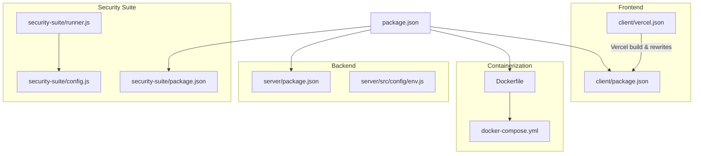
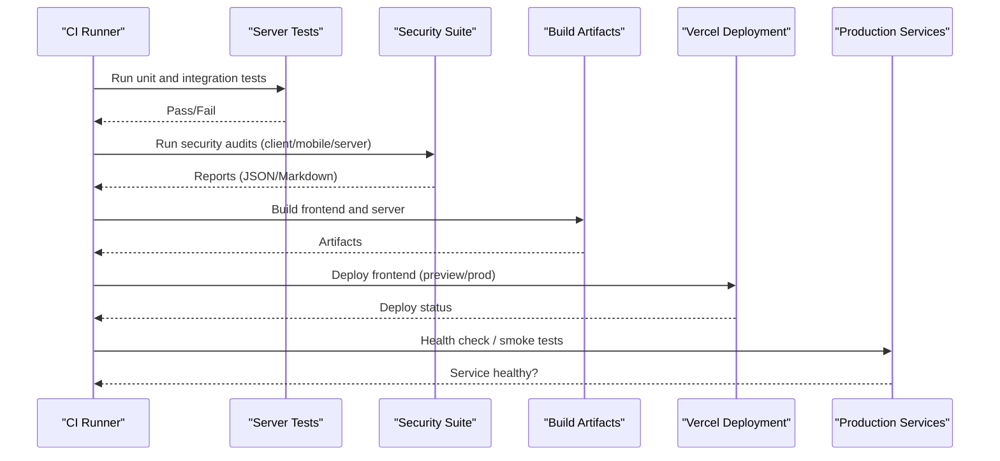
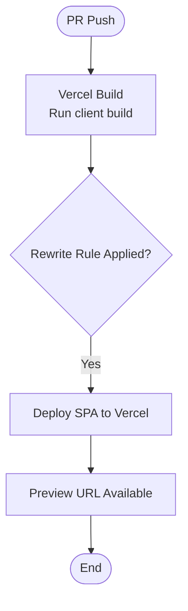
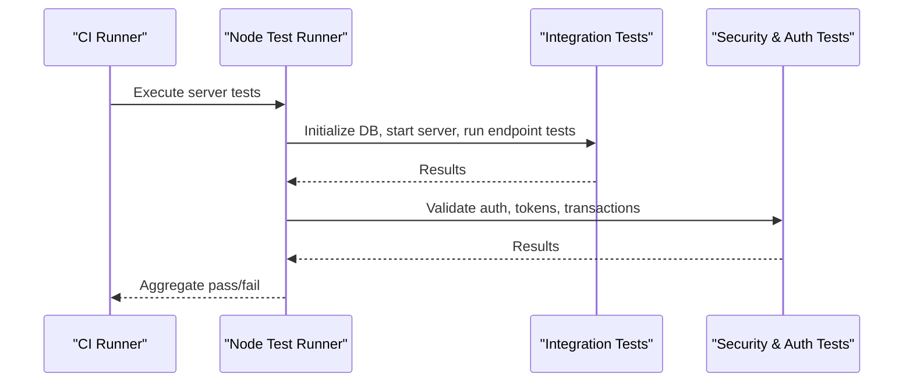
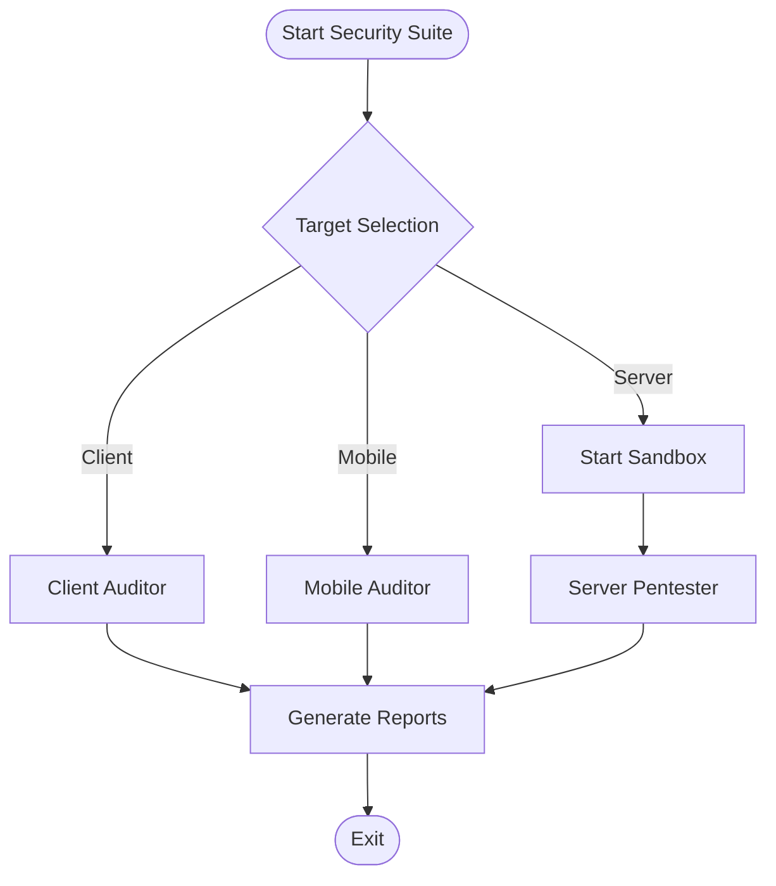
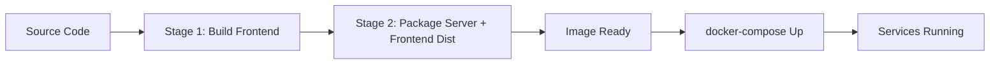
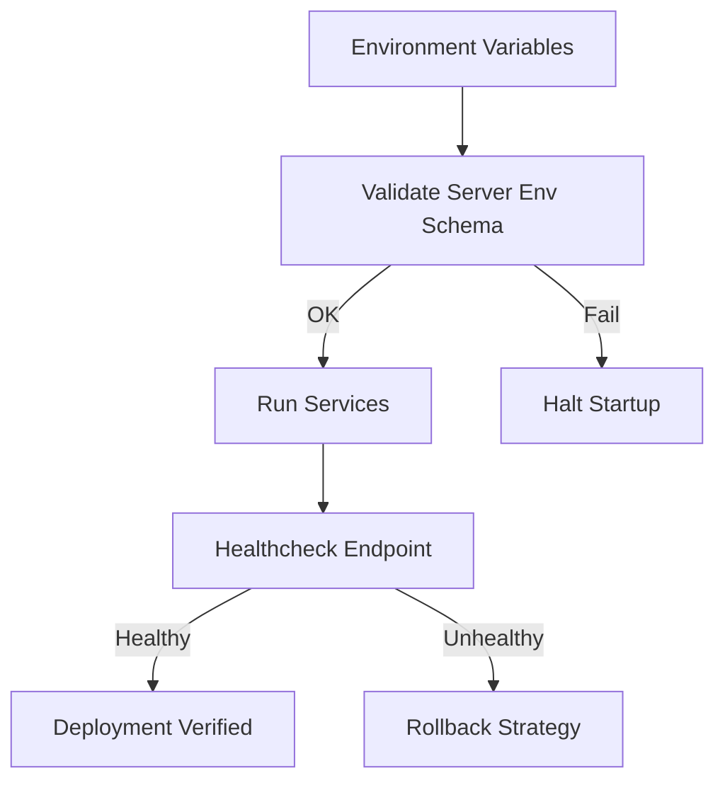
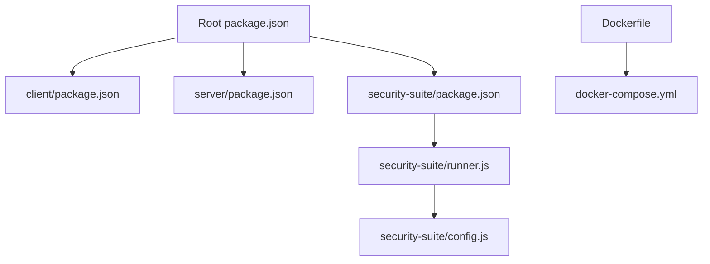

# CI/CD Pipeline Configuration

<cite>
**Referenced Files in This Document**
- [vercel.json](file://vercel.json)
- [client/vercel.json](file://client/vercel.json)
- [package.json](file://package.json)
- [client/package.json](file://client/package.json)
- [server/package.json](file://server/package.json)
- [Dockerfile](file://Dockerfile)
- [docker-compose.yml](file://docker-compose.yml)
- [security-suite/package.json](file://security-suite/package.json)
- [security-suite/runner.js](file://security-suite/runner.js)
- [security-suite/config.js](file://security-suite/config.js)
- [server/tests/integration.test.js](file://server/tests/integration.test.js)
- [server/tests/security_and_auth.test.js](file://server/tests/security_and_auth.test.js)
- [server/src/config/env.js](file://server/src/config/env.js)
</cite>

## Table of Contents
1. [Introduction](#introduction)
2. [Project Structure](#project-structure)
3. [Core Components](#core-components)
4. [Architecture Overview](#architecture-overview)
5. [Detailed Component Analysis](#detailed-component-analysis)
6. [Dependency Analysis](#dependency-analysis)
7. [Performance Considerations](#performance-considerations)
8. [Troubleshooting Guide](#troubleshooting-guide)
9. [Conclusion](#conclusion)

## Introduction
This document describes the CI/CD pipeline configuration for automated builds, testing, and deployment across the frontend dashboard, backend server, mobile app, and security suite. It explains Vercel deployment settings for the frontend, the automated testing workflow that runs unit and integration tests along with security scans, code quality checks, and dependency vulnerability scanning. It also documents environment-specific configurations and secrets management used throughout the pipeline, as well as deployment strategies for staging and production environments, including rollback procedures and deployment verification.

## Project Structure
The repository is a multi-service application:
- Frontend dashboard (client): built with Vite and deployed to Vercel.
- Backend server (server): Node.js Express API with SQLite and optional Redis.
- Mobile app (mobile): Expo-based application.
- Security suite (security-suite): autonomous pentesting and auditing tooling.
- Containerization: Dockerfile and docker-compose for local and CI usage.

**Diagram sources**
- [package.json:6-20](file://package.json#L6-L20)
- [client/package.json:6-10](file://client/package.json#L6-L10)
- [client/vercel.json:1-6](file://client/vercel.json#L1-L6)
- [server/package.json:7-11](file://server/package.json#L7-L11)
- [security-suite/package.json:7-13](file://security-suite/package.json#L7-L13)
- [security-suite/runner.js:27-81](file://security-suite/runner.js#L27-L81)
- [security-suite/config.js:6-32](file://security-suite/config.js#L6-L32)
- [Dockerfile:3-34](file://Dockerfile#L3-L34)
- [docker-compose.yml:3-45](file://docker-compose.yml#L3-L45)

**Section sources**
- [package.json:6-20](file://package.json#L6-L20)
- [client/package.json:6-10](file://client/package.json#L6-L10)
- [server/package.json:7-11](file://server/package.json#L7-L11)
- [security-suite/package.json:7-13](file://security-suite/package.json#L7-L13)
- [Dockerfile:3-34](file://Dockerfile#L3-L34)
- [docker-compose.yml:3-45](file://docker-compose.yml#L3-L45)

## Core Components
- Build orchestration at root level:
  - Scripts define dev, build, test, and security audit commands that delegate to client, server, and security-suite packages.
- Frontend build:
  - Client uses Vite; build script produces static assets for hosting or containerization.
- Server build and test:
  - Server uses Node’s native test runner; tests are executed via package scripts.
- Security suite:
  - Orchestrates client, mobile, and server audits; supports loop mode and Strix integration; writes JSON and Markdown reports.
- Containerization:
  - Multi-stage Dockerfile builds the frontend and packages the server; docker-compose defines services, environment variables, healthchecks, and volumes.

**Section sources**
- [package.json:6-20](file://package.json#L6-L20)
- [client/package.json:6-10](file://client/package.json#L6-L10)
- [server/package.json:7-11](file://server/package.json#L7-L11)
- [security-suite/package.json:7-13](file://security-suite/package.json#L7-L13)
- [security-suite/runner.js:27-81](file://security-suite/runner.js#L27-L81)
- [Dockerfile:3-34](file://Dockerfile#L3-L34)
- [docker-compose.yml:3-45](file://docker-compose.yml#L3-L45)

## Architecture Overview
The CI/CD pipeline stages typically include:
- Checkout and cache dependencies
- Lint and type checks (if configured)
- Unit and integration tests
- Security audits and vulnerability scans
- Build artifacts (frontend dist, server bundle)
- Deploy to Vercel (frontend) and/or container registry (backend)
- Post-deploy verification (health checks)

[No sources needed since this diagram shows conceptual workflow, not actual code structure]

## Detailed Component Analysis

### Vercel Deployment Configuration (Frontend Dashboard)
- Rewrites:
  - The client-level Vercel config sets a catch-all rewrite to index.html, enabling client-side routing for SPAs.
- Root-level Vercel config mirrors the same rewrite rule for compatibility when deploying from the repository root.
- Build process:
  - Vercel will use the client’s build script (Vite) to generate static assets.
- Environment variables:
  - Configure runtime variables in Vercel project settings; ensure any required variables (e.g., API base URLs) are set per environment (preview vs production).
- Preview deployments:
  - Each pull request can trigger a preview deployment using Vercel’s default behavior; verify routing via the provided rewrites.

**Diagram sources**
- [client/vercel.json:1-6](file://client/vercel.json#L1-L6)
- [vercel.json:1-6](file://vercel.json#L1-L6)
- [client/package.json:6-10](file://client/package.json#L6-L10)

**Section sources**
- [client/vercel.json:1-6](file://client/vercel.json#L1-L6)
- [vercel.json:1-6](file://vercel.json#L1-L6)
- [client/package.json:6-10](file://client/package.json#L6-L10)

### Automated Testing Workflow
- Unit and integration tests:
  - Server tests run via Node’s test runner using the package script.
  - Integration tests spin up an in-memory HTTP server, initialize a temporary database, authenticate, and exercise endpoints.
- Security tests:
  - Dedicated tests validate password hashing, JWT issuance/verification, authentication flows, and transaction rollback behavior.

**Diagram sources**
- [server/package.json:7-11](file://server/package.json#L7-L11)
- [server/tests/integration.test.js:29-56](file://server/tests/integration.test.js#L29-L56)
- [server/tests/security_and_auth.test.js:10-18](file://server/tests/security_and_auth.test.js#L10-L18)

**Section sources**
- [server/package.json:7-11](file://server/package.json#L7-L11)
- [server/tests/integration.test.js:29-56](file://server/tests/integration.test.js#L29-L56)
- [server/tests/security_and_auth.test.js:10-18](file://server/tests/security_and_auth.test.js#L10-L18)

### Security Scans and Audits
- Security suite orchestrator:
  - Runs client, mobile, and server audits; optionally invokes Strix AI agent; generates severity-sorted findings and reports.
- Reporting:
  - Outputs JSON and Markdown reports to a dedicated directory; includes summary statistics and detailed findings.
- Loop mode:
  - Watches source directories and re-runs audits on changes for local development feedback.

**Diagram sources**
- [security-suite/runner.js:27-81](file://security-suite/runner.js#L27-L81)
- [security-suite/config.js:6-32](file://security-suite/config.js#L6-L32)

**Section sources**
- [security-suite/runner.js:27-81](file://security-suite/runner.js#L27-L81)
- [security-suite/config.js:6-32](file://security-suite/config.js#L6-L32)
- [security-suite/package.json:7-13](file://security-suite/package.json#L7-L13)

### Build and Containerization
- Multi-stage Dockerfile:
  - Stage 1 builds the frontend using Vite.
  - Stage 2 installs server dependencies and copies built frontend assets into the server image.
  - Exposes port and defines a healthcheck endpoint.
- docker-compose:
  - Defines server and Redis services, environment variables, volumes, and healthchecks.

**Diagram sources**
- [Dockerfile:3-34](file://Dockerfile#L3-L34)
- [docker-compose.yml:3-45](file://docker-compose.yml#L3-L45)

**Section sources**
- [Dockerfile:3-34](file://Dockerfile#L3-L34)
- [docker-compose.yml:3-45](file://docker-compose.yml#L3-L45)

### Environment-Specific Configurations and Secrets Management
- Server environment validation:
  - Uses schema validation to enforce required variables (e.g., JWT_SECRET, ENCRYPTION_KEY) and defaults for non-production.
  - Production requires REDIS_URL; missing it raises a fatal error.
- Docker Compose:
  - Sets NODE_ENV, PORT, DB_PATH, REDIS_URL, and provider keys for AI services.
- Vercel:
  - Configure environment variables per project and environment (preview/production) via Vercel dashboard; ensure frontend references correct API endpoints.
- Security suite:
  - Reads sandbox host/port and Strix LLM settings from environment variables.

**Diagram sources**
- [server/src/config/env.js:1-41](file://server/src/config/env.js#L1-L41)
- [docker-compose.yml:12-22](file://docker-compose.yml#L12-L22)
- [security-suite/config.js:6-32](file://security-suite/config.js#L6-L32)

**Section sources**
- [server/src/config/env.js:1-41](file://server/src/config/env.js#L1-L41)
- [docker-compose.yml:12-22](file://docker-compose.yml#L12-L22)
- [security-suite/config.js:6-32](file://security-suite/config.js#L6-L32)

## Dependency Analysis
- Root scripts coordinate execution across packages:
  - Build, test, and security audit commands delegate to respective package scripts.
- Security suite depends on analyzers and sandboxes; reports are written to a configured directory.
- Docker image depends on Node runtime and system utilities; healthcheck relies on server endpoint.

**Diagram sources**
- [package.json:6-20](file://package.json#L6-L20)
- [security-suite/runner.js:27-81](file://security-suite/runner.js#L27-L81)
- [security-suite/config.js:6-32](file://security-suite/config.js#L6-L32)
- [Dockerfile:3-34](file://Dockerfile#L3-L34)
- [docker-compose.yml:3-45](file://docker-compose.yml#L3-L45)

**Section sources**
- [package.json:6-20](file://package.json#L6-L20)
- [security-suite/runner.js:27-81](file://security-suite/runner.js#L27-L81)
- [security-suite/config.js:6-32](file://security-suite/config.js#L6-L32)
- [Dockerfile:3-34](file://Dockerfile#L3-L34)
- [docker-compose.yml:3-45](file://docker-compose.yml#L3-L45)

## Performance Considerations
- Use caching for node_modules in CI to speed up builds.
- Prefer incremental builds where possible (e.g., Vite’s caching).
- Run tests in parallel if supported by your CI runner; keep concurrency safe for SQLite-backed tests.
- Limit security suite scope in CI to targeted targets to reduce scan time.
- Ensure healthchecks are lightweight and fast to avoid false negatives during deployment verification.

[No sources needed since this section provides general guidance]

## Troubleshooting Guide
- Environment validation failures:
  - If startup fails due to invalid environment configuration, review required variables and their values.
- Redis connection errors:
  - In production, REDIS_URL must be set; otherwise, the server will raise a fatal error.
- Test failures:
  - Integration tests rely on a temporary database; ensure cleanup occurs after tests.
  - Authentication tests require valid credentials and proper token handling.
- Security suite issues:
  - Check logs for analyzer errors; ensure sandbox ports and hosts are available.
  - Reports are generated even if some analyzers fail; inspect JSON/Markdown for details.

**Section sources**
- [server/src/config/env.js:28-41](file://server/src/config/env.js#L28-L41)
- [server/src/config/env.js:85-90](file://server/src/config/env.js#L85-L90)
- [server/tests/integration.test.js:29-56](file://server/tests/integration.test.js#L29-L56)
- [server/tests/security_and_auth.test.js:10-18](file://server/tests/security_and_auth.test.js#L10-L18)
- [security-suite/runner.js:27-81](file://security-suite/runner.js#L27-L81)

## Conclusion
The CI/CD pipeline integrates automated builds, comprehensive testing, and robust security audits. Vercel handles frontend deployments with client-side routing via rewrites, while the server and mobile components are tested and secured through Node’s test runner and the security suite. Environment validation ensures reliable deployments across staging and production. For rollbacks, revert commits and redeploy previous versions; for verification, rely on healthchecks and post-deploy smoke tests.

[No sources needed since this section summarizes without analyzing specific files]