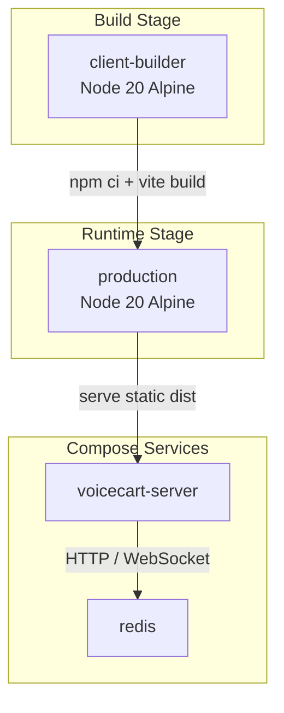
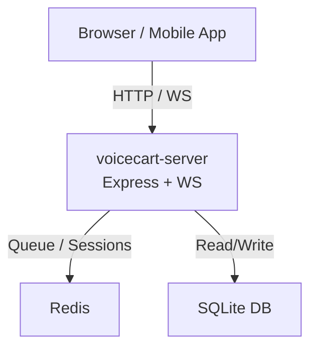
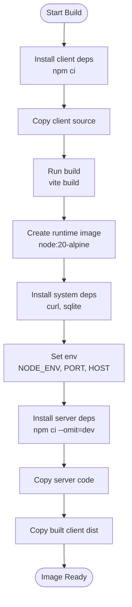
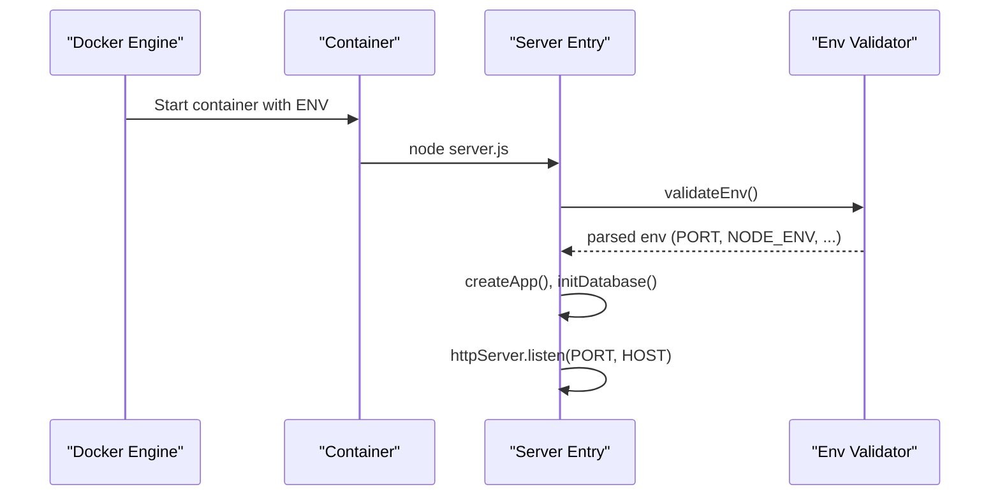
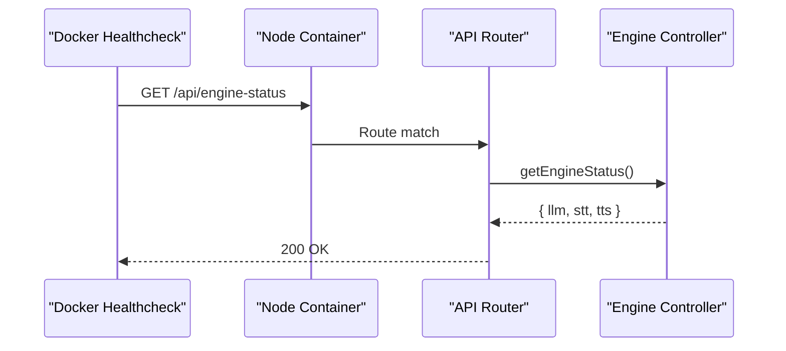
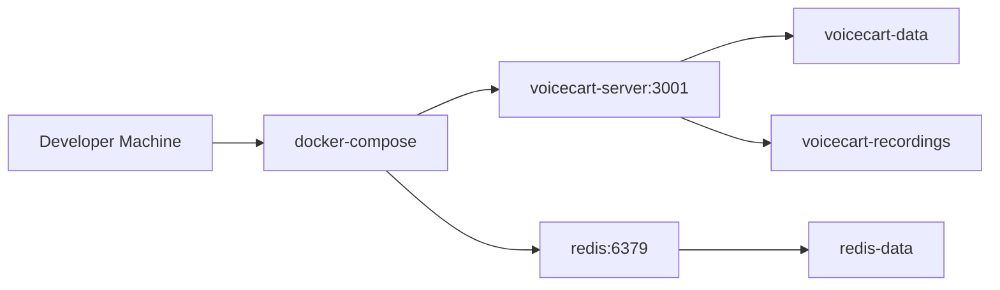
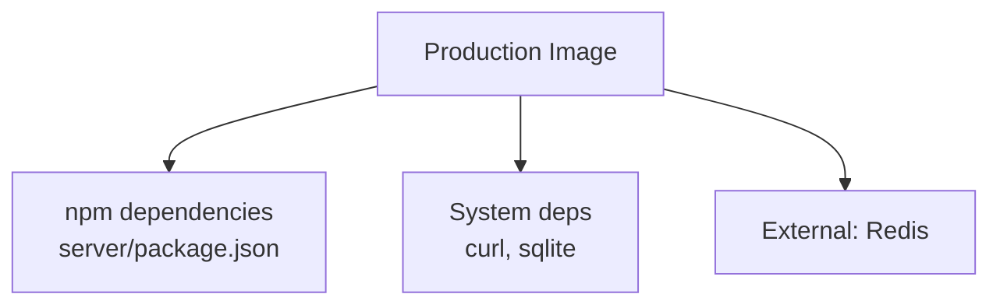

# Containerization & Docker

<cite>
**Referenced Files in This Document**
- [Dockerfile](file://Dockerfile)
- [docker-compose.yml](file://docker-compose.yml)
- [server/server.js](file://server/server.js)
- [server/src/config/env.js](file://server/src/config/env.js)
- [server/src/controllers/engine.controller.js](file://server/src/controllers/engine.controller.js)
- [server/package.json](file://server/package.json)
- [client/package.json](file://client/package.json)
</cite>

## Table of Contents
1. [Introduction](#introduction)
2. [Project Structure](#project-structure)
3. [Core Components](#core-components)
4. [Architecture Overview](#architecture-overview)
5. [Detailed Component Analysis](#detailed-component-analysis)
6. [Dependency Analysis](#dependency-analysis)
7. [Performance Considerations](#performance-considerations)
8. [Troubleshooting Guide](#troubleshooting-guide)
9. [Conclusion](#conclusion)
10. [Appendices](#appendices)

## Introduction
This document explains how the Inkiro platform is containerized using a multi-stage Docker build that separates frontend compilation from the production runtime to optimize image size and security. It covers the Dockerfile structure, environment variables, health checks, docker-compose orchestration for local development, and guidance for building custom images and deploying to platforms such as Kubernetes or cloud providers.

## Project Structure
The repository contains:
- A Node.js server application under server/
- A React dashboard built with Vite under client/
- A Dockerfile at the repository root that defines a two-stage build
- A docker-compose.yml that orchestrates the server and Redis for local development

**Diagram sources**
- [Dockerfile:3-34](file://Dockerfile#L3-L34)
- [docker-compose.yml:3-50](file://docker-compose.yml#L3-L50)

**Section sources**
- [Dockerfile:1-35](file://Dockerfile#L1-L35)
- [docker-compose.yml:1-51](file://docker-compose.yml#L1-L51)

## Core Components
- Multi-stage Dockerfile:
  - Stage 1 (client-builder): Compiles the React dashboard into static assets.
  - Stage 2 (production): Minimal Node.js runtime serving the API and the compiled frontend assets.
- Environment configuration:
  - NODE_ENV, PORT, HOST are set in the Dockerfile and consumed by the server entry point.
  - Additional runtime settings are validated via a typed schema.
- Health check:
  - The container exposes an HTTP endpoint used by Docker’s HEALTHCHECK to probe service readiness.
- Compose orchestration:
  - Runs the server and Redis with persistent volumes and health checks.

**Section sources**
- [Dockerfile:3-34](file://Dockerfile#L3-L34)
- [server/server.js:15-16](file://server/server.js#L15-L16)
- [server/src/config/env.js:3-24](file://server/src/config/env.js#L3-L24)
- [docker-compose.yml:3-50](file://docker-compose.yml#L3-L50)

## Architecture Overview
The runtime architecture serves both REST/WebSocket APIs and the compiled frontend from a single Node.js process. Redis provides session/state storage. The Dockerfile ensures only production dependencies and built assets are included in the final image.

**Diagram sources**
- [docker-compose.yml:3-50](file://docker-compose.yml#L3-L50)
- [server/server.js:23-46](file://server/server.js#L23-L46)

## Detailed Component Analysis

### Multi-Stage Docker Build
- Stage 1: client-builder
  - Uses Node 20 Alpine to install client dependencies and run the Vite build, producing static assets.
- Stage 2: production
  - Installs only production server dependencies and copies the built client assets into the runtime image.
  - Exposes port 3001 and defines a health check against the engine status endpoint.

**Diagram sources**
- [Dockerfile:3-34](file://Dockerfile#L3-L34)

**Section sources**
- [Dockerfile:3-34](file://Dockerfile#L3-L34)

### Environment Variables Configuration
- Dockerfile sets:
  - NODE_ENV=production
  - PORT=3001
  - HOST=0.0.0.0
- Server reads PORT and HOST at startup and binds accordingly.
- Runtime validation enforces safe defaults and required fields for critical keys.

**Diagram sources**
- [Dockerfile:18-20](file://Dockerfile#L18-L20)
- [server/server.js:15-16](file://server/server.js#L15-L16)
- [server/src/config/env.js:3-40](file://server/src/config/env.js#L3-L40)

**Section sources**
- [Dockerfile:18-20](file://Dockerfile#L18-L20)
- [server/server.js:15-16](file://server/server.js#L15-L16)
- [server/src/config/env.js:3-40](file://server/src/config/env.js#L3-L40)

### Health Check Implementation
- Docker HEALTHCHECK calls curl against the engine status endpoint to verify liveness/readiness.
- The endpoint returns provider configuration and capability flags for LLM, STT, and TTS.

**Diagram sources**
- [Dockerfile:31-32](file://Dockerfile#L31-L32)
- [server/src/routes/api.routes.js:36](file://server/src/routes/api.routes.js#L36)
- [server/src/controllers/engine.controller.js:6-23](file://server/src/controllers/engine.controller.js#L6-L23)

**Section sources**
- [Dockerfile:31-32](file://Dockerfile#L31-L32)
- [server/src/routes/api.routes.js:36](file://server/src/routes/api.routes.js#L36)
- [server/src/controllers/engine.controller.js:6-23](file://server/src/controllers/engine.controller.js#L6-L23)

### Docker Compose Orchestration
- Defines voicecart-server and redis services.
- Maps ports, sets environment variables, and mounts named volumes for data persistence.
- Includes health checks for both services.

**Diagram sources**
- [docker-compose.yml:3-50](file://docker-compose.yml#L3-L50)

**Section sources**
- [docker-compose.yml:3-50](file://docker-compose.yml#L3-L50)

### Running Containers Locally
- Build and start all services:
  - Use compose to build the image and launch services with configured volumes and environment.
- Verify health:
  - Check container health status and probe the engine status endpoint.
- Access the dashboard:
  - The compiled frontend is served by the server; open the mapped port in your browser.

**Section sources**
- [docker-compose.yml:3-50](file://docker-compose.yml#L3-L50)
- [Dockerfile:29-34](file://Dockerfile#L29-L34)

### Building Custom Images
- To customize the base image or add system packages:
  - Modify the production stage to include additional apk packages.
- To change build behavior:
  - Adjust client build scripts or server dependencies in their respective package manifests.

**Section sources**
- [Dockerfile:11-27](file://Dockerfile#L11-L27)
- [server/package.json:1-32](file://server/package.json#L1-L32)
- [client/package.json:1-26](file://client/package.json#L1-L26)

### Deploying to Kubernetes or Cloud Platforms
- General steps:
  - Push the built image to a container registry.
  - Create a Deployment exposing port 3001 and mounting persistent volumes for data and recordings.
  - Configure ConfigMaps/Secrets for sensitive environment variables (e.g., API keys).
  - Add a Service (ClusterIP/LoadBalancer) and optional Ingress for external access.
  - Ensure liveness/readiness probes mirror the container’s health check logic.
- Notes:
  - Persist SQLite data and recordings via PersistentVolumeClaims.
  - Scale horizontally behind a load balancer if needed; ensure shared state (Redis) is externalized.

[No sources needed since this section provides general deployment guidance]

## Dependency Analysis
The runtime depends on:
- Node.js runtime with production-only dependencies
- System utilities (curl, sqlite) installed in the image
- Redis for distributed state during local development

**Diagram sources**
- [Dockerfile:15-24](file://Dockerfile#L15-L24)
- [server/package.json:12-27](file://server/package.json#L12-L27)
- [docker-compose.yml:33-45](file://docker-compose.yml#L33-L45)

**Section sources**
- [Dockerfile:15-24](file://Dockerfile#L15-L24)
- [server/package.json:12-27](file://server/package.json#L12-L27)
- [docker-compose.yml:33-45](file://docker-compose.yml#L33-L45)

## Performance Considerations
- Multi-stage builds reduce final image size by excluding build tools and dev dependencies.
- Using Alpine-based images minimizes attack surface and footprint.
- Omitting dev dependencies in production reduces installation time and risk.
- Health checks enable faster recovery and better orchestration behavior.

[No sources needed since this section provides general guidance]

## Troubleshooting Guide
- Container fails to start:
  - Validate environment variables and secrets; the server validates them at startup and will exit on invalid configuration.
- Health check failing:
  - Confirm the engine status endpoint is reachable inside the container and that AI provider configurations are present.
- Port conflicts:
  - Ensure host port 3001 is free or adjust mappings in compose or deployment manifests.
- Data persistence:
  - Verify volume mounts for database and recordings directories exist and have correct permissions.

**Section sources**
- [server/src/config/env.js:28-40](file://server/src/config/env.js#L28-L40)
- [Dockerfile:31-32](file://Dockerfile#L31-L32)
- [docker-compose.yml:22-24](file://docker-compose.yml#L22-L24)

## Conclusion
The Inkiro platform uses a secure, efficient multi-stage Docker build that compiles the React dashboard separately from the production runtime. Environment variables are validated at startup, and a health check ensures reliable orchestration. Docker Compose simplifies local development with Redis and persistent volumes, while the same image can be deployed to Kubernetes or cloud platforms with standard practices.

## Appendices

### Quick Commands Reference
- Local development:
  - Build and run services with compose.
  - Inspect logs and health status.
- Production:
  - Tag and push the image to a registry.
  - Deploy with your platform’s workload controller and expose via Service/Ingress.

[No sources needed since this section provides general guidance]