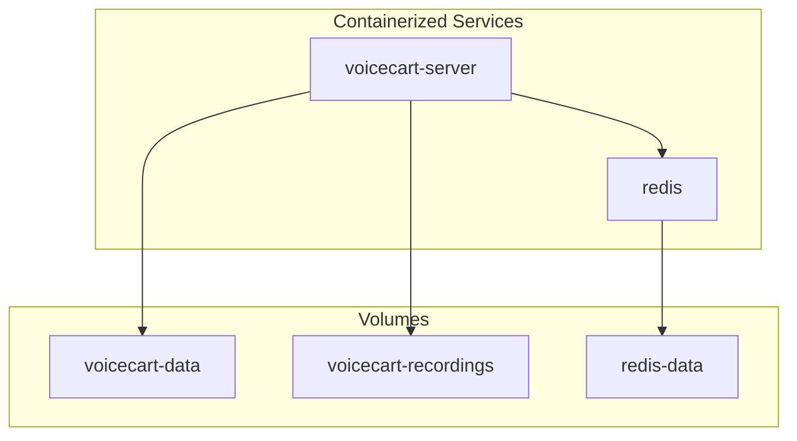
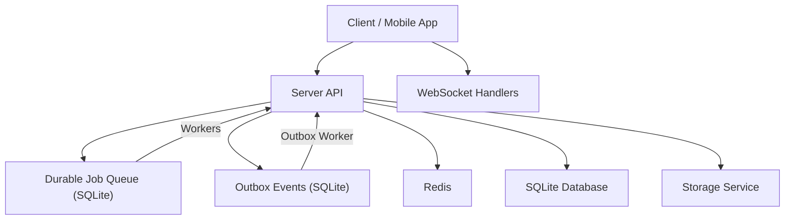
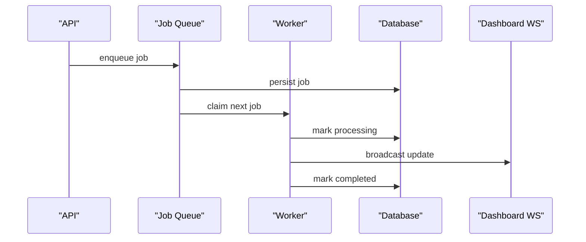
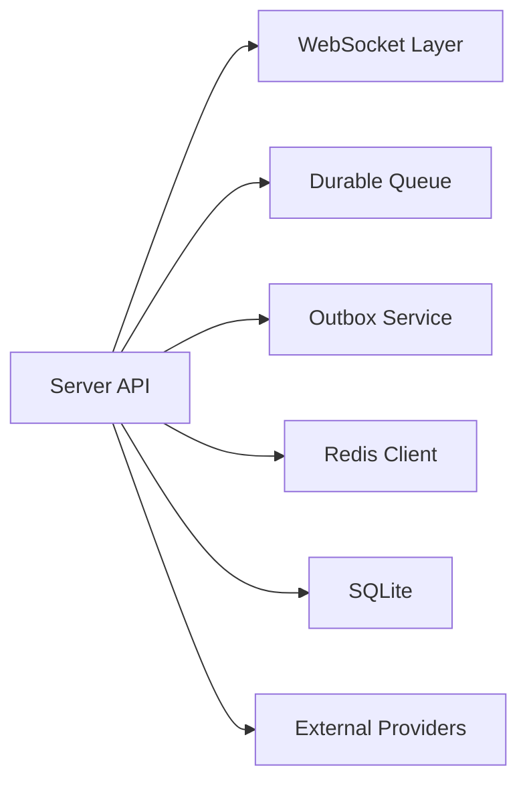

# Deployment & Operations

<cite>
**Referenced Files in This Document**
- [Dockerfile](file://Dockerfile)
- [docker-compose.yml](file://docker-compose.yml)
- [server/package.json](file://server/package.json)
- [package.json](file://package.json)
- [server/src/queue/jobQueue.js](file://server/src/queue/jobQueue.js)
- [server/src/queue/queueManager.js](file://server/src/queue/queueManager.js)
- [server/src/services/outbox.service.js](file://server/src/services/outbox.service.js)
- [server/src/workers/outbox.worker.js](file://server/src/workers/outbox.worker.js)
- [server/src/workers/dispatch.worker.js](file://server/src/workers/dispatch.worker.js)
- [server/src/workers/notification.worker.js](file://server/src/workers/notification.worker.js)
- [server/src/workers/recording.worker.js](file://server/src/workers/recording.worker.js)
- [server/src/services/backup.service.js](file://server/src/services/backup.service.js)
- [server/src/utils/logger.js](file://server/src/utils/logger.js)
</cite>

## Table of Contents
1. Introduction
2. Project Structure
3. Core Components
4. Architecture Overview
5. Detailed Component Analysis
6. Dependency Analysis
7. Performance Considerations
8. Troubleshooting Guide
9. Conclusion
10. Appendices

## Introduction
This document provides comprehensive deployment and operations guidance for the Inkiro platform. It covers containerization with Docker, local orchestration via docker-compose, worker processes using a durable database-backed queue and outbox pattern, monitoring and logging strategies, scaling and high availability considerations, and backup and recovery procedures for databases and application state.

## Project Structure
The platform is organized into:
- Server (Node.js API and workers)
- Client (frontend assets served by the server)
- Mobile app (separate build)
- Security suite (auditing tools)
- Container definitions at the repository root

Key operational artifacts:
- A multi-stage Dockerfile builds the client and packages the server for production.
- A docker-compose file defines the server and Redis services with health checks and persistent volumes.
- The server includes background workers for notifications, dispatch, recording, and an outbox processor.
- A durable job queue engine persists jobs to the database for reliability.
- Structured logging supports both development and production environments.
- A backup service creates point-in-time snapshots of the SQLite database.

**Diagram sources**
- [docker-compose.yml:3-50](file://docker-compose.yml#L3-L50)

**Section sources**
- [Dockerfile:1-35](file://Dockerfile#L1-L35)
- [docker-compose.yml:1-51](file://docker-compose.yml#L1-L51)
- [server/package.json:1-32](file://server/package.json#L1-L32)
- [package.json:1-23](file://package.json#L1-L23)

## Core Components
- Container image: Multi-stage build produces a minimal production image that serves the built client and runs the Node.js server.
- Orchestration: docker-compose defines the server and Redis with environment variables, ports, health checks, and persistent volumes.
- Workers: Background processors handle notifications, order dispatch, call recordings, and outbox event delivery.
- Queueing: A durable, database-backed job queue ensures zero lost jobs with retries, backoff, and dead-letter routing.
- Outbox: Transactional outbox guarantees reliable event emission with atomic claiming and stale recovery.
- Logging: Structured logger emits JSON in production and colorized logs locally, with PII masking.
- Backup: Automated snapshot backups of the SQLite database with integrity verification.

**Section sources**
- [Dockerfile:11-35](file://Dockerfile#L11-L35)
- [docker-compose.yml:3-50](file://docker-compose.yml#L3-L50)
- [server/src/queue/jobQueue.js:7-13](file://server/src/queue/jobQueue.js#L7-L13)
- [server/src/services/outbox.service.js:4-6](file://server/src/services/outbox.service.js#L4-L6)
- [server/src/utils/logger.js:1-6](file://server/src/utils/logger.js#L1-L6)
- [server/src/services/backup.service.js:6-8](file://server/src/services/backup.service.js#L6-L8)

## Architecture Overview
The runtime consists of a single server process serving HTTP/WebSocket endpoints and multiple background workers. Redis is used as a shared dependency (e.g., sessions or caching). Persistent data is stored in SQLite and optional object storage for media.

**Diagram sources**
- [docker-compose.yml:3-50](file://docker-compose.yml#L3-L50)
- [server/src/queue/jobQueue.js:7-13](file://server/src/queue/jobQueue.js#L7-L13)
- [server/src/services/outbox.service.js:4-6](file://server/src/services/outbox.service.js#L4-L6)

## Detailed Component Analysis

### Containerization Strategy
- Multi-stage build:
  - Stage 1 builds the frontend client assets.
  - Stage 2 installs server dependencies and copies built assets into the final image.
- Production image:
  - Runs Node.js with environment variables for port and host.
  - Exposes the API port and includes a health check endpoint.
- Local development:
  - docker-compose starts the server and Redis, maps ports, and mounts persistent volumes for data and recordings.

Operational notes:
- Health checks ensure readiness for orchestrators.
- Environment variables configure providers and modes for local runs.

**Section sources**
- [Dockerfile:3-35](file://Dockerfile#L3-L35)
- [docker-compose.yml:3-50](file://docker-compose.yml#L3-L50)

### Orchestration and Scaling
- Local development:
  - Use docker-compose to run server and Redis together with health checks and volume persistence.
- Production scaling:
  - Run multiple server replicas behind a reverse proxy/load balancer.
  - Scale workers horizontally; each worker instance claims jobs atomically from the database-backed queue.
  - Ensure Redis is externally managed for session/cache sharing if needed.
  - Mount shared storage for recordings and backups.

**Section sources**
- [docker-compose.yml:3-50](file://docker-compose.yml#L3-L50)
- [server/src/queue/jobQueue.js:107-143](file://server/src/queue/jobQueue.js#L107-L143)

### CI/CD Pipeline Configuration
Recommended pipeline stages:
- Lint and security audit:
  - Execute security audits defined in the root package scripts.
- Build:
  - Build the client assets and install server dependencies.
- Test:
  - Run server tests with concurrency settings.
- Package:
  - Build the Docker image using the provided Dockerfile.
- Deploy:
  - Push image to registry and deploy to target environment.
  - Validate health endpoint after rollout.

Notes:
- Use environment-specific configuration injection at deploy time.
- Persist build caches for faster iterations.

**Section sources**
- [package.json:6-20](file://package.json#L6-L20)
- [server/package.json:7-11](file://server/package.json#L7-L11)
- [Dockerfile:3-35](file://Dockerfile#L3-L35)

### Worker Processes and Queue Management
- Durable job queue:
  - Persists all jobs to the database with atomic claiming, automatic recovery of stale jobs, exponential backoff, and DLQ routing.
  - Supports explicit job type registration and per-job retry limits.
- Outbox pattern:
  - Enqueues events within transactions and processes them asynchronously.
  - Atomic claim-and-update prevents duplicate processing and supports stale recovery.
- Workers:
  - Notification worker sends SMS and WhatsApp receipts and handles pin-drop messages.
  - Dispatch worker integrates with ONDC/POS to dispatch orders and updates dashboard via WebSocket.
  - Recording worker persists call audio to storage and records metadata.
  - Outbox worker processes events like order confirmation and status changes.

**Diagram sources**
- [server/src/queue/jobQueue.js:107-143](file://server/src/queue/jobQueue.js#L107-L143)
- [server/src/workers/dispatch.worker.js:21-45](file://server/src/workers/dispatch.worker.js#L21-L45)

**Section sources**
- [server/src/queue/jobQueue.js:7-250](file://server/src/queue/jobQueue.js#L7-L250)
- [server/src/services/outbox.service.js:8-141](file://server/src/services/outbox.service.js#L8-L141)
- [server/src/workers/outbox.worker.js:1-131](file://server/src/workers/outbox.worker.js#L1-L131)
- [server/src/workers/notification.worker.js:1-72](file://server/src/workers/notification.worker.js#L1-L72)
- [server/src/workers/dispatch.worker.js:1-56](file://server/src/workers/dispatch.worker.js#L1-L56)
- [server/src/workers/recording.worker.js:1-53](file://server/src/workers/recording.worker.js#L1-L53)

### Monitoring and Logging
- Structured logging:
  - Produces JSON logs in production with correlation IDs and error details.
  - Masks sensitive phone numbers to protect PII.
  - Includes voice turn latency metrics for performance tracking.
- Health checks:
  - Container health check probes the API status endpoint.
- Metrics:
  - Use queue stats and outbox metrics to monitor throughput and failures.
  - Integrate with external observability systems by shipping JSON logs.

**Section sources**
- [server/src/utils/logger.js:1-132](file://server/src/utils/logger.js#L1-L132)
- [Dockerfile:31-34](file://Dockerfile#L31-L34)
- [server/src/queue/jobQueue.js:214-235](file://server/src/queue/jobQueue.js#L214-L235)

### Backup and Recovery
- Automated backups:
  - Creates point-in-time snapshots of the SQLite database using online backup.
  - Verifies integrity post-backup and logs results.
- Recovery procedure:
  - Stop writes, restore the latest backup file, restart services, and verify integrity.
- Operational tips:
  - Schedule regular backups and retain multiple generations.
  - Store backups off-host for disaster recovery.

**Section sources**
- [server/src/services/backup.service.js:10-49](file://server/src/services/backup.service.js#L10-L49)

## Dependency Analysis
Runtime dependencies include:
- Express-based API and WebSocket handlers
- ioredis for Redis connectivity
- sqlite3 for persistent storage
- Twilio for telephony integration
- External AI providers configured via environment variables

**Diagram sources**
- [server/package.json:12-26](file://server/package.json#L12-L26)
- [server/src/queue/jobQueue.js:1-3](file://server/src/queue/jobQueue.js#L1-L3)
- [server/src/services/outbox.service.js:1-3](file://server/src/services/outbox.service.js#L1-L3)

**Section sources**
- [server/package.json:12-26](file://server/package.json#L12-L26)

## Performance Considerations
- Concurrency:
  - Tune queue concurrency to match CPU and I/O capacity.
  - Limit outbox batch sizes to balance throughput and latency.
- Backpressure:
  - Monitor queue depths and adjust worker counts accordingly.
- Storage:
  - Offload large media to object storage to reduce database size.
- Observability:
  - Track voice turn latencies and alert on budget exceedances.
- Caching:
  - Use Redis for hot paths and session storage to reduce DB load.

[No sources needed since this section provides general guidance]

## Troubleshooting Guide
Common issues and resolutions:
- Jobs stuck in processing:
  - Stale job recovery resets locks older than the threshold; verify worker liveness.
- Dead-letter queue growth:
  - Inspect last errors and fix handler logic; reprocess if appropriate.
- Outbox events not delivered:
  - Check scheduled_at timestamps and retry counts; recover stale events automatically.
- Health check failures:
  - Verify API endpoint responsiveness and dependencies (Redis, DB).
- Backup integrity failures:
  - Re-run backup and validate checksums; consider restoring from previous good snapshot.

**Section sources**
- [server/src/queue/jobQueue.js:90-102](file://server/src/queue/jobQueue.js#L90-L102)
- [server/src/queue/jobQueue.js:182-207](file://server/src/queue/jobQueue.js#L182-L207)
- [server/src/services/outbox.service.js:32-49](file://server/src/services/outbox.service.js#L32-L49)
- [server/src/services/outbox.service.js:119-141](file://server/src/services/outbox.service.js#L119-L141)
- [Dockerfile:31-34](file://Dockerfile#L31-L34)
- [server/src/services/backup.service.js:22-49](file://server/src/services/backup.service.js#L22-L49)

## Conclusion
Inkiro’s deployment model centers on a containerized server with robust background processing powered by a durable database-backed queue and transactional outbox. docker-compose simplifies local development, while horizontal scaling and external Redis support production workloads. Structured logging, health checks, and automated backups provide operational visibility and resilience. Following the recommended practices ensures consistent environments, reliable job processing, and maintainable operations across development and production.

## Appendices

### Environment Variables and Configuration
- Server:
  - NODE_ENV, PORT, HOST
  - Provider configurations (AI LLM/TTS/STT)
  - DISPATCH_MODE
- Redis:
  - REDIS_URL
- Logging:
  - LOG_LEVEL

**Section sources**
- [docker-compose.yml:12-22](file://docker-compose.yml#L12-L22)
- [server/src/utils/logger.js:8-20](file://server/src/utils/logger.js#L8-L20)

### Local Development Commands
- Start all dev servers:
  - Use root scripts to launch server and client concurrently.
- Run tests:
  - Execute server tests with concurrency enabled.

**Section sources**
- [package.json:6-14](file://package.json#L6-L14)
- [server/package.json:7-11](file://server/package.json#L7-L11)