# Monitoring & Logging Strategy

<cite>
**Referenced Files in This Document**
- [logger.js](file://server/src/utils/logger.js)
- [correlationId.middleware.js](file://server/src/middleware/correlationId.middleware.js)
- [latencyTracer.js](file://server/src/services/latencyTracer.js)
- [sloTracker.js](file://server/src/services/sloTracker.js)
- [metrics.controller.js](file://server/src/controllers/metrics.controller.js)
- [metrics.routes.js](file://server/src/routes/metrics.routes.js)
- [audit.service.js](file://server/src/services/audit.service.js)
- [wsServer.js](file://server/src/websocket/wsServer.js)
- [dashboardWsHandler.js](file://server/src/websocket/dashboardWsHandler.js)
- [redisClient.js](file://server/src/infra/redisClient.js)
- [db.js](file://server/src/db.js)
- [errorHandler.middleware.js](file://server/src/middleware/errorHandler.middleware.js)
</cite>

## Table of Contents
1. Introduction
2. Project Structure
3. Core Components
4. Architecture Overview
5. Detailed Component Analysis
6. Dependency Analysis
7. Performance Considerations
8. Troubleshooting Guide
9. Conclusion
10. Appendices

## Introduction
This document describes the Inkiro platform’s comprehensive monitoring and logging strategy. It covers structured logging with log levels, correlation IDs, and contextual metadata; application performance monitoring including latency tracking, SLO measurement, and key business metrics; error tracking and alerting strategies; database query performance monitoring; WebSocket connection metrics; telephony call quality indicators; observability dashboards; distributed tracing across microservices; log retention and aggregation; and compliance requirements for audit trails.

## Project Structure
The monitoring and logging system is implemented primarily on the server side:
- Structured logger with PII masking and environment-aware formatting
- Correlation ID middleware that enriches requests and logs HTTP lifecycle events
- Latency tracer capturing per-turn voice pipeline timings (VAD, STT, LLM, TTS)
- SLO tracker computing availability, latency targets, and error budgets
- Metrics endpoints exposing latency analytics and audit logs
- Audit service implementing a cryptographic hash chain for tamper-evident logs
- WebSocket coordinator handling authentication, session liveness, and broadcast scoping
- Redis client providing single-use tickets for secure WebSocket upgrades
- Database layer with slow query detection and transaction helpers
- Centralized error handler emitting structured errors with correlation context

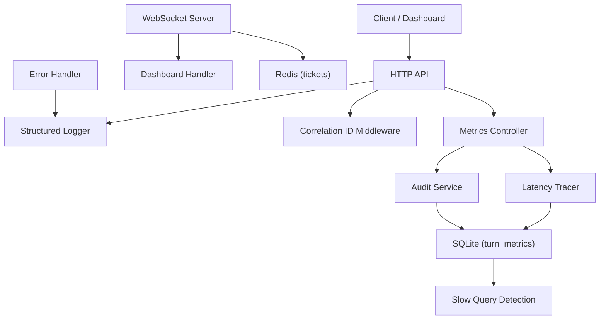

**Diagram sources**
- [logger.js:1-132](file://server/src/utils/logger.js#L1-L132)
- [correlationId.middleware.js:1-62](file://server/src/middleware/correlationId.middleware.js#L1-L62)
- [latencyTracer.js:1-133](file://server/src/services/latencyTracer.js#L1-L133)
- [sloTracker.js:1-65](file://server/src/services/sloTracker.js#L1-L65)
- [metrics.controller.js:1-29](file://server/src/controllers/metrics.controller.js#L1-L29)
- [metrics.routes.js:1-8](file://server/src/routes/metrics.routes.js#L1-L8)
- [audit.service.js:1-142](file://server/src/services/audit.service.js#L1-L142)
- [wsServer.js:1-162](file://server/src/websocket/wsServer.js#L1-L162)
- [dashboardWsHandler.js:1-69](file://server/src/websocket/dashboardWsHandler.js#L1-L69)
- [redisClient.js:1-127](file://server/src/infra/redisClient.js#L1-L127)
- [db.js:1-226](file://server/src/db.js#L1-L226)
- [errorHandler.middleware.js:1-43](file://server/src/middleware/errorHandler.middleware.js#L1-L43)

**Section sources**
- [logger.js:1-132](file://server/src/utils/logger.js#L1-L132)
- [correlationId.middleware.js:1-62](file://server/src/middleware/correlationId.middleware.js#L1-L62)
- [latencyTracer.js:1-133](file://server/src/services/latencyTracer.js#L1-L133)
- [sloTracker.js:1-65](file://server/src/services/sloTracker.js#L1-L65)
- [metrics.controller.js:1-29](file://server/src/controllers/metrics.controller.js#L1-L29)
- [metrics.routes.js:1-8](file://server/src/routes/metrics.routes.js#L1-L8)
- [audit.service.js:1-142](file://server/src/services/audit.service.js#L1-L142)
- [wsServer.js:1-162](file://server/src/websocket/wsServer.js#L1-L162)
- [dashboardWsHandler.js:1-69](file://server/src/websocket/dashboardWsHandler.js#L1-L69)
- [redisClient.js:1-127](file://server/src/infra/redisClient.js#L1-L127)
- [db.js:1-226](file://server/src/db.js#L1-L226)
- [errorHandler.middleware.js:1-43](file://server/src/middleware/errorHandler.middleware.js#L1-L43)

## Core Components
- Structured Logger: Produces JSON logs in production with correlation IDs and PII masking; colorized logs locally. Includes a specialized voice turn logger that warns when latency budgets are exceeded.
- Correlation ID Middleware: Injects request and correlation IDs into responses and logs HTTP method, URL, status code, duration, and tenant/user context.
- Latency Tracer: Tracks per-turn latencies across VAD, STT, LLM, TTS stages, computes totals, persists to the database, and exposes analytics.
- SLO Tracker: Computes availability, latency, and error rate against defined targets and calculates error budget remaining.
- Metrics Controller/Routes: Exposes endpoints for latency analytics and audit logs.
- Audit Service: Implements a cryptographic hash chain for immutable audit logs with verification utilities.
- WebSocket Server: Handles upgrade authentication via tickets or tokens, enforces role-based access, maintains liveness checks, and routes to handlers.
- Redis Client: Provides single-use tickets for WebSocket upgrades with TTL and an in-memory fallback for development.
- Database Layer: Wraps SQLite operations with slow query detection and transaction support.
- Error Handler: Centralizes error logging with structured fields and safe error responses.

**Section sources**
- [logger.js:1-132](file://server/src/utils/logger.js#L1-L132)
- [correlationId.middleware.js:1-62](file://server/src/middleware/correlationId.middleware.js#L1-L62)
- [latencyTracer.js:1-133](file://server/src/services/latencyTracer.js#L1-L133)
- [sloTracker.js:1-65](file://server/src/services/sloTracker.js#L1-L65)
- [metrics.controller.js:1-29](file://server/src/controllers/metrics.controller.js#L1-L29)
- [metrics.routes.js:1-8](file://server/src/routes/metrics.routes.js#L1-L8)
- [audit.service.js:1-142](file://server/src/services/audit.service.js#L1-L142)
- [wsServer.js:1-162](file://server/src/websocket/wsServer.js#L1-L162)
- [redisClient.js:1-127](file://server/src/infra/redisClient.js#L1-L127)
- [db.js:1-226](file://server/src/db.js#L1-L226)
- [errorHandler.middleware.js:1-43](file://server/src/middleware/errorHandler.middleware.js#L1-L43)

## Architecture Overview
The monitoring architecture integrates structured logging, correlation tracking, latency profiling, SLO computation, audit trails, and real-time WebSocket telemetry. Requests flow through correlation middleware, which attaches trace context and logs lifecycle events. Voice calls are profiled by the latency tracer, persisting stage-level timings. SLO metrics aggregate recent call data to assess availability and latency targets. The WebSocket server authenticates connections using short-lived tickets stored in Redis and broadcasts scoped events to dashboard clients. Database operations are wrapped to detect slow queries. Errors are centrally handled and logged with correlation context.

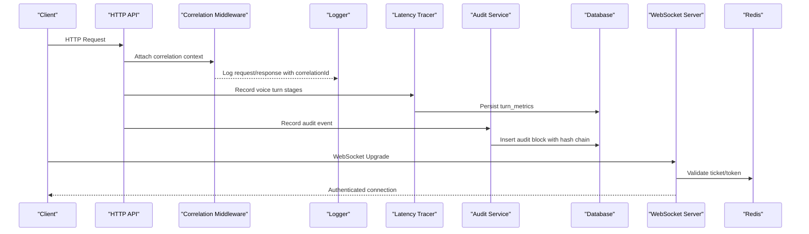

**Diagram sources**
- [correlationId.middleware.js:1-62](file://server/src/middleware/correlationId.middleware.js#L1-L62)
- [latencyTracer.js:1-133](file://server/src/services/latencyTracer.js#L1-L133)
- [audit.service.js:1-142](file://server/src/services/audit.service.js#L1-L142)
- [wsServer.js:1-162](file://server/src/websocket/wsServer.js#L1-L162)
- [redisClient.js:1-127](file://server/src/infra/redisClient.js#L1-L127)
- [db.js:1-226](file://server/src/db.js#L1-L226)

## Detailed Component Analysis

### Structured Logging and PII Protection
- Log levels: TRACE, DEBUG, INFO, WARN, ERROR controlled by environment variable.
- Production logs are machine-parseable JSON with timestamp, level, message, correlationId, and sanitized metadata.
- PII masking: Phone numbers are masked before logging to protect sensitive data.
- Voice turn logger: Emits detailed latency breakdowns and warns when total latency exceeds thresholds.

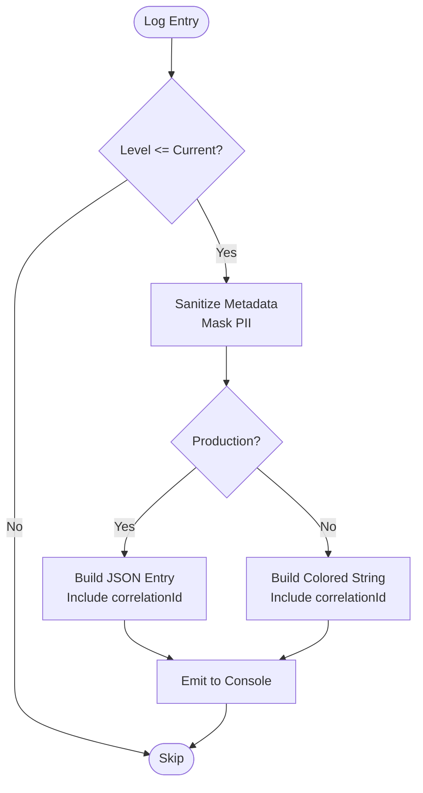

**Diagram sources**
- [logger.js:1-132](file://server/src/utils/logger.js#L1-L132)

**Section sources**
- [logger.js:1-132](file://server/src/utils/logger.js#L1-L132)

### Correlation ID Middleware
- Extracts or generates request and correlation IDs from headers.
- Enriches request context with call/session/order identifiers and tenant/user info.
- Sets response headers for downstream propagation.
- Logs HTTP lifecycle events with method, URL, status code, and duration; differentiates error vs warning vs info based on status codes.

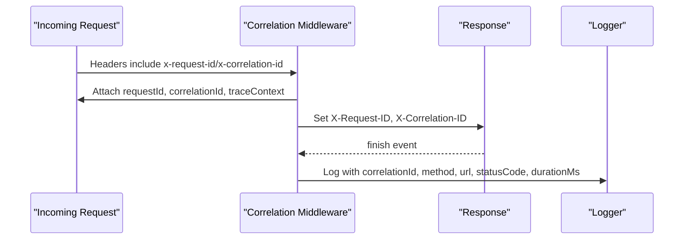

**Diagram sources**
- [correlationId.middleware.js:1-62](file://server/src/middleware/correlationId.middleware.js#L1-L62)

**Section sources**
- [correlationId.middleware.js:1-62](file://server/src/middleware/correlationId.middleware.js#L1-L62)

### Latency Tracking and Voice Turn Metrics
- Starts a trace per voice session turn, records stage durations (VAD, STT, LLM, TTS), and computes total latency.
- Persists turn metrics asynchronously to the database and emits structured logs via the voice turn logger.
- Provides analytics endpoint returning averages and percentiles (P50, P95, P99).

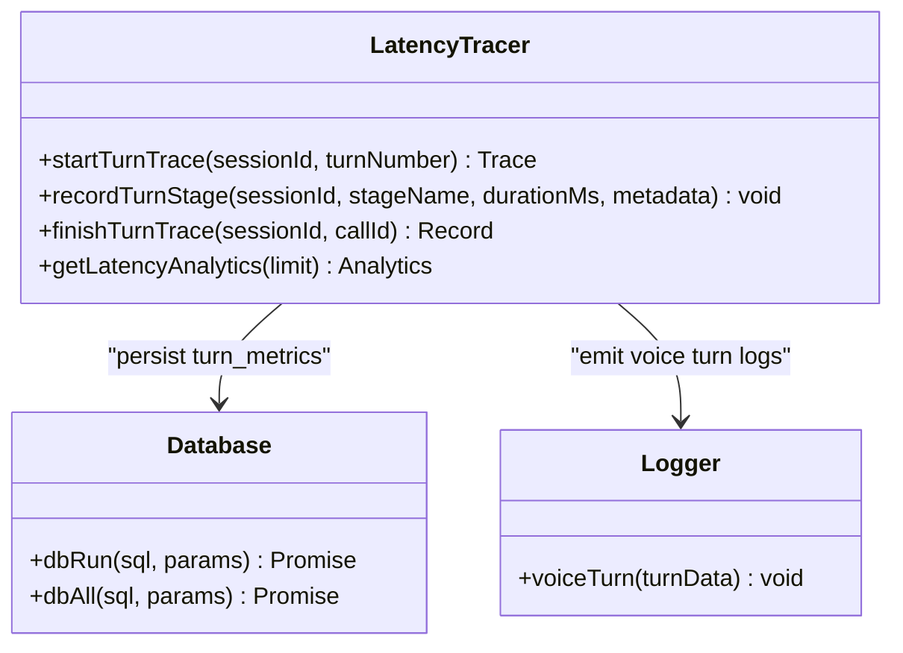

**Diagram sources**
- [latencyTracer.js:1-133](file://server/src/services/latencyTracer.js#L1-L133)
- [db.js:1-226](file://server/src/db.js#L1-L226)
- [logger.js:1-132](file://server/src/utils/logger.js#L1-L132)

**Section sources**
- [latencyTracer.js:1-133](file://server/src/services/latencyTracer.js#L1-L133)
- [db.js:1-226](file://server/src/db.js#L1-L226)
- [logger.js:1-132](file://server/src/utils/logger.js#L1-L132)

### SLO Measurement and Error Budget
- Defines targets for API availability, voice setup time, STT latency, order creation time, and max error rate.
- Aggregates recent call data to compute actual availability and latency, then determines health status.
- Calculates error budget remaining and burn rate indicators.

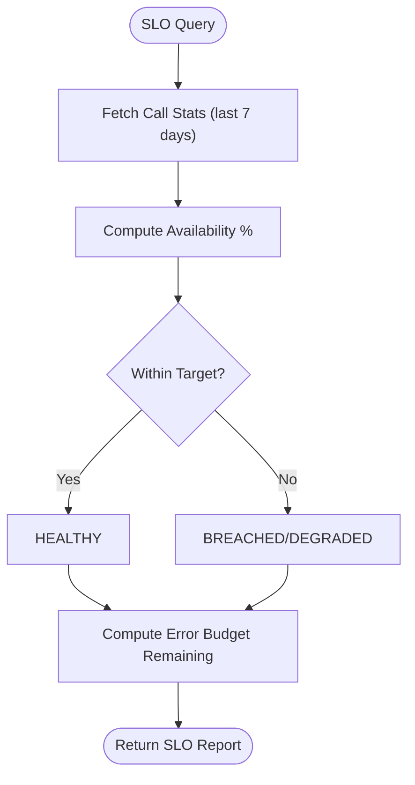

**Diagram sources**
- [sloTracker.js:1-65](file://server/src/services/sloTracker.js#L1-L65)

**Section sources**
- [sloTracker.js:1-65](file://server/src/services/sloTracker.js#L1-L65)

### Metrics Endpoints
- GET /api/metrics/latency: Returns latency analytics including averages and percentiles.
- GET /api/metrics/audit-logs: Returns recent audit logs scoped by restaurant.

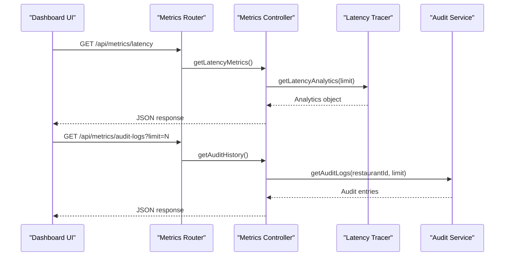

**Diagram sources**
- [metrics.routes.js:1-8](file://server/src/routes/metrics.routes.js#L1-L8)
- [metrics.controller.js:1-29](file://server/src/controllers/metrics.controller.js#L1-L29)
- [latencyTracer.js:1-133](file://server/src/services/latencyTracer.js#L1-L133)
- [audit.service.js:1-142](file://server/src/services/audit.service.js#L1-L142)

**Section sources**
- [metrics.routes.js:1-8](file://server/src/routes/metrics.routes.js#L1-L8)
- [metrics.controller.js:1-29](file://server/src/controllers/metrics.controller.js#L1-L29)

### Audit Trail and Compliance
- Records state transitions with actor type, resource details, before/after states, and metadata.
- Builds a cryptographic hash chain linking each block to the previous one for tamper evidence.
- Provides verification utility to validate integrity of the entire chain.

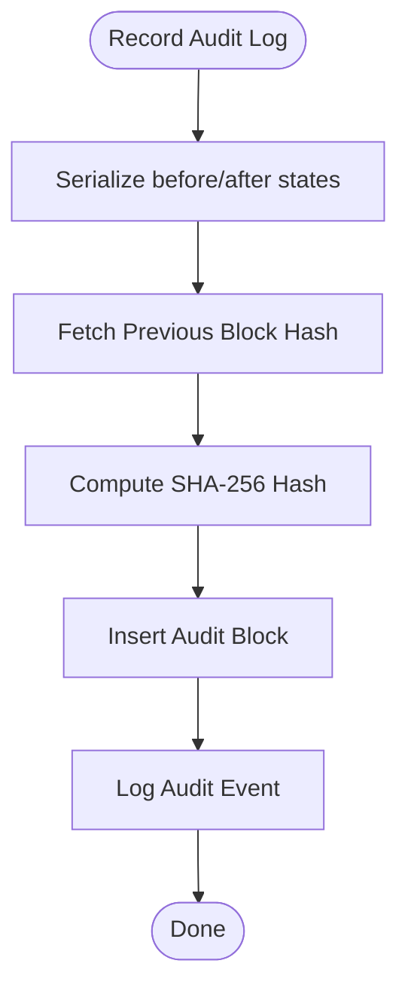

**Diagram sources**
- [audit.service.js:1-142](file://server/src/services/audit.service.js#L1-L142)

**Section sources**
- [audit.service.js:1-142](file://server/src/services/audit.service.js#L1-L142)

### WebSocket Connection Metrics and Telephony Quality
- Authentication: Supports single-use tickets via Redis or bearer tokens; enforces role-based access for dashboard connections.
- Liveness: Heartbeat ping every 30 seconds; terminates inactive connections.
- Scoping: Broadcasts events strictly within tenant and restaurant boundaries unless marked global.
- Telephony streams: Validates stream tickets for media and exotel streams; logs unauthorized attempts.

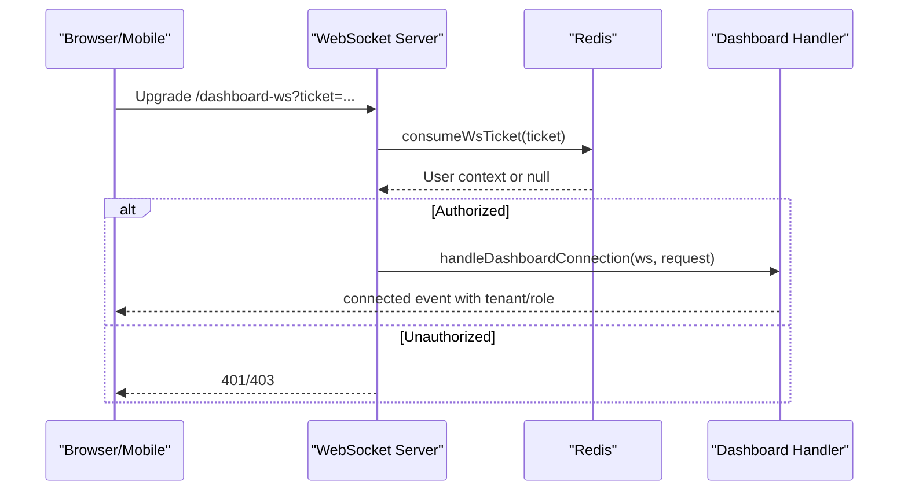

**Diagram sources**
- [wsServer.js:1-162](file://server/src/websocket/wsServer.js#L1-L162)
- [dashboardWsHandler.js:1-69](file://server/src/websocket/dashboardWsHandler.js#L1-L69)
- [redisClient.js:1-127](file://server/src/infra/redisClient.js#L1-L127)

**Section sources**
- [wsServer.js:1-162](file://server/src/websocket/wsServer.js#L1-L162)
- [dashboardWsHandler.js:1-69](file://server/src/websocket/dashboardWsHandler.js#L1-L69)
- [redisClient.js:1-127](file://server/src/infra/redisClient.js#L1-L127)

### Database Query Performance Monitoring
- All database operations are wrapped with timing instrumentation.
- Queries exceeding a threshold are logged as warnings with SQL snippet and operation type.
- Transactions provide atomicity with rollback on failure.

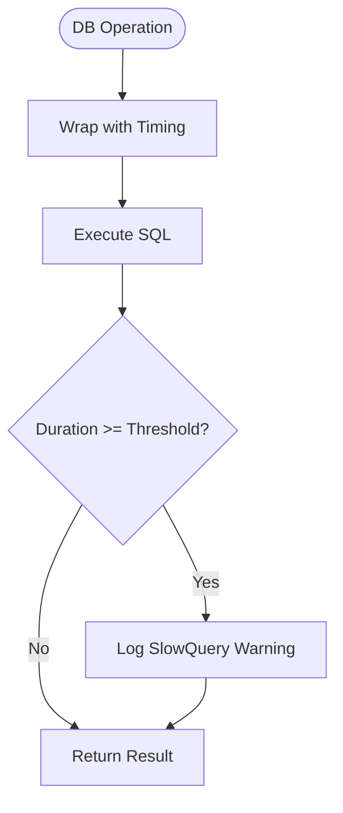

**Diagram sources**
- [db.js:1-226](file://server/src/db.js#L1-L226)

**Section sources**
- [db.js:1-226](file://server/src/db.js#L1-L226)

### Error Tracking and Alerting Strategies
- Centralized error handler logs structured errors with correlation ID, status code, and path.
- Prevents leaking internal details to clients; exposes only safe messages.
- Correlation context ensures errors can be traced back to originating requests.

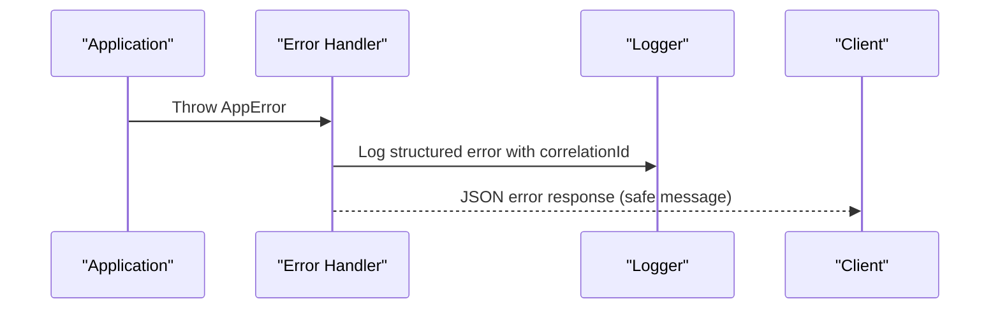

**Diagram sources**
- [errorHandler.middleware.js:1-43](file://server/src/middleware/errorHandler.middleware.js#L1-L43)
- [logger.js:1-132](file://server/src/utils/logger.js#L1-L132)

**Section sources**
- [errorHandler.middleware.js:1-43](file://server/src/middleware/errorHandler.middleware.js#L1-L43)
- [logger.js:1-132](file://server/src/utils/logger.js#L1-L132)

## Dependency Analysis
Key dependencies and relationships:
- Logger is used by correlation middleware, latency tracer, audit service, WebSocket handlers, and Redis client.
- Correlation middleware depends on logger and sets response headers for downstream propagation.
- Latency tracer depends on database and logger; provides analytics consumed by metrics controller.
- SLO tracker depends on database to aggregate call metrics.
- Metrics controller depends on latency tracer and audit service; exposed via metrics router.
- WebSocket server depends on Redis for ticket validation and routes to handlers that use logger.
- Database layer wraps SQLite with slow query detection and transactions.

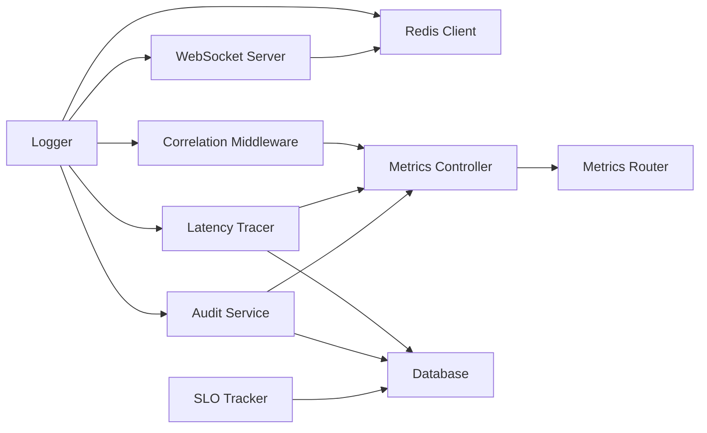

**Diagram sources**
- [logger.js:1-132](file://server/src/utils/logger.js#L1-L132)
- [correlationId.middleware.js:1-62](file://server/src/middleware/correlationId.middleware.js#L1-L62)
- [latencyTracer.js:1-133](file://server/src/services/latencyTracer.js#L1-L133)
- [audit.service.js:1-142](file://server/src/services/audit.service.js#L1-L142)
- [wsServer.js:1-162](file://server/src/websocket/wsServer.js#L1-L162)
- [redisClient.js:1-127](file://server/src/infra/redisClient.js#L1-L127)
- [metrics.controller.js:1-29](file://server/src/controllers/metrics.controller.js#L1-L29)
- [metrics.routes.js:1-8](file://server/src/routes/metrics.routes.js#L1-L8)
- [sloTracker.js:1-65](file://server/src/services/sloTracker.js#L1-L65)
- [db.js:1-226](file://server/src/db.js#L1-L226)

**Section sources**
- [logger.js:1-132](file://server/src/utils/logger.js#L1-L132)
- [correlationId.middleware.js:1-62](file://server/src/middleware/correlationId.middleware.js#L1-L62)
- [latencyTracer.js:1-133](file://server/src/services/latencyTracer.js#L1-L133)
- [audit.service.js:1-142](file://server/src/services/audit.service.js#L1-L142)
- [wsServer.js:1-162](file://server/src/websocket/wsServer.js#L1-L162)
- [redisClient.js:1-127](file://server/src/infra/redisClient.js#L1-L127)
- [metrics.controller.js:1-29](file://server/src/controllers/metrics.controller.js#L1-L29)
- [metrics.routes.js:1-8](file://server/src/routes/metrics.routes.js#L1-L8)
- [sloTracker.js:1-65](file://server/src/services/sloTracker.js#L1-L65)
- [db.js:1-226](file://server/src/db.js#L1-L226)

## Performance Considerations
- Latency budgets: Voice turn logger warns when total latency exceeds thresholds; track per-stage durations to identify bottlenecks.
- Slow queries: Database wrapper logs warnings for queries exceeding a threshold; optimize indexes and queries accordingly.
- SLOs: Use SLO tracker to monitor availability and latency targets; adjust capacity or algorithms if breaches occur.
- WebSocket liveness: Heartbeat interval balances overhead with timely detection of dead connections.
- Redis tickets: Short TTLs reduce risk of reuse and minimize storage footprint.

[No sources needed since this section provides general guidance]

## Troubleshooting Guide
- Missing correlation ID: Ensure upstream services propagate x-correlation-id; verify middleware sets response headers.
- High voice latency: Inspect turn metrics via metrics endpoint; check per-stage durations and provider metadata.
- Slow database queries: Review slow query logs; analyze SQL snippets and consider indexing or query refactoring.
- WebSocket auth failures: Validate ticket issuance and consumption; confirm Redis connectivity and TTL behavior.
- Audit integrity issues: Use verification utility to detect broken chains; investigate tampering or migration anomalies.
- Error responses: Check centralized error logs for structured details; correlate with request correlation IDs.

**Section sources**
- [correlationId.middleware.js:1-62](file://server/src/middleware/correlationId.middleware.js#L1-L62)
- [latencyTracer.js:1-133](file://server/src/services/latencyTracer.js#L1-L133)
- [db.js:1-226](file://server/src/db.js#L1-L226)
- [wsServer.js:1-162](file://server/src/websocket/wsServer.js#L1-L162)
- [redisClient.js:1-127](file://server/src/infra/redisClient.js#L1-L127)
- [audit.service.js:1-142](file://server/src/services/audit.service.js#L1-L142)
- [errorHandler.middleware.js:1-43](file://server/src/middleware/errorHandler.middleware.js#L1-L43)

## Conclusion
Inkiro’s monitoring and logging strategy combines structured logging with correlation contexts, precise latency profiling, SLO-driven reliability targets, immutable audit trails, and robust WebSocket telemetry. Together, these components enable proactive issue detection, clear debugging across distributed systems, and compliance-ready audit capabilities. Extending this foundation with centralized log aggregation, alerting rules, and distributed tracing will further enhance operational visibility and resilience.

[No sources needed since this section summarizes without analyzing specific files]

## Appendices

### Observability Dashboards and Alerts
- Dashboards:
  - Latency analytics: Plot P50/P95/P99 from metrics endpoint; drill down by provider/language.
  - SLO status: Visualize availability, latency targets, and error budget remaining.
  - Audit trail: Display recent blocks with hashes and verification status.
  - WebSocket metrics: Track active connections, disconnect rates, and broadcast scope adherence.
- Alerts:
  - Latency budget exceeded: Trigger when voice turn totalMs exceeds configured thresholds.
  - Slow queries: Alert on repeated slow query warnings beyond a frequency threshold.
  - SLO breach: Alert when availability or latency targets are breached for a rolling window.
  - WebSocket auth failures: Alert on spikes in unauthorized upgrade attempts.

[No sources needed since this section provides general guidance]

### Distributed Tracing Across Microservices
- Propagate correlation IDs via headers across HTTP and WebSocket boundaries.
- Include correlationId in all structured logs and metrics payloads.
- Extend trace context to background workers and queue jobs for end-to-end visibility.

[No sources needed since this section provides general guidance]

### Log Retention, Aggregation, and Compliance
- Retention:
  - Define policies for operational logs (e.g., 30–90 days) and audit logs (long-term retention).
  - Separate high-volume telemetry from compliance-critical audit trails.
- Aggregation:
  - Ship JSON logs to centralized systems (e.g., Loki, CloudWatch) for querying and alerting.
  - Normalize fields such as correlationId, level, and timestamp for consistent analysis.
- Compliance:
  - Maintain immutable audit chains for regulatory requirements.
  - Mask PII in logs; ensure audit logs capture necessary context without exposing sensitive data.

[No sources needed since this section provides general guidance]