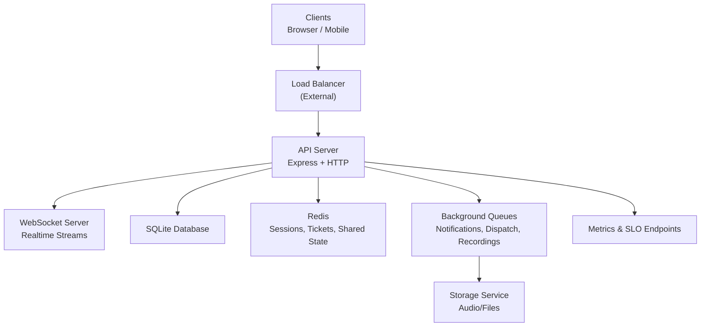
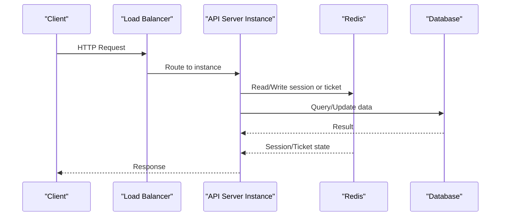
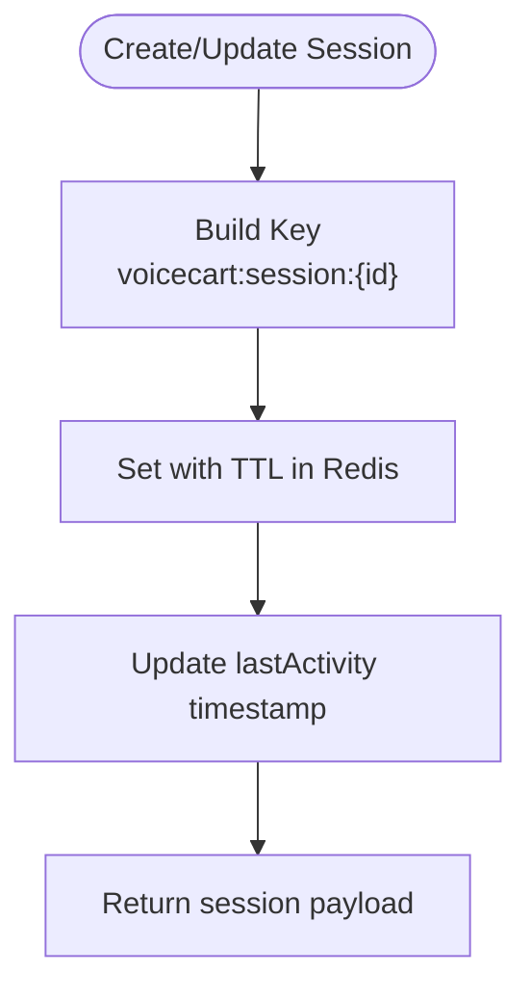
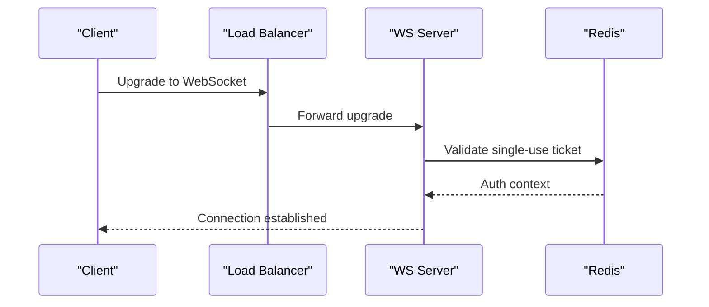
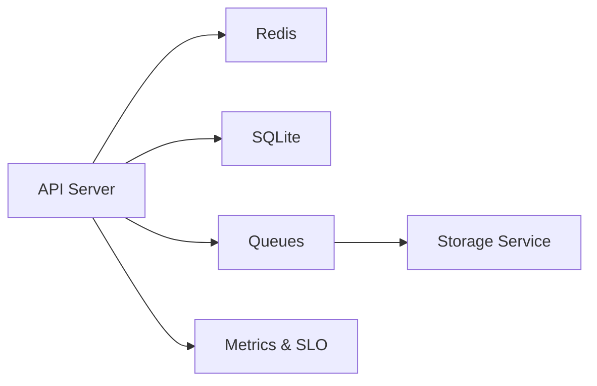

# Scaling & High Availability

<cite>
**Referenced Files in This Document**
- [redisClient.js](file://server/src/infra/redisClient.js)
- [sessionStore.js](file://server/src/infra/sessionStore.js)
- [db.js](file://server/src/db.js)
- [rateLimit.middleware.js](file://server/src/middleware/rateLimit.middleware.js)
- [wsServer.js](file://server/src/websocket/wsServer.js)
- [wsTicketService.js](file://server/src/services/wsTicketService.js)
- [queueManager.js](file://server/src/queue/queueManager.js)
- [backup.service.js](file://server/src/services/backup.service.js)
- [env.js](file://server/src/config/env.js)
- [docker-compose.yml](file://docker-compose.yml)
- [Dockerfile](file://Dockerfile)
- [correlationId.middleware.js](file://server/src/middleware/correlationId.middleware.js)
- [metrics.controller.js](file://server/src/controllers/metrics.controller.js)
- [sloTracker.js](file://server/src/services/sloTracker.js)
</cite>

## Table of Contents
1. Introduction
2. Project Structure
3. Core Components
4. Architecture Overview
5. Detailed Component Analysis
6. Dependency Analysis
7. Performance Considerations
8. Troubleshooting Guide
9. Conclusion
10. Appendices

## Introduction
This document provides a comprehensive guide to scaling and ensuring high availability for the Inkiro platform. It focuses on horizontal scaling strategies for stateless API servers, shared state management with Redis, load balancing considerations, database scaling approaches, WebSocket scaling for real-time communication, rate limiting and throttling, disaster recovery and backups, and capacity planning with performance tuning and monitoring. The guidance is grounded in the current codebase implementation and production-ready patterns present in the repository.

## Project Structure
The platform consists of:
- A Node.js server exposing HTTP APIs and WebSockets
- Redis for distributed session storage, tickets, and shared state
- SQLite as the primary data store with migrations and backup utilities
- Docker Compose for local orchestration and health checks
- Middleware for rate limiting, correlation IDs, and error handling
- Queues for background processing (notifications, dispatch, recordings)
- SLO tracking and metrics endpoints for observability

**Diagram sources**
- [docker-compose.yml:4-31](file://docker-compose.yml#L4-L31)
- [wsServer.js:17-161](file://server/src/websocket/wsServer.js#L17-L161)
- [db.js:11-44](file://server/src/db.js#L11-L44)
- [redisClient.js:82-123](file://server/src/infra/redisClient.js#L82-L123)
- [queueManager.js:8-10](file://server/src/queue/queueManager.js#L8-L10)
- [metrics.controller.js:9-28](file://server/src/controllers/metrics.controller.js#L9-L28)

**Section sources**
- [docker-compose.yml:4-31](file://docker-compose.yml#L4-L31)
- [Dockerfile:12-34](file://Dockerfile#L12-L34)

## Core Components
- Stateless API servers: Express routes and controllers are stateless; shared state is externalized to Redis.
- Session management: Ephemeral voice sessions stored in Redis with TTLs and multi-instance discovery.
- Authentication tickets: Single-use WebSocket tickets persisted in Redis for secure upgrades across instances.
- Database layer: SQLite with WAL mode, migrations, transactions, and slow query logging.
- Rate limiting: Per-route limits using express-rate-limit with custom handlers.
- Background jobs: Dedicated queues for notifications, dispatch, and recording persistence.
- Observability: Correlation IDs, latency metrics, audit logs, and SLO tracking.

**Section sources**
- [sessionStore.js:13-91](file://server/src/infra/sessionStore.js#L13-L91)
- [wsTicketService.js:11-85](file://server/src/services/wsTicketService.js#L11-L85)
- [db.js:57-120](file://server/src/db.js#L57-L120)
- [rateLimit.middleware.js:8-51](file://server/src/middleware/rateLimit.middleware.js#L8-L51)
- [queueManager.js:8-10](file://server/src/queue/queueManager.js#L8-L10)
- [correlationId.middleware.js:10-58](file://server/src/middleware/correlationId.middleware.js#L10-L58)

## Architecture Overview
Horizontal scaling strategy:
- Run multiple API server instances behind an external load balancer.
- Externalize all mutable state to Redis (sessions, tickets, rate limit counters).
- Use background queues to offload heavy work from request paths.
- Ensure databases are backed up regularly and consider read replicas if migrating to a relational engine that supports them.

**Diagram sources**
- [docker-compose.yml:4-31](file://docker-compose.yml#L4-L31)
- [redisClient.js:82-123](file://server/src/infra/redisClient.js#L82-L123)
- [db.js:57-120](file://server/src/db.js#L57-L120)

## Detailed Component Analysis

### Horizontal Scaling of Stateless API Servers
- The server exposes HTTP endpoints and is containerized with a health check endpoint used by orchestrators.
- Environment variables define port, environment, and dependencies like Redis URL.
- Health checks enable auto-scaling groups or orchestrators to route traffic only to healthy instances.

Recommendations:
- Deploy multiple containers behind a load balancer (e.g., NGINX, HAProxy, cloud LB).
- Configure sticky sessions only if necessary; prefer stateless design via Redis.
- Use readiness/liveness probes to manage rolling updates safely.

**Section sources**
- [Dockerfile:18-34](file://Dockerfile#L18-L34)
- [docker-compose.yml:4-31](file://docker-compose.yml#L4-L31)
- [env.js:3-24](file://server/src/config/env.js#L3-L24)

### Session Management Using Redis for Shared State
- Sessions are stored in Redis with a prefix key scheme and TTLs for automatic expiration.
- Multi-instance discovery is supported via listing keys and filtering by tenant/restaurant.
- Touch operations update TTLs to keep active sessions alive.

Scaling considerations:
- Use a managed Redis cluster for high availability and replication.
- Ensure connection pooling and retries are configured in the client.
- Monitor Redis memory usage and eviction policies.

**Diagram sources**
- [sessionStore.js:13-55](file://server/src/infra/sessionStore.js#L13-L55)

**Section sources**
- [sessionStore.js:13-91](file://server/src/infra/sessionStore.js#L13-L91)
- [redisClient.js:82-123](file://server/src/infra/redisClient.js#L82-L123)

### Load Balancing Configurations
- The repository uses Docker Compose for local orchestration and exposes ports for the server and Redis.
- For production, place an external load balancer in front of multiple server instances.
- Ensure health checks target the same endpoint used by orchestrators.

Guidance:
- Configure round-robin or least-connections algorithms based on workload characteristics.
- Enable connection draining during deployments to avoid dropping active requests.
- Use TLS termination at the LB and forward plain HTTP to internal services.

**Section sources**
- [docker-compose.yml:4-31](file://docker-compose.yml#L4-L31)
- [Dockerfile:31-34](file://Dockerfile#L31-L34)

### Database Scaling Approaches
Current implementation:
- SQLite with WAL mode enabled for better concurrency and durability.
- Migrations run at startup; seed data provided for demo tenants.
- Transactions wrap critical operations; slow queries are logged for profiling.

Scaling recommendations:
- For write-heavy workloads or multi-node setups, migrate to a managed relational database (PostgreSQL/MySQL) to support read replicas and connection pooling.
- Implement connection pooling at the application level when using pooled drivers.
- Optimize queries with proper indexing and avoid full table scans; leverage slow query logs to identify bottlenecks.
- Use read replicas for read-heavy endpoints and route reads accordingly.

Operational notes:
- Keep migrations idempotent and versioned; apply them during deployments with zero downtime strategies.
- Back up the database regularly and test restore procedures.

**Section sources**
- [db.js:11-44](file://server/src/db.js#L11-L44)
- [db.js:57-120](file://server/src/db.js#L57-L120)

### WebSocket Scaling Considerations
- WebSocket server handles multiple stream types: dashboard, web media, telephony streams.
- Authentication uses single-use tickets stored in Redis to scale across instances.
- Active sessions map is process-local; for multi-instance scaling, move session state to Redis.

Scaling guidance:
- Use Redis-backed session/state for real-time connections to allow any instance to handle reconnections or messages.
- Implement sticky sessions at the LB for long-lived streams if needed, or use a pub/sub system to fan out events across instances.
- Add heartbeat and liveness checks to detect stale connections and free resources.

**Diagram sources**
- [wsServer.js:17-161](file://server/src/websocket/wsServer.js#L17-L161)
- [wsTicketService.js:11-85](file://server/src/services/wsTicketService.js#L11-L85)

**Section sources**
- [wsServer.js:17-161](file://server/src/websocket/wsServer.js#L17-L161)
- [wsTicketService.js:11-85](file://server/src/services/wsTicketService.js#L11-L85)

### Rate Limiting and Throttling Strategies
- Built-in rate limiters protect authentication, public APIs, dashboard APIs, and telephony webhooks.
- Limits are per IP or per authenticated user where applicable.
- Custom handlers return standardized errors for consistent client behavior.

Best practices:
- Tune window sizes and max requests per endpoint based on observed traffic patterns.
- Use token bucket or sliding window algorithms for smoother throttling.
- Integrate with Redis for distributed rate limiting across instances.

**Section sources**
- [rateLimit.middleware.js:8-51](file://server/src/middleware/rateLimit.middleware.js#L8-L51)

### Disaster Recovery, Backup Strategies, and Failover
- Automated snapshot backups are implemented using SQLite VACUUM INTO and integrity checks.
- Backups are written to a dedicated directory with timestamps for retention and rotation.
- Failover should include:
  - Multiple Redis nodes/clusters with failover
  - Database backups restored to a standby instance
  - Health checks and automated restarts

Operational steps:
- Schedule periodic backups and verify integrity post-backup.
- Store backups offsite and encrypt sensitive data at rest.
- Test restore procedures regularly to ensure recoverability.

**Section sources**
- [backup.service.js:10-49](file://server/src/services/backup.service.js#L10-L49)

### Capacity Planning, Performance Tuning, and Monitoring
- Correlation IDs propagate trace context across requests, workers, and logs for end-to-end tracing.
- Latency metrics and audit logs are exposed via endpoints for observability dashboards.
- SLO tracking measures availability targets and error budgets.

Tuning recommendations:
- Monitor queue backlogs and adjust concurrency settings per job type.
- Profile slow queries and optimize indexes; tune SQLite PRAGMAs as needed.
- Set resource limits and autoscaling thresholds based on CPU, memory, and request rates.

Monitoring:
- Expose metrics endpoints and integrate with alerting systems.
- Track SLOs and set alerts for breaches or budget burn rates.

**Section sources**
- [correlationId.middleware.js:10-58](file://server/src/middleware/correlationId.middleware.js#L10-L58)
- [metrics.controller.js:9-28](file://server/src/controllers/metrics.controller.js#L9-L28)
- [sloTracker.js:1-64](file://server/src/services/sloTracker.js#L1-L64)

## Dependency Analysis
Key runtime dependencies and their roles:
- Redis: Centralized state for sessions, tickets, and shared counters.
- SQLite: Primary data store with WAL and migrations.
- Queues: Background processing for side effects and I/O-bound tasks.
- Docker: Containerization and orchestration with health checks.

**Diagram sources**
- [redisClient.js:82-123](file://server/src/infra/redisClient.js#L82-L123)
- [db.js:11-44](file://server/src/db.js#L11-L44)
- [queueManager.js:8-10](file://server/src/queue/queueManager.js#L8-L10)
- [metrics.controller.js:9-28](file://server/src/controllers/metrics.controller.js#L9-L28)

**Section sources**
- [redisClient.js:82-123](file://server/src/infra/redisClient.js#L82-L123)
- [db.js:11-44](file://server/src/db.js#L11-L44)
- [queueManager.js:8-10](file://server/src/queue/queueManager.js#L8-L10)

## Performance Considerations
- Prefer stateless design to enable horizontal scaling; externalize state to Redis.
- Use background queues to decouple heavy operations from request paths.
- Enable WAL mode and monitor slow queries to maintain database performance.
- Apply rate limiting to protect against abuse and ensure fair resource allocation.
- Use correlation IDs and metrics to identify bottlenecks and track SLOs.

[No sources needed since this section provides general guidance]

## Troubleshooting Guide
Common issues and resolutions:
- Redis connectivity failures: Verify REDIS_URL and network access; ensure Redis is healthy and reachable.
- Session loss after restart: Confirm Redis persistence and TTLs; implement graceful shutdown to flush state if needed.
- Database corruption: Use backup snapshots and integrity checks; restore from known-good backups.
- WebSocket disconnects: Check heartbeat intervals and LB timeout settings; ensure tickets are valid and not expired.
- Rate limiting errors: Adjust limits per endpoint; investigate spikes in traffic or bot activity.

**Section sources**
- [redisClient.js:82-123](file://server/src/infra/redisClient.js#L82-L123)
- [backup.service.js:10-49](file://server/src/services/backup.service.js#L10-L49)
- [wsServer.js:149-158](file://server/src/websocket/wsServer.js#L149-L158)
- [rateLimit.middleware.js:8-51](file://server/src/middleware/rateLimit.middleware.js#L8-L51)

## Conclusion
Inkiro’s architecture supports horizontal scaling through stateless API servers, centralized state via Redis, robust background processing, and comprehensive observability. By following the recommended scaling strategies, database approaches, WebSocket considerations, rate limiting, and disaster recovery procedures, the platform can achieve high availability and resilience under varying loads. Continuous monitoring and performance tuning will help maintain SLOs and ensure a reliable user experience at scale.

[No sources needed since this section summarizes without analyzing specific files]

## Appendices

### Configuration Reference
- Environment variables validated at startup include port, environment, secrets, database path, Redis URL, CORS origins, and provider keys.
- Docker Compose defines service dependencies, volumes, and health checks for orchestrated deployments.

**Section sources**
- [env.js:3-24](file://server/src/config/env.js#L3-L24)
- [docker-compose.yml:4-31](file://docker-compose.yml#L4-L31)