# Catalog Management System

<cite>
**Referenced Files in This Document**
- [CatalogManager.jsx](file://client/src/components/CatalogManager.jsx)
- [useCatalog.js](file://client/src/hooks/useCatalog.js)
- [apiClient.js](file://client/src/services/apiClient.js)
- [catalog.controller.js](file://server/src/controllers/catalog.controller.js)
- [catalog.repository.js](file://server/src/domain/catalog/catalog.repository.js)
- [catalog.schema.js](file://server/src/schemas/catalog.schema.js)
- [v1/index.js](file://server/src/routes/v1/index.js)
- [001_initial_multitenant_schema.sql](file://server/src/db/migrations/001_initial_multitenant_schema.sql)
- [order.repository.js](file://server/src/domain/orders/order.repository.js)
- [pricingEngine.js](file://server/src/domain/orders/pricingEngine.js)
</cite>

## Table of Contents
1. [Introduction](#introduction)
2. [Project Structure](#project-structure)
3. [Core Components](#core-components)
4. [Architecture Overview](#architecture-overview)
5. [Detailed Component Analysis](#detailed-component-analysis)
6. [Dependency Analysis](#dependency-analysis)
7. [Performance Considerations](#performance-considerations)
8. [Troubleshooting Guide](#troubleshooting-guide)
9. [Conclusion](#conclusion)
10. [Appendices](#appendices)

## Introduction
This document provides comprehensive documentation for the Catalog Management System centered on the CatalogManager component and its supporting services. It covers CRUD operations for catalog items, category management, pricing controls, data synchronization via the useCatalog hook, form validation patterns, real-time refresh behavior, search and filtering, integration with the order system, and performance considerations for large catalogs. Where applicable, it also addresses offline support considerations based on current implementation details.

## Project Structure
The catalog feature spans client-side UI and hooks, server routes, controllers, domain repositories, schemas, and database schema definitions. The key parts are:
- Client: React component (CatalogManager), custom hook (useCatalog), API client wrapper (apiClient)
- Server: Routes (v1 index), controller (catalog.controller), repository (catalog.repository), schema validation (catalog.schema)
- Database: Multi-tenant schema including categories, items, variants, orders, and order items
- Order Integration: Pricing engine and order repository that reference catalog items and snapshots

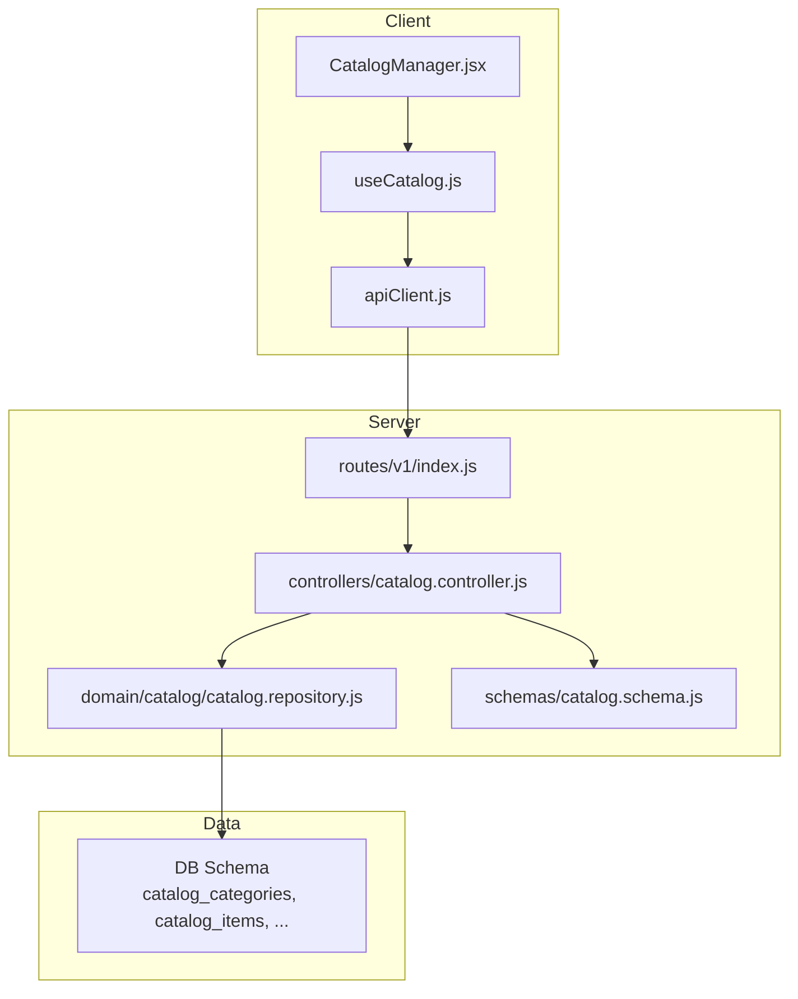

**Diagram sources**
- [CatalogManager.jsx:1-216](file://client/src/components/CatalogManager.jsx#L1-L216)
- [useCatalog.js:1-105](file://client/src/hooks/useCatalog.js#L1-L105)
- [apiClient.js:68-127](file://client/src/services/apiClient.js#L68-L127)
- [v1/index.js:27-33](file://server/src/routes/v1/index.js#L27-L33)
- [catalog.controller.js:21-39](file://server/src/controllers/catalog.controller.js#L21-L39)
- [catalog.repository.js:9-46](file://server/src/domain/catalog/catalog.repository.js#L9-L46)
- [001_initial_multitenant_schema.sql:61-89](file://server/src/db/migrations/001_initial_multitenant_schema.sql#L61-L89)

**Section sources**
- [CatalogManager.jsx:1-216](file://client/src/components/CatalogManager.jsx#L1-L216)
- [useCatalog.js:1-105](file://client/src/hooks/useCatalog.js#L1-L105)
- [apiClient.js:68-127](file://client/src/services/apiClient.js#L68-L127)
- [v1/index.js:27-33](file://server/src/routes/v1/index.js#L27-L33)
- [catalog.controller.js:21-39](file://server/src/controllers/catalog.controller.js#L21-L39)
- [catalog.repository.js:9-46](file://server/src/domain/catalog/catalog.repository.js#L9-L46)
- [001_initial_multitenant_schema.sql:61-89](file://server/src/db/migrations/001_initial_multitenant_schema.sql#L61-L89)

## Core Components
- CatalogManager (React): Provides a UI to add menu items, search/filter by name (English/Tamil) and dietary tags, browse categories, and refresh catalog data.
- useCatalog (Hook): Manages state for items, categories, filters, loading, and error; fetches data from /api/catalog and /api/categories; supports adding items and refreshing.
- apiClient: Centralized HTTP client with automatic token refresh and normalized path handling for /api/* endpoints.
- Server Routes: Expose GET /api/catalog, GET /api/categories, and POST /api/catalog (protected).
- Controller: Resolves tenant context, validates input, delegates to repository, and returns JSON responses.
- Repository: Enforces multi-tenant scoping, queries active items and categories, parses STT hints, and creates new items.
- Schema: Validates incoming item creation payloads using Zod.

Key responsibilities:
- Data synchronization: Hook fetches and updates local state; UI re-renders accordingly.
- Filtering and search: Client-side filtering across names, Tamil names, and STT hints; category and dietary tag filters.
- Validation: Server-side Zod schema ensures safe inputs; client performs basic formatting before submission.
- Security: Tenant isolation enforced at controller/repository layers; protected mutation endpoint requires manager/admin role.

**Section sources**
- [CatalogManager.jsx:5-158](file://client/src/components/CatalogManager.jsx#L5-L158)
- [useCatalog.js:14-101](file://client/src/hooks/useCatalog.js#L14-L101)
- [apiClient.js:68-127](file://client/src/services/apiClient.js#L68-L127)
- [v1/index.js:27-33](file://server/src/routes/v1/index.js#L27-L33)
- [catalog.controller.js:10-82](file://server/src/controllers/catalog.controller.js#L10-L82)
- [catalog.repository.js:9-108](file://server/src/domain/catalog/catalog.repository.js#L9-L108)
- [catalog.schema.js:1-16](file://server/src/schemas/catalog.schema.js#L1-L16)

## Architecture Overview
The flow begins with the CatalogManager UI invoking the useCatalog hook to load catalog items and categories. The hook uses apiClient to call public endpoints for reading and a protected endpoint for creating items. On the server, routes enforce rate limiting and roles where needed, controllers resolve tenant context, and repositories perform strict multi-tenant queries and writes.

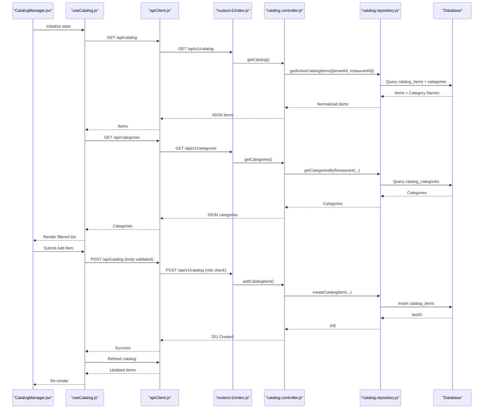

**Diagram sources**
- [useCatalog.js:23-56](file://client/src/hooks/useCatalog.js#L23-L56)
- [apiClient.js:68-127](file://client/src/services/apiClient.js#L68-L127)
- [v1/index.js:27-33](file://server/src/routes/v1/index.js#L27-L33)
- [catalog.controller.js:21-82](file://server/src/controllers/catalog.controller.js#L21-L82)
- [catalog.repository.js:23-108](file://server/src/domain/catalog/catalog.repository.js#L23-L108)

## Detailed Component Analysis

### CatalogManager Component
- Responsibilities:
  - Display header with refresh and add actions
  - Search bar for English/Tamil names and keywords
  - Dietary filter buttons (all, veg, non-veg)
  - Category tabs to filter items
  - Add item form with fields for bilingual names, category, price, dietary tags, STT hints, and special flag
  - Grid rendering of items with category, dietary badge, special badge, and STT hints
- State and interactions:
  - Uses useCatalog to access items, categories, loading, selectedCategory, searchQuery, dietaryFilter, addItem, refreshCatalog
  - Local state toggles add form visibility and holds new item draft
  - On submit, normalizes values (category_id, price, stt_hints array, is_special boolean) and calls addItem
- Error and UX:
  - Loading spinner on refresh
  - Empty state when no items match
  - Form resets after successful add

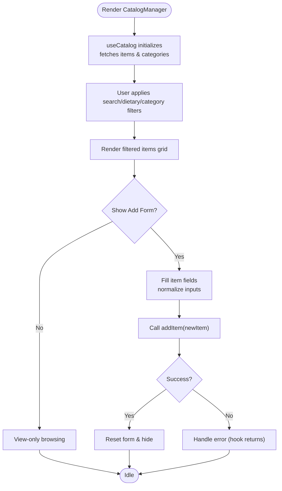

**Diagram sources**
- [CatalogManager.jsx:5-158](file://client/src/components/CatalogManager.jsx#L5-L158)
- [useCatalog.js:45-56](file://client/src/hooks/useCatalog.js#L45-L56)

**Section sources**
- [CatalogManager.jsx:5-216](file://client/src/components/CatalogManager.jsx#L5-L216)

### useCatalog Hook
- Responsibilities:
  - Fetch catalog items and categories concurrently
  - Manage local state for filters and loading
  - Provide addItem and refreshCatalog functions
  - Compute filtered items client-side based on category, dietary, and search query
- Data synchronization:
  - Initial fetch on mount
  - After adding an item, refetches to reflect changes
- Filtering logic:
  - Category match by id or name
  - Dietary filter by exact tag
  - Search matches against English name, Tamil name, and STT hints

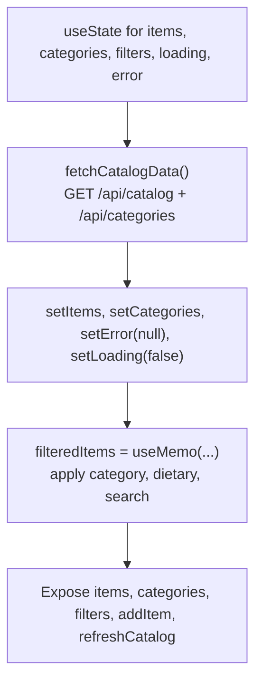

**Diagram sources**
- [useCatalog.js:14-101](file://client/src/hooks/useCatalog.js#L14-L101)

**Section sources**
- [useCatalog.js:14-101](file://client/src/hooks/useCatalog.js#L14-L101)

### API Client
- Responsibilities:
  - Normalize /api/* paths to /api/v1/*
  - Attach Authorization Bearer token if present
  - Handle 401 by refreshing tokens and retrying once
  - Throw errors for non-ok responses
- Role in catalog:
  - Used by useCatalog to call catalog endpoints

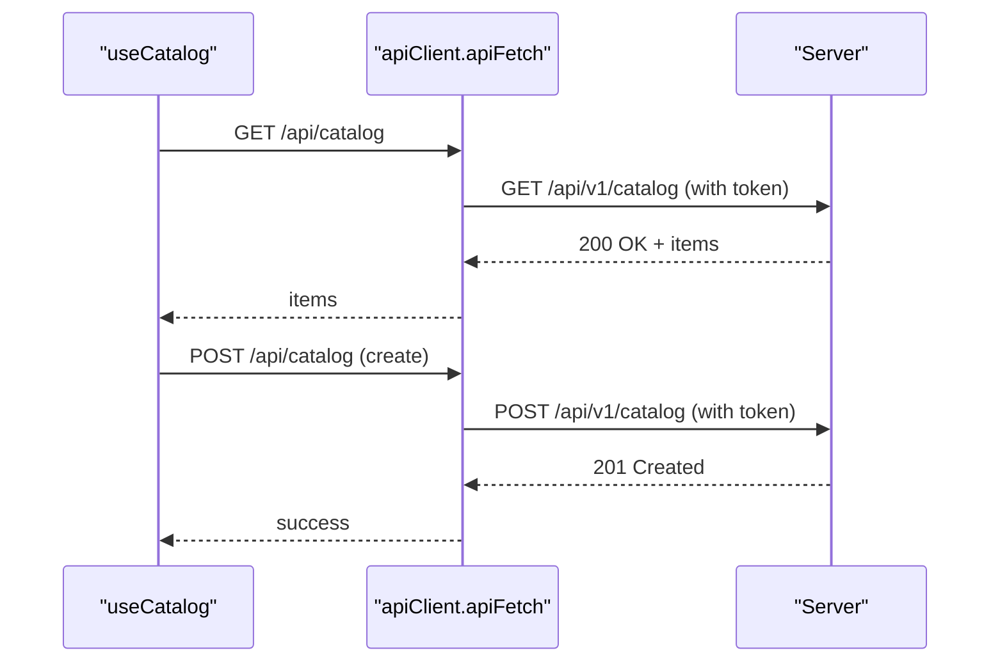

**Diagram sources**
- [apiClient.js:68-127](file://client/src/services/apiClient.js#L68-L127)
- [useCatalog.js:23-56](file://client/src/hooks/useCatalog.js#L23-L56)

**Section sources**
- [apiClient.js:68-127](file://client/src/services/apiClient.js#L68-L127)

### Server Routes and Controllers
- Routes:
  - Public: GET /api/catalog, GET /api/categories, GET /api/merchants (rate limited)
  - Protected: POST /api/catalog (requires RESTAURANT_MANAGER or ADMIN role)
- Controller:
  - Resolves tenant context from auth or headers/query
  - Delegates to repository for reads and writes
  - Returns standardized JSON responses

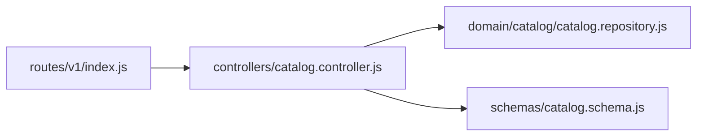

**Diagram sources**
- [v1/index.js:27-33](file://server/src/routes/v1/index.js#L27-L33)
- [catalog.controller.js:21-82](file://server/src/controllers/catalog.controller.js#L21-L82)
- [catalog.schema.js:1-16](file://server/src/schemas/catalog.schema.js#L1-L16)

**Section sources**
- [v1/index.js:27-33](file://server/src/routes/v1/index.js#L27-L33)
- [catalog.controller.js:10-96](file://server/src/controllers/catalog.controller.js#L10-L96)

### Repository and Data Model
- Repository:
  - Enforces tenant isolation for all queries
  - Parses STT hints stored as JSON strings into arrays
  - Creates items with normalized booleans and arrays
- Database model:
  - catalog_categories: id, tenant_id, restaurant_id, name, name_tamil, sort_order, active
  - catalog_items: id, tenant_id, restaurant_id, category_id, sku, name, name_tamil, description, price, available, is_special, dietary_tags, stt_hints, version, timestamps
  - Variants and other entities exist but are not used in current catalog flows

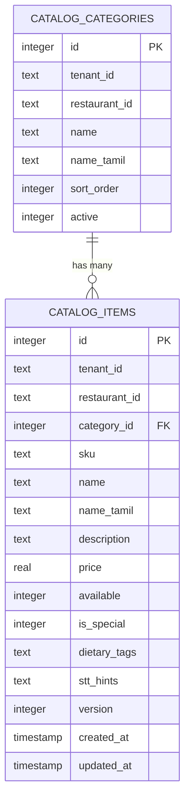

**Diagram sources**
- [001_initial_multitenant_schema.sql:61-89](file://server/src/db/migrations/001_initial_multitenant_schema.sql#L61-L89)

**Section sources**
- [catalog.repository.js:9-108](file://server/src/domain/catalog/catalog.repository.js#L9-L108)
- [001_initial_multitenant_schema.sql:61-89](file://server/src/db/migrations/001_initial_multitenant_schema.sql#L61-L89)

### Form Validation Patterns
- Client-side:
  - Basic required fields and type coercion (e.g., parseInt/parseFloat)
  - STT hints parsed from comma-separated string into array
- Server-side:
  - Zod schema enforces:
    - name length constraints
    - valid category_id
    - price range and numeric coercion
    - boolean flags for availability and special
    - dietary_tags enum
    - stt_hints accepts array or comma-separated string transformation

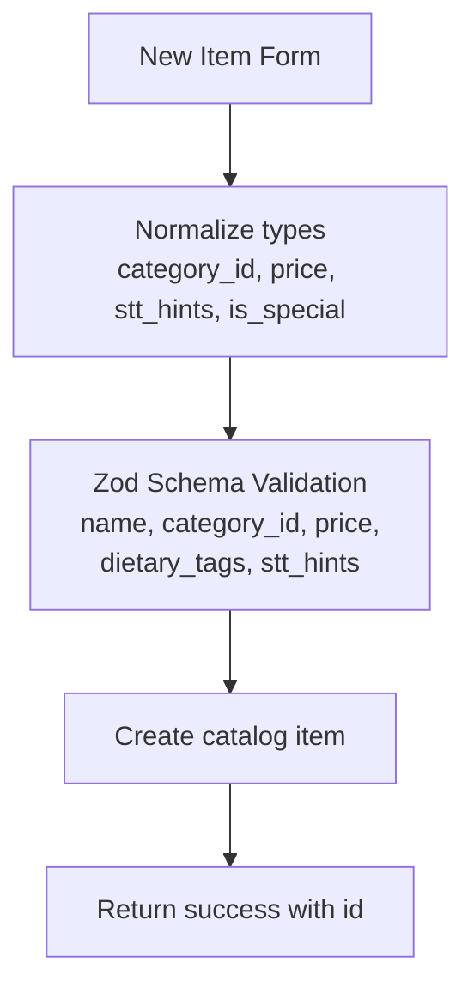

**Diagram sources**
- [CatalogManager.jsx:31-45](file://client/src/components/CatalogManager.jsx#L31-L45)
- [catalog.schema.js:1-16](file://server/src/schemas/catalog.schema.js#L1-L16)
- [catalog.controller.js:41-82](file://server/src/controllers/catalog.controller.js#L41-L82)

**Section sources**
- [CatalogManager.jsx:31-45](file://client/src/components/CatalogManager.jsx#L31-L45)
- [catalog.schema.js:1-16](file://server/src/schemas/catalog.schema.js#L1-L16)
- [catalog.controller.js:41-82](file://server/src/controllers/catalog.controller.js#L41-L82)

### Real-Time Updates
- Current behavior:
  - No WebSocket-based real-time updates for catalog
  - Manual refresh via refreshCatalog triggers re-fetch of items and categories
- Recommendations:
  - Introduce WebSocket events for catalog changes to push updates to clients
  - Use optimistic UI updates with rollback on failure

[No sources needed since this section provides general guidance]

### Image Upload Functionality
- Current status:
  - No image upload endpoints or fields in catalog schema or UI
  - Storage service exists for audio recordings, not images
- Recommendations:
  - Extend catalog schema with image URL field
  - Add upload endpoint and integrate with storage service
  - Update UI to handle image URLs and previews

[No sources needed since this section provides general guidance]

### Bulk Operations
- Current status:
  - No bulk create/update/delete endpoints exposed
- Recommendations:
  - Add batch endpoints for importing items (CSV/JSON)
  - Implement background jobs for large imports
  - Provide progress and error reporting

[No sources needed since this section provides general guidance]

### Inventory Tracking Features
- Current status:
  - Available flag indicates item availability
  - No quantity tracking per se
- Recommendations:
  - Add inventory_quantity field to catalog_items
  - Expose update endpoints for stock levels
  - Integrate with order fulfillment to decrement stock

[No sources needed since this section provides general guidance]

### Search and Filtering Capabilities
- Implemented:
  - Client-side search across English name, Tamil name, and STT hints
  - Category tab filtering by id or name
  - Dietary tag filtering (all, veg, non-veg)
- Performance note:
  - For large catalogs, consider server-side pagination and search indexing

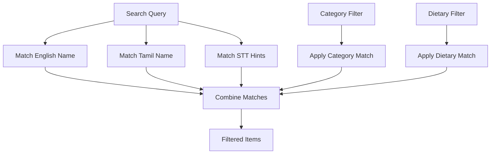

**Diagram sources**
- [useCatalog.js:58-85](file://client/src/hooks/useCatalog.js#L58-L85)

**Section sources**
- [useCatalog.js:58-85](file://client/src/hooks/useCatalog.js#L58-L85)

### Export/Import Functionality
- Current status:
  - No export/import endpoints implemented
- Recommendations:
  - Add CSV/JSON export for categories and items
  - Add import endpoint with validation and conflict resolution
  - Provide templates and sample files

[No sources needed since this section provides general guidance]

### Integration with the Order System
- Catalog usage:
  - Pricing engine caches active catalog items and matches spoken requests to official items
  - Orders store line-item snapshots referencing catalog items and prices at time of order
- Flow highlights:
  - Pricing engine calculates totals deterministically using catalog prices
  - Order repository persists order and item snapshots within transactions
  - Audit logs and outbox events record order lifecycle

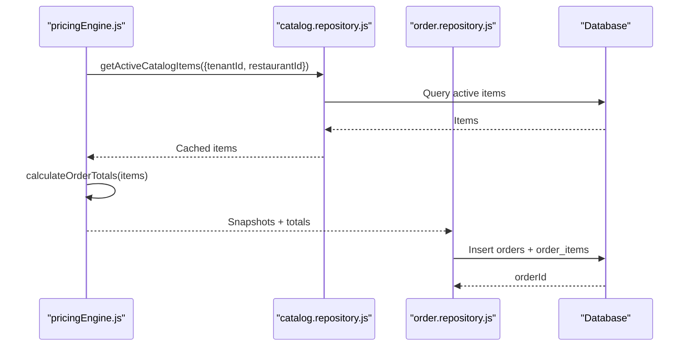

**Diagram sources**
- [pricingEngine.js:16-45](file://server/src/domain/orders/pricingEngine.js#L16-L45)
- [pricingEngine.js:76-117](file://server/src/domain/orders/pricingEngine.js#L76-L117)
- [order.repository.js:24-143](file://server/src/domain/orders/order.repository.js#L24-L143)

**Section sources**
- [pricingEngine.js:16-45](file://server/src/domain/orders/pricingEngine.js#L16-L45)
- [pricingEngine.js:76-117](file://server/src/domain/orders/pricingEngine.js#L76-L117)
- [order.repository.js:24-143](file://server/src/domain/orders/order.repository.js#L24-L143)

## Dependency Analysis
- Client dependencies:
  - CatalogManager depends on useCatalog for state and data fetching
  - useCatalog depends on apiClient for HTTP requests
- Server dependencies:
  - Routes depend on controllers and middleware (auth, RBAC, validation)
  - Controllers depend on repositories and schemas
  - Repositories depend on database layer and throw AppError for invalid contexts
- Data dependencies:
  - Catalog items reference categories via foreign keys
  - Orders reference catalog items via snapshots

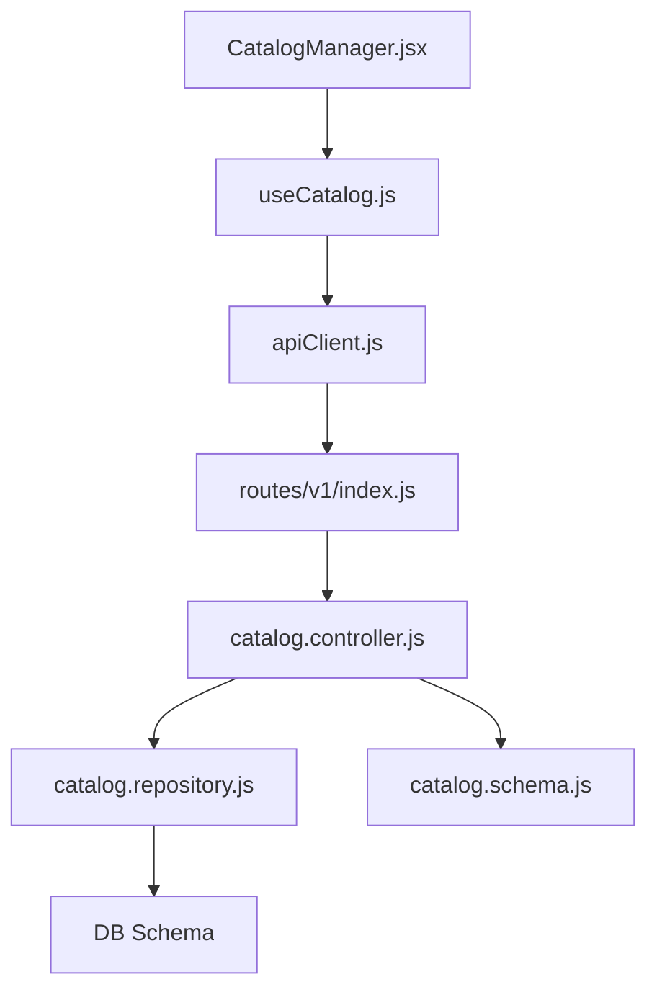

**Diagram sources**
- [CatalogManager.jsx:1-216](file://client/src/components/CatalogManager.jsx#L1-L216)
- [useCatalog.js:1-105](file://client/src/hooks/useCatalog.js#L1-L105)
- [apiClient.js:68-127](file://client/src/services/apiClient.js#L68-L127)
- [v1/index.js:27-33](file://server/src/routes/v1/index.js#L27-L33)
- [catalog.controller.js:21-82](file://server/src/controllers/catalog.controller.js#L21-L82)
- [catalog.repository.js:9-108](file://server/src/domain/catalog/catalog.repository.js#L9-L108)
- [catalog.schema.js:1-16](file://server/src/schemas/catalog.schema.js#L1-L16)

**Section sources**
- [v1/index.js:27-33](file://server/src/routes/v1/index.js#L27-L33)
- [catalog.controller.js:21-82](file://server/src/controllers/catalog.controller.js#L21-L82)
- [catalog.repository.js:9-108](file://server/src/domain/catalog/catalog.repository.js#L9-L108)

## Performance Considerations
- Client-side filtering:
  - useMemo computes filtered items efficiently based on current filters
  - For very large catalogs, consider server-side pagination and search
- Caching:
  - Pricing engine caches active catalog items for 60 seconds to reduce DB load during order processing
- Network:
  - Concurrent fetch of items and categories reduces round trips
- Recommendations:
  - Add server-side pagination for catalog listing
  - Implement debounced search input
  - Consider server-side filtering/search for scalability
  - Introduce caching layer (e.g., Redis) for frequently accessed catalog data

[No sources needed since this section provides general guidance]

## Troubleshooting Guide
- Common issues:
  - Missing tenant context: Ensure auth or headers provide tenant_id and restaurant_id
  - Validation errors: Check Zod schema constraints for name, category_id, price, dietary_tags, stt_hints
  - Token expiry: apiClient handles 401 by refreshing tokens automatically
- Debugging steps:
  - Verify route registration and role requirements
  - Inspect network requests and responses
  - Check database constraints and indexes for performance

**Section sources**
- [catalog.controller.js:10-19](file://server/src/controllers/catalog.controller.js#L10-L19)
- [catalog.schema.js:1-16](file://server/src/schemas/catalog.schema.js#L1-L16)
- [apiClient.js:89-119](file://client/src/services/apiClient.js#L89-L119)

## Conclusion
The Catalog Management System provides a robust foundation for managing restaurant menus with multi-tenant isolation, strong validation, and clear separation of concerns between client and server. While core CRUD and search/filter features are implemented, enhancements such as real-time updates, image uploads, bulk operations, inventory tracking, and export/import capabilities can further improve usability and scalability. Integrating with the order system through deterministic pricing and snapshotting ensures consistency and auditability.

[No sources needed since this section summarizes without analyzing specific files]

## Appendices

### API Endpoints Summary
- GET /api/catalog: Retrieve active catalog items (public, rate-limited)
- GET /api/categories: Retrieve categories for a restaurant (public, rate-limited)
- POST /api/catalog: Create a catalog item (protected, requires RESTAURANT_MANAGER or ADMIN role)

**Section sources**
- [v1/index.js:27-33](file://server/src/routes/v1/index.js#L27-L33)
- [v1/index.js:131-137](file://server/src/routes/v1/index.js#L131-L137)

### Database Schema Highlights
- catalog_categories: Supports bilingual names and ordering
- catalog_items: Stores bilingual names, pricing, availability, dietary tags, STT hints, and versioning
- order_items: Snapshot of ordered items with unit price and line total

**Section sources**
- [001_initial_multitenant_schema.sql:61-89](file://server/src/db/migrations/001_initial_multitenant_schema.sql#L61-L89)
- [001_initial_multitenant_schema.sql:173-210](file://server/src/db/migrations/001_initial_multitenant_schema.sql#L173-L210)