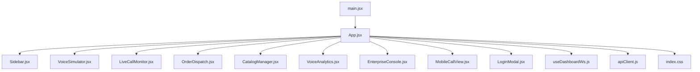
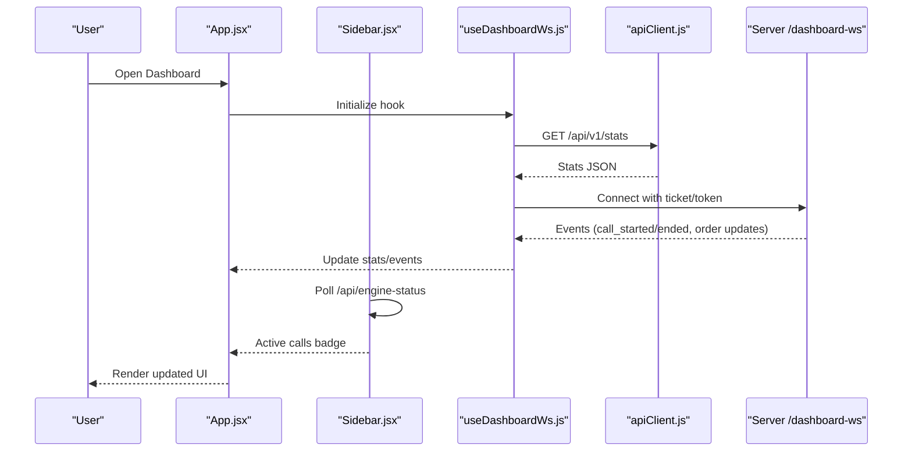
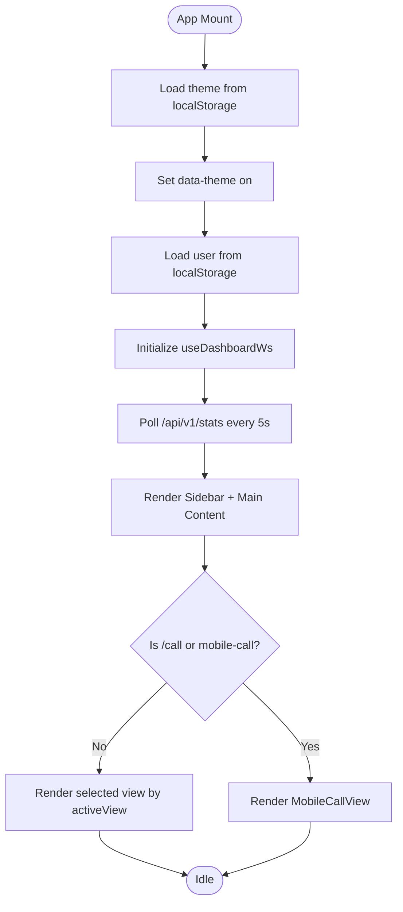
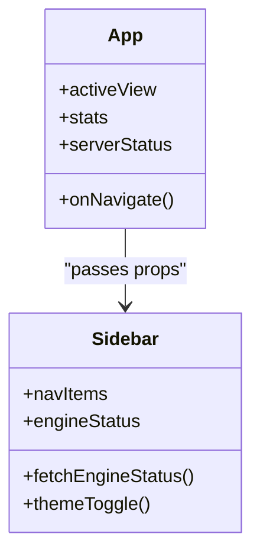
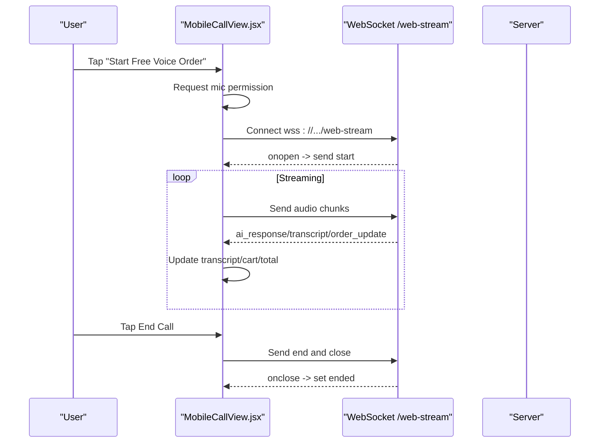
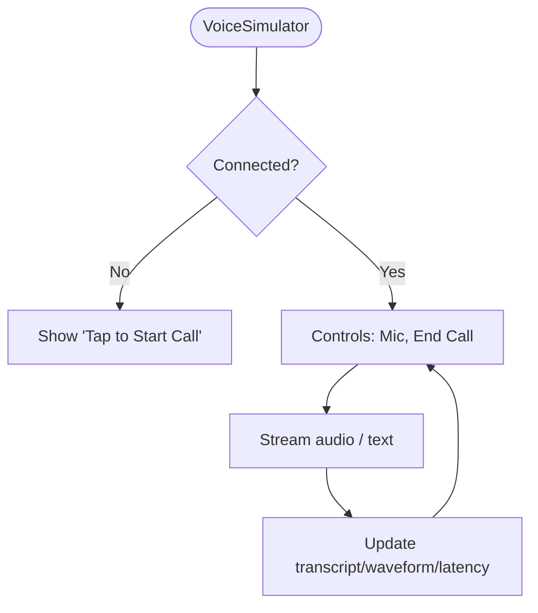
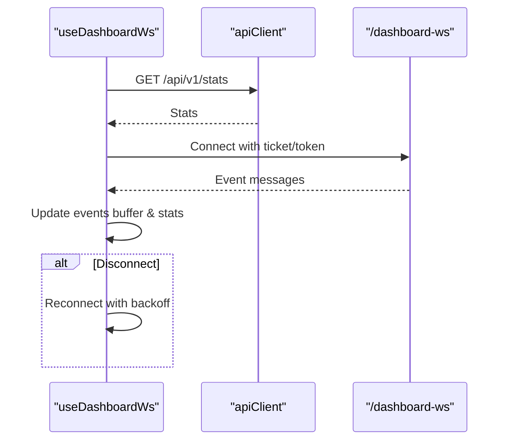
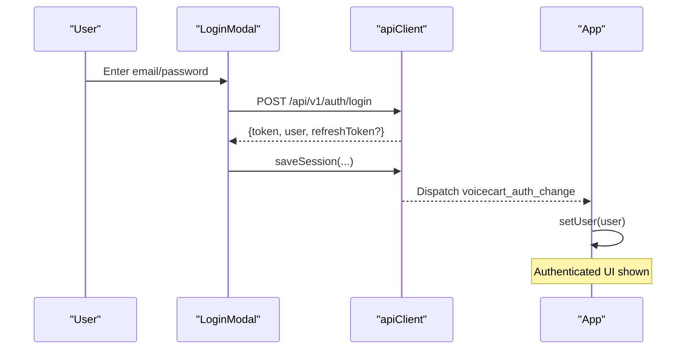
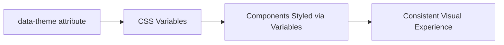
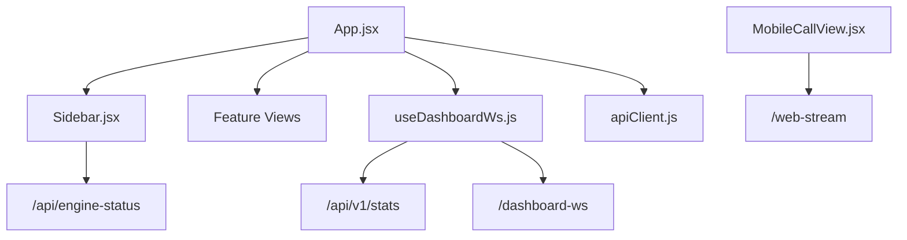

# Dashboard Architecture & Layout

<cite>
**Referenced Files in This Document**
- [App.jsx](file://client/src/App.jsx)
- [Sidebar.jsx](file://client/src/components/Sidebar.jsx)
- [MobileCallView.jsx](file://client/src/components/MobileCallView.jsx)
- [VoiceSimulator.jsx](file://client/src/components/VoiceSimulator.jsx)
- [useDashboardWs.js](file://client/src/hooks/useDashboardWs.js)
- [apiClient.js](file://client/src/services/apiClient.js)
- [LoginModal.jsx](file://client/src/components/LoginModal.jsx)
- [index.css](file://client/src/index.css)
- [main.jsx](file://client/src/main.jsx)
</cite>

## Table of Contents
1. [Introduction](#introduction)
2. [Project Structure](#project-structure)
3. [Core Components](#core-components)
4. [Architecture Overview](#architecture-overview)
5. [Detailed Component Analysis](#detailed-component-analysis)
6. [Dependency Analysis](#dependency-analysis)
7. [Performance Considerations](#performance-considerations)
8. [Troubleshooting Guide](#troubleshooting-guide)
9. [Conclusion](#conclusion)

## Introduction
This document explains the React dashboard architecture and layout system for the VoiceCart AI application. It covers the main App component structure, state management with hooks, theme switching with persistence, authentication flow, sidebar navigation, view routing logic, responsive design patterns, real-time metrics via WebSocket, user session management, and the mobile call view integration. It also documents component composition patterns, styling with CSS variables, and accessibility considerations.

## Project Structure
The client app is a single-page React application bootstrapped by Vite. The root entry renders the App component and global styles. The App orchestrates layout (sidebar + main content), manages local state (active view, theme, user), integrates real-time metrics via a custom hook, and conditionally renders specialized views such as Mobile Call View.

**Diagram sources**
- [main.jsx:1-11](file://client/src/main.jsx#L1-L11)
- [App.jsx:1-161](file://client/src/App.jsx#L1-L161)
- [Sidebar.jsx:1-120](file://client/src/components/Sidebar.jsx#L1-L120)
- [MobileCallView.jsx:1-409](file://client/src/components/MobileCallView.jsx#L1-L409)
- [VoiceSimulator.jsx:1-200](file://client/src/components/VoiceSimulator.jsx#L1-L200)
- [useDashboardWs.js:1-128](file://client/src/hooks/useDashboardWs.js#L1-L128)
- [apiClient.js:1-128](file://client/src/services/apiClient.js#L1-L128)
- [index.css:1-850](file://client/src/index.css#L1-L850)

**Section sources**
- [main.jsx:1-11](file://client/src/main.jsx#L1-L11)
- [App.jsx:1-161](file://client/src/App.jsx#L1-L161)
- [index.css:1-850](file://client/src/index.css#L1-L850)

## Core Components
- App: Root layout controller managing active view, theme, user session, and rendering of stat cards and view-specific components.
- Sidebar: Navigation panel with route items, live badge counts, engine status display, theme toggle, and server connection status.
- MobileCallView: Full-screen mobile call experience with microphone capture, WebSocket streaming, transcript, cart preview, and call controls.
- VoiceSimulator: Interactive voice call simulator with transcript, waveform visualization, latency meters, and quick test prompts.
- useDashboardWs: Custom hook that connects to the dashboard WebSocket, maintains stats, buffers events, and auto-reconnects.
- apiClient: Centralized HTTP client with token/refresh handling, automatic retry on 401, and WS ticket acquisition.
- LoginModal: Staff authentication UI with role-based quick login options and error handling.

Key responsibilities and interactions are detailed in subsequent sections.

**Section sources**
- [App.jsx:15-161](file://client/src/App.jsx#L15-L161)
- [Sidebar.jsx:13-120](file://client/src/components/Sidebar.jsx#L13-L120)
- [MobileCallView.jsx:4-409](file://client/src/components/MobileCallView.jsx#L4-L409)
- [VoiceSimulator.jsx:5-200](file://client/src/components/VoiceSimulator.jsx#L5-L200)
- [useDashboardWs.js:14-128](file://client/src/hooks/useDashboardWs.js#L14-L128)
- [apiClient.js:9-128](file://client/src/services/apiClient.js#L9-L128)
- [LoginModal.jsx:5-138](file://client/src/components/LoginModal.jsx#L5-L138)

## Architecture Overview
The dashboard uses a top-down composition model:
- App holds global UI state and delegates rendering to child components.
- Sidebar provides navigation and contextual info; it polls engine status and displays live call count badges.
- Real-time metrics and events come from useDashboardWs, which manages a WebSocket connection and periodic stats polling.
- Authentication is handled centrally via apiClient and reflected across the app through a custom window event.
- Theme is persisted in localStorage and applied to the document root via a data attribute.

**Diagram sources**
- [App.jsx:15-161](file://client/src/App.jsx#L15-L161)
- [Sidebar.jsx:19-31](file://client/src/components/Sidebar.jsx#L19-L31)
- [useDashboardWs.js:29-128](file://client/src/hooks/useDashboardWs.js#L29-L128)
- [apiClient.js:68-128](file://client/src/services/apiClient.js#L68-L128)

## Detailed Component Analysis

### App Component: Layout, State, Routing, and Metrics
- Layout: Renders a fixed sidebar and a scrollable main content area. Conditionally switches to MobileCallView when navigating to /call or selecting mobile-call view.
- State:
  - activeView: Controls which feature view is rendered (simulator, calls, orders, catalog, analytics, enterprise).
  - theme: Synced to document.documentElement data-theme and persisted in localStorage.
  - user: Loaded from localStorage and updated on auth change events.
  - isLoginModalOpen: Toggles staff login modal.
- Real-time metrics: Uses useDashboardWs to fetch initial stats and listen for events that adjust active calls and trigger stats refresh.
- Stat cards: Dynamically generated from stats object, including revenue formatting and live indicators.
- Authentication UI: Shows sign-in button or signed-in user chip with logout action.

**Diagram sources**
- [App.jsx:15-161](file://client/src/App.jsx#L15-L161)
- [useDashboardWs.js:29-43](file://client/src/hooks/useDashboardWs.js#L29-L43)

**Section sources**
- [App.jsx:15-161](file://client/src/App.jsx#L15-L161)

### Sidebar Navigation System
- Navigation items: Array-driven list with icons and labels; active item highlighted with inset neumorphic style.
- Live badge: Displays active call count when > 0.
- Engine status card: Periodically fetches /api/engine-status to show current LLM, STT, and TTS providers.
- Theme toggle: Switches between dark/light themes and persists selection.
- Server status: Reflects WebSocket connectivity from useDashboardWs.

**Diagram sources**
- [Sidebar.jsx:4-120](file://client/src/components/Sidebar.jsx#L4-L120)
- [App.jsx:62-69](file://client/src/App.jsx#L62-L69)

**Section sources**
- [Sidebar.jsx:4-120](file://client/src/components/Sidebar.jsx#L4-L120)

### Mobile Call View Integration
- Call lifecycle: idle → calling → connected → ended, with timer and visual feedback.
- Media capture: Uses MediaRecorder to stream audio chunks over WebSocket to /web-stream.
- Audio playback: Attempts WebAudio decode; falls back to SpeechSynthesis if needed.
- Transcript and cart: Updates transcript bubbles and live sub-cart based on messages.
- Error handling: Graceful fallbacks on media permission errors and WebSocket issues.

**Diagram sources**
- [MobileCallView.jsx:36-185](file://client/src/components/MobileCallView.jsx#L36-L185)

**Section sources**
- [MobileCallView.jsx:4-409](file://client/src/components/MobileCallView.jsx#L4-L409)

### Voice Simulator Component
- Provides an interactive environment to test voice ordering flows.
- Integrates with useVoiceSimulator hook for call control, transcript, waveform, and latency metrics.
- Offers quick prompt buttons to simulate common ordering intents.

**Diagram sources**
- [VoiceSimulator.jsx:5-200](file://client/src/components/VoiceSimulator.jsx#L5-L200)

**Section sources**
- [VoiceSimulator.jsx:5-200](file://client/src/components/VoiceSimulator.jsx#L5-L200)

### Real-Time Metrics and WebSocket Coordination
- useDashboardWs:
  - Polls /api/v1/stats every 5 seconds to keep metrics fresh.
  - Establishes a WebSocket to /dashboard-ws using either a one-time ticket or access token.
  - Buffers recent events and adjusts active_calls on call_started/call_ended.
  - Implements exponential backoff reconnection on disconnect.
  - Exposes sendEvent for outbound events and refreshStats for manual refresh.

**Diagram sources**
- [useDashboardWs.js:29-128](file://client/src/hooks/useDashboardWs.js#L29-L128)

**Section sources**
- [useDashboardWs.js:14-128](file://client/src/hooks/useDashboardWs.js#L14-L128)

### Authentication Flow and Session Management
- apiClient:
  - Stores tokens and user in localStorage under dedicated keys.
  - Adds Authorization header to requests and normalizes paths to /api/v1/.
  - On 401, attempts refresh using stored refresh token; retries original request with new token or clears session on failure.
  - Provides getWsTicket to acquire a one-time WebSocket ticket.
- LoginModal:
  - Submits credentials to /api/v1/auth/login.
  - On success, saves session and triggers a window event to propagate auth changes.
- App:
  - Listens for voicecart_auth_change to update user state.
  - Provides logout by clearing session and resetting user.

**Diagram sources**
- [LoginModal.jsx:18-32](file://client/src/components/LoginModal.jsx#L18-L32)
- [apiClient.js:26-56](file://client/src/services/apiClient.js#L26-L56)
- [App.jsx:29-41](file://client/src/App.jsx#L29-L41)

**Section sources**
- [apiClient.js:9-128](file://client/src/services/apiClient.js#L9-L128)
- [LoginModal.jsx:5-138](file://client/src/components/LoginModal.jsx#L5-L138)
- [App.jsx:29-41](file://client/src/App.jsx#L29-L41)

### Styling Approach with CSS Variables and Responsive Design
- Theme system:
  - Dark mode is default; light mode is activated by setting data-theme="light" on the document root.
  - CSS variables define surfaces, shadows, text colors, accents, gradients, borders, radii, and fonts.
- Layout:
  - Fixed sidebar with width variable; main content margin accounts for sidebar width.
  - Stats grid adapts columns at breakpoints for responsiveness.
- Neumorphism:
  - Consistent soft extrusion and inset shadows across components for depth and tactile feel.
- Accessibility:
  - Semantic HTML elements used throughout.
  - Buttons have accessible labels via titles or visible text.
  - Color contrast follows theme variables; ensure sufficient contrast in both modes.

**Diagram sources**
- [index.css:14-115](file://client/src/index.css#L14-L115)
- [App.jsx:23-27](file://client/src/App.jsx#L23-L27)

**Section sources**
- [index.css:14-115](file://client/src/index.css#L14-L115)
- [index.css:142-153](file://client/src/index.css#L142-L153)
- [index.css:406-415](file://client/src/index.css#L406-L415)

## Dependency Analysis
- App depends on:
  - Sidebar for navigation and contextual info.
  - Feature components for each view.
  - useDashboardWs for real-time metrics and events.
  - apiClient for session and network operations.
  - index.css for theming and layout.
- Sidebar depends on:
  - Network endpoint /api/engine-status for pipeline status.
  - Props from App for active view and theme toggling.
- MobileCallView depends on:
  - Browser APIs (MediaRecorder, AudioContext, WebSocket).
  - Server endpoints /web-stream for streaming.
- useDashboardWs depends on:
  - apiClient for stats and WS ticket retrieval.
  - WebSocket protocol negotiation based on current location protocol.

**Diagram sources**
- [App.jsx:15-161](file://client/src/App.jsx#L15-L161)
- [Sidebar.jsx:19-31](file://client/src/components/Sidebar.jsx#L19-L31)
- [useDashboardWs.js:29-128](file://client/src/hooks/useDashboardWs.js#L29-L128)
- [MobileCallView.jsx:36-185](file://client/src/components/MobileCallView.jsx#L36-L185)

**Section sources**
- [App.jsx:15-161](file://client/src/App.jsx#L15-L161)
- [Sidebar.jsx:19-31](file://client/src/components/Sidebar.jsx#L19-L31)
- [useDashboardWs.js:29-128](file://client/src/hooks/useDashboardWs.js#L29-L128)
- [MobileCallView.jsx:36-185](file://client/src/components/MobileCallView.jsx#L36-L185)

## Performance Considerations
- WebSocket efficiency:
  - useDashboardWs buffers events to a limited size to avoid memory growth.
  - Exponential backoff reduces reconnect storms during outages.
- Stats polling:
  - Periodic fetch of /api/v1 stats balances freshness with network load.
- Audio streaming:
  - MobileCallView sends small audio chunks at intervals to reduce bandwidth usage.
  - Falls back to SpeechSynthesis if WebAudio decoding fails, improving reliability on constrained devices.
- Rendering:
  - Conditional rendering avoids unnecessary work when not in mobile-call mode.
  - CSS variables enable fast theme switching without heavy reflows.

[No sources needed since this section provides general guidance]

## Troubleshooting Guide
- No audio or microphone access:
  - Ensure browser permissions allow microphone capture; check console for permission errors.
  - Verify MediaRecorder initialization and stream availability.
- WebSocket connection failures:
  - Confirm correct protocol (ws vs wss) based on page URL scheme.
  - Check server reachability and firewall rules.
  - Review reconnection logs and backoff behavior.
- Authentication issues:
  - If receiving 401, verify refresh token presence and validity.
  - Clear session and re-authenticate if token rotation fails.
- Theme not persisting:
  - Ensure localStorage is available and not blocked by privacy settings.
  - Confirm data-theme attribute is set on document root.

**Section sources**
- [MobileCallView.jsx:36-136](file://client/src/components/MobileCallView.jsx#L36-L136)
- [useDashboardWs.js:45-109](file://client/src/hooks/useDashboardWs.js#L45-L109)
- [apiClient.js:89-128](file://client/src/services/apiClient.js#L89-L128)
- [App.jsx:23-41](file://client/src/App.jsx#L23-L41)

## Conclusion
The dashboard combines a clean, themeable layout with robust real-time features and secure authentication. The App component orchestrates state and routing, while Sidebar and MobileCallView provide focused experiences for navigation and live calls. The useDashboardWs hook centralizes WebSocket coordination and metrics synchronization, and apiClient ensures resilient networking with token refresh. CSS variables deliver a consistent neumorphic design across themes, and responsive utilities adapt the interface to different screen sizes. Together, these patterns create a scalable, maintainable, and user-friendly dashboard for VoiceCart AI operations.

[No sources needed since this section summarizes without analyzing specific files]