# Enterprise Console

<cite>
**Referenced Files in This Document**
- [EnterpriseConsole.jsx](file://client/src/components/EnterpriseConsole.jsx)
- [LoginModal.jsx](file://client/src/components/LoginModal.jsx)
- [apiClient.js](file://client/src/services/apiClient.js)
- [auth.controller.js](file://server/src/controllers/auth.controller.js)
- [enterprise.controller.js](file://server/src/controllers/enterprise.controller.js)
- [auth.service.js](file://server/src/services/auth.service.js)
- [audit.service.js](file://server/src/services/audit.service.js)
- [backup.service.js](file://server/src/services/backup.service.js)
- [outbox.service.js](file://server/src/services/outbox.service.js)
- [featureFlag.service.js](file://server/src/services/featureFlag.service.js)
- [sloTracker.js](file://server/src/services/sloTracker.js)
- [auth.middleware.js](file://server/src/middleware/auth.middleware.js)
- [rbac.middleware.js](file://server/src/middleware/rbac.middleware.js)
- [auth.routes.js](file://server/src/routes/auth.routes.js)
</cite>

## Table of Contents
1. Introduction
2. Project Structure
3. Core Components
4. Architecture Overview
5. Detailed Component Analysis
6. Dependency Analysis
7. Performance Considerations
8. Troubleshooting Guide
9. Conclusion

## Introduction
This document provides comprehensive documentation for the EnterpriseConsole component and related authentication, security, and enterprise governance features. It covers role-based access control (RBAC), user account management, system configuration via feature flags, audit logging with cryptographic integrity, service level objectives (SLO) monitoring, disaster recovery backups, transactional outbox reliability, multi-tenant scoping, session management, and API key/token handling. The goal is to help administrators understand how to operate the console securely and effectively while ensuring compliance and operational resilience.

## Project Structure
The Enterprise Console is a React frontend that interacts with a Node.js backend exposing REST APIs for authentication, enterprise governance, and observability. Key areas:
- Frontend: EnterpriseConsole.jsx orchestrates UI tabs for feature flags, audit chain verification, outbox inspection, disaster recovery, and SLOs. LoginModal.jsx handles staff authentication flows. apiClient.js manages token persistence, automatic refresh rotation, and secure request handling.
- Backend: Controllers expose endpoints for auth and enterprise operations. Services implement core logic for authentication, auditing, backups, outbox, feature flags, and SLO tracking. Middleware enforces authentication and RBAC. Routes wire controllers to HTTP endpoints.

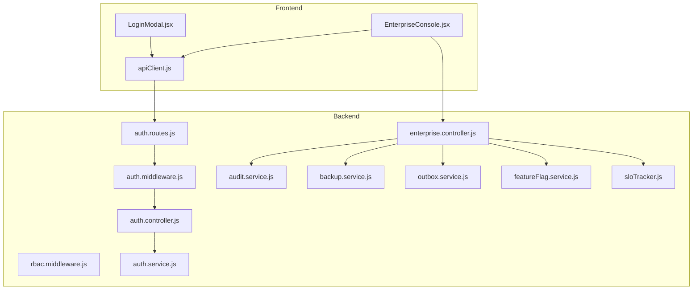

**Diagram sources**
- [EnterpriseConsole.jsx:1-474](file://client/src/components/EnterpriseConsole.jsx#L1-L474)
- [LoginModal.jsx:1-138](file://client/src/components/LoginModal.jsx#L1-L138)
- [apiClient.js:1-128](file://client/src/services/apiClient.js#L1-L128)
- [auth.routes.js:1-13](file://server/src/routes/auth.routes.js#L1-L13)
- [auth.middleware.js:1-55](file://server/src/middleware/auth.middleware.js#L1-L55)
- [auth.controller.js:1-53](file://server/src/controllers/auth.controller.js#L1-L53)
- [enterprise.controller.js:1-93](file://server/src/controllers/enterprise.controller.js#L1-L93)
- [auth.service.js:1-203](file://server/src/services/auth.service.js#L1-L203)
- [audit.service.js:1-142](file://server/src/services/audit.service.js#L1-L142)
- [backup.service.js:1-50](file://server/src/services/backup.service.js#L1-L50)
- [outbox.service.js:1-141](file://server/src/services/outbox.service.js#L1-L141)
- [featureFlag.service.js:1-45](file://server/src/services/featureFlag.service.js#L1-L45)
- [sloTracker.js:1-65](file://server/src/services/sloTracker.js#L1-L65)

**Section sources**
- [EnterpriseConsole.jsx:1-474](file://client/src/components/EnterpriseConsole.jsx#L1-L474)
- [LoginModal.jsx:1-138](file://client/src/components/LoginModal.jsx#L1-L138)
- [apiClient.js:1-128](file://client/src/services/apiClient.js#L1-L128)
- [auth.routes.js:1-13](file://server/src/routes/auth.routes.js#L1-L13)
- [auth.middleware.js:1-55](file://server/src/middleware/auth.middleware.js#L1-L55)
- [auth.controller.js:1-53](file://server/src/controllers/auth.controller.js#L1-L53)
- [enterprise.controller.js:1-93](file://server/src/controllers/enterprise.controller.js#L1-L93)
- [auth.service.js:1-203](file://server/src/services/auth.service.js#L1-L203)
- [audit.service.js:1-142](file://server/src/services/audit.service.js#L1-L142)
- [backup.service.js:1-50](file://server/src/services/backup.service.js#L1-L50)
- [outbox.service.js:1-141](file://server/src/services/outbox.service.js#L1-L141)
- [featureFlag.service.js:1-45](file://server/src/services/featureFlag.service.js#L1-L45)
- [sloTracker.js:1-65](file://server/src/services/sloTracker.js#L1-L65)

## Core Components
- EnterpriseConsole: Central admin dashboard providing tabs for feature flags, audit chain verification, outbox inspection, disaster recovery backups, and SLO observability. It periodically fetches metrics and exposes actions like toggling flags, verifying audit integrity, creating backups, and refreshing data.
- LoginModal: Staff authentication UI with quick-login roles and error handling. On success, it triggers callbacks to update application state and close the modal.
- apiClient: Secure HTTP client with automatic bearer token injection, path normalization, 401 handling, and automatic refresh token rotation. Persists tokens and user context in localStorage and dispatches auth change events.

Key responsibilities:
- Authentication flow: LoginModal calls login() which persists tokens; subsequent requests include Authorization headers.
- Session management: Automatic refresh on 401; clear session on failure.
- Enterprise operations: Feature flag toggles, backup creation, audit verification, outbox inspection, SLO reporting.

**Section sources**
- [EnterpriseConsole.jsx:1-474](file://client/src/components/EnterpriseConsole.jsx#L1-L474)
- [LoginModal.jsx:1-138](file://client/src/components/LoginModal.jsx#L1-L138)
- [apiClient.js:1-128](file://client/src/services/apiClient.js#L1-L128)

## Architecture Overview
The architecture follows a layered approach:
- Presentation layer: React components render dashboards and forms.
- Client services: apiClient encapsulates networking, token lifecycle, and error handling.
- API layer: Express routes map to controllers enforcing authentication and authorization.
- Service layer: Business logic for auth, auditing, backups, outbox, feature flags, and SLOs.
- Data layer: SQLite-backed storage with migrations for tenants, audit logs, outbox events, and feature flags.

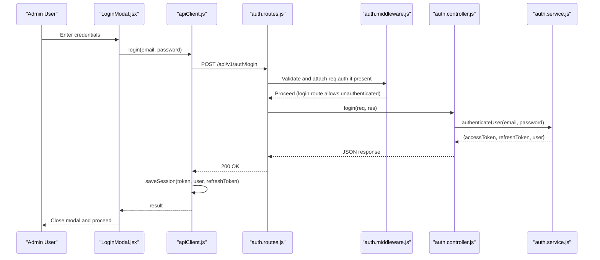

**Diagram sources**
- [LoginModal.jsx:18-32](file://client/src/components/LoginModal.jsx#L18-L32)
- [apiClient.js:42-56](file://client/src/services/apiClient.js#L42-L56)
- [auth.routes.js:9-12](file://server/src/routes/auth.routes.js#L9-L12)
- [auth.middleware.js:10-51](file://server/src/middleware/auth.middleware.js#L10-L51)
- [auth.controller.js:9-17](file://server/src/controllers/auth.controller.js#L9-L17)
- [auth.service.js:166-202](file://server/src/services/auth.service.js#L166-L202)

## Detailed Component Analysis

### EnterpriseConsole: Admin Dashboard and Governance
- Tabs and capabilities:
  - Feature Flags & Controls: List and toggle runtime flags per tenant without redeploying code.
  - Merkle Audit Chain: Verify cryptographic integrity of audit logs using SHA-256 hash chaining.
  - Transactional Outbox: Inspect pending and processing events with retry counts and statuses.
  - Disaster Recovery & Backups: Create point-in-time SQLite snapshots with integrity checks.
  - SLO Observability: View availability, latency, and error rate metrics against targets.
- Data fetching: Periodic polling via setInterval to refresh metrics every 12 seconds.
- Actions:
  - Toggle flags: POST to update feature flags with tenant scoping.
  - Trigger backup: POST to create snapshot and display size/integrity.
  - Verify audit chain: GET to validate Merkle chain and report head hash or tamper location.
  - Refresh outbox: GET to list pending/processing events.

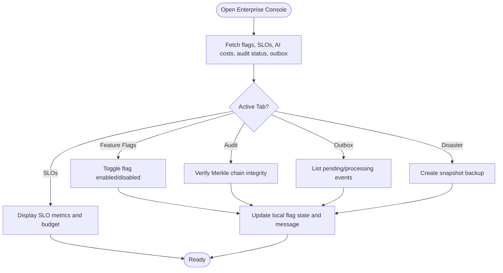

**Diagram sources**
- [EnterpriseConsole.jsx:33-108](file://client/src/components/EnterpriseConsole.jsx#L33-L108)
- [EnterpriseConsole.jsx:198-470](file://client/src/components/EnterpriseConsole.jsx#L198-L470)

**Section sources**
- [EnterpriseConsole.jsx:1-474](file://client/src/components/EnterpriseConsole.jsx#L1-L474)

### LoginModal: Authentication Flow and Security
- Inputs: Email and password fields with validation.
- Quick roles: Pre-fill demo credentials for Admin, Kitchen, Staff roles.
- Submission: Calls login() from apiClient, saves session, and invokes onLoginSuccess callback.
- Error handling: Displays errors inline and prevents further submission during loading.

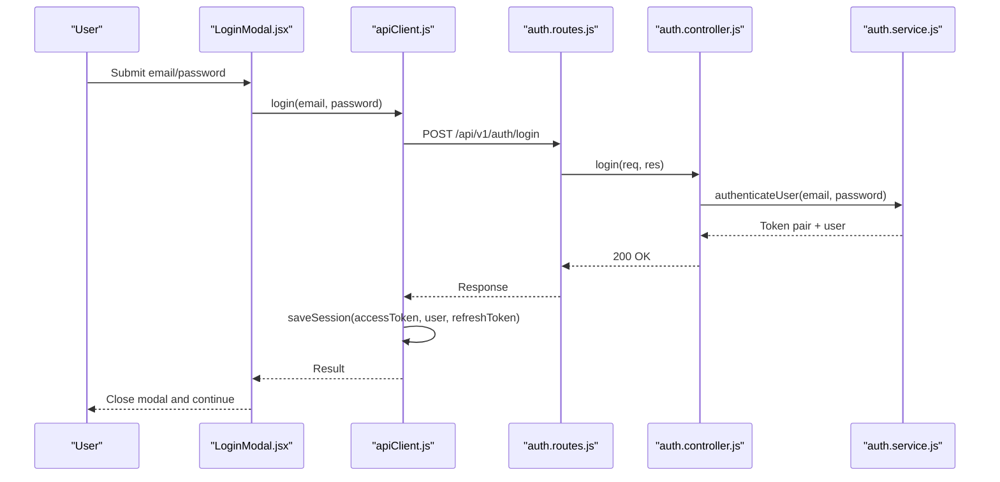

**Diagram sources**
- [LoginModal.jsx:18-32](file://client/src/components/LoginModal.jsx#L18-L32)
- [apiClient.js:42-56](file://client/src/services/apiClient.js#L42-L56)
- [auth.routes.js:9-12](file://server/src/routes/auth.routes.js#L9-L12)
- [auth.controller.js:9-17](file://server/src/controllers/auth.controller.js#L9-L17)
- [auth.service.js:166-202](file://server/src/services/auth.service.js#L166-L202)

**Section sources**
- [LoginModal.jsx:1-138](file://client/src/components/LoginModal.jsx#L1-L138)
- [apiClient.js:42-56](file://client/src/services/apiClient.js#L42-L56)
- [auth.controller.js:9-17](file://server/src/controllers/auth.controller.js#L9-L17)
- [auth.service.js:166-202](file://server/src/services/auth.service.js#L166-L202)

### Role-Based Access Control (RBAC) and Multi-Tenant Scoping
- Roles: ADMIN, RESTAURANT_MANAGER, STAFF, KITCHEN defined in RBAC middleware.
- Guard: requireRole(...allowedRoles) ensures callers have at least one allowed role or are ADMIN.
- Tenant scoping: Enterprise controller enforces tenantId and restaurantId from req.auth for all enterprise endpoints.
- Auth middleware: Parses Bearer token or query parameter, verifies JWT, and attaches identity to req.auth.

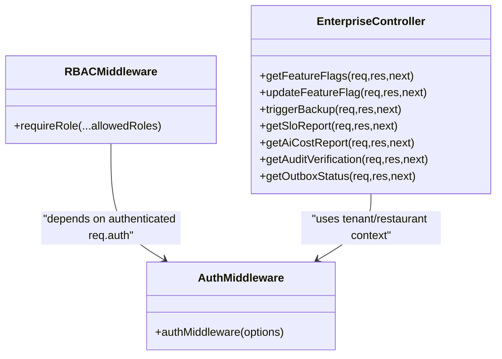

**Diagram sources**
- [rbac.middleware.js:1-32](file://server/src/middleware/rbac.middleware.js#L1-L32)
- [auth.middleware.js:10-51](file://server/src/middleware/auth.middleware.js#L10-L51)
- [enterprise.controller.js:14-93](file://server/src/controllers/enterprise.controller.js#L14-L93)

**Section sources**
- [rbac.middleware.js:1-32](file://server/src/middleware/rbac.middleware.js#L1-L32)
- [auth.middleware.js:10-51](file://server/src/middleware/auth.middleware.js#L10-L51)
- [enterprise.controller.js:14-93](file://server/src/controllers/enterprise.controller.js#L14-L93)

### Audit Logging and Integrity Verification
- Recording: recordAuditLog inserts cryptographically linked blocks with previous_hash and computed hash based on tenant, restaurant, action, resource, and state.
- Verification: verifyAuditChain walks blocks in order, recomputes hashes, and detects mismatches indicating tampering.
- UI integration: EnterpriseConsole tab displays head hash and verification status.

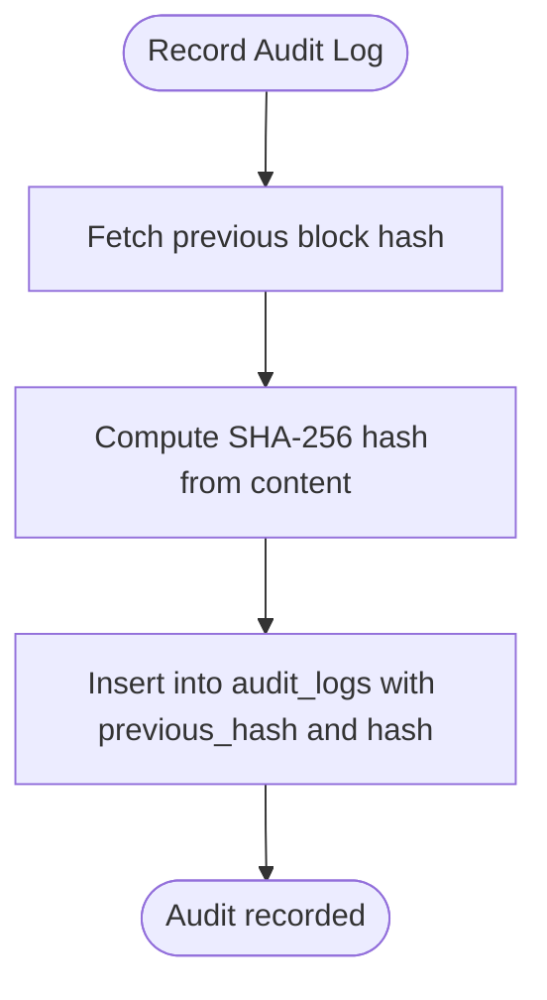

**Diagram sources**
- [audit.service.js:19-77](file://server/src/services/audit.service.js#L19-L77)
- [audit.service.js:96-141](file://server/src/services/audit.service.js#L96-L141)

**Section sources**
- [audit.service.js:1-142](file://server/src/services/audit.service.js#L1-L142)
- [EnterpriseConsole.jsx:297-336](file://client/src/components/EnterpriseConsole.jsx#L297-L336)

### System Health Monitoring and SLOs
- Metrics: getSloMetrics aggregates call stats over last 7 days to compute availability, latency, and error rate.
- Targets: Defines SLO targets for API availability, voice setup time, transcription latency, order creation time, and max error rate.
- UI integration: EnterpriseConsole displays SLO cards with actual values, targets, and status indicators.

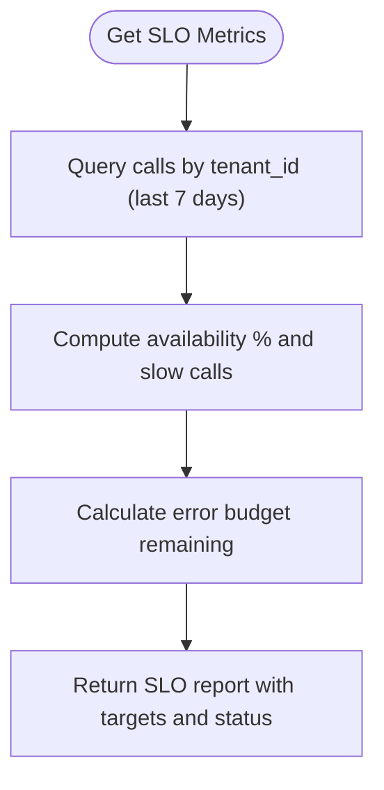

**Diagram sources**
- [sloTracker.js:15-64](file://server/src/services/sloTracker.js#L15-L64)

**Section sources**
- [sloTracker.js:1-65](file://server/src/services/sloTracker.js#L1-L65)
- [EnterpriseConsole.jsx:446-470](file://client/src/components/EnterpriseConsole.jsx#L446-L470)

### Configuration Backup and Restore
- Backup: createDatabaseBackup flushes WAL, performs VACUUM INTO snapshot, runs integrity check, and returns metadata including path, size, and integrity status.
- UI integration: EnterpriseConsole triggers backup and shows results.

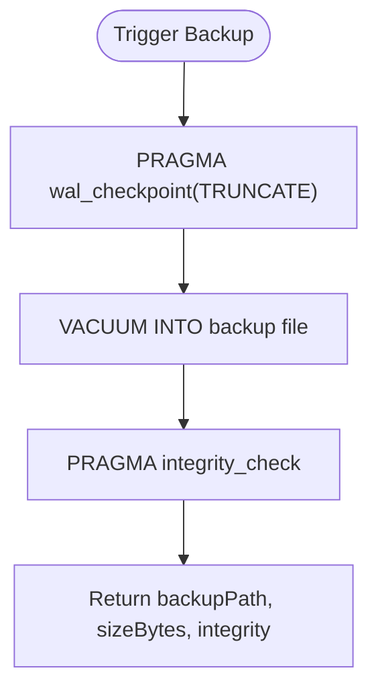

**Diagram sources**
- [backup.service.js:10-49](file://server/src/services/backup.service.js#L10-L49)
- [EnterpriseConsole.jsx:77-89](file://client/src/components/EnterpriseConsole.jsx#L77-L89)

**Section sources**
- [backup.service.js:1-50](file://server/src/services/backup.service.js#L1-L50)
- [EnterpriseConsole.jsx:77-89](file://client/src/components/EnterpriseConsole.jsx#L77-L89)

### Transactional Outbox Reliability
- Enqueue: enqueueOutboxEvent persists events with tenant/restaurant scoping and default pending status.
- Claim: claimNextOutboxEvents atomically marks events as processing with lock and worker ID.
- Recovery: recoverStaleOutboxEvents resets stale processing events older than threshold.
- Completion/Failure: markOutboxEventCompleted sets completed; markOutboxEventFailed increments retries with exponential backoff and schedules next attempt.
- UI integration: EnterpriseConsole lists pending/processing events with retry counts.

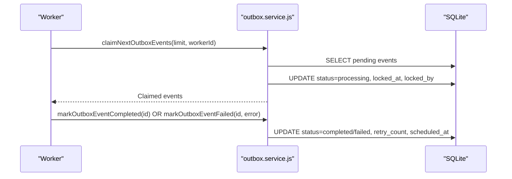

**Diagram sources**
- [outbox.service.js:54-93](file://server/src/services/outbox.service.js#L54-L93)
- [outbox.service.js:110-140](file://server/src/services/outbox.service.js#L110-L140)

**Section sources**
- [outbox.service.js:1-141](file://server/src/services/outbox.service.js#L1-L141)
- [EnterpriseConsole.jsx:338-397](file://client/src/components/EnterpriseConsole.jsx#L338-L397)

### Feature Flag Engine and Dynamic Configuration
- Read: getAllFeatureFlags returns global and tenant-specific flags sorted by key.
- Write: setFeatureFlag upserts flags with description and enabled state.
- UI integration: EnterpriseConsole lists flags and toggles them via POST updates.

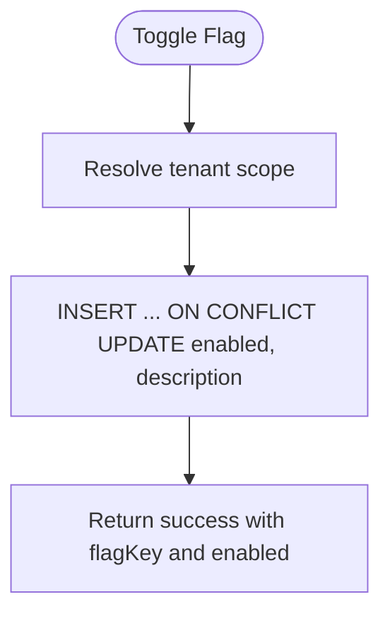

**Diagram sources**
- [featureFlag.service.js:9-44](file://server/src/services/featureFlag.service.js#L9-L44)
- [enterprise.controller.js:25-44](file://server/src/controllers/enterprise.controller.js#L25-L44)
- [EnterpriseConsole.jsx:62-75](file://client/src/components/EnterpriseConsole.jsx#L62-L75)

**Section sources**
- [featureFlag.service.js:1-45](file://server/src/services/featureFlag.service.js#L1-L45)
- [enterprise.controller.js:25-44](file://server/src/controllers/enterprise.controller.js#L25-L44)
- [EnterpriseConsole.jsx:62-75](file://client/src/components/EnterpriseConsole.jsx#L62-L75)

### Session Management and Security Features
- Token generation: generateTokenPair issues short-lived access tokens (15 minutes) and long-lived refresh tokens (7 days) persisted in database ledger.
- Rotation: rotateRefreshToken validates JTI, revokes old token, and issues new pair.
- Client handling: apiClient automatically rotates tokens on 401 and clears session on failure.
- Security: Strong JWT secret enforcement, PBKDF2 hashing with unique salts, timing-safe comparison, and fail-closed persistence for refresh tokens.

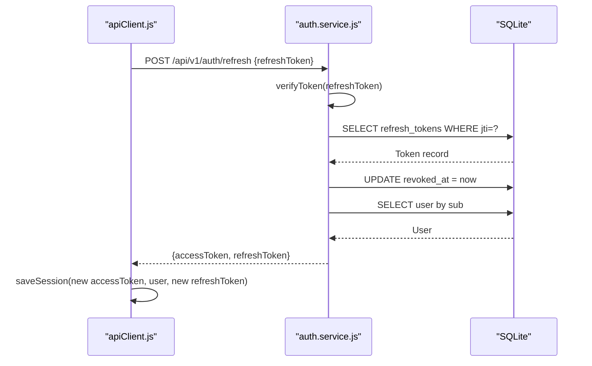

**Diagram sources**
- [auth.service.js:77-161](file://server/src/services/auth.service.js#L77-L161)
- [apiClient.js:89-119](file://client/src/services/apiClient.js#L89-L119)

**Section sources**
- [auth.service.js:7-22](file://server/src/services/auth.service.js#L7-L22)
- [auth.service.js:77-161](file://server/src/services/auth.service.js#L77-L161)
- [apiClient.js:89-119](file://client/src/services/apiClient.js#L89-L119)

## Dependency Analysis
- Frontend dependencies:
  - EnterpriseConsole depends on apiClient for network calls and state updates.
  - LoginModal depends on apiClient for authentication and session persistence.
- Backend dependencies:
  - Controllers depend on services for business logic.
  - Services depend on db module for queries and transactions.
  - Middleware depends on auth.service for token verification and AppError for consistent error handling.
- External integrations:
  - JWT library (jose) for token signing and verification.
  - Crypto module for hashing and integrity checks.
  - Filesystem for backup storage.

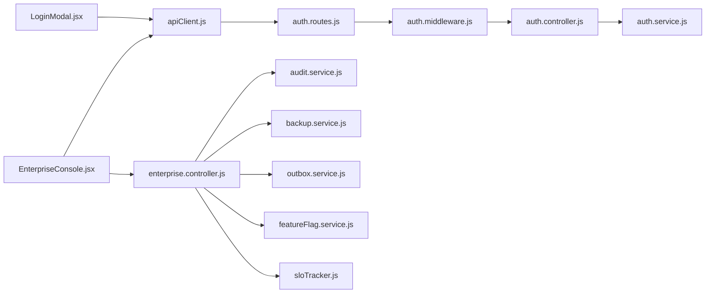

**Diagram sources**
- [EnterpriseConsole.jsx:1-474](file://client/src/components/EnterpriseConsole.jsx#L1-L474)
- [LoginModal.jsx:1-138](file://client/src/components/LoginModal.jsx#L1-L138)
- [apiClient.js:1-128](file://client/src/services/apiClient.js#L1-L128)
- [auth.routes.js:1-13](file://server/src/routes/auth.routes.js#L1-L13)
- [auth.middleware.js:1-55](file://server/src/middleware/auth.middleware.js#L1-L55)
- [auth.controller.js:1-53](file://server/src/controllers/auth.controller.js#L1-L53)
- [enterprise.controller.js:1-93](file://server/src/controllers/enterprise.controller.js#L1-L93)
- [auth.service.js:1-203](file://server/src/services/auth.service.js#L1-L203)
- [audit.service.js:1-142](file://server/src/services/audit.service.js#L1-L142)
- [backup.service.js:1-50](file://server/src/services/backup.service.js#L1-L50)
- [outbox.service.js:1-141](file://server/src/services/outbox.service.js#L1-L141)
- [featureFlag.service.js:1-45](file://server/src/services/featureFlag.service.js#L1-L45)
- [sloTracker.js:1-65](file://server/src/services/sloTracker.js#L1-L65)

**Section sources**
- [EnterpriseConsole.jsx:1-474](file://client/src/components/EnterpriseConsole.jsx#L1-L474)
- [LoginModal.jsx:1-138](file://client/src/components/LoginModal.jsx#L1-L138)
- [apiClient.js:1-128](file://client/src/services/apiClient.js#L1-L128)
- [auth.routes.js:1-13](file://server/src/routes/auth.routes.js#L1-L13)
- [auth.middleware.js:1-55](file://server/src/middleware/auth.middleware.js#L1-L55)
- [auth.controller.js:1-53](file://server/src/controllers/auth.controller.js#L1-L53)
- [enterprise.controller.js:1-93](file://server/src/controllers/enterprise.controller.js#L1-L93)
- [auth.service.js:1-203](file://server/src/services/auth.service.js#L1-L203)
- [audit.service.js:1-142](file://server/src/services/audit.service.js#L1-L142)
- [backup.service.js:1-50](file://server/src/services/backup.service.js#L1-L50)
- [outbox.service.js:1-141](file://server/src/services/outbox.service.js#L1-L141)
- [featureFlag.service.js:1-45](file://server/src/services/featureFlag.service.js#L1-L45)
- [sloTracker.js:1-65](file://server/src/services/sloTracker.js#L1-L65)

## Performance Considerations
- Polling interval: EnterpriseConsole polls every 12 seconds; adjust based on expected update frequency and server load.
- Batch operations: Outbox claiming uses limits to avoid overwhelming workers; tune limit based on throughput needs.
- Database efficiency: SLO metrics aggregate over 7-day windows; ensure indexes on tenant_id and timestamps for performance.
- Backup overhead: WAL checkpoint and VACUUM can be CPU-intensive; schedule backups during low-traffic periods.

[No sources needed since this section provides general guidance]

## Troubleshooting Guide
- Authentication failures:
  - Invalid credentials: Ensure correct email/password and active status; check error messages from authenticateUser.
  - Token expiry: apiClient automatically refreshes; if refresh fails, session is cleared and user must re-authenticate.
- RBAC denials:
  - Forbidden responses indicate insufficient roles; verify user role and required roles for the endpoint.
- Audit chain tampering:
  - Verification failures show brokenAtId and reason; investigate corresponding block for data integrity issues.
- Backup failures:
  - Errors during WAL checkpoint or VACUUM INTO; check filesystem permissions and disk space.
- Outbox stalls:
  - Stale processing events may need recovery; ensure scheduled_at and retry_count are correctly updated.

**Section sources**
- [auth.service.js:166-202](file://server/src/services/auth.service.js#L166-L202)
- [apiClient.js:89-119](file://client/src/services/apiClient.js#L89-L119)
- [rbac.middleware.js:15-28](file://server/src/middleware/rbac.middleware.js#L15-L28)
- [audit.service.js:96-141](file://server/src/services/audit.service.js#L96-L141)
- [backup.service.js:22-49](file://server/src/services/backup.service.js#L22-L49)
- [outbox.service.js:35-49](file://server/src/services/outbox.service.js#L35-L49)

## Conclusion
The EnterpriseConsole provides a robust administrative interface for managing enterprise-grade features including dynamic configuration, audit integrity, disaster recovery, and observability. Combined with strong authentication, RBAC, and multi-tenant scoping, it enables secure and compliant operations. The transactional outbox ensures reliable event delivery, while SLO tracking supports proactive health monitoring. Administrators should leverage these tools to maintain high availability, enforce security policies, and ensure data integrity across tenants and restaurants.

[No sources needed since this section summarizes without analyzing specific files]