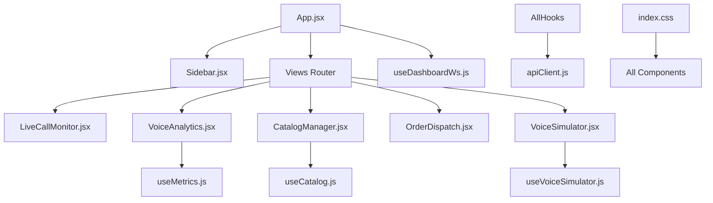
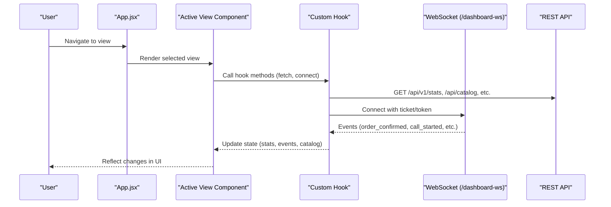
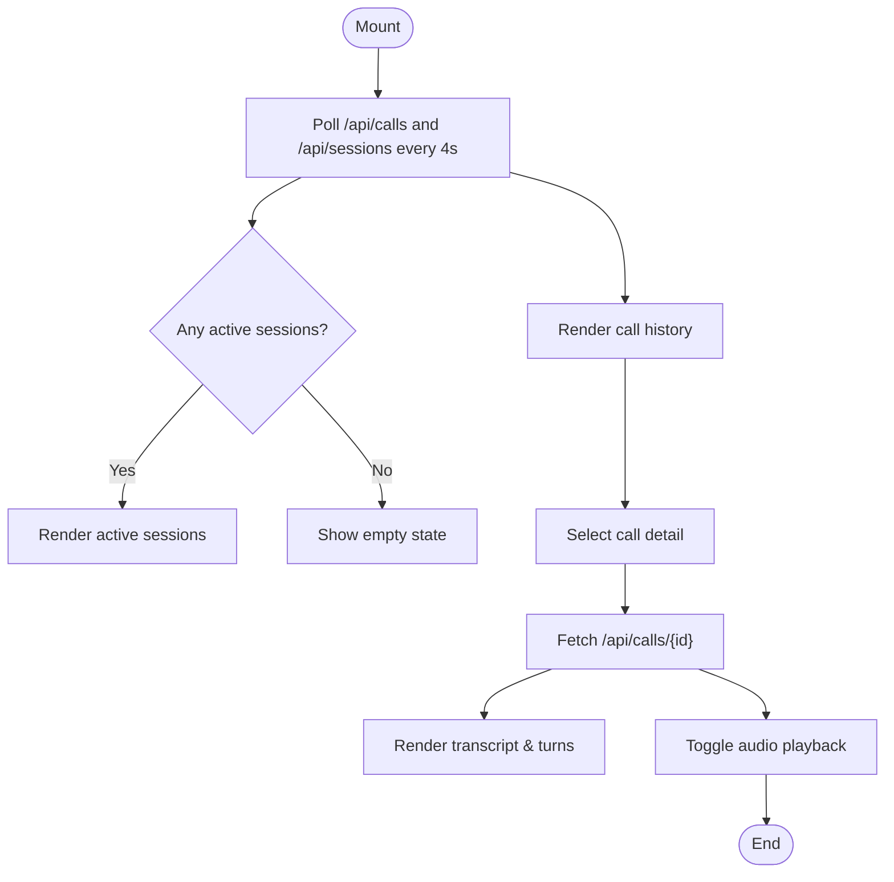
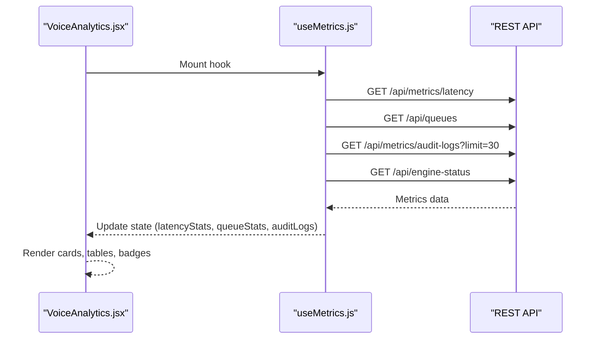
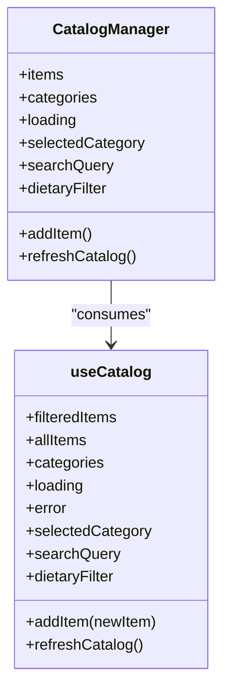
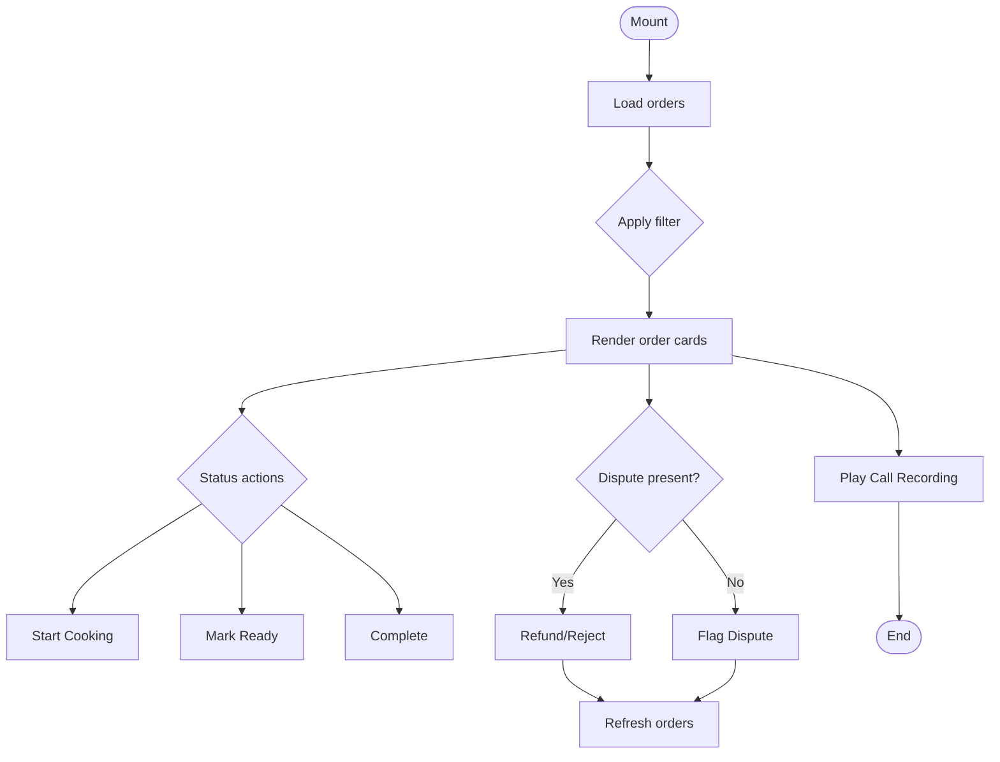
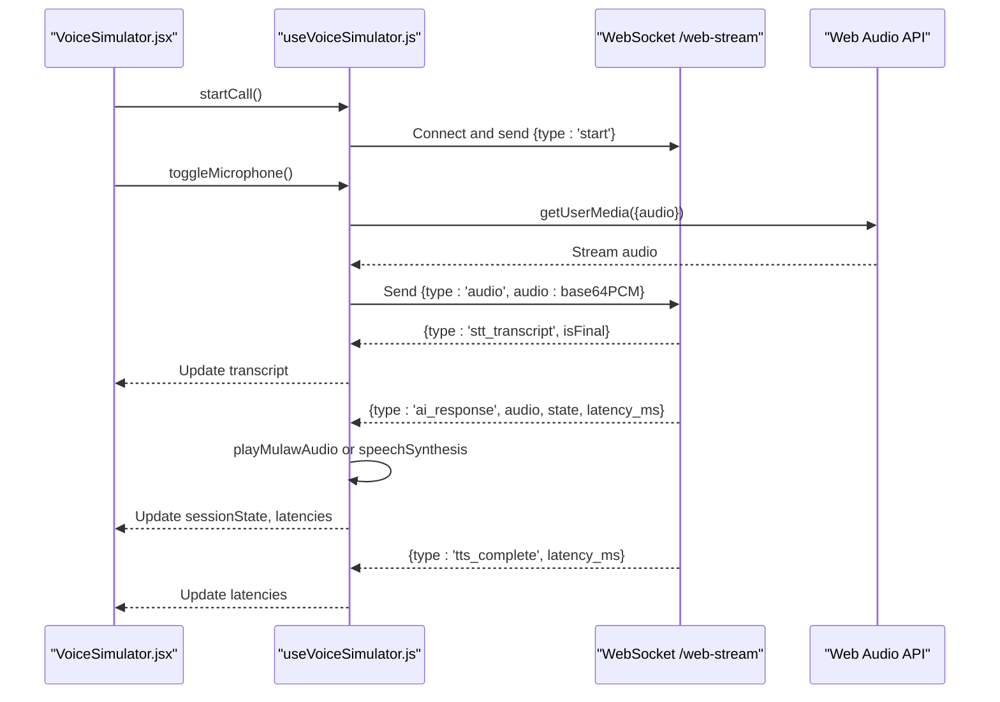
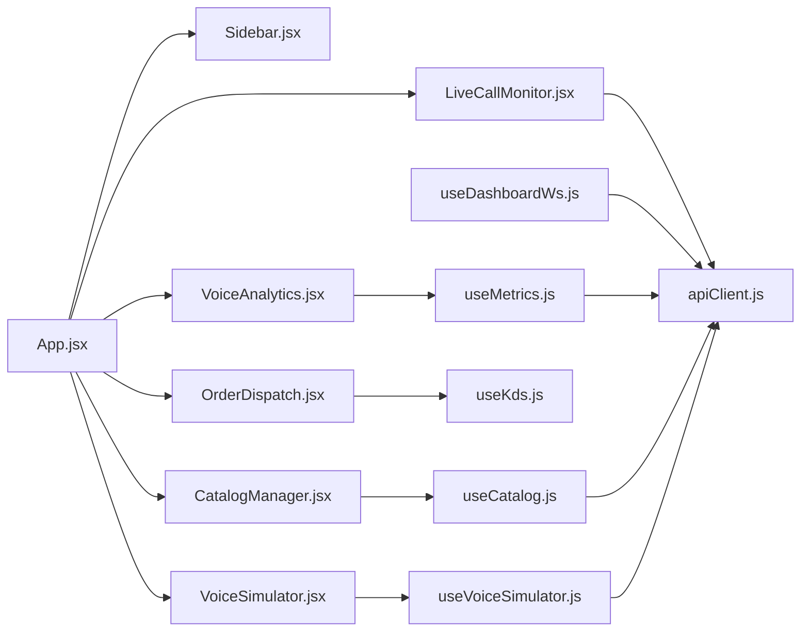

# Frontend Dashboard

<cite>
**Referenced Files in This Document**
- [App.jsx](file://client/src/App.jsx)
- [Sidebar.jsx](file://client/src/components/Sidebar.jsx)
- [LiveCallMonitor.jsx](file://client/src/components/LiveCallMonitor.jsx)
- [VoiceAnalytics.jsx](file://client/src/components/VoiceAnalytics.jsx)
- [CatalogManager.jsx](file://client/src/components/CatalogManager.jsx)
- [OrderDispatch.jsx](file://client/src/components/OrderDispatch.jsx)
- [VoiceSimulator.jsx](file://client/src/components/VoiceSimulator.jsx)
- [useDashboardWs.js](file://client/src/hooks/useDashboardWs.js)
- [useCatalog.js](file://client/src/hooks/useCatalog.js)
- [useMetrics.js](file://client/src/hooks/useMetrics.js)
- [useVoiceSimulator.js](file://client/src/hooks/useVoiceSimulator.js)
- [apiClient.js](file://client/src/services/apiClient.js)
- [index.css](file://client/src/index.css)
- [package.json](file://client/package.json)
</cite>

## Table of Contents
1. [Introduction](#introduction)
2. [Project Structure](#project-structure)
3. [Core Components](#core-components)
4. [Architecture Overview](#architecture-overview)
5. [Detailed Component Analysis](#detailed-component-analysis)
6. [Dependency Analysis](#dependency-analysis)
7. [Performance Considerations](#performance-considerations)
8. [Troubleshooting Guide](#troubleshooting-guide)
9. [Conclusion](#conclusion)
10. [Appendices](#appendices)

## Introduction
This document provides comprehensive documentation for the React-based restaurant management dashboard. It focuses on component architecture, state management with hooks, real-time WebSocket integration, responsive design and accessibility considerations, user interface guidelines, composition patterns, styling approaches, and performance optimization techniques for handling large datasets and live updates.

The dashboard includes:
- LiveCallMonitor for real-time call oversight and audio playback
- VoiceAnalytics for latency profiling, queue health, and audit trails
- CatalogManager for menu administration with search, filtering, and STT hints
- OrderDispatch for kitchen display and order lifecycle management
- VoiceSimulator for voice call simulation and conversation flow
- Sidebar navigation and theme switching
- A robust API client with token refresh and WebSocket ticket acquisition

## Project Structure
The frontend is a Vite + React application organized by feature and layer:
- components: UI modules (LiveCallMonitor, VoiceAnalytics, CatalogManager, OrderDispatch, VoiceSimulator, Sidebar)
- hooks: custom hooks encapsulating data fetching, WebSocket coordination, and business logic
- services: shared API client with authentication and token rotation
- styles: global CSS with neumorphic dual-theme design system
- App entry orchestrates views and global state

**Diagram sources**
- [App.jsx:1-161](file://client/src/App.jsx#L1-L161)
- [Sidebar.jsx:1-120](file://client/src/components/Sidebar.jsx#L1-L120)
- [LiveCallMonitor.jsx:1-210](file://client/src/components/LiveCallMonitor.jsx#L1-L210)
- [VoiceAnalytics.jsx:1-159](file://client/src/components/VoiceAnalytics.jsx#L1-L159)
- [CatalogManager.jsx:1-216](file://client/src/components/CatalogManager.jsx#L1-L216)
- [OrderDispatch.jsx:1-303](file://client/src/components/OrderDispatch.jsx#L1-L303)
- [VoiceSimulator.jsx:1-254](file://client/src/components/VoiceSimulator.jsx#L1-L254)
- [useDashboardWs.js:1-128](file://client/src/hooks/useDashboardWs.js#L1-L128)
- [useCatalog.js:1-105](file://client/src/hooks/useCatalog.js#L1-L105)
- [useMetrics.js:1-73](file://client/src/hooks/useMetrics.js#L1-L73)
- [useVoiceSimulator.js:1-263](file://client/src/hooks/useVoiceSimulator.js#L1-L263)
- [apiClient.js:1-128](file://client/src/services/apiClient.js#L1-L128)
- [index.css:1-850](file://client/src/index.css#L1-L850)

**Section sources**
- [App.jsx:1-161](file://client/src/App.jsx#L1-L161)
- [package.json:1-26](file://client/package.json#L1-L26)

## Core Components
- LiveCallMonitor: Displays active sessions, call history, transcripts, and audio playback; polls /api/calls and /api/sessions periodically.
- VoiceAnalytics: Shows P50/P95 turn latency, per-stage averages (STT/LLM/TTS), background worker queues, and immutable audit logs via metrics endpoints.
- CatalogManager: Multi-tenant menu item CRUD with category tabs, dietary filters, bilingual search, and STT hints; uses useCatalog hook.
- OrderDispatch: Kitchen display with status transitions, group orders, dispute resolution, and audio playback for call recordings.
- VoiceSimulator: Real-time voice call simulation using Web Audio API and WebSocket streaming to /web-stream; shows transcript, interim text, waveform, and session state.
- Sidebar: Navigation, engine status badges, theme toggle, and server connection indicator.

State management patterns:
- Local component state via useState for UI interactions
- Custom hooks centralize data fetching, WebSocket connections, and derived computations
- Global app-level view selection and theme managed in App.jsx
- Authentication state persisted in localStorage and broadcast via custom events

Real-time collaboration:
- useDashboardWs manages authenticated WebSocket to /dashboard-ws with single-use tickets or access tokens, event buffering, auto-reconnect backoff, and live stats synchronization
- useVoiceSimulator streams PCM audio over /web-stream and handles AI responses, audio playback, and latency tracking

Responsive design and accessibility:
- CSS variables define dark/light themes with neumorphic shadows and consistent spacing
- Grid layouts adapt to screen sizes; sidebar fixed width with main content offset
- Semantic HTML elements and keyboard-friendly controls are used throughout

Styling approach:
- Single global stylesheet with CSS custom properties for theming
- Utility classes for cards, buttons, inputs, and empty states
- Consistent typography and color accents across components

**Section sources**
- [LiveCallMonitor.jsx:1-210](file://client/src/components/LiveCallMonitor.jsx#L1-L210)
- [VoiceAnalytics.jsx:1-159](file://client/src/components/VoiceAnalytics.jsx#L1-L159)
- [CatalogManager.jsx:1-216](file://client/src/components/CatalogManager.jsx#L1-L216)
- [OrderDispatch.jsx:1-303](file://client/src/components/OrderDispatch.jsx#L1-L303)
- [VoiceSimulator.jsx:1-254](file://client/src/components/VoiceSimulator.jsx#L1-L254)
- [Sidebar.jsx:1-120](file://client/src/components/Sidebar.jsx#L1-L120)
- [useDashboardWs.js:1-128](file://client/src/hooks/useDashboardWs.js#L1-L128)
- [useVoiceSimulator.js:1-263](file://client/src/hooks/useVoiceSimulator.js#L1-L263)
- [index.css:1-850](file://client/src/index.css#L1-L850)

## Architecture Overview
The dashboard follows a modular architecture:
- App orchestrates routing between views and manages global state (activeView, theme, user)
- Each view is a self-contained component that consumes data from custom hooks
- Hooks abstract network concerns (REST and WebSocket) and expose clean APIs to components
- The API client centralizes authentication, token refresh, and error handling

**Diagram sources**
- [App.jsx:1-161](file://client/src/App.jsx#L1-L161)
- [useDashboardWs.js:1-128](file://client/src/hooks/useDashboardWs.js#L1-L128)
- [useCatalog.js:1-105](file://client/src/hooks/useCatalog.js#L1-L105)
- [useMetrics.js:1-73](file://client/src/hooks/useMetrics.js#L1-L73)
- [apiClient.js:1-128](file://client/src/services/apiClient.js#L1-L128)

## Detailed Component Analysis

### LiveCallMonitor
Responsibilities:
- Polls /api/calls and /api/sessions every 4 seconds
- Displays active sessions with source indicators and average latency
- Renders call history list and detail panel with transcript and audio playback
- Manages audio playback state for call recordings

Data flow:
- fetchCalls and fetchSessions update local state
- Selected call detail fetched via /api/calls/{id}
- Audio playback toggled via /api/calls/{id}/audio

**Diagram sources**
- [LiveCallMonitor.jsx:10-50](file://client/src/components/LiveCallMonitor.jsx#L10-L50)
- [LiveCallMonitor.jsx:74-111](file://client/src/components/LiveCallMonitor.jsx#L74-L111)
- [LiveCallMonitor.jsx:113-205](file://client/src/components/LiveCallMonitor.jsx#L113-L205)

**Section sources**
- [LiveCallMonitor.jsx:1-210](file://client/src/components/LiveCallMonitor.jsx#L1-L210)

### VoiceAnalytics
Responsibilities:
- Fetches latency percentiles (P50, P95), per-stage averages (STT/LLM/TTS), total turn profiles
- Displays background worker queue depths and dead-letter queue counts
- Shows immutable audit logs for state transitions

Data flow:
- useMetrics hook polls /api/metrics/latency, /api/queues, /api/metrics/audit-logs, /api/engine-status
- Refresh button triggers manual refresh; interval polling runs every 6 seconds

**Diagram sources**
- [VoiceAnalytics.jsx:1-159](file://client/src/components/VoiceAnalytics.jsx#L1-L159)
- [useMetrics.js:1-73](file://client/src/hooks/useMetrics.js#L1-L73)

**Section sources**
- [VoiceAnalytics.jsx:1-159](file://client/src/components/VoiceAnalytics.jsx#L1-L159)
- [useMetrics.js:1-73](file://client/src/hooks/useMetrics.js#L1-L73)

### CatalogManager
Responsibilities:
- Displays categories and menu items with bilingual names
- Supports search across English, Tamil, and STT hints
- Filters by dietary tags and category tabs
- Adds new menu items with validation and STT hint parsing

Data flow:
- useCatalog hook fetches /api/catalog and /api/categories concurrently
- Filtering computed via useMemo for performance
- addItem posts to /api/catalog and refreshes catalog

**Diagram sources**
- [CatalogManager.jsx:1-216](file://client/src/components/CatalogManager.jsx#L1-L216)
- [useCatalog.js:1-105](file://client/src/hooks/useCatalog.js#L1-L105)

**Section sources**
- [CatalogManager.jsx:1-216](file://client/src/components/CatalogManager.jsx#L1-L216)
- [useCatalog.js:1-105](file://client/src/hooks/useCatalog.js#L1-L105)

### OrderDispatch
Responsibilities:
- Real-time order tickets with status transitions (confirmed -> preparing -> ready -> completed)
- Group order support with person-based grouping
- Dispute management with refund/reject actions
- Audio playback for call recordings associated with orders

Data flow:
- useKds hook (not shown here) processes events and maintains orders
- Status updates trigger backend calls to transition orders
- Dispute resolution posts to /api/orders/{id}/dispute and /api/orders/{id}/resolve-dispute

**Diagram sources**
- [OrderDispatch.jsx:1-303](file://client/src/components/OrderDispatch.jsx#L1-L303)

**Section sources**
- [OrderDispatch.jsx:1-303](file://client/src/components/OrderDispatch.jsx#L1-L303)

### VoiceSimulator
Responsibilities:
- Establishes WebSocket connection to /web-stream for real-time voice interaction
- Captures microphone input via Web Audio API and streams PCM audio chunks
- Handles STT transcripts, AI responses, TTS audio playback, and latency metrics
- Displays waveform visualization and conversation transcript

Data flow:
- startCall opens WebSocket and sends start message
- Microphone capture encodes PCM to base64 and sends audio chunks
- Messages include stt_transcript, ai_response, tts_complete
- playMulawAudio decodes Mu-law audio or falls back to speechSynthesis

**Diagram sources**
- [VoiceSimulator.jsx:1-254](file://client/src/components/VoiceSimulator.jsx#L1-L254)
- [useVoiceSimulator.js:1-263](file://client/src/hooks/useVoiceSimulator.js#L1-L263)

**Section sources**
- [VoiceSimulator.jsx:1-254](file://client/src/components/VoiceSimulator.jsx#L1-L254)
- [useVoiceSimulator.js:1-263](file://client/src/hooks/useVoiceSimulator.js#L1-L263)

### Sidebar
Responsibilities:
- Navigation between views with active state highlighting
- Displays active call count badge
- Shows engine status (LLM, STT, TTS providers)
- Theme toggle and server connection status

Data flow:
- Polls /api/engine-status every 10 seconds
- Updates provider names based on engine status response

**Section sources**
- [Sidebar.jsx:1-120](file://client/src/components/Sidebar.jsx#L1-L120)

## Dependency Analysis
Key dependencies and relationships:
- App depends on Sidebar and multiple view components
- Views depend on custom hooks for data and real-time features
- Hooks depend on apiClient for REST requests and WebSocket ticket acquisition
- Styles are globally applied via index.css

**Diagram sources**
- [App.jsx:1-161](file://client/src/App.jsx#L1-L161)
- [useDashboardWs.js:1-128](file://client/src/hooks/useDashboardWs.js#L1-L128)
- [useMetrics.js:1-73](file://client/src/hooks/useMetrics.js#L1-L73)
- [useCatalog.js:1-105](file://client/src/hooks/useCatalog.js#L1-L105)
- [useVoiceSimulator.js:1-263](file://client/src/hooks/useVoiceSimulator.js#L1-L263)
- [apiClient.js:1-128](file://client/src/services/apiClient.js#L1-L128)

**Section sources**
- [App.jsx:1-161](file://client/src/App.jsx#L1-L161)
- [apiClient.js:1-128](file://client/src/services/apiClient.js#L1-L128)

## Performance Considerations
- Debounce or throttle frequent updates: LiveCallMonitor polls every 4 seconds; consider adaptive intervals based on activity
- Memoization: useCatalog uses useMemo for filtered items to avoid re-computation on each render
- Event buffering: useDashboardWs limits events array to last 50 messages to prevent memory growth
- Efficient audio processing: useVoiceSimulator uses ScriptProcessorNode for low-latency audio capture and decoding
- Batched API calls: useCatalog fetches catalog and categories concurrently with Promise.all
- Token refresh: apiClient automatically refreshes tokens on 401 responses to minimize auth-related errors
- Responsive grid layouts: CSS grid adapts to screen sizes without JavaScript overhead

[No sources needed since this section provides general guidance]

## Troubleshooting Guide
Common issues and resolutions:
- WebSocket connection failures: useDashboardWs implements exponential backoff reconnection; check network and ticket validity
- Microphone access denied: useVoiceSimulator catches media device errors; ensure browser permissions are granted
- Token expiration: apiClient handles 401 responses and attempts refresh; if refresh fails, session is cleared
- Large dataset rendering: CatalogManager filters locally; consider pagination for very large catalogs
- Audio playback issues: playMulawAudio falls back to speechSynthesis if decoding fails; verify browser compatibility

**Section sources**
- [useDashboardWs.js:45-109](file://client/src/hooks/useDashboardWs.js#L45-L109)
- [useVoiceSimulator.js:100-150](file://client/src/hooks/useVoiceSimulator.js#L100-L150)
- [apiClient.js:89-119](file://client/src/services/apiClient.js#L89-L119)

## Conclusion
The frontend dashboard delivers a comprehensive restaurant management experience with real-time capabilities, robust state management, and a polished user interface. Key strengths include:
- Modular component architecture with clear separation of concerns
- Custom hooks that encapsulate complex logic (WebSocket, audio streaming, metrics)
- Responsive neumorphic design system supporting dark and light themes
- Real-time collaboration via WebSocket for live updates and voice interactions
- Performance optimizations through memoization, batching, and efficient data handling

Recommendations for future enhancements:
- Implement virtual scrolling for large order lists and call histories
- Add offline support with service workers for critical operations
- Enhance accessibility with ARIA labels and keyboard navigation improvements
- Introduce unit tests for hooks and components to ensure reliability

[No sources needed since this section summarizes without analyzing specific files]

## Appendices
- Styling guidelines: Use CSS variables for consistency; follow existing class naming conventions
- Component composition: Prefer prop drilling for simple cases; consider context for deeply nested components if needed
- Real-time patterns: Always handle connection states and implement reconnection strategies
- Accessibility: Ensure semantic HTML, proper labeling, and keyboard support across all interactive elements

[No sources needed since this section provides general guidance]