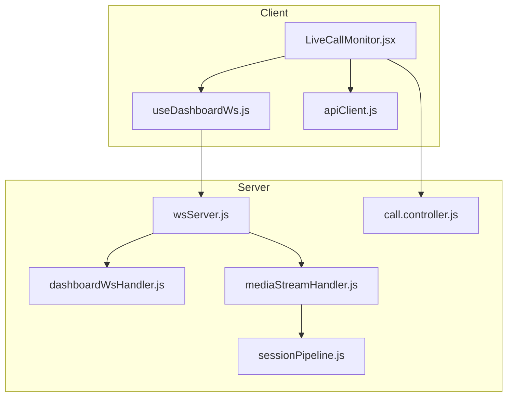
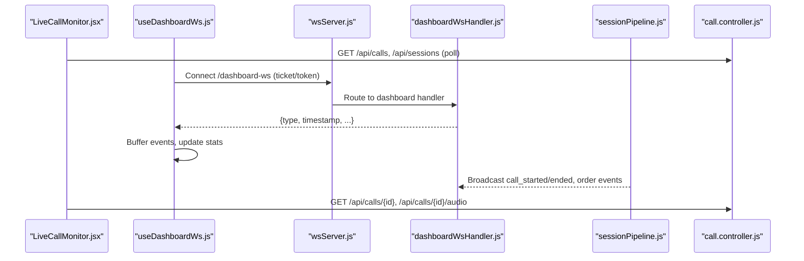
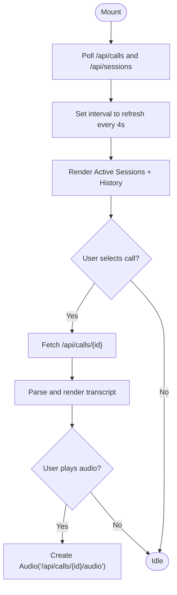
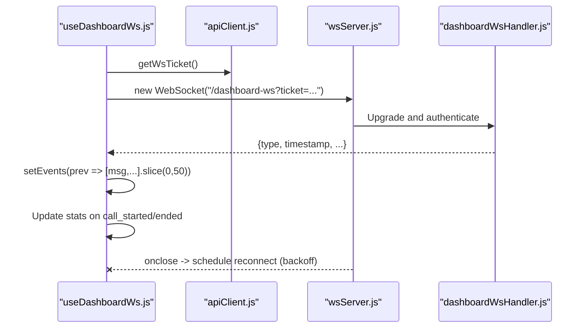
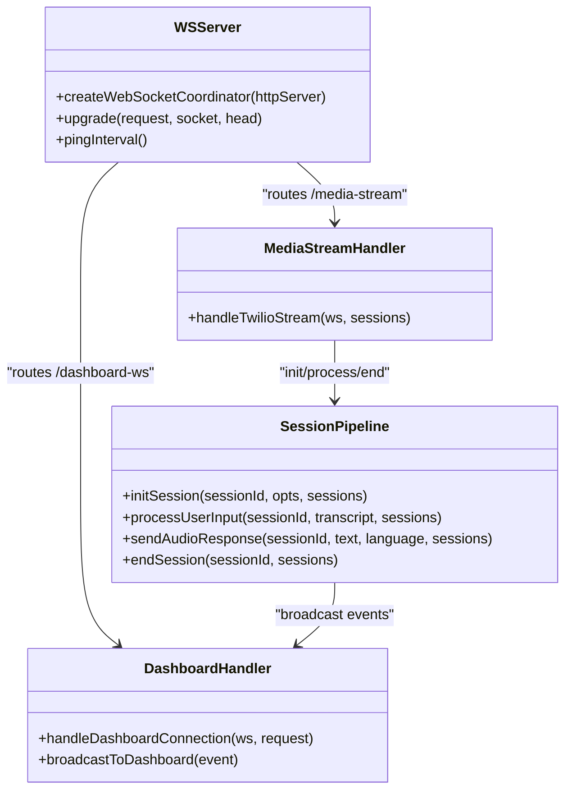
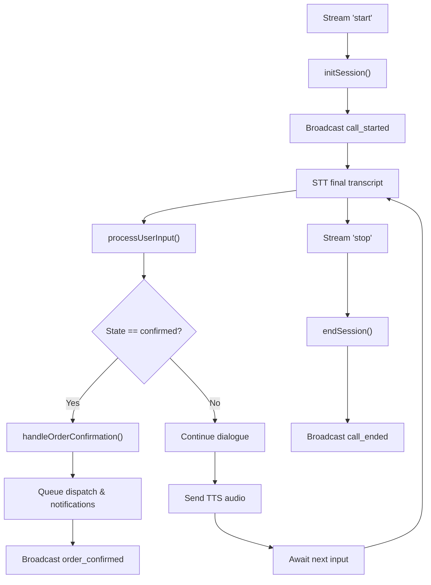
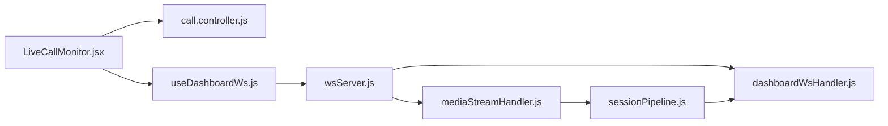

# Live Call Monitor

<cite>
**Referenced Files in This Document**
- [LiveCallMonitor.jsx](file://client/src/components/LiveCallMonitor.jsx)
- [useDashboardWs.js](file://client/src/hooks/useDashboardWs.js)
- [apiClient.js](file://client/src/services/apiClient.js)
- [dashboardWsHandler.js](file://server/src/websocket/dashboardWsHandler.js)
- [wsServer.js](file://server/src/websocket/wsServer.js)
- [sessionPipeline.js](file://server/src/websocket/sessionPipeline.js)
- [mediaStreamHandler.js](file://server/src/websocket/mediaStreamHandler.js)
- [call.controller.js](file://server/src/controllers/call.controller.js)
- [VoiceVisualizer.jsx](file://mobile/src/components/visualizers/VoiceVisualizer.jsx)
- [CircularWaveform.jsx](file://mobile/src/components/visualizers/CircularWaveform.jsx)
</cite>

## Table of Contents
1. Introduction
2. Project Structure
3. Core Components
4. Architecture Overview
5. Detailed Component Analysis
6. Dependency Analysis
7. Performance Considerations
8. Troubleshooting Guide
9. Conclusion

## Introduction
This document explains the LiveCallMonitor component and its real-time voice call oversight capabilities. It covers WebSocket integration for live call updates, call status tracking, conversation monitoring, audio playback, transcript display, and performance techniques for handling multiple concurrent calls. It also documents the useDashboardWs hook for robust WebSocket connection management, event subscription patterns, and error recovery.

## Project Structure
The LiveCallMonitor is a React component that:
- Polls REST endpoints to list active sessions and call history
- Displays live session cards with latency and item counts
- Shows selected call details including transcripts and audio playback
- Integrates with a dashboard WebSocket hook for live events and stats

**Diagram sources**
- [LiveCallMonitor.jsx:1-210](file://client/src/components/LiveCallMonitor.jsx#L1-L210)
- [useDashboardWs.js:1-128](file://client/src/hooks/useDashboardWs.js#L1-L128)
- [apiClient.js:1-128](file://client/src/services/apiClient.js#L1-L128)
- [wsServer.js:1-162](file://server/src/websocket/wsServer.js#L1-L162)
- [dashboardWsHandler.js:1-69](file://server/src/websocket/dashboardWsHandler.js#L1-L69)
- [mediaStreamHandler.js:1-69](file://server/src/websocket/mediaStreamHandler.js#L1-L69)
- [sessionPipeline.js:1-437](file://server/src/websocket/sessionPipeline.js#L1-L437)
- [call.controller.js:1-114](file://server/src/controllers/call.controller.js#L1-L114)

**Section sources**
- [LiveCallMonitor.jsx:1-210](file://client/src/components/LiveCallMonitor.jsx#L1-L210)
- [useDashboardWs.js:1-128](file://client/src/hooks/useDashboardWs.js#L1-L128)
- [wsServer.js:1-162](file://server/src/websocket/wsServer.js#L1-L162)
- [dashboardWsHandler.js:1-69](file://server/src/websocket/dashboardWsHandler.js#L1-L69)
- [sessionPipeline.js:1-437](file://server/src/websocket/sessionPipeline.js#L1-L437)
- [mediaStreamHandler.js:1-69](file://server/src/websocket/mediaStreamHandler.js#L1-L69)
- [call.controller.js:1-114](file://server/src/controllers/call.controller.js#L1-L114)

## Core Components
- LiveCallMonitor: UI for live sessions, call history, detail view, audio playback, and transcript feed.
- useDashboardWs: Custom hook managing authenticated WebSocket connections, event buffering, auto-reconnect backoff, and live stats synchronization.
- Server WebSocket server: Handles upgrades, authentication (tickets/tokens), routing to handlers, and broadcasting tenant-scoped events.
- Session pipeline: Orchestrates STT/TTS, dialogue processing, order confirmation, recording persistence, and dashboard broadcasts.
- Call controller: Provides REST endpoints for stats, recent calls, call details, and audio streaming.

Key responsibilities:
- Real-time updates via WebSocket events (call_started, call_ended, order_confirmed, stt_transcript, user_speech, ai_response, tts_complete).
- Call lifecycle management from initiation to completion with persistent metadata and recordings.
- Audio visualization components on mobile for recording and AI speaking states.

**Section sources**
- [LiveCallMonitor.jsx:1-210](file://client/src/components/LiveCallMonitor.jsx#L1-L210)
- [useDashboardWs.js:1-128](file://client/src/hooks/useDashboardWs.js#L1-L128)
- [wsServer.js:1-162](file://server/src/websocket/wsServer.js#L1-L162)
- [dashboardWsHandler.js:1-69](file://server/src/websocket/dashboardWsHandler.js#L1-L69)
- [sessionPipeline.js:1-437](file://server/src/websocket/sessionPipeline.js#L1-L437)
- [call.controller.js:1-114](file://server/src/controllers/call.controller.js#L1-L114)

## Architecture Overview
The system combines polling-based REST data with WebSocket-driven live updates. The client uses both approaches:
- LiveCallMonitor polls /api/calls and /api/sessions periodically and fetches call details and audio on demand.
- useDashboardWs maintains a long-lived WebSocket to receive live events and refresh aggregated stats.

**Diagram sources**
- [LiveCallMonitor.jsx:10-49](file://client/src/components/LiveCallMonitor.jsx#L10-L49)
- [useDashboardWs.js:45-124](file://client/src/hooks/useDashboardWs.js#L45-L124)
- [wsServer.js:34-72](file://server/src/websocket/wsServer.js#L34-L72)
- [dashboardWsHandler.js:10-69](file://server/src/websocket/dashboardWsHandler.js#L10-L69)
- [sessionPipeline.js:102-110](file://server/src/websocket/sessionPipeline.js#L102-L110)
- [call.controller.js:22-114](file://server/src/controllers/call.controller.js#L22-L114)

## Detailed Component Analysis

### LiveCallMonitor Component
Responsibilities:
- Polls active sessions and call history at intervals.
- Renders active live sessions with source indicators and average latency.
- Displays call history list; selecting a call loads detail and transcript.
- Plays call recordings via an HTML Audio element bound to the audio endpoint.
- Shows transcript turns with role-based avatars and bubbles.

Data flow:
- fetchCalls and fetchSessions poll REST endpoints every few seconds.
- fetchCallDetail retrieves full call metadata and transcript for the selected call.
- toggleAudio creates an Audio instance for the selected call’s recording stream.

**Diagram sources**
- [LiveCallMonitor.jsx:10-49](file://client/src/components/LiveCallMonitor.jsx#L10-L49)
- [LiveCallMonitor.jsx:113-205](file://client/src/components/LiveCallMonitor.jsx#L113-L205)

**Section sources**
- [LiveCallMonitor.jsx:10-49](file://client/src/components/LiveCallMonitor.jsx#L10-L49)
- [LiveCallMonitor.jsx:54-205](file://client/src/components/LiveCallMonitor.jsx#L54-L205)

### useDashboardWs Hook
Responsibilities:
- Acquires a single-use ticket or uses stored token to connect to /dashboard-ws.
- Manages reconnection with exponential backoff and clears timers on unmount.
- Buffers incoming events up to a fixed size and updates aggregated stats.
- Listens for auth changes to reconnect when credentials change.

Connection and event handling:
- Determines protocol/host based on environment.
- Opens WebSocket with query parameters for ticket or token.
- On message, parses JSON, prepends to events array (bounded), and updates active_calls counter for call_started/ended.
- On close, schedules reconnect with increasing delay capped at a maximum.

**Diagram sources**
- [useDashboardWs.js:29-124](file://client/src/hooks/useDashboardWs.js#L29-L124)
- [apiClient.js:58-66](file://client/src/services/apiClient.js#L58-L66)
- [wsServer.js:34-72](file://server/src/websocket/wsServer.js#L34-L72)
- [dashboardWsHandler.js:10-38](file://server/src/websocket/dashboardWsHandler.js#L10-L38)

**Section sources**
- [useDashboardWs.js:1-128](file://client/src/hooks/useDashboardWs.js#L1-L128)
- [apiClient.js:1-128](file://client/src/services/apiClient.js#L1-L128)

### WebSocket Server and Handlers
Responsibilities:
- wsServer: Intercepts HTTP upgrade requests, validates paths, authenticates via tickets/tokens, and routes to appropriate handlers. Includes heartbeat liveness checks.
- dashboardWsHandler: Maintains a Set of connected clients, enforces tenant/restaurant scoping, and broadcasts events to matching clients.
- mediaStreamHandler: Processes Twilio stream events (start, media, stop), initializes sessions, streams audio chunks, and ends sessions.

**Diagram sources**
- [wsServer.js:17-162](file://server/src/websocket/wsServer.js#L17-L162)
- [dashboardWsHandler.js:10-69](file://server/src/websocket/dashboardWsHandler.js#L10-L69)
- [mediaStreamHandler.js:7-69](file://server/src/websocket/mediaStreamHandler.js#L7-L69)
- [sessionPipeline.js:24-437](file://server/src/websocket/sessionPipeline.js#L24-L437)

**Section sources**
- [wsServer.js:17-162](file://server/src/websocket/wsServer.js#L17-L162)
- [dashboardWsHandler.js:10-69](file://server/src/websocket/dashboardWsHandler.js#L10-L69)
- [mediaStreamHandler.js:7-69](file://server/src/websocket/mediaStreamHandler.js#L7-L69)

### Call Lifecycle Management
End-to-end flow:
- Stream start: mediaStreamHandler receives 'start', initializes session with tenant context, persists initial state, and broadcasts call_started.
- User speech: STT stream emits final transcripts; processUserInput updates dialogue state, records latencies, broadcasts events, and sends TTS audio.
- Order confirmation: When state indicates confirmed, handleOrderConfirmation persists orders, queues dispatch and notifications, and broadcasts order_confirmed.
- Stream stop: endSession finalizes DB record, offloads audio persistence, broadcasts call_ended with summary, and cleans up.

**Diagram sources**
- [mediaStreamHandler.js:21-55](file://server/src/websocket/mediaStreamHandler.js#L21-L55)
- [sessionPipeline.js:24-110](file://server/src/websocket/sessionPipeline.js#L24-L110)
- [sessionPipeline.js:132-219](file://server/src/websocket/sessionPipeline.js#L132-L219)
- [sessionPipeline.js:299-389](file://server/src/websocket/sessionPipeline.js#L299-L389)
- [sessionPipeline.js:394-437](file://server/src/websocket/sessionPipeline.js#L394-L437)

**Section sources**
- [mediaStreamHandler.js:21-55](file://server/src/websocket/mediaStreamHandler.js#L21-L55)
- [sessionPipeline.js:24-110](file://server/src/websocket/sessionPipeline.js#L24-L110)
- [sessionPipeline.js:132-219](file://server/src/websocket/sessionPipeline.js#L132-L219)
- [sessionPipeline.js:299-389](file://server/src/websocket/sessionPipeline.js#L299-L389)
- [sessionPipeline.js:394-437](file://server/src/websocket/sessionPipeline.js#L394-L437)

### Audio Visualization Components
Mobile visualizers provide real-time feedback during calls:
- VoiceVisualizer: Animated bars reflecting recording activity, AI speaking cadence, or idle breathing.
- CircularWaveform: Pulsing orb with expanding rings to indicate active states and speaker roles.

These components are driven by props indicating call state, recording, and AI speaking flags, enabling intuitive UX across different call phases.

**Section sources**
- [VoiceVisualizer.jsx:1-134](file://mobile/src/components/visualizers/VoiceVisualizer.jsx#L1-L134)
- [CircularWaveform.jsx:1-216](file://mobile/src/components/visualizers/CircularWaveform.jsx#L1-L216)

## Dependency Analysis
Coupling and cohesion:
- LiveCallMonitor depends on REST endpoints and optionally on useDashboardWs for live events.
- useDashboardWs depends on apiClient for ticket acquisition and token storage, and on the WebSocket server for live updates.
- wsServer orchestrates authentication and routes to handlers; dashboardWsHandler manages client sets and tenant-scoped broadcasts.
- sessionPipeline coordinates STT/TTS, dialogue, order flows, and broadcasts; it is the central hub for call lifecycle logic.
- mediaStreamHandler bridges telephony streams into the session pipeline.

External dependencies:
- Authentication via tokens and single-use tickets.
- STT/TTS services integrated through sessionPipeline.
- Queues for dispatch and notifications.

Potential circular dependencies:
- None detected; broadcastToDashboard is used by sessionPipeline and dashboardWsHandler without mutual imports.

**Diagram sources**
- [LiveCallMonitor.jsx:10-49](file://client/src/components/LiveCallMonitor.jsx#L10-L49)
- [useDashboardWs.js:45-124](file://client/src/hooks/useDashboardWs.js#L45-L124)
- [wsServer.js:129-147](file://server/src/websocket/wsServer.js#L129-L147)
- [dashboardWsHandler.js:43-69](file://server/src/websocket/dashboardWsHandler.js#L43-L69)
- [mediaStreamHandler.js:7-69](file://server/src/websocket/mediaStreamHandler.js#L7-L69)
- [sessionPipeline.js:54-110](file://server/src/websocket/sessionPipeline.js#L54-L110)

**Section sources**
- [wsServer.js:129-147](file://server/src/websocket/wsServer.js#L129-L147)
- [dashboardWsHandler.js:43-69](file://server/src/websocket/dashboardWsHandler.js#L43-L69)
- [sessionPipeline.js:54-110](file://server/src/websocket/sessionPipeline.js#L54-L110)

## Performance Considerations
- Event buffering: useDashboardWs limits events to the last 50 entries to prevent memory growth during high-frequency updates.
- Reconnection strategy: Exponential backoff with a cap reduces network churn and server load during outages.
- Polling frequency: LiveCallMonitor refreshes every 4 seconds; consider adjusting based on expected call volume and UI responsiveness needs.
- Memory caps: sessionPipeline enforces a per-call audio memory cap to avoid excessive RAM usage during long calls.
- Chunked audio streaming: TTS responses are sent in small chunks to reduce latency and buffer sizes over WebSocket.
- Tenant scoping: Broadcasting filters by tenant and restaurant to minimize message fan-out and improve throughput.

[No sources needed since this section provides general guidance]

## Troubleshooting Guide
Common issues and resolutions:
- WebSocket connection failures:
  - Ensure a valid ticket or token is provided; verify getWsTicket succeeds and token is stored.
  - Check environment host and protocol selection in useDashboardWs.
  - Review server logs for upgrade errors and authentication failures.
- Auth changes not reflected:
  - Confirm window event 'voicecart_auth_change' is dispatched on login/logout; useDashboardWs listens to this to reconnect.
- Missing or stale stats:
  - Verify fetchStats runs on interval and after relevant events; check server /api/v1/stats availability.
- Call detail not loading:
  - Ensure REST endpoints return correct tenant-scoped data; confirm call exists and belongs to the current tenant/restaurant.
- Audio playback issues:
  - Validate audio file existence and permissions; ensure browser autoplay policies allow playback.

**Section sources**
- [useDashboardWs.js:97-109](file://client/src/hooks/useDashboardWs.js#L97-L109)
- [apiClient.js:26-40](file://client/src/services/apiClient.js#L26-L40)
- [call.controller.js:22-114](file://server/src/controllers/call.controller.js#L22-L114)

## Conclusion
LiveCallMonitor provides a comprehensive interface for overseeing live voice calls, combining periodic REST polling with WebSocket-driven live updates. The useDashboardWs hook ensures resilient connectivity and efficient event handling. The server-side architecture enforces secure tenant scoping, manages call lifecycles, and integrates telephony streams with dialogue processing, order fulfillment, and recording persistence. Mobile visualizers enhance user experience by providing clear audio state feedback. Together, these components deliver scalable, real-time call oversight suitable for multi-tenant environments.