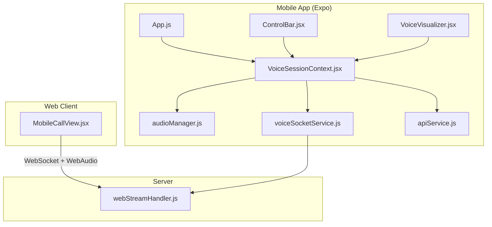
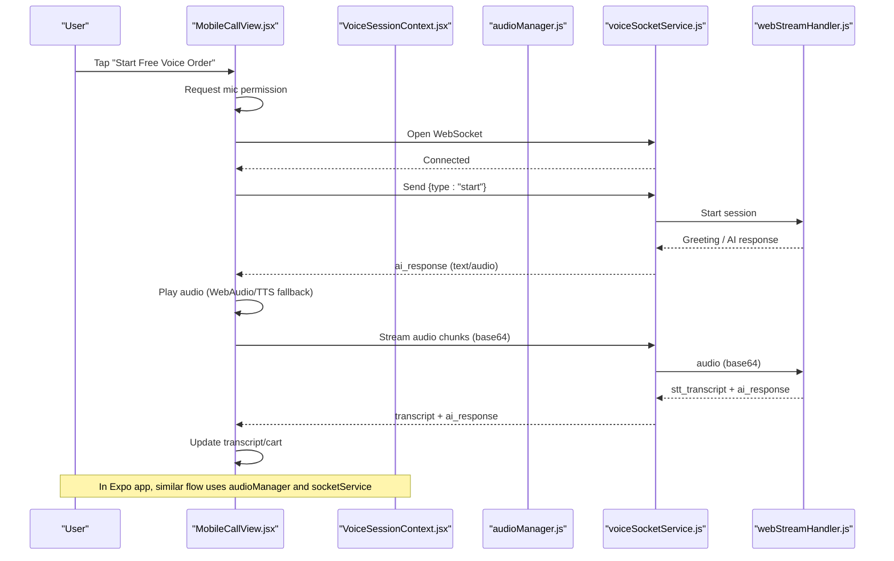
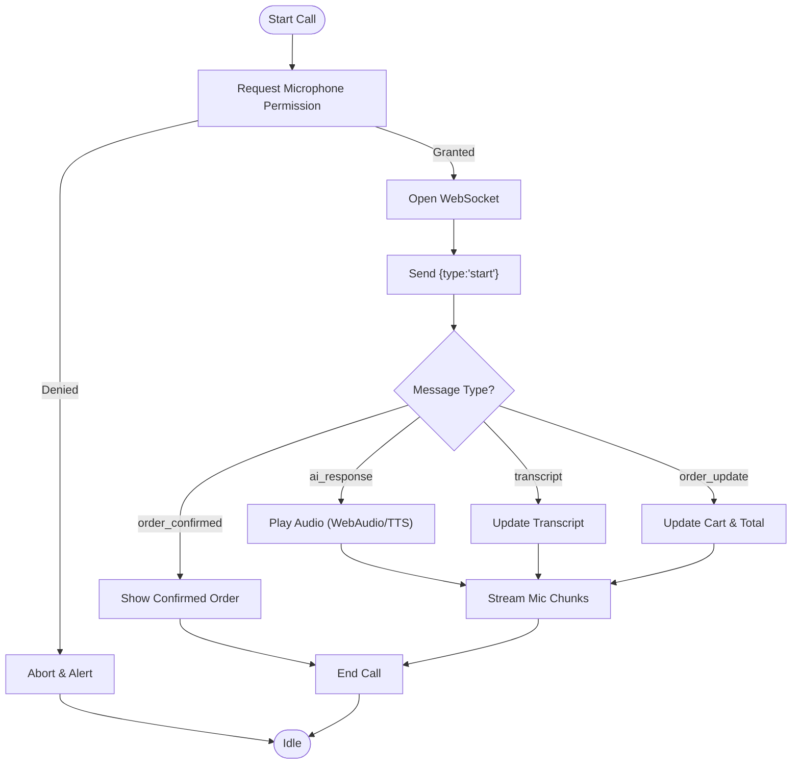
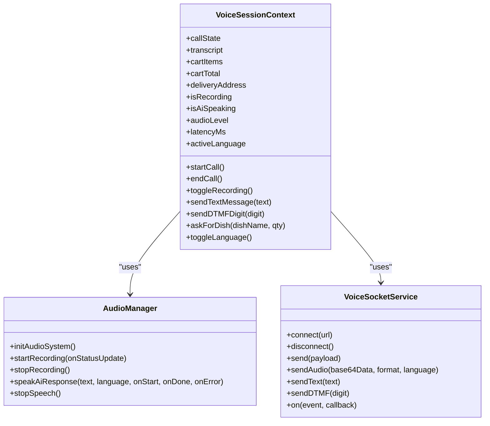
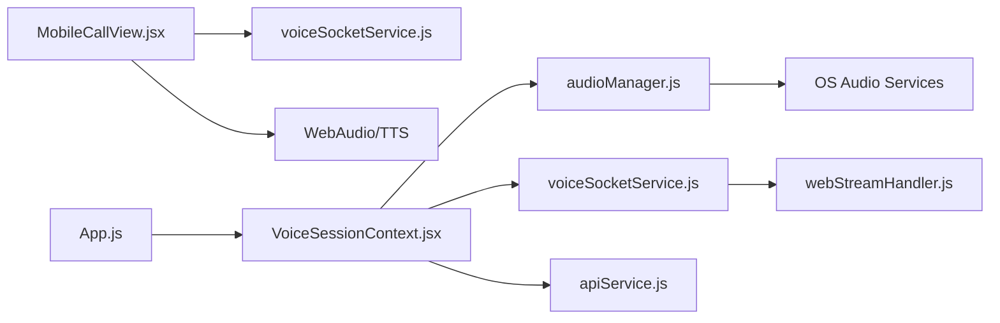

# Mobile Call View

<cite>
**Referenced Files in This Document**
- [MobileCallView.jsx](file://client/src/components/MobileCallView.jsx)
- [VoiceSessionContext.jsx](file://mobile/src/context/VoiceSessionContext.jsx)
- [audioManager.js](file://mobile/src/services/audioManager.js)
- [voiceSocketService.js](file://mobile/src/services/voiceSocketService.js)
- [ControlBar.jsx](file://mobile/src/components/controls/ControlBar.jsx)
- [VoiceVisualizer.jsx](file://mobile/src/components/visualizers/VoiceVisualizer.jsx)
- [apiService.js](file://mobile/src/services/apiService.js)
- [App.js](file://mobile/App.js)
- [webStreamHandler.js](file://server/src/websocket/webStreamHandler.js)
- [package.json (mobile)](file://mobile/package.json)
- [package.json (client)](file://client/package.json)
</cite>

## Table of Contents
1. [Introduction](#introduction)
2. [Project Structure](#project-structure)
3. [Core Components](#core-components)
4. [Architecture Overview](#architecture-overview)
5. [Detailed Component Analysis](#detailed-component-analysis)
6. [Dependency Analysis](#dependency-analysis)
7. [Performance Considerations](#performance-considerations)
8. [Troubleshooting Guide](#troubleshooting-guide)
9. [Conclusion](#conclusion)
10. [Appendices](#appendices)

## Introduction
This document provides comprehensive documentation for the MobileCallView component and its mobile ecosystem, focusing on a mobile-optimized interface for voice interactions. It covers responsive design patterns, touch-friendly UI elements, audio streaming handling, call quality indicators, network connectivity management, gesture support, orientation considerations, battery optimization techniques, mobile browser compatibility, PWA features, and native app integration patterns. The goal is to make the system understandable for both technical and non-technical users while providing actionable insights into implementation details.

## Project Structure
The project includes two primary client implementations:
- A web-based MobileCallView React component that runs in mobile browsers and supports real-time voice ordering via WebSockets and Web Audio APIs.
- A React Native/Expo mobile application that provides a native-like experience with robust audio recording, speech synthesis, and WebSocket communication.

**Diagram sources**
- [MobileCallView.jsx:37-136](file://client/src/components/MobileCallView.jsx#L37-L136)
- [App.js:16-146](file://mobile/App.js#L16-L146)
- [VoiceSessionContext.jsx:13-169](file://mobile/src/context/VoiceSessionContext.jsx#L13-L169)
- [audioManager.js:10-131](file://mobile/src/services/audioManager.js#L10-L131)
- [voiceSocketService.js:11-99](file://mobile/src/services/voiceSocketService.js#L11-L99)
- [ControlBar.jsx:12-137](file://mobile/src/components/controls/ControlBar.jsx#L12-L137)
- [VoiceVisualizer.jsx:7-109](file://mobile/src/components/visualizers/VoiceVisualizer.jsx#L7-L109)
- [apiService.js:10-49](file://mobile/src/services/apiService.js#L10-L49)
- [webStreamHandler.js:7-81](file://server/src/websocket/webStreamHandler.js#L7-L81)

**Section sources**
- [MobileCallView.jsx:1-409](file://client/src/components/MobileCallView.jsx#L1-L409)
- [App.js:1-167](file://mobile/App.js#L1-L167)

## Core Components
- MobileCallView (web): Provides a mobile-first UI for initiating calls, streaming microphone audio, receiving AI responses, showing live transcripts, and managing call state.
- VoiceSessionContext (mobile): Centralizes session state, WebSocket events, audio recording, speech output, language switching, and cart/order updates.
- audioManager (mobile): Handles permissions, audio modes, recording lifecycle, and native speech synthesis.
- voiceSocketService (mobile): Encapsulates WebSocket connection, message routing, and sending audio/text/DTMF.
- ControlBar (mobile): Touch-friendly control bar with push-to-talk, menu, keypad, text input, and cart access.
- VoiceVisualizer (mobile): Animated waveform indicating active states and audio levels.
- apiService (mobile): Fetches catalog and pings server health with fallbacks.
- webStreamHandler (server): Processes incoming audio/text, transcribes, processes dialogue, and sends back AI responses and transcripts.

**Section sources**
- [MobileCallView.jsx:37-174](file://client/src/components/MobileCallView.jsx#L37-L174)
- [VoiceSessionContext.jsx:13-169](file://mobile/src/context/VoiceSessionContext.jsx#L13-L169)
- [audioManager.js:10-131](file://mobile/src/services/audioManager.js#L10-L131)
- [voiceSocketService.js:11-99](file://mobile/src/services/voiceSocketService.js#L11-L99)
- [ControlBar.jsx:12-137](file://mobile/src/components/controls/ControlBar.jsx#L12-L137)
- [VoiceVisualizer.jsx:7-109](file://mobile/src/components/visualizers/VoiceVisualizer.jsx#L7-L109)
- [apiService.js:10-49](file://mobile/src/services/apiService.js#L10-L49)
- [webStreamHandler.js:23-61](file://server/src/websocket/webStreamHandler.js#L23-L61)

## Architecture Overview
The architecture integrates web and mobile clients with a shared backend WebSocket handler. Both clients stream audio or send text messages, receive AI responses, and update UI accordingly.

**Diagram sources**
- [MobileCallView.jsx:37-136](file://client/src/components/MobileCallView.jsx#L37-L136)
- [voiceSocketService.js:11-99](file://mobile/src/services/voiceSocketService.js#L11-L99)
- [webStreamHandler.js:23-61](file://server/src/websocket/webStreamHandler.js#L23-L61)

## Detailed Component Analysis

### MobileCallView (Web)
- Responsive Design Patterns:
  - Uses flexible layout with max-width constraints and centering for mobile screens.
  - Large touch targets for buttons and controls.
  - Clear visual states for idle, calling, connected, ended.
- Touch-Friendly UI Elements:
  - Prominent start/end call buttons with gradients and shadows.
  - Mic mute toggle with clear visual feedback.
  - Live transcript area with auto-scroll behavior.
- Mobile-Specific Optimizations:
  - MediaRecorder streams audio in small chunks to reduce latency.
  - Base64 encoding for audio payloads over WebSocket.
  - Fallback to SpeechSynthesis if WebAudio decoding fails.
- Audio Streaming Handling:
  - Requests microphone permission and initializes AudioContext.
  - Sends base64-encoded audio chunks continuously during call.
  - Plays AI audio payloads using WebAudio; falls back to TTS.
- Call Quality Indicators:
  - Visual waveform bars animate when AI speaks.
  - Status badge shows connecting vs live call with timer.
- Network Connectivity Management:
  - Detects local vs production host and selects appropriate WebSocket endpoint.
  - Attempts server wakeup by fetching stats before connecting.
  - Error handling logs and retries with user feedback.
- Gesture Support:
  - Tap to start call; tap to mute/unmute; tap to end call.
- Orientation Handling:
  - Layout adapts to portrait orientation with vertical stacking and scrollable transcript.
- Battery Optimization Techniques:
  - Stops timers and clears intervals on state changes.
  - Releases media recorder and closes WebSocket on end.
- Mobile Browser Compatibility:
  - Uses standard Web APIs: getUserMedia, MediaRecorder, WebSocket, AudioContext, SpeechSynthesis.
  - Graceful fallback to TTS when decoding fails.
- PWA Features:
  - Works in mobile browsers without native dependencies.
  - Can be wrapped in a PWA shell for installability and offline fallbacks (catalog fallback exists).
- Native App Integration Patterns:
  - Mirrors functionality available in the Expo app (session state, cart updates, order confirmation).

**Diagram sources**
- [MobileCallView.jsx:37-136](file://client/src/components/MobileCallView.jsx#L37-L136)
- [MobileCallView.jsx:138-174](file://client/src/components/MobileCallView.jsx#L138-L174)

**Section sources**
- [MobileCallView.jsx:1-409](file://client/src/components/MobileCallView.jsx#L1-L409)

### VoiceSessionContext (Mobile)
- Session State Management:
  - Tracks callState, transcript, cart items, delivery address, recording state, AI speaking state, audio level, latency, and active language.
- WebSocket Event Handling:
  - Subscribes to ai_response, stt_transcript, order_confirmed, close, error events.
  - Updates UI state and triggers speech output based on AI responses.
- Audio Recording and Playback:
  - Integrates with audioManager for starting/stopping recordings and speech synthesis.
  - Push-to-talk toggles recording and sends audio data via socketService.
- Text and DTMF Input:
  - Supports typing messages and pressing DTMF digits during active sessions.
- Language Switching:
  - Allows toggling between English and Tamil for transcription and speech output.
- Network Health Checks:
  - Pings server health before connecting and handles errors gracefully.

**Diagram sources**
- [VoiceSessionContext.jsx:13-169](file://mobile/src/context/VoiceSessionContext.jsx#L13-L169)
- [audioManager.js:10-131](file://mobile/src/services/audioManager.js#L10-L131)
- [voiceSocketService.js:11-99](file://mobile/src/services/voiceSocketService.js#L11-L99)

**Section sources**
- [VoiceSessionContext.jsx:1-302](file://mobile/src/context/VoiceSessionContext.jsx#L1-L302)

### audioManager (Mobile)
- Permissions and Modes:
  - Requests microphone permissions and configures audio modes for iOS/Android.
- Recording Lifecycle:
  - Creates high-quality recordings, stops and unloads them, and returns base64 data.
- Speech Synthesis:
  - Uses native speech services with language detection and callbacks for start/done/error.
- Battery Optimization:
  - Stops ongoing speech before starting new recordings to avoid conflicts.
  - Unloads recordings promptly to free memory.

**Section sources**
- [audioManager.js:1-131](file://mobile/src/services/audioManager.js#L1-L131)

### voiceSocketService (Mobile)
- Connection Management:
  - Establishes WebSocket connections, emits open/close/error events, and sends handshake start.
- Message Routing:
  - Parses JSON messages and dispatches typed events to listeners.
- Data Transmission:
  - Sends audio (base64), text, and DTMF digits with appropriate payloads.
- Disconnection:
  - Sends end message and closes socket cleanly.

**Section sources**
- [voiceSocketService.js:1-129](file://mobile/src/services/voiceSocketService.js#L1-L129)

### ControlBar (Mobile)
- Touch-Friendly Controls:
  - Large circular mic button with visual states for idle, active, and recording.
  - Accessible labels and icons for menu, keypad, text input, and cart.
- Expandable Text Input:
  - Optional inline text input for typing orders during active sessions.
- Disabled States:
  - Controls are disabled unless the call is active to prevent invalid actions.

**Section sources**
- [ControlBar.jsx:1-263](file://mobile/src/components/controls/ControlBar.jsx#L1-L263)

### VoiceVisualizer (Mobile)
- Animated Waveform:
  - Displays dynamic bars reflecting AI speaking cadence, recording energy, or idle breathing.
- Performance:
  - Uses Animated API with parallel animations and cleanup on unmount.
- Visual Feedback:
  - Changes color and opacity based on current state to provide clear feedback.

**Section sources**
- [VoiceVisualizer.jsx:1-134](file://mobile/src/components/visualizers/VoiceVisualizer.jsx#L1-L134)

### apiService (Mobile)
- Catalog Fetching:
  - Retrieves menu catalog from server with tenant and restaurant parameters.
  - Provides a fallback default catalog if network request fails.
- Server Health Ping:
  - Pings health endpoint and measures latency for connection readiness.

**Section sources**
- [apiService.js:1-49](file://mobile/src/services/apiService.js#L1-L49)

### webStreamHandler (Server)
- Session Initialization:
  - Initializes sessions with source, WebSocket reference, tenant, and restaurant IDs.
- Audio Processing:
  - Accepts base64 audio, converts to buffer, transcribes using STT service, and processes through dialogue engine.
- Response Flow:
  - Sends stt_transcript and AI responses back to clients.
- Session Termination:
  - Ends sessions on close events.

**Section sources**
- [webStreamHandler.js:1-81](file://server/src/websocket/webStreamHandler.js#L1-L81)

## Dependency Analysis
The components interact through well-defined interfaces:
- MobileCallView depends on browser APIs and WebSocket for real-time communication.
- VoiceSessionContext orchestrates audio, socket, and API services.
- audioManager abstracts platform-specific audio behaviors.
- voiceSocketService encapsulates WebSocket logic and event emission.
- ControlBar and VoiceVisualizer consume context state for UI updates.
- apiService provides catalog and health checks.
- webStreamHandler processes client messages and coordinates backend services.

**Diagram sources**
- [MobileCallView.jsx:37-136](file://client/src/components/MobileCallView.jsx#L37-L136)
- [VoiceSessionContext.jsx:13-169](file://mobile/src/context/VoiceSessionContext.jsx#L13-L169)
- [voiceSocketService.js:11-99](file://mobile/src/services/voiceSocketService.js#L11-L99)
- [apiService.js:10-49](file://mobile/src/services/apiService.js#L10-L49)
- [webStreamHandler.js:23-61](file://server/src/websocket/webStreamHandler.js#L23-L61)

**Section sources**
- [MobileCallView.jsx:1-409](file://client/src/components/MobileCallView.jsx#L1-L409)
- [VoiceSessionContext.jsx:1-302](file://mobile/src/context/VoiceSessionContext.jsx#L1-L302)
- [voiceSocketService.js:1-129](file://mobile/src/services/voiceSocketService.js#L1-L129)
- [apiService.js:1-49](file://mobile/src/services/apiService.js#L1-L49)
- [webStreamHandler.js:1-81](file://server/src/websocket/webStreamHandler.js#L1-L81)

## Performance Considerations
- Audio Chunk Size:
  - MobileCallView sends audio every 250ms to balance latency and bandwidth.
- Base64 Overhead:
  - Base64 encoding increases payload size; consider binary frames if supported by backend.
- Memory Management:
  - Stop and unload recordings promptly to avoid memory leaks.
- Animation Efficiency:
  - Use native driver where possible; limit animation complexity on low-end devices.
- Network Resilience:
  - Implement reconnection logic and exponential backoff for WebSocket connections.
- Battery Usage:
  - Minimize continuous background tasks; pause animations when not visible.
- Transcoding Fallback:
  - Provide TTS fallback to ensure usability even if audio decoding fails.

[No sources needed since this section provides general guidance]

## Troubleshooting Guide
- Microphone Permission Denied:
  - Ensure user grants permission; show clear instructions and retry flow.
- WebSocket Connection Failures:
  - Check network connectivity; verify server URL and firewall settings.
  - Use health ping to detect server availability before connecting.
- Audio Playback Issues:
  - Verify AudioContext state; resume if suspended.
  - Fall back to SpeechSynthesis if decoding fails.
- Recording Errors:
  - Handle exceptions during recording start/stop; reset state appropriately.
- Speech Synthesis Errors:
  - Catch and log errors; inform user if language pack missing.
- Session Cleanup:
  - Always close WebSocket and stop recording on end call to prevent resource leaks.

**Section sources**
- [MobileCallView.jsx:131-174](file://client/src/components/MobileCallView.jsx#L131-L174)
- [audioManager.js:56-90](file://mobile/src/services/audioManager.js#L56-L90)
- [voiceSocketService.js:42-56](file://mobile/src/services/voiceSocketService.js#L42-L56)
- [VoiceSessionContext.jsx:115-129](file://mobile/src/context/VoiceSessionContext.jsx#L115-L129)

## Conclusion
The MobileCallView and associated mobile components deliver a robust, mobile-optimized voice interaction experience. They combine responsive design, touch-friendly controls, efficient audio streaming, and resilient network handling. The system supports both web and native environments with consistent functionality, ensuring reliable performance across devices and networks. Future enhancements could include binary audio frames, advanced reconnection strategies, and enhanced accessibility features.

[No sources needed since this section summarizes without analyzing specific files]

## Appendices

### Mobile Browser Compatibility
- Supported APIs: getUserMedia, MediaRecorder, WebSocket, AudioContext, SpeechSynthesis.
- Fallbacks: TTS when WebAudio decoding fails; default catalog when network unavailable.

**Section sources**
- [MobileCallView.jsx:138-174](file://client/src/components/MobileCallView.jsx#L138-L174)
- [apiService.js:24-35](file://mobile/src/services/apiService.js#L24-L35)

### PWA Features
- Service Worker: Not explicitly implemented; can be added for caching and offline support.
- Manifest: Not included; can be configured for installability.
- Offline Behavior: Catalog fallback ensures basic functionality without network.

**Section sources**
- [apiService.js:24-35](file://mobile/src/services/apiService.js#L24-L35)

### Native App Integration Patterns
- Expo Framework: Uses expo-av, expo-speech, and expo-file-system for native capabilities.
- Context-Driven State: Centralized state management simplifies integration across components.
- Modular Services: Separation of concerns allows easy testing and maintenance.

**Section sources**
- [package.json (mobile):11-21](file://mobile/package.json#L11-L21)
- [VoiceSessionContext.jsx:13-169](file://mobile/src/context/VoiceSessionContext.jsx#L13-L169)