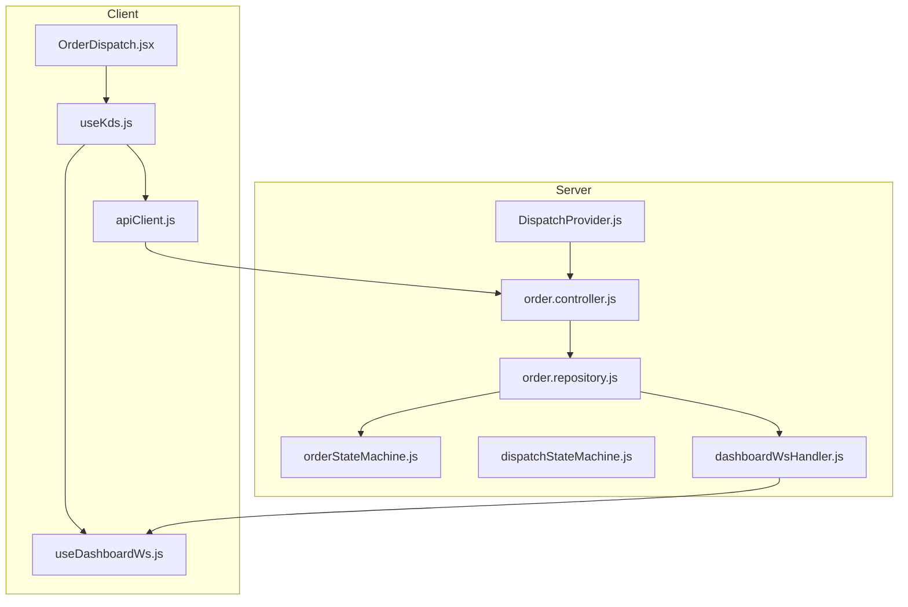
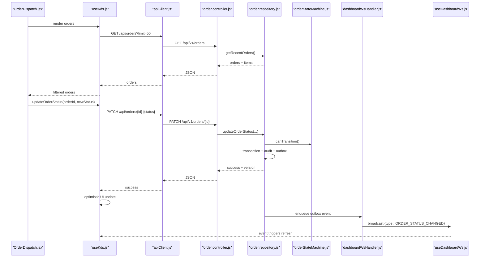
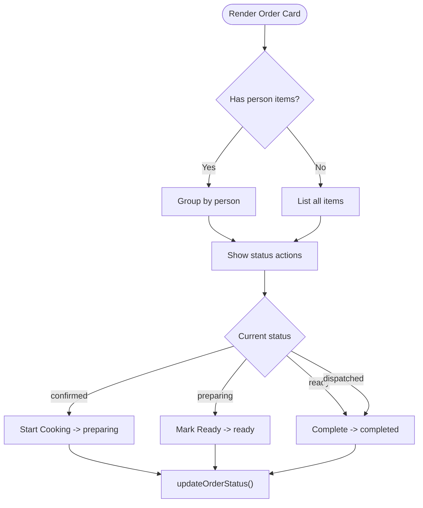
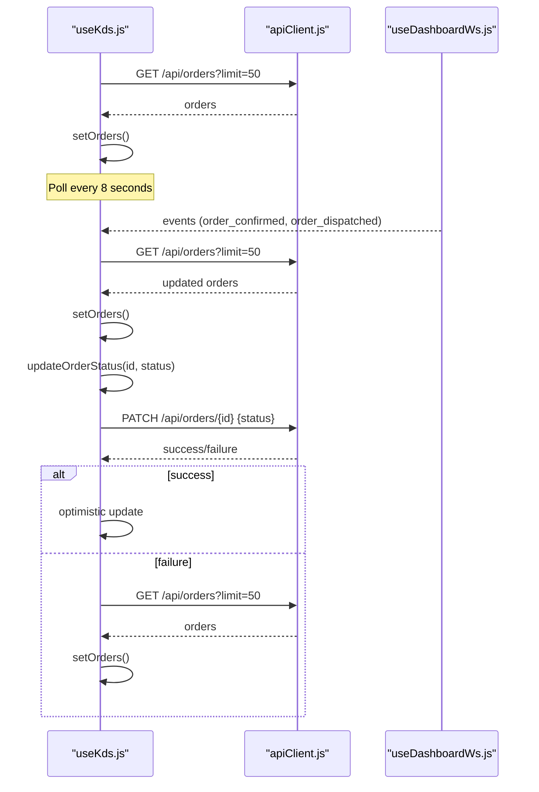
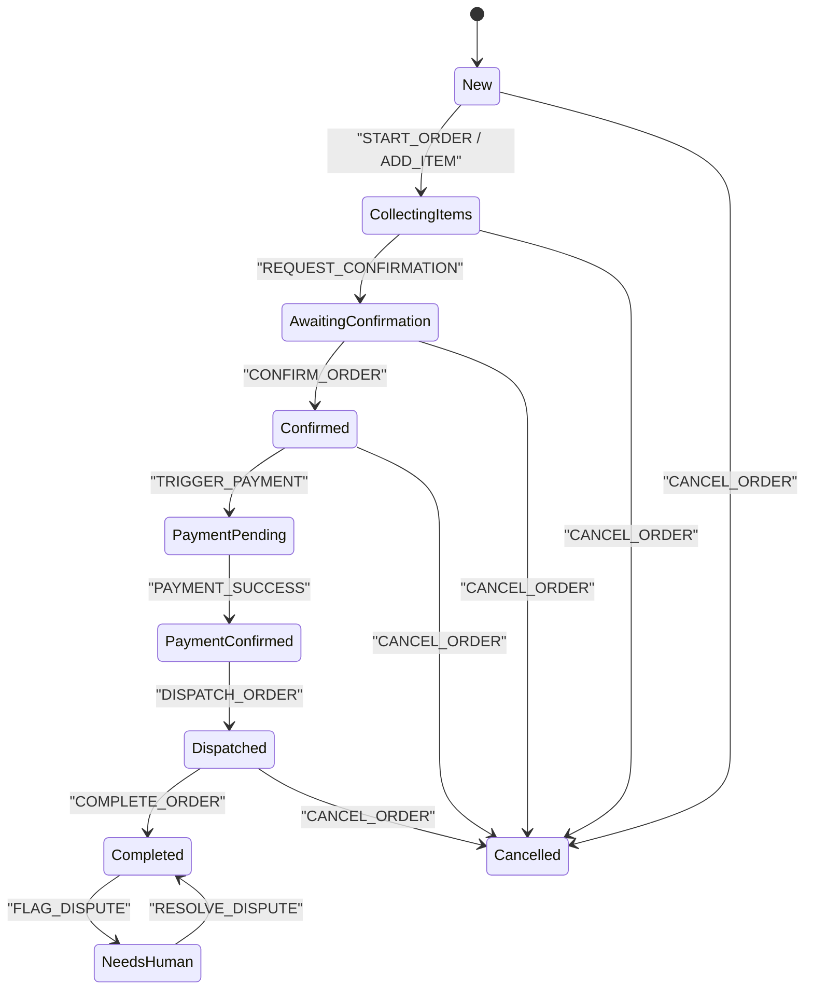
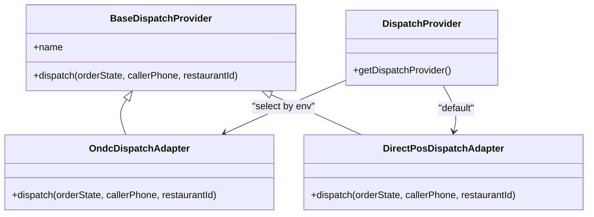
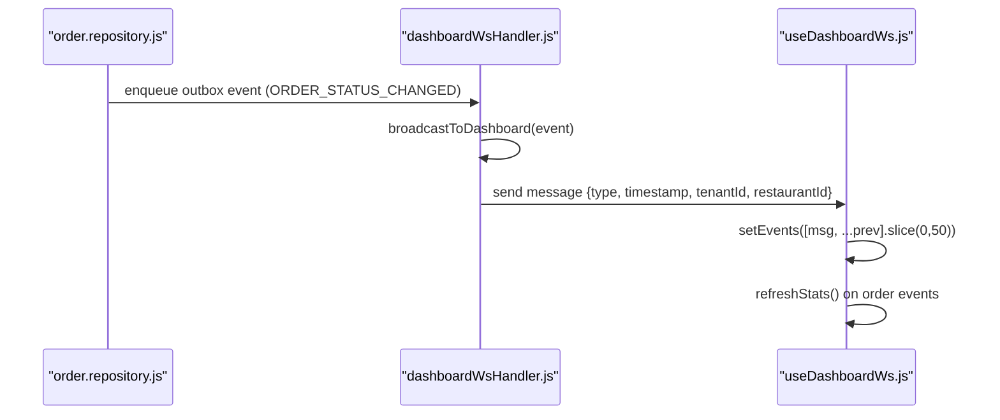
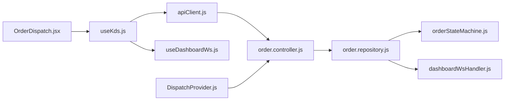

# Order Dispatch Interface

<cite>
**Referenced Files in This Document**
- [OrderDispatch.jsx](file://client/src/components/OrderDispatch.jsx)
- [useKds.js](file://client/src/hooks/useKds.js)
- [apiClient.js](file://client/src/services/apiClient.js)
- [order.controller.js](file://server/src/controllers/order.controller.js)
- [order.repository.js](file://server/src/domain/orders/order.repository.js)
- [orderStateMachine.js](file://server/src/domain/orders/orderStateMachine.js)
- [dispatchStateMachine.js](file://server/src/domain/dispatch/dispatchStateMachine.js)
- [DispatchProvider.js](file://server/src/integrations/dispatch/DispatchProvider.js)
- [dashboardWsHandler.js](file://server/src/websocket/dashboardWsHandler.js)
- [useDashboardWs.js](file://client/src/hooks/useDashboardWs.js)
</cite>

## Table of Contents
1. [Introduction](#introduction)
2. [Project Structure](#project-structure)
3. [Core Components](#core-components)
4. [Architecture Overview](#architecture-overview)
5. [Detailed Component Analysis](#detailed-component-analysis)
6. [Dependency Analysis](#dependency-analysis)
7. [Performance Considerations](#performance-considerations)
8. [Troubleshooting Guide](#troubleshooting-guide)
9. [Conclusion](#conclusion)

## Introduction
This document explains the Order Dispatch interface that powers kitchen display and order workflow management. It covers:
- Order state management across the UI, server state machines, and persistence layer
- Dispatch workflows for ONDC and direct POS integrations
- Real-time order updates via WebSocket events and polling
- Kitchen Display System (KDS) integration through the useKds hook
- Fulfillment tracking, dispute handling, and delivery coordination
- Keyboard shortcuts, bulk operations, and external dispatch system integration points

The goal is to provide both a high-level understanding and code-level details for developers and operators managing orders and kitchen operations.

## Project Structure
The Order Dispatch feature spans client-side React components and hooks, and server-side controllers, repositories, and domain state machines. The key pieces are:
- Client:
  - OrderDispatch component renders tickets, filters, and status actions
  - useKds hook fetches orders, handles optimistic updates, and reacts to real-time events
  - apiClient provides authenticated HTTP requests with token refresh
  - useDashboardWs manages WebSocket connection and event buffering
- Server:
  - order.controller exposes endpoints for listing, updating, and dispute handling
  - order.repository enforces multi-tenant scoping, state transitions, and audit logging
  - orderStateMachine and dispatchStateMachine define authoritative state transitions
  - DispatchProvider abstracts ONDC and direct POS dispatch flows
  - dashboardWsHandler broadcasts tenant-scoped events to connected dashboards

**Diagram sources**
- [OrderDispatch.jsx:1-303](file://client/src/components/OrderDispatch.jsx#L1-L303)
- [useKds.js:1-84](file://client/src/hooks/useKds.js#L1-L84)
- [apiClient.js:1-128](file://client/src/services/apiClient.js#L1-L128)
- [order.controller.js:1-136](file://server/src/controllers/order.controller.js#L1-L136)
- [order.repository.js:1-322](file://server/src/domain/orders/order.repository.js#L1-L322)
- [orderStateMachine.js:1-325](file://server/src/domain/orders/orderStateMachine.js#L1-L325)
- [dispatchStateMachine.js:1-147](file://server/src/domain/dispatch/dispatchStateMachine.js#L1-L147)
- [DispatchProvider.js:1-93](file://server/src/integrations/dispatch/DispatchProvider.js#L1-L93)
- [dashboardWsHandler.js:1-68](file://server/src/websocket/dashboardWsHandler.js#L1-L68)
- [useDashboardWs.js:1-128](file://client/src/hooks/useDashboardWs.js#L1-L128)

**Section sources**
- [OrderDispatch.jsx:1-303](file://client/src/components/OrderDispatch.jsx#L1-L303)
- [useKds.js:1-84](file://client/src/hooks/useKds.js#L1-L84)
- [apiClient.js:1-128](file://client/src/services/apiClient.js#L1-L128)
- [order.controller.js:1-136](file://server/src/controllers/order.controller.js#L1-L136)
- [order.repository.js:1-322](file://server/src/domain/orders/order.repository.js#L1-L322)
- [orderStateMachine.js:1-325](file://server/src/domain/orders/orderStateMachine.js#L1-L325)
- [dispatchStateMachine.js:1-147](file://server/src/domain/dispatch/dispatchStateMachine.js#L1-L147)
- [DispatchProvider.js:1-93](file://server/src/integrations/dispatch/DispatchProvider.js#L1-L93)
- [dashboardWsHandler.js:1-68](file://server/src/websocket/dashboardWsHandler.js#L1-L68)
- [useDashboardWs.js:1-128](file://client/src/hooks/useDashboardWs.js#L1-L128)

## Core Components
- OrderDispatch component:
  - Displays orders grouped by person when items include a person field
  - Provides filter tabs for All, Active Pipeline, Confirmed, In Kitchen, Ready for Pickup, Completed
  - Renders action buttons to transition order status based on current state
  - Shows dispatch mode (ONDC vs Direct POS), payment status, SMS status, and timestamps
  - Supports dispute flagging and resolution with refund or reject actions
  - Includes audio playback for call recordings associated with orders
- useKds hook:
  - Polls orders endpoint every 8 seconds
  - Reacts to incoming WebSocket events for order confirmation and dispatch to refresh data
  - Implements optimistic UI updates for status changes and re-fetches on failure
  - Filters orders by status including an “active” composite view
- Server order controller and repository:
  - Enforce multi-tenant scoping and validate state transitions
  - Persist line-item snapshots and update statuses with versioning
  - Emit outbox events for status changes and disputes
- State machines:
  - orderStateMachine defines full order lifecycle from creation to completion/cancellation
  - dispatchStateMachine defines separate fulfillment lifecycle for kitchen and delivery
- Dispatch provider:
  - Abstracts ONDC Beckn flow and direct POS fallback
  - Returns merchant and tracking metadata used by UI

**Section sources**
- [OrderDispatch.jsx:1-303](file://client/src/components/OrderDispatch.jsx#L1-L303)
- [useKds.js:1-84](file://client/src/hooks/useKds.js#L1-L84)
- [order.controller.js:1-136](file://server/src/controllers/order.controller.js#L1-L136)
- [order.repository.js:1-322](file://server/src/domain/orders/order.repository.js#L1-L322)
- [orderStateMachine.js:1-325](file://server/src/domain/orders/orderStateMachine.js#L1-L325)
- [dispatchStateMachine.js:1-147](file://server/src/domain/dispatch/dispatchStateMachine.js#L1-L147)
- [DispatchProvider.js:1-93](file://server/src/integrations/dispatch/DispatchProvider.js#L1-L93)

## Architecture Overview
The Order Dispatch architecture separates concerns between UI, real-time messaging, business logic, and external integrations:
- UI uses the useKds hook to poll and react to events, rendering tickets with actionable controls
- Server validates transitions using state machines and persists changes with audit logs
- Outbox events trigger WebSocket broadcasts scoped to tenant and restaurant
- Dispatch provider routes orders to ONDC or direct POS systems with automatic fallback

**Diagram sources**
- [OrderDispatch.jsx:154-182](file://client/src/components/OrderDispatch.jsx#L154-L182)
- [useKds.js:49-63](file://client/src/hooks/useKds.js#L49-L63)
- [apiClient.js:68-127](file://client/src/services/apiClient.js#L68-L127)
- [order.controller.js:48-63](file://server/src/controllers/order.controller.js#L48-L63)
- [order.repository.js:220-287](file://server/src/domain/orders/order.repository.js#L220-L287)
- [orderStateMachine.js:73-147](file://server/src/domain/orders/orderStateMachine.js#L73-L147)
- [dashboardWsHandler.js:43-68](file://server/src/websocket/dashboardWsHandler.js#L43-L68)
- [useDashboardWs.js:63-77](file://client/src/hooks/useDashboardWs.js#L63-L77)

## Detailed Component Analysis

### OrderDispatch Component
- Responsibilities:
  - Fetch and display normalized orders with snapshot line items
  - Group items by person for group orders
  - Provide status-based action buttons (Start Cooking, Mark Ready, Complete)
  - Show dispatch mode, payment status, SMS status, and timestamps
  - Handle dispute flagging and resolution (refund/reject)
  - Play call recordings linked to orders
- Key behaviors:
  - Filter tabs compute counts dynamically
  - Status transitions call updateOrderStatus from useKds
  - Dispute actions call REST endpoints directly and refresh orders
  - Audio playback toggles between play/pause per order

**Diagram sources**
- [OrderDispatch.jsx:95-182](file://client/src/components/OrderDispatch.jsx#L95-L182)

**Section sources**
- [OrderDispatch.jsx:1-303](file://client/src/components/OrderDispatch.jsx#L1-L303)

### useKds Hook
- Responsibilities:
  - Poll orders endpoint every 8 seconds
  - React to WebSocket events for order_confirmed and order_dispatched to refresh
  - Optimistically update UI on status change and revert on failure
  - Filter orders by status including active pipeline
- Data flow:
  - Uses apiClient for authenticated requests
  - Integrates with dashboard events to trigger refreshes
  - Exposes methods for filtering and status updates

**Diagram sources**
- [useKds.js:20-63](file://client/src/hooks/useKds.js#L20-L63)
- [useDashboardWs.js:63-77](file://client/src/hooks/useDashboardWs.js#L63-L77)
- [apiClient.js:68-127](file://client/src/services/apiClient.js#L68-L127)

**Section sources**
- [useKds.js:1-84](file://client/src/hooks/useKds.js#L1-L84)

### Order State Management
- Order state machine:
  - Defines states like new, collecting_items, awaiting_confirmation, confirmed, payment_pending, payment_confirmed, dispatched, completed, cancelled, needs_human
  - Validates allowed transitions and updates totals, tax, and delivery fees
  - Supports dispute flagging and resolution
- Repository:
  - Enforces valid transitions at persistence time
  - Records audit logs and emits outbox events for status changes
  - Multi-tenant scoping ensures isolation

**Diagram sources**
- [orderStateMachine.js:8-41](file://server/src/domain/orders/orderStateMachine.js#L8-L41)
- [orderStateMachine.js:73-147](file://server/src/domain/orders/orderStateMachine.js#L73-L147)
- [orderStateMachine.js:154-325](file://server/src/domain/orders/orderStateMachine.js#L154-L325)

**Section sources**
- [orderStateMachine.js:1-325](file://server/src/domain/orders/orderStateMachine.js#L1-L325)
- [order.repository.js:220-287](file://server/src/domain/orders/order.repository.js#L220-L287)

### Dispatch Workflows and External Integration
- Dispatch state machine:
  - Separate lifecycle for kitchen and delivery: dispatch_pending, dispatch_accepted, preparing, ready, out_for_delivery, delivered, failed, cancelled
  - Actions include accept, start preparing, mark ready, assign rider, mark delivered, fail, cancel
- Dispatch provider:
  - ONDC adapter performs search/select/init/confirm flow
  - Falls back to direct POS if ONDC fails
  - Returns merchant and tracking metadata

**Diagram sources**
- [dispatchStateMachine.js:9-28](file://server/src/domain/dispatch/dispatchStateMachine.js#L9-L28)
- [dispatchStateMachine.js:49-147](file://server/src/domain/dispatch/dispatchStateMachine.js#L49-L147)
- [DispatchProvider.js:11-85](file://server/src/integrations/dispatch/DispatchProvider.js#L11-L85)

**Section sources**
- [dispatchStateMachine.js:1-147](file://server/src/domain/dispatch/dispatchStateMachine.js#L1-L147)
- [DispatchProvider.js:1-93](file://server/src/integrations/dispatch/DispatchProvider.js#L1-L93)

### Real-Time Order Updates
- WebSocket handler:
  - Maintains connected dashboard clients with tenant and restaurant context
  - Broadcasts events only to matching tenants/restaurants unless marked global
- Dashboard WebSocket hook:
  - Connects with ticket or access token
  - Buffers recent events and updates stats
  - Triggers metrics refresh on relevant events

**Diagram sources**
- [order.repository.js:272-283](file://server/src/domain/orders/order.repository.js#L272-L283)
- [dashboardWsHandler.js:43-68](file://server/src/websocket/dashboardWsHandler.js#L43-L68)
- [useDashboardWs.js:63-77](file://client/src/hooks/useDashboardWs.js#L63-L77)

**Section sources**
- [dashboardWsHandler.js:1-68](file://server/src/websocket/dashboardWsHandler.js#L1-L68)
- [useDashboardWs.js:1-128](file://client/src/hooks/useDashboardWs.js#L1-L128)

### Fulfillment Tracking and Delivery Coordination
- Dispatch state machine tracks rider assignment and delivery progress
- Dispatch provider returns tracking URLs for ONDC and direct POS modes
- UI displays dispatch mode and supports completing orders once ready or dispatched

**Section sources**
- [dispatchStateMachine.js:30-47](file://server/src/domain/dispatch/dispatchStateMachine.js#L30-L47)
- [DispatchProvider.js:29-73](file://server/src/integrations/dispatch/DispatchProvider.js#L29-L73)
- [OrderDispatch.jsx:184-197](file://client/src/components/OrderDispatch.jsx#L184-L197)

### Order Modification Capabilities and Cancellation Handling
- Order modification:
  - Items can be added, removed, or cleared during collection phases
  - Address and landmark can be set before confirmation
- Cancellation:
  - Allowed from most pre-completion states
  - Clears cart and sets total/subtotal to zero
  - Persists cancellation with audit log

**Section sources**
- [orderStateMachine.js:173-214](file://server/src/domain/orders/orderStateMachine.js#L173-L214)
- [orderStateMachine.js:263-268](file://server/src/domain/orders/orderStateMachine.js#L263-L268)
- [order.repository.js:220-287](file://server/src/domain/orders/order.repository.js#L220-L287)

### Keyboard Shortcuts and Bulk Operations
- Current implementation does not include keyboard shortcuts or bulk operations within the OrderDispatch component or related hooks
- Future enhancements could add:
  - Keyboard shortcuts for common actions (e.g., marking ready, completing orders)
  - Bulk selection and batch status transitions
  - Global hotkeys for quick navigation between filters

[No sources needed since this section describes future capabilities not present in current code]

### Integration with External Dispatch Systems
- ONDC integration:
  - Search, select, init, confirm steps orchestrated by OndcDispatchAdapter
  - Fallback to direct POS on failure
- Direct POS integration:
  - Generates internal order IDs and returns estimated times and tracking URLs
- Environment configuration selects provider mode

**Section sources**
- [DispatchProvider.js:24-73](file://server/src/integrations/dispatch/DispatchProvider.js#L24-L73)
- [DispatchProvider.js:79-85](file://server/src/integrations/dispatch/DispatchProvider.js#L79-L85)

## Dependency Analysis
- Client dependencies:
  - OrderDispatch depends on useKds for data and actions
  - useKds depends on apiClient for HTTP requests and useDashboardWs for events
  - apiClient handles authentication and token refresh
- Server dependencies:
  - order.controller depends on order.repository for persistence and validation
  - order.repository depends on orderStateMachine for transition rules and dashboardWsHandler for broadcasting
  - DispatchProvider integrates with ONDC services and direct POS fallback
  - dashboardWsHandler maintains client connections and enforces tenant boundaries

**Diagram sources**
- [OrderDispatch.jsx:1-303](file://client/src/components/OrderDispatch.jsx#L1-L303)
- [useKds.js:1-84](file://client/src/hooks/useKds.js#L1-L84)
- [apiClient.js:1-128](file://client/src/services/apiClient.js#L1-L128)
- [order.controller.js:1-136](file://server/src/controllers/order.controller.js#L1-L136)
- [order.repository.js:1-322](file://server/src/domain/orders/order.repository.js#L1-L322)
- [orderStateMachine.js:1-325](file://server/src/domain/orders/orderStateMachine.js#L1-L325)
- [dispatchStateMachine.js:1-147](file://server/src/domain/dispatch/dispatchStateMachine.js#L1-L147)
- [DispatchProvider.js:1-93](file://server/src/integrations/dispatch/DispatchProvider.js#L1-L93)
- [dashboardWsHandler.js:1-68](file://server/src/websocket/dashboardWsHandler.js#L1-L68)
- [useDashboardWs.js:1-128](file://client/src/hooks/useDashboardWs.js#L1-L128)

**Section sources**
- [OrderDispatch.jsx:1-303](file://client/src/components/OrderDispatch.jsx#L1-L303)
- [useKds.js:1-84](file://client/src/hooks/useKds.js#L1-L84)
- [apiClient.js:1-128](file://client/src/services/apiClient.js#L1-L128)
- [order.controller.js:1-136](file://server/src/controllers/order.controller.js#L1-L136)
- [order.repository.js:1-322](file://server/src/domain/orders/order.repository.js#L1-L322)
- [orderStateMachine.js:1-325](file://server/src/domain/orders/orderStateMachine.js#L1-L325)
- [dispatchStateMachine.js:1-147](file://server/src/domain/dispatch/dispatchStateMachine.js#L1-L147)
- [DispatchProvider.js:1-93](file://server/src/integrations/dispatch/DispatchProvider.js#L1-L93)
- [dashboardWsHandler.js:1-68](file://server/src/websocket/dashboardWsHandler.js#L1-L68)
- [useDashboardWs.js:1-128](file://client/src/hooks/useDashboardWs.js#L1-L128)

## Performance Considerations
- Polling interval:
  - Orders are polled every 8 seconds; consider adjusting based on load and latency requirements
- Optimistic UI updates:
  - Reduces perceived latency but requires robust error handling and re-fetch on failure
- WebSocket efficiency:
  - Events are buffered up to 50 entries; ensure consumers handle large event lists efficiently
- Database queries:
  - Recent orders query includes item joins; ensure indexes exist on tenant_id, restaurant_id, created_at
- Token refresh:
  - Automatic retry on 401 improves resilience; monitor refresh endpoint performance

[No sources needed since this section provides general guidance]

## Troubleshooting Guide
- Authentication issues:
  - Ensure tokens are stored and refreshed correctly via apiClient
  - Verify WebSocket ticket acquisition and connection establishment
- State transition errors:
  - Illegal transitions will throw errors; check current order status and allowed actions
  - Use audit logs to trace state changes and actor information
- WebSocket connectivity:
  - Monitor server status and reconnect attempts
  - Validate tenant and restaurant scoping for event delivery
- Dispatch failures:
  - ONDC failures fall back to direct POS; review logs for error messages
  - Confirm environment configuration selects appropriate provider

**Section sources**
- [apiClient.js:89-119](file://client/src/services/apiClient.js#L89-L119)
- [order.repository.js:238-242](file://server/src/domain/orders/order.repository.js#L238-L242)
- [dashboardWsHandler.js:43-68](file://server/src/websocket/dashboardWsHandler.js#L43-L68)
- [DispatchProvider.js:45-49](file://server/src/integrations/dispatch/DispatchProvider.js#L45-L49)

## Conclusion
The Order Dispatch interface provides a robust foundation for managing order workflows and kitchen display operations. It combines optimistic UI updates, strict state validation, real-time event broadcasting, and flexible dispatch integrations. By separating order and dispatch lifecycles, it enables clear operational control and extensibility for additional providers. Future enhancements can include keyboard shortcuts and bulk operations to further streamline kitchen workflows.

[No sources needed since this section summarizes without analyzing specific files]