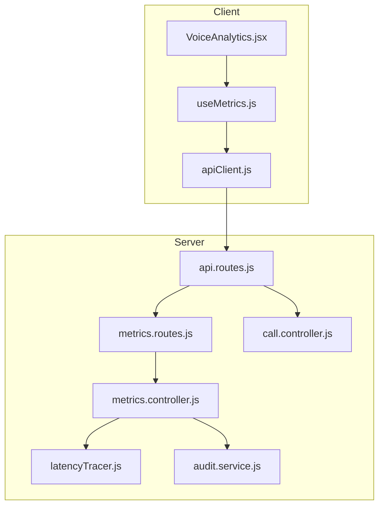
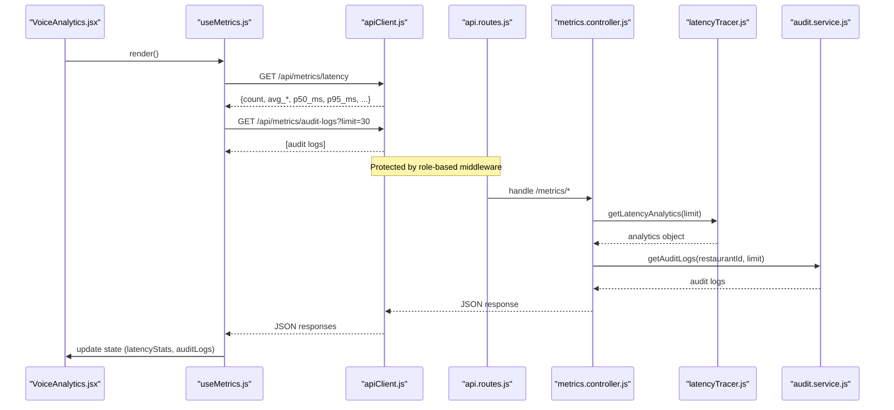
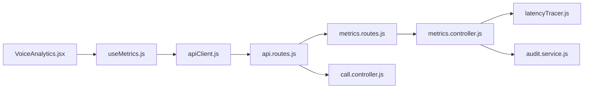

# Voice Analytics Dashboard

<cite>
**Referenced Files in This Document**
- [VoiceAnalytics.jsx](file://client/src/components/VoiceAnalytics.jsx)
- [useMetrics.js](file://client/src/hooks/useMetrics.js)
- [metrics.controller.js](file://server/src/controllers/metrics.controller.js)
- [metrics.routes.js](file://server/src/routes/metrics.routes.js)
- [latencyTracer.js](file://server/src/services/latencyTracer.js)
- [audit.service.js](file://server/src/services/audit.service.js)
- [api.routes.js](file://server/src/routes/api.routes.js)
- [call.controller.js](file://server/src/controllers/call.controller.js)
- [LiveCallMonitor.jsx](file://client/src/components/LiveCallMonitor.jsx)
- [apiClient.js](file://client/src/services/apiClient.js)
</cite>

## Table of Contents
1. [Introduction](#introduction)
2. [Project Structure](#project-structure)
3. [Core Components](#core-components)
4. [Architecture Overview](#architecture-overview)
5. [Detailed Component Analysis](#detailed-component-analysis)
6. [Dependency Analysis](#dependency-analysis)
7. [Performance Considerations](#performance-considerations)
8. [Troubleshooting Guide](#troubleshooting-guide)
9. [Conclusion](#conclusion)
10. [Appendices](#appendices)

## Introduction
This document explains the VoiceAnalytics component and its supporting backend services that provide performance metrics, latency profiling, queue health, and audit trails for voice call operations. It covers data flows from real-time telemetry to dashboard UI, aggregation patterns, and how to extend the system with charts, exports, and reporting features.

## Project Structure
The VoiceAnalytics feature spans client and server layers:
- Client: React component renders KPIs and tables; a custom hook fetches metrics via REST; an API client handles auth and token refresh.
- Server: Express routes expose metrics endpoints; controllers delegate to services that compute analytics and query databases; a latency tracer records turn-level timings and persists them; an audit service maintains tamper-evident logs.

**Diagram sources**
- [VoiceAnalytics.jsx:1-159](file://client/src/components/VoiceAnalytics.jsx#L1-L159)
- [useMetrics.js:1-73](file://client/src/hooks/useMetrics.js#L1-L73)
- [apiClient.js:68-128](file://client/src/services/apiClient.js#L68-L128)
- [api.routes.js:1-119](file://server/src/routes/api.routes.js#L1-L119)
- [metrics.routes.js:1-8](file://server/src/routes/metrics.routes.js#L1-L8)
- [metrics.controller.js:1-29](file://server/src/controllers/metrics.controller.js#L1-L29)
- [latencyTracer.js:1-133](file://server/src/services/latencyTracer.js#L1-L133)
- [audit.service.js:1-142](file://server/src/services/audit.service.js#L1-L142)
- [call.controller.js:1-114](file://server/src/controllers/call.controller.js#L1-L114)

**Section sources**
- [VoiceAnalytics.jsx:1-159](file://client/src/components/VoiceAnalytics.jsx#L1-L159)
- [useMetrics.js:1-73](file://client/src/hooks/useMetrics.js#L1-L73)
- [api.routes.js:1-119](file://server/src/routes/api.routes.js#L1-L119)

## Core Components
- VoiceAnalytics (UI): Displays latency percentiles, per-stage averages, total samples, background worker queue depths, and state transition audit logs. Provides manual refresh.
- useMetrics (hook): Polls metrics endpoints every 6 seconds, aggregates latency stats, queue stats, audit logs, and engine status into local state.
- Metrics controller and routes: Expose /api/metrics/latency and /api/metrics/audit-logs under protected routes.
- Latency tracer: Records stage durations per turn, computes percentiles, and persists to database.
- Audit service: Maintains cryptographic hash chain of state transitions and exposes recent logs.
- Call controller: Aggregates operational stats like total calls, active calls, orders, revenue, and average latency.

Key responsibilities:
- Real-time updates: The hook polls periodically; LiveCallMonitor also polls sessions and calls for live view.
- Data aggregation: Percentile calculations and averages are computed server-side from persisted turn metrics.
- Security: Protected routes enforce roles; tenant/restaurant scoping is enforced in controllers.

**Section sources**
- [VoiceAnalytics.jsx:1-159](file://client/src/components/VoiceAnalytics.jsx#L1-L159)
- [useMetrics.js:1-73](file://client/src/hooks/useMetrics.js#L1-L73)
- [metrics.controller.js:1-29](file://server/src/controllers/metrics.controller.js#L1-L29)
- [latencyTracer.js:1-133](file://server/src/services/latencyTracer.js#L1-L133)
- [audit.service.js:1-142](file://server/src/services/audit.service.js#L1-L142)
- [call.controller.js:1-114](file://server/src/controllers/call.controller.js#L1-L114)

## Architecture Overview
End-to-end flow for latency metrics:
- Client uses useMetrics to poll /api/metrics/latency and /api/metrics/audit-logs.
- Server routes protect these endpoints and delegate to metrics controller.
- Controller queries latencyTracer for aggregated analytics and audit.service for logs.
- LatencyTracer reads persisted turn_metrics rows and computes percentiles and averages.
- AuditService returns recent immutable audit entries.

**Diagram sources**
- [useMetrics.js:35-59](file://client/src/hooks/useMetrics.js#L35-L59)
- [apiClient.js:68-128](file://client/src/services/apiClient.js#L68-L128)
- [api.routes.js:25-36](file://server/src/routes/api.routes.js#L25-L36)
- [metrics.controller.js:9-28](file://server/src/controllers/metrics.controller.js#L9-L28)
- [latencyTracer.js:95-132](file://server/src/services/latencyTracer.js#L95-L132)
- [audit.service.js:79-91](file://server/src/services/audit.service.js#L79-L91)

## Detailed Component Analysis

### VoiceAnalytics Component
- Displays KPI cards for P50/P95 latency, per-stage averages, and sample count.
- Shows background worker queue health (active, pending, dead-letter counts).
- Renders audit trail table with timestamps, actions, resources, actors, and state changes.
- Supports manual refresh via refreshMetrics.

Data model usage:
- latencyStats fields: count, avg_total_ms, avg_stt_ms, avg_llm_ms, avg_tts_ms, p50_ms, p95_ms, p99_ms, recent_turns.
- queueStats keys: notifications, dispatch, recordings; each with active, pending, dlqCount.
- auditLogs array: id, created_at, action, resource_type, resource_id, actor_type, actor_id, after_state.

Real-time behavior:
- Auto-refresh every 6 seconds via interval in useMetrics.
- Manual refresh button triggers immediate re-fetch.

**Section sources**
- [VoiceAnalytics.jsx:15-156](file://client/src/components/VoiceAnalytics.jsx#L15-L156)
- [useMetrics.js:14-69](file://client/src/hooks/useMetrics.js#L14-L69)

### useMetrics Hook
Responsibilities:
- Fetch latency analytics, queue stats, audit logs, and engine status concurrently.
- Manage loading state and periodic polling.
- Provide refresh function for manual updates.

Error handling:
- Graceful fallbacks when endpoints fail; console warnings logged.
- Loading flag ensures UI reflects data fetching state.

Polling strategy:
- Initial fetch on mount.
- Interval set to 6 seconds for continuous updates.

**Section sources**
- [useMetrics.js:1-73](file://client/src/hooks/useMetrics.js#L1-L73)

### Metrics Controller and Routes
Routes:
- Protected under role-based middleware; accessible to restaurant managers and admins.
- Endpoints: GET /api/metrics/latency, GET /api/metrics/audit-logs.

Controller logic:
- getLatencyMetrics: parses limit parameter, delegates to latencyTracer, returns analytics.
- getAuditHistory: resolves tenant context, limits results, returns audit logs.

Security:
- Enforced by api.routes.js using requireRole middleware.

**Section sources**
- [metrics.routes.js:1-8](file://server/src/routes/metrics.routes.js#L1-L8)
- [metrics.controller.js:1-29](file://server/src/controllers/metrics.controller.js#L1-L29)
- [api.routes.js:25-36](file://server/src/routes/api.routes.js#L25-L36)

### Latency Tracer Service
Tracking:
- startTurnTrace initializes a trace per session with stage counters.
- recordTurnStage updates stage durations and metadata.
- finishTurnTrace computes totals, persists to turn_metrics, and cleans up.

Aggregation:
- getLatencyAnalytics queries recent rows, sorts totals, computes P50/P95/P99, averages, and includes recent turns.

Persistence:
- Asynchronous DB insert with error logging to avoid blocking critical paths.

Complexity:
- Sorting totals for percentiles is O(n log n) where n is the number of rows fetched (bounded by limit).

**Section sources**
- [latencyTracer.js:12-90](file://server/src/services/latencyTracer.js#L12-L90)
- [latencyTracer.js:95-132](file://server/src/services/latencyTracer.js#L95-L132)

### Audit Service
Features:
- Cryptographic hash chain linking each audit block to previous block.
- Record audit events with before/after states and metadata.
- Retrieve recent logs scoped by restaurant.
- Verify integrity of the entire chain.

Integrity verification:
- Iterates through ordered rows, recomputes hashes, and validates linkage.

**Section sources**
- [audit.service.js:7-10](file://server/src/services/audit.service.js#L7-L10)
- [audit.service.js:19-77](file://server/src/services/audit.service.js#L19-L77)
- [audit.service.js:79-91](file://server/src/services/audit.service.js#L79-L91)
- [audit.service.js:96-141](file://server/src/services/audit.service.js#L96-L141)

### Call Stats and Live Monitoring
Operational stats:
- getStats aggregates total calls, active calls, orders, confirmed orders, revenue, and average latency scoped by tenant/restaurant.

Live monitoring:
- LiveCallMonitor polls /api/calls and /api/sessions to show active sessions, call history, and audio playback.
- Uses direct fetch without token rotation; suitable for internal dashboards or when integrated with auth.

**Section sources**
- [call.controller.js:22-44](file://server/src/controllers/call.controller.js#L22-L44)
- [call.controller.js:46-89](file://server/src/controllers/call.controller.js#L46-L89)
- [LiveCallMonitor.jsx:10-32](file://client/src/components/LiveCallMonitor.jsx#L10-L32)
- [LiveCallMonitor.jsx:113-205](file://client/src/components/LiveCallMonitor.jsx#L113-L205)

## Dependency Analysis
Component coupling:
- VoiceAnalytics depends on useMetrics for data; useMetrics depends on apiClient for authenticated requests.
- Server routes depend on middleware for authorization; controllers depend on services for business logic.
- LatencyTracer depends on DB layer; AuditService depends on DB and crypto utilities.

External integrations:
- Database persistence for turn_metrics and audit_logs.
- Role-based access control for protected routes.

Potential circular dependencies:
- None observed between modules; clear separation between routes, controllers, and services.

**Diagram sources**
- [VoiceAnalytics.jsx:1-159](file://client/src/components/VoiceAnalytics.jsx#L1-L159)
- [useMetrics.js:1-73](file://client/src/hooks/useMetrics.js#L1-L73)
- [apiClient.js:68-128](file://client/src/services/apiClient.js#L68-L128)
- [api.routes.js:1-119](file://server/src/routes/api.routes.js#L1-L119)
- [metrics.routes.js:1-8](file://server/src/routes/metrics.routes.js#L1-L8)
- [metrics.controller.js:1-29](file://server/src/controllers/metrics.controller.js#L1-L29)
- [latencyTracer.js:1-133](file://server/src/services/latencyTracer.js#L1-L133)
- [audit.service.js:1-142](file://server/src/services/audit.service.js#L1-L142)
- [call.controller.js:1-114](file://server/src/controllers/call.controller.js#L1-L114)

**Section sources**
- [api.routes.js:25-36](file://server/src/routes/api.routes.js#L25-L36)
- [metrics.controller.js:1-29](file://server/src/controllers/metrics.controller.js#L1-L29)

## Performance Considerations
- Polling interval: 6 seconds balances freshness and load; adjust based on traffic and SLA targets.
- Limit parameters: Controllers clamp limits to prevent heavy queries; ensure client passes reasonable values.
- Percentile computation: Sorting totals is bounded by limit; consider caching or materialized views for large datasets.
- Background queues: Monitor DLQ counts to detect failures early; alert thresholds recommended.
- Audio playback: LiveCallMonitor streams audio directly; ensure storage paths exist and permissions are correct.

[No sources needed since this section provides general guidance]

## Troubleshooting Guide
Common issues and resolutions:
- Empty metrics: Ensure turn traces are started and finished during calls; verify DB inserts succeed.
- Audit logs missing: Confirm tenant_id and restaurant_id are present in audit recording calls; check DB constraints.
- Queue stats empty: Validate queue manager returns non-empty maps; check worker processes running.
- Auth errors: Use apiClient’s token refresh; if 401 persists, re-authenticate and obtain new ticket.
- Audio not found: Verify recording_url path exists; check file permissions and storage configuration.

Diagnostic steps:
- Check browser network tab for failed requests and payloads.
- Inspect server logs for latency tracer and audit service errors.
- Validate route protection and roles for accessing metrics endpoints.

**Section sources**
- [latencyTracer.js:64-86](file://server/src/services/latencyTracer.js#L64-L86)
- [audit.service.js:31-77](file://server/src/services/audit.service.js#L31-L77)
- [apiClient.js:89-119](file://client/src/services/apiClient.js#L89-L119)
- [call.controller.js:91-113](file://server/src/controllers/call.controller.js#L91-L113)

## Conclusion
The VoiceAnalytics dashboard integrates real-time telemetry, latency profiling, queue health, and immutable audit trails to provide comprehensive insights into voice call performance. The architecture separates concerns across client hooks, server routes, controllers, and services, enabling scalable monitoring and extensibility for charts, exports, and reporting.

[No sources needed since this section summarizes without analyzing specific files]

## Appendices

### Data Aggregation Patterns
- Latency percentiles: Computed from sorted total_ms values; includes averages per stage.
- Queue health: Aggregated from in-memory queue manager; includes active, pending, and dead-letter counts.
- Audit logs: Scoped by restaurant; include before/after states and metadata; supports integrity verification.

**Section sources**
- [latencyTracer.js:95-132](file://server/src/services/latencyTracer.js#L95-L132)
- [audit.service.js:79-91](file://server/src/services/audit.service.js#L79-L91)

### Real-Time Metric Updates
- useMetrics polls every 6 seconds; LiveCallMonitor polls sessions and calls every 4 seconds.
- WebSocket integration available via useDashboardWs for event-driven updates (not used by VoiceAnalytics but available in app).

**Section sources**
- [useMetrics.js:56-60](file://client/src/hooks/useMetrics.js#L56-L60)
- [LiveCallMonitor.jsx:10-18](file://client/src/components/LiveCallMonitor.jsx#L10-L18)

### Historical Data Analysis
- Recent turns included in latency analytics for drill-down.
- Audit logs support time-bounded retrieval with limit parameter.

**Section sources**
- [latencyTracer.js:121-131](file://server/src/services/latencyTracer.js#L121-L131)
- [metrics.controller.js:19-28](file://server/src/controllers/metrics.controller.js#L19-L28)

### Chart Configuration Options
- Current implementation displays KPI cards and tables; chart libraries are not included in dependencies.
- To add charts, integrate a visualization library and bind data from latencyStats and queueStats.

[No sources needed since this section provides general guidance]

### Custom Chart Components
- Not implemented in current codebase; recommend creating reusable chart components bound to latencyStats and queueStats for trends and distributions.

[No sources needed since this section provides general guidance]

### Data Export Functionality
- No export endpoints currently exposed; consider adding CSV/JSON export for latency analytics and audit logs for BI tools.

[No sources needed since this section provides general guidance]

### Reporting Features for Business Intelligence
- Operational stats endpoint (/api/stats) provides high-level metrics for dashboards.
- Extend with time-series aggregation and rollups for historical reporting.

**Section sources**
- [call.controller.js:22-44](file://server/src/controllers/call.controller.js#L22-L44)