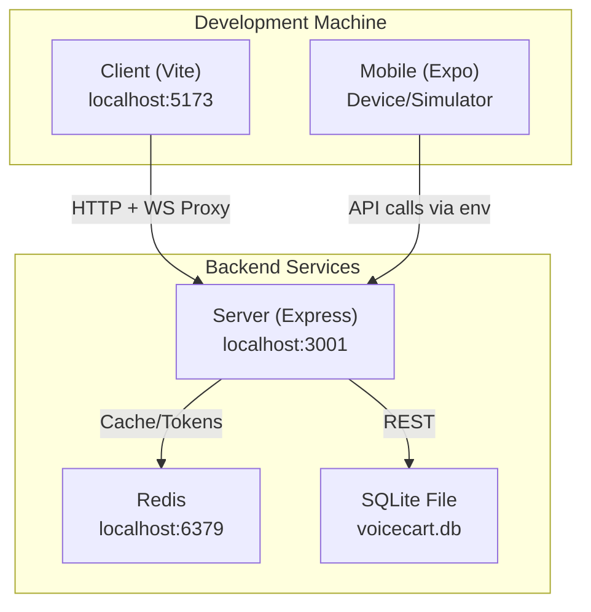
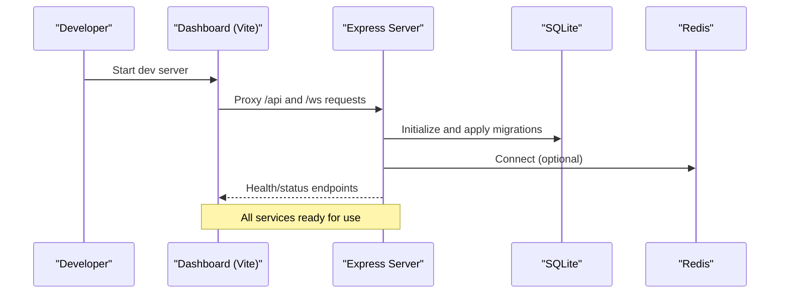
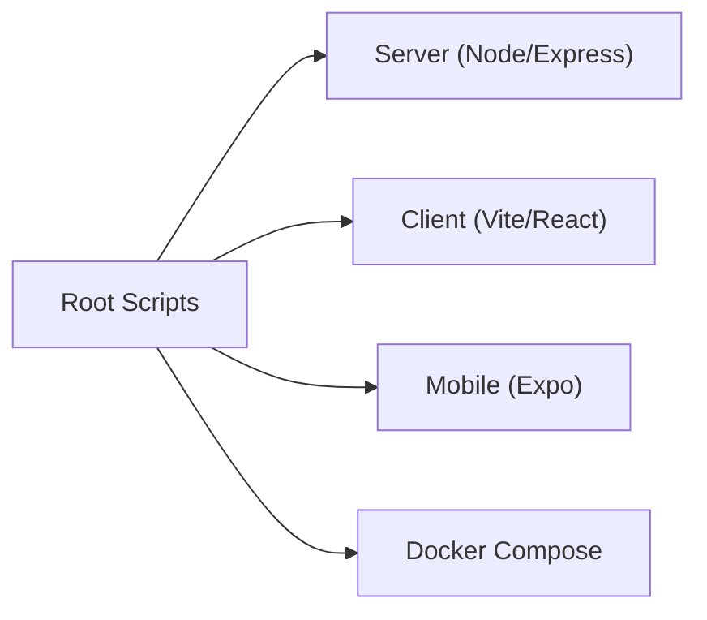

# Getting Started

<cite>
**Referenced Files in This Document**
- [package.json](file://package.json)
- [server/package.json](file://server/package.json)
- [client/package.json](file://client/package.json)
- [mobile/package.json](file://mobile/package.json)
- [docker-compose.yml](file://docker-compose.yml)
- [Dockerfile](file://Dockerfile)
- [server/server.js](file://server/server.js)
- [server/src/config/env.js](file://server/src/config/env.js)
- [server/src/db.js](file://server/src/db.js)
- [server/src/infra/redisClient.js](file://server/src/infra/redisClient.js)
- [client/vite.config.js](file://client/vite.config.js)
- [client/src/services/apiClient.js](file://client/src/services/apiClient.js)
</cite>

## Table of Contents
1. Introduction
2. Project Structure
3. Core Components
4. Architecture Overview
5. Detailed Component Analysis
6. Dependency Analysis
7. Performance Considerations
8. Troubleshooting Guide
9. Conclusion

## Introduction
Inkiro Voice Commerce Platform is a bilingual voice telephony and ONDC food ordering system. It provides:
- A Node.js backend that handles REST APIs, WebSocket streams for media/audio, and integrations with telephony providers and AI services.
- A React dashboard client for operations, monitoring, and order management.
- A mobile app (Expo/React Native) for on-device voice interactions and ordering.
- Docker-based orchestration to run the server and Redis together, with SQLite used by default for development.

This guide helps you set up the development environment, configure essential services, run all components, and verify everything works end-to-end.

## Project Structure
The repository is organized into four main areas:
- server: Express API, WebSockets, database initialization, migrations, and integrations.
- client: Vite + React dashboard with proxy configuration to the backend.
- mobile: Expo/React Native app for voice sessions and ordering.
- security-suite: Optional security auditing tools (not required for basic setup).

**Diagram sources**
- [client/vite.config.js:6-21](file://client/vite.config.js#L6-L21)
- [server/server.js:18-46](file://server/server.js#L18-L46)
- [server/src/db.js:11-43](file://server/src/db.js#L11-L43)
- [server/src/infra/redisClient.js:82-126](file://server/src/infra/redisClient.js#L82-L126)

**Section sources**
- [package.json:6-20](file://package.json#L6-L20)
- [server/package.json:7-11](file://server/package.json#L7-L11)
- [client/package.json:6-10](file://client/package.json#L6-L10)
- [mobile/package.json:5-10](file://mobile/package.json#L5-L10)

## Core Components
- Server: Boots HTTP server, mounts WebSocket endpoints, initializes database, and exposes REST APIs.
- Client: Vite dev server proxies /api and WebSocket paths to the backend.
- Mobile: Expo app runs locally or via tunnel; communicates with backend via configured base URL.
- Data Layer: SQLite file for development; optional Redis for caching/sessions.

Key runtime behaviors:
- The server prints available endpoints including REST, media stream, web stream, and dashboard WebSocket.
- Database initialization applies migrations and seeds demo data.
- Redis is optional in development; mandatory in production if used.

**Section sources**
- [server/server.js:18-46](file://server/server.js#L18-L46)
- [server/src/db.js:11-43](file://server/src/db.js#L11-L43)
- [server/src/infra/redisClient.js:82-126](file://server/src/infra/redisClient.js#L82-L126)

## Architecture Overview
The platform uses a layered architecture:
- Frontend layer: Dashboard (React/Vite) and Mobile (Expo/React Native).
- API/WebSocket layer: Express server with route handlers and WebSocket coordinators.
- Integration layer: Telephony (Twilio/Exotel), AI providers (LLM, STT, TTS), and ONDC.
- Storage layer: SQLite (development) and Redis (optional cache/session store).

**Diagram sources**
- [client/vite.config.js:6-21](file://client/vite.config.js#L6-L21)
- [server/server.js:18-46](file://server/server.js#L18-L46)
- [server/src/db.js:11-43](file://server/src/db.js#L11-L43)
- [server/src/infra/redisClient.js:82-126](file://server/src/infra/redisClient.js#L82-L126)

## Detailed Component Analysis

### Environment and Configuration
- The server validates environment variables at startup using a schema. Required keys include port, environment mode, JWT secret, encryption key, and optional Redis URL.
- For local development, defaults are provided for many values; ensure CORS origins include your client’s dev server.
- Production requires explicit secrets and a valid REDIS_URL when Redis is enabled.

Environment variables of interest:
- PORT, NODE_ENV, JWT_SECRET, ENCRYPTION_KEY
- DB_PATH (default SQLite file path)
- REDIS_URL (optional in dev, required in prod if used)
- PUBLIC_URL, CORS_ORIGINS
- AI provider keys (e.g., GEMINI_API_KEY, SARVAM_API_KEY, GROQ_API_KEY)

**Section sources**
- [server/src/config/env.js:3-24](file://server/src/config/env.js#L3-L24)
- [server/src/config/env.js:28-40](file://server/src/config/env.js#L28-L40)

### Database Setup
- On boot, the server connects to SQLite (path from DB_PATH), enables WAL and foreign keys, runs migrations, and seeds demo data.
- If Redis is configured, it will be used for caching/tickets; otherwise an in-memory adapter is used in development.

Verification steps:
- Ensure the SQLite file is created and accessible.
- Confirm migrations run without errors during startup.

**Section sources**
- [server/src/db.js:11-43](file://server/src/db.js#L11-L43)
- [server/src/infra/redisClient.js:82-126](file://server/src/infra/redisClient.js#L82-L126)

### Telephony Providers (Twilio/Exotel)
- The server includes telephony-related routes and controllers. Configure provider credentials through environment variables and service settings as needed.
- When running behind a public URL (for Twilio callbacks), set PUBLIC_URL accordingly so inbound webhooks reach your server.

Notes:
- Media streaming and call handling rely on WebSocket endpoints exposed by the server.
- Ensure firewall rules allow inbound traffic to the server port if exposing publicly.

**Section sources**
- [server/server.js:32-46](file://server/server.js#L32-L46)
- [server/src/config/env.js:13-14](file://server/src/config/env.js#L13-L14)

### AI Services (LLM, STT, TTS)
- The server supports multiple AI providers. Set provider-specific keys (e.g., Gemini, Sarvam, Groq) to enable features like speech-to-text, text-to-speech, and LLM-driven dialogue.
- Provider selection can be controlled via environment variables; defaults may vary by environment.

**Section sources**
- [server/src/config/env.js:20-24](file://server/src/config/env.js#L20-L24)
- [server/server.js:43-45](file://server/server.js#L43-L45)

### Client (Dashboard) Setup
- The Vite dev server listens on port 5173 and proxies API and WebSocket requests to the backend at localhost:3001.
- Authentication flows and token refresh are handled by the client API client.

Steps:
- Install dependencies and start the dev server.
- Open the dashboard in your browser and verify connectivity to the backend.

**Section sources**
- [client/vite.config.js:6-21](file://client/vite.config.js#L6-L21)
- [client/src/services/apiClient.js:68-127](file://client/src/services/apiClient.js#L68-L127)

### Mobile App Setup
- Use Expo to run the mobile app on device or simulator. You can run locally or via a tunnel for remote access.
- Configure the backend base URL in the mobile app environment or settings to point to your running server.

Steps:
- Install dependencies and start Expo.
- Run on Android/iOS or web as needed.
- Verify voice session and API calls to the backend.

**Section sources**
- [mobile/package.json:5-10](file://mobile/package.json#L5-L10)

### Docker and Compose
- Use Docker Compose to run the server and Redis together. The compose file defines volumes for data and recordings and sets environment variables for production-like behavior.
- The Dockerfile builds the frontend assets and packages the server for production.

Steps:
- Build and start services with Docker Compose.
- Verify health checks for the server and Redis.

**Section sources**
- [docker-compose.yml:3-45](file://docker-compose.yml#L3-L45)
- [Dockerfile:3-34](file://Dockerfile#L3-L34)

## Dependency Analysis
Top-level scripts coordinate running each component:
- Root scripts provide unified commands to start server, client, mobile, and tests.
- Each subproject has its own package.json with specific scripts for development and build.

**Diagram sources**
- [package.json:6-20](file://package.json#L6-L20)
- [server/package.json:7-11](file://server/package.json#L7-L11)
- [client/package.json:6-10](file://client/package.json#L6-L10)
- [mobile/package.json:5-10](file://mobile/package.json#L5-L10)

**Section sources**
- [package.json:6-20](file://package.json#L6-L20)
- [server/package.json:7-11](file://server/package.json#L7-L11)
- [client/package.json:6-10](file://client/package.json#L6-L10)
- [mobile/package.json:5-10](file://mobile/package.json#L5-L10)

## Performance Considerations
- Enable SQLite WAL mode for better concurrency during development.
- Use Redis for caching and session storage in production to reduce database load.
- Keep AI provider calls efficient; consider batching and caching where appropriate.
- Monitor slow queries and adjust indexes or queries based on usage patterns.

[No sources needed since this section provides general guidance]

## Troubleshooting Guide
Common issues and resolutions:
- Environment validation fails at startup:
  - Ensure required keys (JWT_SECRET, ENCRYPTION_KEY) meet minimum length requirements.
  - Validate CORS_ORIGINS includes your client’s dev server URL.
- Redis connection errors:
  - In development, Redis is optional; missing REDIS_URL falls back to in-memory.
  - In production, REDIS_URL must be set and reachable.
- Client cannot reach backend:
  - Confirm Vite proxy targets match your server’s host and port.
  - Check firewall and network settings if accessing remotely.
- Telephony webhooks not reaching server:
  - Set PUBLIC_URL to a publicly reachable address.
  - Ensure inbound ports are open and DNS resolves correctly.
- Database migration failures:
  - Review logs for SQL errors and ensure the SQLite file is writable.

Verification checklist:
- Start the server and confirm it prints available endpoints.
- Access the dashboard and verify API responses.
- Run the mobile app and test a voice session.
- If using Docker, check container health and logs.

**Section sources**
- [server/src/config/env.js:28-40](file://server/src/config/env.js#L28-L40)
- [server/src/infra/redisClient.js:82-126](file://server/src/infra/redisClient.js#L82-L126)
- [client/vite.config.js:6-21](file://client/vite.config.js#L6-L21)
- [server/server.js:18-46](file://server/server.js#L18-L46)

## Conclusion
You now have the essentials to install, configure, and run the Inkiro Voice Commerce Platform locally. Use Docker Compose for a consistent environment, configure telephony and AI providers as needed, and leverage the provided npm scripts to manage development workflows. Refer to the troubleshooting section for common issues and verification steps to ensure everything is working correctly.

[No sources needed since this section summarizes without analyzing specific files]