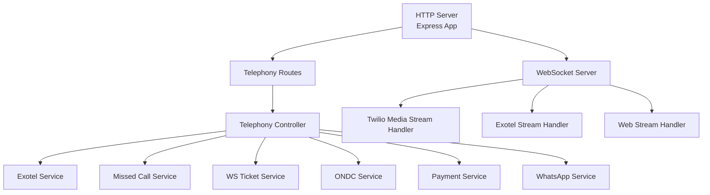
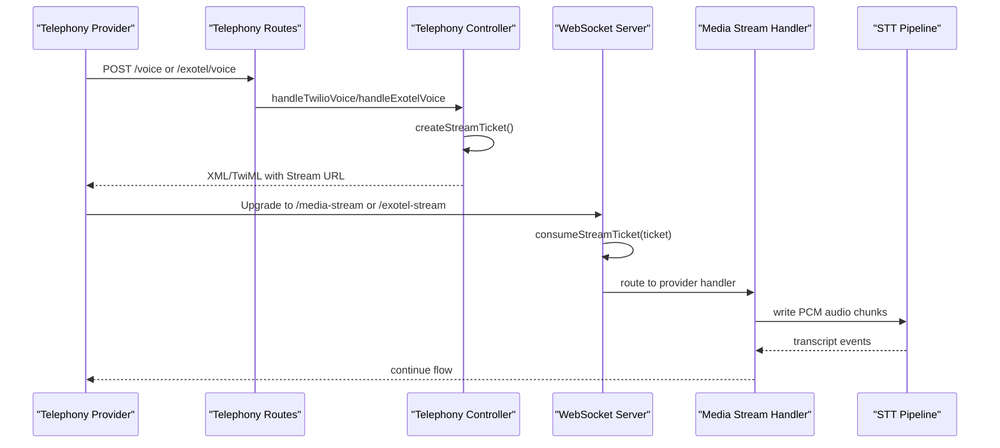
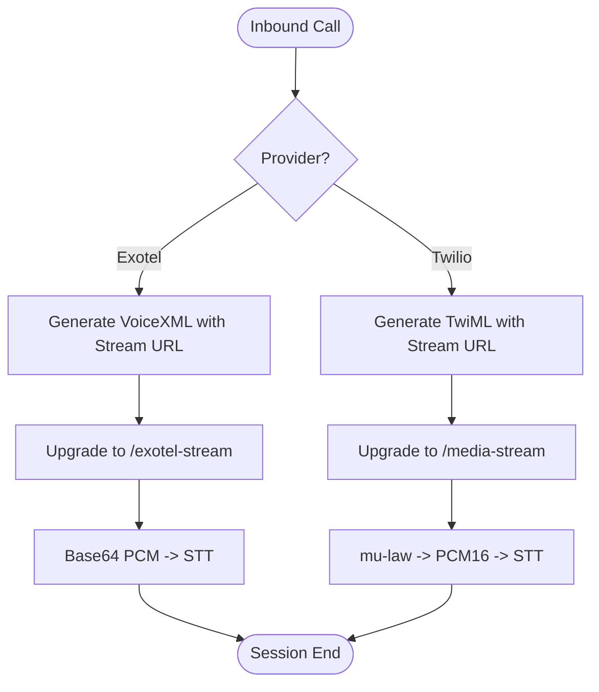
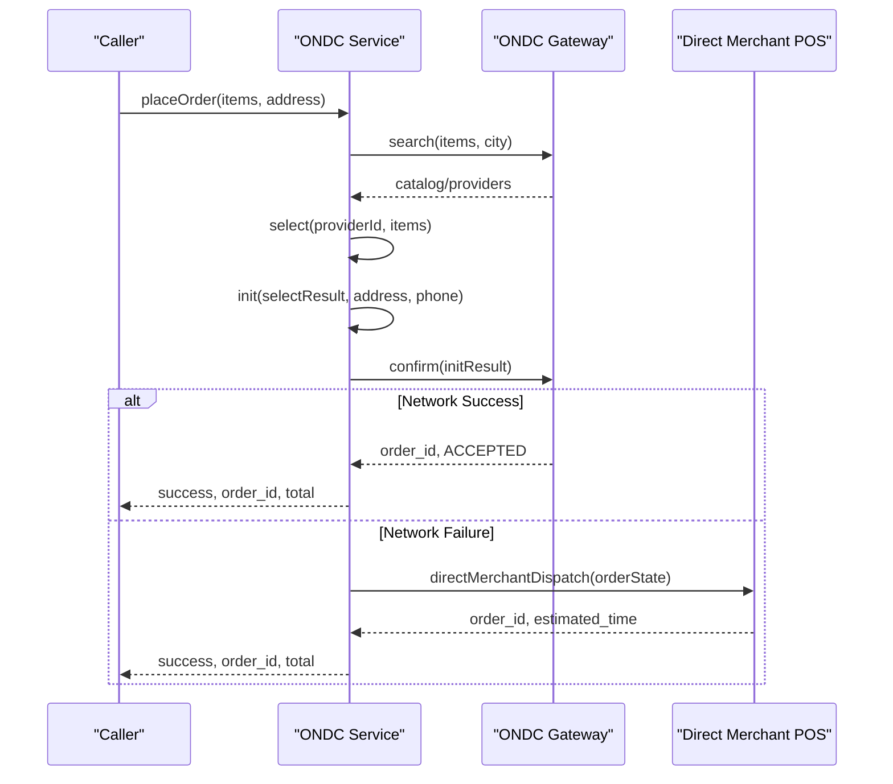
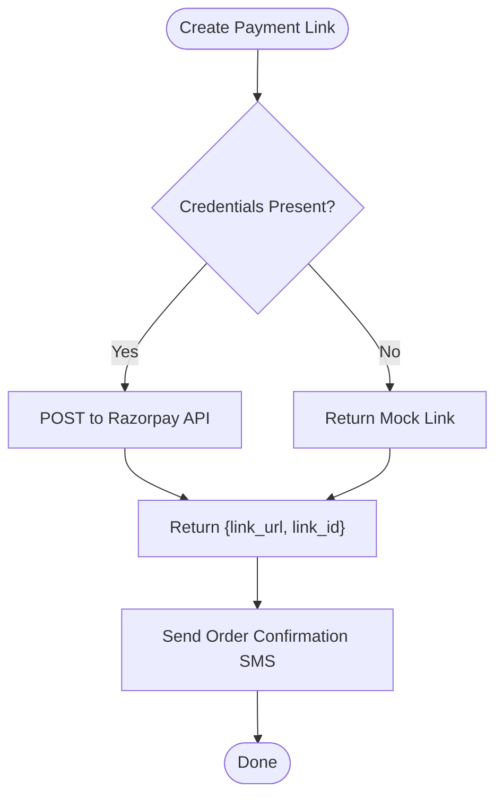
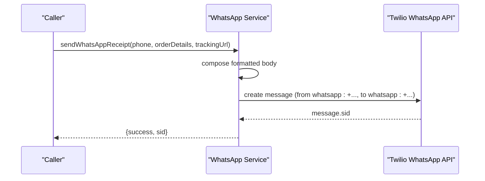
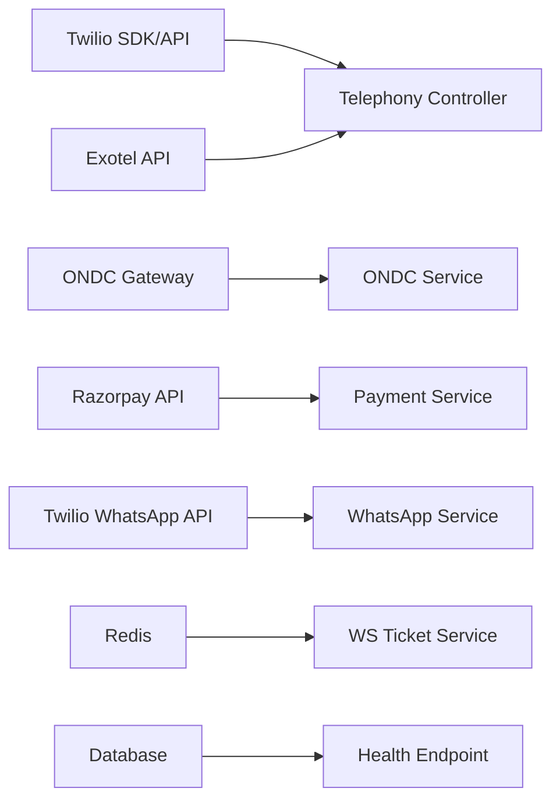

# Integration Services

<cite>
**Referenced Files in This Document**
- [app.js](file://server/src/app.js)
- [env.js](file://server/src/config/env.js)
- [telephony.routes.js](file://server/src/routes/telephony.routes.js)
- [telephony.controller.js](file://server/src/controllers/telephony.controller.js)
- [exotelService.js](file://server/src/services/exotelService.js)
- [ondcService.js](file://server/src/services/ondcService.js)
- [paymentService.js](file://server/src/services/paymentService.js)
- [whatsappService.js](file://server/src/services/whatsappService.js)
- [missedCallService.js](file://server/src/services/missedCallService.js)
- [wsServer.js](file://server/src/websocket/wsServer.js)
- [mediaStreamHandler.js](file://server/src/websocket/mediaStreamHandler.js)
- [exotelStreamHandler.js](file://server/src/websocket/exotelStreamHandler.js)
- [webStreamHandler.js](file://server/src/websocket/webStreamHandler.js)
- [wsTicketService.js](file://server/src/services/wsTicketService.js)
- [telephonyAuth.middleware.js](file://server/src/middleware/telephonyAuth.middleware.js)
</cite>

## Table of Contents
1. Introduction
2. Project Structure
3. Core Components
4. Architecture Overview
5. Detailed Component Analysis
6. Dependency Analysis
7. Performance Considerations
8. Troubleshooting Guide
9. Conclusion

## Introduction
This document explains how the Inkiro platform integrates with external services to support telephony, marketplace connectivity, payments, and messaging. It covers:
- Telephony provider integration with Twilio and Exotel (webhooks, media streaming, call routing, missed-call callbacks, DTMF quick-reorder)
- ONDC (Open Network for Digital Commerce) integration for marketplace search, selection, initialization, and order confirmation with a direct merchant fallback
- Payment gateway integration using Razorpay payment links and SMS notifications via Twilio
- WhatsApp messaging for rich order receipts and location pin-drop prompts via Twilio WhatsApp API
- Service abstraction patterns, error handling strategies, and fallback mechanisms
- Configuration management, credential handling, and monitoring of service health

## Project Structure
The integration surface is implemented in the server layer:
- HTTP routes expose webhook endpoints for telephony providers and internal APIs
- Controllers orchestrate provider-specific logic and session setup
- Services encapsulate external integrations (Exotel, ONDC, Payments, WhatsApp, Missed Calls)
- WebSocket server coordinates real-time media streams from telephony and web clients
- Middleware secures inbound webhooks and validates signatures
- Environment configuration enforces required settings at startup

**Diagram sources**
- [app.js:15-99](file://server/src/app.js#L15-L99)
- [telephony.routes.js:1-23](file://server/src/routes/telephony.routes.js#L1-L23)
- [telephony.controller.js:15-41](file://server/src/controllers/telephony.controller.js#L15-L41)
- [exotelService.js:17-83](file://server/src/services/exotelService.js#L17-L83)
- [missedCallService.js:21-48](file://server/src/services/missedCallService.js#L21-L48)
- [wsServer.js:17-160](file://server/src/websocket/wsServer.js#L17-L160)
- [mediaStreamHandler.js:7-55](file://server/src/websocket/mediaStreamHandler.js#L7-L55)
- [exotelStreamHandler.js:9-67](file://server/src/websocket/exotelStreamHandler.js#L9-L67)
- [webStreamHandler.js:7-79](file://server/src/websocket/webStreamHandler.js#L7-L79)
- [ondcService.js:20-141](file://server/src/services/ondcService.js#L20-L141)
- [paymentService.js:25-61](file://server/src/services/paymentService.js#L25-L61)
- [whatsappService.js:24-109](file://server/src/services/whatsappService.js#L24-L109)

**Section sources**
- [app.js:15-99](file://server/src/app.js#L15-L99)
- [telephony.routes.js:1-23](file://server/src/routes/telephony.routes.js#L1-L23)

## Core Components
- Telephony Webhooks: Secure inbound handlers for Exotel and Twilio that generate XML responses and establish secure media stream sessions
- Media Streaming: Provider-specific WebSocket handlers that convert and forward audio to the speech-to-text pipeline
- ONDC Marketplace: Search, select, initialize, and confirm orders over the Beckn protocol with a direct merchant fallback
- Payments: Create payment links and send SMS notifications; mock implementations for development
- WhatsApp Messaging: Send rich order receipts and pin-drop prompts via Twilio WhatsApp API
- Security & Auth: Signature verification for provider webhooks and single-use tickets for WebSocket upgrades
- Configuration: Strict environment validation and centralized access to keys and URLs

**Section sources**
- [telephony.controller.js:15-41](file://server/src/controllers/telephony.controller.js#L15-L41)
- [mediaStreamHandler.js:7-55](file://server/src/websocket/mediaStreamHandler.js#L7-L55)
- [exotelStreamHandler.js:9-67](file://server/src/websocket/exotelStreamHandler.js#L9-L67)
- [ondcService.js:20-141](file://server/src/services/ondcService.js#L20-L141)
- [paymentService.js:25-61](file://server/src/services/paymentService.js#L25-L61)
- [whatsappService.js:24-109](file://server/src/services/whatsappService.js#L24-L109)
- [telephonyAuth.middleware.js:10-91](file://server/src/middleware/telephonyAuth.middleware.js#L10-L91)
- [env.js:3-40](file://server/src/config/env.js#L3-L40)

## Architecture Overview
The system exposes webhook endpoints for telephony providers and processes incoming calls by generating XML/TwiML that instructs providers to stream media to secure WebSocket endpoints. The WebSocket server authenticates connections using short-lived tickets stored in Redis and routes them to provider-specific handlers. These handlers normalize audio formats and feed them into the STT pipeline. For commerce flows, ONDC provides marketplace connectivity with a fallback to direct merchant dispatch. Payments are initiated via Razorpay links and confirmed through callbacks, while notifications are sent via SMS and WhatsApp.

**Diagram sources**
- [telephony.routes.js:8-14](file://server/src/routes/telephony.routes.js#L8-L14)
- [telephony.controller.js:15-41](file://server/src/controllers/telephony.controller.js#L15-L41)
- [wsServer.js:99-146](file://server/src/websocket/wsServer.js#L99-L146)
- [mediaStreamHandler.js:21-55](file://server/src/websocket/mediaStreamHandler.js#L21-L55)
- [exotelStreamHandler.js:23-57](file://server/src/websocket/exotelStreamHandler.js#L23-L57)

## Detailed Component Analysis

### Telephony Integration: Twilio and Exotel
- Webhook Handling:
  - Exotel inbound voice generates VoiceXML with a bidirectional stream to a secured WebSocket endpoint
  - Twilio inbound voice returns TwiML with a greeting and a Stream connection to a secured WebSocket endpoint
  - Both controllers create single-use stream tickets and attach caller metadata for authentication
- Media Stream Processing:
  - Twilio handler converts mu-law audio to PCM16 before writing to STT
  - Exotel handler forwards base64-encoded PCM directly to STT
  - Both handlers initialize sessions, send greetings, and end sessions on stop/close
- Call Routing and Quick Actions:
  - Missed-call callback triggers outbound calls via Twilio with status callbacks
  - DTMF quick-reorder IVR listens for digit “1” to repeat last order and continues to AI otherwise
- Security:
  - Twilio HMAC-SHA1 signature verification
  - Exotel token/header verification
  - Dev bypass for local testing when configured

**Diagram sources**
- [telephony.controller.js:15-41](file://server/src/controllers/telephony.controller.js#L15-L41)
- [exotelService.js:17-33](file://server/src/services/exotelService.js#L17-L33)
- [mediaStreamHandler.js:40-49](file://server/src/websocket/mediaStreamHandler.js#L40-L49)
- [exotelStreamHandler.js:45-57](file://server/src/websocket/exotelStreamHandler.js#L45-L57)

**Section sources**
- [telephony.controller.js:15-41](file://server/src/controllers/telephony.controller.js#L15-L41)
- [exotelService.js:17-83](file://server/src/services/exotelService.js#L17-L83)
- [mediaStreamHandler.js:7-55](file://server/src/websocket/mediaStreamHandler.js#L7-L55)
- [exotelStreamHandler.js:9-67](file://server/src/websocket/exotelStreamHandler.js#L9-L67)
- [missedCallService.js:21-105](file://server/src/services/missedCallService.js#L21-L105)
- [telephonyAuth.middleware.js:10-91](file://server/src/middleware/telephonyAuth.middleware.js#L10-L91)

### ONDC Integration: Marketplace Connectivity and Order Fulfillment
- Flow:
  - Search items across the network with context and intent
  - Select items from a provider catalog
  - Initialize order with delivery details and billing phone
  - Confirm order and return an order ID and status
- Fallback:
  - If ONDC network fails, falls back to direct merchant dispatch simulating POS integration
- Context:
  - Builds Beckn context with domain, country, city, BAP identifiers, timestamps, and TTL

**Diagram sources**
- [ondcService.js:20-141](file://server/src/services/ondcService.js#L20-L141)

**Section sources**
- [ondcService.js:20-141](file://server/src/services/ondcService.js#L20-L141)

### Payment Gateway Integration: Transaction Processing and Notifications
- Payment Links:
  - Creates Razorpay payment links with amount, currency, reference ID, customer contact, and callback URL
  - Returns short URL and link ID for tracking
- SMS Notifications:
  - Sends order confirmation SMS including order details and payment link
  - Uses Twilio client with account SID and auth token; mocks in development
- Error Handling:
  - Catches provider errors and logs them; returns mock results in dev mode

**Diagram sources**
- [paymentService.js:25-61](file://server/src/services/paymentService.js#L25-L61)
- [paymentService.js:69-89](file://server/src/services/paymentService.js#L69-L89)

**Section sources**
- [paymentService.js:25-113](file://server/src/services/paymentService.js#L25-L113)

### WhatsApp Messaging Service: Customer Notifications and Order Updates
- Receipts:
  - Composes rich messages with itemized lists, totals, delivery address, and optional tracking link
  - Sends via Twilio WhatsApp API with proper formatting and sender number
- Pin-Drop Prompts:
  - Sends a message prompting users to confirm their exact delivery location via a map link
- Fallback:
  - Logs mock messages when credentials are not configured

**Diagram sources**
- [whatsappService.js:24-109](file://server/src/services/whatsappService.js#L24-L109)

**Section sources**
- [whatsappService.js:24-109](file://server/src/services/whatsappService.js#L24-L109)

### Service Abstraction Patterns and Error Handling
- Provider Abstractions:
  - Separate services per provider (Exotel, ONDC, Payment, WhatsApp) with consistent interfaces
  - Unified session and ticketing layer for WebSocket upgrades
- Error Handling Strategies:
  - Try/catch around external calls with logging and graceful fallbacks
  - Mock modes for development when credentials are missing or invalid
  - Centralized error middleware for HTTP responses
- Fallback Mechanisms:
  - ONDC network failure falls back to direct merchant dispatch
  - Payment and messaging services fall back to mock outputs in dev
  - Telephony webhooks verify signatures and reject unauthorized requests

**Section sources**
- [exotelService.js:38-83](file://server/src/services/exotelService.js#L38-L83)
- [ondcService.js:114-161](file://server/src/services/ondcService.js#L114-L161)
- [paymentService.js:25-89](file://server/src/services/paymentService.js#L25-L89)
- [whatsappService.js:82-109](file://server/src/services/whatsappService.js#L82-L109)
- [telephonyAuth.middleware.js:58-91](file://server/src/middleware/telephonyAuth.middleware.js#L58-L91)

### Configuration Management and Credential Handling
- Environment Validation:
  - Startup-time schema validation ensures required keys and types
  - Defaults provided for non-production environments
- Credential Usage:
  - Provider credentials loaded from environment variables and used only where needed
  - Secrets never logged; only IDs or tokens partially masked in logs
- Health Monitoring:
  - Health endpoints expose readiness checks including database status
  - Correlation IDs enable tracing across requests

**Section sources**
- [env.js:3-40](file://server/src/config/env.js#L3-L40)
- [app.js:58-80](file://server/src/app.js#L58-L80)

## Dependency Analysis
External dependencies and their roles:
- Twilio: Voice webhooks, media streaming, missed-call callbacks, SMS, WhatsApp
- Exotel: Voice webhooks and AgentStream for India-compliant telephony
- ONDC Gateway: Marketplace search and order lifecycle
- Razorpay: Payment link creation
- Redis: Single-use tickets for WebSocket authentication
- Database: Readiness check and order persistence

**Diagram sources**
- [telephony.controller.js:15-41](file://server/src/controllers/telephony.controller.js#L15-L41)
- [exotelService.js:38-83](file://server/src/services/exotelService.js#L38-L83)
- [ondcService.js:20-141](file://server/src/services/ondcService.js#L20-L141)
- [paymentService.js:25-61](file://server/src/services/paymentService.js#L25-L61)
- [whatsappService.js:82-109](file://server/src/services/whatsappService.js#L82-L109)
- [wsTicketService.js:11-85](file://server/src/services/wsTicketService.js#L11-L85)
- [app.js:58-80](file://server/src/app.js#L58-L80)

**Section sources**
- [wsTicketService.js:11-85](file://server/src/services/wsTicketService.js#L11-L85)
- [app.js:58-80](file://server/src/app.js#L58-L80)

## Performance Considerations
- Audio Streaming:
  - Limit audio chunk accumulation to prevent memory growth
  - Convert codecs efficiently (mu-law to PCM16) before STT ingestion
- WebSocket Scaling:
  - Use single-use tickets with TTL to avoid long-lived unauthenticated connections
  - Heartbeat pings detect stale connections and terminate them
- External Calls:
  - Wrap provider calls in try/catch with timeouts in production to avoid blocking
  - Prefer asynchronous processing for non-critical paths (e.g., notifications)
- Caching:
  - Use Redis for short-lived tickets and distributed state to support multi-instance deployments

[No sources needed since this section provides general guidance]

## Troubleshooting Guide
Common issues and resolutions:
- Invalid webhook signatures:
  - Ensure correct provider tokens and headers are configured
  - Verify signature computation matches provider expectations
- WebSocket upgrade failures:
  - Confirm stream tickets are present and valid within TTL
  - Check CORS and allowed origins for browser-based streams
- Provider outages:
  - ONDC fallback to direct merchant dispatch ensures order continuity
  - Payment and messaging services fall back to mock outputs in development
- Health checks:
  - Use readiness endpoint to validate database connectivity and service status

**Section sources**
- [telephonyAuth.middleware.js:58-91](file://server/src/middleware/telephonyAuth.middleware.js#L58-L91)
- [wsServer.js:99-146](file://server/src/websocket/wsServer.js#L99-L146)
- [ondcService.js:114-161](file://server/src/services/ondcService.js#L114-L161)
- [paymentService.js:25-89](file://server/src/services/paymentService.js#L25-L89)
- [app.js:58-80](file://server/src/app.js#L58-L80)

## Conclusion
The Inkiro platform implements robust external service integrations with clear abstractions, secure webhook handling, resilient fallbacks, and comprehensive monitoring. Telephony flows integrate Twilio and Exotel with secure media streaming and quick reorder actions. ONDC enables marketplace connectivity with a reliable fallback to direct merchant dispatch. Payments and messaging provide flexible notification channels with development-friendly mocks. Configuration validation and health endpoints ensure operational reliability and observability.

[No sources needed since this section summarizes without analyzing specific files]