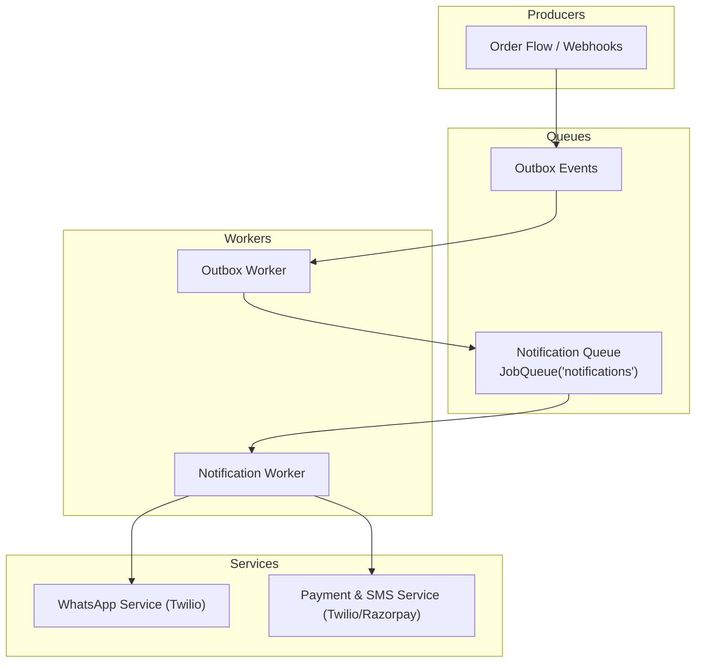
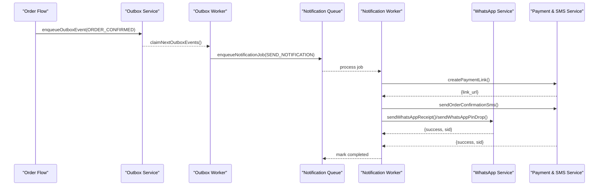
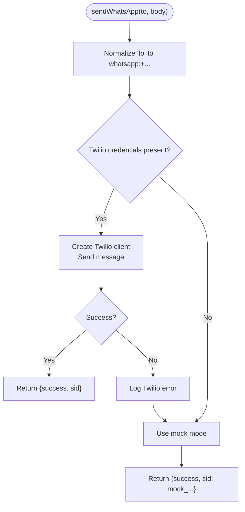
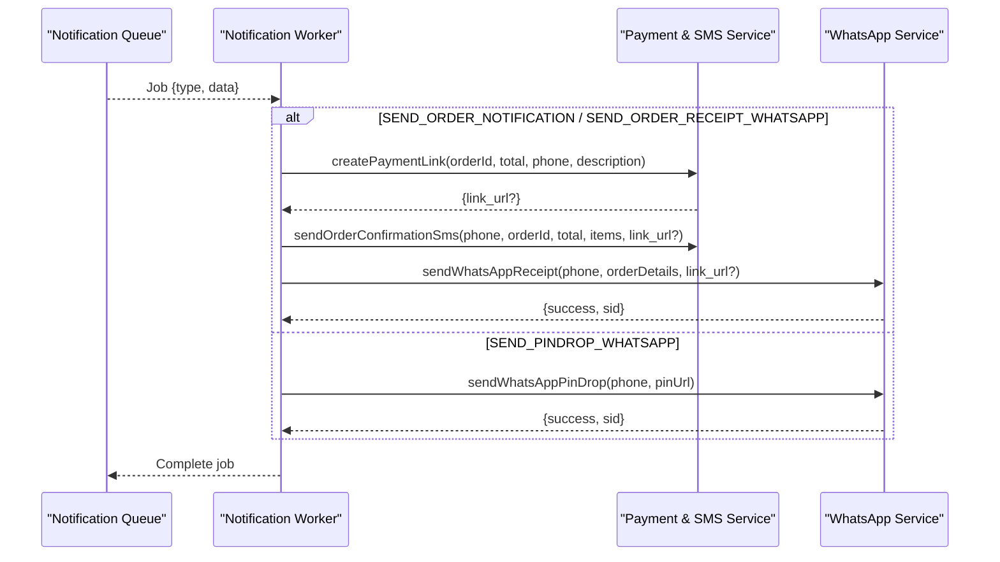
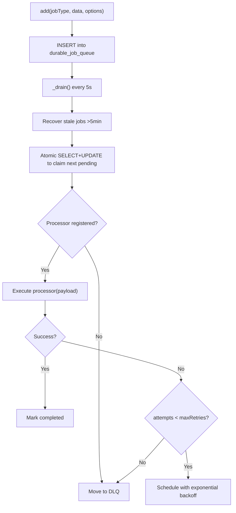
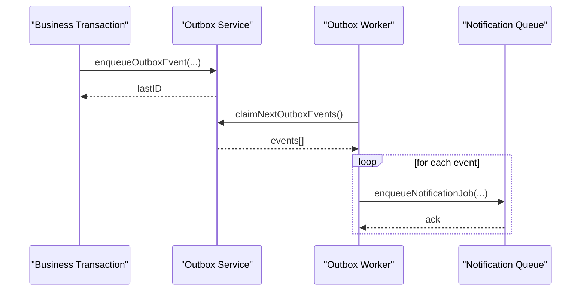
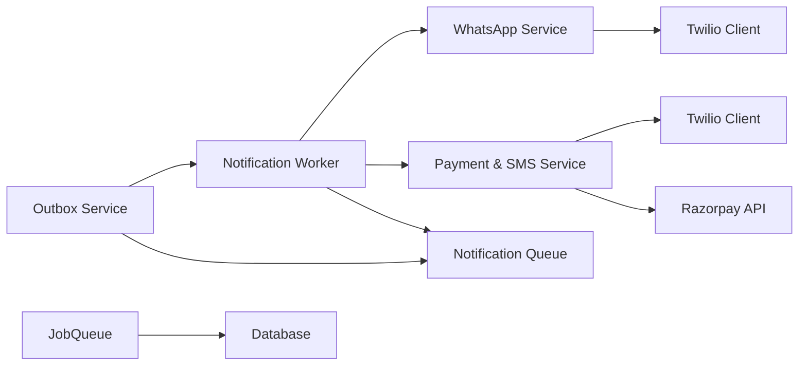

# Messaging & Notifications

<cite>
**Referenced Files in This Document**
- [whatsappService.js](file://server/src/services/whatsappService.js)
- [paymentService.js](file://server/src/services/paymentService.js)
- [notification.worker.js](file://server/src/workers/notification.worker.js)
- [jobQueue.js](file://server/src/queue/jobQueue.js)
- [queueManager.js](file://server/src/queue/queueManager.js)
- [outbox.service.js](file://server/src/services/outbox.service.js)
- [outbox.worker.js](file://server/src/workers/outbox.worker.js)
- [rateLimit.middleware.js](file://server/src/middleware/rateLimit.middleware.js)
- [telephonyAuth.middleware.js](file://server/src/middleware/telephonyAuth.middleware.js)
- [errorHandler.middleware.js](file://server/src/middleware/errorHandler.middleware.js)
- [AppError.js](file://server/src/utils/AppError.js)
- [env.js](file://server/src/config/env.js)
</cite>

## Table of Contents
1. Introduction
2. Project Structure
3. Core Components
4. Architecture Overview
5. Detailed Component Analysis
6. Dependency Analysis
7. Performance Considerations
8. Troubleshooting Guide
9. Conclusion

## Introduction
This document explains the Inkiro platform’s messaging and notification services with a focus on WhatsApp Business API integration for customer notifications, order updates, and conversation-related flows. It covers the asynchronous worker architecture that processes messages reliably, template-style message composition, provider configuration, rate limiting, retry mechanisms, error handling, and monitoring considerations. The goal is to help developers understand how messages are produced, queued, processed, delivered, and observed end-to-end.

## Project Structure
The messaging subsystem spans services, workers, queues, middleware, and configuration:
- Services implement provider integrations (WhatsApp via Twilio, SMS via Twilio, payment link generation).
- Workers consume jobs from durable queues and orchestrate multi-channel notifications.
- Queues provide database-backed durability, retries, backoff, and dead-letter routing.
- Middleware secures webhooks and enforces rate limits.
- Configuration validates environment variables at startup.

**Diagram sources**
- [queueManager.js:7-10](file://server/src/queue/queueManager.js#L7-L10)
- [jobQueue.js:14-32](file://server/src/queue/jobQueue.js#L14-L32)
- [outbox.worker.js:20-35](file://server/src/workers/outbox.worker.js#L20-L35)
- [notification.worker.js:10-59](file://server/src/workers/notification.worker.js#L10-L59)
- [whatsappService.js:24-109](file://server/src/services/whatsappService.js#L24-L109)
- [paymentService.js:25-113](file://server/src/services/paymentService.js#L25-L113)

**Section sources**
- [queueManager.js:7-10](file://server/src/queue/queueManager.js#L7-L10)
- [jobQueue.js:14-32](file://server/src/queue/jobQueue.js#L14-L32)
- [outbox.worker.js:20-35](file://server/src/workers/outbox.worker.js#L20-L35)
- [notification.worker.js:10-59](file://server/src/workers/notification.worker.js#L10-L59)
- [whatsappService.js:24-109](file://server/src/services/whatsappService.js#L24-L109)
- [paymentService.js:25-113](file://server/src/services/paymentService.js#L25-L113)

## Core Components
- WhatsApp Service: Composes and sends rich receipts and pin-drop requests using Twilio WhatsApp. Falls back to mock mode when credentials are not configured.
- Payment & SMS Service: Generates Razorpay payment links and sends SMS confirmations via Twilio; includes mock fallbacks.
- Notification Worker: Processes order notifications, creates payment links, sends SMS, and dispatches WhatsApp receipts or pin-drop requests.
- Durable Job Queue: Database-backed queue with atomic claiming, exponential backoff, DLQ routing, and stale job recovery.
- Outbox Service & Worker: Ensures reliable event delivery by persisting events and processing them asynchronously into notification jobs.
- Middleware: Rate limiting for APIs/webhooks and webhook signature verification for telephony providers.
- Error Handling: Centralized HTTP error handler and standardized AppError class.
- Environment Configuration: Validates core runtime settings at startup.

**Section sources**
- [whatsappService.js:24-109](file://server/src/services/whatsappService.js#L24-L109)
- [paymentService.js:25-113](file://server/src/services/paymentService.js#L25-L113)
- [notification.worker.js:10-71](file://server/src/workers/notification.worker.js#L10-L71)
- [jobQueue.js:14-249](file://server/src/queue/jobQueue.js#L14-L249)
- [outbox.service.js:8-140](file://server/src/services/outbox.service.js#L8-L140)
- [outbox.worker.js:14-128](file://server/src/workers/outbox.worker.js#L14-L128)
- [rateLimit.middleware.js:8-51](file://server/src/middleware/rateLimit.middleware.js#L8-L51)
- [telephonyAuth.middleware.js:10-39](file://server/src/middleware/telephonyAuth.middleware.js#L10-L39)
- [errorHandler.middleware.js:9-36](file://server/src/middleware/errorHandler.middleware.js#L9-L36)
- [AppError.js:7-17](file://server/src/utils/AppError.js#L7-L17)
- [env.js:3-40](file://server/src/config/env.js#L3-L40)

## Architecture Overview
The system uses an outbox pattern to guarantee delivery of order events, which are then transformed into notification jobs. The notification worker orchestrates multi-channel delivery (SMS and WhatsApp), while the durable queue ensures reliability through retries and DLQ routing. Provider integrations include graceful fallbacks for development.

**Diagram sources**
- [outbox.service.js:8-29](file://server/src/services/outbox.service.js#L8-L29)
- [outbox.worker.js:20-35](file://server/src/workers/outbox.worker.js#L20-L35)
- [queueManager.js:80-86](file://server/src/queue/queueManager.js#L80-L86)
- [notification.worker.js:10-59](file://server/src/workers/notification.worker.js#L10-L59)
- [paymentService.js:25-113](file://server/src/services/paymentService.js#L25-L113)
- [whatsappService.js:24-109](file://server/src/services/whatsappService.js#L24-L109)

## Detailed Component Analysis

### WhatsApp Business API Integration
- Purpose: Send rich order receipts and pin-drop confirmation requests to customers via WhatsApp.
- Implementation highlights:
  - Normalizes recipient phone numbers to WhatsApp format.
  - Uses Twilio client to send messages; falls back to mock logging if credentials are missing.
  - Exposes functions for receipts and pin-drop requests.
- Template-style composition: Messages are built programmatically with dynamic fields (order ID, items, totals, address, tracking/payment links). This acts as a simple template mechanism suitable for single-language use cases. For multilingual support, externalize message strings per locale and select based on customer preference before composing.

**Diagram sources**
- [whatsappService.js:82-109](file://server/src/services/whatsappService.js#L82-L109)

**Section sources**
- [whatsappService.js:24-109](file://server/src/services/whatsappService.js#L24-L109)

### Notification Worker Architecture
- Responsibilities:
  - Process order notifications: generate payment links, send SMS, send WhatsApp receipts/pin-drop.
  - Register explicit processors for job types to ensure deterministic routing.
  - Skip non-PSTN test sessions gracefully.
- Delivery guarantees:
  - Jobs are persisted in the durable queue with attempts and scheduled retries.
  - Failed jobs move to DLQ after max retries.
  - Stale locks are recovered automatically.

**Diagram sources**
- [notification.worker.js:10-71](file://server/src/workers/notification.worker.js#L10-L71)
- [paymentService.js:25-113](file://server/src/services/paymentService.js#L25-L113)
- [whatsappService.js:24-109](file://server/src/services/whatsappService.js#L24-L109)

**Section sources**
- [notification.worker.js:10-71](file://server/src/workers/notification.worker.js#L10-L71)
- [jobQueue.js:107-211](file://server/src/queue/jobQueue.js#L107-L211)

### Durable Job Queue Engine
- Guarantees:
  - Zero-lost jobs across crashes/restarts.
  - Atomic claiming with worker lock and stale recovery.
  - Exponential backoff and DLQ routing.
- Observability:
  - Stats endpoint returns pending, processing, completed, and DLQ counts.
- Concurrency control:
  - Configurable concurrency per queue instance.

**Diagram sources**
- [jobQueue.js:48-76](file://server/src/queue/jobQueue.js#L48-L76)
- [jobQueue.js:92-102](file://server/src/queue/jobQueue.js#L92-L102)
- [jobQueue.js:107-211](file://server/src/queue/jobQueue.js#L107-L211)

**Section sources**
- [jobQueue.js:14-249](file://server/src/queue/jobQueue.js#L14-L249)

### Transactional Outbox Pattern
- Purpose: Ensure reliable event emission alongside business transactions.
- Flow:
  - Enqueue events atomically with the transaction.
  - Outbox worker claims and processes events, publishing to notification queue.
  - Failed events are retried with backoff; eventually marked failed.

**Diagram sources**
- [outbox.service.js:8-29](file://server/src/services/outbox.service.js#L8-L29)
- [outbox.service.js:54-93](file://server/src/services/outbox.service.js#L54-L93)
- [outbox.worker.js:20-35](file://server/src/workers/outbox.worker.js#L20-L35)
- [queueManager.js:80-86](file://server/src/queue/queueManager.js#L80-L86)

**Section sources**
- [outbox.service.js:8-140](file://server/src/services/outbox.service.js#L8-L140)
- [outbox.worker.js:14-128](file://server/src/workers/outbox.worker.js#L14-L128)

### Provider Configuration and Fallbacks
- WhatsApp:
  - Requires Twilio credentials; otherwise, runs in mock mode.
- SMS:
  - Uses Twilio for outbound SMS; mock fallback available.
- Payment Links:
  - Integrates with Razorpay; mock fallback available.
- Environment validation:
  - Startup validates required environment variables.

Configuration keys used by messaging components:
- Twilio: TWILIO_ACCOUNT_SID, TWILIO_AUTH_TOKEN, TWILIO_WHATSAPP_NUMBER, TWILIO_PHONE_NUMBER
- Razorpay: RAZORPAY_KEY_ID, RAZORPAY_KEY_SECRET
- Runtime: PUBLIC_URL (used for callbacks)

**Section sources**
- [whatsappService.js:11-15](file://server/src/services/whatsappService.js#L11-L15)
- [whatsappService.js:86-109](file://server/src/services/whatsappService.js#L86-L109)
- [paymentService.js:9-15](file://server/src/services/paymentService.js#L9-L15)
- [paymentService.js:25-61](file://server/src/services/paymentService.js#L25-L61)
- [paymentService.js:69-89](file://server/src/services/paymentService.js#L69-L89)
- [env.js:3-40](file://server/src/config/env.js#L3-L40)

### Rate Limiting and Security
- Rate limiters protect authentication endpoints, public APIs, dashboards, and telephony webhooks.
- Telephony webhook signature verification ensures incoming requests originate from trusted providers.

Operational notes:
- Apply appropriate limiter per route group.
- Verify webhook signatures in webhook handlers to prevent spoofing.

**Section sources**
- [rateLimit.middleware.js:8-51](file://server/src/middleware/rateLimit.middleware.js#L8-L51)
- [telephonyAuth.middleware.js:10-39](file://server/src/middleware/telephonyAuth.middleware.js#L10-L39)

### Error Handling and Reliability
- Application errors:
  - Standardized AppError provides consistent status codes and machine-readable codes.
  - Centralized error handler logs structured details and returns safe responses.
- Queue-level reliability:
  - Exponential backoff and DLQ routing for transient failures.
  - Stale lock recovery prevents stuck jobs.
- Outbox failure handling:
  - markOutboxEventFailed increments retry count and schedules backoff; marks as failed after max retries.

Common scenarios:
- Invalid phone numbers: Validate E.164 format upstream; log and skip or route to DLQ on provider rejection.
- Service unavailability: Rely on retries/backoff; monitor DLQ growth.
- Provider errors: Logged with correlation context; consider alerting on sustained failures.

**Section sources**
- [AppError.js:7-17](file://server/src/utils/AppError.js#L7-L17)
- [errorHandler.middleware.js:9-36](file://server/src/middleware/errorHandler.middleware.js#L9-L36)
- [jobQueue.js:182-207](file://server/src/queue/jobQueue.js#L182-L207)
- [outbox.service.js:119-140](file://server/src/services/outbox.service.js#L119-L140)

### Monitoring, Metrics, and Cost Tracking
- Queue observability:
  - getStats returns counts for pending, processing, completed, and DLQ per queue.
- SLO tracking:
  - SLO service exposes availability and latency metrics for voice paths; extendable for messaging KPIs.
- Recommended additions:
  - Track per-provider delivery rates, response times, and costs by instrumenting service calls and persisting metrics.
  - Emit metrics for:
    - Message volume (SMS/WhatsApp)
    - Delivery success rate
    - Average and p95 latency
    - Provider error rates
    - Cost per channel (via provider billing exports or SDK metadata)
  - Integrate with existing logger and dashboard endpoints for centralized visibility.

[No sources needed since this section provides general guidance]

## Dependency Analysis
Key dependencies between messaging components:

**Diagram sources**
- [whatsappService.js:86-109](file://server/src/services/whatsappService.js#L86-L109)
- [paymentService.js:25-113](file://server/src/services/paymentService.js#L25-L113)
- [notification.worker.js:10-71](file://server/src/workers/notification.worker.js#L10-L71)
- [outbox.service.js:8-29](file://server/src/services/outbox.service.js#L8-L29)
- [jobQueue.js:57-76](file://server/src/queue/jobQueue.js#L57-L76)

**Section sources**
- [whatsappService.js:86-109](file://server/src/services/whatsappService.js#L86-L109)
- [paymentService.js:25-113](file://server/src/services/paymentService.js#L25-L113)
- [notification.worker.js:10-71](file://server/src/workers/notification.worker.js#L10-L71)
- [outbox.service.js:8-29](file://server/src/services/outbox.service.js#L8-L29)
- [jobQueue.js:57-76](file://server/src/queue/jobQueue.js#L57-L76)

## Performance Considerations
- Queue concurrency:
  - Adjust concurrency per queue to match throughput needs and downstream provider limits.
- Backoff strategy:
  - Exponential backoff reduces load during transient failures; tune initialBackoffMs and maxRetries per provider SLAs.
- Idempotency:
  - Use idempotency keys for notifications to avoid duplicate deliveries under retries.
- Provider rate limits:
  - Respect Twilio/Razorpay quotas; apply rate limiting at the application layer where necessary.
- I/O patterns:
  - Batch operations where possible; minimize synchronous blocking in hot paths.

[No sources needed since this section provides general guidance]

## Troubleshooting Guide
- No messages sent:
  - Verify Twilio credentials and sandbox number configuration.
  - Check queue stats for pending/DLQ growth.
- Duplicate messages:
  - Ensure idempotency keys are set when enqueuing notifications.
- Frequent retries:
  - Inspect last_error in DLQ entries; validate phone numbers and provider status.
- Webhook rejections:
  - Confirm signature verification logic and correct token configuration.
- High latency:
  - Monitor queue processing time and provider response times; adjust concurrency and timeouts.

**Section sources**
- [jobQueue.js:214-234](file://server/src/queue/jobQueue.js#L214-L234)
- [outbox.service.js:119-140](file://server/src/services/outbox.service.js#L119-L140)
- [telephonyAuth.middleware.js:10-39](file://server/src/middleware/telephonyAuth.middleware.js#L10-L39)
- [errorHandler.middleware.js:9-36](file://server/src/middleware/errorHandler.middleware.js#L9-L36)

## Conclusion
Inkiro’s messaging and notifications combine a robust outbox pattern, durable database-backed queues, and resilient workers to deliver reliable WhatsApp and SMS communications. The design supports clear separation of concerns, strong failure handling, and extensibility for additional channels and templates. By adding targeted metrics and cost tracking, teams can further optimize delivery performance and operational visibility.