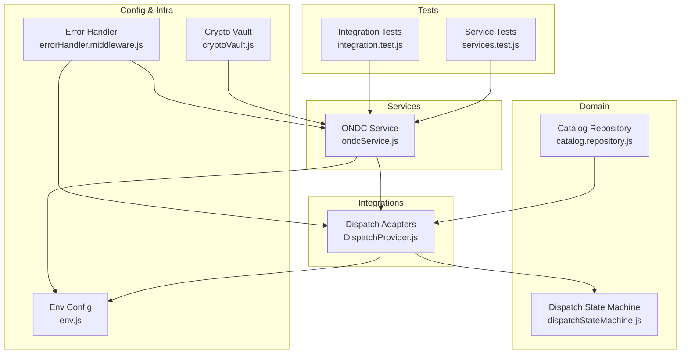
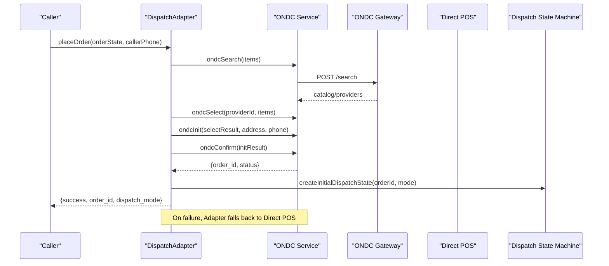
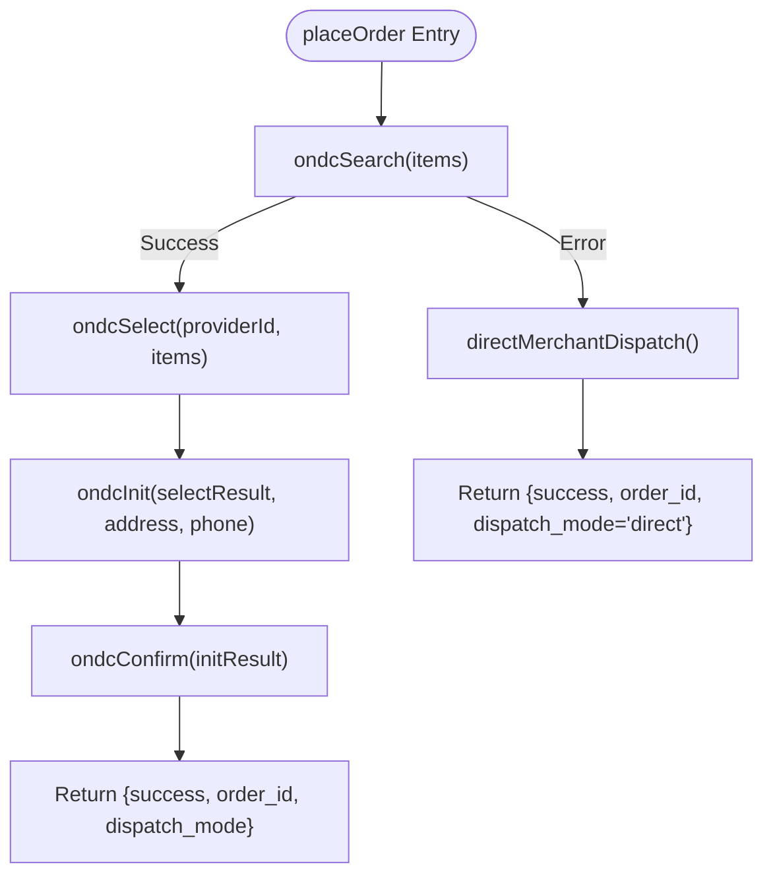
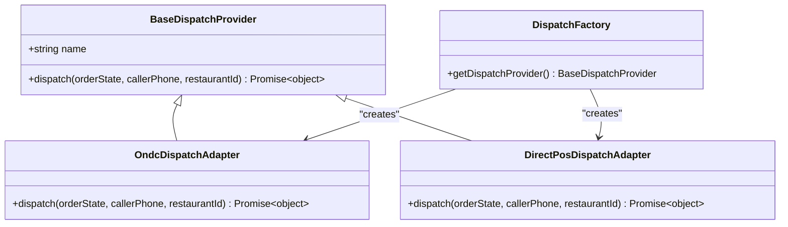
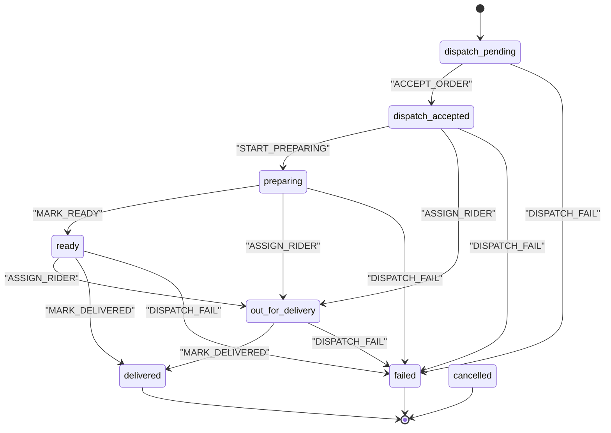
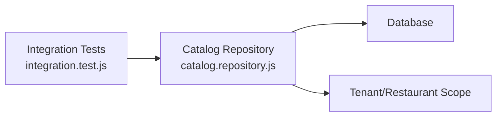
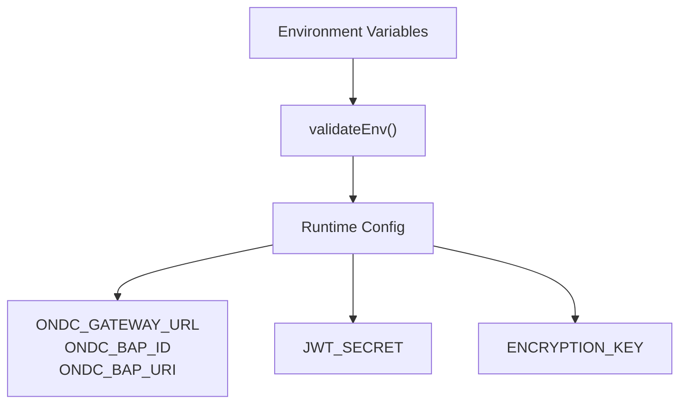
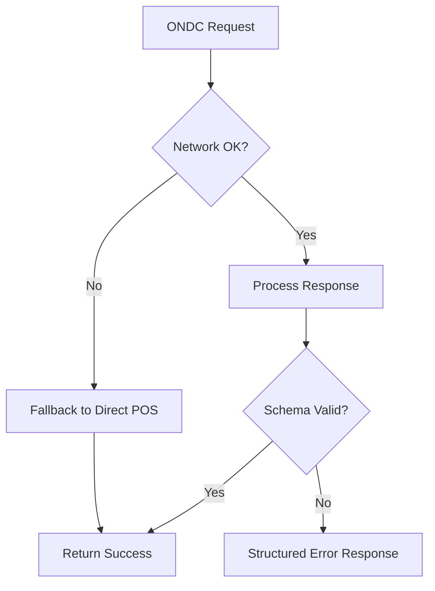
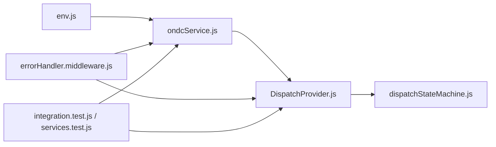

# ONDC Commerce Network

<cite>
**Referenced Files in This Document**
- [ondcService.js](file://server/src/services/ondcService.js)
- [DispatchProvider.js](file://server/src/integrations/dispatch/DispatchProvider.js)
- [dispatchStateMachine.js](file://server/src/domain/dispatch/dispatchStateMachine.js)
- [env.js](file://server/src/config/env.js)
- [errorHandler.middleware.js](file://server/src/middleware/errorHandler.middleware.js)
- [integration.test.js](file://server/tests/integration.test.js)
- [services.test.js](file://server/tests/services.test.js)
- [cryptoVault.js](file://server/src/utils/cryptoVault.js)
- [auth.service.js](file://server/src/services/auth.service.js)
- [catalog.repository.js](file://server/src/domain/catalog/catalog.repository.js)
</cite>

## Table of Contents
1. [Introduction](#introduction)
2. [Project Structure](#project-structure)
3. [Core Components](#core-components)
4. [Architecture Overview](#architecture-overview)
5. [Detailed Component Analysis](#detailed-component-analysis)
6. [Dependency Analysis](#dependency-analysis)
7. [Performance Considerations](#performance-considerations)
8. [Troubleshooting Guide](#troubleshooting-guide)
9. [Conclusion](#conclusion)
10. [Appendices](#appendices)

## Introduction
This document explains the ONDC (Open Network for Digital Commerce) integration within the Inkiro platform, focusing on the Beckn protocol flows for marketplace connectivity and order fulfillment. It covers search, select, init, and confirm flows; merchant discovery and catalog synchronization; a dispatch adapter pattern that supports both ONDC and direct POS integrations; configuration for registry endpoints, authentication, and message signing; error handling strategies; and testing and debugging approaches for protocol-level issues.

## Project Structure
The ONDC integration spans services, adapters, domain state machines, middleware, and tests:
- ONDC service implements the Beckn buyer-side flow with environment-driven gateway and BAP identity.
- Dispatch adapters provide a unified interface to send orders either via ONDC or directly to POS systems.
- A dedicated dispatch state machine tracks kitchen and fulfillment lifecycle independently from order status.
- Error handling centralizes structured responses and logging.
- Tests validate end-to-end flows and service behaviors.

**Diagram sources**
- [ondcService.js:1-201](file://server/src/services/ondcService.js#L1-L201)
- [DispatchProvider.js:1-93](file://server/src/integrations/dispatch/DispatchProvider.js#L1-L93)
- [dispatchStateMachine.js:1-147](file://server/src/domain/dispatch/dispatchStateMachine.js#L1-L147)
- [env.js:1-42](file://server/src/config/env.js#L1-L42)
- [errorHandler.middleware.js:1-43](file://server/src/middleware/errorHandler.middleware.js#L1-L43)
- [cryptoVault.js:1-58](file://server/src/utils/cryptoVault.js#L1-L58)
- [integration.test.js:1-162](file://server/tests/integration.test.js#L1-L162)
- [services.test.js:1-74](file://server/tests/services.test.js#L1-L74)
- [catalog.repository.js:1-109](file://server/src/domain/catalog/catalog.repository.js#L1-L109)

**Section sources**
- [ondcService.js:1-201](file://server/src/services/ondcService.js#L1-L201)
- [DispatchProvider.js:1-93](file://server/src/integrations/dispatch/DispatchProvider.js#L1-L93)
- [dispatchStateMachine.js:1-147](file://server/src/domain/dispatch/dispatchStateMachine.js#L1-L147)
- [env.js:1-42](file://server/src/config/env.js#L1-L42)
- [errorHandler.middleware.js:1-43](file://server/src/middleware/errorHandler.middleware.js#L1-L43)
- [cryptoVault.js:1-58](file://server/src/utils/cryptoVault.js#L1-L58)
- [integration.test.js:1-162](file://server/tests/integration.test.js#L1-L162)
- [services.test.js:1-74](file://server/tests/services.test.js#L1-L74)
- [catalog.repository.js:1-109](file://server/src/domain/catalog/catalog.repository.js#L1-L109)

## Core Components
- ONDC Service: Implements search, select, init, confirm flows and orchestrates the full order placement with fallback to direct POS when needed.
- Dispatch Adapters: Provide a pluggable interface for ONDC and direct POS dispatching with automatic failover.
- Dispatch State Machine: Manages kitchen and fulfillment lifecycle states and transitions independent of order status.
- Configuration: Environment variables define gateway URL, BAP identity, and other runtime settings.
- Error Handling: Centralized middleware returns structured errors and logs correlation IDs.
- Security Utilities: Field-level encryption for sensitive data and secure JWT handling.

**Section sources**
- [ondcService.js:1-201](file://server/src/services/ondcService.js#L1-L201)
- [DispatchProvider.js:1-93](file://server/src/integrations/dispatch/DispatchProvider.js#L1-L93)
- [dispatchStateMachine.js:1-147](file://server/src/domain/dispatch/dispatchStateMachine.js#L1-L147)
- [env.js:1-42](file://server/src/config/env.js#L1-L42)
- [errorHandler.middleware.js:1-43](file://server/src/middleware/errorHandler.middleware.js#L1-L43)
- [cryptoVault.js:1-58](file://server/src/utils/cryptoVault.js#L1-L58)
- [auth.service.js:1-41](file://server/src/services/auth.service.js#L1-L41)

## Architecture Overview
The system uses a layered architecture:
- Client-facing orchestration triggers order placement.
- The ONDC service composes Beckn messages and calls the network gateway.
- The dispatch adapter abstracts the target (ONDC vs direct POS).
- The dispatch state machine tracks fulfillment progress.
- Middleware ensures consistent error responses and logging.
- Tests validate behavior across components.

**Diagram sources**
- [DispatchProvider.js:24-50](file://server/src/integrations/dispatch/DispatchProvider.js#L24-L50)
- [ondcService.js:20-141](file://server/src/services/ondcService.js#L20-L141)
- [dispatchStateMachine.js:30-47](file://server/src/domain/dispatch/dispatchStateMachine.js#L30-L47)

## Detailed Component Analysis

### ONDC Service (Beckn Buyer Flow)
- Search: Builds a Beckn context and posts a search intent to the configured gateway. On network errors, it falls back to mock results for development.
- Select: Constructs provider selection and quote based on input items.
- Init: Enriches selection with billing and fulfillment details.
- Confirm: Generates an order ID and confirms the order.
- Full flow: Orchestrates search → select → init → confirm with a try/catch that falls back to direct POS dispatch if any step fails.

**Diagram sources**
- [ondcService.js:114-141](file://server/src/services/ondcService.js#L114-L141)
- [ondcService.js:20-109](file://server/src/services/ondcService.js#L20-L109)

**Section sources**
- [ondcService.js:10-141](file://server/src/services/ondcService.js#L10-L141)

### Dispatch Adapter Pattern
- Base class defines a uniform dispatch contract.
- ONDC adapter executes the full Beckn flow and returns tracking metadata.
- Direct POS adapter simulates sending orders to POS systems.
- Factory selects implementation based on environment configuration.
- Automatic failover: ONDC adapter catches exceptions and delegates to Direct POS adapter.

**Diagram sources**
- [DispatchProvider.js:11-85](file://server/src/integrations/dispatch/DispatchProvider.js#L11-L85)

**Section sources**
- [DispatchProvider.js:1-93](file://server/src/integrations/dispatch/DispatchProvider.js#L1-L93)

### Dispatch State Machine
- Defines explicit states for dispatch lifecycle: pending, accepted, preparing, ready, out_for_delivery, delivered, failed, cancelled.
- Validates allowed transitions per action.
- Records history with timestamps and payload summaries.
- Supports multiple dispatch modes including ONDC and direct.

**Diagram sources**
- [dispatchStateMachine.js:9-147](file://server/src/domain/dispatch/dispatchStateMachine.js#L9-L147)

**Section sources**
- [dispatchStateMachine.js:1-147](file://server/src/domain/dispatch/dispatchStateMachine.js#L1-L147)

### Merchant Discovery and Catalog Synchronization
- Merchant discovery is supported via repository queries scoped by tenant and restaurant.
- Catalog synchronization leverages strict multi-tenant scoping and parameterized queries to ensure safe access.
- Integration tests verify public catalog retrieval and authenticated endpoints.

**Diagram sources**
- [catalog.repository.js:23-46](file://server/src/domain/catalog/catalog.repository.js#L23-L46)
- [integration.test.js:79-88](file://server/tests/integration.test.js#L79-L88)

**Section sources**
- [catalog.repository.js:1-109](file://server/src/domain/catalog/catalog.repository.js#L1-L109)
- [integration.test.js:79-88](file://server/tests/integration.test.js#L79-L88)

### Configuration: Registry Endpoints, Authentication, Message Signing
- Registry endpoints and BAP identity are read from environment variables for gateway URL, BAP ID, and BAP URI.
- Environment validation enforces required keys and types at startup.
- Authentication uses strong JWT secrets validated at module load.
- Message signing for ONDC is not implemented in the current codebase; consider adding HMAC/JWT signing around outbound requests and validating inbound signatures where applicable.

**Diagram sources**
- [env.js:1-42](file://server/src/config/env.js#L1-L42)
- [ondcService.js:10-12](file://server/src/services/ondcService.js#L10-L12)
- [auth.service.js:1-41](file://server/src/services/auth.service.js#L1-L41)
- [cryptoVault.js:1-58](file://server/src/utils/cryptoVault.js#L1-L58)

**Section sources**
- [env.js:1-42](file://server/src/config/env.js#L1-L42)
- [ondcService.js:10-12](file://server/src/services/ondcService.js#L10-L12)
- [auth.service.js:1-41](file://server/src/services/auth.service.js#L1-L41)
- [cryptoVault.js:1-58](file://server/src/utils/cryptoVault.js#L1-L58)

### Error Handling: Timeouts, Validation, Marketplace Unavailability
- Network timeouts and gateway failures during ONDC search trigger fallback to mock or direct POS dispatch.
- Validation errors are enforced via schema checks and return standardized error codes through centralized error handling.
- Marketplace unavailability is handled by adapter-level retries/failover and state machine transitions to failed states when necessary.

**Diagram sources**
- [ondcService.js:37-49](file://server/src/services/ondcService.js#L37-L49)
- [DispatchProvider.js:45-49](file://server/src/integrations/dispatch/DispatchProvider.js#L45-L49)
- [errorHandler.middleware.js:9-35](file://server/src/middleware/errorHandler.middleware.js#L9-L35)
- [integration.test.js:147-161](file://server/tests/integration.test.js#L147-L161)

**Section sources**
- [ondcService.js:37-49](file://server/src/services/ondcService.js#L37-L49)
- [DispatchProvider.js:45-49](file://server/src/integrations/dispatch/DispatchProvider.js#L45-L49)
- [errorHandler.middleware.js:1-43](file://server/src/middleware/errorHandler.middleware.js#L1-L43)
- [integration.test.js:147-161](file://server/tests/integration.test.js#L147-L161)

## Dependency Analysis
- ONDC Service depends on environment configuration for gateway and BAP identity.
- Dispatch Adapters depend on ONDC Service and can fall back to Direct POS.
- Dispatch State Machine is independent but used by higher layers to track fulfillment.
- Error Handler is applied globally to normalize responses.
- Tests exercise integration points and service behaviors.

**Diagram sources**
- [env.js:1-42](file://server/src/config/env.js#L1-L42)
- [ondcService.js:1-201](file://server/src/services/ondcService.js#L1-L201)
- [DispatchProvider.js:1-93](file://server/src/integrations/dispatch/DispatchProvider.js#L1-L93)
- [dispatchStateMachine.js:1-147](file://server/src/domain/dispatch/dispatchStateMachine.js#L1-L147)
- [errorHandler.middleware.js:1-43](file://server/src/middleware/errorHandler.middleware.js#L1-L43)
- [integration.test.js:1-162](file://server/tests/integration.test.js#L1-L162)
- [services.test.js:1-74](file://server/tests/services.test.js#L1-L74)

**Section sources**
- [env.js:1-42](file://server/src/config/env.js#L1-L42)
- [ondcService.js:1-201](file://server/src/services/ondcService.js#L1-L201)
- [DispatchProvider.js:1-93](file://server/src/integrations/dispatch/DispatchProvider.js#L1-L93)
- [dispatchStateMachine.js:1-147](file://server/src/domain/dispatch/dispatchStateMachine.js#L1-L147)
- [errorHandler.middleware.js:1-43](file://server/src/middleware/errorHandler.middleware.js#L1-L43)
- [integration.test.js:1-162](file://server/tests/integration.test.js#L1-L162)
- [services.test.js:1-74](file://server/tests/services.test.js#L1-L74)

## Performance Considerations
- Use timeouts and retries for ONDC gateway calls to mitigate transient network issues.
- Cache provider catalogs locally to reduce repeated search overhead.
- Batch item selections where possible to minimize round trips.
- Monitor latency and error rates using existing SLO tracking utilities.
- Prefer asynchronous processing for non-critical steps like notifications.

[No sources needed since this section provides general guidance]

## Troubleshooting Guide
- Network timeouts: Check gateway endpoint availability and inspect logs for fetch errors; the ONDC service falls back to mock/direct POS on failure.
- Validation errors: Ensure request payloads conform to expected schemas; integration tests demonstrate validation enforcement.
- Marketplace unavailability: Rely on adapter-level failover and review dispatch state transitions to identify stuck states.
- Debugging tools: Use structured error responses with correlation IDs; leverage tests to simulate flows and assert outcomes.

**Section sources**
- [ondcService.js:37-49](file://server/src/services/ondcService.js#L37-L49)
- [DispatchProvider.js:45-49](file://server/src/integrations/dispatch/DispatchProvider.js#L45-L49)
- [errorHandler.middleware.js:9-35](file://server/src/middleware/errorHandler.middleware.js#L9-L35)
- [integration.test.js:147-161](file://server/tests/integration.test.js#L147-L161)

## Conclusion
The Inkiro platform integrates ONDC through a clear, testable, and resilient design. The ONDC service implements the Beckn buyer flow with robust fallbacks, while the dispatch adapter pattern abstracts different fulfillment targets. The dispatch state machine ensures operational clarity for kitchen and delivery workflows. Configuration is environment-driven, and error handling standardizes responses. Testing validates critical paths and helps debug protocol-level issues.

[No sources needed since this section summarizes without analyzing specific files]

## Appendices

### Configuration Checklist
- Set ONDC_GATEWAY_URL, ONDC_BAP_ID, and ONDC_BAP_URI for production.
- Configure JWT_SECRET with sufficient length and secrecy.
- Set ENCRYPTION_KEY for field-level encryption.
- Validate environment at startup using the provided validator.

**Section sources**
- [env.js:1-42](file://server/src/config/env.js#L1-L42)
- [ondcService.js:10-12](file://server/src/services/ondcService.js#L10-L12)
- [auth.service.js:1-41](file://server/src/services/auth.service.js#L1-L41)
- [cryptoVault.js:1-58](file://server/src/utils/cryptoVault.js#L1-L58)

### Testing Strategies
- Integration tests cover authenticated endpoints, catalog retrieval, voice webhooks, and validation enforcement.
- Service tests validate messaging and audio processing utilities.
- Use these tests to simulate ONDC flows and verify fallback behavior.

**Section sources**
- [integration.test.js:1-162](file://server/tests/integration.test.js#L1-L162)
- [services.test.js:1-74](file://server/tests/services.test.js#L1-L74)