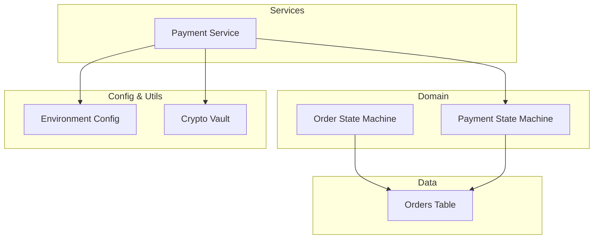
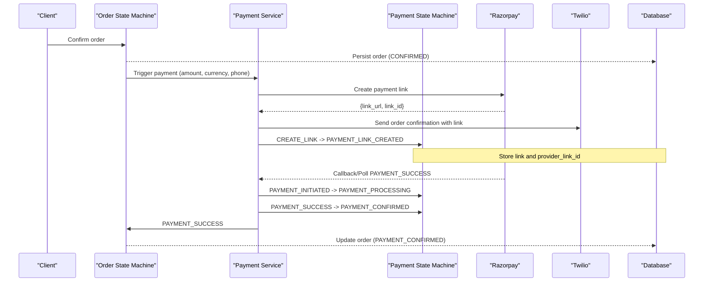
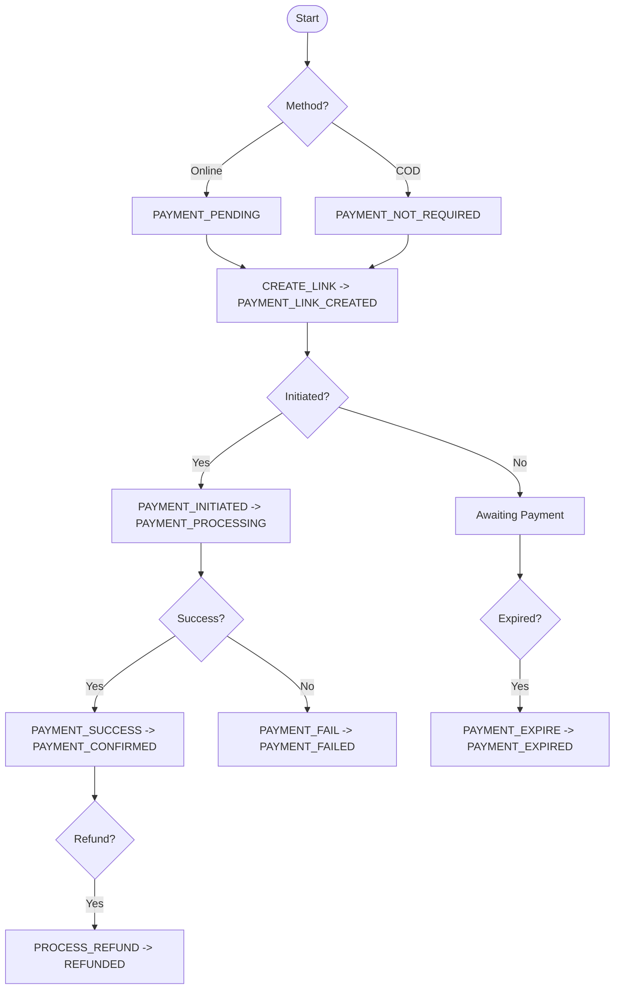
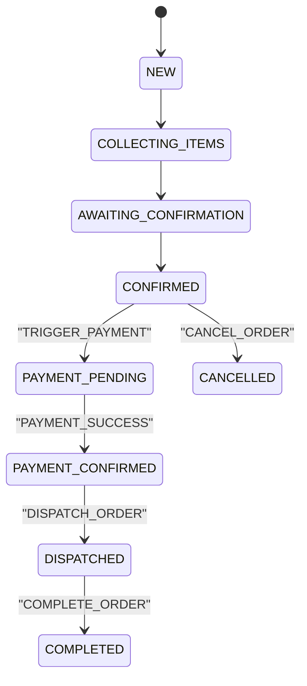
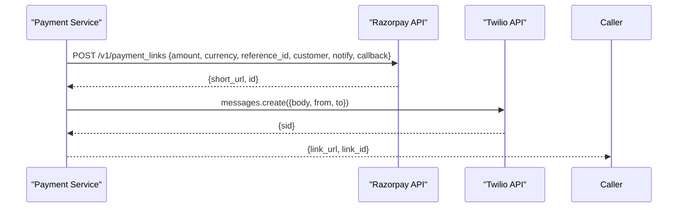
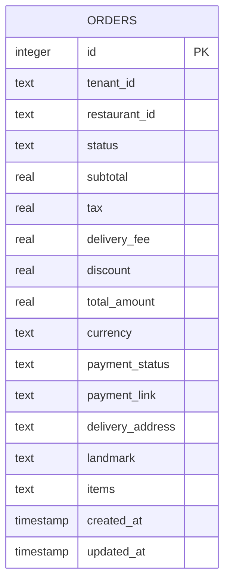
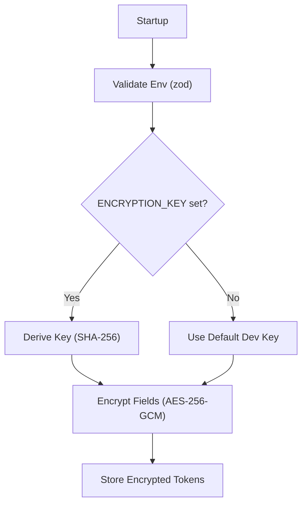
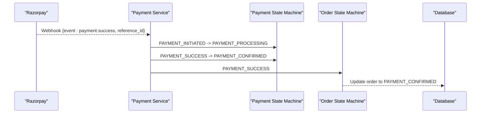
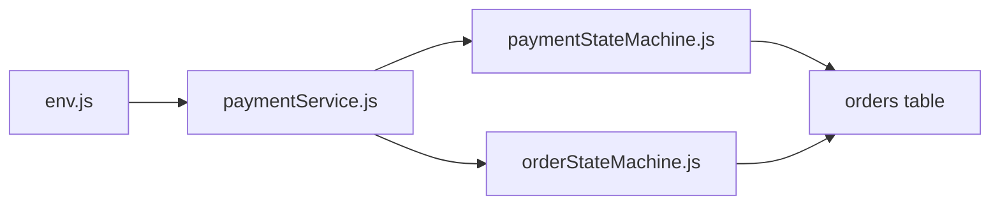

# Payment Processing

<cite>
**Referenced Files in This Document**
- [paymentStateMachine.js](file://server/src/domain/payments/paymentStateMachine.js)
- [paymentService.js](file://server/src/services/paymentService.js)
- [orderStateMachine.js](file://server/src/domain/orders/orderStateMachine.js)
- [001_initial_multitenant_schema.sql](file://server/src/db/migrations/001_initial_multitenant_schema.sql)
- [env.js](file://server/src/config/env.js)
- [cryptoVault.js](file://server/src/utils/cryptoVault.js)
- [order.controller.js](file://server/src/controllers/order.controller.js)
</cite>

## Table of Contents
1. Introduction
2. Project Structure
3. Core Components
4. Architecture Overview
5. Detailed Component Analysis
6. Dependency Analysis
7. Performance Considerations
8. Troubleshooting Guide
9. Conclusion

## Introduction
This document explains the payment processing integration in the Inkiro platform, focusing on how payments are initiated, tracked, and reconciled alongside order lifecycle management. It covers:
- Payment gateway integration patterns (Razorpay payment links with SMS notifications via Twilio)
- Transaction lifecycle management using a dedicated payment state machine
- Integration points with the order state machine for end-to-end flow
- Webhook handling considerations for confirmations, refunds, and disputes
- Security considerations including encryption and environment configuration
- Configuration for multiple providers, currency support, and regional methods
- Error handling, timeouts, and reconciliation strategies
- Testing strategies and debugging approaches

## Project Structure
Payment-related logic is implemented across domain services, service integrations, database schema, and configuration utilities:
- Domain layer: payment and order state machines define authoritative transitions and history
- Service layer: provider integration (Razorpay), messaging (Twilio), and orchestration helpers
- Data layer: orders table includes payment fields; migrations define schema
- Configuration: environment validation and secure key handling
- Utilities: encryption helpers for sensitive data

**Diagram sources**
- [paymentStateMachine.js:1-150](file://server/src/domain/payments/paymentStateMachine.js#L1-L150)
- [orderStateMachine.js:1-325](file://server/src/domain/orders/orderStateMachine.js#L1-L325)
- [paymentService.js:1-114](file://server/src/services/paymentService.js#L1-L114)
- [001_initial_multitenant_schema.sql:173-199](file://server/src/db/migrations/001_initial_multitenant_schema.sql#L173-L199)
- [env.js:1-42](file://server/src/config/env.js#L1-L42)
- [cryptoVault.js:1-59](file://server/src/utils/cryptoVault.js#L1-L59)

**Section sources**
- [paymentStateMachine.js:1-150](file://server/src/domain/payments/paymentStateMachine.js#L1-L150)
- [orderStateMachine.js:1-325](file://server/src/domain/orders/orderStateMachine.js#L1-L325)
- [paymentService.js:1-114](file://server/src/services/paymentService.js#L1-L114)
- [001_initial_multitenant_schema.sql:173-199](file://server/src/db/migrations/001_initial_multitenant_schema.sql#L173-L199)
- [env.js:1-42](file://server/src/config/env.js#L1-L42)
- [cryptoVault.js:1-59](file://server/src/utils/cryptoVault.js#L1-L59)

## Core Components
- Payment State Machine: Defines states, actions, and transitions for payments independent of orders. Supports COD, online payments, link creation, processing, confirmation, failure, expiration, and refund.
- Order State Machine: Coordinates order lifecycle and integrates with payment events to move from confirmed to payment pending, then to payment confirmed upon success.
- Payment Service: Creates payment links with Razorpay, sends SMS via Twilio, and provides mock implementations for development.
- Database Schema: Orders table stores payment status, currency, and payment link references.
- Environment Configuration: Validates required keys and defaults for development vs production.
- Crypto Vault: Encrypts sensitive fields using AES-256-GCM with derived keys.

**Section sources**
- [paymentStateMachine.js:1-150](file://server/src/domain/payments/paymentStateMachine.js#L1-L150)
- [orderStateMachine.js:1-325](file://server/src/domain/orders/orderStateMachine.js#L1-L325)
- [paymentService.js:1-114](file://server/src/services/paymentService.js#L1-L114)
- [001_initial_multitenant_schema.sql:173-199](file://server/src/db/migrations/001_initial_multitenant_schema.sql#L173-L199)
- [env.js:1-42](file://server/src/config/env.js#L1-L42)
- [cryptoVault.js:1-59](file://server/src/utils/cryptoVault.js#L1-L59)

## Architecture Overview
The payment architecture separates payment lifecycle from order lifecycle while keeping them synchronized through explicit events:
- Order reaches CONFIRMED and triggers payment initiation
- Payment service creates a payment link (Razorpay) and notifies customer via SMS (Twilio)
- Payment state machine tracks transitions and records provider IDs and links
- On webhook callback or polling, payment success updates both payment and order states
- Refunds and disputes update payment and order dispute statuses accordingly

**Diagram sources**
- [orderStateMachine.js:263-278](file://server/src/domain/orders/orderStateMachine.js#L263-L278)
- [paymentService.js:25-61](file://server/src/services/paymentService.js#L25-L61)
- [paymentService.js:69-89](file://server/src/services/paymentService.js#L69-L89)
- [paymentStateMachine.js:50-149](file://server/src/domain/payments/paymentStateMachine.js#L50-L149)
- [001_initial_multitenant_schema.sql:173-199](file://server/src/db/migrations/001_initial_multitenant_schema.sql#L173-L199)

## Detailed Component Analysis

### Payment State Machine
- States: Not required (COD), Pending, Link Created, Processing, Confirmed, Failed, Expired, Refunded
- Actions: SET_COD, CREATE_LINK, PAYMENT_INITIATED, PAYMENT_SUCCESS, PAYMENT_FAIL, PAYMENT_EXPIRE, PROCESS_REFUND
- Transitions: Enforced by canTransitionPayment; illegal transitions return errors
- History: Each transition logs timestamp, action, and payload summary

**Diagram sources**
- [paymentStateMachine.js:9-28](file://server/src/domain/payments/paymentStateMachine.js#L9-L28)
- [paymentStateMachine.js:50-149](file://server/src/domain/payments/paymentStateMachine.js#L50-L149)

**Section sources**
- [paymentStateMachine.js:1-150](file://server/src/domain/payments/paymentStateMachine.js#L1-L150)

### Order State Machine (Payment Integration)
- Integrates payment events: TRIGGER_PAYMENT moves to PAYMENT_PENDING; PAYMENT_SUCCESS moves to PAYMENT_CONFIRMED
- Maintains payment_status field and full history for auditability
- Supports dispute flagging and resolution that can coexist with payment outcomes

**Diagram sources**
- [orderStateMachine.js:8-41](file://server/src/domain/orders/orderStateMachine.js#L8-L41)
- [orderStateMachine.js:119-130](file://server/src/domain/orders/orderStateMachine.js#L119-L130)
- [orderStateMachine.js:263-278](file://server/src/domain/orders/orderStateMachine.js#L263-L278)

**Section sources**
- [orderStateMachine.js:1-325](file://server/src/domain/orders/orderStateMachine.js#L1-L325)

### Payment Service (Gateway Integration)
- Creates Razorpay payment links with amount in smallest currency unit, currency INR, reference_id tied to order, customer contact, callbacks, and reminders
- Sends SMS via Twilio with order details and payment link
- Provides mock fallbacks when credentials are not configured

**Diagram sources**
- [paymentService.js:25-61](file://server/src/services/paymentService.js#L25-L61)
- [paymentService.js:69-89](file://server/src/services/paymentService.js#L69-L89)

**Section sources**
- [paymentService.js:1-114](file://server/src/services/paymentService.js#L1-L114)

### Database Schema (Payments and Orders)
- Orders table includes currency, payment_status, and payment_link fields to persist payment context
- Multi-tenant isolation via tenant_id and restaurant_id ensures scoped access

**Diagram sources**
- [001_initial_multitenant_schema.sql:173-199](file://server/src/db/migrations/001_initial_multitenant_schema.sql#L173-L199)

**Section sources**
- [001_initial_multitenant_schema.sql:173-199](file://server/src/db/migrations/001_initial_multitenant_schema.sql#L173-L199)

### Security and Encryption
- Environment variables validated at startup for JWT secret, encryption key, and other settings
- Sensitive fields encrypted with AES-256-GCM using a derived key; decryption returns sanitized fallback on error
- Payment credentials handled via environment variables; provider calls use HTTPS

**Diagram sources**
- [env.js:1-42](file://server/src/config/env.js#L1-L42)
- [cryptoVault.js:1-59](file://server/src/utils/cryptoVault.js#L1-L59)

**Section sources**
- [env.js:1-42](file://server/src/config/env.js#L1-L42)
- [cryptoVault.js:1-59](file://server/src/utils/cryptoVault.js#L1-L59)

### Webhooks, Refunds, and Disputes
- Webhook handling: The payment service sets a callback URL for payment confirmations; implement server-side verification and idempotent updates to both payment and order states
- Refunds: Use PROCESS_REFUND action in payment state machine to move to REFUNDED; ensure idempotency and audit logging
- Disputes: Order controller supports flagging and resolving disputes; integrate with payment state to reflect refund/rejection outcomes

**Diagram sources**
- [paymentService.js:25-61](file://server/src/services/paymentService.js#L25-L61)
- [paymentStateMachine.js:50-149](file://server/src/domain/payments/paymentStateMachine.js#L50-L149)
- [orderStateMachine.js:263-278](file://server/src/domain/orders/orderStateMachine.js#L263-L278)
- [order.controller.js:65-135](file://server/src/controllers/order.controller.js#L65-L135)

**Section sources**
- [paymentService.js:25-61](file://server/src/services/paymentService.js#L25-L61)
- [paymentStateMachine.js:50-149](file://server/src/domain/payments/paymentStateMachine.js#L50-L149)
- [orderStateMachine.js:263-278](file://server/src/domain/orders/orderStateMachine.js#L263-L278)
- [order.controller.js:65-135](file://server/src/controllers/order.controller.js#L65-L135)

## Dependency Analysis
- Payment Service depends on environment configuration and optionally on external providers (Razorpay, Twilio)
- Payment State Machine is independent but used by orchestration layers to enforce valid transitions
- Order State Machine coordinates with payment events to maintain consistent end-to-end state
- Database schema underpins persistence for orders and payment metadata

**Diagram sources**
- [env.js:1-42](file://server/src/config/env.js#L1-L42)
- [paymentService.js:1-114](file://server/src/services/paymentService.js#L1-L114)
- [paymentStateMachine.js:1-150](file://server/src/domain/payments/paymentStateMachine.js#L1-L150)
- [orderStateMachine.js:1-325](file://server/src/domain/orders/orderStateMachine.js#L1-L325)
- [001_initial_multitenant_schema.sql:173-199](file://server/src/db/migrations/001_initial_multitenant_schema.sql#L173-L199)

**Section sources**
- [paymentService.js:1-114](file://server/src/services/paymentService.js#L1-L114)
- [paymentStateMachine.js:1-150](file://server/src/domain/payments/paymentStateMachine.js#L1-L150)
- [orderStateMachine.js:1-325](file://server/src/domain/orders/orderStateMachine.js#L1-L325)
- [env.js:1-42](file://server/src/config/env.js#L1-L42)
- [001_initial_multitenant_schema.sql:173-199](file://server/src/db/migrations/001_initial_multitenant_schema.sql#L173-L199)

## Performance Considerations
- Prefer asynchronous provider calls and avoid blocking the request thread during payment link creation and SMS sending
- Implement idempotency for webhooks and retries to prevent duplicate payments or state changes
- Cache provider responses where appropriate and minimize network round-trips
- Use background jobs for non-critical tasks like SMS retries and reconciliation

[No sources needed since this section provides general guidance]

## Troubleshooting Guide
Common issues and resolutions:
- Invalid state transitions: Ensure actions match current payment or order state; consult state definitions and transition rules
- Missing environment variables: Validate env at startup; ensure encryption key and provider credentials are set
- Provider failures: Log errors from provider calls; fall back to mock implementations in development
- Dispute handling: Use order controllers to flag and resolve disputes; ensure payment state reflects refund or rejection

**Section sources**
- [paymentStateMachine.js:50-149](file://server/src/domain/payments/paymentStateMachine.js#L50-L149)
- [orderStateMachine.js:73-147](file://server/src/domain/orders/orderStateMachine.js#L73-L147)
- [paymentService.js:52-61](file://server/src/services/paymentService.js#L52-L61)
- [paymentService.js:81-89](file://server/src/services/paymentService.js#L81-L89)
- [order.controller.js:65-135](file://server/src/controllers/order.controller.js#L65-L135)

## Conclusion
The Inkiro platform implements a robust, state-driven payment processing system that separates payment lifecycle from order lifecycle while maintaining synchronization through explicit events. The design supports multiple providers, secure credential handling, and comprehensive auditing. By following the documented workflows, security practices, and troubleshooting steps, teams can reliably manage payments, handle edge cases, and scale integrations safely.

[No sources needed since this section summarizes without analyzing specific files]