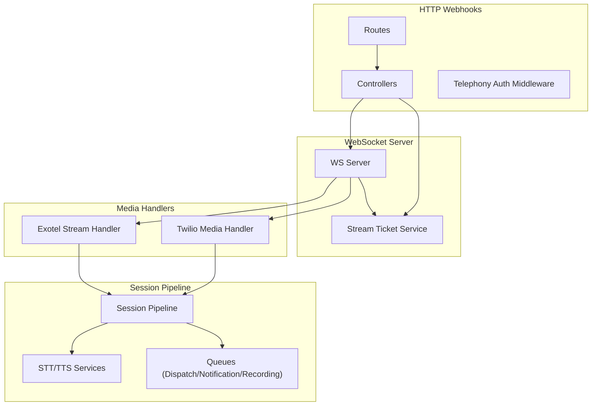
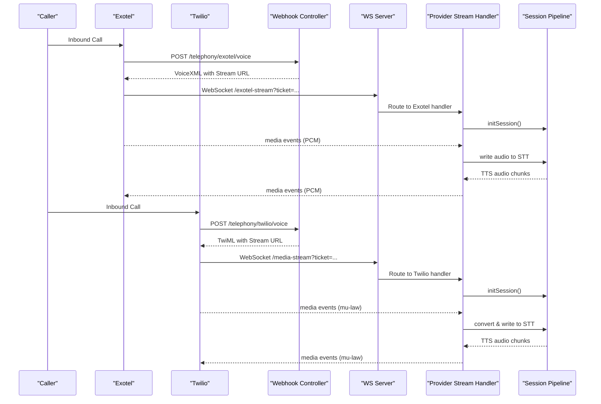
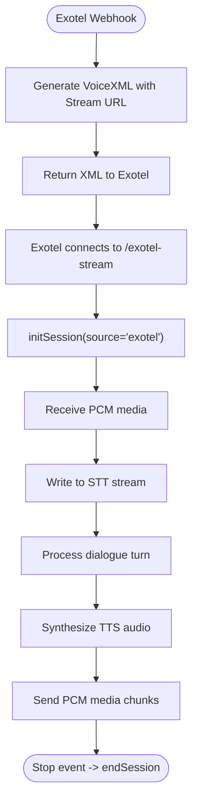
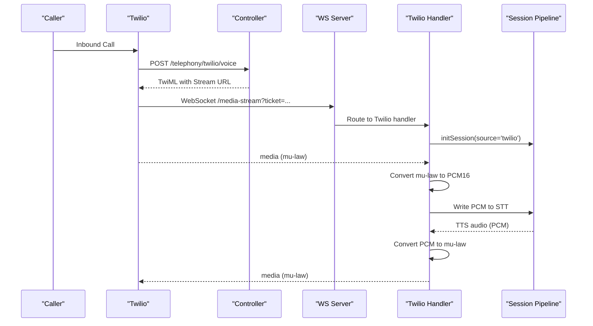
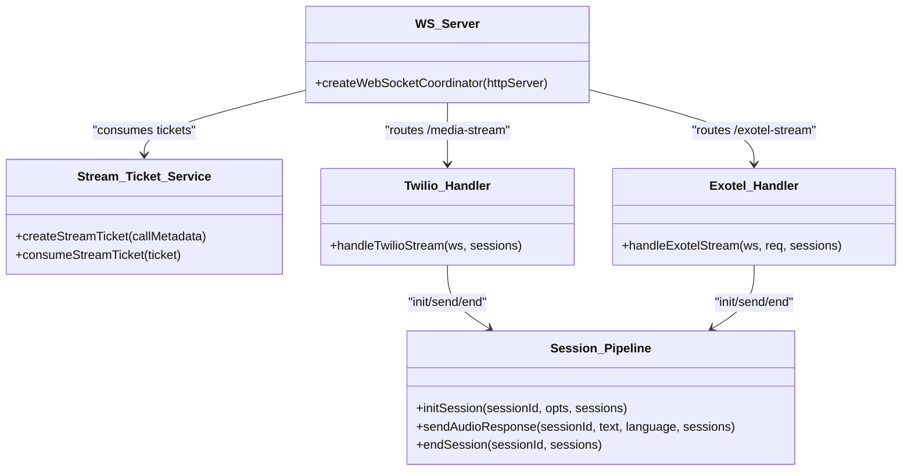
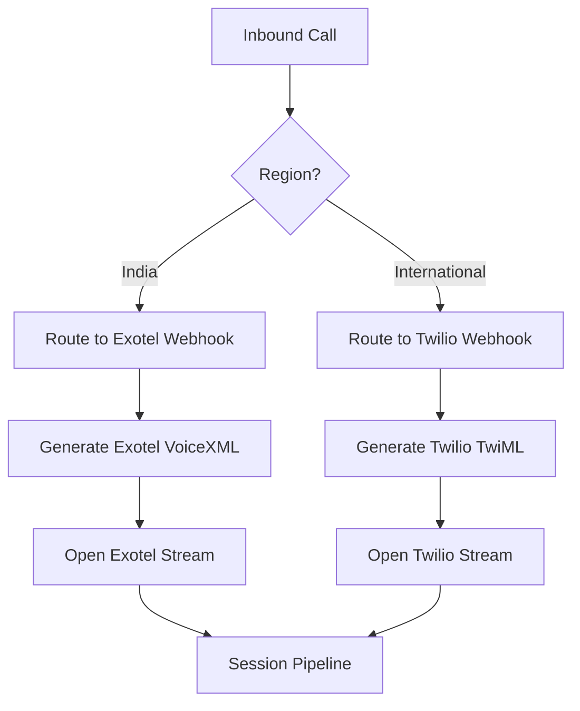
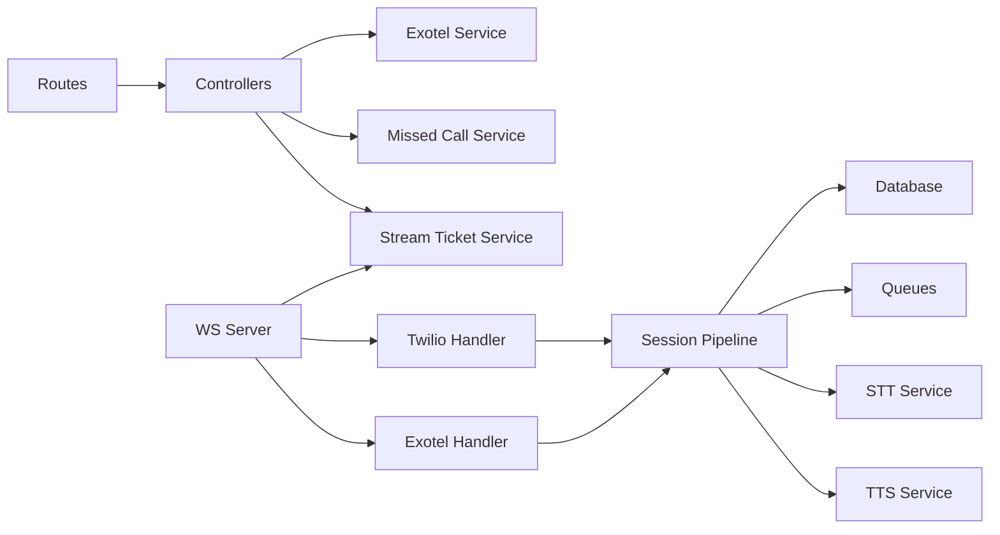

# Telephony Integration

<cite>
**Referenced Files in This Document**
- [telephony.controller.js](file://server/src/controllers/telephony.controller.js)
- [telephony.routes.js](file://server/src/routes/telephony.routes.js)
- [exotelService.js](file://server/src/services/exotelService.js)
- [mediaStreamHandler.js](file://server/src/websocket/mediaStreamHandler.js)
- [exotelStreamHandler.js](file://server/src/websocket/exotelStreamHandler.js)
- [sessionPipeline.js](file://server/src/websocket/sessionPipeline.js)
- [wsServer.js](file://server/src/websocket/wsServer.js)
- [wsTicketService.js](file://server/src/services/wsTicketService.js)
- [telephonyAuth.middleware.js](file://server/src/middleware/telephonyAuth.middleware.js)
- [env.js](file://server/src/config/env.js)
- [audioUtils.js](file://server/src/utils/audioUtils.js)
- [missedCallService.js](file://server/src/services/missedCallService.js)
</cite>

## Table of Contents
1. Introduction
2. Project Structure
3. Core Components
4. Architecture Overview
5. Detailed Component Analysis
6. Dependency Analysis
7. Performance Considerations
8. Troubleshooting Guide
9. Conclusion
10. Appendices

## Introduction
This document explains the telephony integration services in the Inkiro platform, focusing on Exotel and Twilio provider implementations for call initiation, media stream handling, and webhook processing. It details the WebSocket-based audio streaming architecture that enables real-time voice communication, call routing logic, caller ID management, and multi-provider failover mechanisms. It also covers configuration setup, credential management, environment-specific settings, error handling strategies, monitoring and logging of telephony metrics, call duration tracking, and cost optimization techniques.

## Project Structure
The telephony subsystem spans controllers, routes, middleware, services, and WebSocket handlers:
- Controllers expose HTTP endpoints for inbound webhooks from telephony providers and handle call flows (voice, missed calls, DTMF).
- Routes register provider-specific webhook endpoints with authentication middleware.
- Services implement provider-specific logic (Exotel XML generation, outbound calls) and shared utilities (stream tickets, missed-call callbacks).
- WebSocket server coordinates upgrades and authenticates connections via single-use tickets.
- Stream handlers process provider media events and integrate with a session pipeline that orchestrates STT/TTS, dialogue processing, order confirmation, and background tasks.
- Audio utilities convert between telephony codecs and formats required by speech services.

**Diagram sources**
- [telephony.routes.js:8-22](file://server/src/routes/telephony.routes.js#L8-L22)
- [telephony.controller.js:15-41](file://server/src/controllers/telephony.controller.js#L15-L41)
- [wsServer.js:23-146](file://server/src/websocket/wsServer.js#L23-L146)
- [mediaStreamHandler.js:7-55](file://server/src/websocket/mediaStreamHandler.js#L7-L55)
- [exotelStreamHandler.js:9-67](file://server/src/websocket/exotelStreamHandler.js#L9-L67)
- [sessionPipeline.js:24-111](file://server/src/websocket/sessionPipeline.js#L24-L111)

**Section sources**
- [telephony.routes.js:1-23](file://server/src/routes/telephony.routes.js#L1-L23)
- [telephony.controller.js:1-41](file://server/src/controllers/telephony.controller.js#L1-L41)
- [wsServer.js:1-162](file://server/src/websocket/wsServer.js#L1-L162)

## Core Components
- Provider webhooks: Exotel and Twilio inbound voice endpoints generate XML responses that instruct providers to open bidirectional WebSocket streams to the platform.
- Stream ticketing: Single-use tickets secure provider WebSocket connections and embed tenant/restaurant context.
- WebSocket upgrade and routing: Central WS server validates tickets and routes connections to provider-specific handlers.
- Session pipeline: Initializes sessions, streams audio to STT, processes dialogue turns, synthesizes TTS, persists orders, and triggers background workers.
- Audio conversion: Codec conversions ensure compatibility between provider media formats and STT/TTS requirements.
- Missed call and DTMF: Outbound callback and quick-reorder flows using Twilio when configured.

**Section sources**
- [telephony.controller.js:15-41](file://server/src/controllers/telephony.controller.js#L15-L41)
- [wsTicketService.js:52-66](file://server/src/services/wsTicketService.js#L52-L66)
- [wsServer.js:99-146](file://server/src/websocket/wsServer.js#L99-L146)
- [sessionPipeline.js:24-111](file://server/src/websocket/sessionPipeline.js#L24-L111)
- [audioUtils.js:21-33](file://server/src/utils/audioUtils.js#L21-L33)
- [missedCallService.js:21-48](file://server/src/services/missedCallService.js#L21-L48)

## Architecture Overview
The system supports two primary telephony providers:
- Exotel (India, TRAI-compliant): Uses VoiceXML AgentStream with PCM audio over WebSocket.
- Twilio (Global/international fallback): Uses TwiML Connect Stream with mu-law audio over WebSocket.

Both providers trigger inbound webhooks that return XML directing the provider to connect to a secured WebSocket endpoint. The WS server authenticates via single-use stream tickets and delegates to provider-specific handlers. These handlers initialize a session pipeline that manages STT/TTS, dialogue state, order creation, and background notifications.

**Diagram sources**
- [telephony.controller.js:15-41](file://server/src/controllers/telephony.controller.js#L15-L41)
- [wsServer.js:99-146](file://server/src/websocket/wsServer.js#L99-L146)
- [exotelStreamHandler.js:23-57](file://server/src/websocket/exotelStreamHandler.js#L23-L57)
- [mediaStreamHandler.js:21-55](file://server/src/websocket/mediaStreamHandler.js#L21-L55)
- [sessionPipeline.js:24-111](file://server/src/websocket/sessionPipeline.js#L24-L111)

## Detailed Component Analysis

### Exotel Implementation
- Inbound webhook: Generates VoiceXML that instructs Exotel to establish a bidirectional WebSocket stream to /exotel-stream with a secure ticket.
- Stream handler: Parses Exotel AgentStream events (connected, start, media, stop), initializes a session with source 'exotel', writes PCM audio to STT, and sends back TTS audio chunks.
- Outbound calls: Optional helper to initiate outbound calls with configurable caller ID and custom URL.

**Diagram sources**
- [telephony.controller.js:15-23](file://server/src/controllers/telephony.controller.js#L15-L23)
- [exotelStreamHandler.js:23-67](file://server/src/websocket/exotelStreamHandler.js#L23-L67)
- [sessionPipeline.js:24-111](file://server/src/websocket/sessionPipeline.js#L24-L111)

**Section sources**
- [exotelService.js:17-33](file://server/src/services/exotelService.js#L17-L33)
- [exotelService.js:38-83](file://server/src/services/exotelService.js#L38-L83)
- [exotelStreamHandler.js:9-79](file://server/src/websocket/exotelStreamHandler.js#L9-L79)

### Twilio Implementation
- Inbound webhook: Returns TwiML that plays a greeting and connects to /media-stream with a secure ticket.
- Stream handler: Parses Twilio Stream events (connected, start, media, stop), converts mu-law to PCM16, writes to STT, and sends back TTS audio chunks in mu-law format.
- Missed call callback: When configured, initiates an outbound call to the caller’s phone number using Twilio SDK.

**Diagram sources**
- [telephony.controller.js:28-41](file://server/src/controllers/telephony.controller.js#L28-L41)
- [mediaStreamHandler.js:7-55](file://server/src/websocket/mediaStreamHandler.js#L7-L55)
- [audioUtils.js:21-33](file://server/src/utils/audioUtils.js#L21-L33)
- [sessionPipeline.js:224-294](file://server/src/websocket/sessionPipeline.js#L224-L294)

**Section sources**
- [telephony.controller.js:28-41](file://server/src/controllers/telephony.controller.js#L28-L41)
- [mediaStreamHandler.js:7-69](file://server/src/websocket/mediaStreamHandler.js#L7-L69)
- [missedCallService.js:21-48](file://server/src/services/missedCallService.js#L21-L48)

### WebSocket-Based Audio Streaming Architecture
- Authentication: Single-use stream tickets created per call and consumed once at upgrade time; tickets include provider, caller phone, and tenant/restaurant context.
- Upgrade routing: WS server validates allowed paths, enforces production auth, and attaches stream metadata to requests.
- Provider handlers: Normalize provider-specific events into a common flow, initializing sessions and bridging audio to/from STT/TTS.
- Session lifecycle: initSession sets up STT stream, broadcasts call start, persists initial state; sendAudioResponse streams TTS audio back to provider or web client; endSession finalizes recording and cleanup.

**Diagram sources**
- [wsServer.js:23-146](file://server/src/websocket/wsServer.js#L23-L146)
- [wsTicketService.js:52-85](file://server/src/services/wsTicketService.js#L52-L85)
- [mediaStreamHandler.js:7-69](file://server/src/websocket/mediaStreamHandler.js#L7-L69)
- [exotelStreamHandler.js:9-79](file://server/src/websocket/exotelStreamHandler.js#L9-L79)
- [sessionPipeline.js:24-111](file://server/src/websocket/sessionPipeline.js#L24-L111)

**Section sources**
- [wsServer.js:1-162](file://server/src/websocket/wsServer.js#L1-L162)
- [wsTicketService.js:1-86](file://server/src/services/wsTicketService.js#L1-L86)
- [sessionPipeline.js:24-111](file://server/src/websocket/sessionPipeline.js#L24-L111)

### Call Routing Logic and Multi-Provider Failover
- Primary provider: Exotel is used for India (TRAI-compliant) inbound calls.
- Fallback provider: Twilio serves global/international inbound calls.
- Routing is achieved by exposing separate webhook endpoints per provider and configuring each provider to call its respective URL.
- Missed-call callback uses Twilio when credentials are present; otherwise, it logs mock behavior in development.

[No sources needed since this diagram shows conceptual workflow, not actual code structure]

**Section sources**
- [telephony.routes.js:8-14](file://server/src/routes/telephony.routes.js#L8-L14)
- [telephony.controller.js:15-41](file://server/src/controllers/telephony.controller.js#L15-L41)
- [missedCallService.js:21-48](file://server/src/services/missedCallService.js#L21-L48)

### Caller ID Management
- Exotel: Configurable caller ID via environment variable; default set to a local DID.
- Twilio: Uses configured phone number for outbound callbacks; inbound caller ID is derived from provider payloads.

**Section sources**
- [exotelService.js:8-12](file://server/src/services/exotelService.js#L8-L12)
- [exotelService.js:38-55](file://server/src/services/exotelService.js#L38-L55)
- [missedCallService.js:10-14](file://server/src/services/missedCallService.js#L10-L14)

### Configuration Setup and Credential Management
- Environment variables:
  - Exotel: SID, API key, API token, subdomain, caller ID.
  - Twilio: Account SID, auth token, phone number.
  - Platform: PORT, NODE_ENV, PUBLIC_URL, CORS_ORIGINS, encryption keys, map and AI service keys.
- Validation: Environment schema validates critical fields at startup.
- Security: Telephony webhook signatures verified via middleware; dev bypass available when explicitly enabled.

**Section sources**
- [exotelService.js:8-12](file://server/src/services/exotelService.js#L8-L12)
- [missedCallService.js:10-14](file://server/src/services/missedCallService.js#L10-L14)
- [env.js:3-24](file://server/src/config/env.js#L3-L24)
- [telephonyAuth.middleware.js:3-5](file://server/src/middleware/telephonyAuth.middleware.js#L3-L5)
- [telephonyAuth.middleware.js:10-39](file://server/src/middleware/telephonyAuth.middleware.js#L10-L39)
- [telephonyAuth.middleware.js:44-53](file://server/src/middleware/telephonyAuth.middleware.js#L44-L53)

### Error Handling Strategies
- Network failures: Try/catch around provider API calls and network requests; returns structured success/failure objects.
- Provider outages: Multi-provider routing allows switching between Exotel and Twilio based on region or configuration.
- Call quality issues: Codec conversion ensures compatibility; chunked streaming reduces latency and memory pressure.
- Session errors: Pipeline logs errors and continues processing where possible; endSession ensures cleanup even on close events.

**Section sources**
- [exotelService.js:57-83](file://server/src/services/exotelService.js#L57-L83)
- [missedCallService.js:24-48](file://server/src/services/missedCallService.js#L24-L48)
- [sessionPipeline.js:214-218](file://server/src/websocket/sessionPipeline.js#L214-L218)
- [sessionPipeline.js:394-436](file://server/src/websocket/sessionPipeline.js#L394-L436)

### Monitoring and Logging of Telephony Metrics
- Real-time dashboard events: Broadcasts call started, user speech, AI response, TTS complete, order confirmed, call ended with summaries including average latency.
- Latency tracing: Records per-turn stages (LLM, TTS) and aggregates averages per call.
- Recording persistence: Offloads combined audio chunks to worker queue for storage and duration calculation.

**Section sources**
- [sessionPipeline.js:54-73](file://server/src/websocket/sessionPipeline.js#L54-L73)
- [sessionPipeline.js:150-188](file://server/src/websocket/sessionPipeline.js#L150-L188)
- [sessionPipeline.js:236-244](file://server/src/websocket/sessionPipeline.js#L236-L244)
- [sessionPipeline.js:377-385](file://server/src/websocket/sessionPipeline.js#L377-L385)
- [sessionPipeline.js:419-431](file://server/src/websocket/sessionPipeline.js#L419-L431)

### Cost Optimization Techniques
- Chunked audio streaming: Sends small fixed-size chunks to reduce latency and buffer usage.
- Memory caps: Limits in-memory audio buffering per session to prevent excessive memory consumption.
- Background offloading: Order dispatch, notifications, and recording persistence are queued asynchronously to avoid blocking call flows.
- Region-aware routing: Use Exotel for domestic Indian calls to minimize costs and comply with regulations; use Twilio for international calls.

**Section sources**
- [sessionPipeline.js:246-269](file://server/src/websocket/sessionPipeline.js#L246-L269)
- [sessionPipeline.js:18-19](file://server/src/websocket/sessionPipeline.js#L18-L19)
- [sessionPipeline.js:357-375](file://server/src/websocket/sessionPipeline.js#L357-L375)
- [telephony.routes.js:8-14](file://server/src/routes/telephony.routes.js#L8-L14)

## Dependency Analysis
Key dependencies and relationships:
- Controllers depend on services (Exotel, missed call) and WebSocket ticket service.
- Routes wire controllers with authentication middleware.
- WS server depends on ticket service and provider handlers.
- Handlers depend on session pipeline for STT/TTS orchestration.
- Session pipeline depends on database, queues, and external services (STT/TTS, geocoding).

**Diagram sources**
- [telephony.routes.js:1-23](file://server/src/routes/telephony.routes.js#L1-L23)
- [telephony.controller.js:1-41](file://server/src/controllers/telephony.controller.js#L1-L41)
- [wsServer.js:1-162](file://server/src/websocket/wsServer.js#L1-L162)
- [sessionPipeline.js:1-16](file://server/src/websocket/sessionPipeline.js#L1-L16)

**Section sources**
- [telephony.routes.js:1-23](file://server/src/routes/telephony.routes.js#L1-L23)
- [telephony.controller.js:1-41](file://server/src/controllers/telephony.controller.js#L1-L41)
- [wsServer.js:1-162](file://server/src/websocket/wsServer.js#L1-L162)
- [sessionPipeline.js:1-16](file://server/src/websocket/sessionPipeline.js#L1-L16)

## Performance Considerations
- Audio codec conversion: Efficient mu-law to PCM16 conversion using precomputed tables minimizes CPU overhead.
- Chunk size tuning: Fixed chunk sizes balance latency and bandwidth; adjust based on provider constraints and network conditions.
- Memory limits: Enforce per-session audio byte caps to prevent memory leaks under load.
- Asynchronous processing: Offload non-critical tasks (dispatch, notifications, recording) to queues to keep call paths fast.
- Heartbeat liveness: WS server pings clients periodically to detect dead connections and free resources.

**Section sources**
- [audioUtils.js:7-19](file://server/src/utils/audioUtils.js#L7-L19)
- [audioUtils.js:21-33](file://server/src/utils/audioUtils.js#L21-L33)
- [sessionPipeline.js:18-19](file://server/src/websocket/sessionPipeline.js#L18-L19)
- [sessionPipeline.js:246-269](file://server/src/websocket/sessionPipeline.js#L246-L269)
- [wsServer.js:149-158](file://server/src/websocket/wsServer.js#L149-L158)

## Troubleshooting Guide
Common issues and resolutions:
- Invalid webhook signature: Ensure correct provider tokens are configured; verify signature computation matches provider expectations.
- Unauthorized stream connection: Confirm single-use stream tickets are generated and passed correctly; check TTL and Redis connectivity.
- No audio or poor quality: Verify codec conversions (mu-law <-> PCM16) and chunk sizes; check STT/TTS provider availability and latency.
- Call drops: Monitor WS heartbeat and ensure endSession runs on close events; check for unhandled exceptions in handlers.
- High memory usage: Review audio chunk accumulation and enforce memory caps; ensure recordings are offloaded promptly.

**Section sources**
- [telephonyAuth.middleware.js:10-39](file://server/src/middleware/telephonyAuth.middleware.js#L10-L39)
- [telephonyAuth.middleware.js:44-53](file://server/src/middleware/telephonyAuth.middleware.js#L44-L53)
- [wsServer.js:99-116](file://server/src/websocket/wsServer.js#L99-L116)
- [mediaStreamHandler.js:40-55](file://server/src/websocket/mediaStreamHandler.js#L40-L55)
- [exotelStreamHandler.js:45-67](file://server/src/websocket/exotelStreamHandler.js#L45-L67)
- [sessionPipeline.js:394-436](file://server/src/websocket/sessionPipeline.js#L394-L436)

## Conclusion
The Inkiro telephony integration provides robust, multi-provider support for real-time voice interactions through Exotel and Twilio. It leverages secure WebSocket streaming, efficient audio codec conversion, and a resilient session pipeline to deliver low-latency conversational experiences. With clear routing logic, caller ID management, and comprehensive monitoring, the system scales across regions while optimizing cost and performance. Proper configuration, credential management, and error handling ensure reliability and maintainability in production environments.

## Appendices

### Webhook Endpoints Summary
- Exotel inbound voice: POST /telephony/exotel/voice and /exotel/voice
- Twilio inbound voice: POST /telephony/twilio/voice and /voice
- Missed call callback: POST /api/missed-call
- DTMF quick-reorder: POST /api/telephony/dtmf
- Pin-drop page: GET /pin/:orderId
- Pin confirm: POST /api/pin-confirm

**Section sources**
- [telephony.routes.js:8-22](file://server/src/routes/telephony.routes.js#L8-L22)

### Environment Variables Reference
- Exotel: EXOTEL_SID, EXOTEL_API_KEY, EXOTEL_API_TOKEN, EXOTEL_SUB_DOMAIN, EXOTEL_CALLER_ID
- Twilio: TWILIO_ACCOUNT_SID, TWILIO_AUTH_TOKEN, TWILIO_PHONE_NUMBER
- Platform: PORT, NODE_ENV, PUBLIC_URL, CORS_ORIGINS, ENCRYPTION_KEY, GOOGLE_MAPS_API_KEY, GEMINI_API_KEY, GROQ_API_KEY, SARVAM_API_KEY

**Section sources**
- [exotelService.js:8-12](file://server/src/services/exotelService.js#L8-L12)
- [missedCallService.js:10-14](file://server/src/services/missedCallService.js#L10-L14)
- [env.js:3-24](file://server/src/config/env.js#L3-L24)