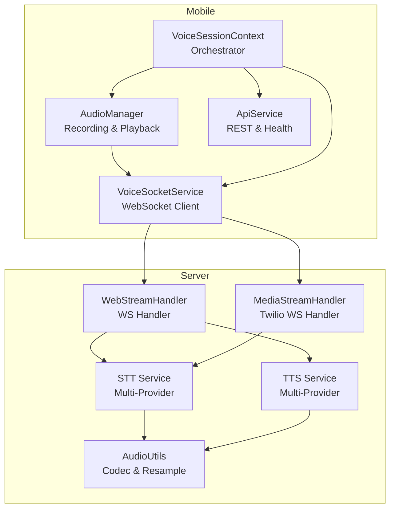
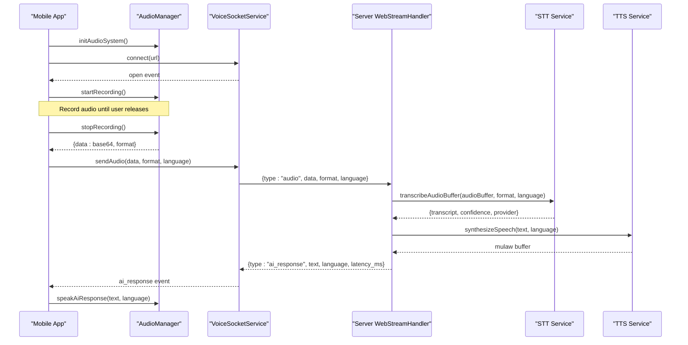
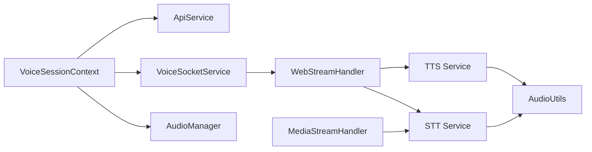

# Audio Services

<cite>
**Referenced Files in This Document**
- [audioManager.js](file://mobile/src/services/audioManager.js)
- [voiceSocketService.js](file://mobile/src/services/voiceSocketService.js)
- [apiService.js](file://mobile/src/services/apiService.js)
- [VoiceSessionContext.jsx](file://mobile/src/context/VoiceSessionContext.jsx)
- [webStreamHandler.js](file://server/src/websocket/webStreamHandler.js)
- [mediaStreamHandler.js](file://server/src/websocket/mediaStreamHandler.js)
- [sttService.js](file://server/src/services/sttService.js)
- [ttsService.js](file://server/src/services/ttsService.js)
- [audioUtils.js](file://server/src/utils/audioUtils.js)
- [package.json](file://mobile/package.json)
</cite>

## Table of Contents
1. [Introduction](#introduction)
2. [Project Structure](#project-structure)
3. [Core Components](#core-components)
4. [Architecture Overview](#architecture-overview)
5. [Detailed Component Analysis](#detailed-component-analysis)
6. [Dependency Analysis](#dependency-analysis)
7. [Performance Considerations](#performance-considerations)
8. [Troubleshooting Guide](#troubleshooting-guide)
9. [Conclusion](#conclusion)
10. [Appendices](#appendices)

## Introduction
This document describes the audio services layer that powers low-level audio processing and real-time network communication for voice interactions on mobile and server platforms. It covers:
- Mobile AudioManager for recording, playback, and permissions across iOS and Android via Expo APIs.
- VoiceSocketService for WebSocket connections, message handling, and reconnection patterns.
- ApiService for REST calls, health checks, and fallback behavior.
- Server-side streaming handlers for web and telephony media streams, speech-to-text (STT), text-to-speech (TTS), and audio format conversions.
It also documents audio formats, bitrate considerations, compression options, platform-specific behaviors, background audio constraints, memory management, error recovery strategies, timeout handling, and quality optimization for mobile networks.

## Project Structure
The audio pipeline spans mobile and server layers:
- Mobile app captures audio, manages permissions, and sends base64-encoded audio chunks over WebSocket to the server.
- Server receives messages, transcribes audio using STT providers, processes dialogue, synthesizes TTS responses, and streams back results to the client.
- Utilities handle codec conversions and resampling to meet telephony and STT/TTS requirements.

**Diagram sources**
- [audioManager.js:10-31](file://mobile/src/services/audioManager.js#L10-L31)
- [voiceSocketService.js:11-57](file://mobile/src/services/voiceSocketService.js#L11-L57)
- [apiService.js:10-48](file://mobile/src/services/apiService.js#L10-L48)
- [VoiceSessionContext.jsx:13-157](file://mobile/src/context/VoiceSessionContext.jsx#L13-L157)
- [webStreamHandler.js:7-81](file://server/src/websocket/webStreamHandler.js#L7-L81)
- [mediaStreamHandler.js:7-69](file://server/src/websocket/mediaStreamHandler.js#L7-L69)
- [sttService.js:83-210](file://server/src/services/sttService.js#L83-L210)
- [ttsService.js:28-70](file://server/src/services/ttsService.js#L28-L70)
- [audioUtils.js:26-83](file://server/src/utils/audioUtils.js#L26-L83)

**Section sources**
- [audioManager.js:1-131](file://mobile/src/services/audioManager.js#L1-L131)
- [voiceSocketService.js:1-129](file://mobile/src/services/voiceSocketService.js#L1-L129)
- [apiService.js:1-49](file://mobile/src/services/apiService.js#L1-L49)
- [VoiceSessionContext.jsx:1-302](file://mobile/src/context/VoiceSessionContext.jsx#L1-L302)
- [webStreamHandler.js:1-81](file://server/src/websocket/webStreamHandler.js#L1-L81)
- [mediaStreamHandler.js:1-69](file://server/src/websocket/mediaStreamHandler.js#L1-L69)
- [sttService.js:1-603](file://server/src/services/sttService.js#L1-L603)
- [ttsService.js:1-187](file://server/src/services/ttsService.js#L1-L187)
- [audioUtils.js:1-84](file://server/src/utils/audioUtils.js#L1-L84)
- [package.json:11-20](file://mobile/package.json#L11-L20)

## Core Components
- AudioManager: Initializes audio system, requests microphone permission, configures platform modes, starts/stops recordings, reads recorded files as base64, and handles TTS playback via native speech APIs.
- VoiceSocketService: Manages WebSocket lifecycle, event emission, sending audio/text/DTMF payloads, and disconnecting cleanly.
- ApiService: Derives HTTP base URL from WebSocket URL, fetches catalog with offline fallback, and pings server health with latency measurement.
- Server WebStreamHandler: Accepts mobile/web WebSocket connections, initializes sessions, routes audio/text messages, triggers STT, and orchestrates dialogue flow.
- Server MediaStreamHandler: Handles Twilio PSTN media streams, decodes mu-law to PCM16, feeds STT stream, and ends sessions on stop/close.
- STT Service: Multi-provider transcription (Groq Whisper, Google Cloud, local Whisper Tiny, mock), VAD-based chunking, language hints, and fallbacks.
- TTS Service: Multi-provider synthesis (Sarvam AI, Google Cloud, mock), caching, and conversion to telephony-friendly mulaw.
- AudioUtils: Codec conversions (mu-law ↔ PCM16) and resampling (16kHz to 8kHz).

**Section sources**
- [audioManager.js:10-131](file://mobile/src/services/audioManager.js#L10-L131)
- [voiceSocketService.js:11-129](file://mobile/src/services/voiceSocketService.js#L11-L129)
- [apiService.js:3-48](file://mobile/src/services/apiService.js#L3-L48)
- [webStreamHandler.js:7-81](file://server/src/websocket/webStreamHandler.js#L7-L81)
- [mediaStreamHandler.js:7-69](file://server/src/websocket/mediaStreamHandler.js#L7-L69)
- [sttService.js:83-603](file://server/src/services/sttService.js#L83-L603)
- [ttsService.js:28-187](file://server/src/services/ttsService.js#L28-L187)
- [audioUtils.js:26-83](file://server/src/utils/audioUtils.js#L26-L83)

## Architecture Overview
End-to-end flow for a voice interaction:
- Mobile initializes audio, connects WebSocket, and records audio chunks.
- On release, mobile sends base64 audio with format and language metadata.
- Server decodes/transcodes if needed, runs STT, processes dialogue, and synthesizes TTS.
- Server responds with transcript events and AI response text; mobile plays TTS locally.

**Diagram sources**
- [VoiceSessionContext.jsx:133-209](file://mobile/src/context/VoiceSessionContext.jsx#L133-L209)
- [voiceSocketService.js:11-75](file://mobile/src/services/voiceSocketService.js#L11-L75)
- [webStreamHandler.js:23-59](file://server/src/websocket/webStreamHandler.js#L23-L59)
- [sttService.js:83-210](file://server/src/services/sttService.js#L83-L210)
- [ttsService.js:28-70](file://server/src/services/ttsService.js#L28-L70)

## Detailed Component Analysis

### AudioManager (Mobile)
Responsibilities:
- Request microphone permissions and configure audio modes for iOS and Android.
- Start/stop high-quality recordings and read file content as base64.
- Manage speech playback with native TTS, including language selection and callbacks.

Key behaviors:
- Uses Expo AV for recording with high-quality presets and metering callback for audio level visualization.
- Stops any active speech before starting recording to avoid conflicts.
- Reads recorded file into base64 string and returns format metadata.
- Speaks AI responses with language mapping and error callbacks.

Platform notes:
- iOS: Allows recording and silent mode playback; does not stay active in background by default.
- Android: Ducks other audio during playback and uses speakerphone unless configured otherwise.

Error handling:
- Logs errors and returns boolean or null to indicate success/failure at each step.

Optimization tips:
- Use HIGH_QUALITY preset for better transcription accuracy; consider lower quality for bandwidth-constrained environments.
- Stop speech before recording to prevent audio routing conflicts.

**Section sources**
- [audioManager.js:10-31](file://mobile/src/services/audioManager.js#L10-L31)
- [audioManager.js:36-60](file://mobile/src/services/audioManager.js#L36-L60)
- [audioManager.js:65-90](file://mobile/src/services/audioManager.js#L65-L90)
- [audioManager.js:95-131](file://mobile/src/services/audioManager.js#L95-L131)

### VoiceSocketService (Mobile)
Responsibilities:
- Establish WebSocket connection, emit lifecycle events, and send typed messages (audio, text, DTMF).
- Provide an event emitter pattern for robust listener management.

Key behaviors:
- Sends a handshake “start” message upon connection.
- Parses incoming JSON messages and emits both generic “message” and specific event types.
- Gracefully closes connection and cleans up state on disconnect.

Reconnection strategy:
- The current implementation does not implement automatic reconnection; callers should manage retry logic based on “close” and “error” events.

Network considerations:
- Ensure connection is OPEN before sending; logs warnings when attempting to send while closed.

**Section sources**
- [voiceSocketService.js:11-57](file://mobile/src/services/voiceSocketService.js#L11-L57)
- [voiceSocketService.js:59-99](file://mobile/src/services/voiceSocketService.js#L59-L99)
- [voiceSocketService.js:101-129](file://mobile/src/services/voiceSocketService.js#L101-L129)

### ApiService (Mobile)
Responsibilities:
- Derive HTTP base URL from WebSocket URL for consistent endpoint resolution.
- Fetch menu catalog with offline fallback to ensure UI continuity.
- Ping server health endpoint and measure latency.

Error handling:
- Returns structured health check results even on failure.
- Falls back to static catalog data when network is unavailable.

Usage:
- Called during session initialization to pre-load catalog and verify connectivity.

**Section sources**
- [apiService.js:3-8](file://mobile/src/services/apiService.js#L3-L8)
- [apiService.js:10-48](file://mobile/src/services/apiService.js#L10-L48)

### VoiceSessionContext (Mobile Orchestrator)
Responsibilities:
- Initialize audio system and fetch catalog on mount.
- Connect WebSocket, manage call state, and handle transcript updates.
- Toggle push-to-talk recording, send text/DTMF, and play AI responses.

Flow highlights:
- Pings server health before connecting.
- Subscribes to “ai_response”, “stt_transcript”, “order_confirmed”, “close”, and “error” events.
- Normalizes audio metering values for visual feedback.

State management:
- Tracks recording state, AI speaking state, latency, and active language.

**Section sources**
- [VoiceSessionContext.jsx:13-39](file://mobile/src/context/VoiceSessionContext.jsx#L13-L39)
- [VoiceSessionContext.jsx:41-130](file://mobile/src/context/VoiceSessionContext.jsx#L41-L130)
- [VoiceSessionContext.jsx:133-209](file://mobile/src/context/VoiceSessionContext.jsx#L133-L209)
- [VoiceSessionContext.jsx:211-253](file://mobile/src/context/VoiceSessionContext.jsx#L211-L253)

### WebStreamHandler (Server)
Responsibilities:
- Handle WebSocket connections from mobile/web clients.
- Initialize sessions, route messages, trigger STT, and process dialogue.

Processing logic:
- For “audio” messages, decodes base64 to buffer, optionally transcribes, and pushes transcript to dialogue engine.
- For “text” messages, directly processes input.
- Ends sessions on “end” or close events.

Quality considerations:
- Buffers audio chunks up to a threshold to support batch transcription.

**Section sources**
- [webStreamHandler.js:7-22](file://server/src/websocket/webStreamHandler.js#L7-L22)
- [webStreamHandler.js:23-81](file://server/src/websocket/webStreamHandler.js#L23-L81)

### MediaStreamHandler (Server)
Responsibilities:
- Handle Twilio PSTN media streams.
- Decode mu-law to PCM16 and feed STT stream.

Processing logic:
- On “start”, initializes session with caller info and sends greeting.
- On “media”, accumulates PCM audio and writes to STT stream.
- On “stop” or close, ends session.

**Section sources**
- [mediaStreamHandler.js:7-38](file://server/src/websocket/mediaStreamHandler.js#L7-L38)
- [mediaStreamHandler.js:40-69](file://server/src/websocket/mediaStreamHandler.js#L40-L69)

### STT Service (Server)
Responsibilities:
- Transcribe audio buffers using multiple providers with fallbacks.
- Support streaming-like behavior via VAD-based chunking for batch providers.
- Provide language hints and catalog-aware phrase boosting.

Providers:
- Groq Whisper Large v3 Turbo (batch API) with configurable model and verbose output.
- Google Cloud Speech-to-Text (streaming) with enhanced models and alternative languages.
- Local Whisper Tiny (CPU inference) for offline-capable scenarios.
- Mock provider for development without credentials.

Key behaviors:
- Converts PCM16 to WAV when required by providers.
- Implements silence detection and interim transcripts for near-real-time UX.
- Caches and limits memory usage for streaming buffers.

Timeouts and resilience:
- Uses timeouts for external API calls and falls back gracefully when providers fail.

**Section sources**
- [sttService.js:83-210](file://server/src/services/sttService.js#L83-L210)
- [sttService.js:218-323](file://server/src/services/sttService.js#L218-L323)
- [sttService.js:329-454](file://server/src/services/sttService.js#L329-L454)
- [sttService.js:459-603](file://server/src/services/sttService.js#L459-L603)

### TTS Service (Server)
Responsibilities:
- Synthesize text to speech using multiple providers with caching.
- Convert outputs to telephony-friendly mulaw (8kHz) for playback.

Providers:
- Sarvam AI Bulbul (optimized for Indian languages).
- Google Cloud Text-to-Speech (WaveNet voices).
- Mock generator for development.

Caching:
- In-memory cache keyed by provider, language, and text to reduce redundant synthesis.

Output format:
- Produces mulaw buffers suitable for telephony or direct consumption by downstream components.

**Section sources**
- [ttsService.js:28-70](file://server/src/services/ttsService.js#L28-L70)
- [ttsService.js:75-120](file://server/src/services/ttsService.js#L75-L120)
- [ttsService.js:125-148](file://server/src/services/ttsService.js#L125-L148)
- [ttsService.js:154-187](file://server/src/services/ttsService.js#L154-L187)

### AudioUtils (Server)
Responsibilities:
- Convert between mu-law and PCM16 formats.
- Resample 16kHz PCM16 down to 8kHz via decimation.

Use cases:
- Telephony providers expect 8kHz mu-law; STT engines prefer 16kHz or 8kHz PCM16.
- Ensures compatibility across different audio pipelines.

Complexity:
- Linear time relative to buffer size; efficient table lookup for mu-law decoding.

**Section sources**
- [audioUtils.js:26-33](file://server/src/utils/audioUtils.js#L26-L33)
- [audioUtils.js:40-71](file://server/src/utils/audioUtils.js#L40-L71)
- [audioUtils.js:76-83](file://server/src/utils/audioUtils.js#L76-L83)

## Dependency Analysis
Component relationships and coupling:
- VoiceSessionContext depends on AudioManager, VoiceSocketService, and ApiService to orchestrate calls and UI state.
- WebStreamHandler depends on STT and TTS services to process inputs and generate responses.
- MediaStreamHandler depends on AudioUtils for codec conversion and STT service for transcription.
- STT and TTS services depend on AudioUtils for format compatibility.

External integrations:
- STT integrates with Groq Whisper, Google Cloud Speech, and optional local Whisper model.
- TTS integrates with Sarvam AI, Google Cloud TTS, and provides a mock generator.
- Mobile dependencies are provided by Expo ecosystem packages.

**Diagram sources**
- [VoiceSessionContext.jsx:1-302](file://mobile/src/context/VoiceSessionContext.jsx#L1-L302)
- [webStreamHandler.js:1-81](file://server/src/websocket/webStreamHandler.js#L1-L81)
- [mediaStreamHandler.js:1-69](file://server/src/websocket/mediaStreamHandler.js#L1-L69)
- [sttService.js:1-603](file://server/src/services/sttService.js#L1-L603)
- [ttsService.js:1-187](file://server/src/services/ttsService.js#L1-L187)
- [audioUtils.js:1-84](file://server/src/utils/audioUtils.js#L1-L84)

**Section sources**
- [VoiceSessionContext.jsx:1-302](file://mobile/src/context/VoiceSessionContext.jsx#L1-L302)
- [webStreamHandler.js:1-81](file://server/src/websocket/webStreamHandler.js#L1-L81)
- [mediaStreamHandler.js:1-69](file://server/src/websocket/mediaStreamHandler.js#L1-L69)
- [sttService.js:1-603](file://server/src/services/sttService.js#L1-L603)
- [ttsService.js:1-187](file://server/src/services/ttsService.js#L1-L187)
- [audioUtils.js:1-84](file://server/src/utils/audioUtils.js#L1-L84)

## Performance Considerations
- Recording quality vs bandwidth: HIGH_QUALITY improves transcription accuracy but increases payload size; consider adaptive quality based on network conditions.
- Base64 encoding overhead: Sending base64 adds ~33% overhead; for large payloads, consider binary frames or chunked transfers if supported.
- STT provider selection: Groq Whisper offers fast batch transcription; Google Cloud provides streaming with lower latency; local Whisper reduces dependency on external APIs.
- TTS caching: Repeated prompts are cached to reduce synthesis cost and latency.
- Buffer management: STT streaming buffers are limited to prevent unbounded memory growth; ensure timely transcription and cleanup.
- Network timeouts: External API calls use timeouts to avoid hanging connections; implement retries with exponential backoff at the application layer.
- Background audio: iOS does not keep audio active in background by default; design flows to complete critical tasks before backgrounding.

[No sources needed since this section provides general guidance]

## Troubleshooting Guide
Common issues and resolutions:
- Microphone permission denied: Ensure initAudioSystem is called before recording; handle false return and prompt user to grant permissions.
- No audio received on server: Verify WebSocket connection is OPEN before sending; check network reachability and firewall rules.
- STT failures: Check provider configuration and API keys; rely on fallback providers and mock mode for development.
- TTS playback issues: Confirm language codes and platform TTS availability; handle onError callbacks to degrade gracefully.
- Memory pressure: Monitor audio chunk accumulation; ensure sessions end promptly and buffers are cleared.
- High latency: Measure ping latency; switch to faster STT providers or reduce recording quality.

Operational checks:
- Use pingServerHealth to validate connectivity and latency prior to initiating calls.
- Log and surface errors from WebSocket events and audio operations to aid debugging.

**Section sources**
- [apiService.js:38-48](file://mobile/src/services/apiService.js#L38-L48)
- [voiceSocketService.js:42-66](file://mobile/src/services/voiceSocketService.js#L42-L66)
- [sttService.js:146-149](file://server/src/services/sttService.js#L146-L149)
- [ttsService.js:102-105](file://server/src/services/ttsService.js#L102-L105)

## Conclusion
The audio services layer integrates mobile audio capture and playback with robust server-side streaming, transcription, and synthesis. It supports multiple providers, resilient error handling, and platform-specific optimizations. By carefully managing permissions, formats, and network conditions, the system delivers reliable voice interactions across mobile devices and telephony channels.

[No sources needed since this section summarizes without analyzing specific files]

## Appendices

### Audio Format Specifications and Settings
- Mobile recording: Uses high-quality presets; output format is m4a; recorded files are read as base64 strings for transmission.
- Server STT: Accepts various formats (m4a, wav, mp3, webm); converts PCM16 to WAV when required; supports 8kHz and 16kHz sample rates depending on provider.
- Server TTS: Outputs mulaw at 8kHz for telephony compatibility; caches repeated prompts to improve performance.
- Codec conversions: Mu-law ↔ PCM16 and resampling from 16kHz to 8kHz ensure interoperability across providers.

**Section sources**
- [audioManager.js:48-84](file://mobile/src/services/audioManager.js#L48-L84)
- [webStreamHandler.js:28-40](file://server/src/websocket/webStreamHandler.js#L28-L40)
- [sttService.js:83-210](file://server/src/services/sttService.js#L83-L210)
- [ttsService.js:28-70](file://server/src/services/ttsService.js#L28-L70)
- [audioUtils.js:26-83](file://server/src/utils/audioUtils.js#L26-L83)

### Platform-Specific Notes
- iOS: Records with allowsRecordingIOS enabled; plays in silent mode; does not stay active in background by default.
- Android: Ducks other audio during playback; can be configured to use earpiece or speakerphone.
- Expo dependencies: Audio recording and speech playback are provided by expo-av and expo-speech.

**Section sources**
- [audioManager.js:18-24](file://mobile/src/services/audioManager.js#L18-L24)
- [package.json:11-20](file://mobile/package.json#L11-L20)

### Error Recovery and Network Timeouts
- WebSocket: Emit “error” and “close” events; application should handle reconnection attempts and user notifications.
- STT/TTS: Providers include timeouts and fallbacks; ensure environment variables are configured for production reliability.
- API health checks: Use ping endpoints to detect connectivity issues early.

**Section sources**
- [voiceSocketService.js:42-57](file://mobile/src/services/voiceSocketService.js#L42-L57)
- [sttService.js:124-149](file://server/src/services/sttService.js#L124-L149)
- [ttsService.js:99-105](file://server/src/services/ttsService.js#L99-L105)
- [apiService.js:38-48](file://mobile/src/services/apiService.js#L38-L48)