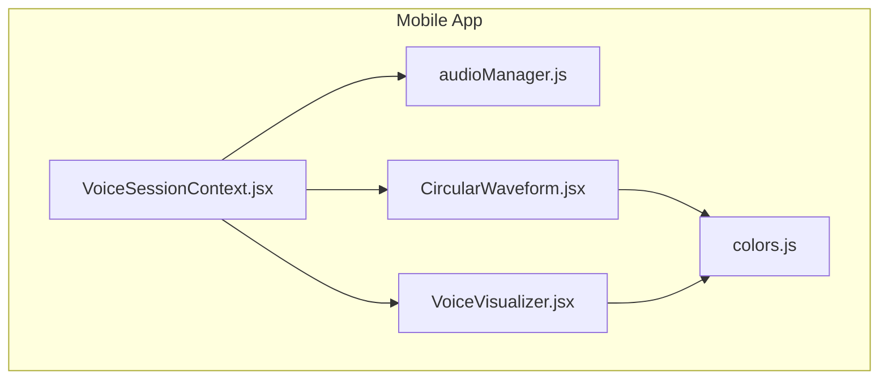
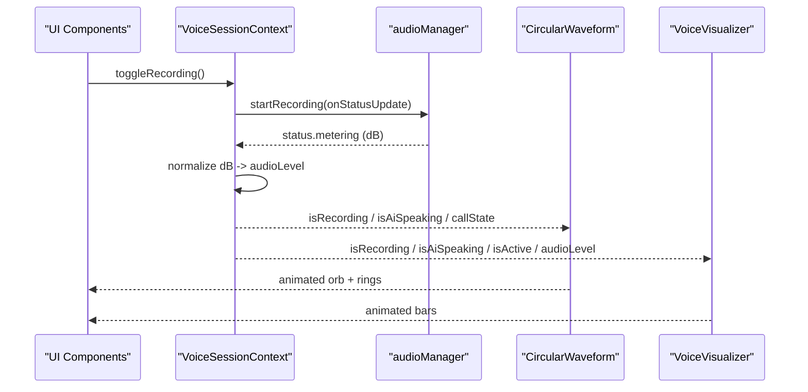
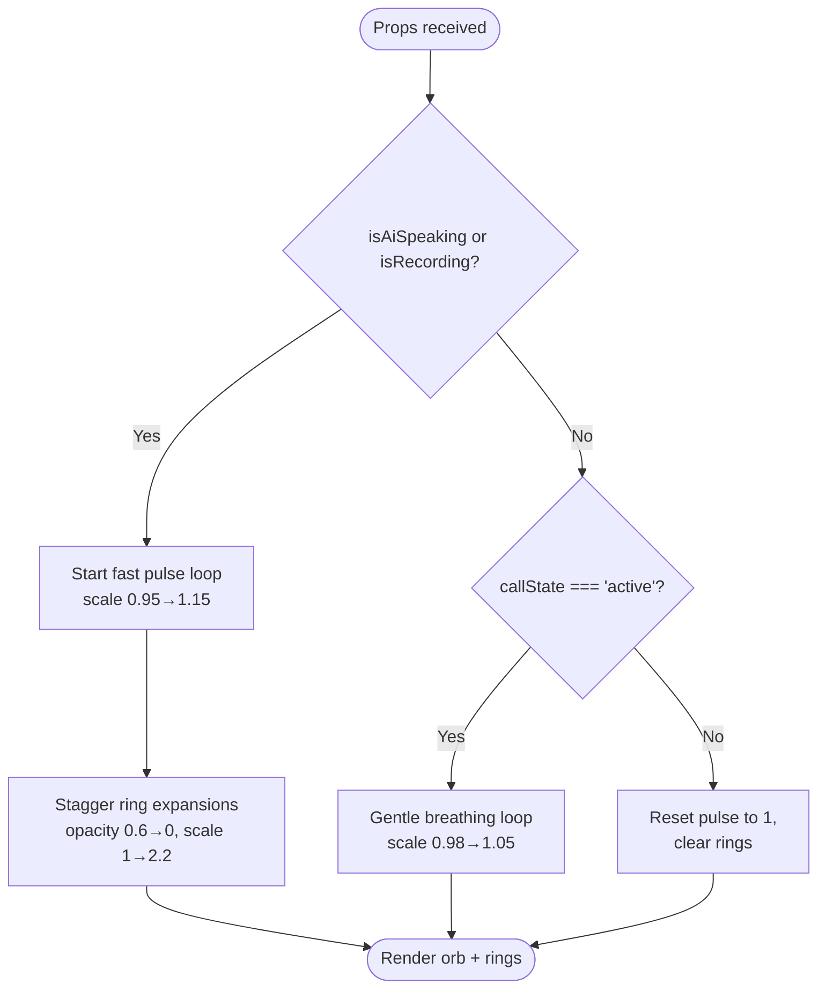
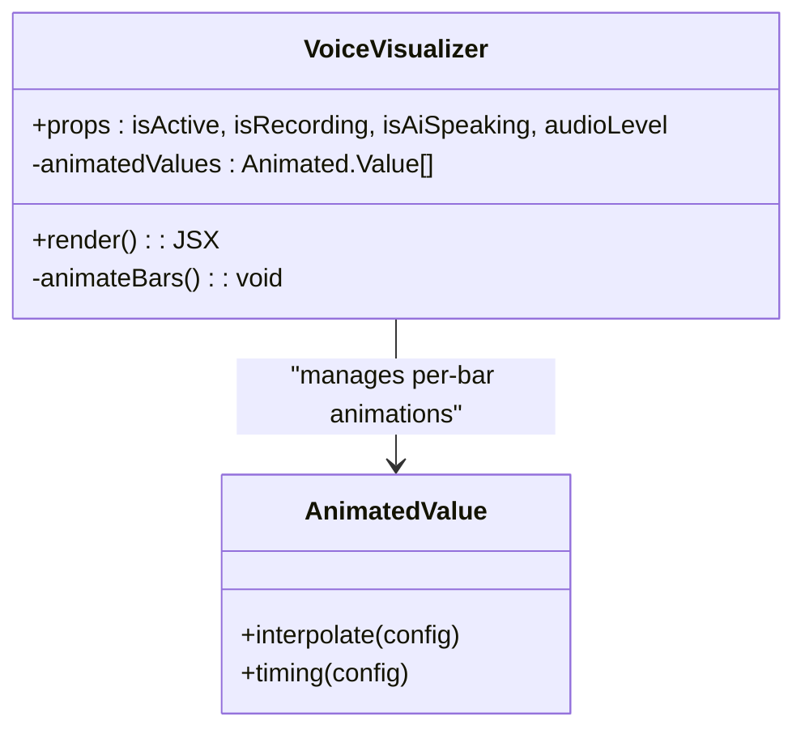
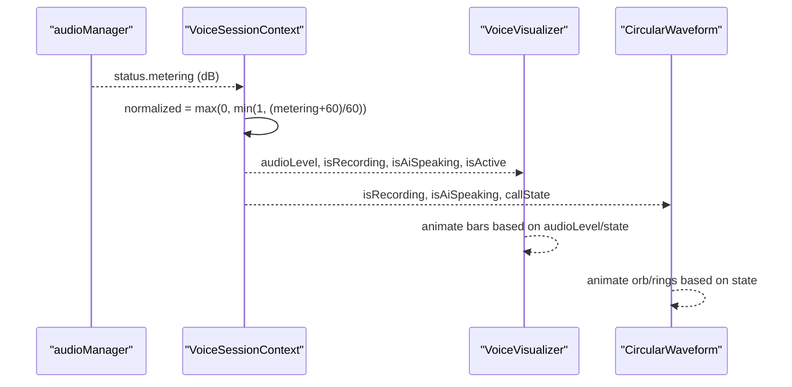
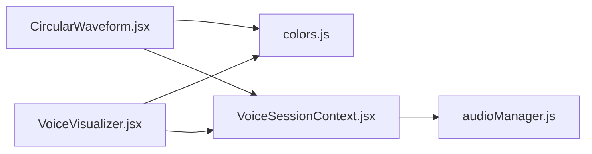

# Audio Visualization Components

<cite>
**Referenced Files in This Document**
- [CircularWaveform.jsx](file://mobile/src/components/visualizers/CircularWaveform.jsx)
- [VoiceVisualizer.jsx](file://mobile/src/components/visualizers/VoiceVisualizer.jsx)
- [audioManager.js](file://mobile/src/services/audioManager.js)
- [VoiceSessionContext.jsx](file://mobile/src/context/VoiceSessionContext.jsx)
- [colors.js](file://mobile/src/theme/colors.js)
</cite>

## Table of Contents
1. [Introduction](#introduction)
2. [Project Structure](#project-structure)
3. [Core Components](#core-components)
4. [Architecture Overview](#architecture-overview)
5. [Detailed Component Analysis](#detailed-component-analysis)
6. [Dependency Analysis](#dependency-analysis)
7. [Performance Considerations](#performance-considerations)
8. [Troubleshooting Guide](#troubleshooting-guide)
9. [Conclusion](#conclusion)
10. [Appendices](#appendices)

## Introduction
This document explains the audio visualization components that provide real-time feedback during voice interactions on mobile devices. It focuses on:
- CircularWaveform: an animated circular indicator that reflects call state and activity (recording, AI speaking, active).
- VoiceVisualizer: a multi-bar waveform that animates differently based on recording, AI speaking, and idle states.
It also covers performance techniques used to maintain smooth animations on mobile, configuration options for visual styles and animation speeds, responsive sizing behavior, and platform-specific considerations for iOS and Android related to audio and battery usage.

## Project Structure
The audio visualization system is implemented in the mobile app under src/components/visualizers and integrates with audio services and session context to reflect live states.

**Diagram sources**
- [VoiceSessionContext.jsx:13-302](file://mobile/src/context/VoiceSessionContext.jsx#L13-L302)
- [audioManager.js:10-131](file://mobile/src/services/audioManager.js#L10-L131)
- [CircularWaveform.jsx:1-216](file://mobile/src/components/visualizers/CircularWaveform.jsx#L1-L216)
- [VoiceVisualizer.jsx:1-134](file://mobile/src/components/visualizers/VoiceVisualizer.jsx#L1-L134)
- [colors.js:1-60](file://mobile/src/theme/colors.js#L1-L60)

**Section sources**
- [VoiceSessionContext.jsx:13-302](file://mobile/src/context/VoiceSessionContext.jsx#L13-L302)
- [audioManager.js:10-131](file://mobile/src/services/audioManager.js#L10-L131)
- [CircularWaveform.jsx:1-216](file://mobile/src/components/visualizers/CircularWaveform.jsx#L1-L216)
- [VoiceVisualizer.jsx:1-134](file://mobile/src/components/visualizers/VoiceVisualizer.jsx#L1-L134)
- [colors.js:1-60](file://mobile/src/theme/colors.js#L1-L60)

## Core Components
- CircularWaveform: Renders a pulsing orb with expanding rings when recording or AI is speaking; gentle breathing when the call is active; neutral state otherwise. Uses native driver animations for scale and opacity to optimize performance.
- VoiceVisualizer: Renders 24 bars that animate heights based on state:
  - Recording: dynamic energy driven by microphone level with sinusoidal variance.
  - AI speaking: energetic cadence with center-weighted peaks and randomization.
  - Active/idle: subtle breathing wave.
  Uses parallel timing animations per bar for smooth motion.

Key props and behaviors:
- CircularWaveform(callState, isRecording, isAiSpeaking): controls pulse speed, ring expansion, and colors.
- VoiceVisualizer(isActive, isRecording, isAiSpeaking, audioLevel): drives bar heights and colors based on state and audio level.

**Section sources**
- [CircularWaveform.jsx:5-177](file://mobile/src/components/visualizers/CircularWaveform.jsx#L5-L177)
- [VoiceVisualizer.jsx:7-109](file://mobile/src/components/visualizers/VoiceVisualizer.jsx#L7-L109)

## Architecture Overview
The visualization components consume state from the voice session context and audio service:
- VoiceSessionContext manages call state, recording flags, AI speaking flag, and normalized audio level.
- audioManager handles permissions, recording start/stop, and speech playback.
- Visualizers react to these flags and levels to render animations.

**Diagram sources**
- [VoiceSessionContext.jsx:171-209](file://mobile/src/context/VoiceSessionContext.jsx#L171-L209)
- [audioManager.js:36-60](file://mobile/src/services/audioManager.js#L36-L60)
- [CircularWaveform.jsx:14-94](file://mobile/src/components/visualizers/CircularWaveform.jsx#L14-L94)
- [VoiceVisualizer.jsx:17-74](file://mobile/src/components/visualizers/VoiceVisualizer.jsx#L17-L74)

## Detailed Component Analysis

### CircularWaveform
Responsibilities:
- Display a central orb with color and glow changes based on state.
- Animate outer rings that expand and fade when recording or AI speaking.
- Provide different pulse cadences for AI speaking vs recording vs active.

Animation details:
- Pulse animation uses Animated.Value with useNativeDriver for scale.
- Ring animations stagger two rings with timing sequences to create ripple effects.
- Idle state resets animations to neutral values.

Color logic:
- Colors are derived from theme tokens for recording (red), AI speaking (primary), active (accent blue), and idle (border).

Responsive sizing:
- Fixed container height and orb dimensions ensure consistent layout across devices.

**Diagram sources**
- [CircularWaveform.jsx:14-94](file://mobile/src/components/visualizers/CircularWaveform.jsx#L14-L94)
- [CircularWaveform.jsx:96-177](file://mobile/src/components/visualizers/CircularWaveform.jsx#L96-L177)

**Section sources**
- [CircularWaveform.jsx:5-216](file://mobile/src/components/visualizers/CircularWaveform.jsx#L5-L216)

### VoiceVisualizer
Responsibilities:
- Render 24 vertical bars whose heights animate based on state and audio input.
- Provide distinct visual modes:
  - Recording: base height influenced by normalized audio level with sinusoidal variation per bar index.
  - AI speaking: energetic cadence with center-weighted peaks and randomized factors.
  - Active/idle: subtle breathing wave using sine functions over time.

Animation details:
- Each bar has its own Animated.Value initialized to a small baseline.
- Animations are created per frame and run in parallel with short durations for responsiveness.
- Bar heights are interpolated from normalized values to pixel ranges.

Color and opacity:
- Bar color switches between recording red, AI primary, and muted text color.
- Opacity adjusts based on active state to emphasize live interaction.

**Diagram sources**
- [VoiceVisualizer.jsx:13-74](file://mobile/src/components/visualizers/VoiceVisualizer.jsx#L13-L74)
- [VoiceVisualizer.jsx:76-109](file://mobile/src/components/visualizers/VoiceVisualizer.jsx#L76-L109)

**Section sources**
- [VoiceVisualizer.jsx:1-134](file://mobile/src/components/visualizers/VoiceVisualizer.jsx#L1-L134)

### Audio Integration and State Flow
- VoiceSessionContext normalizes microphone metering into a 0–1 range and updates audioLevel.
- When AI responds, it triggers speech playback and sets isAiSpeaking flags.
- Visualizers consume these flags and levels to drive animations.

**Diagram sources**
- [VoiceSessionContext.jsx:198-203](file://mobile/src/context/VoiceSessionContext.jsx#L198-L203)
- [VoiceVisualizer.jsx:21-56](file://mobile/src/components/visualizers/VoiceVisualizer.jsx#L21-L56)
- [CircularWaveform.jsx:17-94](file://mobile/src/components/visualizers/CircularWaveform.jsx#L17-L94)

**Section sources**
- [VoiceSessionContext.jsx:171-209](file://mobile/src/context/VoiceSessionContext.jsx#L171-L209)
- [audioManager.js:36-60](file://mobile/src/services/audioManager.js#L36-L60)

## Dependency Analysis
- CircularWaveform depends on theme colors for styling and React Native’s Animated API.
- VoiceVisualizer depends on theme colors and Animated API for per-bar animations.
- Both components depend on VoiceSessionContext for state and audioManager for audio lifecycle and metering.

**Diagram sources**
- [CircularWaveform.jsx:1-216](file://mobile/src/components/visualizers/CircularWaveform.jsx#L1-L216)
- [VoiceVisualizer.jsx:1-134](file://mobile/src/components/visualizers/VoiceVisualizer.jsx#L1-L134)
- [VoiceSessionContext.jsx:13-302](file://mobile/src/context/VoiceSessionContext.jsx#L13-L302)
- [audioManager.js:10-131](file://mobile/src/services/audioManager.js#L10-L131)
- [colors.js:1-60](file://mobile/src/theme/colors.js#L1-L60)

**Section sources**
- [CircularWaveform.jsx:1-216](file://mobile/src/components/visualizers/CircularWaveform.jsx#L1-L216)
- [VoiceVisualizer.jsx:1-134](file://mobile/src/components/visualizers/VoiceVisualizer.jsx#L1-L134)
- [VoiceSessionContext.jsx:13-302](file://mobile/src/context/VoiceSessionContext.jsx#L13-L302)
- [audioManager.js:10-131](file://mobile/src/services/audioManager.js#L10-L131)
- [colors.js:1-60](file://mobile/src/theme/colors.js#L1-L60)

## Performance Considerations
Techniques observed in the codebase for smooth rendering:
- Use of Animated.Value with useNativeDriver where applicable to offload work to native threads (e.g., scale and opacity in CircularWaveform).
- Parallelizing per-bar animations to reduce jank and keep frame times low.
- Short animation durations (e.g., ~80ms for AI speaking mode) to respond quickly to state changes while maintaining fluidity.
- Baseline animation values to avoid large jumps and minimize layout thrash.
- Normalized audio level mapping to a stable 0–1 range to prevent erratic animations.

Platform-specific notes grounded in the code:
- iOS:
  - Audio mode configured to allow recording and play in silent mode, which ensures audible feedback without interfering with device mute settings.
  - Background activity disabled to conserve battery when not needed.
- Android:
  - Ducking enabled so other audio can temporarily lower volume during voice interactions.
  - Play-through earpiece disabled to route audio appropriately for hands-free scenarios.

Battery optimization hints:
- Disabling background activity reduces unnecessary wake-ups.
- Stopping speech playback when ending calls prevents continuous CPU/GPU usage.

[No sources needed since this section provides general guidance]

## Troubleshooting Guide
Common issues and resolutions:
- Microphone permission not granted:
  - The audio initialization requests permissions and logs a warning if denied. Ensure user grants permission before starting recording.
- No audio metering:
  - Verify that recording starts successfully and that metering callbacks are invoked; check the status object for metering values.
- Speech conflicts:
  - Starting recording stops any ongoing speech playback to avoid conflicts. Ending a call stops speech to release resources.
- Connection errors:
  - If WebSocket connection fails, the context alerts the user and resets call state to idle.

Operational tips:
- Always stop speech before starting recording to prevent audio channel contention.
- Normalize audio levels to avoid extreme animation spikes.
- Ensure animations are stopped on unmount to prevent memory leaks.

**Section sources**
- [audioManager.js:10-31](file://mobile/src/services/audioManager.js#L10-L31)
- [audioManager.js:36-60](file://mobile/src/services/audioManager.js#L36-L60)
- [audioManager.js:95-131](file://mobile/src/services/audioManager.js#L95-L131)
- [VoiceSessionContext.jsx:108-129](file://mobile/src/context/VoiceSessionContext.jsx#L108-L129)
- [VoiceSessionContext.jsx:159-169](file://mobile/src/context/VoiceSessionContext.jsx#L159-L169)

## Conclusion
The audio visualization components provide clear, state-driven feedback during voice interactions:
- CircularWaveform communicates call state and activity through pulsing and ring animations.
- VoiceVisualizer renders dynamic bar animations that reflect recording energy and AI speech cadence.
Both components leverage React Native’s Animated API with performance-conscious patterns such as native driver usage, parallel animations, and short durations to achieve smooth visuals on mobile. The integration with audioManager and VoiceSessionContext ensures accurate state synchronization and efficient resource management across iOS and Android.

[No sources needed since this section summarizes without analyzing specific files]

## Appendices

### Configuration Options
- CircularWaveform:
  - callState: controls idle vs active behavior.
  - isRecording: enables recording mode with faster pulse and ring ripples.
  - isAiSpeaking: enables AI speaking mode with fastest pulse cadence.
- VoiceVisualizer:
  - isActive: toggles idle breathing wave and opacity.
  - isRecording: drives bar heights from normalized audio level.
  - isAiSpeaking: switches to energetic cadence with randomized peaks.
  - audioLevel: normalized 0–1 value influencing recording mode bar heights.

### Responsive Sizing
- CircularWaveform uses fixed container and orb sizes for consistent appearance across devices.
- VoiceVisualizer uses percentage width and fixed bar widths/gaps to fill available space while maintaining readability.

### Platform-Specific Settings
- iOS:
  - Allows recording and plays in silent mode; disables background activity.
- Android:
  - Ducks other audio during voice interactions; disables earpiece routing.

**Section sources**
- [CircularWaveform.jsx:5-177](file://mobile/src/components/visualizers/CircularWaveform.jsx#L5-L177)
- [VoiceVisualizer.jsx:7-109](file://mobile/src/components/visualizers/VoiceVisualizer.jsx#L7-L109)
- [audioManager.js:18-24](file://mobile/src/services/audioManager.js#L18-L24)