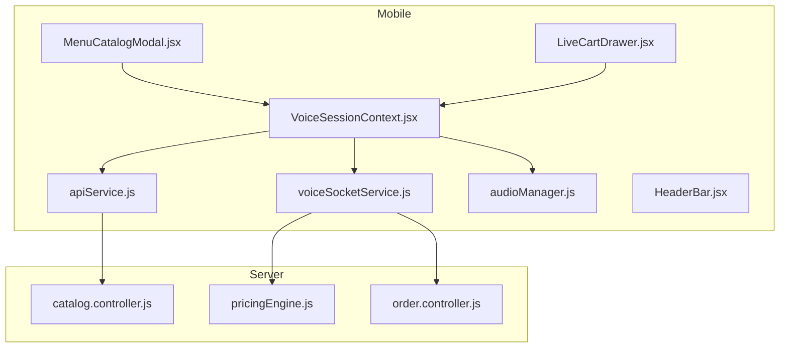
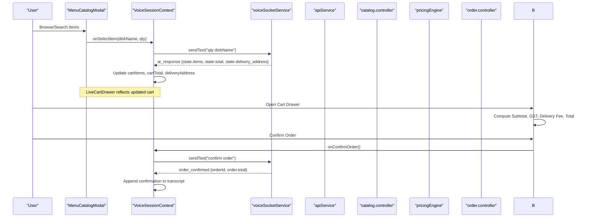
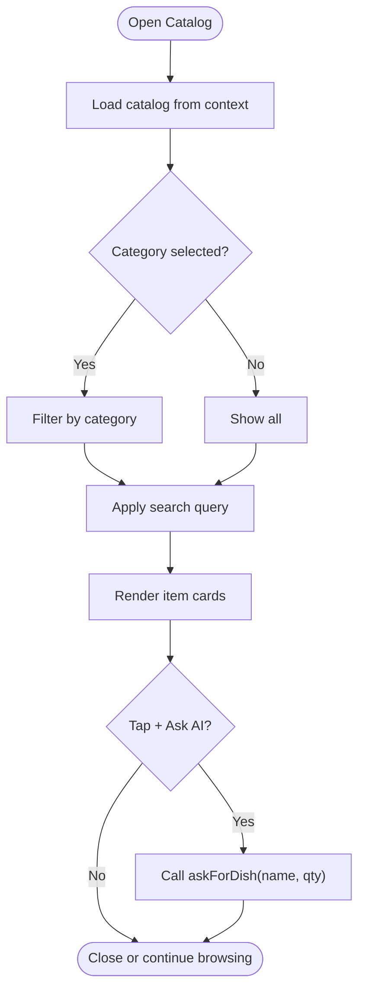
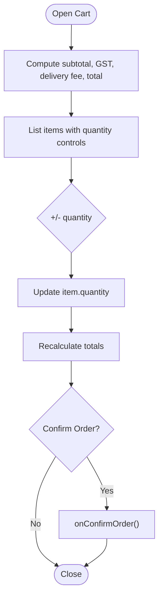
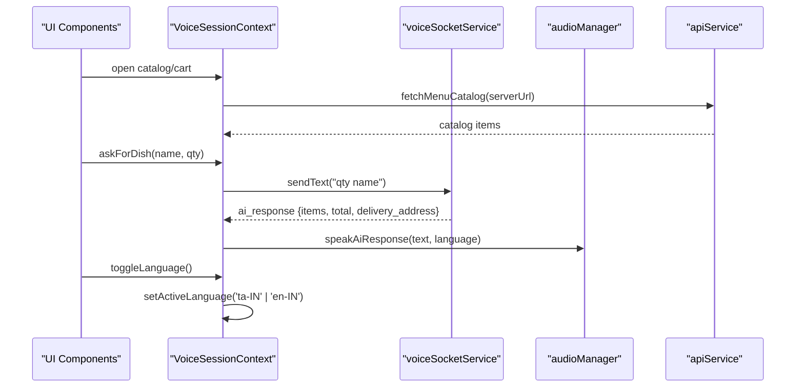
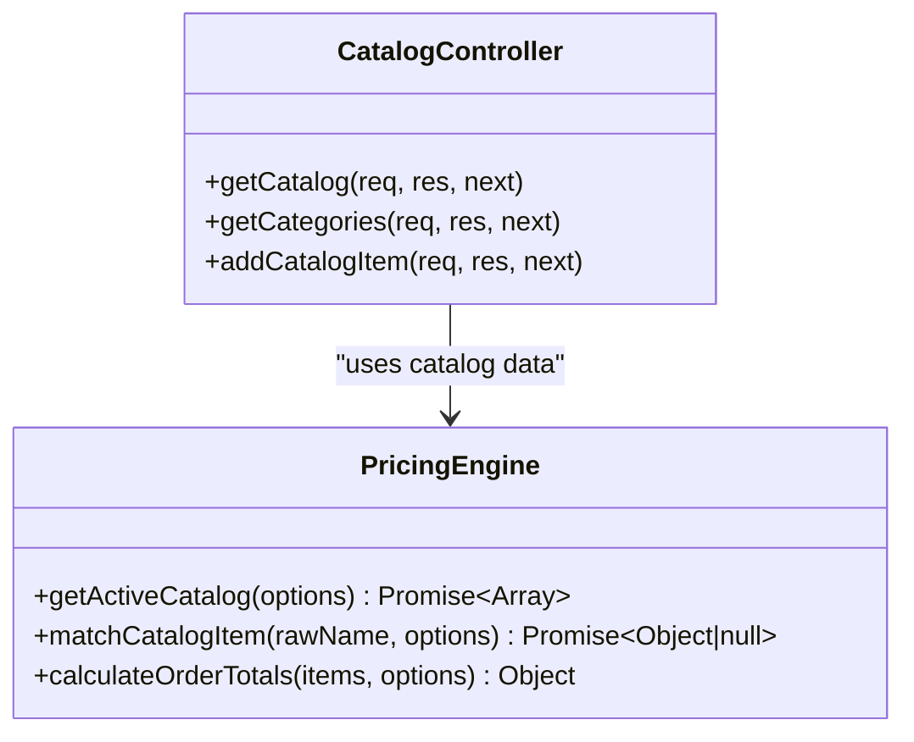
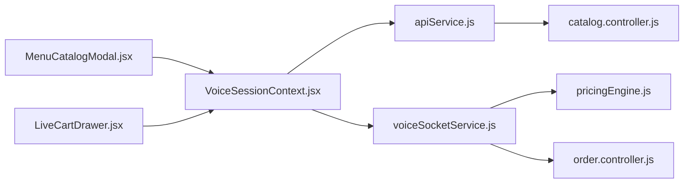

# Commerce Integration

<cite>
**Referenced Files in This Document**
- [MenuCatalogModal.jsx](file://mobile/src/components/commerce/MenuCatalogModal.jsx)
- [LiveCartDrawer.jsx](file://mobile/src/components/commerce/LiveCartDrawer.jsx)
- [VoiceSessionContext.jsx](file://mobile/src/context/VoiceSessionContext.jsx)
- [apiService.js](file://mobile/src/services/apiService.js)
- [voiceSocketService.js](file://mobile/src/services/voiceSocketService.js)
- [audioManager.js](file://mobile/src/services/audioManager.js)
- [HeaderBar.jsx](file://mobile/src/components/common/HeaderBar.jsx)
- [catalog.controller.js](file://server/src/controllers/catalog.controller.js)
- [pricingEngine.js](file://server/src/domain/orders/pricingEngine.js)
- [order.controller.js](file://server/src/controllers/order.controller.js)
</cite>

## Table of Contents
1. [Introduction](#introduction)
2. [Project Structure](#project-structure)
3. [Core Components](#core-components)
4. [Architecture Overview](#architecture-overview)
5. [Detailed Component Analysis](#detailed-component-analysis)
6. [Dependency Analysis](#dependency-analysis)
7. [Performance Considerations](#performance-considerations)
8. [Troubleshooting Guide](#troubleshooting-guide)
9. [Conclusion](#conclusion)
10. [Appendices](#appendices)

## Introduction
This document explains the commerce integration that powers menu browsing and cart management within a voice-first ordering flow on mobile. It focuses on:
- MenuCatalogModal: a touch-friendly, categorized menu with search and bilingual support.
- LiveCartDrawer: a real-time cart drawer with quantity controls, price breakdown, delivery address display, and order confirmation.
- Voice session context integration: seamless transitions between voice commands and touch interactions, including language switching and live cart updates via WebSocket events.
- Programmatic cart manipulation, pricing calculations, and delivery address handling patterns.
- Mobile UX considerations for touch interactions.

## Project Structure
The commerce integration spans mobile UI components, a shared voice session context, services for audio and networking, and server-side catalog and pricing logic.

**Diagram sources**
- [MenuCatalogModal.jsx:14-143](file://mobile/src/components/commerce/MenuCatalogModal.jsx#L14-L143)
- [LiveCartDrawer.jsx:13-140](file://mobile/src/components/commerce/LiveCartDrawer.jsx#L13-L140)
- [VoiceSessionContext.jsx:13-293](file://mobile/src/context/VoiceSessionContext.jsx#L13-L293)
- [apiService.js:10-36](file://mobile/src/services/apiService.js#L10-L36)
- [voiceSocketService.js:11-99](file://mobile/src/services/voiceSocketService.js#L11-L99)
- [audioManager.js:10-31](file://mobile/src/services/audioManager.js#L10-L31)
- [catalog.controller.js:21-39](file://server/src/controllers/catalog.controller.js#L21-L39)
- [pricingEngine.js:76-114](file://server/src/domain/orders/pricingEngine.js#L76-L114)
- [order.controller.js:22-63](file://server/src/controllers/order.controller.js#L22-L63)

**Section sources**
- [MenuCatalogModal.jsx:14-143](file://mobile/src/components/commerce/MenuCatalogModal.jsx#L14-L143)
- [LiveCartDrawer.jsx:13-140](file://mobile/src/components/commerce/LiveCartDrawer.jsx#L13-L140)
- [VoiceSessionContext.jsx:13-293](file://mobile/src/context/VoiceSessionContext.jsx#L13-L293)
- [apiService.js:10-36](file://mobile/src/services/apiService.js#L10-L36)
- [voiceSocketService.js:11-99](file://mobile/src/services/voiceSocketService.js#L11-L99)
- [audioManager.js:10-31](file://mobile/src/services/audioManager.js#L10-L31)
- [catalog.controller.js:21-39](file://server/src/controllers/catalog.controller.js#L21-L39)
- [pricingEngine.js:76-114](file://server/src/domain/orders/pricingEngine.js#L76-L114)
- [order.controller.js:22-63](file://server/src/controllers/order.controller.js#L22-L63)

## Core Components
- MenuCatalogModal: Displays categorized items, supports search across English and Tamil names, shows dietary tags and special badges, and triggers an “Ask AI” action to add items via voice or text.
- LiveCartDrawer: Shows current cart items, allows increasing/decreasing quantities, displays delivery address, computes subtotal, GST, delivery fee, and total, and confirms orders.
- VoiceSessionContext: Central state for call lifecycle, transcript, cart, delivery address, active language, catalog data, and modal visibility; integrates WebSocket events to update UI in real time.

Key responsibilities:
- MenuCatalogModal: Filtering by category and search query; bilingual name rendering; item selection callback.
- LiveCartDrawer: Local price calculation (subtotal, GST, delivery fee), item quantity modification, order confirmation callback.
- VoiceSessionContext: Fetching catalog, managing WebSocket connection, broadcasting actions like adding items, toggling language, and updating UI state from server events.

**Section sources**
- [MenuCatalogModal.jsx:21-139](file://mobile/src/components/commerce/MenuCatalogModal.jsx#L21-L139)
- [LiveCartDrawer.jsx:22-135](file://mobile/src/components/commerce/LiveCartDrawer.jsx#L22-L135)
- [VoiceSessionContext.jsx:35-130](file://mobile/src/context/VoiceSessionContext.jsx#L35-L130)

## Architecture Overview
The system combines a React Native UI with a voice-driven backend. The mobile app fetches the menu catalog over HTTP, manages voice recording and playback, and communicates with the server via WebSocket. Server-side controllers expose catalog endpoints and order operations, while a pricing engine calculates authoritative totals.

**Diagram sources**
- [MenuCatalogModal.jsx:127-135](file://mobile/src/components/commerce/MenuCatalogModal.jsx#L127-L135)
- [VoiceSessionContext.jsx:41-106](file://mobile/src/context/VoiceSessionContext.jsx#L41-L106)
- [voiceSocketService.js:59-89](file://mobile/src/services/voiceSocketService.js#L59-L89)
- [apiService.js:10-36](file://mobile/src/services/apiService.js#L10-L36)
- [catalog.controller.js:21-39](file://server/src/controllers/catalog.controller.js#L21-L39)
- [pricingEngine.js:76-114](file://server/src/domain/orders/pricingEngine.js#L76-L114)
- [order.controller.js:22-63](file://server/src/controllers/order.controller.js#L22-L63)

## Detailed Component Analysis

### MenuCatalogModal
- Purpose: Provide a touch-friendly, categorized menu with search and bilingual support.
- Key behaviors:
  - Extracts unique categories from the catalog and renders horizontal chips.
  - Filters items by selected category and search query across English and Tamil names.
  - Displays dietary indicators and special badges.
  - Triggers “Ask AI” to add items via voice/text through the context’s askForDish method.
- Data model expectations:
  - Each item includes fields such as id/name/name_tamil/category_name/dietary_tags/is_special/price.
- Mobile UX:
  - Large tap targets, clear visual hierarchy, and concise labels optimized for one-handed use.

**Diagram sources**
- [MenuCatalogModal.jsx:21-34](file://mobile/src/components/commerce/MenuCatalogModal.jsx#L21-L34)
- [MenuCatalogModal.jsx:61-87](file://mobile/src/components/commerce/MenuCatalogModal.jsx#L61-L87)
- [MenuCatalogModal.jsx:89-139](file://mobile/src/components/commerce/MenuCatalogModal.jsx#L89-L139)

**Section sources**
- [MenuCatalogModal.jsx:21-139](file://mobile/src/components/commerce/MenuCatalogModal.jsx#L21-L139)

### LiveCartDrawer
- Purpose: Real-time cart view with quantity modifications, delivery address summary, and order confirmation.
- Price computation:
  - Subtotal: sum of item price × quantity.
  - GST: 5% of subtotal.
  - Delivery fee: free if subtotal exceeds threshold; otherwise fixed fee.
  - Total: subtotal + GST + delivery fee.
- Interactions:
  - Increase/decrease quantity via onModifyItem callbacks.
  - Confirm order via onConfirmOrder callback.
- Address handling:
  - Displays spoken or provided delivery address when available.

**Diagram sources**
- [LiveCartDrawer.jsx:22-28](file://mobile/src/components/commerce/LiveCartDrawer.jsx#L22-L28)
- [LiveCartDrawer.jsx:56-117](file://mobile/src/components/commerce/LiveCartDrawer.jsx#L56-L117)
- [LiveCartDrawer.jsx:120-135](file://mobile/src/components/commerce/LiveCartDrawer.jsx#L120-L135)

**Section sources**
- [LiveCartDrawer.jsx:22-135](file://mobile/src/components/commerce/LiveCartDrawer.jsx#L22-L135)

### Voice Session Context Integration
- Responsibilities:
  - Initialize audio and fetch catalog on mount.
  - Manage WebSocket lifecycle: connect, send audio/text/DTMF, handle close/error.
  - Listen to server events: ai_response (updates transcript, cart, delivery address), stt_transcript, order_confirmed.
  - Expose methods to start/end calls, toggle recording, send messages, add dishes, and toggle language.
- Integration points:
  - MenuCatalogModal uses askForDish to add items via voice/text.
  - LiveCartDrawer relies on context-managed cart state and can trigger confirmations via context.

**Diagram sources**
- [VoiceSessionContext.jsx:35-39](file://mobile/src/context/VoiceSessionContext.jsx#L35-L39)
- [VoiceSessionContext.jsx:41-106](file://mobile/src/context/VoiceSessionContext.jsx#L41-L106)
- [VoiceSessionContext.jsx:132-169](file://mobile/src/context/VoiceSessionContext.jsx#L132-L169)
- [VoiceSessionContext.jsx:171-248](file://mobile/src/context/VoiceSessionContext.jsx#L171-L248)
- [VoiceSessionContext.jsx:250-253](file://mobile/src/context/VoiceSessionContext.jsx#L250-L253)
- [apiService.js:10-36](file://mobile/src/services/apiService.js#L10-L36)
- [voiceSocketService.js:59-89](file://mobile/src/services/voiceSocketService.js#L59-L89)
- [audioManager.js:95-121](file://mobile/src/services/audioManager.js#L95-L121)

**Section sources**
- [VoiceSessionContext.jsx:35-253](file://mobile/src/context/VoiceSessionContext.jsx#L35-L253)
- [apiService.js:10-36](file://mobile/src/services/apiService.js#L10-L36)
- [voiceSocketService.js:59-89](file://mobile/src/services/voiceSocketService.js#L59-L89)
- [audioManager.js:95-121](file://mobile/src/services/audioManager.js#L95-L121)

### Server-Side Catalog and Pricing
- Catalog controller exposes endpoints to retrieve active catalog items and categories scoped by tenant and restaurant identifiers.
- Pricing engine provides deterministic calculations for order totals, including line-level snapshots, GST, delivery fees, and discounts.

**Diagram sources**
- [catalog.controller.js:21-82](file://server/src/controllers/catalog.controller.js#L21-L82)
- [pricingEngine.js:16-71](file://server/src/domain/orders/pricingEngine.js#L16-L71)
- [pricingEngine.js:76-114](file://server/src/domain/orders/pricingEngine.js#L76-L114)

**Section sources**
- [catalog.controller.js:21-82](file://server/src/controllers/catalog.controller.js#L21-L82)
- [pricingEngine.js:16-114](file://server/src/domain/orders/pricingEngine.js#L16-L114)

## Dependency Analysis
- Mobile UI depends on VoiceSessionContext for state and actions.
- VoiceSessionContext depends on apiService for catalog retrieval and voiceSocketService for real-time communication.
- voiceSocketService emits events consumed by VoiceSessionContext to update cart and transcript.
- Server catalog controller serves REST endpoints used by apiService.
- Pricing engine is invoked by server orchestration to compute authoritative totals and may be referenced by WebSocket handlers to emit state updates.

**Diagram sources**
- [MenuCatalogModal.jsx:14-143](file://mobile/src/components/commerce/MenuCatalogModal.jsx#L14-L143)
- [LiveCartDrawer.jsx:13-140](file://mobile/src/components/commerce/LiveCartDrawer.jsx#L13-L140)
- [VoiceSessionContext.jsx:13-293](file://mobile/src/context/VoiceSessionContext.jsx#L13-L293)
- [apiService.js:10-36](file://mobile/src/services/apiService.js#L10-L36)
- [voiceSocketService.js:11-99](file://mobile/src/services/voiceSocketService.js#L11-L99)
- [catalog.controller.js:21-39](file://server/src/controllers/catalog.controller.js#L21-L39)
- [pricingEngine.js:76-114](file://server/src/domain/orders/pricingEngine.js#L76-L114)
- [order.controller.js:22-63](file://server/src/controllers/order.controller.js#L22-L63)

**Section sources**
- [VoiceSessionContext.jsx:13-293](file://mobile/src/context/VoiceSessionContext.jsx#L13-L293)
- [apiService.js:10-36](file://mobile/src/services/apiService.js#L10-L36)
- [voiceSocketService.js:11-99](file://mobile/src/services/voiceSocketService.js#L11-L99)
- [catalog.controller.js:21-39](file://server/src/controllers/catalog.controller.js#L21-L39)
- [pricingEngine.js:76-114](file://server/src/domain/orders/pricingEngine.js#L76-L114)
- [order.controller.js:22-63](file://server/src/controllers/order.controller.js#L22-L63)

## Performance Considerations
- Catalog caching: Server-side catalog retrieval uses short-lived caching to reduce database load.
- Client-side filtering: Category and search filters are computed locally to avoid unnecessary network calls.
- Audio streaming: Base64-encoded audio chunks are sent efficiently; ensure network conditions are monitored.
- Price calculations: Use integer arithmetic where possible to avoid floating-point drift; server pricing engine implements this approach.

[No sources needed since this section provides general guidance]

## Troubleshooting Guide
- Connection issues:
  - If WebSocket fails to connect, verify server URL and network connectivity; the context shows alerts and resets call state.
- Catalog fetch failures:
  - If REST catalog endpoint fails, the client falls back to a default catalog to keep the UI functional.
- Speech output errors:
  - TTS errors are caught and logged; ensure platform permissions are granted and audio mode is configured correctly.
- Order confirmation:
  - On order_confirmed event, the transcript is updated; ensure the server emits the expected payload.

**Section sources**
- [VoiceSessionContext.jsx:108-121](file://mobile/src/context/VoiceSessionContext.jsx#L108-L121)
- [VoiceSessionContext.jsx:145-157](file://mobile/src/context/VoiceSessionContext.jsx#L145-L157)
- [apiService.js:21-35](file://mobile/src/services/apiService.js#L21-L35)
- [audioManager.js:95-121](file://mobile/src/services/audioManager.js#L95-L121)

## Conclusion
The commerce integration combines a responsive mobile UI with a robust voice-driven backend. MenuCatalogModal enables intuitive browsing and selection, while LiveCartDrawer provides real-time cart management and clear pricing transparency. VoiceSessionContext orchestrates the flow between voice commands and touch interactions, ensuring consistent state across both modalities. Server-side catalog and pricing logic provide authoritative data and deterministic calculations, enabling reliable order processing.

[No sources needed since this section summarizes without analyzing specific files]

## Appendices

### Programmatic Cart Manipulation Examples
- Add an item via voice/text:
  - Use the context method to send a text message representing the desired item and quantity.
  - Reference path: [askForDish usage:245-248](file://mobile/src/context/VoiceSessionContext.jsx#L245-L248).
- Modify item quantity:
  - Trigger onModifyItem with the item name and delta (+1 or -1) from the cart drawer.
  - Reference path: [quantity controls:64-80](file://mobile/src/components/commerce/LiveCartDrawer.jsx#L64-L80).
- Confirm order:
  - Invoke onConfirmOrder to finalize the order; the context will send a confirmation request and handle the server response.
  - Reference path: [confirm button handler:120-135](file://mobile/src/components/commerce/LiveCartDrawer.jsx#L120-L135).

### Price Calculations
- Client-side quick estimate:
  - Subtotal, GST (5%), delivery fee (free above threshold), and total are computed locally for immediate feedback.
  - Reference path: [cart price computation:22-28](file://mobile/src/components/commerce/LiveCartDrawer.jsx#L22-L28).
- Authoritative server-side calculation:
  - Use the pricing engine to compute precise totals, including line-level snapshots and tax/delivery/discount adjustments.
  - Reference path: [pricing engine totals:76-114](file://server/src/domain/orders/pricingEngine.js#L76-L114).

### Delivery Address Handling
- Display spoken or provided address in the cart drawer.
- Reference path: [address box rendering:88-94](file://mobile/src/components/commerce/LiveCartDrawer.jsx#L88-L94).
- Address updates arrive via WebSocket events and update context state.
- Reference path: [ai_response handling:58-64](file://mobile/src/context/VoiceSessionContext.jsx#L58-L64).

### Mobile UX Patterns
- Touch-friendly controls:
  - Large tap targets for category chips and quantity buttons.
  - Clear visual states for active selections and disabled actions.
  - Reference paths:
    - [category chips:61-87](file://mobile/src/components/commerce/MenuCatalogModal.jsx#L61-L87)
    - [quantity controls:64-80](file://mobile/src/components/commerce/LiveCartDrawer.jsx#L64-L80)
- Bilingual support:
  - Language switcher in header updates active language for speech and UI.
  - Reference path: [language switcher:28-38](file://mobile/src/components/common/HeaderBar.jsx#L28-L38) and [context toggle:250-253](file://mobile/src/context/VoiceSessionContext.jsx#L250-L253).

[No additional sources beyond those already cited]