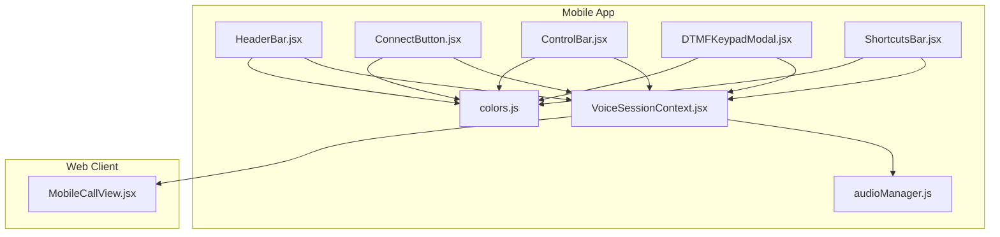
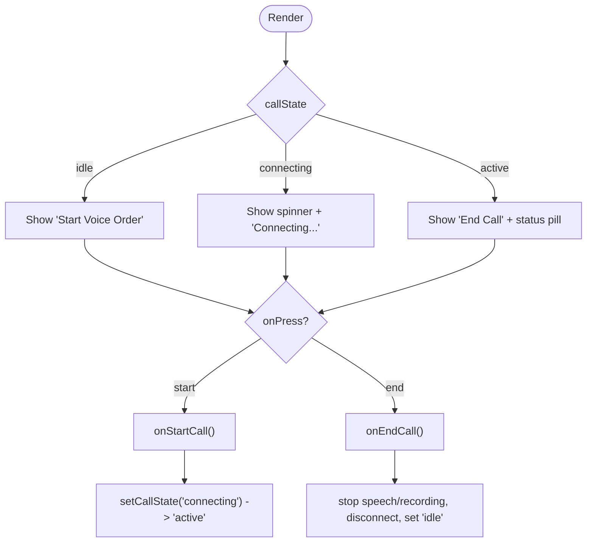
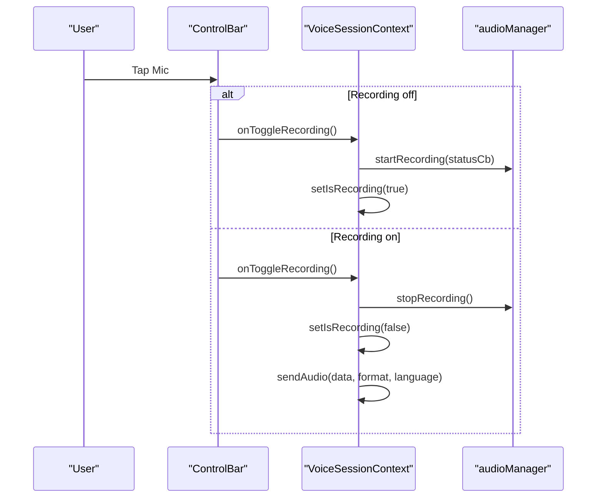
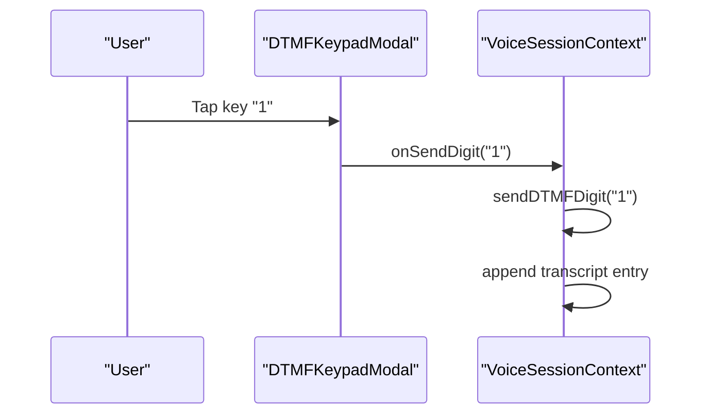
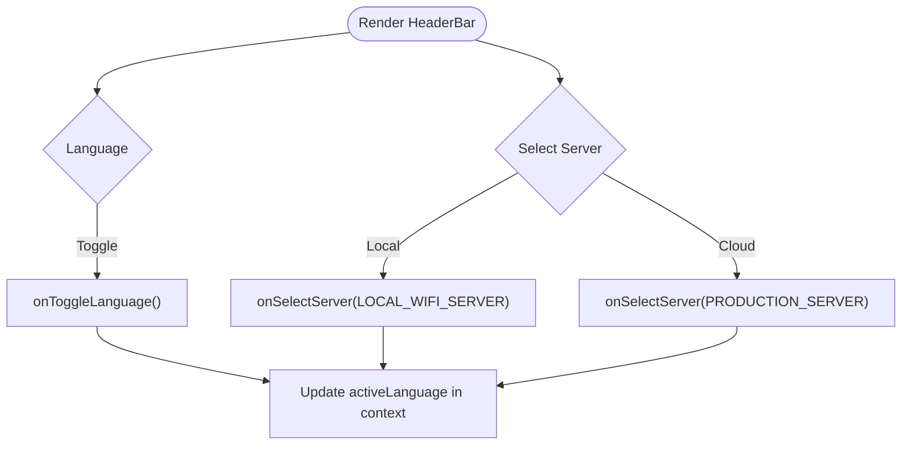
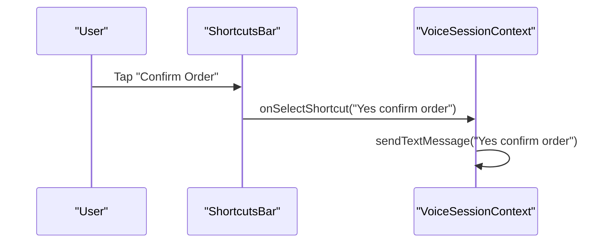
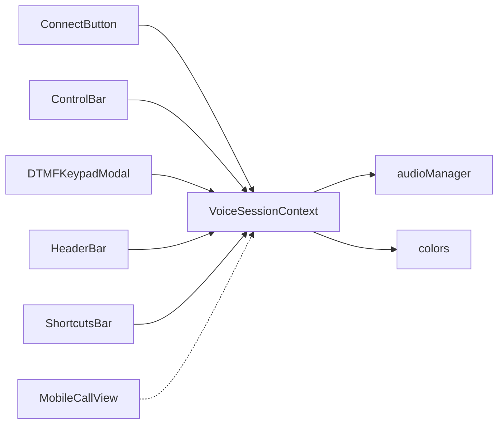

# Controls and Interactions

<cite>
**Referenced Files in This Document**
- [ConnectButton.jsx](file://mobile/src/components/controls/ConnectButton.jsx)
- [ControlBar.jsx](file://mobile/src/components/controls/ControlBar.jsx)
- [DTMFKeypadModal.jsx](file://mobile/src/components/controls/DTMFKeypadModal.jsx)
- [HeaderBar.jsx](file://mobile/src/components/common/HeaderBar.jsx)
- [ShortcutsBar.jsx](file://mobile/src/components/common/ShortcutsBar.jsx)
- [VoiceSessionContext.jsx](file://mobile/src/context/VoiceSessionContext.jsx)
- [audioManager.js](file://mobile/src/services/audioManager.js)
- [colors.js](file://mobile/src/theme/colors.js)
- [MobileCallView.jsx](file://client/src/components/MobileCallView.jsx)
</cite>

## Table of Contents
1. Introduction
2. Project Structure
3. Core Components
4. Architecture Overview
5. Detailed Component Analysis
6. Dependency Analysis
7. Performance Considerations
8. Troubleshooting Guide
9. Conclusion

## Introduction
This document explains the control components and interaction patterns that manage user input and app navigation for voice ordering. It focuses on:
- ConnectButton: initiating and ending voice calls with connection status indicators
- ControlBar: floating access to recording controls, menu, cart, and DTMF keypad
- DTMFKeypadModal: sending phone keypad inputs during voice calls
- HeaderBar: server selection and language switching
- ShortcutsBar: quick text message actions
It also covers gesture handling, touch feedback, accessibility considerations, mobile-specific interactions, and responsive design across screen sizes and orientations.

## Project Structure
The mobile app organizes controls under src/components/controls and common UI elements under src/components/common. State and services are centralized in context and services directories. The web client provides a separate MobileCallView for browser-based voice flows.



**Diagram sources**
- [HeaderBar.jsx:1-145](file://mobile/src/components/common/HeaderBar.jsx#L1-L145)
- [ConnectButton.jsx:1-135](file://mobile/src/components/controls/ConnectButton.jsx#L1-L135)
- [ControlBar.jsx:1-263](file://mobile/src/components/controls/ControlBar.jsx#L1-L263)
- [DTMFKeypadModal.jsx:1-141](file://mobile/src/components/controls/DTMFKeypadModal.jsx#L1-L141)
- [ShortcutsBar.jsx:1-63](file://mobile/src/components/common/ShortcutsBar.jsx#L1-L63)
- [VoiceSessionContext.jsx:1-302](file://mobile/src/context/VoiceSessionContext.jsx#L1-L302)
- [audioManager.js:1-131](file://mobile/src/services/audioManager.js#L1-L131)
- [colors.js:1-60](file://mobile/src/theme/colors.js#L1-L60)
- [MobileCallView.jsx:1-409](file://client/src/components/MobileCallView.jsx#L1-L409)

**Section sources**
- [HeaderBar.jsx:1-145](file://mobile/src/components/common/HeaderBar.jsx#L1-L145)
- [ConnectButton.jsx:1-135](file://mobile/src/components/controls/ConnectButton.jsx#L1-L135)
- [ControlBar.jsx:1-263](file://mobile/src/components/controls/ControlBar.jsx#L1-L263)
- [DTMFKeypadModal.jsx:1-141](file://mobile/src/components/controls/DTMFKeypadModal.jsx#L1-L141)
- [ShortcutsBar.jsx:1-63](file://mobile/src/components/common/ShortcutsBar.jsx#L1-L63)
- [VoiceSessionContext.jsx:1-302](file://mobile/src/context/VoiceSessionContext.jsx#L1-L302)
- [audioManager.js:1-131](file://mobile/src/services/audioManager.js#L1-L131)
- [colors.js:1-60](file://mobile/src/theme/colors.js#L1-L60)
- [MobileCallView.jsx:1-409](file://client/src/components/MobileCallView.jsx#L1-L409)

## Core Components
- ConnectButton: Presents call state (idle, connecting, active), shows latency when connected, and toggles start/end call via callbacks.
- ControlBar: Floating bar with Menu, Keypad, Mic (push-to-talk), Text mode toggle, and Cart with badge; includes an optional expandable text input during active calls.
- DTMFKeypadModal: Modal dialpad overlay to send DTMF digits during a call.
- HeaderBar: Displays brand info, language switcher, and server environment chips (local vs production).
- ShortcutsBar: Horizontal scrollable chips for quick text commands during active sessions.

All components consume theme tokens from colors.js and integrate with VoiceSessionContext for state and actions.

**Section sources**
- [ConnectButton.jsx:1-135](file://mobile/src/components/controls/ConnectButton.jsx#L1-L135)
- [ControlBar.jsx:1-263](file://mobile/src/components/controls/ControlBar.jsx#L1-L263)
- [DTMFKeypadModal.jsx:1-141](file://mobile/src/components/controls/DTMFKeypadModal.jsx#L1-L141)
- [HeaderBar.jsx:1-145](file://mobile/src/components/common/HeaderBar.jsx#L1-L145)
- [ShortcutsBar.jsx:1-63](file://mobile/src/components/common/ShortcutsBar.jsx#L1-L63)
- [colors.js:1-60](file://mobile/src/theme/colors.js#L1-L60)

## Architecture Overview
The control layer is driven by a central VoiceSessionContext that manages WebSocket lifecycle, audio recording/playback, transcript updates, cart state, and modal visibility. Components subscribe to this context via props or hooks and dispatch actions like startCall, endCall, toggleRecording, sendTextMessage, sendDTMFDigit, and toggleLanguage.

```mermaid
sequenceDiagram
participant User as "User"
participant UI as "ConnectButton / ControlBar"
participant Ctx as "VoiceSessionContext"
participant Audio as "audioManager"
participant WS as "voiceSocketService"
User->>UI : Tap Start Call
UI->>Ctx : onStartCall()
Ctx->>Ctx : setCallState("connecting")
Ctx->>WS : connect(serverUrl)
WS-->>Ctx : open
Ctx->>Ctx : setCallState("active")
Note over Ctx,WS : Session active; transcript and cart update via events
User->>UI : Tap End Call
UI->>Ctx : onEndCall()
Ctx->>Audio : stopSpeech()
Ctx->>Audio : stopRecording() if needed
Ctx->>WS : disconnect()
Ctx->>Ctx : setCallState("idle")
```

**Diagram sources**
- [VoiceSessionContext.jsx:132-169](file://mobile/src/context/VoiceSessionContext.jsx#L132-L169)
- [audioManager.js:95-131](file://mobile/src/services/audioManager.js#L95-L131)

**Section sources**
- [VoiceSessionContext.jsx:1-302](file://mobile/src/context/VoiceSessionContext.jsx#L1-L302)
- [audioManager.js:1-131](file://mobile/src/services/audioManager.js#L1-L131)

## Detailed Component Analysis

### ConnectButton
- Purpose: Initiate or terminate voice calls and display connection status and latency.
- Behavior:
  - Shows a status pill with an active dot and latency when call is active.
  - Disables button while connecting to prevent duplicate starts.
  - Uses distinct styles for idle, connecting, and active states.
- Integration:
  - Receives callState, latencyMs, and callbacks onStartCall/onEndCall from parent (typically provided by VoiceSessionContext).
  - Uses theme colors for consistent visual feedback.



**Diagram sources**
- [ConnectButton.jsx:5-55](file://mobile/src/components/controls/ConnectButton.jsx#L5-L55)
- [VoiceSessionContext.jsx:132-169](file://mobile/src/context/VoiceSessionContext.jsx#L132-L169)

**Section sources**
- [ConnectButton.jsx:1-135](file://mobile/src/components/controls/ConnectButton.jsx#L1-L135)
- [VoiceSessionContext.jsx:132-169](file://mobile/src/context/VoiceSessionContext.jsx#L132-L169)

### ControlBar
- Purpose: Provide floating access to recording controls, menu, cart, and DTMF keypad; include optional text input mode.
- Behavior:
  - Center mic button toggles push-to-talk recording; disabled unless call is active.
  - Keypad opens DTMF modal only during active calls.
  - Text mode toggle reveals an inline TextInput for typing orders; sends via onSendText.
  - Cart button shows a badge count; opens cart drawer/modal via onOpenCart.
  - Menu button opens catalog via onOpenMenu.
- Integration:
  - Subscribes to callState, isRecording, cartCount, and event handlers from context.
  - Uses theme tokens for consistent styling.



**Diagram sources**
- [ControlBar.jsx:84-116](file://mobile/src/components/controls/ControlBar.jsx#L84-L116)
- [VoiceSessionContext.jsx:171-209](file://mobile/src/context/VoiceSessionContext.jsx#L171-L209)
- [audioManager.js:36-90](file://mobile/src/services/audioManager.js#L36-L90)

**Section sources**
- [ControlBar.jsx:1-263](file://mobile/src/components/controls/ControlBar.jsx#L1-L263)
- [VoiceSessionContext.jsx:171-209](file://mobile/src/context/VoiceSessionContext.jsx#L171-L209)
- [audioManager.js:36-90](file://mobile/src/services/audioManager.js#L36-L90)

### DTMFKeypadModal
- Purpose: Overlay dialpad to send DTMF digits during a live call.
- Behavior:
  - Renders a grid of keys with digit and optional letters.
  - On press, invokes onSendDigit(digit) to transmit the tone.
  - Provides close button to dismiss modal.
- Integration:
  - Controlled by isOpen prop; typically managed by VoiceSessionContext’s isDTMFOpen state.
  - Uses theme colors for backdrop and card styling.



**Diagram sources**
- [DTMFKeypadModal.jsx:27-63](file://mobile/src/components/controls/DTMFKeypadModal.jsx#L27-L63)
- [VoiceSessionContext.jsx:230-243](file://mobile/src/context/VoiceSessionContext.jsx#L230-L243)

**Section sources**
- [DTMFKeypadModal.jsx:1-141](file://mobile/src/components/controls/DTMFKeypadModal.jsx#L1-L141)
- [VoiceSessionContext.jsx:230-243](file://mobile/src/context/VoiceSessionContext.jsx#L230-L243)

### HeaderBar
- Purpose: Display branding, allow language switching, and select server environment.
- Behavior:
  - Language switcher toggles between English and Tamil (en-IN / ta-IN).
  - Server chips toggle between local Wi-Fi and production endpoints; disabled during active calls to avoid mid-call reconnection.
- Integration:
  - Receives serverUrl, activeLanguage, and callbacks onSelectServer/onToggleLanguage from context.
  - Uses theme tokens for chip and text styling.



**Diagram sources**
- [HeaderBar.jsx:5-65](file://mobile/src/components/common/HeaderBar.jsx#L5-L65)
- [VoiceSessionContext.jsx:250-253](file://mobile/src/context/VoiceSessionContext.jsx#L250-L253)

**Section sources**
- [HeaderBar.jsx:1-145](file://mobile/src/components/common/HeaderBar.jsx#L1-L145)
- [VoiceSessionContext.jsx:250-253](file://mobile/src/context/VoiceSessionContext.jsx#L250-L253)

### ShortcutsBar
- Purpose: Provide horizontal scrolling chips for quick text commands during active sessions.
- Behavior:
  - Only renders when isActive is true.
  - Each chip triggers onSelectShortcut(text) to send a predefined phrase.
- Integration:
  - Typically shown within the active call flow; text is sent via VoiceSessionContext.sendTextMessage.



**Diagram sources**
- [ShortcutsBar.jsx:16-37](file://mobile/src/components/common/ShortcutsBar.jsx#L16-L37)
- [VoiceSessionContext.jsx:211-228](file://mobile/src/context/VoiceSessionContext.jsx#L211-L228)

**Section sources**
- [ShortcutsBar.jsx:1-63](file://mobile/src/components/common/ShortcutsBar.jsx#L1-L63)
- [VoiceSessionContext.jsx:211-228](file://mobile/src/context/VoiceSessionContext.jsx#L211-L228)

## Dependency Analysis
- Components depend on VoiceSessionContext for call state, audio recording, transcript, cart, and modal visibility.
- audioManager handles microphone permissions, recording lifecycle, and TTS playback.
- Theme tokens from colors.js standardize visuals across components.
- Web client MobileCallView demonstrates an alternative browser-based flow using MediaRecorder and WebAudio.



**Diagram sources**
- [ConnectButton.jsx:1-135](file://mobile/src/components/controls/ConnectButton.jsx#L1-L135)
- [ControlBar.jsx:1-263](file://mobile/src/components/controls/ControlBar.jsx#L1-L263)
- [DTMFKeypadModal.jsx:1-141](file://mobile/src/components/controls/DTMFKeypadModal.jsx#L1-L141)
- [HeaderBar.jsx:1-145](file://mobile/src/components/common/HeaderBar.jsx#L1-L145)
- [ShortcutsBar.jsx:1-63](file://mobile/src/components/common/ShortcutsBar.jsx#L1-L63)
- [VoiceSessionContext.jsx:1-302](file://mobile/src/context/VoiceSessionContext.jsx#L1-L302)
- [audioManager.js:1-131](file://mobile/src/services/audioManager.js#L1-L131)
- [colors.js:1-60](file://mobile/src/theme/colors.js#L1-L60)
- [MobileCallView.jsx:1-409](file://client/src/components/MobileCallView.jsx#L1-L409)

**Section sources**
- [VoiceSessionContext.jsx:1-302](file://mobile/src/context/VoiceSessionContext.jsx#L1-L302)
- [audioManager.js:1-131](file://mobile/src/services/audioManager.js#L1-L131)
- [colors.js:1-60](file://mobile/src/theme/colors.js#L1-L60)
- [MobileCallView.jsx:1-409](file://client/src/components/MobileCallView.jsx#L1-L409)

## Performance Considerations
- Avoid redundant connections: Disable server selection during active calls to prevent mid-call reconnections.
- Efficient audio handling: Stop ongoing speech before starting recording to reduce CPU and latency spikes.
- Minimize re-renders: Keep component state minimal; rely on context for shared state.
- Optimize modal rendering: Render DTMF modal only when needed to reduce layout thrash.
- Use appropriate audio quality presets to balance fidelity and bandwidth.

[No sources needed since this section provides general guidance]

## Troubleshooting Guide
- Connection errors:
  - If WebSocket fails to connect, the context sets call state back to idle and alerts the user to verify server availability.
- Microphone permission issues:
  - Audio initialization requests permissions; if denied, recording cannot start. Ensure permissions are granted.
- Speech playback errors:
  - TTS errors are caught and logged; fallback behavior ensures UI remains stable.
- Mid-call disconnections:
  - Close events reset call state and stop speech/recording to keep UI consistent.

**Section sources**
- [VoiceSessionContext.jsx:108-121](file://mobile/src/context/VoiceSessionContext.jsx#L108-L121)
- [audioManager.js:10-31](file://mobile/src/services/audioManager.js#L10-L31)
- [audioManager.js:95-131](file://mobile/src/services/audioManager.js#L95-L131)

## Conclusion
The control components provide a cohesive, accessible, and mobile-first interface for voice ordering. ConnectButton manages call lifecycle with clear status feedback. ControlBar centralizes recording, menu, cart, and DTMF access with intuitive gestures. DTMFKeypadModal offers precise keypad input during calls. HeaderBar enables environment and language configuration, while ShortcutsBar accelerates common actions. All components integrate tightly with VoiceSessionContext and audioManager for robust, responsive interactions across devices and orientations.

[No sources needed since this section summarizes without analyzing specific files]