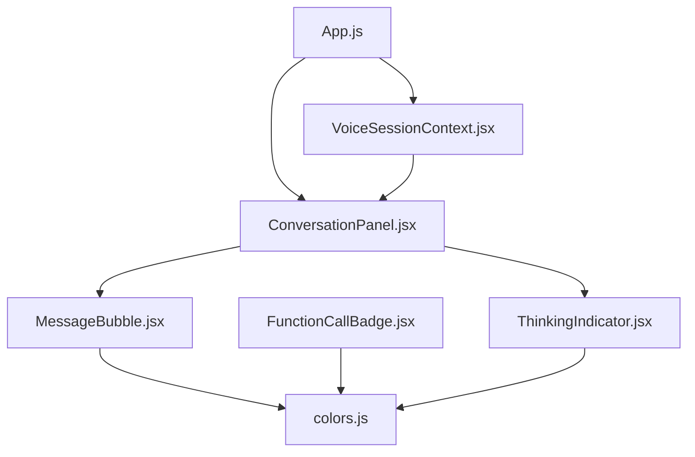
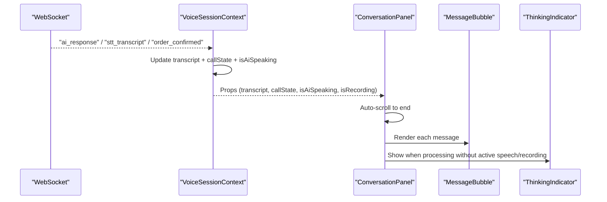
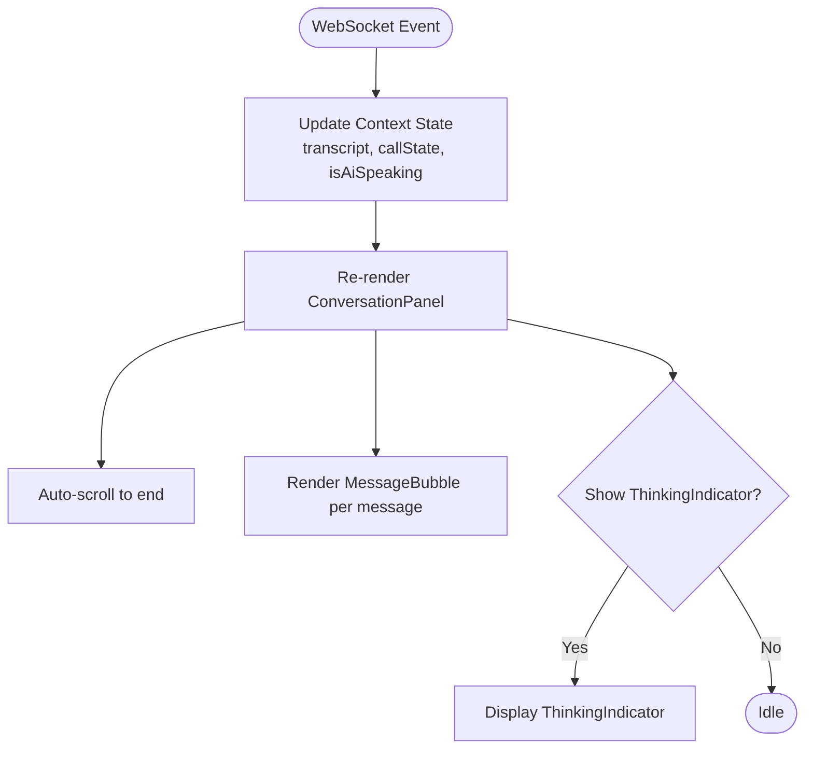
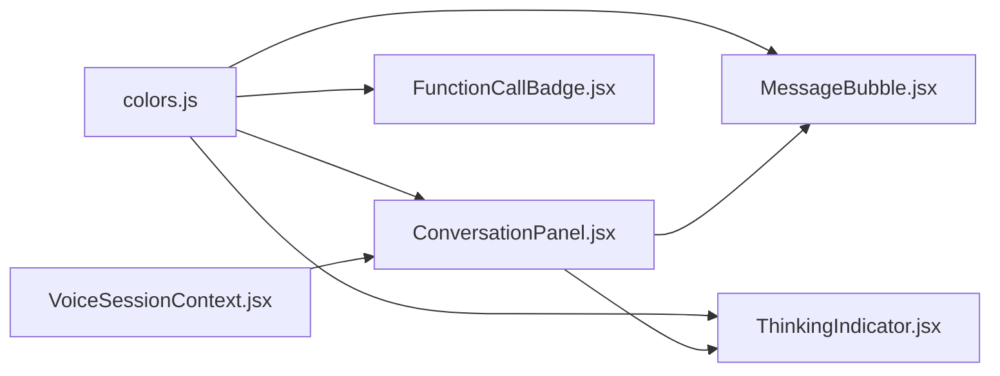

# Conversation Interface

<cite>
**Referenced Files in This Document**
- [ConversationPanel.jsx](file://mobile/src/components/conversation/ConversationPanel.jsx)
- [MessageBubble.jsx](file://mobile/src/components/conversation/MessageBubble.jsx)
- [FunctionCallBadge.jsx](file://mobile/src/components/conversation/FunctionCallBadge.jsx)
- [ThinkingIndicator.jsx](file://mobile/src/components/conversation/ThinkingIndicator.jsx)
- [VoiceSessionContext.jsx](file://mobile/src/context/VoiceSessionContext.jsx)
- [App.js](file://mobile/App.js)
- [colors.js](file://mobile/src/theme/colors.js)
</cite>

## Table of Contents
1. [Introduction](#introduction)
2. [Project Structure](#project-structure)
3. [Core Components](#core-components)
4. [Architecture Overview](#architecture-overview)
5. [Detailed Component Analysis](#detailed-component-analysis)
6. [Dependency Analysis](#dependency-analysis)
7. [Performance Considerations](#performance-considerations)
8. [Troubleshooting Guide](#troubleshooting-guide)
9. [Conclusion](#conclusion)

## Introduction
This document describes the conversation interface components that render real-time, chat-like conversations between users and an AI assistant on mobile. It focuses on:
- ConversationPanel: manages message history, auto-scrolling, and rendering of messages and live indicators.
- MessageBubble: displays user and AI messages with distinct styling and timestamps.
- FunctionCallBadge: highlights AI function calls and their results (cart, address, confirm).
- ThinkingIndicator: shows AI processing states with animated dots.
It also covers how messages are produced by the voice session context, accessibility considerations, and performance strategies for large histories and memory management on mobile devices.

## Project Structure
The conversation UI is part of a React Native application. The main screen composes several modules, including the conversation panel, visualizers, controls, and modals. The VoiceSessionContext provides real-time state and transcript updates via WebSocket events, which drive the conversation UI.

**Diagram sources**
- [App.js:1-167](file://mobile/App.js#L1-L167)
- [VoiceSessionContext.jsx:1-302](file://mobile/src/context/VoiceSessionContext.jsx#L1-L302)
- [ConversationPanel.jsx:1-107](file://mobile/src/components/conversation/ConversationPanel.jsx#L1-L107)
- [MessageBubble.jsx:1-110](file://mobile/src/components/conversation/MessageBubble.jsx#L1-L110)
- [FunctionCallBadge.jsx:1-58](file://mobile/src/components/conversation/FunctionCallBadge.jsx#L1-L58)
- [ThinkingIndicator.jsx:1-73](file://mobile/src/components/conversation/ThinkingIndicator.jsx#L1-L73)
- [colors.js:1-60](file://mobile/src/theme/colors.js#L1-L60)

**Section sources**
- [App.js:1-167](file://mobile/App.js#L1-L167)
- [VoiceSessionContext.jsx:1-302](file://mobile/src/context/VoiceSessionContext.jsx#L1-L302)

## Core Components
- ConversationPanel: Renders the scrollable transcript, handles empty state, and shows a live listening pill when appropriate. It auto-scrolls to the bottom on new messages or state changes.
- MessageBubble: Renders individual messages with role-based styling (user, AI, system), optional timestamp, and consistent typography.
- FunctionCallBadge: Displays contextual badges for cart items, addresses, and order confirmation with color-coded accents.
- ThinkingIndicator: Animated three-dot indicator signaling AI processing.

These components consume shared theme tokens from colors.js and receive data from VoiceSessionContext through props.

**Section sources**
- [ConversationPanel.jsx:1-107](file://mobile/src/components/conversation/ConversationPanel.jsx#L1-L107)
- [MessageBubble.jsx:1-110](file://mobile/src/components/conversation/MessageBubble.jsx#L1-L110)
- [FunctionCallBadge.jsx:1-58](file://mobile/src/components/conversation/FunctionCallBadge.jsx#L1-L58)
- [ThinkingIndicator.jsx:1-73](file://mobile/src/components/conversation/ThinkingIndicator.jsx#L1-L73)
- [colors.js:1-60](file://mobile/src/theme/colors.js#L1-L60)

## Architecture Overview
The conversation flow is driven by WebSocket events that update the transcript array in VoiceSessionContext. ConversationPanel listens to these updates and renders messages. When the AI responds, it triggers speech output and updates the UI state, which influences whether the thinking indicator or live listening pill is shown.

**Diagram sources**
- [VoiceSessionContext.jsx:41-130](file://mobile/src/context/VoiceSessionContext.jsx#L41-L130)
- [ConversationPanel.jsx:15-49](file://mobile/src/components/conversation/ConversationPanel.jsx#L15-L49)
- [MessageBubble.jsx:5-43](file://mobile/src/components/conversation/MessageBubble.jsx#L5-L43)
- [ThinkingIndicator.jsx:5-51](file://mobile/src/components/conversation/ThinkingIndicator.jsx#L5-L51)

## Detailed Component Analysis

### ConversationPanel
Responsibilities:
- Manages a scrollable list of messages using ScrollView.
- Auto-scrolls to the latest message when transcript or speaking/recording states change.
- Renders an empty state with guidance text when there are no messages.
- Shows a live listening pill during active sessions when not recording and not speaking.

Key behaviors:
- Auto-scroll effect runs on transcript changes and audio state changes to keep the latest content visible.
- Conditional rendering ensures minimal layout work when the transcript is empty.

Accessibility notes:
- Uses standard React Native primitives; consider adding accessible labels for screen readers if needed (e.g., aria-like roles for status pills).

Performance notes:
- For very long transcripts, consider virtualization (e.g., FlashList or FlatList with keyExtractor) to reduce re-render costs and memory usage.

**Section sources**
- [ConversationPanel.jsx:15-49](file://mobile/src/components/conversation/ConversationPanel.jsx#L15-L49)
- [ConversationPanel.jsx:53-107](file://mobile/src/components/conversation/ConversationPanel.jsx#L53-L107)

### MessageBubble
Responsibilities:
- Renders user, AI, and system messages with distinct styles.
- Displays role label and optional timestamp.
- Applies theme-based colors and spacing consistently.

Styling details:
- User messages align right with elevated surface background.
- AI messages align left with a subtle left border accent.
- System messages are centered with a highlighted background for notifications.

Data contract:
- Expects message objects with speaker, text, and optional timestamp fields.

Accessibility notes:
- Role labels and timestamps improve clarity; ensure sufficient contrast and readable font sizes.

**Section sources**
- [MessageBubble.jsx:5-43](file://mobile/src/components/conversation/MessageBubble.jsx#L5-L43)
- [MessageBubble.jsx:45-110](file://mobile/src/components/conversation/MessageBubble.jsx#L45-L110)

### FunctionCallBadge
Responsibilities:
- Highlights AI function calls and results with contextual icons and colors.
- Supports types: cart, address, confirm.

Behavior:
- Color selection based on type: primary for confirm, accentBlue for address, accentAmber for cart.
- Displays label and optional detail line.

Integration:
- Can be embedded within message bubbles or standalone sections to summarize AI actions.

**Section sources**
- [FunctionCallBadge.jsx:5-26](file://mobile/src/components/conversation/FunctionCallBadge.jsx#L5-L26)
- [FunctionCallBadge.jsx:28-58](file://mobile/src/components/conversation/FunctionCallBadge.jsx#L28-L58)

### ThinkingIndicator
Responsibilities:
- Provides an animated three-dot indicator to signal AI processing.
- Uses native driver animations for smooth performance.

Animation details:
- Three dots animate with staggered delays and vertical translation loops.
- Animations are started on mount and stopped on unmount to avoid leaks.

Usage:
- Shown conditionally in ConversationPanel when the session is active but not recording or speaking.

**Section sources**
- [ThinkingIndicator.jsx:5-51](file://mobile/src/components/conversation/ThinkingIndicator.jsx#L5-L51)
- [ThinkingIndicator.jsx:54-73](file://mobile/src/components/conversation/ThinkingIndicator.jsx#L54-L73)

### Data Flow and State Management
- VoiceSessionContext subscribes to WebSocket events and updates transcript, callState, isAiSpeaking, and other session-related state.
- Transcript entries include speaker, text, timestamp, and additional metadata (language, provider).
- ConversationPanel consumes this state and renders the UI accordingly.

**Diagram sources**
- [VoiceSessionContext.jsx:41-130](file://mobile/src/context/VoiceSessionContext.jsx#L41-L130)
- [ConversationPanel.jsx:15-49](file://mobile/src/components/conversation/ConversationPanel.jsx#L15-L49)

**Section sources**
- [VoiceSessionContext.jsx:41-130](file://mobile/src/context/VoiceSessionContext.jsx#L41-L130)
- [App.js:94-100](file://mobile/App.js#L94-L100)

## Dependency Analysis
Components depend on:
- Theme tokens from colors.js for consistent styling.
- VoiceSessionContext for real-time data and control methods.
- React Native primitives for layout and animation.

**Diagram sources**
- [colors.js:1-60](file://mobile/src/theme/colors.js#L1-L60)
- [VoiceSessionContext.jsx:1-302](file://mobile/src/context/VoiceSessionContext.jsx#L1-L302)
- [ConversationPanel.jsx:1-107](file://mobile/src/components/conversation/ConversationPanel.jsx#L1-L107)
- [MessageBubble.jsx:1-110](file://mobile/src/components/conversation/MessageBubble.jsx#L1-L110)
- [FunctionCallBadge.jsx:1-58](file://mobile/src/components/conversation/FunctionCallBadge.jsx#L1-L58)
- [ThinkingIndicator.jsx:1-73](file://mobile/src/components/conversation/ThinkingIndicator.jsx#L1-L73)

**Section sources**
- [colors.js:1-60](file://mobile/src/theme/colors.js#L1-L60)
- [VoiceSessionContext.jsx:1-302](file://mobile/src/context/VoiceSessionContext.jsx#L1-L302)

## Performance Considerations
- Large conversation histories:
  - Replace ScrollView with a virtualized list (e.g., FlashList or FlatList) to limit rendered items and reduce memory pressure.
  - Use stable keys for list items (e.g., unique IDs already present in transcript entries).
- Auto-scrolling:
  - Ensure scrollToEnd is called only when necessary to avoid unnecessary layout thrashing.
  - Debounce rapid updates if many messages arrive in quick succession.
- Memory management:
  - Stop animations on component unmount (already implemented in ThinkingIndicator).
  - Avoid retaining large strings or images in state; prefer references where possible.
- Rendering optimization:
  - Memoize expensive computations or derived data if added later.
  - Keep MessageBubble lightweight; avoid heavy re-renders by ensuring props are stable.
- Mobile-specific:
  - Prefer native driver animations (already used) for smoother performance.
  - Monitor memory usage under long sessions; consider trimming old messages or archiving them off-screen.

[No sources needed since this section provides general guidance]

## Troubleshooting Guide
Common issues and resolutions:
- Messages not appearing:
  - Verify WebSocket connection and event subscriptions in VoiceSessionContext.
  - Check that transcript updates are being set and passed to ConversationPanel.
- Auto-scroll not working:
  - Ensure the ScrollView ref is attached and scrollToEnd is invoked on relevant state changes.
- ThinkingIndicator not showing:
  - Confirm conditions: callState must be 'active', isAiSpeaking false, and isRecording false.
- Styling inconsistencies:
  - Validate theme tokens in colors.js and ensure components import the correct palette.
- Speech conflicts:
  - Ensure stopSpeech is called before starting new speech to prevent overlapping audio.

**Section sources**
- [VoiceSessionContext.jsx:41-130](file://mobile/src/context/VoiceSessionContext.jsx#L41-L130)
- [ConversationPanel.jsx:15-49](file://mobile/src/components/conversation/ConversationPanel.jsx#L15-L49)
- [ThinkingIndicator.jsx:5-51](file://mobile/src/components/conversation/ThinkingIndicator.jsx#L5-L51)

## Conclusion
The conversation interface provides a responsive, real-time chat experience for voice-driven interactions. ConversationPanel orchestrates message rendering and scrolling, while MessageBubble, FunctionCallBadge, and ThinkingIndicator deliver clear, themed feedback for different message types and AI states. The architecture leverages a centralized context for state management and WebSocket integration. For scalability and mobile performance, consider virtualization, careful auto-scrolling, and robust memory management practices.

[No sources needed since this section summarizes without analyzing specific files]