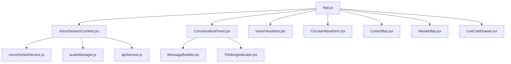
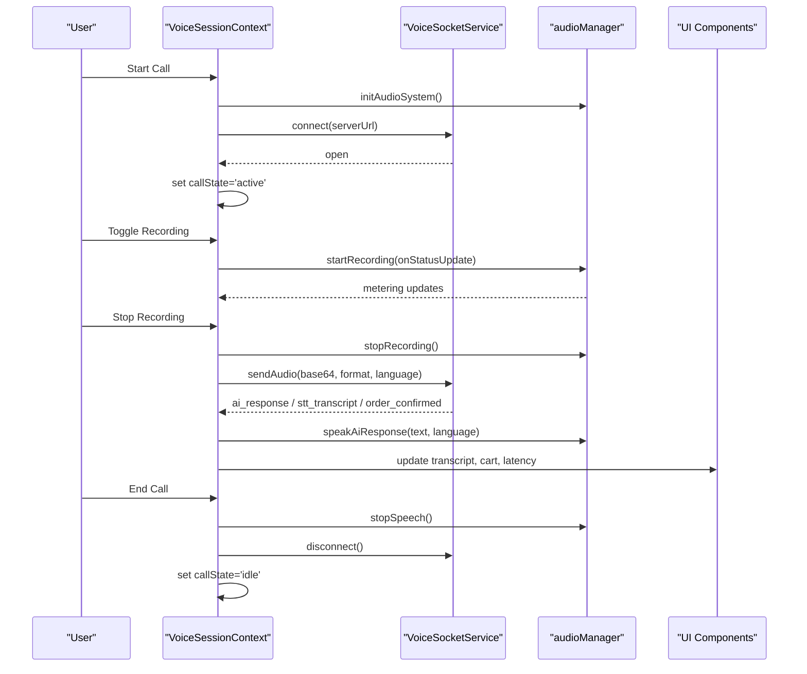
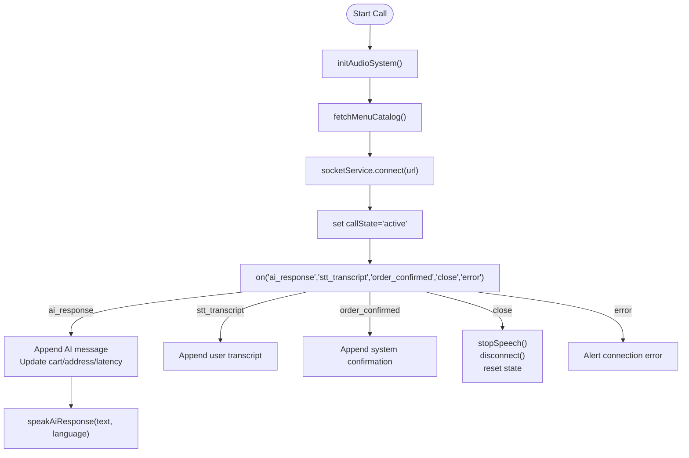
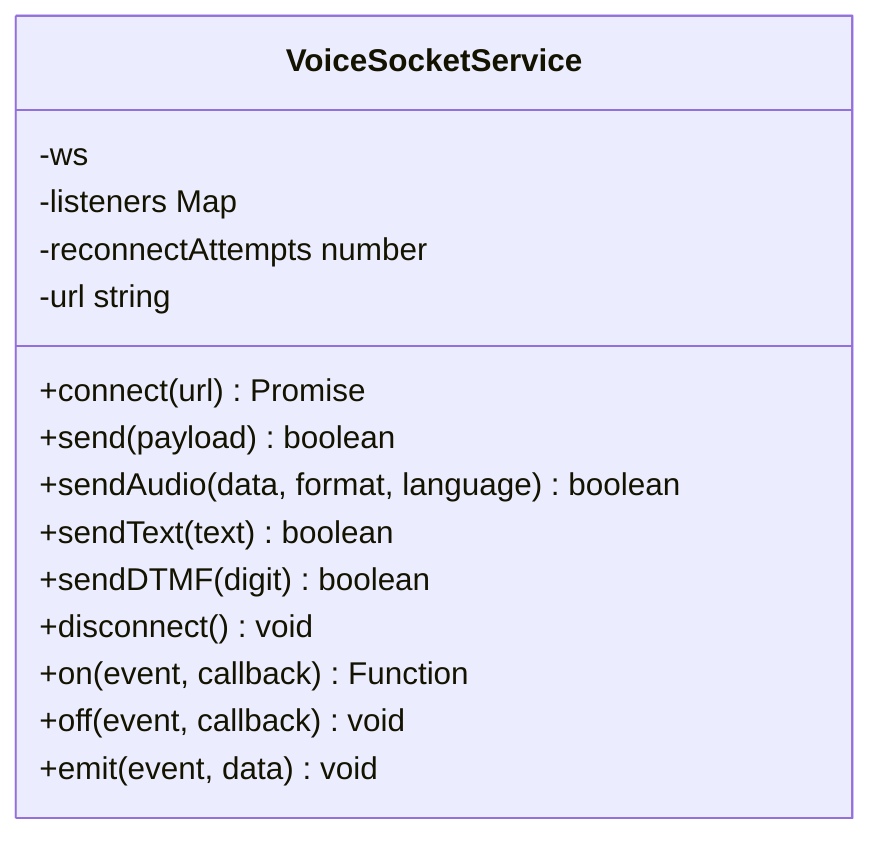
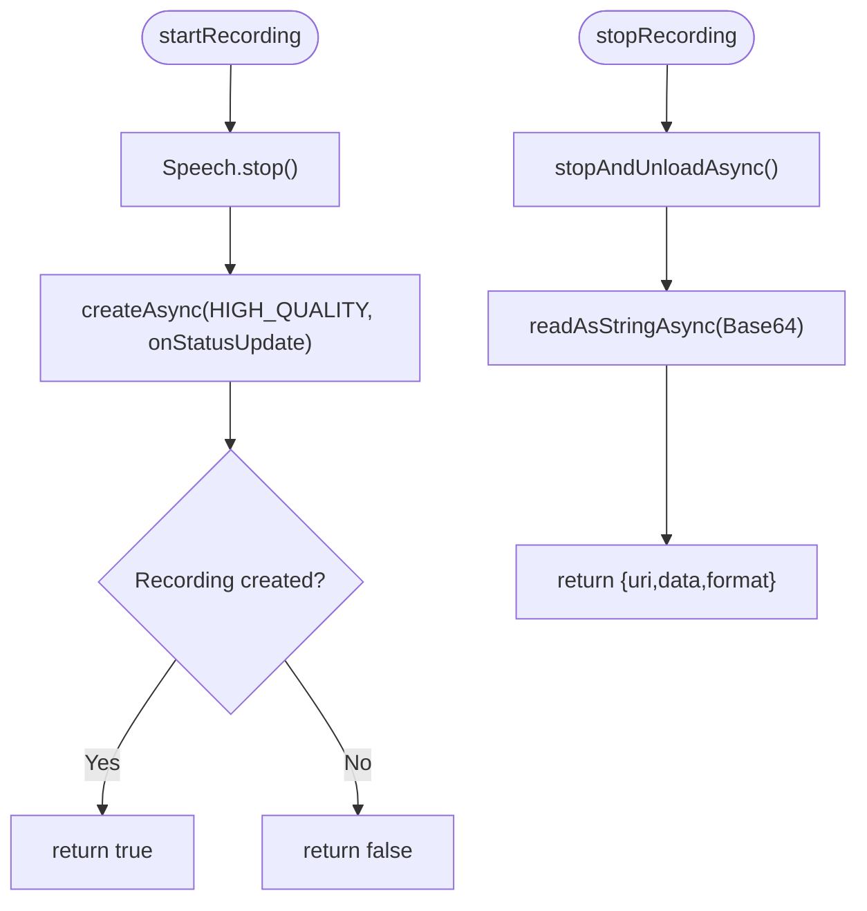
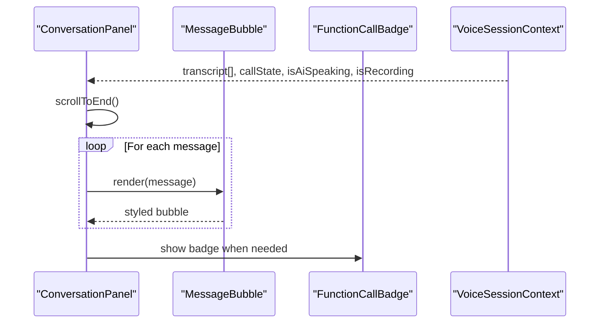
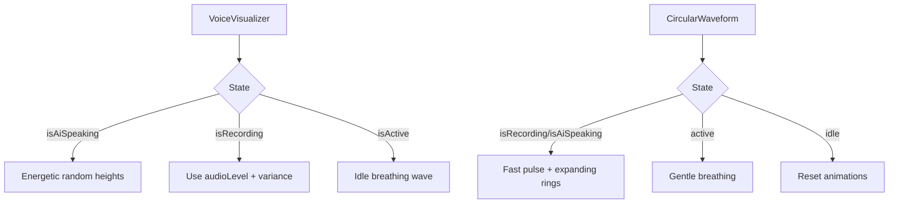
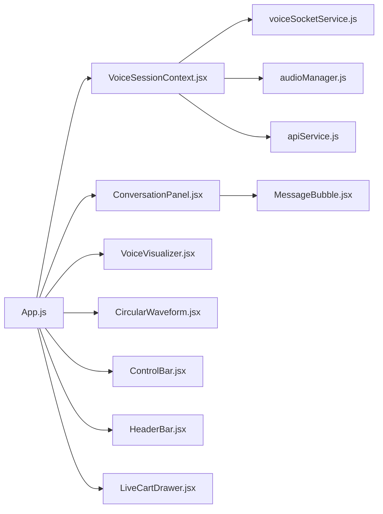

# Mobile Application

<cite>
**Referenced Files in This Document**
- [App.js](file://mobile/App.js)
- [VoiceSessionContext.jsx](file://mobile/src/context/VoiceSessionContext.jsx)
- [voiceSocketService.js](file://mobile/src/services/voiceSocketService.js)
- [audioManager.js](file://mobile/src/services/audioManager.js)
- [apiService.js](file://mobile/src/services/apiService.js)
- [ConversationPanel.jsx](file://mobile/src/components/conversation/ConversationPanel.jsx)
- [MessageBubble.jsx](file://mobile/src/components/conversation/MessageBubble.jsx)
- [FunctionCallBadge.jsx](file://mobile/src/components/conversation/FunctionCallBadge.jsx)
- [VoiceVisualizer.jsx](file://mobile/src/components/visualizers/VoiceVisualizer.jsx)
- [CircularWaveform.jsx](file://mobile/src/components/visualizers/CircularWaveform.jsx)
- [ControlBar.jsx](file://mobile/src/components/controls/ControlBar.jsx)
- [HeaderBar.jsx](file://mobile/src/components/common/HeaderBar.jsx)
- [LiveCartDrawer.jsx](file://mobile/src/components/commerce/LiveCartDrawer.jsx)
- [package.json](file://mobile/package.json)
</cite>

## Table of Contents
1. [Introduction](#introduction)
2. [Project Structure](#project-structure)
3. [Core Components](#core-components)
4. [Architecture Overview](#architecture-overview)
5. [Detailed Component Analysis](#detailed-component-analysis)
6. [Dependency Analysis](#dependency-analysis)
7. [Performance Considerations](#performance-considerations)
8. [Troubleshooting Guide](#troubleshooting-guide)
9. [Conclusion](#conclusion)

## Introduction
This document explains the React Native mobile application that enables voice-based food ordering. It focuses on:
- Voice session management using Context API for state persistence across navigation and UI components
- Audio visualization for waveform display and voice activity detection
- Conversation panel implementation with chat-like messages and function call badges
- Cross-platform considerations for iOS and Android (permissions, audio modes, background behavior)
- Touch interactions, gesture handling, and responsive layout strategies
- Performance optimization for audio processing and memory management on mobile devices

## Project Structure
The mobile app is an Expo-based React Native project organized by feature areas:
- Context layer for global voice session state and orchestration
- Services for audio capture/playback, WebSocket communication, and REST catalog access
- UI components grouped into conversation, visualizers, controls, common headers, and commerce modals
- App entry wiring providers and screens together

**Diagram sources**
- [App.js:16-153](file://mobile/App.js#L16-L153)
- [VoiceSessionContext.jsx:13-293](file://mobile/src/context/VoiceSessionContext.jsx#L13-L293)
- [voiceSocketService.js:1-129](file://mobile/src/services/voiceSocketService.js#L1-L129)
- [audioManager.js:10-131](file://mobile/src/services/audioManager.js#L10-L131)
- [apiService.js:10-49](file://mobile/src/services/apiService.js#L10-L49)
- [ConversationPanel.jsx:7-51](file://mobile/src/components/conversation/ConversationPanel.jsx#L7-L51)
- [MessageBubble.jsx:5-43](file://mobile/src/components/conversation/MessageBubble.jsx#L5-L43)
- [VoiceVisualizer.jsx:7-109](file://mobile/src/components/visualizers/VoiceVisualizer.jsx#L7-L109)
- [CircularWaveform.jsx:5-177](file://mobile/src/components/visualizers/CircularWaveform.jsx#L5-L177)
- [ControlBar.jsx:12-137](file://mobile/src/components/controls/ControlBar.jsx#L12-L137)
- [HeaderBar.jsx:5-65](file://mobile/src/components/common/HeaderBar.jsx#L5-L65)
- [LiveCartDrawer.jsx:13-140](file://mobile/src/components/commerce/LiveCartDrawer.jsx#L13-L140)

**Section sources**
- [App.js:1-167](file://mobile/App.js#L1-L167)
- [package.json:1-28](file://mobile/package.json#L1-L28)

## Core Components
- VoiceSessionContext: Central state holder for call lifecycle, transcript, cart, language, recording, AI speech, and modal visibility. Manages WebSocket events and audio actions.
- VoiceSocketService: Resilient WebSocket client with typed event emission and send helpers for audio, text, and DTMF.
- audioManager: Encapsulates microphone permissions, recording start/stop, base64 encoding, and native TTS playback.
- ConversationPanel + MessageBubble: Chat-like UI rendering user, AI, and system messages with auto-scrolling and live status indicators.
- Visualizers: CircularWaveform and VoiceVisualizer provide animated feedback for idle, recording, and AI speaking states.
- ControlBar: Floating control bar with push-to-talk, menu, keypad, text input toggle, and cart badge.
- HeaderBar: Language switcher and server environment selection (local Wi-Fi vs cloud).
- LiveCartDrawer: Slide-up drawer showing items, quantities, address summary, price breakdown, and order confirmation.

**Section sources**
- [VoiceSessionContext.jsx:13-302](file://mobile/src/context/VoiceSessionContext.jsx#L13-L302)
- [voiceSocketService.js:1-129](file://mobile/src/services/voiceSocketService.js#L1-L129)
- [audioManager.js:10-131](file://mobile/src/services/audioManager.js#L10-L131)
- [ConversationPanel.jsx:7-107](file://mobile/src/components/conversation/ConversationPanel.jsx#L7-L107)
- [MessageBubble.jsx:5-110](file://mobile/src/components/conversation/MessageBubble.jsx#L5-L110)
- [VoiceVisualizer.jsx:7-134](file://mobile/src/components/visualizers/VoiceVisualizer.jsx#L7-L134)
- [CircularWaveform.jsx:5-216](file://mobile/src/components/visualizers/CircularWaveform.jsx#L5-L216)
- [ControlBar.jsx:12-263](file://mobile/src/components/controls/ControlBar.jsx#L12-L263)
- [HeaderBar.jsx:5-145](file://mobile/src/components/common/HeaderBar.jsx#L5-L145)
- [LiveCartDrawer.jsx:13-340](file://mobile/src/components/commerce/LiveCartDrawer.jsx#L13-L340)

## Architecture Overview
High-level flow:
- App wraps the screen with VoiceSessionProvider to share voice session state globally.
- On connect, the context initializes audio, fetches the menu catalog, and opens a WebSocket to the backend.
- User interactions (push-to-talk, typing, DTMF) are sent via the socket service; transcripts and AI responses update the conversation panel.
- Visualizers reflect real-time audio levels and AI speech state.
- Commerce flows (menu, cart, confirm) integrate with the conversation through text commands or voice prompts.

**Diagram sources**
- [VoiceSessionContext.jsx:133-169](file://mobile/src/context/VoiceSessionContext.jsx#L133-L169)
- [VoiceSessionContext.jsx:171-209](file://mobile/src/context/VoiceSessionContext.jsx#L171-L209)
- [VoiceSessionContext.jsx:41-130](file://mobile/src/context/VoiceSessionContext.jsx#L41-L130)
- [voiceSocketService.js:11-57](file://mobile/src/services/voiceSocketService.js#L11-L57)
- [voiceSocketService.js:68-89](file://mobile/src/services/voiceSocketService.js#L68-L89)
- [audioManager.js:10-31](file://mobile/src/services/audioManager.js#L10-L31)
- [audioManager.js:36-90](file://mobile/src/services/audioManager.js#L36-L90)
- [audioManager.js:95-131](file://mobile/src/services/audioManager.js#L95-L131)

## Detailed Component Analysis

### Voice Session Management (Context API)
Responsibilities:
- Initialize audio and fetch catalog on mount
- Manage WebSocket connection lifecycle and events
- Handle push-to-talk recording and sending audio payloads
- Update transcript, cart, delivery address, and latency from server events
- Trigger AI speech output and manage speaking state
- Provide functions for text messaging, DTMF, quick add item, and language toggle

Key behaviors:
- Transcript entries include speaker role, timestamp, and optional metadata (provider, language)
- Cart and total updated from server state in AI response messages
- Error and close events reset call state and clean up resources

**Diagram sources**
- [VoiceSessionContext.jsx:35-39](file://mobile/src/context/VoiceSessionContext.jsx#L35-L39)
- [VoiceSessionContext.jsx:41-130](file://mobile/src/context/VoiceSessionContext.jsx#L41-L130)
- [VoiceSessionContext.jsx:133-169](file://mobile/src/context/VoiceSessionContext.jsx#L133-L169)

**Section sources**
- [VoiceSessionContext.jsx:13-302](file://mobile/src/context/VoiceSessionContext.jsx#L13-L302)

### WebSocket Service
Responsibilities:
- Establish and maintain WebSocket connections
- Emit typed events for messages and errors
- Send audio, text, and DTMF payloads
- Clean up on disconnect

Design notes:
- Uses a simple event emitter pattern with listener sets
- Sends a handshake 'start' on open
- Gracefully handles parse errors and emits them

**Diagram sources**
- [voiceSocketService.js:1-129](file://mobile/src/services/voiceSocketService.js#L1-L129)

**Section sources**
- [voiceSocketService.js:1-129](file://mobile/src/services/voiceSocketService.js#L1-L129)

### Audio Manager
Responsibilities:
- Request microphone permissions and configure platform-specific audio modes
- Start high-quality recordings with metering callbacks
- Stop recordings and encode to base64 for transmission
- Provide native TTS with language support and lifecycle callbacks

Cross-platform notes:
- iOS: allows recording, plays in silent mode, stays active flag configured
- Android: ducks other audio, earpiece routing disabled

**Diagram sources**
- [audioManager.js:36-90](file://mobile/src/services/audioManager.js#L36-L90)

**Section sources**
- [audioManager.js:10-131](file://mobile/src/services/audioManager.js#L10-L131)

### Conversation Panel and Messages
- Renders a scrollable list of messages with auto-scroll to latest
- Supports empty state with guidance text
- Shows a live listening pill when AI is ready but not speaking/recording
- MessageBubble differentiates user, AI, and system messages with distinct styling

Function call badges:
- FunctionCallBadge displays contextual action summaries (cart, address, confirm) with color-coded icons and labels

**Diagram sources**
- [ConversationPanel.jsx:7-51](file://mobile/src/components/conversation/ConversationPanel.jsx#L7-L51)
- [MessageBubble.jsx:5-43](file://mobile/src/components/conversation/MessageBubble.jsx#L5-L43)
- [FunctionCallBadge.jsx:5-26](file://mobile/src/components/conversation/FunctionCallBadge.jsx#L5-L26)

**Section sources**
- [ConversationPanel.jsx:7-107](file://mobile/src/components/conversation/ConversationPanel.jsx#L7-L107)
- [MessageBubble.jsx:5-110](file://mobile/src/components/conversation/MessageBubble.jsx#L5-L110)
- [FunctionCallBadge.jsx:5-58](file://mobile/src/components/conversation/FunctionCallBadge.jsx#L5-L58)

### Audio Visualization
- VoiceVisualizer: Animated bars reflecting audio level during recording, energetic cadence during AI speech, and idle breathing wave
- CircularWaveform: Pulsing orb with expanding rings for recording/AI speaking; gentle breathing for active idle

**Diagram sources**
- [VoiceVisualizer.jsx:17-74](file://mobile/src/components/visualizers/VoiceVisualizer.jsx#L17-L74)
- [CircularWaveform.jsx:14-94](file://mobile/src/components/visualizers/CircularWaveform.jsx#L14-L94)

**Section sources**
- [VoiceVisualizer.jsx:7-134](file://mobile/src/components/visualizers/VoiceVisualizer.jsx#L7-L134)
- [CircularWaveform.jsx:5-216](file://mobile/src/components/visualizers/CircularWaveform.jsx#L5-L216)

### Controls and Interactions
- ControlBar provides:
  - Push-to-talk central button with visual states (idle, active, recording)
  - Menu catalog trigger
  - DTMF keypad modal
  - Text input toggle for typing orders
  - Cart button with item count badge
- HeaderBar supports:
  - Language toggle between English and Tamil
  - Server environment selection (local Wi-Fi vs cloud), disabled during active calls

Touch and gesture patterns:
- TouchableOpacity used consistently for accessible tap targets
- Disabled states prevent interaction while inactive
- Expandable text input appears only when toggled and call is active

Responsive layout:
- Flexbox and percentage widths adapt to device width
- SafeAreaView ensures content respects device insets
- Modal and drawer use full-screen backdrop and slide animations

**Section sources**
- [ControlBar.jsx:12-263](file://mobile/src/components/controls/ControlBar.jsx#L12-L263)
- [HeaderBar.jsx:5-145](file://mobile/src/components/common/HeaderBar.jsx#L5-L145)
- [App.js:50-144](file://mobile/App.js#L50-L144)

### Commerce Integration
- LiveCartDrawer shows items, quantity controls, delivery address, GST, delivery fee, and total
- Confirm order sends a text command to the assistant to finalize
- Quick shortcuts and menu integration feed natural language requests to the conversation

**Section sources**
- [LiveCartDrawer.jsx:13-340](file://mobile/src/components/commerce/LiveCartDrawer.jsx#L13-L340)
- [App.js:114-143](file://mobile/App.js#L114-L143)

## Dependency Analysis
Component relationships and coupling:
- App wires provider and composes UI components
- VoiceSessionContext depends on services for audio, networking, and catalog
- ConversationPanel consumes context state and renders MessageBubble and badges
- Visualizers consume context-derived flags and audio level
- ControlBar triggers context methods and opens modals

**Diagram sources**
- [App.js:16-153](file://mobile/App.js#L16-L153)
- [VoiceSessionContext.jsx:13-293](file://mobile/src/context/VoiceSessionContext.jsx#L13-L293)
- [voiceSocketService.js:1-129](file://mobile/src/services/voiceSocketService.js#L1-L129)
- [audioManager.js:10-131](file://mobile/src/services/audioManager.js#L10-L131)
- [apiService.js:10-49](file://mobile/src/services/apiService.js#L10-L49)
- [ConversationPanel.jsx:7-51](file://mobile/src/components/conversation/ConversationPanel.jsx#L7-L51)
- [MessageBubble.jsx:5-43](file://mobile/src/components/conversation/MessageBubble.jsx#L5-L43)
- [VoiceVisualizer.jsx:7-109](file://mobile/src/components/visualizers/VoiceVisualizer.jsx#L7-L109)
- [CircularWaveform.jsx:5-177](file://mobile/src/components/visualizers/CircularWaveform.jsx#L5-L177)
- [ControlBar.jsx:12-137](file://mobile/src/components/controls/ControlBar.jsx#L12-L137)
- [HeaderBar.jsx:5-65](file://mobile/src/components/common/HeaderBar.jsx#L5-L65)
- [LiveCartDrawer.jsx:13-140](file://mobile/src/components/commerce/LiveCartDrawer.jsx#L13-L140)

**Section sources**
- [App.js:1-167](file://mobile/App.js#L1-L167)

## Performance Considerations
- Audio processing
  - Use HIGH_QUALITY recording preset to balance fidelity and bandwidth
  - Normalize dB metering to 0–1 scale for smooth visualization
  - Stop ongoing speech before starting recording to avoid conflicts
- Memory management
  - Ensure recordings are stopped and unloaded promptly to release buffers
  - Avoid retaining large base64 strings longer than necessary; send immediately
  - Clean up WebSocket listeners on unmount to prevent leaks
- Animation performance
  - Prefer native driver where possible (e.g., circular waveform uses native driver for transforms)
  - Limit concurrent animations; batch updates in loops
  - Reuse Animated.Value arrays instead of creating new instances per render
- Network resilience
  - Ping server health before connecting to fail fast
  - Handle parse errors gracefully and emit typed events
- UI responsiveness
  - Debounce heavy operations if adding more frequent updates
  - Keep transcript updates efficient; consider virtualization for very long histories

[No sources needed since this section provides general guidance]

## Troubleshooting Guide
Common issues and resolutions:
- Microphone permission denied
  - Ensure initAudioSystem runs before recording; check permission status and prompt user
- No audio received on server
  - Verify server URL and network connectivity; ping health endpoint first
  - Confirm WebSocket is open before sending audio/text/DTMF
- Speech not playing
  - Check TTS language codes and ensure device supports selected language
  - Stop any existing speech before starting new utterance
- Connection errors
  - Handle 'error' and 'close' events; reset call state and alert users
  - Validate local Wi-Fi IP or production URL based on environment

**Section sources**
- [audioManager.js:10-31](file://mobile/src/services/audioManager.js#L10-L31)
- [voiceSocketService.js:42-57](file://mobile/src/services/voiceSocketService.js#L42-L57)
- [VoiceSessionContext.jsx:108-130](file://mobile/src/context/VoiceSessionContext.jsx#L108-L130)
- [apiService.js:38-49](file://mobile/src/services/apiService.js#L38-L49)

## Conclusion
The mobile application implements a robust voice-first ordering experience using React Native and Expo. The Context API centralizes voice session state, enabling consistent UI updates across components. Audio capture and TTS are abstracted behind a service layer, while a resilient WebSocket client manages real-time communication. Visualizations provide clear feedback for recording and AI speech states. The conversation panel and commerce drawers deliver a chat-like interface with actionable badges and order summaries. Cross-platform audio modes and permissions are handled explicitly for iOS and Android. With careful attention to animation performance, memory cleanup, and network resilience, the app delivers a responsive and reliable voice ordering experience.

[No sources needed since this section summarizes without analyzing specific files]