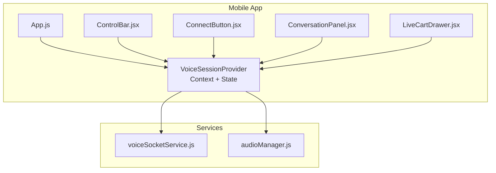
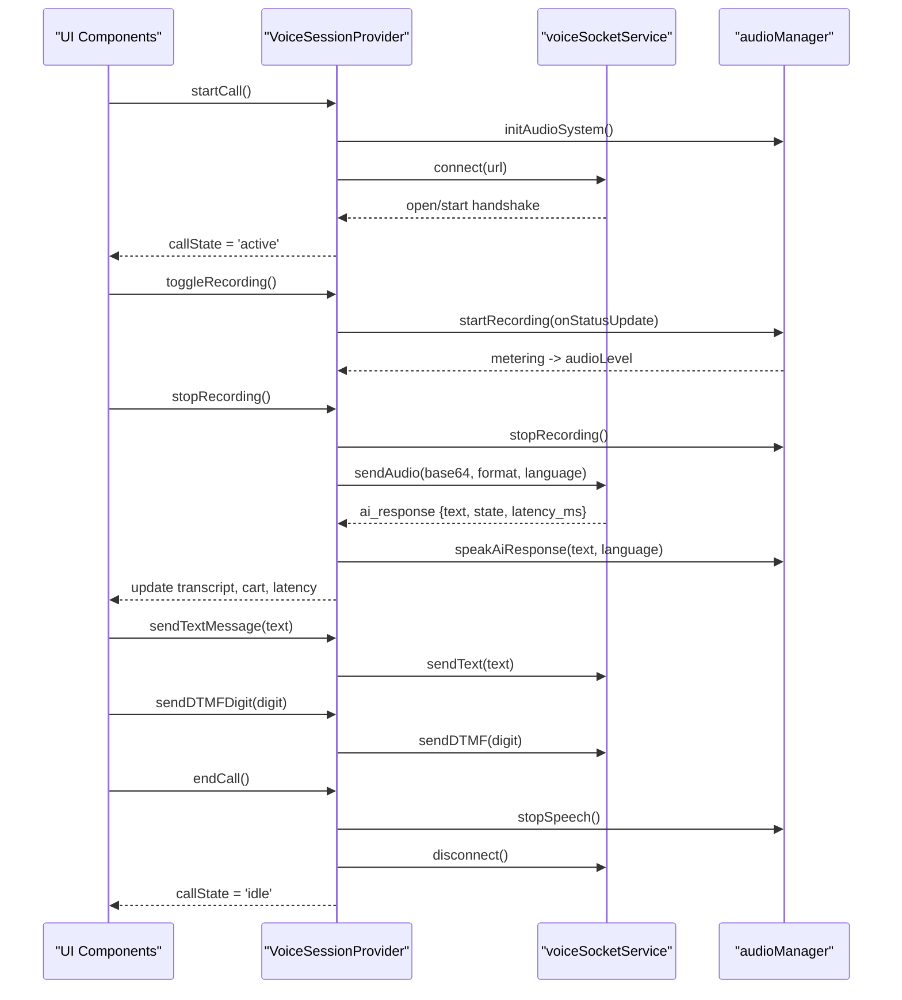
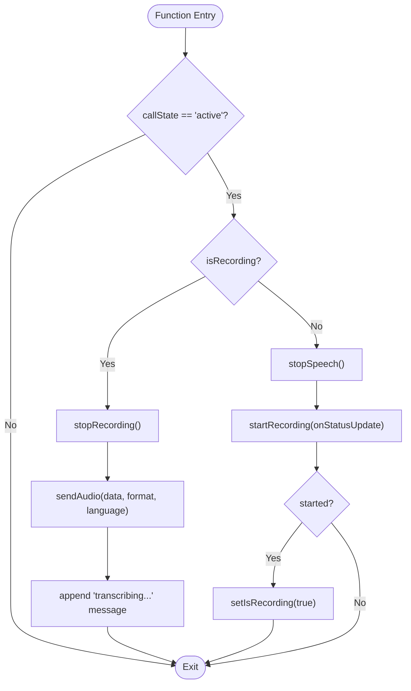
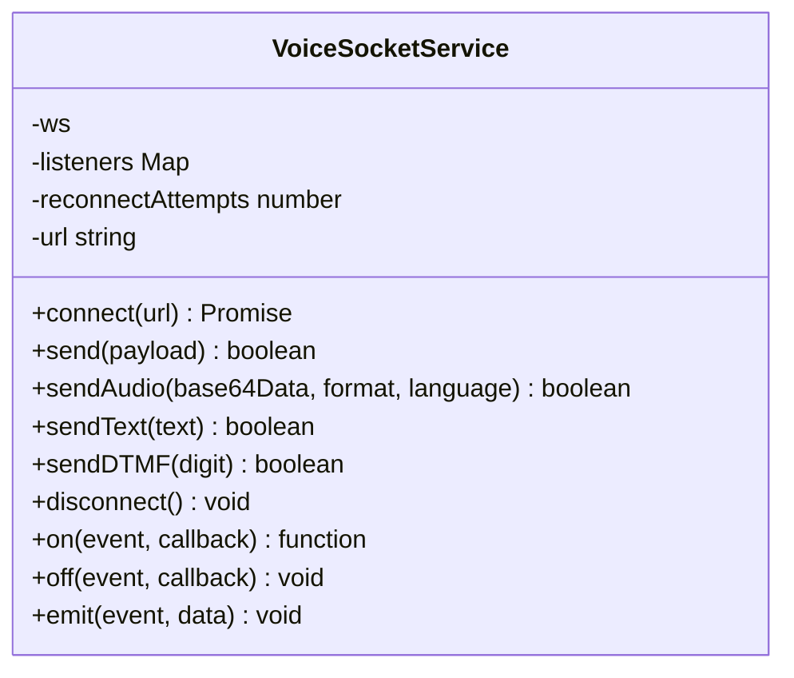
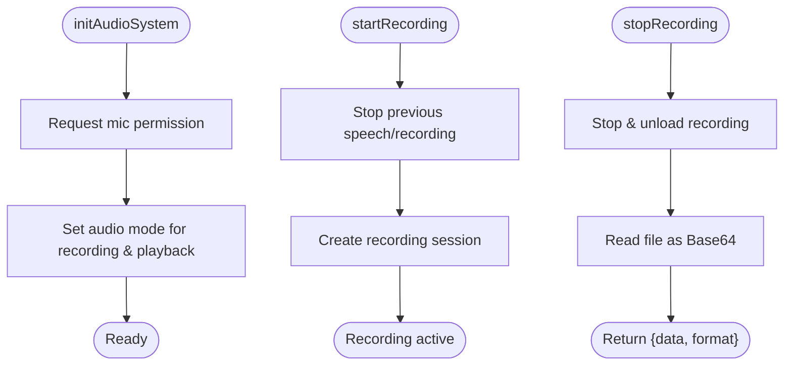
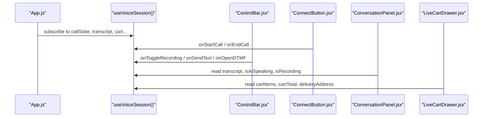
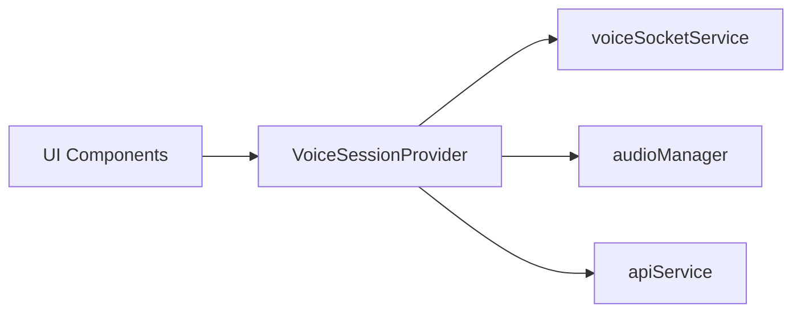

# Voice Session Management

<cite>
**Referenced Files in This Document**
- [VoiceSessionContext.jsx](file://mobile/src/context/VoiceSessionContext.jsx)
- [voiceSocketService.js](file://mobile/src/services/voiceSocketService.js)
- [audioManager.js](file://mobile/src/services/audioManager.js)
- [App.js](file://mobile/App.js)
- [ConnectButton.jsx](file://mobile/src/components/controls/ConnectButton.jsx)
- [ControlBar.jsx](file://mobile/src/components/controls/ControlBar.jsx)
- [ConversationPanel.jsx](file://mobile/src/components/conversation/ConversationPanel.jsx)
- [LiveCartDrawer.jsx](file://mobile/src/components/commerce/LiveCartDrawer.jsx)
</cite>

## Table of Contents
1. [Introduction](#introduction)
2. [Project Structure](#project-structure)
3. [Core Components](#core-components)
4. [Architecture Overview](#architecture-overview)
5. [Detailed Component Analysis](#detailed-component-analysis)
6. [Dependency Analysis](#dependency-analysis)
7. [Performance Considerations](#performance-considerations)
8. [Troubleshooting Guide](#troubleshooting-guide)
9. [Conclusion](#conclusion)

## Introduction
This document explains the voice session management system built with React Context API for a mobile application. It focuses on the VoiceSessionProvider implementation that coordinates call state, audio recording, transcript handling, cart updates, and cross-component communication via a custom hook. It also covers how components consume the context, the lifecycle methods for starting and ending calls, sending text messages, and sending DTMF digits, along with mobile-specific considerations such as audio permissions, background behavior, and memory management during voice sessions.

## Project Structure
The voice session system is centered around:
- A React Context provider that owns global session state and orchestrates WebSocket events, audio recording, and speech playback.
- Services for WebSocket communication and audio capture/playback.
- UI components that consume the context to render controls, conversation transcripts, and commerce features like cart and menu.

**Diagram sources**
- [App.js:16-153](file://mobile/App.js#L16-L153)
- [VoiceSessionContext.jsx:13-293](file://mobile/src/context/VoiceSessionContext.jsx#L13-L293)
- [voiceSocketService.js:1-129](file://mobile/src/services/voiceSocketService.js#L1-L129)
- [audioManager.js:10-131](file://mobile/src/services/audioManager.js#L10-L131)
- [ControlBar.jsx:12-137](file://mobile/src/components/controls/ControlBar.jsx#L12-L137)
- [ConnectButton.jsx:5-55](file://mobile/src/components/controls/ConnectButton.jsx#L5-L55)
- [ConversationPanel.jsx:7-51](file://mobile/src/components/conversation/ConversationPanel.jsx#L7-L51)
- [LiveCartDrawer.jsx:13-140](file://mobile/src/components/commerce/LiveCartDrawer.jsx#L13-L140)

**Section sources**
- [App.js:16-153](file://mobile/App.js#L16-L153)
- [VoiceSessionContext.jsx:13-293](file://mobile/src/context/VoiceSessionContext.jsx#L13-L293)

## Core Components
- VoiceSessionProvider: Owns all session-related state (callState, transcript, cartItems, cartTotal, deliveryAddress, isRecording, isAiSpeaking, audioLevel, latencyMs, activeLanguage, catalog, and modal toggles). It initializes audio, fetches the menu catalog, sets up WebSocket event listeners, and exposes lifecycle methods.
- useVoiceSession: Custom hook to access the context safely within any component under the provider.
- voiceSocketService: Encapsulates WebSocket connection, message routing, and sending audio/text/DTMF payloads.
- audioManager: Handles microphone permissions, recording lifecycle, base64 encoding of recordings, and native text-to-speech for AI responses.

Key responsibilities:
- Manage call lifecycle transitions (idle → connecting → active → idle).
- Maintain a running transcript of user and AI messages.
- Keep cart items, totals, and delivery address synchronized from server updates.
- Stream audio levels for visualizers and control UI feedback.
- Provide methods to start/end calls, toggle push-to-talk recording, send text, and send DTMF digits.

**Section sources**
- [VoiceSessionContext.jsx:13-293](file://mobile/src/context/VoiceSessionContext.jsx#L13-L293)
- [voiceSocketService.js:1-129](file://mobile/src/services/voiceSocketService.js#L1-L129)
- [audioManager.js:10-131](file://mobile/src/services/audioManager.js#L10-L131)

## Architecture Overview
The provider wires together UI, services, and backend communication:

**Diagram sources**
- [VoiceSessionContext.jsx:36-130](file://mobile/src/context/VoiceSessionContext.jsx#L36-L130)
- [VoiceSessionContext.jsx:133-243](file://mobile/src/context/VoiceSessionContext.jsx#L133-L243)
- [voiceSocketService.js:11-99](file://mobile/src/services/voiceSocketService.js#L11-L99)
- [audioManager.js:10-131](file://mobile/src/services/audioManager.js#L10-L131)

## Detailed Component Analysis

### VoiceSessionProvider
- State structure:
  - callState: 'idle' | 'connecting' | 'active'
  - transcript: array of message objects with id, speaker, text, timestamp, and optional metadata
  - cartItems, cartTotal, deliveryAddress: commerce state synced from server
  - isRecording, isAiSpeaking: real-time media states
  - audioLevel: normalized metering value for visualization
  - latencyMs: round-trip latency reported by server
  - activeLanguage: 'en-IN' or 'ta-IN'
  - catalog: menu data fetched at startup
  - Modal flags: isCatalogOpen, isCartOpen, isDTMFOpen, isAddressOpen
- Lifecycle methods:
  - startCall: pings server health, connects WebSocket, sets callState to 'active', records start time
  - endCall: stops speech, stops recording if active, disconnects socket, resets states
  - toggleRecording: starts/stops recording; sends audio payload when stopping; updates audio level while recording
  - sendTextMessage: appends user message to transcript and sends text over WebSocket
  - sendDTMFDigit: sends DTMF digit and logs it to transcript
  - askForDish: convenience wrapper to send a formatted order request
  - toggleLanguage: switches between supported languages
- Event handling:
  - ai_response: updates transcript, cart, delivery address, latency, and triggers TTS
  - stt_transcript: adds final user transcripts
  - order_confirmed: posts confirmation message
  - close/error: resets call state and cleans up audio

**Diagram sources**
- [VoiceSessionContext.jsx:172-209](file://mobile/src/context/VoiceSessionContext.jsx#L172-L209)

**Section sources**
- [VoiceSessionContext.jsx:13-293](file://mobile/src/context/VoiceSessionContext.jsx#L13-L293)

### WebSocket Service (voiceSocketService)
- Responsibilities:
  - Establish and manage WebSocket connections
  - Route incoming messages to typed event handlers
  - Send audio chunks, text messages, and DTMF digits
  - Cleanly disconnect and emit lifecycle events
- Key APIs:
  - connect(url), send(payload), sendAudio(base64, format, language), sendText(text), sendDTMF(digit), disconnect(), on(event, callback)

**Diagram sources**
- [voiceSocketService.js:3-129](file://mobile/src/services/voiceSocketService.js#L3-L129)

**Section sources**
- [voiceSocketService.js:1-129](file://mobile/src/services/voiceSocketService.js#L1-L129)

### Audio Manager (audioManager)
- Responsibilities:
  - Request microphone permissions and configure audio modes
  - Start/stop high-quality recordings and encode to base64
  - Speak AI responses using native speech synthesis with language support
  - Stop ongoing speech when needed
- Mobile considerations:
  - Ensures proper audio mode settings for recording and playback
  - Stops existing speech before starting new utterances
  - Gracefully handles permission denials and errors

**Diagram sources**
- [audioManager.js:10-131](file://mobile/src/services/audioManager.js#L10-L131)

**Section sources**
- [audioManager.js:10-131](file://mobile/src/services/audioManager.js#L10-L131)

### UI Components Consuming Context
- App.js: Wires the provider and composes screens, passing context values to child components. Demonstrates usage of useVoiceSession to obtain callState, transcript, cart, and actions.
- ConnectButton.jsx: Displays connection status and latency; triggers startCall/endCall.
- ControlBar.jsx: Provides push-to-talk, text input, menu/cart/DTMF navigation; invokes toggleRecording, sendTextMessage, sendDTMFDigit.
- ConversationPanel.jsx: Renders transcript and shows “AI Assistant Ready” when idle but active.
- LiveCartDrawer.jsx: Shows live cart items, totals, and delivery address; supports confirm and modify operations via context-driven commands.

**Diagram sources**
- [App.js:16-153](file://mobile/App.js#L16-L153)
- [ControlBar.jsx:12-137](file://mobile/src/components/controls/ControlBar.jsx#L12-L137)
- [ConnectButton.jsx:5-55](file://mobile/src/components/controls/ConnectButton.jsx#L5-L55)
- [ConversationPanel.jsx:7-51](file://mobile/src/components/conversation/ConversationPanel.jsx#L7-L51)
- [LiveCartDrawer.jsx:13-140](file://mobile/src/components/commerce/LiveCartDrawer.jsx#L13-L140)

**Section sources**
- [App.js:16-153](file://mobile/App.js#L16-L153)
- [ControlBar.jsx:12-137](file://mobile/src/components/controls/ControlBar.jsx#L12-L137)
- [ConnectButton.jsx:5-55](file://mobile/src/components/controls/ConnectButton.jsx#L5-L55)
- [ConversationPanel.jsx:7-51](file://mobile/src/components/conversation/ConversationPanel.jsx#L7-L51)
- [LiveCartDrawer.jsx:13-140](file://mobile/src/components/commerce/LiveCartDrawer.jsx#L13-L140)

## Dependency Analysis
- Context depends on:
  - voiceSocketService for persistent, typed messaging
  - audioManager for device-level audio I/O
  - apiService for catalog fetching and health checks
- Components depend only on the context interface exposed by useVoiceSession, keeping them decoupled from service details.

**Diagram sources**
- [VoiceSessionContext.jsx:1-5](file://mobile/src/context/VoiceSessionContext.jsx#L1-L5)
- [voiceSocketService.js:1-129](file://mobile/src/services/voiceSocketService.js#L1-L129)
- [audioManager.js:1-131](file://mobile/src/services/audioManager.js#L1-L131)

**Section sources**
- [VoiceSessionContext.jsx:1-5](file://mobile/src/context/VoiceSessionContext.jsx#L1-L5)

## Performance Considerations
- Recording and streaming:
  - Use high-quality presets judiciously; consider chunked streaming for long sessions to reduce memory pressure.
  - Normalize audio level metering to avoid excessive re-renders; batch updates where possible.
- Speech synthesis:
  - Stop prior speech before starting new utterances to prevent overlap and resource contention.
- WebSocket:
  - Ensure clean disconnect on endCall to free sockets and listeners.
  - Handle network errors gracefully and reset UI state to idle.
- Memory management:
  - Unload recordings promptly after sending to free storage-backed buffers.
  - Avoid retaining large transcript arrays indefinitely; consider pagination or trimming for long sessions.

[No sources needed since this section provides general guidance]

## Troubleshooting Guide
Common issues and resolutions:
- Microphone permission denied:
  - The audio initialization requests permissions; if not granted, recording will fail. Ensure permissions are allowed in device settings.
- Cannot connect to backend:
  - Verify server URL and network connectivity; the provider pings health and alerts on failure.
- No AI speech output:
  - Check that isAiSpeaking is set correctly and that speech is not being interrupted by overlapping inputs.
- Stuck in connecting state:
  - Ensure WebSocket open event fires; check error/close events and reset state accordingly.

**Section sources**
- [audioManager.js:10-31](file://mobile/src/services/audioManager.js#L10-L31)
- [VoiceSessionContext.jsx:108-121](file://mobile/src/context/VoiceSessionContext.jsx#L108-L121)
- [voiceSocketService.js:42-55](file://mobile/src/services/voiceSocketService.js#L42-L55)

## Conclusion
The VoiceSessionProvider centralizes voice session orchestration across audio, WebSocket, and commerce state, exposing a simple interface through useVoiceSession. Components remain declarative and focused on presentation, while the provider manages complex interactions with device capabilities and remote services. Proper attention to permissions, background behavior, and memory hygiene ensures a smooth, responsive voice experience on mobile devices.