# Dispatch & Delivery Workflow

<cite>
**Referenced Files in This Document**
- [dispatchStateMachine.js](file://server/src/domain/dispatch/dispatchStateMachine.js)
- [DispatchProvider.js](file://server/src/integrations/dispatch/DispatchProvider.js)
- [ondcService.js](file://server/src/services/ondcService.js)
- [dispatch.worker.js](file://server/src/workers/dispatch.worker.js)
- [queueManager.js](file://server/src/queue/queueManager.js)
- [orderStateMachine.js](file://server/src/domain/orders/orderStateMachine.js)
- [order.repository.js](file://server/src/domain/orders/order.repository.js)
- [dashboardWsHandler.js](file://server/src/websocket/dashboardWsHandler.js)
- [notification.worker.js](file://server/src/workers/notification.worker.js)
- [whatsappService.js](file://server/src/services/whatsappService.js)
- [paymentService.js](file://server/src/services/paymentService.js)
- [geocodingService.js](file://server/src/services/geocodingService.js)
- [OrderDispatch.jsx](file://client/src/components/OrderDispatch.jsx)
</cite>

## Table of Contents
1. Introduction
2. Project Structure
3. Core Components
4. Architecture Overview
5. Detailed Component Analysis
6. Dependency Analysis
7. Performance Considerations
8. Troubleshooting Guide
9. Conclusion

## Introduction
This document explains the end-to-end dispatch workflow that manages order fulfillment and delivery coordination. It covers:
- The dispatch state machine for assignment, preparation, rider allocation, and delivery tracking
- Integration with third-party dispatch providers via a pluggable interface
- Real-time location handling, delivery status updates, and customer notifications
- Examples of dispatch initiation, driver assignment flows, delivery confirmation, and exception handling

## Project Structure
The dispatch system spans domain logic, integrations, background workers, queues, real-time websockets, and client UI:
- Domain state machines define authoritative transitions for orders and dispatch
- Integrations abstract ONDC and direct POS dispatching behind a common interface
- Workers process asynchronous tasks (dispatch, notifications) using durable queues
- WebSockets broadcast live updates to dashboards
- Client components visualize order lifecycle and allow staff actions

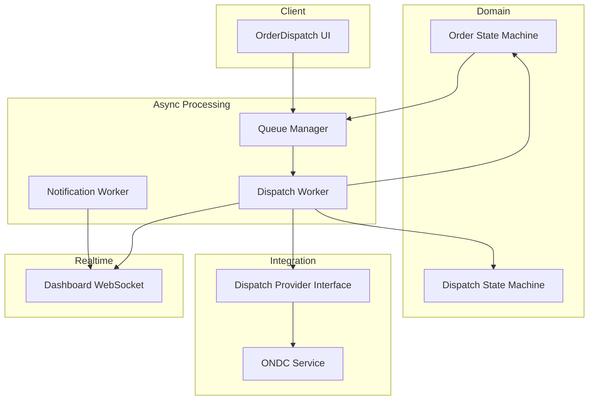

**Diagram sources**
- [dispatchStateMachine.js:9-28](file://server/src/domain/dispatch/dispatchStateMachine.js#L9-L28)
- [orderStateMachine.js:8-41](file://server/src/domain/orders/orderStateMachine.js#L8-L41)
- [DispatchProvider.js:11-85](file://server/src/integrations/dispatch/DispatchProvider.js#L11-L85)
- [ondcService.js:20-141](file://server/src/services/ondcService.js#L20-L141)
- [queueManager.js:1-122](file://server/src/queue/queueManager.js#L1-L122)
- [dispatch.worker.js:12-52](file://server/src/workers/dispatch.worker.js#L12-L52)
- [notification.worker.js:10-71](file://server/src/workers/notification.worker.js#L10-L71)
- [dashboardWsHandler.js:43-68](file://server/src/websocket/dashboardWsHandler.js#L43-L68)
- [OrderDispatch.jsx:153-181](file://client/src/components/OrderDispatch.jsx#L153-L181)

**Section sources**
- [dispatchStateMachine.js:9-28](file://server/src/domain/dispatch/dispatchStateMachine.js#L9-L28)
- [orderStateMachine.js:8-41](file://server/src/domain/orders/orderStateMachine.js#L8-L41)
- [DispatchProvider.js:11-85](file://server/src/integrations/dispatch/DispatchProvider.js#L11-L85)
- [ondcService.js:20-141](file://server/src/services/ondcService.js#L20-L141)
- [queueManager.js:1-122](file://server/src/queue/queueManager.js#L1-L122)
- [dispatch.worker.js:12-52](file://server/src/workers/dispatch.worker.js#L12-L52)
- [notification.worker.js:10-71](file://server/src/workers/notification.worker.js#L10-L71)
- [dashboardWsHandler.js:43-68](file://server/src/websocket/dashboardWsHandler.js#L43-L68)
- [OrderDispatch.jsx:153-181](file://client/src/components/OrderDispatch.jsx#L153-L181)

## Core Components
- Dispatch State Machine: Defines states and allowed transitions for kitchen/delivery lifecycle, including acceptance, preparation, readiness, rider assignment, delivery, failure, and cancellation.
- Order State Machine: Governs the full order lifecycle from creation through payment to dispatch and completion, with dispute handling.
- Dispatch Provider Interface: Abstracts third-party dispatch channels (ONDC Beckn or direct POS), enabling fallback and environment-driven selection.
- Background Workers: Process dispatch and notification jobs asynchronously with idempotency and retries.
- Queues: Provide durable job processing with concurrency controls and deduplication keys.
- Real-time Dashboard: Broadcasts events to authenticated dashboard clients scoped by tenant and restaurant.
- Notifications: Send SMS, WhatsApp receipts, and pin-drop requests; generate payment links.
- Geocoding: Resolves spoken addresses to coordinates and triggers pin-drop when confidence is low.

**Section sources**
- [dispatchStateMachine.js:9-147](file://server/src/domain/dispatch/dispatchStateMachine.js#L9-L147)
- [orderStateMachine.js:8-325](file://server/src/domain/orders/orderStateMachine.js#L8-L325)
- [DispatchProvider.js:11-93](file://server/src/integrations/dispatch/DispatchProvider.js#L11-L93)
- [dispatch.worker.js:12-52](file://server/src/workers/dispatch.worker.js#L12-L52)
- [queueManager.js:1-122](file://server/src/queue/queueManager.js#L1-L122)
- [dashboardWsHandler.js:10-68](file://server/src/websocket/dashboardWsHandler.js#L10-L68)
- [notification.worker.js:10-71](file://server/src/workers/notification.worker.js#L10-L71)
- [whatsappService.js:24-114](file://server/src/services/whatsappService.js#L24-L114)
- [paymentService.js:25-114](file://server/src/services/paymentService.js#L25-L114)
- [geocodingService.js:21-161](file://server/src/services/geocodingService.js#L21-L161)

## Architecture Overview
The dispatch workflow orchestrates multiple systems:
- Orders transition into dispatch via the order state machine
- A queue job triggers the dispatch worker
- The worker selects a provider (ONDC or direct POS) and executes the integration flow
- On success, the order status is updated and a dispatch state is created and advanced
- Real-time events are broadcast to dashboards; customers receive SMS/WhatsApp notifications
- Geocoding may prompt a pin-drop confirmation for precise delivery locations

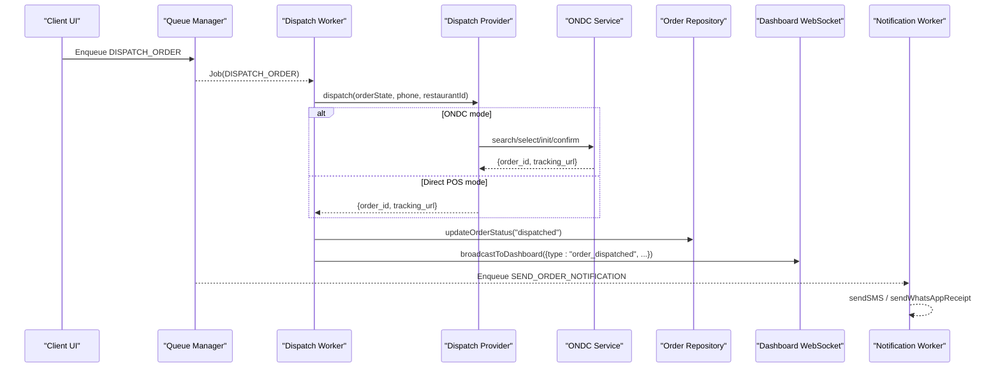

**Diagram sources**
- [queueManager.js:88-94](file://server/src/queue/queueManager.js#L88-L94)
- [dispatch.worker.js:12-52](file://server/src/workers/dispatch.worker.js#L12-L52)
- [DispatchProvider.js:24-85](file://server/src/integrations/dispatch/DispatchProvider.js#L24-L85)
- [ondcService.js:20-141](file://server/src/services/ondcService.js#L20-L141)
- [order.repository.js:220-287](file://server/src/domain/orders/order.repository.js#L220-L287)
- [dashboardWsHandler.js:43-68](file://server/src/websocket/dashboardWsHandler.js#L43-L68)
- [notification.worker.js:10-71](file://server/src/workers/notification.worker.js#L10-L71)

## Detailed Component Analysis

### Dispatch State Machine
- States include pending, accepted, preparing, ready, out for delivery, delivered, failed, cancelled
- Actions enforce strict transitions; illegal transitions return errors
- History records each transition with timestamps and payload summaries
- Rider assignment enriches state with rider details and tracking URL

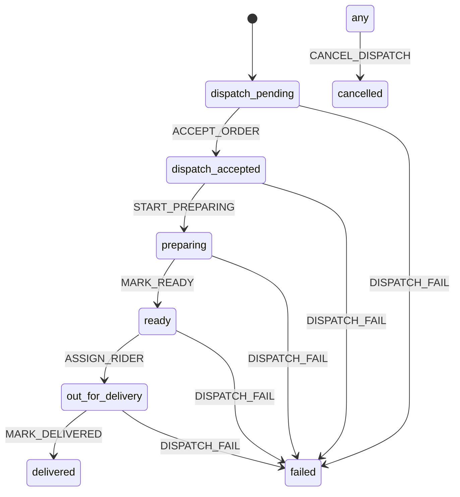

**Diagram sources**
- [dispatchStateMachine.js:9-28](file://server/src/domain/dispatch/dispatchStateMachine.js#L9-L28)
- [dispatchStateMachine.js:49-80](file://server/src/domain/dispatch/dispatchStateMachine.js#L49-L80)
- [dispatchStateMachine.js:82-147](file://server/src/domain/dispatch/dispatchStateMachine.js#L82-L147)

**Section sources**
- [dispatchStateMachine.js:9-147](file://server/src/domain/dispatch/dispatchStateMachine.js#L9-L147)

### Order State Machine
- Covers collection of items and address, validation, confirmation, payment, dispatch, completion, and disputes
- Prevents illegal transitions and maintains an immutable history
- Recalculates totals and fees on transitions

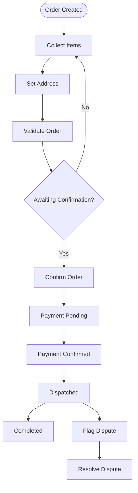

**Diagram sources**
- [orderStateMachine.js:8-41](file://server/src/domain/orders/orderStateMachine.js#L8-L41)
- [orderStateMachine.js:73-147](file://server/src/domain/orders/orderStateMachine.js#L73-L147)
- [orderStateMachine.js:154-325](file://server/src/domain/orders/orderStateMachine.js#L154-L325)

**Section sources**
- [orderStateMachine.js:8-325](file://server/src/domain/orders/orderStateMachine.js#L8-L325)

### Dispatch Provider Integration
- Base class defines a uniform dispatch contract
- ONDC adapter implements search/select/init/confirm with automatic fallback to direct POS on failure
- Direct POS adapter simulates kitchen printer/POS dispatch
- Factory selects provider based on environment configuration

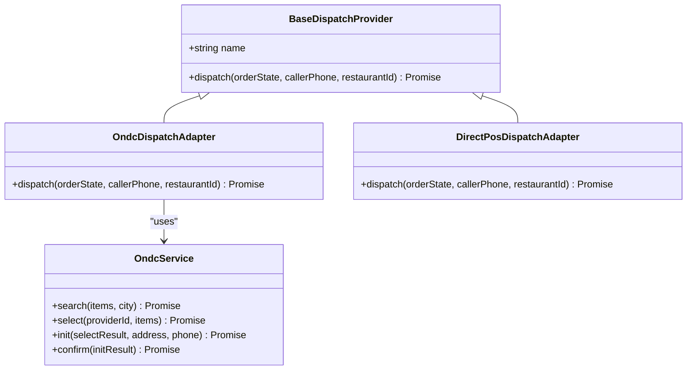

**Diagram sources**
- [DispatchProvider.js:11-85](file://server/src/integrations/dispatch/DispatchProvider.js#L11-L85)
- [ondcService.js:20-141](file://server/src/services/ondcService.js#L20-L141)

**Section sources**
- [DispatchProvider.js:11-93](file://server/src/integrations/dispatch/DispatchProvider.js#L11-L93)
- [ondcService.js:20-141](file://server/src/services/ondcService.js#L20-L141)

### Dispatch Worker Flow
- Validates tenant and restaurant context
- Invokes provider dispatch and handles result
- Creates initial dispatch state and advances to accepted
- Updates order status to dispatched
- Broadcasts event to dashboard with dispatch metadata
- Throws error if dispatch fails

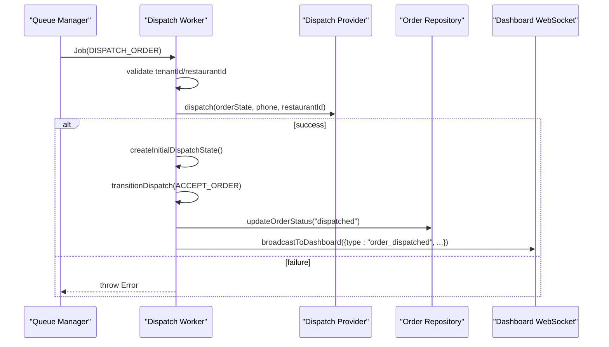

**Diagram sources**
- [dispatch.worker.js:12-52](file://server/src/workers/dispatch.worker.js#L12-L52)
- [dispatchStateMachine.js:30-47](file://server/src/domain/dispatch/dispatchStateMachine.js#L30-L47)
- [dispatchStateMachine.js:82-147](file://server/src/domain/dispatch/dispatchStateMachine.js#L82-L147)
- [order.repository.js:220-287](file://server/src/domain/orders/order.repository.js#L220-L287)
- [dashboardWsHandler.js:43-68](file://server/src/websocket/dashboardWsHandler.js#L43-L68)

**Section sources**
- [dispatch.worker.js:12-52](file://server/src/workers/dispatch.worker.js#L12-L52)

### Queue Management and Idempotency
- Dedicated queues for notifications, dispatch, and recordings
- Idempotency keys prevent duplicate processing across retries
- Concurrency and retry policies configured per queue
- Enqueue helpers accept either string job types or structured payloads

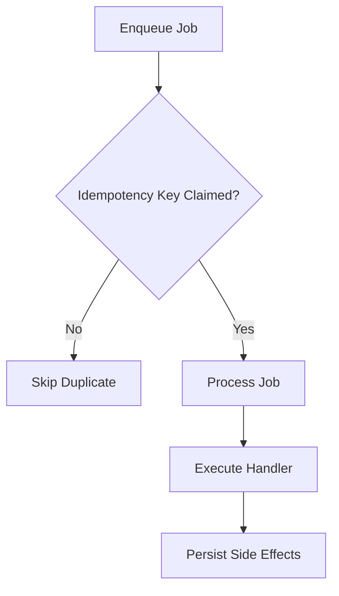

**Diagram sources**
- [queueManager.js:15-75](file://server/src/queue/queueManager.js#L15-L75)
- [queueManager.js:80-102](file://server/src/queue/queueManager.js#L80-L102)

**Section sources**
- [queueManager.js:1-122](file://server/src/queue/queueManager.js#L1-L122)

### Real-Time Location Tracking and Pin-Drop
- Geocoding resolves spoken addresses to coordinates with confidence levels
- Low confidence triggers a pin-drop request via WhatsApp
- Pin-drop token is generated and stored securely with expiration
- Customer confirms exact location via a time-bound link

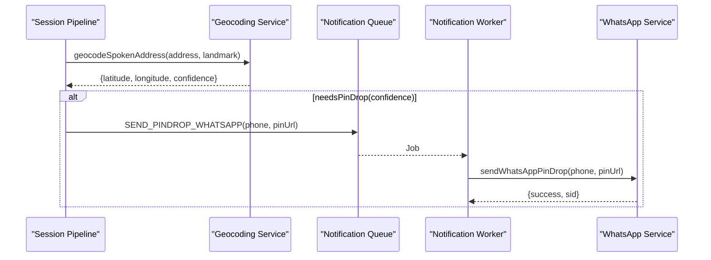

**Diagram sources**
- [geocodingService.js:21-161](file://server/src/services/geocodingService.js#L21-L161)
- [notification.worker.js:62-69](file://server/src/workers/notification.worker.js#L62-L69)
- [whatsappService.js:64-77](file://server/src/services/whatsappService.js#L64-L77)

**Section sources**
- [geocodingService.js:21-161](file://server/src/services/geocodingService.js#L21-L161)
- [notification.worker.js:62-69](file://server/src/workers/notification.worker.js#L62-L69)
- [whatsappService.js:64-77](file://server/src/services/whatsappService.js#L64-L77)

### Delivery Status Updates and Customer Notifications
- Notification worker creates payment links and sends SMS and WhatsApp receipts
- Receipt includes itemized list, total, delivery address, and optional tracking link
- Pin-drop messaging guides customers to confirm precise location

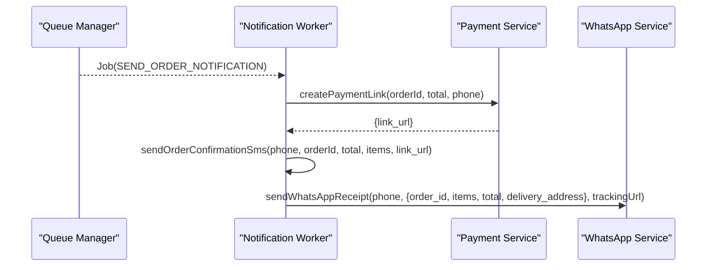

**Diagram sources**
- [notification.worker.js:10-55](file://server/src/workers/notification.worker.js#L10-L55)
- [paymentService.js:25-61](file://server/src/services/paymentService.js#L25-L61)
- [whatsappService.js:24-57](file://server/src/services/whatsappService.js#L24-L57)

**Section sources**
- [notification.worker.js:10-71](file://server/src/workers/notification.worker.js#L10-L71)
- [paymentService.js:25-114](file://server/src/services/paymentService.js#L25-L114)
- [whatsappService.js:24-114](file://server/src/services/whatsappService.js#L24-L114)

### Driver Assignment Algorithms
- The dispatch state machine supports rider assignment via ASSIGN_RIDER, transitioning to out for delivery
- Assignments can include rider name, phone, and tracking URL
- In this codebase, assignment is modeled as a state transition; actual algorithmic selection is extensible via provider implementations

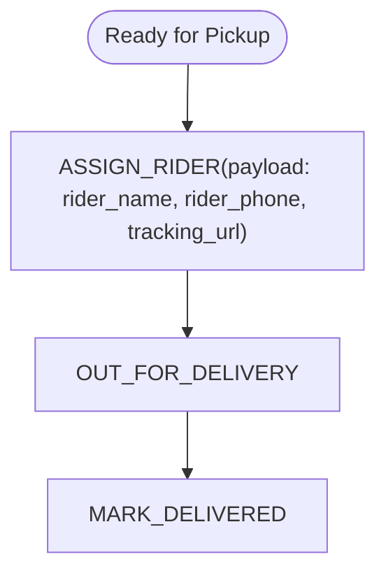

**Diagram sources**
- [dispatchStateMachine.js:66-70](file://server/src/domain/dispatch/dispatchStateMachine.js#L66-L70)
- [dispatchStateMachine.js:110-115](file://server/src/domain/dispatch/dispatchStateMachine.js#L110-L115)

**Section sources**
- [dispatchStateMachine.js:66-115](file://server/src/domain/dispatch/dispatchStateMachine.js#L66-L115)

### Delivery Confirmation Processes
- Delivery completion is modeled by MARK_DELIVERED in the dispatch state machine
- Order completion is modeled by COMPLETE_ORDER in the order state machine
- Staff can mark orders complete via the KDS UI when appropriate

**Section sources**
- [dispatchStateMachine.js:117-119](file://server/src/domain/dispatch/dispatchStateMachine.js#L117-L119)
- [orderStateMachine.js:284-286](file://server/src/domain/orders/orderStateMachine.js#L284-L286)
- [OrderDispatch.jsx:173-181](file://client/src/components/OrderDispatch.jsx#L173-L181)

### Exception Handling for Failed Deliveries or Delays
- Dispatch state machine supports DISPATCH_FAIL to move to failed state with reason capture
- Dispatch worker throws an error on provider failure; upstream handlers should surface errors appropriately
- Order repository enforces legal transitions and optimistic locking to prevent inconsistent updates

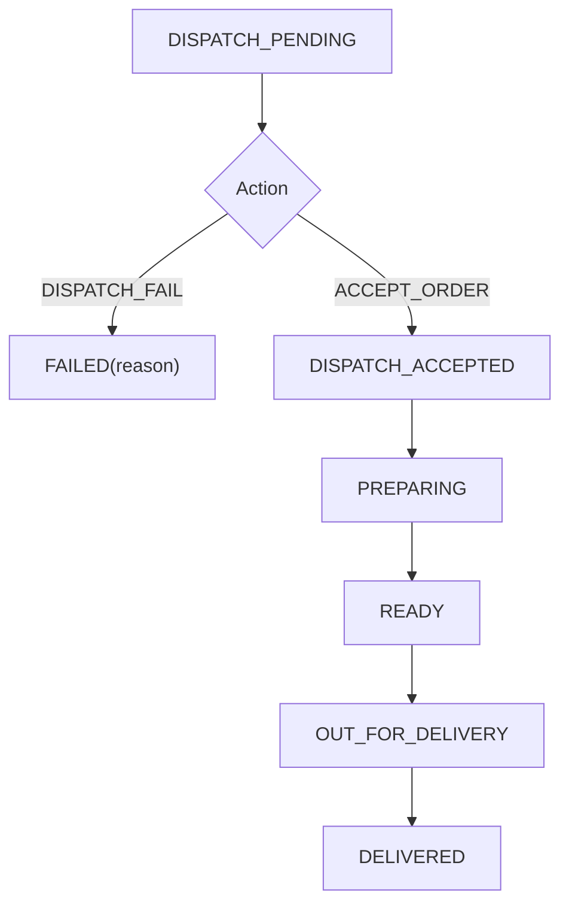

**Diagram sources**
- [dispatchStateMachine.js:49-80](file://server/src/domain/dispatch/dispatchStateMachine.js#L49-L80)
- [dispatchStateMachine.js:121-124](file://server/src/domain/dispatch/dispatchStateMachine.js#L121-L124)
- [order.repository.js:238-242](file://server/src/domain/orders/order.repository.js#L238-L242)

**Section sources**
- [dispatchStateMachine.js:49-124](file://server/src/domain/dispatch/dispatchStateMachine.js#L49-L124)
- [order.repository.js:238-242](file://server/src/domain/orders/order.repository.js#L238-L242)

## Dependency Analysis
- Dispatch worker depends on:
  - Queue manager for job processing
  - Dispatch provider for external orchestration
  - Order repository for status persistence
  - Dispatch state machine for lifecycle management
  - Dashboard websocket for real-time updates
- Notifications depend on:
  - Payment service for links
  - WhatsApp service for rich receipts
  - Queue manager for idempotent delivery
- Geocoding integrates with external mapping APIs and local fallbacks

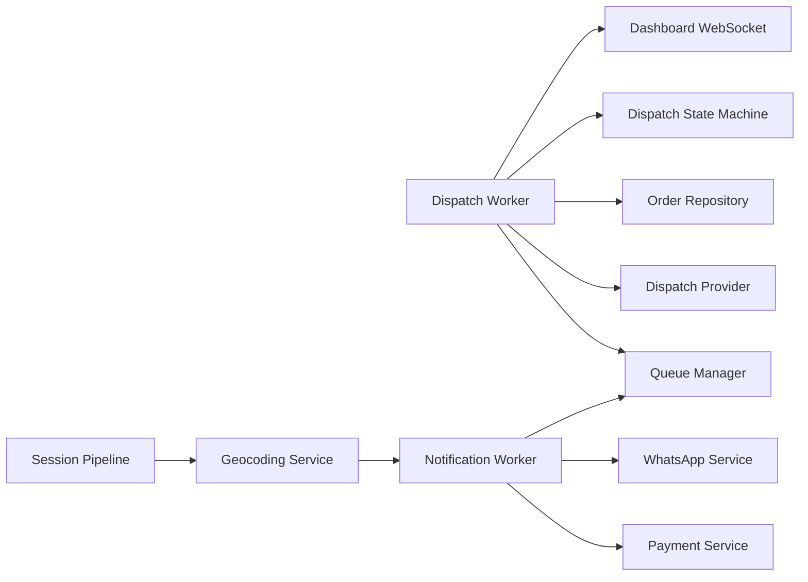

**Diagram sources**
- [dispatch.worker.js:1-52](file://server/src/workers/dispatch.worker.js#L1-L52)
- [queueManager.js:1-122](file://server/src/queue/queueManager.js#L1-L122)
- [DispatchProvider.js:11-93](file://server/src/integrations/dispatch/DispatchProvider.js#L11-L93)
- [order.repository.js:220-287](file://server/src/domain/orders/order.repository.js#L220-L287)
- [dispatchStateMachine.js:9-147](file://server/src/domain/dispatch/dispatchStateMachine.js#L9-L147)
- [dashboardWsHandler.js:43-68](file://server/src/websocket/dashboardWsHandler.js#L43-L68)
- [notification.worker.js:10-71](file://server/src/workers/notification.worker.js#L10-L71)
- [paymentService.js:25-114](file://server/src/services/paymentService.js#L25-L114)
- [whatsappService.js:24-114](file://server/src/services/whatsappService.js#L24-L114)
- [geocodingService.js:21-161](file://server/src/services/geocodingService.js#L21-L161)

**Section sources**
- [dispatch.worker.js:1-52](file://server/src/workers/dispatch.worker.js#L1-L52)
- [queueManager.js:1-122](file://server/src/queue/queueManager.js#L1-L122)
- [DispatchProvider.js:11-93](file://server/src/integrations/dispatch/DispatchProvider.js#L11-L93)
- [order.repository.js:220-287](file://server/src/domain/orders/order.repository.js#L220-L287)
- [dispatchStateMachine.js:9-147](file://server/src/domain/dispatch/dispatchStateMachine.js#L9-L147)
- [dashboardWsHandler.js:43-68](file://server/src/websocket/dashboardWsHandler.js#L43-L68)
- [notification.worker.js:10-71](file://server/src/workers/notification.worker.js#L10-L71)
- [paymentService.js:25-114](file://server/src/services/paymentService.js#L25-L114)
- [whatsappService.js:24-114](file://server/src/services/whatsappService.js#L24-L114)
- [geocodingService.js:21-161](file://server/src/services/geocodingService.js#L21-L161)

## Performance Considerations
- Use queues with bounded concurrency to avoid overload during peak order times
- Leverage idempotency keys to safely retry failed jobs without duplication
- Prefer asynchronous processing for dispatch and notifications to keep request paths responsive
- Cache provider responses where applicable and implement timeouts for external calls
- Monitor queue backlogs and adjust concurrency/retry settings accordingly

[No sources needed since this section provides general guidance]

## Troubleshooting Guide
- Illegal state transitions:
  - Ensure actions match current state; check state machine definitions before invoking transitions
- Dispatch failures:
  - Inspect provider logs; verify environment configuration for ONDC gateway or POS endpoints
  - Confirm tenant and restaurant context are present in dispatch jobs
- Notification issues:
  - Validate phone numbers and provider credentials
  - Check idempotency key collisions that might skip duplicate jobs
- Real-time updates not appearing:
  - Verify WebSocket connections are authenticated and scoped correctly
  - Confirm broadcast messages include tenant and restaurant identifiers

**Section sources**
- [dispatchStateMachine.js:49-80](file://server/src/domain/dispatch/dispatchStateMachine.js#L49-L80)
- [DispatchProvider.js:24-85](file://server/src/integrations/dispatch/DispatchProvider.js#L24-L85)
- [queueManager.js:15-75](file://server/src/queue/queueManager.js#L15-L75)
- [dashboardWsHandler.js:10-68](file://server/src/websocket/dashboardWsHandler.js#L10-L68)

## Conclusion
The dispatch workflow combines robust state machines, pluggable integrations, durable queues, and real-time updates to coordinate order fulfillment and delivery. It supports flexible provider strategies, resilient operations with idempotency, and clear visibility through dashboards and customer notifications. Extensibility points allow adding new dispatch providers, routing algorithms, and enhanced tracking capabilities while maintaining strong consistency and auditability.