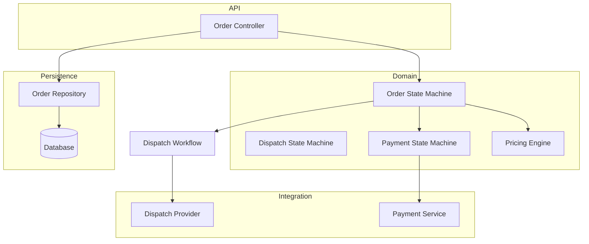
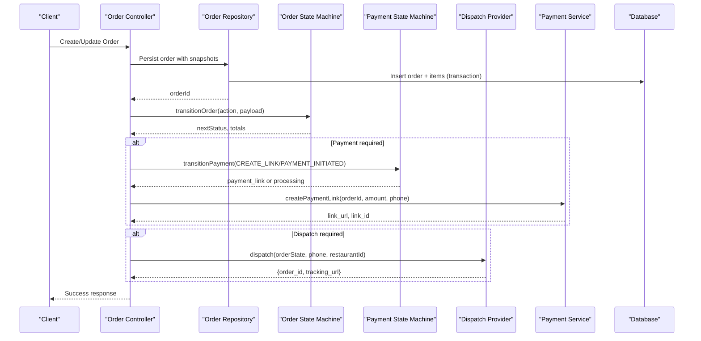
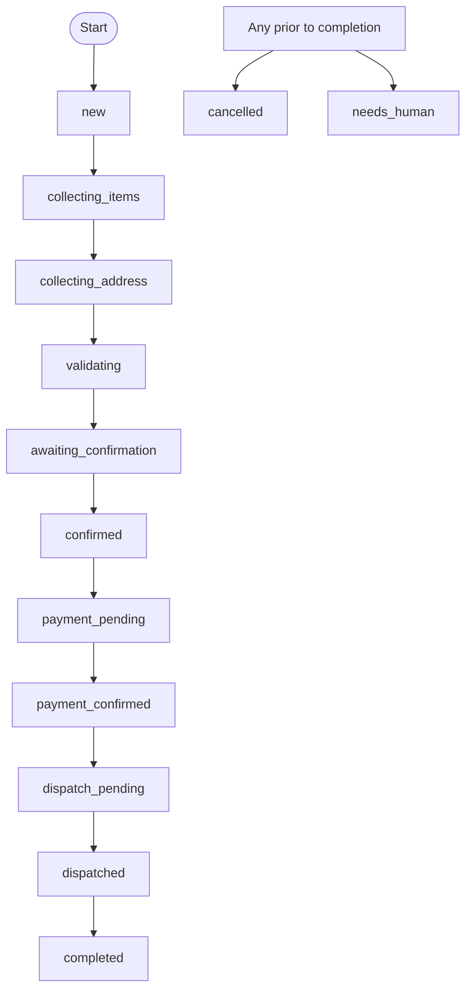
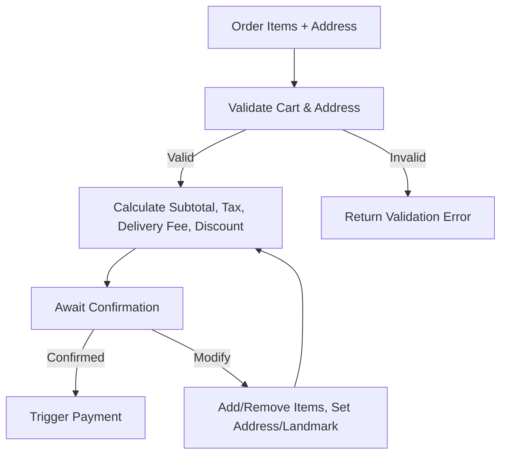
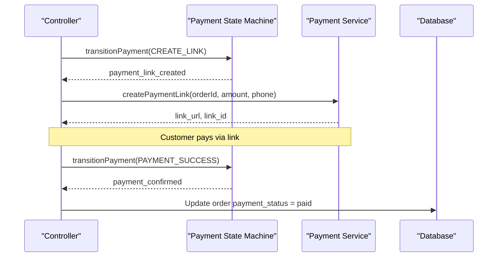
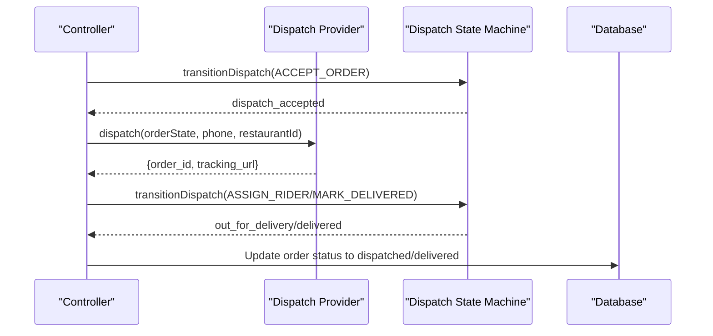
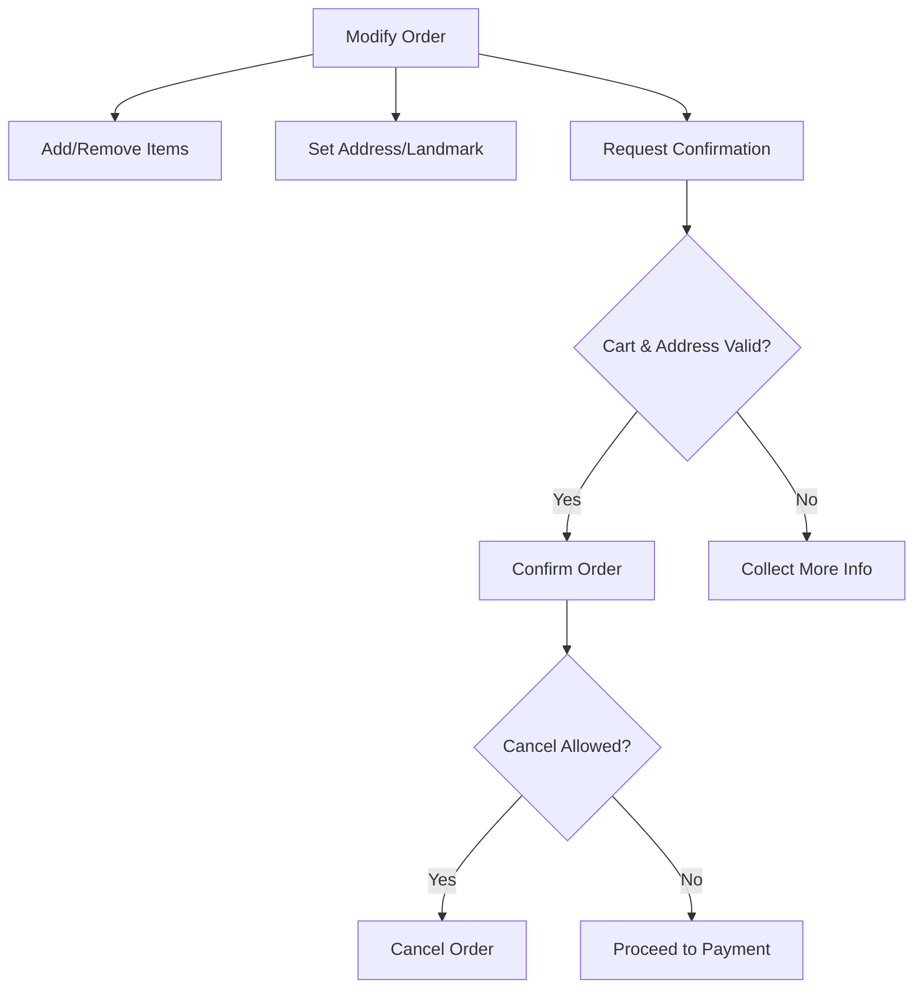
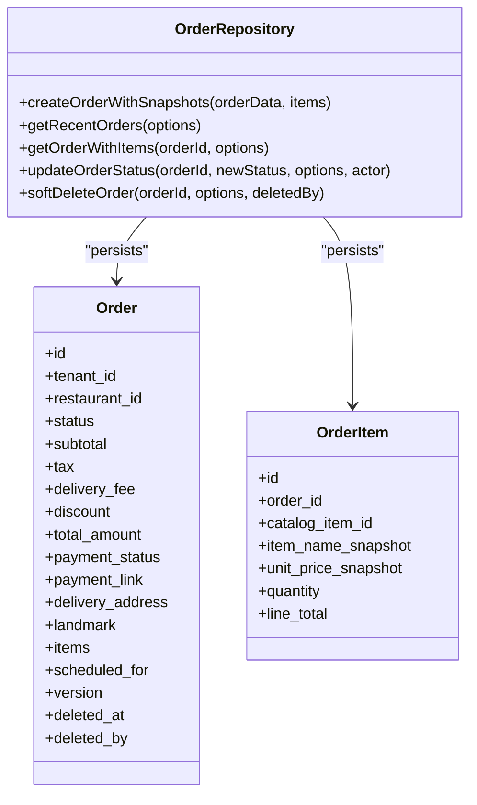
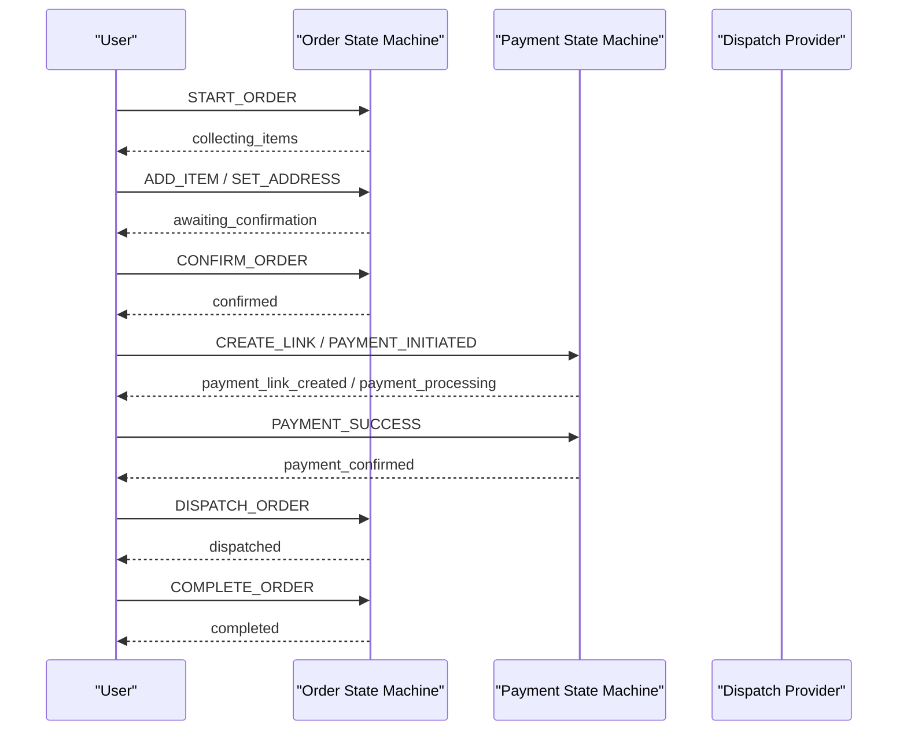
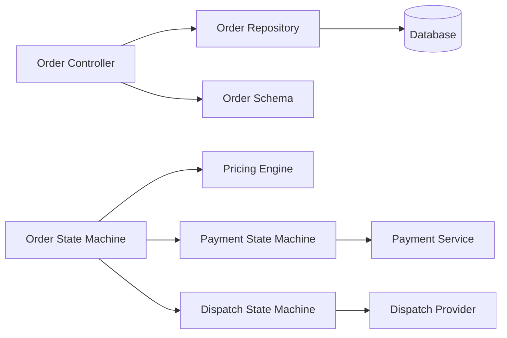

# Order Management System

<cite>
**Referenced Files in This Document**
- [orderStateMachine.js](file://server/src/domain/orders/orderStateMachine.js)
- [pricingEngine.js](file://server/src/domain/orders/pricingEngine.js)
- [order.repository.js](file://server/src/domain/orders/order.repository.js)
- [order.controller.js](file://server/src/controllers/order.controller.js)
- [paymentStateMachine.js](file://server/src/domain/payments/paymentStateMachine.js)
- [dispatchStateMachine.js](file://server/src/domain/dispatch/dispatchStateMachine.js)
- [DispatchProvider.js](file://server/src/integrations/dispatch/DispatchProvider.js)
- [paymentService.js](file://server/src/services/paymentService.js)
- [order.schema.js](file://server/src/schemas/order.schema.js)
- [001_initial_multitenant_schema.sql](file://server/src/db/migrations/001_initial_multitenant_schema.sql)
</cite>

## Table of Contents
1. [Introduction](#introduction)
2. [Project Structure](#project-structure)
3. [Core Components](#core-components)
4. [Architecture Overview](#architecture-overview)
5. [Detailed Component Analysis](#detailed-component-analysis)
6. [Dependency Analysis](#dependency-analysis)
7. [Performance Considerations](#performance-considerations)
8. [Troubleshooting Guide](#troubleshooting-guide)
9. [Conclusion](#conclusion)
10. [Appendices](#appendices)

## Introduction
This document explains the Order Management System in Inkiro with a focus on the complete order lifecycle managed by state machines, business rules for validation and pricing, inventory considerations, payment processing integration, dispatch workflow, order modifications, cancellation handling, refund processing, data models, repository patterns, and transaction management. It provides clear diagrams and references to specific source files so both technical and non-technical readers can understand how orders flow from creation to fulfillment.

## Project Structure
The order system is implemented across domain modules (state machines), services (payments, notifications), integrations (dispatch providers), controllers (API endpoints), schemas (input validation), and repositories (persistence). The database schema defines multi-tenant tables for tenants, restaurants, catalog items, customers, orders, and order item snapshots.

**Diagram sources**
- [orderStateMachine.js:8-41](file://server/src/domain/orders/orderStateMachine.js#L8-L41)
- [dispatchStateMachine.js:9-28](file://server/src/domain/dispatch/dispatchStateMachine.js#L9-L28)
- [paymentStateMachine.js:9-28](file://server/src/domain/payments/paymentStateMachine.js#L9-L28)
- [pricingEngine.js:76-114](file://server/src/domain/orders/pricingEngine.js#L76-L114)
- [DispatchProvider.js:11-85](file://server/src/integrations/dispatch/DispatchProvider.js#L11-L85)
- [paymentService.js:25-61](file://server/src/services/paymentService.js#L25-L61)
- [order.controller.js:22-63](file://server/src/controllers/order.controller.js#L22-L63)
- [order.repository.js:24-143](file://server/src/domain/orders/order.repository.js#L24-L143)

**Section sources**
- [orderStateMachine.js:8-41](file://server/src/domain/orders/orderStateMachine.js#L8-L41)
- [order.repository.js:24-143](file://server/src/domain/orders/order.repository.js#L24-L143)
- [001_initial_multitenant_schema.sql:173-210](file://server/src/db/migrations/001_initial_multitenant_schema.sql#L173-L210)

## Core Components
- Order State Machine: Defines 12 states and actions governing the full order lifecycle from creation to completion or cancellation. It enforces legal transitions and updates totals and history.
- Pricing Engine: Calculates authoritative subtotal, tax (GST), delivery fee, discount, and total using integer arithmetic to avoid floating-point drift. It also matches catalog items by name.
- Payment State Machine: Separates payment lifecycle from order lifecycle, supporting online payments, COD, link creation, success/failure/expiry, and refunds.
- Dispatch State Machine: Manages kitchen and rider workflows independently from order status, including acceptance, preparation, readiness, assignment, delivery, failure, and cancellation.
- Dispatch Provider: Pluggable adapters for ONDC Beckn and direct POS systems with fallback behavior.
- Payment Service: Creates payment links via Razorpay and sends SMS notifications via Twilio, with mock fallbacks for development.
- Order Repository: Persists orders and line-item snapshots within transactions, validates state transitions, records audit logs, and emits outbox events.
- Order Controller: Exposes authenticated endpoints to list orders, fetch details, update status, and manage disputes.
- Schemas: Zod-based input validation for order status updates and dispute flows.
- Database Schema: Multi-tenant tables for tenants, restaurants, catalog items, customers, orders, and order items; supports soft deletes and versioning.

**Section sources**
- [orderStateMachine.js:8-41](file://server/src/domain/orders/orderStateMachine.js#L8-L41)
- [pricingEngine.js:76-114](file://server/src/domain/orders/pricingEngine.js#L76-L114)
- [paymentStateMachine.js:9-28](file://server/src/domain/payments/paymentStateMachine.js#L9-L28)
- [dispatchStateMachine.js:9-28](file://server/src/domain/dispatch/dispatchStateMachine.js#L9-L28)
- [DispatchProvider.js:11-85](file://server/src/integrations/dispatch/DispatchProvider.js#L11-L85)
- [paymentService.js:25-61](file://server/src/services/paymentService.js#L25-L61)
- [order.repository.js:24-143](file://server/src/domain/orders/order.repository.js#L24-L143)
- [order.controller.js:22-63](file://server/src/controllers/order.controller.js#L22-L63)
- [order.schema.js:3-21](file://server/src/schemas/order.schema.js#L3-L21)
- [001_initial_multitenant_schema.sql:173-210](file://server/src/db/migrations/001_initial_multitenant_schema.sql#L173-L210)

## Architecture Overview
The system separates concerns into three primary state machines:
- Order State Machine: Orchestrates the customer-facing lifecycle and ensures business rules are enforced before moving to payment and dispatch.
- Payment State Machine: Tracks payment lifecycle independently, ensuring that payment confirmation is explicit and reconciled.
- Dispatch State Machine: Tracks operational fulfillment steps (kitchen and rider) independent of order status.

External integrations include:
- Payment Service: Generates payment links and sends SMS notifications.
- Dispatch Provider: Sends orders to ONDC or direct POS systems with fallback logic.

Data persistence uses a repository pattern with transactions, optimistic concurrency control, audit logging, and outbox events for eventual consistency.

**Diagram sources**
- [order.controller.js:22-63](file://server/src/controllers/order.controller.js#L22-L63)
- [order.repository.js:24-143](file://server/src/domain/orders/order.repository.js#L24-L143)
- [orderStateMachine.js:154-325](file://server/src/domain/orders/orderStateMachine.js#L154-L325)
- [paymentStateMachine.js:86-149](file://server/src/domain/payments/paymentStateMachine.js#L86-L149)
- [DispatchProvider.js:24-85](file://server/src/integrations/dispatch/DispatchProvider.js#L24-L85)
- [paymentService.js:25-61](file://server/src/services/paymentService.js#L25-L61)

## Detailed Component Analysis

### Order Lifecycle and State Machine
The order state machine defines 12 states covering the entire lifecycle:
- new
- collecting_items
- collecting_address
- validating
- awaiting_confirmation
- confirmed
- payment_pending
- payment_confirmed
- dispatch_pending
- dispatched
- completed
- cancelled
- needs_human

Actions drive transitions such as starting an order, adding/removing items, setting address/landmark, requesting confirmation, confirming, triggering payment, completing, canceling, requesting human intervention, and managing disputes. Totals are recalculated after each transition, including subtotal, GST tax, delivery fee, and total. History entries record timestamps, actions, and payloads.

**Diagram sources**
- [orderStateMachine.js:8-22](file://server/src/domain/orders/orderStateMachine.js#L8-L22)
- [orderStateMachine.js:73-147](file://server/src/domain/orders/orderStateMachine.js#L73-L147)
- [orderStateMachine.js:154-325](file://server/src/domain/orders/orderStateMachine.js#L154-L325)

**Section sources**
- [orderStateMachine.js:8-41](file://server/src/domain/orders/orderStateMachine.js#L8-L41)
- [orderStateMachine.js:73-147](file://server/src/domain/orders/orderStateMachine.js#L73-L147)
- [orderStateMachine.js:154-325](file://server/src/domain/orders/orderStateMachine.js#L154-L325)

### Business Rules: Validation, Pricing, and Inventory
- Validation:
  - Cannot request confirmation with an empty cart.
  - Cannot confirm without items and delivery address.
  - Global cancellation allowed except when already completed or cancelled.
  - Human assistance can be requested at any time prior to completion.
- Pricing:
  - Subtotal computed from item price × quantity.
  - GST tax at 5% applied to subtotal.
  - Delivery fee applied when there is a delivery address and items exist.
  - Discount supported; totals calculated in integer paise to avoid precision issues.
- Inventory:
  - Catalog items are fetched from the repository with caching; matching supports exact, starts-with, and contains strategies.
  - Line-item snapshots store unit prices and names at order time to preserve historical accuracy.

**Diagram sources**
- [orderStateMachine.js:173-261](file://server/src/domain/orders/orderStateMachine.js#L173-L261)
- [pricingEngine.js:76-114](file://server/src/domain/orders/pricingEngine.js#L76-L114)
- [pricingEngine.js:50-71](file://server/src/domain/orders/pricingEngine.js#L50-L71)

**Section sources**
- [orderStateMachine.js:173-261](file://server/src/domain/orders/orderStateMachine.js#L173-L261)
- [pricingEngine.js:76-114](file://server/src/domain/orders/pricingEngine.js#L76-L114)
- [pricingEngine.js:50-71](file://server/src/domain/orders/pricingEngine.js#L50-L71)

### Payment Processing Integration and Reconciliation
- Payment State Machine:
  - Supports COD and online payments.
  - Transitions include creating payment links, initiating payment, confirming success, failing, expiring, and refunding.
- Payment Service:
  - Creates payment links via Razorpay with callback URLs and SMS notifications.
  - Falls back to mock implementations when credentials are not configured.
- Reconciliation:
  - Payment state tracks provider IDs and links; successful transitions set payment_status to paid and move order to payment_confirmed.

**Diagram sources**
- [paymentStateMachine.js:86-149](file://server/src/domain/payments/paymentStateMachine.js#L86-L149)
- [paymentService.js:25-61](file://server/src/services/paymentService.js#L25-L61)

**Section sources**
- [paymentStateMachine.js:9-28](file://server/src/domain/payments/paymentStateMachine.js#L9-L28)
- [paymentStateMachine.js:86-149](file://server/src/domain/payments/paymentStateMachine.js#L86-L149)
- [paymentService.js:25-61](file://server/src/services/paymentService.js#L25-L61)

### Dispatch Workflow Integration for Delivery Coordination
- Dispatch State Machine:
  - Tracks acceptance, preparation, readiness, rider assignment, delivery, failure, and cancellation.
  - Separate from order status to avoid overloading order.status with operational states.
- Dispatch Provider:
  - ONDC adapter performs search, select, init, and confirm flows; falls back to direct POS if ONDC fails.
  - Direct POS adapter generates internal order IDs and returns estimated times and tracking URLs.

**Diagram sources**
- [dispatchStateMachine.js:82-146](file://server/src/domain/dispatch/dispatchStateMachine.js#L82-L146)
- [DispatchProvider.js:24-85](file://server/src/integrations/dispatch/DispatchProvider.js#L24-L85)

**Section sources**
- [dispatchStateMachine.js:9-28](file://server/src/domain/dispatch/dispatchStateMachine.js#L9-L28)
- [dispatchStateMachine.js:82-146](file://server/src/domain/dispatch/dispatchStateMachine.js#L82-L146)
- [DispatchProvider.js:24-85](file://server/src/integrations/dispatch/DispatchProvider.js#L24-L85)

### Order Modification Patterns, Cancellation Handling, and Refund Processing
- Modifications:
  - Add/remove items, clear cart, set address/landmark, request confirmation, and confirm order.
  - Automatic re-evaluation of totals and readiness for confirmation based on cart and address presence.
- Cancellation:
  - Allowed from most states prior to completion; resets items and totals; sets status to cancelled.
- Refunds:
  - Dispute flagging and resolution supported in order state machine and controller.
  - Payment state machine supports refund processing once payment is confirmed.

**Diagram sources**
- [orderStateMachine.js:173-268](file://server/src/domain/orders/orderStateMachine.js#L173-L268)
- [order.controller.js:65-135](file://server/src/controllers/order.controller.js#L65-L135)
- [paymentStateMachine.js:86-149](file://server/src/domain/payments/paymentStateMachine.js#L86-L149)

**Section sources**
- [orderStateMachine.js:173-268](file://server/src/domain/orders/orderStateMachine.js#L173-L268)
- [order.controller.js:65-135](file://server/src/controllers/order.controller.js#L65-L135)
- [paymentStateMachine.js:86-149](file://server/src/domain/payments/paymentStateMachine.js#L86-L149)

### Data Models, Repository Patterns, and Transaction Management
- Data Models:
  - Orders table includes tenant/restaurant scoping, call/customer references, financial fields, payment status/link, delivery info, items JSON, scheduling, versioning, and soft delete fields.
  - Order items table stores snapshots of catalog items with unit prices and line totals.
- Repository Pattern:
  - Functions encapsulate persistence logic: create with snapshots, get recent orders, get order with items, update status with state validation, and soft delete.
- Transactions:
  - All write operations wrapped in transactions to ensure atomicity.
  - Audit logs recorded within transactions for immutable history.
  - Outbox events enqueued for eventual consistency.
- Optimistic Concurrency:
  - Version field incremented on updates; expectedVersion parameter prevents stale writes and raises conflict errors.

**Diagram sources**
- [order.repository.js:24-143](file://server/src/domain/orders/order.repository.js#L24-L143)
- [order.repository.js:145-186](file://server/src/domain/orders/order.repository.js#L145-L186)
- [order.repository.js:188-218](file://server/src/domain/orders/order.repository.js#L188-L218)
- [order.repository.js:220-287](file://server/src/domain/orders/order.repository.js#L220-L287)
- [order.repository.js:289-322](file://server/src/domain/orders/order.repository.js#L289-L322)
- [001_initial_multitenant_schema.sql:173-210](file://server/src/db/migrations/001_initial_multitenant_schema.sql#L173-L210)

**Section sources**
- [order.repository.js:24-143](file://server/src/domain/orders/order.repository.js#L24-L143)
- [order.repository.js:220-287](file://server/src/domain/orders/order.repository.js#L220-L287)
- [001_initial_multitenant_schema.sql:173-210](file://server/src/db/migrations/001_initial_multitenant_schema.sql#L173-L210)

### Examples of Order State Transitions and External Integrations
- Example transitions:
  - Start order → collect items → set address → request confirmation → confirm → trigger payment → payment success → dispatch → complete.
  - Cancel order at any point prior to completion.
  - Request human assistance when needed.
- External integrations:
  - Payment service creates Razorpay links and sends SMS via Twilio.
  - Dispatch provider integrates with ONDC or direct POS systems.

**Diagram sources**
- [orderStateMachine.js:154-325](file://server/src/domain/orders/orderStateMachine.js#L154-L325)
- [paymentStateMachine.js:86-149](file://server/src/domain/payments/paymentStateMachine.js#L86-L149)
- [DispatchProvider.js:24-85](file://server/src/integrations/dispatch/DispatchProvider.js#L24-L85)

**Section sources**
- [orderStateMachine.js:154-325](file://server/src/domain/orders/orderStateMachine.js#L154-L325)
- [paymentStateMachine.js:86-149](file://server/src/domain/payments/paymentStateMachine.js#L86-L149)
- [DispatchProvider.js:24-85](file://server/src/integrations/dispatch/DispatchProvider.js#L24-L85)

## Dependency Analysis
- Coupling:
  - Order controller depends on repository and schemas for input validation.
  - Order state machine depends on pricing engine for totals and on payment/dispatch state machines for side effects.
  - Dispatch provider depends on ONDC service and direct POS implementation.
  - Payment service depends on environment configuration for external APIs.
- Cohesion:
  - Each state machine encapsulates its own transitions and history, improving cohesion.
  - Repository abstracts persistence details and enforces business rules at the data layer.
- External Dependencies:
  - Razorpay for payment links.
  - Twilio for SMS notifications.
  - ONDC for marketplace integration.

**Diagram sources**
- [order.controller.js:22-63](file://server/src/controllers/order.controller.js#L22-L63)
- [order.schema.js:3-21](file://server/src/schemas/order.schema.js#L3-L21)
- [orderStateMachine.js:154-325](file://server/src/domain/orders/orderStateMachine.js#L154-L325)
- [pricingEngine.js:76-114](file://server/src/domain/orders/pricingEngine.js#L76-L114)
- [paymentStateMachine.js:86-149](file://server/src/domain/payments/paymentStateMachine.js#L86-L149)
- [dispatchStateMachine.js:82-146](file://server/src/domain/dispatch/dispatchStateMachine.js#L82-L146)
- [DispatchProvider.js:24-85](file://server/src/integrations/dispatch/DispatchProvider.js#L24-L85)
- [paymentService.js:25-61](file://server/src/services/paymentService.js#L25-L61)
- [order.repository.js:24-143](file://server/src/domain/orders/order.repository.js#L24-L143)

**Section sources**
- [order.controller.js:22-63](file://server/src/controllers/order.controller.js#L22-L63)
- [order.schema.js:3-21](file://server/src/schemas/order.schema.js#L3-L21)
- [orderStateMachine.js:154-325](file://server/src/domain/orders/orderStateMachine.js#L154-L325)
- [pricingEngine.js:76-114](file://server/src/domain/orders/pricingEngine.js#L76-L114)
- [paymentStateMachine.js:86-149](file://server/src/domain/payments/paymentStateMachine.js#L86-L149)
- [dispatchStateMachine.js:82-146](file://server/src/domain/dispatch/dispatchStateMachine.js#L82-L146)
- [DispatchProvider.js:24-85](file://server/src/integrations/dispatch/DispatchProvider.js#L24-L85)
- [paymentService.js:25-61](file://server/src/services/paymentService.js#L25-L61)
- [order.repository.js:24-143](file://server/src/domain/orders/order.repository.js#L24-L143)

## Performance Considerations
- Pricing calculations use integer arithmetic to avoid floating-point precision issues and reduce rounding errors.
- Catalog fetching includes short-term caching to reduce database load during high-frequency requests.
- Repository functions batch queries and map results efficiently to minimize round trips.
- Transactions ensure atomicity and reduce inconsistent states under concurrent access.
- Optimistic concurrency prevents lost updates and reduces contention by failing fast on conflicts.

[No sources needed since this section provides general guidance]

## Troubleshooting Guide
- Illegal state transitions:
  - Ensure actions are valid for the current order/payment/dispatch state.
  - Check error messages indicating illegal transitions and adjust workflow accordingly.
- Validation failures:
  - Confirm cart has items and delivery address before requesting confirmation.
  - Validate input schemas for status updates and dispute flows.
- Payment issues:
  - Verify environment credentials for Razorpay and Twilio; fall back to mocks in development.
  - Track payment state transitions to identify where failures occur.
- Dispatch failures:
  - Inspect ONDC adapter responses and fallback to direct POS if necessary.
  - Monitor dispatch state transitions for acceptance, preparation, and delivery steps.
- Concurrency conflicts:
  - Use expectedVersion to detect stale updates and refresh UI/data before retrying.

**Section sources**
- [orderStateMachine.js:154-163](file://server/src/domain/orders/orderStateMachine.js#L154-L163)
- [order.schema.js:3-21](file://server/src/schemas/order.schema.js#L3-L21)
- [paymentService.js:25-61](file://server/src/services/paymentService.js#L25-L61)
- [DispatchProvider.js:24-85](file://server/src/integrations/dispatch/DispatchProvider.js#L24-L85)
- [order.repository.js:220-287](file://server/src/domain/orders/order.repository.js#L220-L287)

## Conclusion
The Order Management System in Inkiro implements a robust, multi-state architecture separating order, payment, and dispatch lifecycles. It enforces strict business rules through state machines, calculates authoritative pricing, persists data with transactions and optimistic concurrency, and integrates with external payment and dispatch services. This design ensures reliability, traceability, and scalability for food order fulfillment.

[No sources needed since this section summarizes without analyzing specific files]

## Appendices
- API Endpoints:
  - List orders: GET /api/orders
  - Get order by ID: GET /api/orders/:id
  - Update order status: PATCH /api/orders/:id
  - Flag dispute: POST /api/orders/:id/dispute
  - Resolve dispute: PUT /api/orders/:id/dispute
- Environment Variables:
  - Payment: RAZORPAY_KEY_ID, RAZORPAY_KEY_SECRET
  - SMS: TWILIO_ACCOUNT_SID, TWILIO_AUTH_TOKEN, TWILIO_PHONE_NUMBER
  - Dispatch Mode: DISPATCH_MODE (ondc or direct)

[No sources needed since this section lists configuration and endpoints without analyzing specific files]