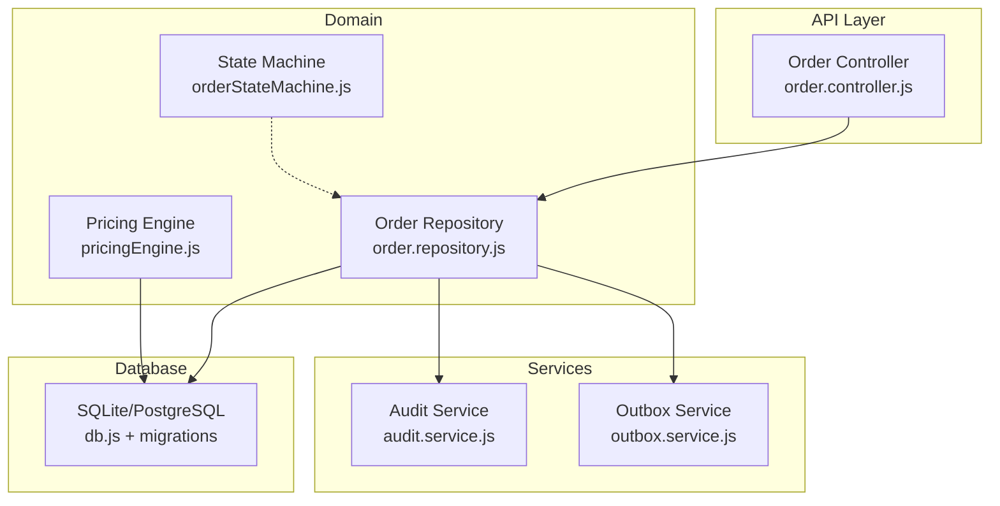
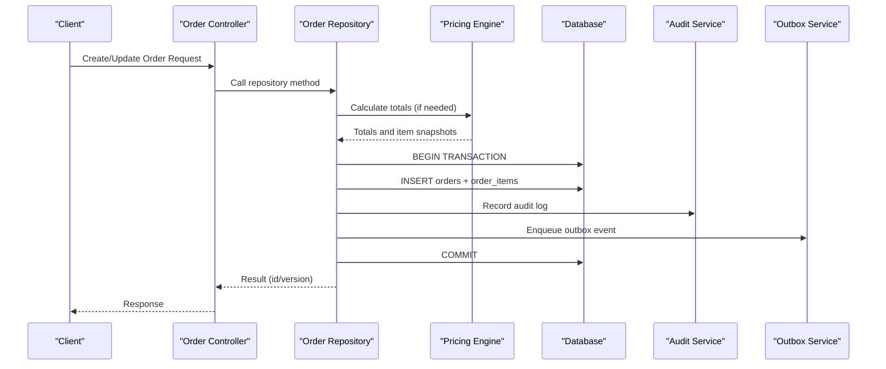
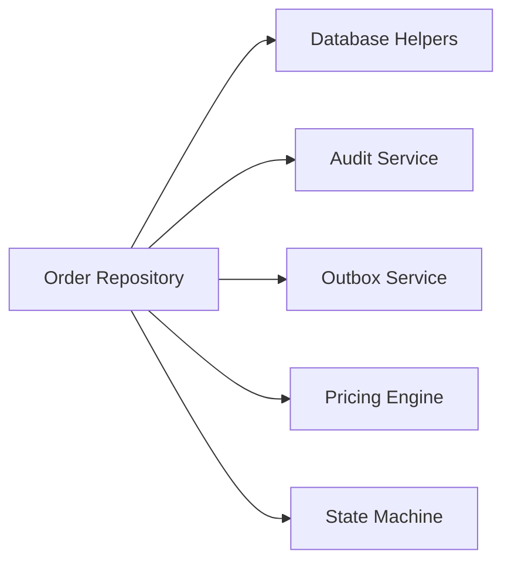

# Order Repository & Data Persistence

<cite>
**Referenced Files in This Document**
- [order.repository.js](file://server/src/domain/orders/order.repository.js)
- [pricingEngine.js](file://server/src/domain/orders/pricingEngine.js)
- [orderStateMachine.js](file://server/src/domain/orders/orderStateMachine.js)
- [order.controller.js](file://server/src/controllers/order.controller.js)
- [order.schema.js](file://server/src/schemas/order.schema.js)
- [001_initial_multitenant_schema.sql](file://server/src/db/migrations/001_initial_multitenant_schema.sql)
- [002_audit_logs_and_metrics.sql](file://server/src/db/migrations/002_audit_logs_and_metrics.sql)
- [audit.service.js](file://server/src/services/audit.service.js)
- [outbox.service.js](file://server/src/services/outbox.service.js)
- [db.js](file://server/src/db.js)
- [migrationRunner.js](file://server/src/db/migrations/migrationRunner.js)
</cite>

## Table of Contents
1. [Introduction](#introduction)
2. [Project Structure](#project-structure)
3. [Core Components](#core-components)
4. [Architecture Overview](#architecture-overview)
5. [Detailed Component Analysis](#detailed-component-analysis)
6. [Dependency Analysis](#dependency-analysis)
7. [Performance Considerations](#performance-considerations)
8. [Troubleshooting Guide](#troubleshooting-guide)
9. [Conclusion](#conclusion)
10. [Appendices](#appendices)

## Introduction
This document describes the Order Repository layer responsible for data persistence operations related to orders, order items, and associated audit and outbox events. It covers the database schema for orders, CRUD operations, query patterns, transaction management, validation rules, indexing strategies, performance optimizations, and relationships with customers, catalog items, and payments. It also provides examples of order creation, updates, queries by criteria, and bulk operations.

## Project Structure
The order persistence logic is implemented under the domain layer with supporting services for auditing and eventing, and a controller that exposes HTTP endpoints. The database schema is defined via migrations and enhanced with indexes during migration execution.

**Diagram sources**
- [order.repository.js:1-322](file://server/src/domain/orders/order.repository.js#L1-L322)
- [pricingEngine.js:1-117](file://server/src/domain/orders/pricingEngine.js#L1-L117)
- [orderStateMachine.js:1-325](file://server/src/domain/orders/orderStateMachine.js#L1-L325)
- [order.controller.js:1-136](file://server/src/controllers/order.controller.js#L1-L136)
- [audit.service.js:1-142](file://server/src/services/audit.service.js#L1-L142)
- [outbox.service.js:1-141](file://server/src/services/outbox.service.js#L1-L141)
- [db.js:1-226](file://server/src/db.js#L1-L226)

**Section sources**
- [order.repository.js:1-322](file://server/src/domain/orders/order.repository.js#L1-L322)
- [order.controller.js:1-136](file://server/src/controllers/order.controller.js#L1-L136)
- [db.js:1-226](file://server/src/db.js#L1-L226)
- [001_initial_multitenant_schema.sql:173-210](file://server/src/db/migrations/001_initial_multitenant_schema.sql#L173-L210)

## Core Components
- Order Repository: Implements authoritative persistence for orders and line-item snapshots with strict multi-tenant scoping, optimistic concurrency, state machine validation, audit logging, and outbox event emission.
- Pricing Engine: Computes authoritative pricing, taxes, delivery fees, discounts, and item snapshots from catalog data using integer arithmetic to avoid floating-point drift.
- State Machine: Defines valid order states and transitions; repository enforces status transition constraints at persistence time.
- Audit Service: Records immutable, cryptographically chained audit logs for compliance and traceability.
- Outbox Service: Ensures reliable asynchronous event delivery via a transactional outbox pattern with claim/retry semantics.
- Database Layer: Provides SQLite/PostgreSQL-compatible helpers, transactions, and slow-query profiling.

**Section sources**
- [order.repository.js:24-143](file://server/src/domain/orders/order.repository.js#L24-L143)
- [pricingEngine.js:76-114](file://server/src/domain/orders/pricingEngine.js#L76-L114)
- [orderStateMachine.js:8-41](file://server/src/domain/orders/orderStateMachine.js#L8-L41)
- [audit.service.js:19-77](file://server/src/services/audit.service.js#L19-L77)
- [outbox.service.js:8-30](file://server/src/services/outbox.service.js#L8-L30)
- [db.js:57-120](file://server/src/db.js#L57-L120)

## Architecture Overview
The order lifecycle flows through the controller into the repository, which persists orders and items within a transaction, records an audit log, and enqueues an outbox event. Pricing is computed deterministically using the pricing engine, and state transitions are validated against the state machine before being committed.

**Diagram sources**
- [order.controller.js:22-63](file://server/src/controllers/order.controller.js#L22-L63)
- [order.repository.js:24-143](file://server/src/domain/orders/order.repository.js#L24-L143)
- [pricingEngine.js:76-114](file://server/src/domain/orders/pricingEngine.js#L76-L114)
- [audit.service.js:19-77](file://server/src/services/audit.service.js#L19-L77)
- [outbox.service.js:8-30](file://server/src/services/outbox.service.js#L8-L30)
- [db.js:108-120](file://server/src/db.js#L108-L120)

## Detailed Component Analysis

### Database Schema for Orders
- Orders table includes tenant and restaurant scoping, call and customer references, ONDC integration id, status, monetary fields (subtotal, tax, delivery_fee, discount, total_amount), currency, payment status/link, delivery address and landmark, JSON items snapshot, scheduled_for timestamp, version for optimistic locking, soft delete fields, and timestamps.
- Order Items table stores per-line snapshots including catalog_item_id reference, name and price snapshots, quantity, and line_total.

Key fields and relationships:
- Status: persisted string representing current order state.
- Items: stored as JSON in orders for quick read; canonical line items persisted in order_items for accuracy and history.
- Pricing calculations: subtotal, tax, delivery_fee, discount, total_amount stored as REAL; computed in paise internally then converted back to rupees on write.
- Delivery information: delivery_address and landmark stored directly on orders.
- Audit history: recorded in audit_logs table with cryptographic chaining.

**Section sources**
- [001_initial_multitenant_schema.sql:173-210](file://server/src/db/migrations/001_initial_multitenant_schema.sql#L173-L210)
- [002_audit_logs_and_metrics.sql:7-22](file://server/src/db/migrations/002_audit_logs_and_metrics.sql#L7-L22)

### CRUD Operations
- Create order with snapshots: Inserts master order record and line-item snapshots within a transaction, records audit log, and enqueues an outbox event. Monetary values are rounded to integer paise before storage to avoid precision issues.
- Read recent orders: Retrieves orders scoped by tenant and restaurant with limit, joins items via a second query, and merges into response objects.
- Read single order with items: Fetches order and its items, mapping snapshots into a structured items array.
- Update order status: Validates state transition, applies optimistic concurrency via version check when provided, updates status and increments version, records audit log, and emits outbox event.
- Soft delete order: Marks deleted_at and updated_at, records audit log, and ensures tenant/restaurant scoping.

Examples:
- Create order: Use createOrderWithSnapshots with orderData and items array.
- Update status: Use updateOrderStatus with orderId, newStatus, options (including expectedVersion), and actor context.
- Query by criteria: Use getRecentOrders with tenantId, restaurantId, and limit; getOrderWithItems for specific order retrieval.

**Section sources**
- [order.repository.js:24-143](file://server/src/domain/orders/order.repository.js#L24-L143)
- [order.repository.js:145-186](file://server/src/domain/orders/order.repository.js#L145-L186)
- [order.repository.js:188-218](file://server/src/domain/orders/order.repository.js#L188-L218)
- [order.repository.js:220-287](file://server/src/domain/orders/order.repository.js#L220-L287)
- [order.repository.js:289-321](file://server/src/domain/orders/order.repository.js#L289-L321)

### Query Patterns
- Multi-tenant scoping: All queries filter by tenant_id and restaurant_id to ensure isolation.
- Efficient reads: Recent orders query uses LIMIT and fetches items in a batched IN clause to minimize round trips.
- Single-order retrieval: Direct lookup by id with tenant/restaurant filters, followed by items join.

Optimization notes:
- Avoid N+1 queries by batching item retrieval.
- Use explicit LIMIT to cap result sets.

**Section sources**
- [order.repository.js:145-186](file://server/src/domain/orders/order.repository.js#L145-L186)
- [order.repository.js:188-218](file://server/src/domain/orders/order.repository.js#L188-L218)

### Transaction Management
- All mutating operations wrap database calls in a transaction helper that begins IMMEDIATE, commits on success, and rolls back on error.
- Outbox events and audit logs are recorded within the same transaction to guarantee consistency with order mutations.

**Section sources**
- [db.js:108-120](file://server/src/db.js#L108-L120)
- [order.repository.js:58-143](file://server/src/domain/orders/order.repository.js#L58-L143)
- [order.repository.js:244-287](file://server/src/domain/orders/order.repository.js#L244-L287)
- [order.repository.js:297-321](file://server/src/domain/orders/order.repository.js#L297-L321)

### Data Validation Rules
- Status enum enforced by schema and state machine: pending, confirmed, preparing, ready, dispatched, delivered, cancelled.
- Monetary values: Stored as REAL but computed in paise to prevent IEEE 754 drift; rounding applied before insertion.
- Required context: tenant_id and restaurant_id must be present for all order operations; otherwise, errors are thrown.
- Quantity: Minimum of 1 enforced for line items.
- Versioning: Optional expectedVersion parameter enables optimistic concurrency control on status updates.

**Section sources**
- [order.schema.js:3-9](file://server/src/schemas/order.schema.js#L3-L9)
- [order.repository.js:24-57](file://server/src/domain/orders/order.repository.js#L24-L57)
- [order.repository.js:90-110](file://server/src/domain/orders/order.repository.js#L90-L110)
- [order.repository.js:220-257](file://server/src/domain/orders/order.repository.js#L220-L257)

### Indexing Strategies
Indexes are created during migration execution to optimize common query patterns:
- idx_orders_restaurant: Fast filtering by restaurant_id.
- idx_orders_status: Fast filtering by status.
- idx_order_items_order: Fast retrieval of items by order_id.
- Additional tenant-scoped indexes exist for other entities (e.g., calls, catalog).

These indexes support:
- Tenant/restaurant-scoped order listing.
- Status-based queries.
- Item lookups by order.

**Section sources**
- [migrationRunner.js:149-163](file://server/src/db/migrations/migrationRunner.js#L149-L163)

### Performance Optimizations
- Integer arithmetic in paise for monetary calculations avoids floating-point precision issues and reduces rounding errors.
- Batched item retrieval reduces database round trips.
- WAL mode enabled for SQLite to improve concurrency and durability.
- Slow query detection logs queries exceeding threshold to aid performance tuning.
- Outbox pattern decouples side effects from primary writes, improving responsiveness.

**Section sources**
- [pricingEngine.js:81-114](file://server/src/domain/orders/pricingEngine.js#L81-L114)
- [order.repository.js:161-186](file://server/src/domain/orders/order.repository.js#L161-L186)
- [db.js:29-31](file://server/src/db.js#L29-L31)
- [db.js:49-55](file://server/src/db.js#L49-L55)
- [outbox.service.js:54-93](file://server/src/services/outbox.service.js#L54-L93)

### Relationship with Other Entities
- Customers: Orders reference customer_id; customer profiles and addresses are managed separately but linked via foreign keys.
- Catalog Items: Order items store catalog_item_id and snapshots of name and price to preserve historical accuracy even if catalog changes.
- Payments: Orders include payment_status and payment_link; payment workflows can be integrated via outbox events or external services.
- Calls: Orders may link to call_id for voice-driven ordering sessions.

**Section sources**
- [001_initial_multitenant_schema.sql:100-113](file://server/src/db/migrations/001_initial_multitenant_schema.sql#L100-L113)
- [001_initial_multitenant_schema.sql:128-148](file://server/src/db/migrations/001_initial_multitenant_schema.sql#L128-L148)
- [001_initial_multitenant_schema.sql:173-210](file://server/src/db/migrations/001_initial_multitenant_schema.sql#L173-L210)

### Examples

#### Order Creation
- Inputs: orderData (tenant_id, restaurant_id, call_id, customer_id, ondc_order_id, status, subtotal, tax, delivery_fee, discount, total_amount, currency, payment_status, payment_link, delivery_address, landmark, scheduled_for) and items array.
- Process: Validate tenant/restaurant, compute totals in paise, insert order and items, record audit, enqueue outbox.
- Output: orderId.

**Section sources**
- [order.repository.js:24-143](file://server/src/domain/orders/order.repository.js#L24-L143)

#### Order Updates
- Status update: Provide orderId, newStatus, optional expectedVersion, and actor context. Validates state transition, updates version, records audit, emits outbox.
- Soft delete: Mark deleted_at and updated_at, record audit.

**Section sources**
- [order.repository.js:220-287](file://server/src/domain/orders/order.repository.js#L220-L287)
- [order.repository.js:289-321](file://server/src/domain/orders/order.repository.js#L289-L321)

#### Queries by Criteria
- Recent orders: Filter by tenantId, restaurantId, and limit; returns orders with merged items.
- Single order: Retrieve by id with tenant/restaurant scoping; returns order with items.

**Section sources**
- [order.repository.js:145-186](file://server/src/domain/orders/order.repository.js#L145-L186)
- [order.repository.js:188-218](file://server/src/domain/orders/order.repository.js#L188-L218)

#### Bulk Operations
- Batch item retrieval: Uses IN clause with placeholders to fetch multiple items efficiently.
- Outbox claiming: Workers atomically claim multiple pending events for processing.

**Section sources**
- [order.repository.js:161-186](file://server/src/domain/orders/order.repository.js#L161-L186)
- [outbox.service.js:54-93](file://server/src/services/outbox.service.js#L54-L93)

### State Machine Integration
- Valid transitions are enforced at persistence time to prevent illegal state changes.
- The state machine defines broader lifecycle actions; repository focuses on order status transitions aligned with business rules.

**Section sources**
- [order.repository.js:6-17](file://server/src/domain/orders/order.repository.js#L6-L17)
- [orderStateMachine.js:8-41](file://server/src/domain/orders/orderStateMachine.js#L8-L41)

## Dependency Analysis
The order repository depends on:
- Database helpers for queries and transactions.
- Audit service for immutable logging.
- Outbox service for reliable event emission.
- Pricing engine for deterministic calculations.
- State machine definitions for validation.

**Diagram sources**
- [order.repository.js:1-5](file://server/src/domain/orders/order.repository.js#L1-L5)
- [pricingEngine.js:1-10](file://server/src/domain/orders/pricingEngine.js#L1-L10)
- [audit.service.js:1-5](file://server/src/services/audit.service.js#L1-L5)
- [outbox.service.js:1-5](file://server/src/services/outbox.service.js#L1-L5)
- [orderStateMachine.js:1-7](file://server/src/domain/orders/orderStateMachine.js#L1-L7)

**Section sources**
- [order.repository.js:1-5](file://server/src/domain/orders/order.repository.js#L1-L5)

## Performance Considerations
- Use WAL mode for better concurrency and crash recovery.
- Leverage indexes on restaurant_id, status, and order_items.order_id for fast filtering and joins.
- Compute monetary values in paise to avoid precision loss and reduce rounding overhead.
- Batch item retrieval to minimize round trips.
- Monitor slow queries via built-in profiling and adjust queries/indexes accordingly.
- Employ outbox pattern to offload side effects and keep primary writes fast.

[No sources needed since this section provides general guidance]

## Troubleshooting Guide
Common issues and resolutions:
- Missing tenant/restaurant context: Ensure req.auth provides tenantId and restaurantId; repository throws explicit errors if absent.
- Illegal state transition: Verify current order status and allowed transitions; use state machine to validate before calling repository.
- Optimistic lock conflict: If expectedVersion is provided and differs, handle 409 conflicts by refreshing the order and retrying.
- Audit or outbox failures: Check logs and verify database connectivity; outbox retries with exponential backoff for failed events.
- Slow queries: Review slow query logs and consider adding or adjusting indexes based on query patterns.

**Section sources**
- [order.repository.js:24-30](file://server/src/domain/orders/order.repository.js#L24-L30)
- [order.repository.js:238-257](file://server/src/domain/orders/order.repository.js#L238-L257)
- [audit.service.js:73-77](file://server/src/services/audit.service.js#L73-L77)
- [outbox.service.js:119-140](file://server/src/services/outbox.service.js#L119-L140)
- [db.js:49-55](file://server/src/db.js#L49-L55)

## Conclusion
The Order Repository provides robust, secure, and performant persistence for orders with strong multi-tenant isolation, deterministic pricing, state machine enforcement, and reliable eventing. The schema supports comprehensive order tracking, while indexes and transactional patterns ensure scalability and consistency. Integrating with audit and outbox services enhances observability and reliability across the system.

[No sources needed since this section summarizes without analyzing specific files]

## Appendices

### API Endpoints for Orders
- GET /orders: Returns recent orders scoped by authenticated tenant/restaurant.
- GET /orders/:id: Returns a specific order with items.
- PATCH /orders/:id/status: Updates order status with optional optimistic versioning.
- POST /orders/:id/dispute: Flags an order dispute.
- POST /orders/:id/dispute/resolve: Resolves a dispute with action and notes.

**Section sources**
- [order.controller.js:22-63](file://server/src/controllers/order.controller.js#L22-L63)
- [order.controller.js:65-136](file://server/src/controllers/order.controller.js#L65-L136)