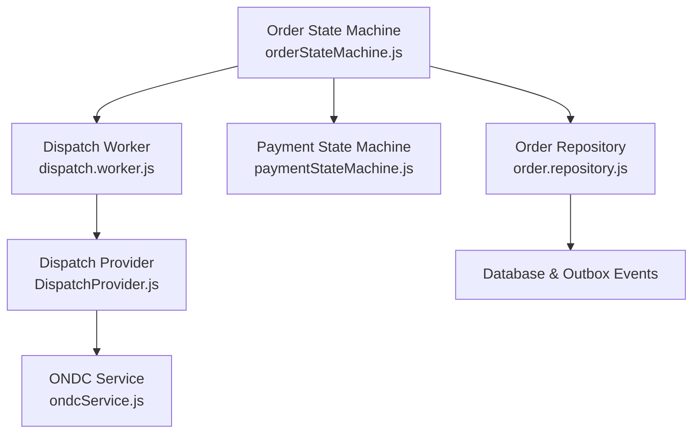
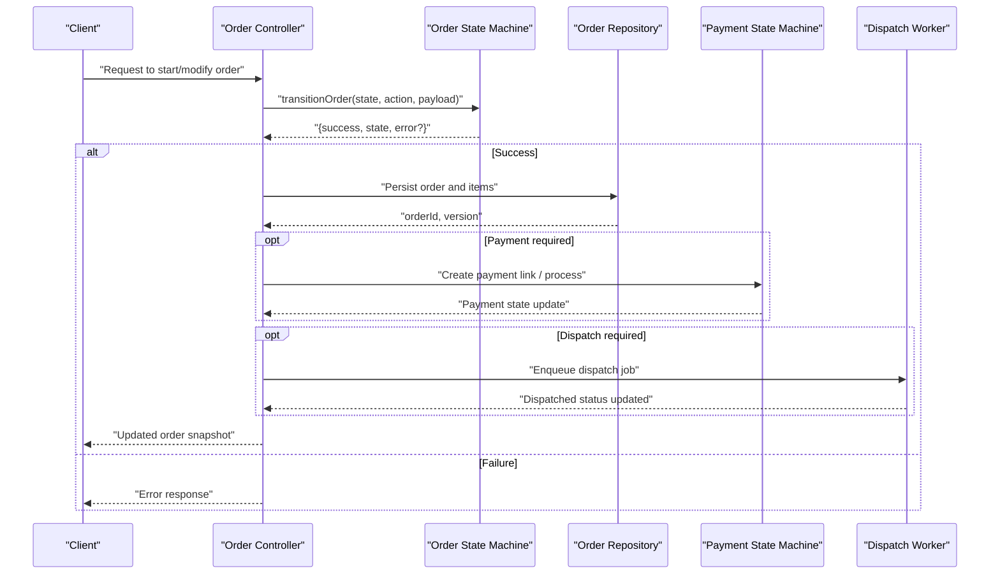
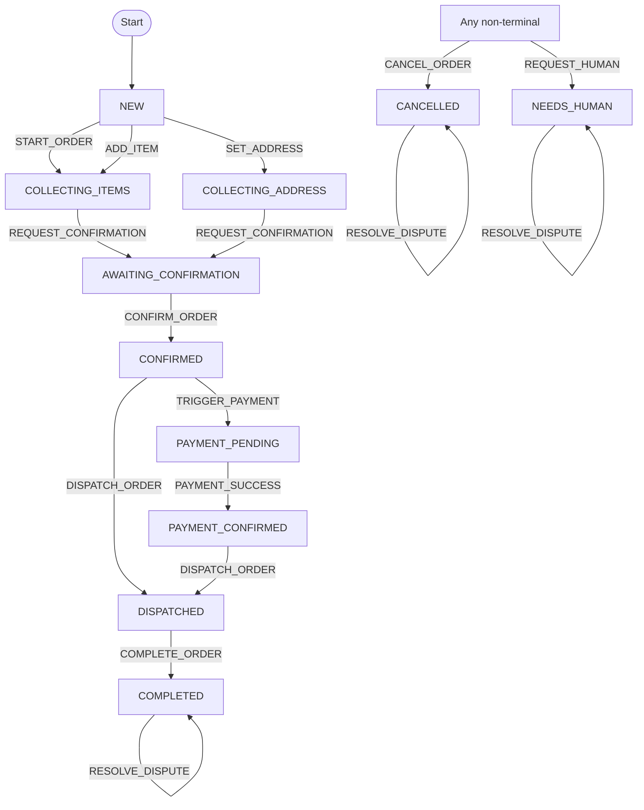
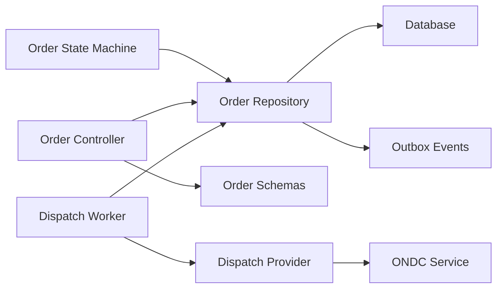

# Order State Machine

<cite>
**Referenced Files in This Document**
- [orderStateMachine.js](file://server/src/domain/orders/orderStateMachine.js)
- [order.repository.js](file://server/src/domain/orders/order.repository.js)
- [order.controller.js](file://server/src/controllers/order.controller.js)
- [order.schema.js](file://server/src/schemas/order.schema.js)
- [dispatch.worker.js](file://server/src/workers/dispatch.worker.js)
- [DispatchProvider.js](file://server/src/integrations/dispatch/DispatchProvider.js)
- [ondcService.js](file://server/src/services/ondcService.js)
- [paymentStateMachine.js](file://server/src/domain/payments/paymentStateMachine.js)
- [domain_state_machines.test.js](file://server/tests/domain_state_machines.test.js)
</cite>

## Table of Contents
1. [Introduction](#introduction)
2. [Project Structure](#project-structure)
3. [Core Components](#core-components)
4. [Architecture Overview](#architecture-overview)
5. [Detailed Component Analysis](#detailed-component-analysis)
6. [Dependency Analysis](#dependency-analysis)
7. [Performance Considerations](#performance-considerations)
8. [Troubleshooting Guide](#troubleshooting-guide)
9. [Conclusion](#conclusion)

## Introduction
This document explains the Order State Machine component that governs the lifecycle of a food order from creation to completion or cancellation, including payment and dispatch phases. It defines all 12 order states, the actions that drive transitions, validation rules, business constraints, error handling patterns, and integration points with payments and dispatch systems.

## Project Structure
The Order State Machine is implemented as a domain module that:
- Declares state constants and action constants
- Provides functions to create initial state, validate allowed transitions, and perform transitions with side effects (e.g., recalculate totals, append history)
- Is used by controllers and workers to persist and propagate changes via repositories and outbox events

**Diagram sources**
- [orderStateMachine.js:1-325](file://server/src/domain/orders/orderStateMachine.js#L1-L325)
- [order.repository.js:1-322](file://server/src/domain/orders/order.repository.js#L1-L322)
- [paymentStateMachine.js:1-48](file://server/src/domain/payments/paymentStateMachine.js#L1-L48)
- [dispatch.worker.js:1-30](file://server/src/workers/dispatch.worker.js#L1-L30)
- [DispatchProvider.js:1-35](file://server/src/integrations/dispatch/DispatchProvider.js#L1-L35)
- [ondcService.js:124-161](file://server/src/services/ondcService.js#L124-L161)

**Section sources**
- [orderStateMachine.js:1-325](file://server/src/domain/orders/orderStateMachine.js#L1-L325)
- [order.repository.js:1-322](file://server/src/domain/orders/order.repository.js#L1-L322)

## Core Components
- States: The machine defines 12 canonical order states for the AI-driven ordering flow.
- Actions: The machine defines 16 actions that represent user/system intents driving transitions.
- Transition logic: A central function validates whether an action is allowed from the current state and applies business rules before transitioning.
- Persistence and auditing: The repository enforces a separate operational status graph and records audit logs and outbox events for downstream consumers.

Key responsibilities:
- Enforce strict state transition rules at the domain layer
- Maintain an immutable history of transitions
- Recalculate monetary totals consistently after item/address changes
- Provide safe entry points for controllers and workers to mutate order state

**Section sources**
- [orderStateMachine.js:8-41](file://server/src/domain/orders/orderStateMachine.js#L8-L41)
- [orderStateMachine.js:46-68](file://server/src/domain/orders/orderStateMachine.js#L46-L68)
- [orderStateMachine.js:73-148](file://server/src/domain/orders/orderStateMachine.js#L73-L148)
- [orderStateMachine.js:154-325](file://server/src/domain/orders/orderStateMachine.js#L154-L325)

## Architecture Overview
The order lifecycle spans three cooperating state machines:
- Order State Machine: Orchestrates the end-to-end customer journey (items, address, confirmation, payment, dispatch, completion, disputes).
- Payment State Machine: Manages payment lifecycle independently (pending, link created, processing, confirmed, failed, expired, refunded).
- Dispatch State Machine: Manages kitchen and delivery lifecycle (accepted, preparing, ready, dispatched, delivered).

**Diagram sources**
- [order.controller.js:22-63](file://server/src/controllers/order.controller.js#L22-L63)
- [orderStateMachine.js:154-325](file://server/src/domain/orders/orderStateMachine.js#L154-L325)
- [order.repository.js:220-287](file://server/src/domain/orders/order.repository.js#L220-L287)
- [paymentStateMachine.js:1-48](file://server/src/domain/payments/paymentStateMachine.js#L1-L48)
- [dispatch.worker.js:1-30](file://server/src/workers/dispatch.worker.js#L1-L30)

## Detailed Component Analysis

### Order States (12)
- NEW: Initial session created; no items or address yet.
- COLLECTING_ITEMS: Building the cart; can add/remove/clear items, set address, request confirmation.
- COLLECTING_ADDRESS: Prompting for delivery details; can also adjust items and request confirmation.
- VALIDATING: Temporary validation phase; can return to collecting steps or request confirmation.
- AWAITING_CONFIRMATION: Ready to confirm; can still adjust items/address until confirmed.
- CONFIRMED: Order is confirmed; payment or dispatch may proceed.
- PAYMENT_PENDING: Payment initiated; awaiting success or failure.
- PAYMENT_CONFIRMED: Payment succeeded; can proceed to dispatch.
- DISPATCH_PENDING: Preparing for dispatch; can move to dispatched.
- DISPATCHED: Out for delivery; can complete or raise dispute.
- COMPLETED: Delivered successfully; can be disputed or resolved.
- CANCELLED: Cancelled early; can be disputed/resolved.
- NEEDS_HUMAN: Requires human intervention; can be disputed/resolved.

These states are defined centrally and enforced by transition checks.

**Section sources**
- [orderStateMachine.js:8-22](file://server/src/domain/orders/orderStateMachine.js#L8-L22)

### Actions (16)
- START_ORDER: Begin collecting items.
- ADD_ITEM: Add or increase quantity of an item.
- REMOVE_ITEM: Remove items by name substring match.
- CLEAR_ITEMS: Clear cart and reset totals.
- SET_ADDRESS: Set delivery address and optional landmark.
- SET_LANDMARK: Set a nearby landmark for delivery.
- REQUEST_CONFIRMATION: Move to awaiting confirmation if valid; otherwise prompt for missing data.
- CONFIRM_ORDER: Confirm order when items and address are present.
- CANCEL_ORDER: Cancel order (not allowed from completed/cancelled).
- TRIGGER_PAYMENT: Start payment process.
- PAYMENT_SUCCESS: Mark payment successful.
- DISPATCH_ORDER: Move to dispatched.
- COMPLETE_ORDER: Mark order completed.
- REQUEST_HUMAN: Escalate to human support.
- FLAG_DISPUTE: Flag a dispute on the order.
- RESOLVE_DISPUTE: Resolve dispute with refund/reject and notes.

**Section sources**
- [orderStateMachine.js:24-41](file://server/src/domain/orders/orderStateMachine.js#L24-L41)

### Validation Rules and Business Constraints
- Global rules:
  - CANCEL_ORDER is allowed except from COMPLETED or CANCELLED.
  - REQUEST_HUMAN is always allowed.
- Cart and address requirements:
  - Cannot request confirmation with an empty cart.
  - Cannot confirm without items and delivery address.
- Monetary calculations:
  - Subtotal computed from items and quantities.
  - Delivery fee applied when subtotal > 0 and address present.
  - Tax computed as a fixed percentage of subtotal.
  - Total equals subtotal + tax + delivery fee.
- History tracking:
  - Every transition appends a timestamped record with action and payload summary.

**Section sources**
- [orderStateMachine.js:73-148](file://server/src/domain/orders/orderStateMachine.js#L73-L148)
- [orderStateMachine.js:154-325](file://server/src/domain/orders/orderStateMachine.js#L154-L325)

### State Transition Logic
Allowed transitions per state (selected highlights):
- NEW: START_ORDER, ADD_ITEM, SET_ADDRESS
- COLLECTING_ITEMS: ADD_ITEM, REMOVE_ITEM, CLEAR_ITEMS, SET_ADDRESS, REQUEST_CONFIRMATION
- COLLECTING_ADDRESS: SET_ADDRESS, SET_LANDMARK, ADD_ITEM, REMOVE_ITEM, REQUEST_CONFIRMATION
- VALIDATING: REQUEST_CONFIRMATION, COLLECTING_ADDRESS, COLLECTING_ITEMS
- AWAITING_CONFIRMATION: CONFIRM_ORDER, ADD_ITEM, REMOVE_ITEM, SET_ADDRESS, SET_LANDMARK
- CONFIRMED: TRIGGER_PAYMENT, PAYMENT_SUCCESS, DISPATCH_ORDER
- PAYMENT_PENDING: PAYMENT_SUCCESS, DISPATCH_ORDER
- PAYMENT_CONFIRMED: DISPATCH_ORDER
- DISPATCH_PENDING: DISPATCH_ORDER
- DISPATCHED: COMPLETE_ORDER, FLAG_DISPUTE
- COMPLETED: FLAG_DISPUTE, RESOLVE_DISPUTE
- CANCELLED: FLAG_DISPUTE, RESOLVE_DISPUTE
- NEEDS_HUMAN: FLAG_DISPUTE, RESOLVE_DISPUTE

**Diagram sources**
- [orderStateMachine.js:73-148](file://server/src/domain/orders/orderStateMachine.js#L73-L148)
- [orderStateMachine.js:154-325](file://server/src/domain/orders/orderStateMachine.js#L154-L325)

### Examples of Valid and Invalid Transitions
Valid examples:
- NEW → START_ORDER → COLLECTING_ITEMS
- COLLECTING_ITEMS → ADD_ITEM → AWAITING_CONFIRMATION (when items and address exist)
- AWAITING_CONFIRMATION → CONFIRM_ORDER → CONFIRMED
- CONFIRMED → TRIGGER_PAYMENT → PAYMENT_PENDING → PAYMENT_SUCCESS → PAYMENT_CONFIRMED
- PAYMENT_CONFIRMED → DISPATCH_ORDER → DISPATCHED → COMPLETE_ORDER → COMPLETED
- Any non-terminal → CANCEL_ORDER → CANCELLED
- Any → REQUEST_HUMAN → NEEDS_HUMAN

Invalid examples:
- CONFIRMED → DISPATCH_ORDER without completing payment first is allowed by the order state machine but typically requires coordination with payment state; ensure payment is settled before dispatch in orchestration.
- DISPATCHED → PREPARING (not defined in order state machine; use dispatch state machine for kitchen workflow)
- COMPLETED → CANCEL_ORDER (explicitly disallowed)
- CANCELLED → CANCEL_ORDER (explicitly disallowed)

**Section sources**
- [orderStateMachine.js:73-148](file://server/src/domain/orders/orderStateMachine.js#L73-L148)
- [orderStateMachine.js:154-325](file://server/src/domain/orders/orderStateMachine.js#L154-L325)

### Error Handling Patterns
- Illegal transition: Returns success=false with a descriptive error message indicating the current state and attempted action.
- Missing prerequisites: For example, requesting confirmation with an empty cart or confirming without an address returns success=false with specific errors.
- Repository-level conflicts: When updating persisted order status, illegal transitions raise a conflict error; optimistic locking raises a conflict if version mismatch occurs.
- Audit and outbox: Successful transitions log audit entries and enqueue outbox events for downstream systems.

**Section sources**
- [orderStateMachine.js:154-163](file://server/src/domain/orders/orderStateMachine.js#L154-L163)
- [orderStateMachine.js:230-261](file://server/src/domain/orders/orderStateMachine.js#L230-L261)
- [order.repository.js:220-287](file://server/src/domain/orders/order.repository.js#L220-L287)

### Integration Points
- Payments:
  - The order state machine triggers payment flows via TRIGGER_PAYMENT and acknowledges PAYMENT_SUCCESS.
  - The payment state machine manages provider-specific lifecycles (link creation, processing, confirmation, failures, refunds).
- Dispatch:
  - After payment confirmation or directly from confirmed, orders can be dispatched.
  - The dispatch worker coordinates with ONDC or direct POS integrations and updates order status to dispatched.
- API and persistence:
  - Controllers expose endpoints to query orders and update statuses, enforcing tenant/restaurant scoping and optimistic concurrency.
  - Schemas validate incoming payloads for status updates and dispute operations.

**Section sources**
- [paymentStateMachine.js:1-48](file://server/src/domain/payments/paymentStateMachine.js#L1-L48)
- [dispatch.worker.js:1-30](file://server/src/workers/dispatch.worker.js#L1-L30)
- [DispatchProvider.js:1-35](file://server/src/integrations/dispatch/DispatchProvider.js#L1-L35)
- [ondcService.js:124-161](file://server/src/services/ondcService.js#L124-L161)
- [order.controller.js:22-63](file://server/src/controllers/order.controller.js#L22-L63)
- [order.schema.js:1-22](file://server/src/schemas/order.schema.js#L1-L22)

## Dependency Analysis
- The order state machine depends only on its own definitions and pure functions for transition logic.
- The repository depends on database utilities, audit logging, and outbox event publishing.
- The controller depends on the repository and schemas for input validation and persistence.
- Workers depend on the repository and dispatch providers to execute asynchronous dispatch tasks.

**Diagram sources**
- [orderStateMachine.js:1-325](file://server/src/domain/orders/orderStateMachine.js#L1-L325)
- [order.repository.js:1-322](file://server/src/domain/orders/order.repository.js#L1-L322)
- [order.controller.js:1-136](file://server/src/controllers/order.controller.js#L1-L136)
- [order.schema.js:1-22](file://server/src/schemas/order.schema.js#L1-L22)
- [dispatch.worker.js:1-30](file://server/src/workers/dispatch.worker.js#L1-L30)
- [DispatchProvider.js:1-35](file://server/src/integrations/dispatch/DispatchProvider.js#L1-L35)
- [ondcService.js:124-161](file://server/src/services/ondcService.js#L124-L161)

**Section sources**
- [orderStateMachine.js:1-325](file://server/src/domain/orders/orderStateMachine.js#L1-L325)
- [order.repository.js:1-322](file://server/src/domain/orders/order.repository.js#L1-L322)
- [order.controller.js:1-136](file://server/src/controllers/order.controller.js#L1-L136)
- [order.schema.js:1-22](file://server/src/schemas/order.schema.js#L1-L22)
- [dispatch.worker.js:1-30](file://server/src/workers/dispatch.worker.js#L1-L30)
- [DispatchProvider.js:1-35](file://server/src/integrations/dispatch/DispatchProvider.js#L1-L35)
- [ondcService.js:124-161](file://server/src/services/ondcService.js#L124-L161)

## Performance Considerations
- Keep transitions idempotent where possible; the state machine recomputes totals deterministically.
- Use optimistic concurrency in repository updates to avoid lost updates under contention.
- Offload heavy operations (dispatch, notifications) to background workers to keep request paths fast.
- Batch item updates and minimize repeated recalculations by applying them within a single transition call.

[No sources needed since this section provides general guidance]

## Troubleshooting Guide
Common issues and resolutions:
- Illegal state transition: Ensure the requested action is allowed from the current state; consult the transition matrix.
- Empty cart or missing address: Before confirming or requesting confirmation, ensure items and delivery address are set.
- Optimistic lock conflict: Refresh the order state and retry with the latest version.
- Payment not completed before dispatch: Coordinate with the payment state machine to ensure payment is confirmed prior to dispatch.
- Dispatch failures: Check provider responses and fallback behavior; verify tenant/restaurant context and order data integrity.

**Section sources**
- [orderStateMachine.js:154-163](file://server/src/domain/orders/orderStateMachine.js#L154-L163)
- [orderStateMachine.js:230-261](file://server/src/domain/orders/orderStateMachine.js#L230-L261)
- [order.repository.js:220-287](file://server/src/domain/orders/order.repository.js#L220-L287)
- [domain_state_machines.test.js:53-59](file://server/tests/domain_state_machines.test.js#L53-L59)

## Conclusion
The Order State Machine provides a robust, testable foundation for managing the end-to-end order lifecycle. It enforces clear state boundaries, validates business constraints, maintains an auditable history, and integrates cleanly with payment and dispatch systems. By adhering to the defined states and actions, developers can build reliable features while ensuring consistency across the system.

[No sources needed since this section summarizes without analyzing specific files]