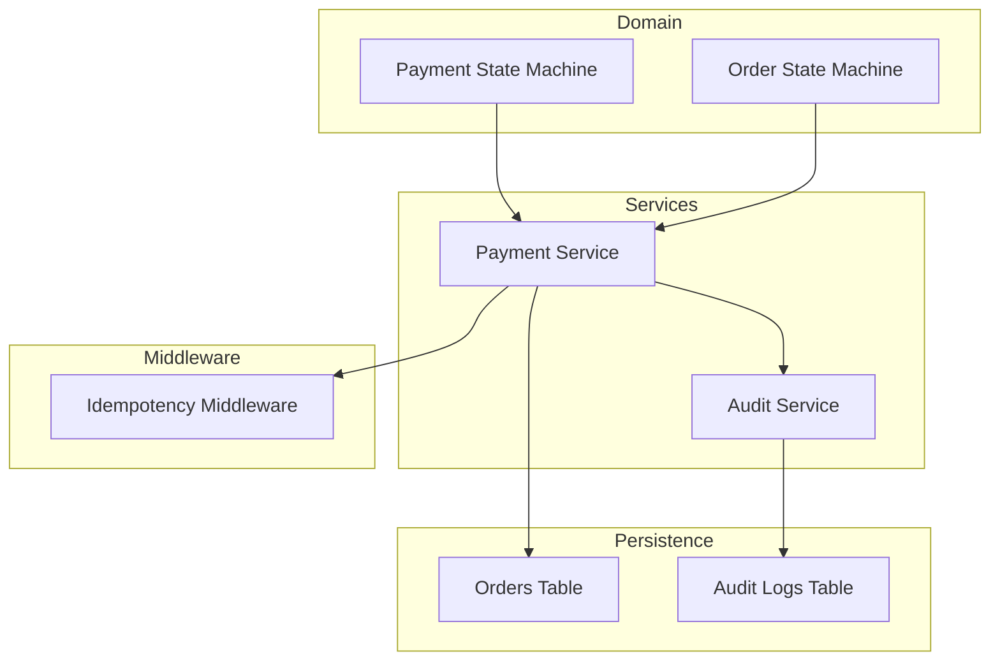
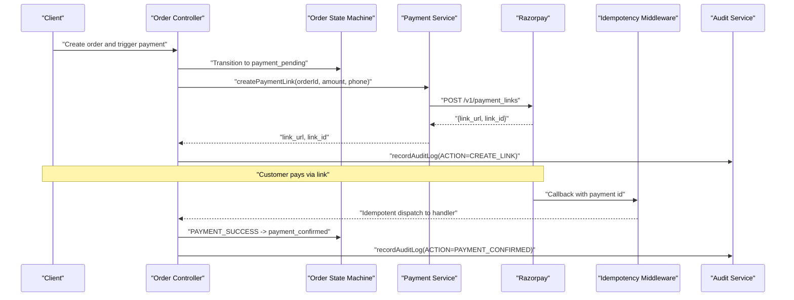
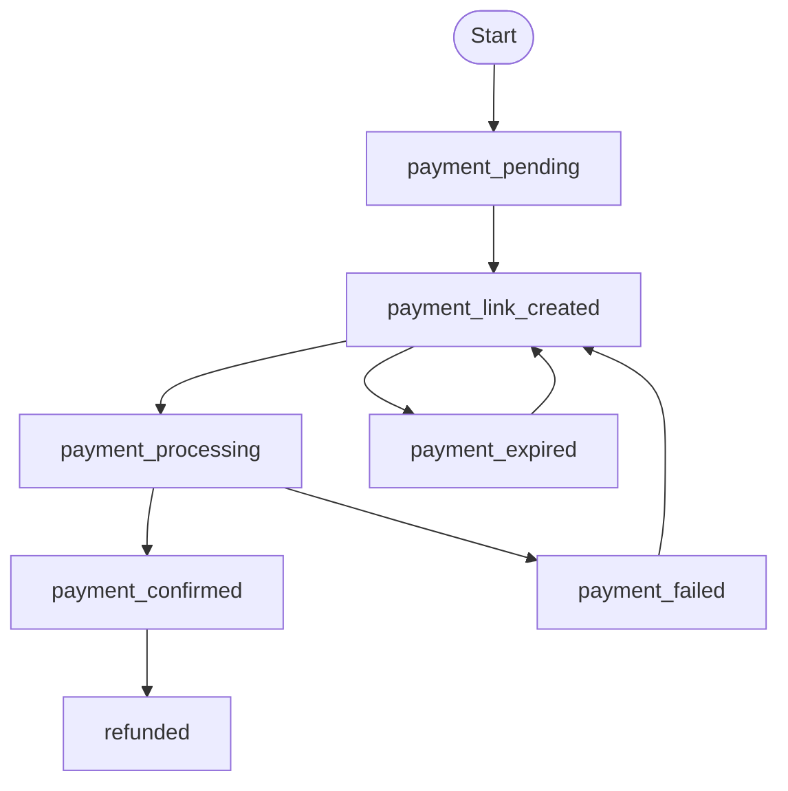
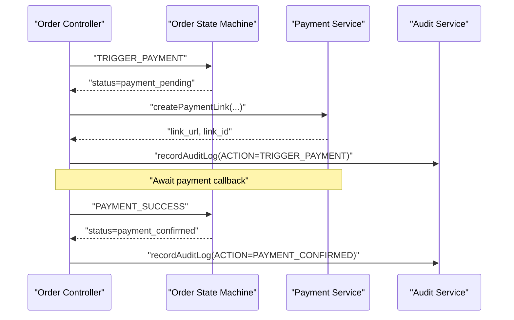
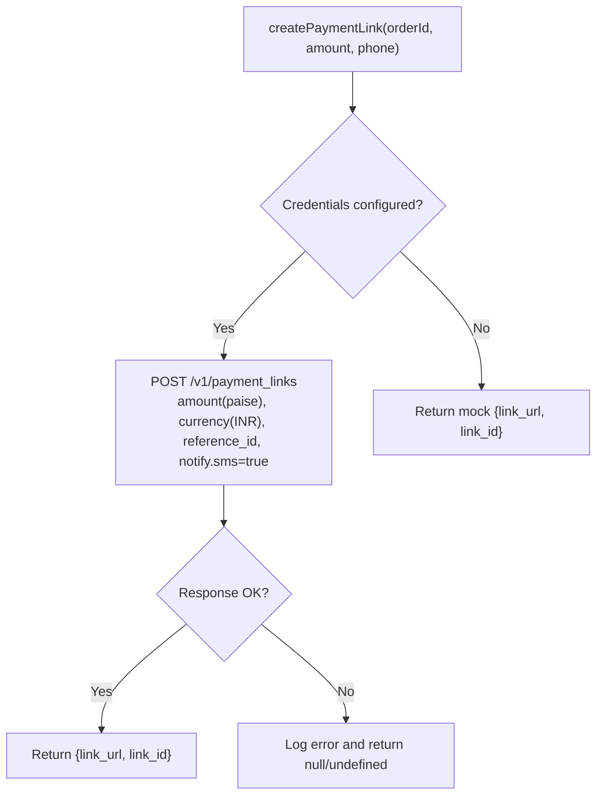
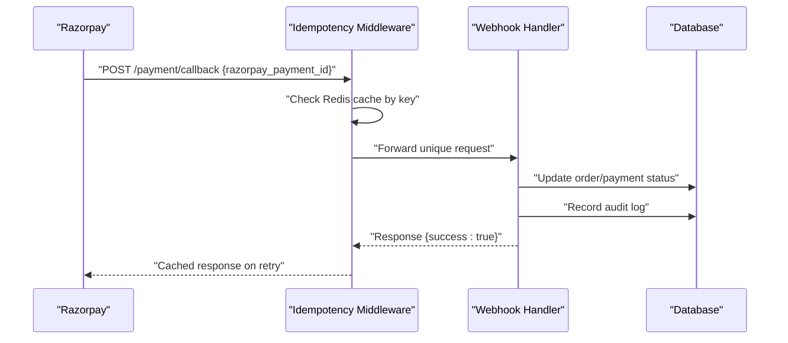
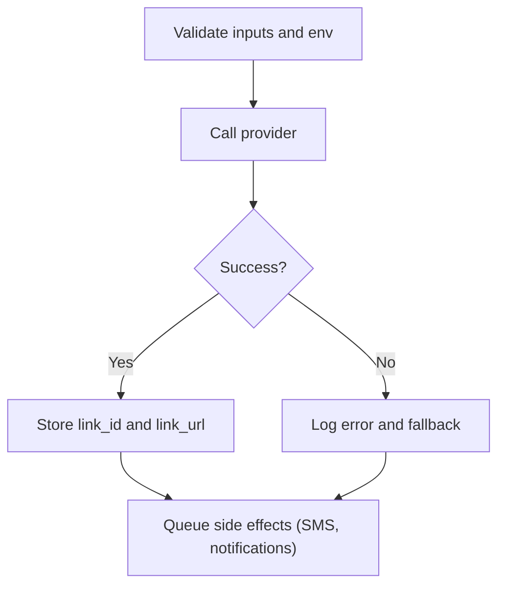
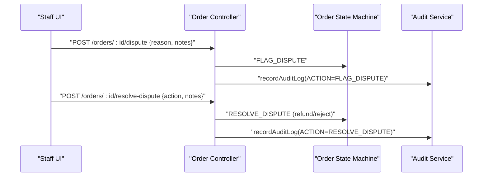
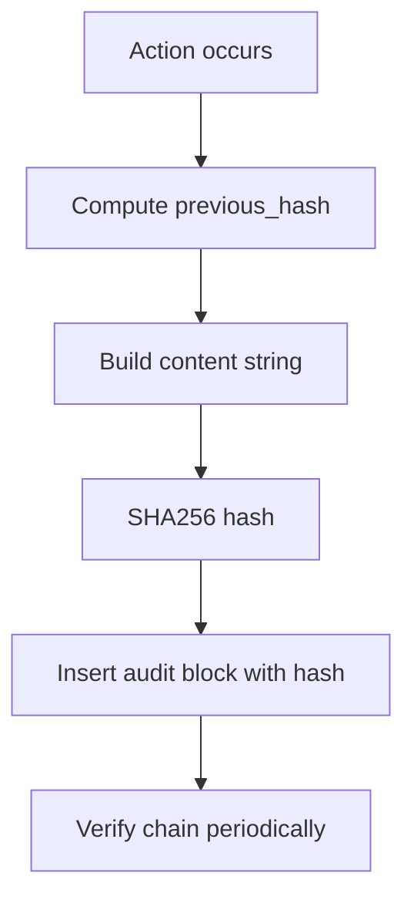
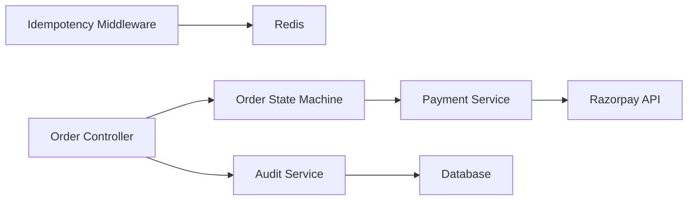

# Payment Processing Integration

<cite>
**Referenced Files in This Document**
- [paymentStateMachine.js](file://server/src/domain/payments/paymentStateMachine.js)
- [paymentService.js](file://server/src/services/paymentService.js)
- [orderStateMachine.js](file://server/src/domain/orders/orderStateMachine.js)
- [order.controller.js](file://server/src/controllers/order.controller.js)
- [idempotency.middleware.js](file://server/src/middleware/idempotency.middleware.js)
- [audit.service.js](file://server/src/services/audit.service.js)
- [001_initial_multitenant_schema.sql](file://server/src/db/migrations/001_initial_multitenant_schema.sql)
- [002_audit_logs_and_metrics.sql](file://server/src/db/migrations/002_audit_logs_and_metrics.sql)
- [003_disputes_and_pos_support.sql](file://server/src/db/migrations/003_disputes_and_pos_support.sql)
- [domain_state_machines.test.js](file://server/tests/domain_state_machines.test.js)
</cite>

## Table of Contents
1. Introduction
2. Project Structure
3. Core Components
4. Architecture Overview
5. Detailed Component Analysis
6. Dependency Analysis
7. Performance Considerations
8. Troubleshooting Guide
9. Conclusion

## Introduction
This document explains how payments are processed within the order management system, focusing on a robust payment state machine, integration with an external payment gateway (Razorpay), webhook and callback handling patterns, validation, retries, error handling, refunds, disputes, security, PCI considerations, and audit logging for financial transactions. It is designed to be accessible to both technical and non-technical readers while providing code-level references for implementation details.

## Project Structure
Payment processing spans domain logic (state machines), services (gateway integrations), middleware (idempotency), controllers (APIs), and database schemas (orders, audit logs). The key files involved include:
- Payment state machine defining states and transitions
- Order state machine coordinating order lifecycle with payment events
- Payment service creating payment links and sending SMS notifications
- Idempotency middleware protecting against duplicate webhook processing
- Audit service recording tamper-evident logs for compliance
- Database migrations defining orders and audit tables

**Diagram sources**
- [paymentStateMachine.js:9-28](file://server/src/domain/payments/paymentStateMachine.js#L9-L28)
- [orderStateMachine.js:8-41](file://server/src/domain/orders/orderStateMachine.js#L8-L41)
- [paymentService.js:25-61](file://server/src/services/paymentService.js#L25-L61)
- [idempotency.middleware.js:13-63](file://server/src/middleware/idempotency.middleware.js#L13-L63)
- [audit.service.js:19-77](file://server/src/services/audit.service.js#L19-L77)
- [001_initial_multitenant_schema.sql:174-199](file://server/src/db/migrations/001_initial_multitenant_schema.sql#L174-L199)
- [002_audit_logs_and_metrics.sql:7-22](file://server/src/db/migrations/002_audit_logs_and_metrics.sql#L7-L22)

**Section sources**
- [paymentStateMachine.js:9-28](file://server/src/domain/payments/paymentStateMachine.js#L9-L28)
- [orderStateMachine.js:8-41](file://server/src/domain/orders/orderStateMachine.js#L8-L41)
- [paymentService.js:25-61](file://server/src/services/paymentService.js#L25-L61)
- [idempotency.middleware.js:13-63](file://server/src/middleware/idempotency.middleware.js#L13-L63)
- [audit.service.js:19-77](file://server/src/services/audit.service.js#L19-L77)
- [001_initial_multitenant_schema.sql:174-199](file://server/src/db/migrations/001_initial_multitenant_schema.sql#L174-L199)
- [002_audit_logs_and_metrics.sql:7-22](file://server/src/db/migrations/002_audit_logs_and_metrics.sql#L7-L22)

## Core Components
- Payment state machine: Defines authoritative payment states and transitions, including pending, link created, processing, confirmed, failed, expired, and refunded. It enforces legal transitions and records history.
- Order state machine: Coordinates order lifecycle and integrates payment milestones (triggering payment, confirming payment) into order status progression.
- Payment service: Creates payment links via Razorpay and sends SMS notifications; includes mock fallback for development.
- Idempotency middleware: Prevents duplicate processing of webhooks or retries by caching responses keyed by request identifiers.
- Audit service: Records cryptographically chained audit logs for state changes, supporting compliance and verification.

**Section sources**
- [paymentStateMachine.js:30-149](file://server/src/domain/payments/paymentStateMachine.js#L30-L149)
- [orderStateMachine.js:154-324](file://server/src/domain/orders/orderStateMachine.js#L154-L324)
- [paymentService.js:25-114](file://server/src/services/paymentService.js#L25-L114)
- [idempotency.middleware.js:13-63](file://server/src/middleware/idempotency.middleware.js#L13-L63)
- [audit.service.js:19-77](file://server/src/services/audit.service.js#L19-L77)

## Architecture Overview
The payment architecture separates payment lifecycle from order lifecycle, ensuring that payment link creation does not imply completion. The flow typically involves:
- Initiating a payment link through the payment service
- Transitioning payment state to link created and then processing upon customer action
- Receiving callbacks/webhooks from the payment provider to confirm success or failure
- Updating order state based on payment confirmation
- Recording audit logs for all critical actions
- Handling refunds and disputes through dedicated flows

**Diagram sources**
- [orderStateMachine.js:270-278](file://server/src/domain/orders/orderStateMachine.js#L270-L278)
- [paymentService.js:25-61](file://server/src/services/paymentService.js#L25-L61)
- [idempotency.middleware.js:13-63](file://server/src/middleware/idempotency.middleware.js#L13-L63)
- [audit.service.js:19-77](file://server/src/services/audit.service.js#L19-L77)

## Detailed Component Analysis

### Payment State Machine
The payment state machine defines the authoritative set of states and allowed transitions:
- States: payment_not_required, payment_pending, payment_link_created, payment_processing, payment_confirmed, payment_failed, payment_expired, refunded
- Actions: SET_COD, CREATE_LINK, PAYMENT_INITIATED, PAYMENT_SUCCESS, PAYMENT_FAIL, PAYMENT_EXPIRE, PROCESS_REFUND
- Transitions enforce strict rules (e.g., only refund from confirmed; re-link from failed/expired)
- History tracking captures each transition with timestamp and payload summary

**Diagram sources**
- [paymentStateMachine.js:9-28](file://server/src/domain/payments/paymentStateMachine.js#L9-L28)
- [paymentStateMachine.js:50-84](file://server/src/domain/payments/paymentStateMachine.js#L50-L84)
- [paymentStateMachine.js:86-149](file://server/src/domain/payments/paymentStateMachine.js#L86-L149)

**Section sources**
- [paymentStateMachine.js:9-28](file://server/src/domain/payments/paymentStateMachine.js#L9-L28)
- [paymentStateMachine.js:50-84](file://server/src/domain/payments/paymentStateMachine.js#L50-L84)
- [paymentStateMachine.js:86-149](file://server/src/domain/payments/paymentStateMachine.js#L86-L149)

### Order State Machine Integration
The order state machine coordinates payment milestones:
- TRIGGER_PAYMENT moves order to payment_pending
- PAYMENT_SUCCESS moves order to payment_confirmed
- Subsequent steps allow dispatch and completion
- Dispute handling supports flagging and resolution (refund/reject)

**Diagram sources**
- [orderStateMachine.js:270-278](file://server/src/domain/orders/orderStateMachine.js#L270-L278)
- [paymentService.js:25-61](file://server/src/services/paymentService.js#L25-L61)
- [audit.service.js:19-77](file://server/src/services/audit.service.js#L19-L77)

**Section sources**
- [orderStateMachine.js:270-278](file://server/src/domain/orders/orderStateMachine.js#L270-L278)
- [orderStateMachine.js:292-300](file://server/src/domain/orders/orderStateMachine.js#L292-L300)

### Payment Gateway Integration (Razorpay)
The payment service creates payment links with:
- Amount conversion to smallest currency unit
- Customer contact and notification settings
- Callback URL configuration for provider to notify completion
- Fallback to mock link when credentials are not configured

**Diagram sources**
- [paymentService.js:25-61](file://server/src/services/paymentService.js#L25-L61)

**Section sources**
- [paymentService.js:25-61](file://server/src/services/paymentService.js#L25-L61)

### Webhook Handling and Callback Processing
- The payment service configures a callback URL for the provider to call upon payment completion
- Idempotency middleware intercepts state-modifying requests and caches responses using keys derived from headers or body fields (e.g., CallSid, razorpay_payment_id, orderId)
- This prevents duplicate charges and ensures consistent state updates even if the provider retries

**Diagram sources**
- [paymentService.js:45-46](file://server/src/services/paymentService.js#L45-L46)
- [idempotency.middleware.js:13-63](file://server/src/middleware/idempotency.middleware.js#L13-L63)

**Section sources**
- [paymentService.js:45-46](file://server/src/services/paymentService.js#L45-L46)
- [idempotency.middleware.js:13-63](file://server/src/middleware/idempotency.middleware.js#L13-L63)

### Payment Validation and Retry Mechanisms
- Validation: The payment service validates environment configuration before calling the provider; amounts are converted to the provider’s expected units
- Retries: Idempotency middleware ensures safe retries by caching responses keyed by request identity; this protects against duplicate processing
- Error handling: Errors from provider calls are logged; mock fallbacks enable development continuity

**Diagram sources**
- [paymentService.js:25-61](file://server/src/services/paymentService.js#L25-L61)
- [idempotency.middleware.js:13-63](file://server/src/middleware/idempotency.middleware.js#L13-L63)

**Section sources**
- [paymentService.js:25-61](file://server/src/services/paymentService.js#L25-L61)
- [idempotency.middleware.js:13-63](file://server/src/middleware/idempotency.middleware.js#L13-L63)

### Refund Processing and Dispute Resolution
- Refunds: The payment state machine allows transitioning from confirmed to refunded via PROCESS_REFUND
- Disputes: The order state machine supports FLAG_DISPUTE and RESOLVE_DISPUTE with outcomes like refund or rejection
- Controllers: Endpoints exist to flag and resolve disputes, recording audit logs for compliance

**Diagram sources**
- [orderStateMachine.js:292-300](file://server/src/domain/orders/orderStateMachine.js#L292-L300)
- [order.controller.js:65-135](file://server/src/controllers/order.controller.js#L65-L135)
- [audit.service.js:19-77](file://server/src/services/audit.service.js#L19-L77)

**Section sources**
- [orderStateMachine.js:292-300](file://server/src/domain/orders/orderStateMachine.js#L292-L300)
- [order.controller.js:65-135](file://server/src/controllers/order.controller.js#L65-L135)
- [audit.service.js:19-77](file://server/src/services/audit.service.js#L19-L77)

### Security Considerations and PCI Compliance
- Secrets management: Payment provider credentials are read from environment variables; ensure secure storage and rotation
- Idempotency: Protects against duplicate charges caused by network retries or provider retries
- Audit trail: Cryptographic hash chain ensures tamper-evident logs for financial events
- Data minimization: Avoid storing sensitive card data; rely on provider-hosted payment flows
- Access control: Use role-based access for administrative endpoints related to disputes and audits

**Section sources**
- [paymentService.js:9-15](file://server/src/services/paymentService.js#L9-L15)
- [idempotency.middleware.js:13-63](file://server/src/middleware/idempotency.middleware.js#L13-L63)
- [audit.service.js:19-77](file://server/src/services/audit.service.js#L19-L77)

### Audit Logging for Financial Transactions
- All critical actions (order triggers, payment confirmations, dispute resolutions) are recorded with actor context, resource identifiers, and state snapshots
- Hash chaining provides integrity verification across audit entries per restaurant

**Diagram sources**
- [audit.service.js:7-10](file://server/src/services/audit.service.js#L7-L10)
- [audit.service.js:19-77](file://server/src/services/audit.service.js#L19-L77)
- [audit.service.js:96-141](file://server/src/services/audit.service.js#L96-L141)

**Section sources**
- [audit.service.js:7-10](file://server/src/services/audit.service.js#L7-L10)
- [audit.service.js:19-77](file://server/src/services/audit.service.js#L19-L77)
- [audit.service.js:96-141](file://server/src/services/audit.service.js#L96-L141)

## Dependency Analysis
Key dependencies and relationships:
- Payment service depends on environment configuration and external provider APIs
- Order state machine depends on payment milestones to progress order lifecycle
- Idempotency middleware depends on Redis for caching responses
- Audit service depends on database for persistent, verifiable logs
- Controllers orchestrate state transitions and record audit logs

**Diagram sources**
- [paymentService.js:25-61](file://server/src/services/paymentService.js#L25-L61)
- [orderStateMachine.js:270-278](file://server/src/domain/orders/orderStateMachine.js#L270-L278)
- [idempotency.middleware.js:13-63](file://server/src/middleware/idempotency.middleware.js#L13-L63)
- [audit.service.js:19-77](file://server/src/services/audit.service.js#L19-L77)
- [order.controller.js:65-135](file://server/src/controllers/order.controller.js#L65-L135)

**Section sources**
- [paymentService.js:25-61](file://server/src/services/paymentService.js#L25-L61)
- [orderStateMachine.js:270-278](file://server/src/domain/orders/orderStateMachine.js#L270-L278)
- [idempotency.middleware.js:13-63](file://server/src/middleware/idempotency.middleware.js#L13-L63)
- [audit.service.js:19-77](file://server/src/services/audit.service.js#L19-L77)
- [order.controller.js:65-135](file://server/src/controllers/order.controller.js#L65-L135)

## Performance Considerations
- Keep payment link creation and SMS sending off the critical path by queuing side effects (as recommended in project notes)
- Use idempotency to avoid redundant work on retries
- Ensure database indexes support frequent queries on orders and audit logs
- Monitor latency and throughput for provider calls; implement timeouts and circuit breakers where appropriate

[No sources needed since this section provides general guidance]

## Troubleshooting Guide
Common issues and strategies:
- Duplicate webhook processing: Verify idempotency middleware is applied and Redis is reachable; check cached responses
- Payment link failures: Inspect provider error logs and environment configuration; use mock fallback during development
- State transition errors: Validate current state and allowed actions using the state machines; review history for illegal transitions
- Audit integrity: Run chain verification to detect tampering or missing blocks

**Section sources**
- [idempotency.middleware.js:13-63](file://server/src/middleware/idempotency.middleware.js#L13-L63)
- [paymentService.js:25-61](file://server/src/services/paymentService.js#L25-L61)
- [paymentStateMachine.js:86-149](file://server/src/domain/payments/paymentStateMachine.js#L86-L149)
- [audit.service.js:96-141](file://server/src/services/audit.service.js#L96-L141)

## Conclusion
The system implements a clear separation between payment and order lifecycles, enforced by authoritative state machines and supported by idempotency, audit logging, and robust integration with an external payment provider. This design ensures reliable payment processing, safe retries, compliant auditing, and clear paths for refunds and dispute resolution. For production readiness, emphasize secure credential management, queueing of side effects, monitoring, and periodic audit chain verification.

[No sources needed since this section summarizes without analyzing specific files]