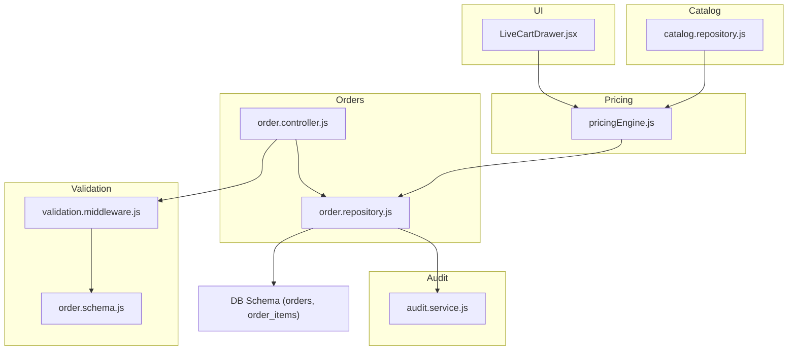
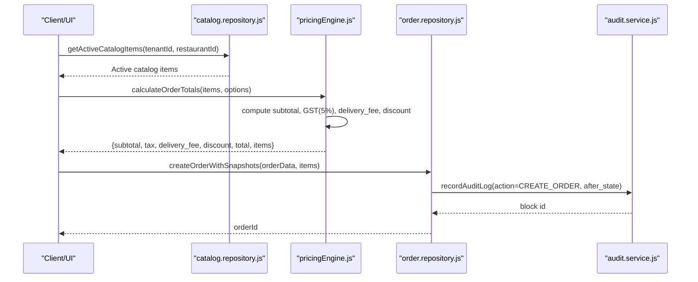
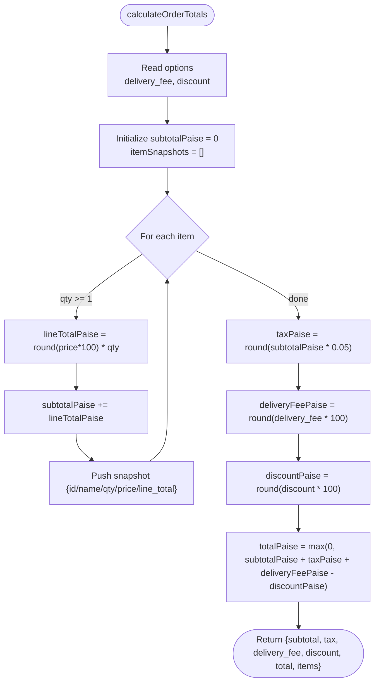
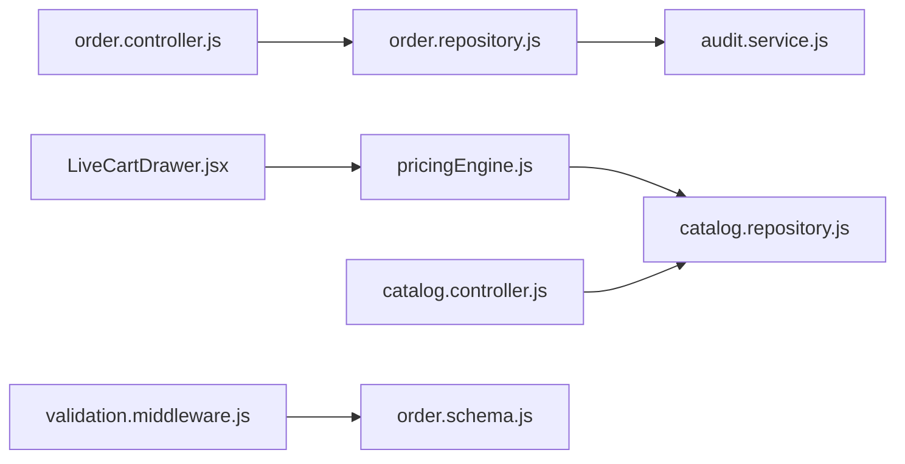

# Pricing Engine & Calculations

<cite>
**Referenced Files in This Document**
- [pricingEngine.js](file://server/src/domain/orders/pricingEngine.js)
- [catalog.repository.js](file://server/src/domain/catalog/catalog.repository.js)
- [order.repository.js](file://server/src/domain/orders/order.repository.js)
- [order.controller.js](file://server/src/controllers/order.controller.js)
- [catalog.controller.js](file://server/src/controllers/catalog.controller.js)
- [001_initial_multitenant_schema.sql](file://server/src/db/migrations/001_initial_multitenant_schema.sql)
- [audit.service.js](file://server/src/services/audit.service.js)
- [validation.middleware.js](file://server/src/middleware/validation.middleware.js)
- [order.schema.js](file://server/src/schemas/order.schema.js)
- [LiveCartDrawer.jsx](file://mobile/src/components/commerce/LiveCartDrawer.jsx)
</cite>

## Table of Contents
1. Introduction
2. Project Structure
3. Core Components
4. Architecture Overview
5. Detailed Component Analysis
6. Dependency Analysis
7. Performance Considerations
8. Troubleshooting Guide
9. Conclusion
10. Appendices

## Introduction
This document explains the pricing engine and calculations used to compute order costs, including menu item pricing, quantity handling, tax (GST), delivery fees, discounts, and how prices are persisted and audited. It also covers integration with catalog pricing, validation, currency handling, and price change management. Where applicable, it notes extensibility points for dynamic pricing based on time of day, demand surcharges, and location-based pricing.

## Project Structure
The pricing system spans several layers:
- Catalog layer: retrieves active items and categories per tenant/restaurant.
- Pricing engine: computes authoritative totals from catalog-backed line items.
- Order persistence: stores monetary values as integer paise and snapshots line items.
- Audit trail: records immutable, hash-chained logs for state changes and pricing events.
- Validation: enforces schema constraints on inputs.
- UI: displays subtotal, GST, delivery fee, and total to customers.

**Diagram sources**
- [pricingEngine.js:16-116](file://server/src/domain/orders/pricingEngine.js#L16-L116)
- [catalog.repository.js:23-46](file://server/src/domain/catalog/catalog.repository.js#L23-L46)
- [order.repository.js:24-143](file://server/src/domain/orders/order.repository.js#L24-L143)
- [order.controller.js:22-63](file://server/src/controllers/order.controller.js#L22-L63)
- [audit.service.js:19-77](file://server/src/services/audit.service.js#L19-L77)
- [validation.middleware.js:7-18](file://server/src/middleware/validation.middleware.js#L7-L18)
- [order.schema.js:3-21](file://server/src/schemas/order.schema.js#L3-L21)
- [LiveCartDrawer.jsx:96-116](file://mobile/src/components/commerce/LiveCartDrawer.jsx#L96-L116)

**Section sources**
- [pricingEngine.js:16-116](file://server/src/domain/orders/pricingEngine.js#L16-L116)
- [catalog.repository.js:23-46](file://server/src/domain/catalog/catalog.repository.js#L23-L46)
- [order.repository.js:24-143](file://server/src/domain/orders/order.repository.js#L24-L143)
- [order.controller.js:22-63](file://server/src/controllers/order.controller.js#L22-L63)
- [audit.service.js:19-77](file://server/src/services/audit.service.js#L19-L77)
- [validation.middleware.js:7-18](file://server/src/middleware/validation.middleware.js#L7-L18)
- [order.schema.js:3-21](file://server/src/schemas/order.schema.js#L3-L21)
- [LiveCartDrawer.jsx:96-116](file://mobile/src/components/commerce/LiveCartDrawer.jsx#L96-L116)

## Core Components
- Pricing Engine: Loads active catalog items with a short cache window, matches requested items by name or localized name, and calculates authoritative totals (subtotal, GST, delivery fee, discount, total) using integer arithmetic in paise to avoid floating-point drift.
- Catalog Repository: Enforces multi-tenant scoping and returns only active items; normalizes fields like availability and special flags.
- Order Repository: Persists orders and line-item snapshots, converts between decimal and paise, and emits outbox events and audit logs within transactions.
- Audit Service: Records tamper-evident audit blocks linked by cryptographic hashes; supports verification of chain integrity.
- Validation: Uses Zod schemas and middleware to validate request bodies, queries, and parameters before processing.
- UI: Displays breakdown of subtotal, GST (5%), delivery fee, and total to the customer.

Key responsibilities and behaviors:
- Currency: All monetary values are stored and computed in INR with precision handled via integer paise internally.
- Tax: Fixed GST rate applied to subtotal.
- Delivery Fee: Configurable via options; defaults to a fixed amount when not provided.
- Discounts: Applied after tax and delivery fee computation; total is clamped to non-negative values.
- Item Snapshots: Each line item captures catalog item id, name, quantity, unit price at calculation time, and line total.

**Section sources**
- [pricingEngine.js:16-116](file://server/src/domain/orders/pricingEngine.js#L16-L116)
- [catalog.repository.js:23-46](file://server/src/domain/catalog/catalog.repository.js#L23-L46)
- [order.repository.js:24-143](file://server/src/domain/orders/order.repository.js#L24-L143)
- [audit.service.js:19-77](file://server/src/services/audit.service.js#L19-L77)
- [validation.middleware.js:7-18](file://server/src/middleware/validation.middleware.js#L7-L18)
- [order.schema.js:3-21](file://server/src/schemas/order.schema.js#L3-L21)
- [LiveCartDrawer.jsx:96-116](file://mobile/src/components/commerce/LiveCartDrawer.jsx#L96-L116)

## Architecture Overview
The pricing flow integrates catalog retrieval, deterministic calculation, and persistent storage with auditing.

**Diagram sources**
- [catalog.repository.js:23-46](file://server/src/domain/catalog/catalog.repository.js#L23-L46)
- [pricingEngine.js:76-116](file://server/src/domain/orders/pricingEngine.js#L76-L116)
- [order.repository.js:24-143](file://server/src/domain/orders/order.repository.js#L24-L143)
- [audit.service.js:19-77](file://server/src/services/audit.service.js#L19-L77)

## Detailed Component Analysis

### Pricing Engine
Responsibilities:
- Load active catalog with a short-lived cache to reduce database load.
- Match requested items against official catalog entries using exact or substring matching, supporting both English and localized names.
- Compute authoritative totals deterministically:
  - Subtotal: sum of (unit price × quantity) across items.
  - Tax: 5% GST on subtotal.
  - Delivery fee: configurable; default value if not provided.
  - Discount: subtracted after tax and delivery fee; total clamped to non-negative.
  - Currency: INR; internal calculations use integer paise to prevent floating-point errors.
- Produce item snapshots capturing the price and quantity at calculation time for auditability.

Complexity:
- Catalog match: O(n) where n is number of active items; sorting for substring matching adds O(n log n).
- Totals calculation: O(m) where m is number of line items.

Extensibility points:
- Time-of-day pricing: inject a multiplier or rule set into calculateOrderTotals options.
- Demand surcharges: add a surcharge field derived from demand signals in options.
- Location-based pricing: derive delivery fee or item-level adjustments from geolocation context passed in options.

**Diagram sources**
- [pricingEngine.js:76-116](file://server/src/domain/orders/pricingEngine.js#L76-L116)

**Section sources**
- [pricingEngine.js:16-116](file://server/src/domain/orders/pricingEngine.js#L16-L116)

### Catalog Integration
- Multi-tenant scoping enforced at repository level; only active items returned.
- Normalization ensures booleans and arrays are consistent for downstream consumers.
- The pricing engine uses this repository to ensure authoritative pricing sources.

**Section sources**
- [catalog.repository.js:23-46](file://server/src/domain/catalog/catalog.repository.js#L23-L46)

### Order Persistence and Snapshots
- Monetary values are converted to integer paise before storage to maintain precision.
- Line-item snapshots include catalog item id, name, unit price snapshot, quantity, and line total.
- Creation of orders includes an audit log entry and outbox event emission within a transaction.

**Section sources**
- [order.repository.js:24-143](file://server/src/domain/orders/order.repository.js#L24-L143)

### Audit Trail
- Immutable, tamper-evident audit logs chained by SHA-256 hashes.
- Supports verification of chain integrity across all recorded blocks for a restaurant.
- Used to record order creation and status transitions; can be extended to capture pricing updates.

**Section sources**
- [audit.service.js:19-77](file://server/src/services/audit.service.js#L19-L77)
- [audit.service.js:96-141](file://server/src/services/audit.service.js#L96-L141)

### Validation and Schemas
- Request body/query/params validated via Zod middleware; invalid inputs return structured errors.
- Order-related schemas enforce allowed statuses and constraints for dispute flows.

**Section sources**
- [validation.middleware.js:7-18](file://server/src/middleware/validation.middleware.js#L7-L18)
- [order.schema.js:3-21](file://server/src/schemas/order.schema.js#L3-L21)

### UI Price Display
- Mobile cart displays subtotal, GST (5%), delivery fee, and total to the user.
- Aligns with server-side calculations to present consistent figures.

**Section sources**
- [LiveCartDrawer.jsx:96-116](file://mobile/src/components/commerce/LiveCartDrawer.jsx#L96-L116)

## Dependency Analysis

**Diagram sources**
- [pricingEngine.js:8-116](file://server/src/domain/orders/pricingEngine.js#L8-L116)
- [catalog.repository.js:23-46](file://server/src/domain/catalog/catalog.repository.js#L23-L46)
- [order.repository.js:24-143](file://server/src/domain/orders/order.repository.js#L24-L143)
- [order.controller.js:22-63](file://server/src/controllers/order.controller.js#L22-L63)
- [catalog.controller.js:21-39](file://server/src/controllers/catalog.controller.js#L21-L39)
- [validation.middleware.js:7-18](file://server/src/middleware/validation.middleware.js#L7-L18)
- [order.schema.js:3-21](file://server/src/schemas/order.schema.js#L3-L21)
- [LiveCartDrawer.jsx:96-116](file://mobile/src/components/commerce/LiveCartDrawer.jsx#L96-L116)

**Section sources**
- [pricingEngine.js:8-116](file://server/src/domain/orders/pricingEngine.js#L8-L116)
- [catalog.repository.js:23-46](file://server/src/domain/catalog/catalog.repository.js#L23-L46)
- [order.repository.js:24-143](file://server/src/domain/orders/order.repository.js#L24-L143)
- [order.controller.js:22-63](file://server/src/controllers/order.controller.js#L22-L63)
- [catalog.controller.js:21-39](file://server/src/controllers/catalog.controller.js#L21-L39)
- [validation.middleware.js:7-18](file://server/src/middleware/validation.middleware.js#L7-L18)
- [order.schema.js:3-21](file://server/src/schemas/order.schema.js#L3-L21)
- [LiveCartDrawer.jsx:96-116](file://mobile/src/components/commerce/LiveCartDrawer.jsx#L96-L116)

## Performance Considerations
- Catalog caching: Short-lived in-memory cache reduces repeated reads; consider cache invalidation strategies when catalog updates occur.
- Integer arithmetic: Using paise avoids floating-point rounding issues and improves consistency.
- Query efficiency: Catalog queries filter by tenant and restaurant and sort by category and name; ensure indexes exist on tenant_id, restaurant_id, and availability columns.
- Transaction boundaries: Order creation and audit logging are wrapped in transactions to ensure atomicity.

[No sources needed since this section provides general guidance]

## Troubleshooting Guide
Common issues and resolutions:
- Missing tenant/restaurant context: Ensure auth context or explicit query parameters provide tenant_id and restaurant_id; repository functions enforce strict scoping.
- Invalid order status transitions: State machine validation prevents illegal transitions; verify current status and allowed next states.
- Validation errors: Use Zod middleware to catch malformed requests early; inspect error details for field-specific messages.
- Audit chain integrity: Use verification utilities to detect tampering or inconsistencies in audit logs.

**Section sources**
- [catalog.repository.js:23-46](file://server/src/domain/catalog/catalog.repository.js#L23-L46)
- [order.repository.js:220-287](file://server/src/domain/orders/order.repository.js#L220-L287)
- [validation.middleware.js:7-18](file://server/src/middleware/validation.middleware.js#L7-L18)
- [audit.service.js:96-141](file://server/src/services/audit.service.js#L96-L141)

## Conclusion
The pricing engine provides deterministic, auditable order cost calculations grounded in the authoritative catalog. It handles GST, delivery fees, and discounts while preserving precise monetary values through integer paise arithmetic. Integration with catalog retrieval, order persistence, and immutable audit trails ensures reliability and compliance. Extensibility points exist to support dynamic pricing features such as time-based rules, demand surcharges, and location-based adjustments.

[No sources needed since this section summarizes without analyzing specific files]

## Appendices

### Database Schema Highlights for Pricing
- Orders table stores subtotal, tax, delivery_fee, discount, total_amount, and currency.
- Order items store snapshots of unit_price_snapshot, quantity, and line_total to preserve historical pricing accuracy.

**Section sources**
- [001_initial_multitenant_schema.sql:174-210](file://server/src/db/migrations/001_initial_multitenant_schema.sql#L174-L210)

### Example Scenarios

- Basic order with multiple items:
  - Items: two biryanis and one naan; engine computes subtotal, applies 5% GST, adds delivery fee, subtracts any discount, and returns total.
  - References: [pricingEngine.js:76-116](file://server/src/domain/orders/pricingEngine.js#L76-L116)

- Promotional pricing:
  - Apply a discount option to reduce total; ensure discount does not make total negative due to clamping logic.
  - References: [pricingEngine.js:76-116](file://server/src/domain/orders/pricingEngine.js#L76-L116)

- Dynamic pricing extensions:
  - Time-of-day multiplier: pass a factor in options to adjust subtotal or delivery fee.
  - Demand surcharge: add a surcharge field derived from real-time demand signals in options.
  - Location-based pricing: adjust delivery fee or item prices based on geolocation context.
  - These would integrate into the pricing engine’s options processing path.

- Pricing audit trail:
  - Record CREATE_ORDER with after_state including totals and item counts; later, record UPDATE_PRICE actions when prices change post-order.
  - References: [order.repository.js:112-123](file://server/src/domain/orders/order.repository.js#L112-L123), [audit.service.js:19-77](file://server/src/services/audit.service.js#L19-L77)

- Real-time price updates:
  - Invalidate or refresh the catalog cache when catalog items change to ensure pricing reflects latest prices.
  - References: [pricingEngine.js:16-45](file://server/src/domain/orders/pricingEngine.js#L16-L45)