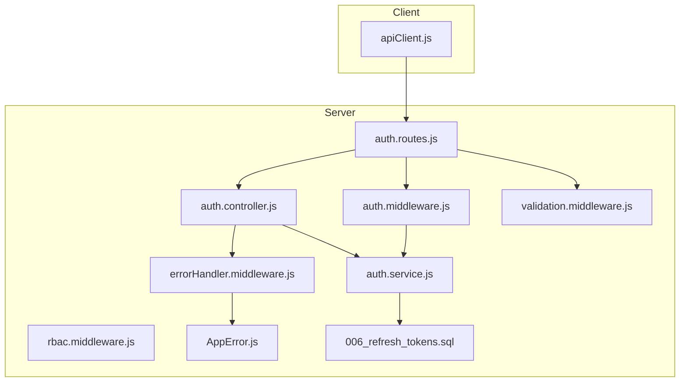
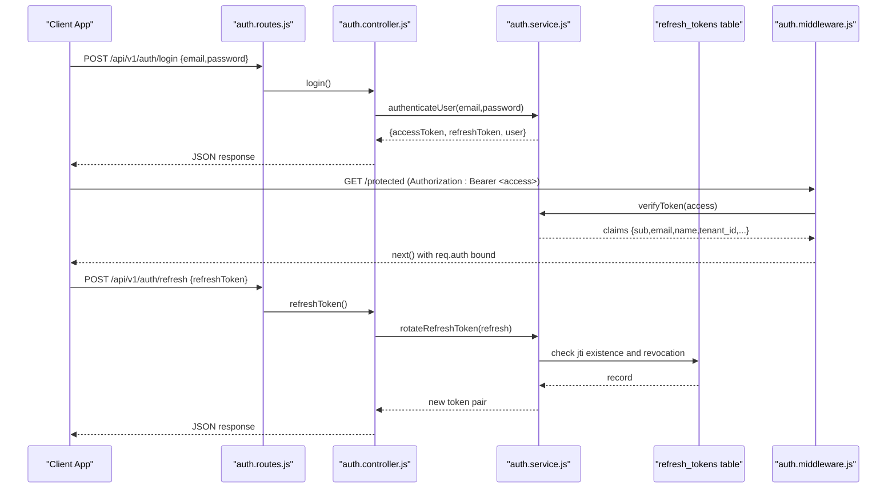
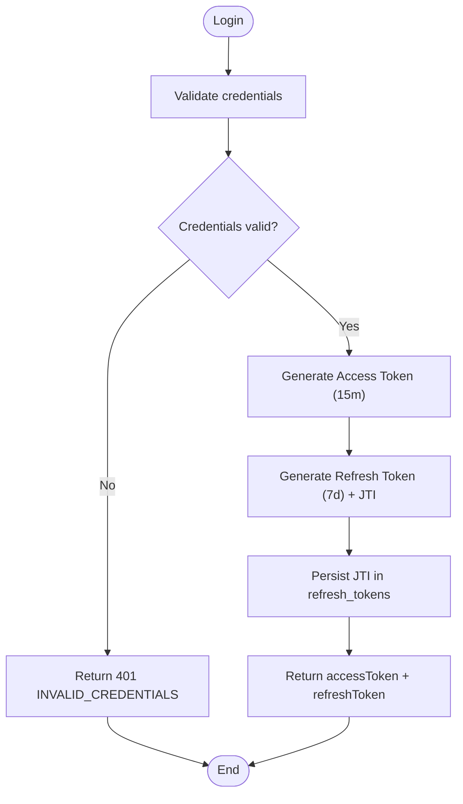
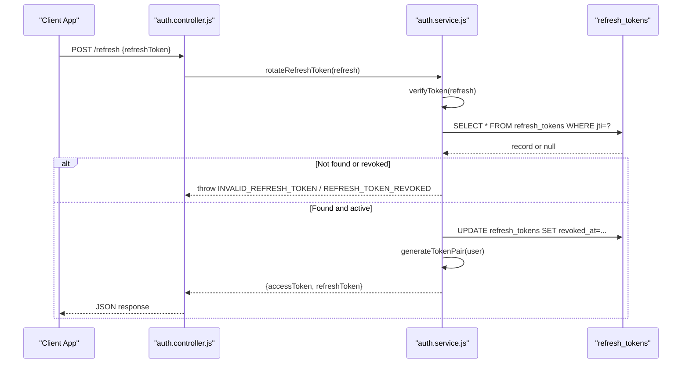
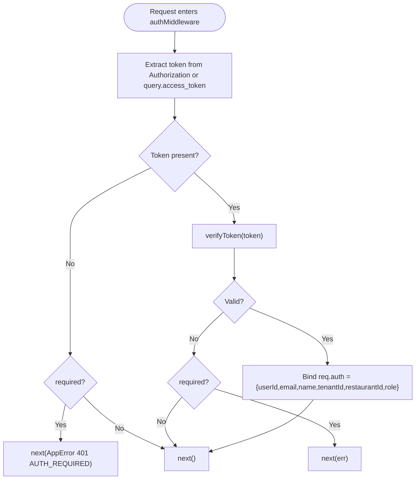
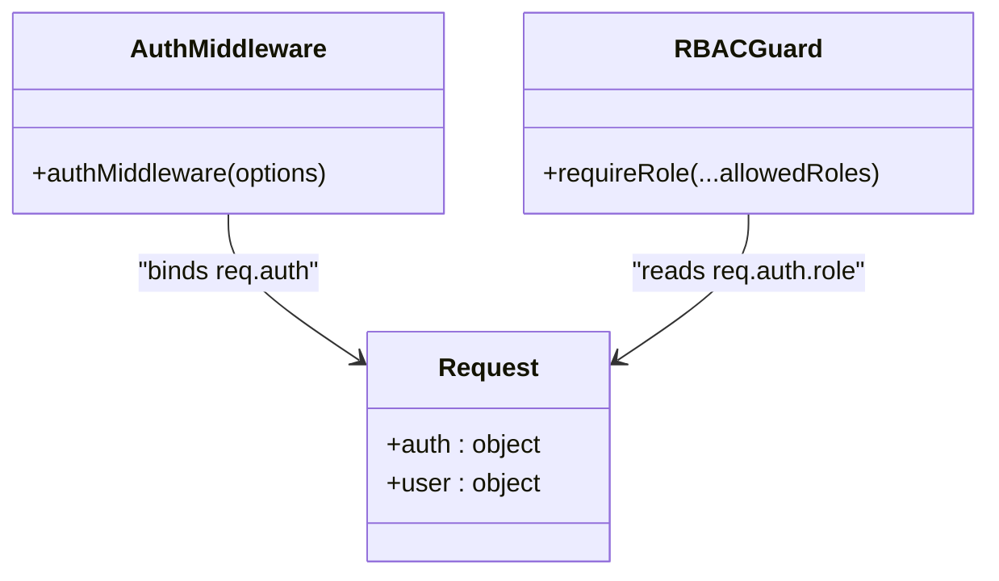
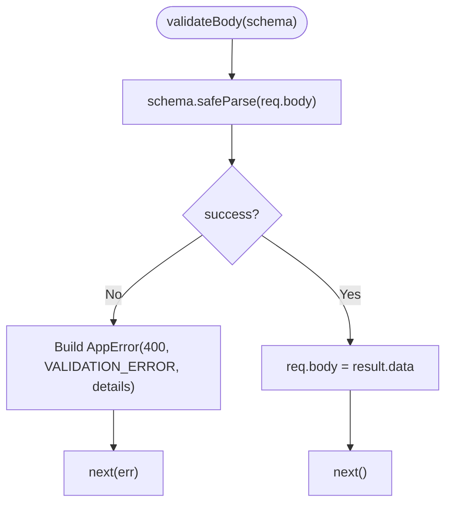
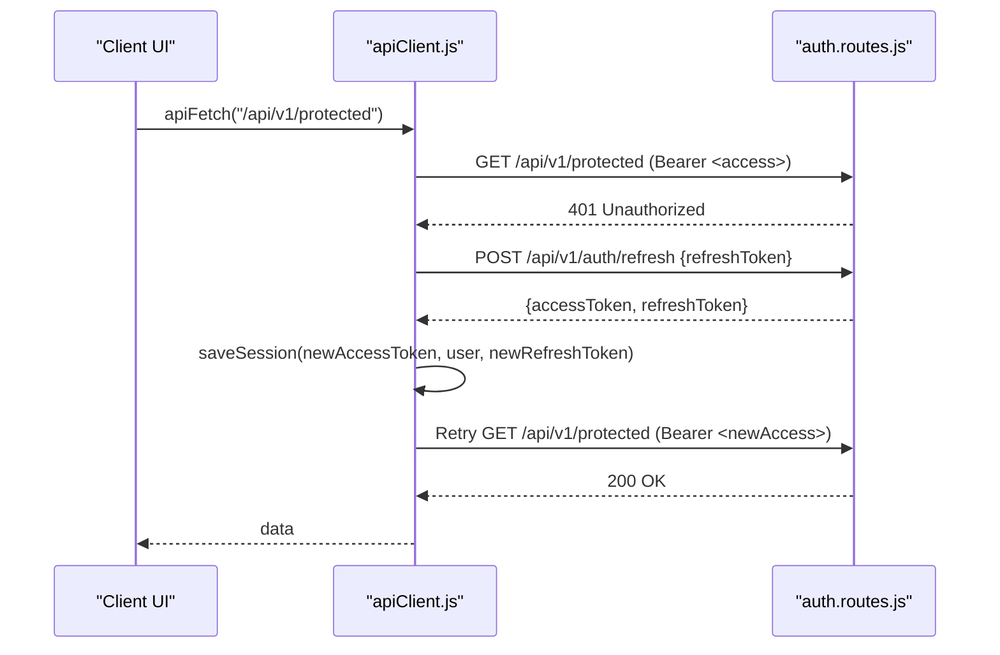
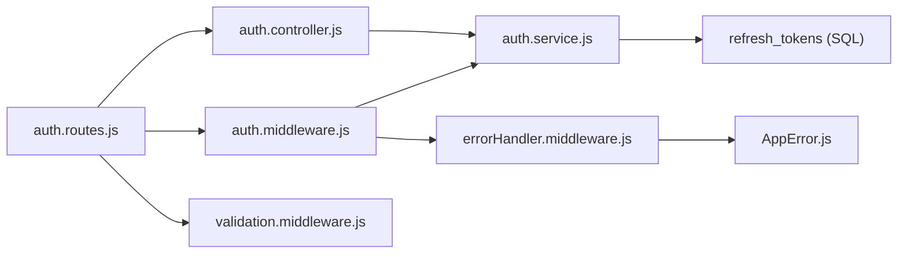

# Authentication System

<cite>
**Referenced Files in This Document**
- [auth.middleware.js](file://server/src/middleware/auth.middleware.js)
- [auth.service.js](file://server/src/services/auth.service.js)
- [auth.controller.js](file://server/src/controllers/auth.controller.js)
- [auth.routes.js](file://server/src/routes/auth.routes.js)
- [auth.schema.js](file://server/src/schemas/auth.schema.js)
- [validation.middleware.js](file://server/src/middleware/validation.middleware.js)
- [rbac.middleware.js](file://server/src/middleware/rbac.middleware.js)
- [AppError.js](file://server/src/utils/AppError.js)
- [errorHandler.middleware.js](file://server/src/middleware/errorHandler.middleware.js)
- [app.js](file://server/src/app.js)
- [006_refresh_tokens.sql](file://server/src/db/migrations/006_refresh_tokens.sql)
- [apiClient.js](file://client/src/services/apiClient.js)
</cite>

## Table of Contents
1. [Introduction](#introduction)
2. [Project Structure](#project-structure)
3. [Core Components](#core-components)
4. [Architecture Overview](#architecture-overview)
5. [Detailed Component Analysis](#detailed-component-analysis)
6. [Dependency Analysis](#dependency-analysis)
7. [Performance Considerations](#performance-considerations)
8. [Troubleshooting Guide](#troubleshooting-guide)
9. [Conclusion](#conclusion)
10. [Appendices](#appendices)

## Introduction
This document explains the Inkiro platform’s authentication system, focusing on JWT-based access tokens, refresh token rotation, middleware-driven authorization, tenant isolation, schema validation, error handling, and client-side token management. It provides practical guidance for protecting routes and managing tokens securely on the client.

## Project Structure
The authentication system spans server-side middleware, services, controllers, schemas, and routes, as well as a client API client that handles token storage and automatic refresh.

**Diagram sources**
- [auth.routes.js:1-13](file://server/src/routes/auth.routes.js#L1-L13)
- [auth.controller.js:1-53](file://server/src/controllers/auth.controller.js#L1-L53)
- [auth.service.js:1-203](file://server/src/services/auth.service.js#L1-L203)
- [auth.middleware.js:1-55](file://server/src/middleware/auth.middleware.js#L1-L55)
- [validation.middleware.js:1-48](file://server/src/middleware/validation.middleware.js#L1-L48)
- [rbac.middleware.js:1-32](file://server/src/middleware/rbac.middleware.js#L1-L32)
- [errorHandler.middleware.js:1-43](file://server/src/middleware/errorHandler.middleware.js#L1-L43)
- [AppError.js:1-20](file://server/src/utils/AppError.js#L1-L20)
- [006_refresh_tokens.sql:1-16](file://server/src/db/migrations/006_refresh_tokens.sql#L1-L16)
- [apiClient.js:1-128](file://client/src/services/apiClient.js#L1-L128)

**Section sources**
- [app.js:1-101](file://server/src/app.js#L1-L101)
- [auth.routes.js:1-13](file://server/src/routes/auth.routes.js#L1-L13)

## Core Components
- JWT token generation and verification with strict issuer, audience, and expiration enforcement.
- Refresh token rotation backed by a database ledger for instant revocation.
- Auth middleware that extracts Bearer tokens from headers or query parameters and binds identity to request objects.
- Role-based access control guard for fine-grained authorization.
- Zod-based input validation for login requests.
- Centralized error handling that standardizes responses and prevents sensitive information leakage.
- Client-side API client with automatic token refresh and session management.

**Section sources**
- [auth.service.js:47-120](file://server/src/services/auth.service.js#L47-L120)
- [auth.service.js:122-161](file://server/src/services/auth.service.js#L122-L161)
- [auth.middleware.js:1-55](file://server/src/middleware/auth.middleware.js#L1-L55)
- [rbac.middleware.js:1-32](file://server/src/middleware/rbac.middleware.js#L1-L32)
- [auth.schema.js:1-7](file://server/src/schemas/auth.schema.js#L1-L7)
- [validation.middleware.js:1-48](file://server/src/middleware/validation.middleware.js#L1-L48)
- [errorHandler.middleware.js:1-43](file://server/src/middleware/errorHandler.middleware.js#L1-L43)
- [apiClient.js:1-128](file://client/src/services/apiClient.js#L1-L128)

## Architecture Overview
The authentication flow combines server-side JWT issuance and verification with client-side token persistence and automatic refresh. Protected routes use middleware to extract and validate tokens, bind user identity (including tenant context), and enforce roles.

**Diagram sources**
- [auth.routes.js:1-13](file://server/src/routes/auth.routes.js#L1-L13)
- [auth.controller.js:1-53](file://server/src/controllers/auth.controller.js#L1-L53)
- [auth.service.js:47-161](file://server/src/services/auth.service.js#L47-L161)
- [auth.middleware.js:1-55](file://server/src/middleware/auth.middleware.js#L1-L55)
- [006_refresh_tokens.sql:1-16](file://server/src/db/migrations/006_refresh_tokens.sql#L1-L16)

## Detailed Component Analysis

### JWT Token Lifecycle
- Access tokens are short-lived (15 minutes) and include user identity and tenant context.
- Refresh tokens are longer-lived (7 days), stored in a database ledger, and rotated on each use to prevent reuse.
- Tokens are signed with HS256 using a strongly enforced secret and validated against expected issuer and audience.

**Diagram sources**
- [auth.controller.js:9-17](file://server/src/controllers/auth.controller.js#L9-L17)
- [auth.service.js:163-203](file://server/src/services/auth.service.js#L163-L203)
- [auth.service.js:74-105](file://server/src/services/auth.service.js#L74-L105)
- [006_refresh_tokens.sql:1-16](file://server/src/db/migrations/006_refresh_tokens.sql#L1-L16)

**Section sources**
- [auth.service.js:47-120](file://server/src/services/auth.service.js#L47-L120)
- [auth.service.js:74-105](file://server/src/services/auth.service.js#L74-L105)
- [auth.controller.js:9-17](file://server/src/controllers/auth.controller.js#L9-L17)

### Refresh Token Rotation
- The refresh endpoint validates the refresh token type and JTI, checks database registration and revocation status, revokes the used token, and issues a new token pair.

**Diagram sources**
- [auth.controller.js:19-30](file://server/src/controllers/auth.controller.js#L19-L30)
- [auth.service.js:122-161](file://server/src/services/auth.service.js#L122-L161)
- [006_refresh_tokens.sql:1-16](file://server/src/db/migrations/006_refresh_tokens.sql#L1-L16)

**Section sources**
- [auth.service.js:122-161](file://server/src/services/auth.service.js#L122-L161)
- [auth.controller.js:19-30](file://server/src/controllers/auth.controller.js#L19-L30)

### Auth Middleware and Identity Binding
- Extracts Bearer token from Authorization header or fallback to query parameter access_token.
- Verifies token and binds a server-authoritative identity object to req.auth (and alias req.user).
- Supports optional protection via options.required; when false, allows unauthenticated flow while still attaching identity if present.

**Diagram sources**
- [auth.middleware.js:1-55](file://server/src/middleware/auth.middleware.js#L1-L55)
- [auth.service.js:107-120](file://server/src/services/auth.service.js#L107-L120)

**Section sources**
- [auth.middleware.js:1-55](file://server/src/middleware/auth.middleware.js#L1-L55)

### Tenant Isolation and RBAC
- Tenant context is embedded in the token (tenant_id, restaurant_id) and available in req.auth for downstream logic to scope data per tenant.
- RBAC guard enforces role-based access using req.auth.role, with ADMIN override behavior.

**Diagram sources**
- [auth.middleware.js:1-55](file://server/src/middleware/auth.middleware.js#L1-L55)
- [rbac.middleware.js:1-32](file://server/src/middleware/rbac.middleware.js#L1-L32)

**Section sources**
- [auth.middleware.js:30-44](file://server/src/middleware/auth.middleware.js#L30-L44)
- [rbac.middleware.js:10-29](file://server/src/middleware/rbac.middleware.js#L10-L29)

### Schema Validation and Error Handling
- Login input is validated with Zod; errors are normalized into AppError with structured details.
- Centralized error handler converts AppError instances into consistent JSON responses and logs correlation IDs without leaking internals.

**Diagram sources**
- [validation.middleware.js:7-18](file://server/src/middleware/validation.middleware.js#L7-L18)
- [auth.schema.js:1-7](file://server/src/schemas/auth.schema.js#L1-L7)
- [errorHandler.middleware.js:1-43](file://server/src/middleware/errorHandler.middleware.js#L1-L43)
- [AppError.js:1-20](file://server/src/utils/AppError.js#L1-L20)

**Section sources**
- [validation.middleware.js:1-48](file://server/src/middleware/validation.middleware.js#L1-L48)
- [auth.schema.js:1-7](file://server/src/schemas/auth.schema.js#L1-L7)
- [errorHandler.middleware.js:1-43](file://server/src/middleware/errorHandler.middleware.js#L1-L43)
- [AppError.js:1-20](file://server/src/utils/AppError.js#L1-L20)

### Protected Route Configuration Examples
- Protect a route by applying authMiddleware({ required: true }) to require authentication.
- Combine with RBAC to restrict by role.

Examples:
- WebSocket ticket endpoint requires authentication:
  - [auth.routes.js:11](file://server/src/routes/auth.routes.js#L11)
- Current user info endpoint requires authentication:
  - [auth.routes.js:12](file://server/src/routes/auth.routes.js#L12)
- Example RBAC usage pattern:
  - [rbac.middleware.js:15-28](file://server/src/middleware/rbac.middleware.js#L15-L28)

**Section sources**
- [auth.routes.js:1-13](file://server/src/routes/auth.routes.js#L1-L13)
- [rbac.middleware.js:1-32](file://server/src/middleware/rbac.middleware.js#L1-L32)

### Client-Side Token Management
- Stores access token, refresh token, and user profile in localStorage.
- Automatically attaches Bearer token to requests.
- On 401, attempts refresh via /api/v1/auth/refresh; on success, retries original request; on failure, clears session.

**Diagram sources**
- [apiClient.js:68-128](file://client/src/services/apiClient.js#L68-L128)
- [auth.routes.js:1-13](file://server/src/routes/auth.routes.js#L1-L13)

**Section sources**
- [apiClient.js:1-128](file://client/src/services/apiClient.js#L1-L128)

## Dependency Analysis
- Routes depend on controllers and middleware for validation and authentication.
- Controllers delegate to services for business logic and token operations.
- Services interact with the database for refresh token ledger and user lookup.
- Middleware depends on services for token verification and on AppError for standardized errors.
- Error handler centralizes response formatting and logging.

**Diagram sources**
- [auth.routes.js:1-13](file://server/src/routes/auth.routes.js#L1-L13)
- [auth.controller.js:1-53](file://server/src/controllers/auth.controller.js#L1-L53)
- [auth.middleware.js:1-55](file://server/src/middleware/auth.middleware.js#L1-L55)
- [validation.middleware.js:1-48](file://server/src/middleware/validation.middleware.js#L1-L48)
- [auth.service.js:1-203](file://server/src/services/auth.service.js#L1-L203)
- [errorHandler.middleware.js:1-43](file://server/src/middleware/errorHandler.middleware.js#L1-L43)
- [AppError.js:1-20](file://server/src/utils/AppError.js#L1-L20)
- [006_refresh_tokens.sql:1-16](file://server/src/db/migrations/006_refresh_tokens.sql#L1-L16)

**Section sources**
- [auth.routes.js:1-13](file://server/src/routes/auth.routes.js#L1-L13)
- [auth.controller.js:1-53](file://server/src/controllers/auth.controller.js#L1-L53)
- [auth.service.js:1-203](file://server/src/services/auth.service.js#L1-L203)
- [auth.middleware.js:1-55](file://server/src/middleware/auth.middleware.js#L1-L55)
- [errorHandler.middleware.js:1-43](file://server/src/middleware/errorHandler.middleware.js#L1-L43)

## Performance Considerations
- Short-lived access tokens reduce exposure window and limit server-side state.
- Refresh token rotation with single-use semantics prevents replay attacks and enables immediate revocation.
- Database indexes on refresh_tokens improve lookup performance during rotation.
- Avoid storing secrets in tokens; keep only necessary claims (identity and tenant context).
- Use centralized error handling to minimize overhead and ensure consistent responses.

[No sources needed since this section provides general guidance]

## Troubleshooting Guide
Common issues and resolutions:
- Missing or invalid token: Ensure Authorization header contains a valid Bearer token or query access_token is provided.
- Invalid credentials: Check email/password format and account status.
- Refresh token not registered or revoked: Confirm the refresh token exists in the ledger and has not been revoked.
- Validation errors: Inspect request body against the login schema and correct field formats.
- Unexpected internal errors: Review server logs for correlation ID and stack traces; client will receive a safe message.

**Section sources**
- [auth.middleware.js:23-28](file://server/src/middleware/auth.middleware.js#L23-L28)
- [auth.service.js:163-183](file://server/src/services/auth.service.js#L163-L183)
- [auth.service.js:122-143](file://server/src/services/auth.service.js#L122-L143)
- [validation.middleware.js:7-18](file://server/src/middleware/validation.middleware.js#L7-L18)
- [errorHandler.middleware.js:9-36](file://server/src/middleware/errorHandler.middleware.js#L9-L36)

## Conclusion
Inkiro’s authentication system uses strong JWT practices with short-lived access tokens and secure refresh token rotation. Middleware enforces authentication and binds tenant-scoped identity to requests, while RBAC provides role-based access control. Input validation and centralized error handling ensure robustness and security. The client-side API client simplifies token management and automatically handles refresh flows.

[No sources needed since this section summarizes without analyzing specific files]

## Appendices

### Security Best Practices
- Enforce minimum JWT secret length at boot time.
- Set explicit issuer and audience for tokens to prevent cross-service misuse.
- Store refresh tokens server-side with unique JTI and support revocation.
- Limit token claims to minimal necessary identity and tenant context.
- Use HTTPS and configure CORS strictly to trusted origins.
- Apply RBAC to protect sensitive endpoints.

**Section sources**
- [auth.service.js:7-20](file://server/src/services/auth.service.js#L7-L20)
- [auth.service.js:47-72](file://server/src/services/auth.service.js#L47-L72)
- [auth.service.js:74-105](file://server/src/services/auth.service.js#L74-L105)
- [app.js:21-52](file://server/src/app.js#L21-L52)
- [rbac.middleware.js:1-32](file://server/src/middleware/rbac.middleware.js#L1-L32)