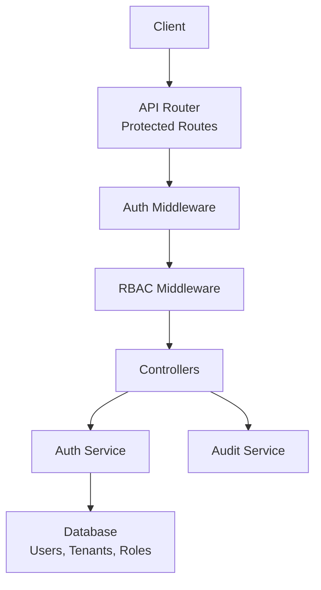
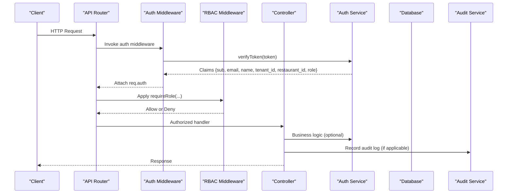
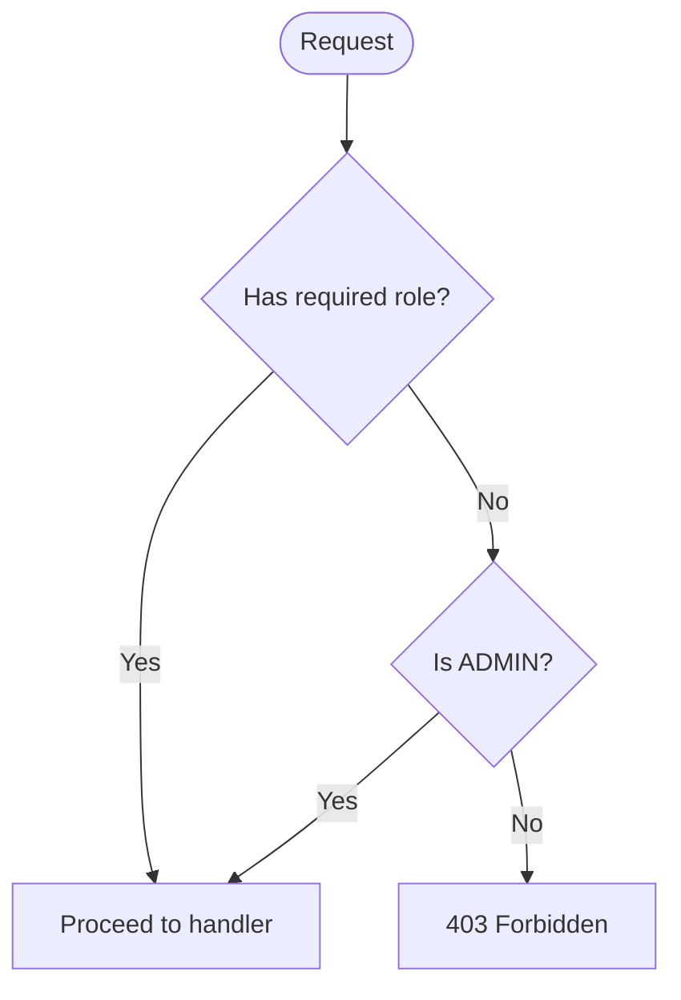
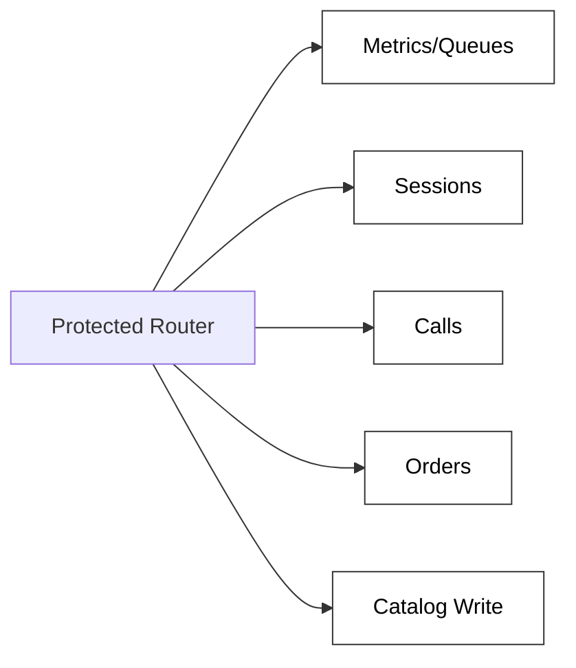
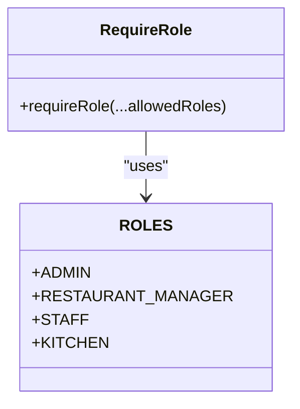
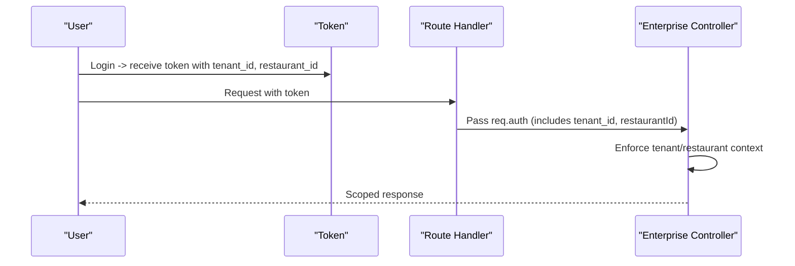
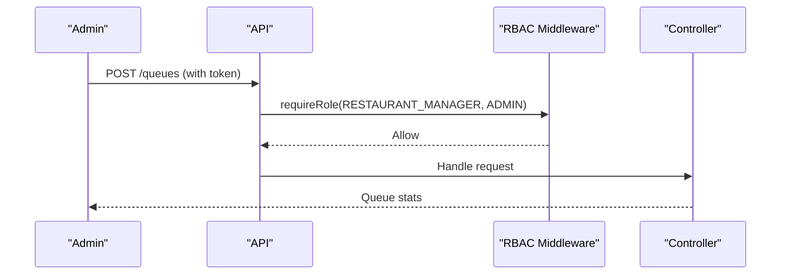
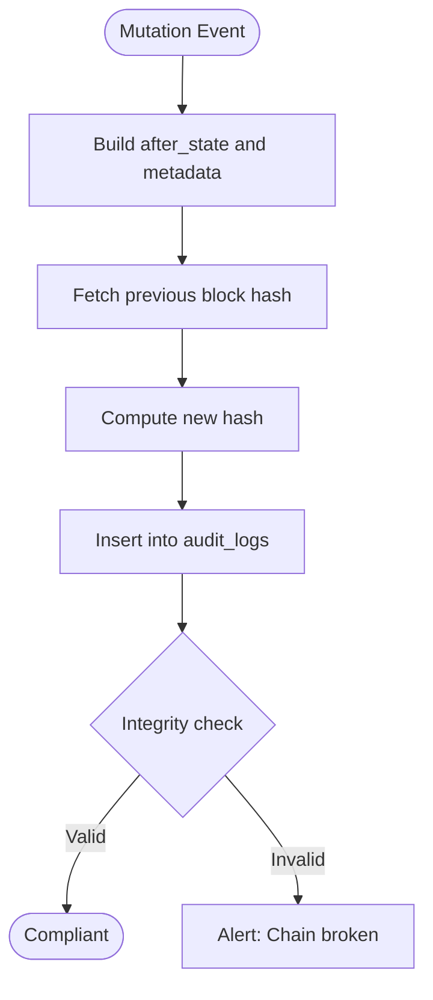
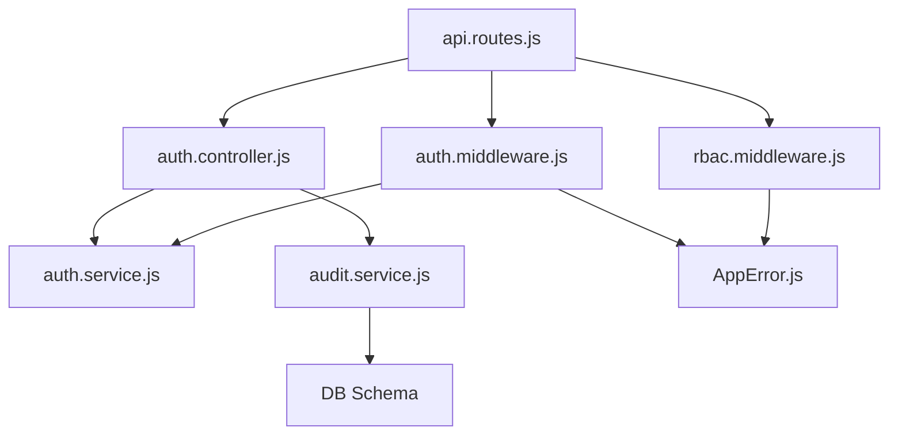

# Authorization & RBAC

<cite>
**Referenced Files in This Document**
- [auth.middleware.js](file://server/src/middleware/auth.middleware.js)
- [rbac.middleware.js](file://server/src/middleware/rbac.middleware.js)
- [rbacMiddleware.js](file://server/src/middleware/rbacMiddleware.js)
- [api.routes.js](file://server/src/routes/api.routes.js)
- [auth.controller.js](file://server/src/controllers/auth.controller.js)
- [auth.service.js](file://server/src/services/auth.service.js)
- [001_initial_multitenant_schema.sql](file://server/src/db/migrations/001_initial_multitenant_schema.sql)
- [002_audit_logs_and_metrics.sql](file://server/src/db/migrations/002_audit_logs_and_metrics.sql)
- [audit.service.js](file://server/src/services/audit.service.js)
- [enterprise.controller.js](file://server/src/controllers/enterprise.controller.js)
- [telephonyAuth.middleware.js](file://server/src/middleware/telephonyAuth.middleware.js)
- [AppError.js](file://server/src/utils/AppError.js)
</cite>

## Table of Contents
1. Introduction
2. Project Structure
3. Core Components
4. Architecture Overview
5. Detailed Component Analysis
6. Dependency Analysis
7. Performance Considerations
8. Troubleshooting Guide
9. Conclusion

## Introduction
This document explains the authorization and role-based access control (RBAC) implementation for the enterprise system. It covers role definitions, permission hierarchies, resource protection mechanisms, middleware behavior, multi-tenant scoping, admin-level operations, and security considerations including privilege escalation prevention and audit logging.

## Project Structure
Authorization is enforced through a layered approach:
- Authentication middleware validates JWTs and attaches user identity to requests.
- RBAC middleware enforces role checks on protected routes.
- Routes apply fine-grained permissions per endpoint.
- Services handle token lifecycle, password hashing, and refresh rotation.
- Database schema defines tenants, users, roles, and audit logs.
- Audit service records tamper-evident state changes for compliance.

**Diagram sources**
- [api.routes.js:25-118](file://server/src/routes/api.routes.js#L25-L118)
- [auth.middleware.js:10-51](file://server/src/middleware/auth.middleware.js#L10-L51)
- [rbac.middleware.js:15-29](file://server/src/middleware/rbac.middleware.js#L15-L29)
- [auth.controller.js:9-52](file://server/src/controllers/auth.controller.js#L9-L52)
- [auth.service.js:50-120](file://server/src/services/auth.service.js#L50-L120)
- [audit.service.js:19-77](file://server/src/services/audit.service.js#L19-L77)

**Section sources**
- [api.routes.js:25-118](file://server/src/routes/api.routes.js#L25-L118)
- [auth.middleware.js:10-51](file://server/src/middleware/auth.middleware.js#L10-L51)
- [rbac.middleware.js:15-29](file://server/src/middleware/rbac.middleware.js#L15-L29)

## Core Components
- Authentication middleware: Validates Bearer tokens or query tokens, decodes JWTs, and binds identity (userId, email, name, tenantId, restaurantId, role) to req.auth.
- RBAC middleware: Enforces that the authenticated user’s role is in an allowed set; ADMIN implicitly bypasses specific role checks.
- Route guards: Each protected route applies auth and role requirements to restrict access.
- Token services: Generate short-lived access tokens with tenant context, rotate refresh tokens with database-backed ledger, and authenticate credentials securely.
- Multi-tenant model: Users belong to tenants and restaurants; tokens carry tenant_id and restaurant_id to scope data and operations.
- Audit logging: Immutable hash-chained audit entries record actor, action, resource, and state transitions.

**Section sources**
- [auth.middleware.js:10-51](file://server/src/middleware/auth.middleware.js#L10-L51)
- [rbac.middleware.js:3-29](file://server/src/middleware/rbac.middleware.js#L3-L29)
- [api.routes.js:25-118](file://server/src/routes/api.routes.js#L25-L118)
- [auth.service.js:26-120](file://server/src/services/auth.service.js#L26-L120)
- [001_initial_multitenant_schema.sql:12-32](file://server/src/db/migrations/001_initial_multitenant_schema.sql#L12-L32)
- [audit.service.js:19-77](file://server/src/services/audit.service.js#L19-L77)

## Architecture Overview
The authorization flow combines authentication and authorization at the request boundary, then delegates to controllers and services while enforcing multi-tenant isolation and auditability.

**Diagram sources**
- [auth.middleware.js:10-51](file://server/src/middleware/auth.middleware.js#L10-L51)
- [auth.service.js:110-120](file://server/src/services/auth.service.js#L110-L120)
- [rbac.middleware.js:15-29](file://server/src/middleware/rbac.middleware.js#L15-L29)
- [api.routes.js:25-118](file://server/src/routes/api.routes.js#L25-L118)
- [audit.service.js:19-77](file://server/src/services/audit.service.js#L19-L77)

## Detailed Component Analysis

### Role Definitions and Permission Hierarchy
- Roles:
  - ADMIN: Global administrative access; bypasses specific role checks in RBAC guard.
  - RESTAURANT_MANAGER: Manages metrics, queues, catalog modifications, dispute resolution.
  - STAFF: Reads calls, orders; flags disputes; views sessions within tenant/restaurant scope.
  - KITCHEN: Access to order management and kitchen display features.
- Permission patterns:
  - Read-only endpoints often allow STAFF and above.
  - Write endpoints are restricted to higher roles (e.g., catalog updates to managers/admin).
  - Admin-level operations include queue stats, audit verification, and feature flag management.

**Diagram sources**
- [rbac.middleware.js:15-29](file://server/src/middleware/rbac.middleware.js#L15-L29)

**Section sources**
- [rbac.middleware.js:3-29](file://server/src/middleware/rbac.middleware.js#L3-L29)
- [api.routes.js:29-116](file://server/src/routes/api.routes.js#L29-L116)

### Resource Protection Mechanisms
- Protected boundary: All sensitive routes are under a protected router requiring authentication.
- Endpoint-level guards: Each route specifies allowed roles using requireRole(...).
- Examples:
  - Metrics and queues: RESTAURANT_MANAGER or ADMIN.
  - Sessions listing: STAFF or above, scoped by tenant/restaurant.
  - Calls and orders: STAFF/KITCHEN or above.
  - Catalog write: RESTAURANT_MANAGER or ADMIN.

**Diagram sources**
- [api.routes.js:25-118](file://server/src/routes/api.routes.js#L25-L118)

**Section sources**
- [api.routes.js:25-118](file://server/src/routes/api.routes.js#L25-L118)

### RBAC Middleware Functionality
- Behavior:
  - Extracts role from req.auth or req.user.
  - Requires at least one allowed role; ADMIN always passes.
  - Returns standardized errors via AppError for missing auth or forbidden access.
- Backward compatibility:
  - Deprecated alias module re-exports the same functions.

**Diagram sources**
- [rbac.middleware.js:3-29](file://server/src/middleware/rbac.middleware.js#L3-L29)
- [rbacMiddleware.js:1-5](file://server/src/middleware/rbacMiddleware.js#L1-L5)

**Section sources**
- [rbac.middleware.js:15-29](file://server/src/middleware/rbac.middleware.js#L15-L29)
- [rbacMiddleware.js:1-5](file://server/src/middleware/rbacMiddleware.js#L1-L5)
- [AppError.js:7-17](file://server/src/utils/AppError.js#L7-L17)

### Multi-Tenant Integration
- Tenant and restaurant scoping:
  - Tokens include tenant_id and restaurant_id.
  - Controllers enforce context and filter resources accordingly.
  - Session listing respects tenant boundaries and allows ADMIN to view across restaurants.
- Data isolation:
  - Users and resources reference tenant_id and restaurant_id in the schema.

**Diagram sources**
- [auth.service.js:50-71](file://server/src/services/auth.service.js#L50-L71)
- [enterprise.controller.js:14-23](file://server/src/controllers/enterprise.controller.js#L14-L23)
- [001_initial_multitenant_schema.sql:12-32](file://server/src/db/migrations/001_initial_multitenant_schema.sql#L12-L32)

**Section sources**
- [auth.service.js:50-71](file://server/src/services/auth.service.js#L50-L71)
- [enterprise.controller.js:14-23](file://server/src/controllers/enterprise.controller.js#L14-L23)
- [001_initial_multitenant_schema.sql:12-32](file://server/src/db/migrations/001_initial_multitenant_schema.sql#L12-L32)

### Role Assignment and Permission Validation Examples
- Role assignment:
  - User roles are stored in the users table and included in issued tokens.
- Permission validation:
  - Endpoints declare allowed roles; middleware enforces them before controller execution.
- Admin-level operations:
  - Queue stats, audit chain verification, and feature flag management are restricted to managers/admins.

**Diagram sources**
- [api.routes.js:29-33](file://server/src/routes/api.routes.js#L29-L33)
- [rbac.middleware.js:15-29](file://server/src/middleware/rbac.middleware.js#L15-L29)

**Section sources**
- [001_initial_multitenant_schema.sql:22-32](file://server/src/db/migrations/001_initial_multitenant_schema.sql#L22-L32)
- [api.routes.js:29-33](file://server/src/routes/api.routes.js#L29-L33)
- [rbac.middleware.js:15-29](file://server/src/middleware/rbac.middleware.js#L15-L29)

### Security Considerations
- Privilege escalation prevention:
  - RBAC guard explicitly checks against allowed roles; ADMIN bypass is intentional but limited to role checks only.
  - Context enforcement ensures tenant/restaurant scoping even for privileged roles where applicable.
- Token security:
  - Short-lived access tokens with strict issuer/audience.
  - Refresh tokens persisted in DB with single-use rotation and revocation support.
  - Password hashing uses PBKDF2 with strong iterations and timing-safe comparison.
- Telephony webhook authenticity:
  - Verifies provider signatures to prevent spoofed callbacks.
- Audit integrity:
  - Cryptographic hash chain ensures tamper-evidence for state mutations.

**Section sources**
- [rbac.middleware.js:15-29](file://server/src/middleware/rbac.middleware.js#L15-L29)
- [auth.service.js:26-161](file://server/src/services/auth.service.js#L26-L161)
- [telephonyAuth.middleware.js:10-92](file://server/src/middleware/telephonyAuth.middleware.js#L10-L92)
- [audit.service.js:19-77](file://server/src/services/audit.service.js#L19-L77)

### Audit Logging and Compliance
- Audit trail:
  - Records actor type, action, resource type/id, before/after states, metadata, and cryptographic hashes.
- Verification:
  - Integrity check validates previous_hash and computed hash across the chain per restaurant.
- Admin exposure:
  - Audit verification endpoint accessible to authorized roles.

**Diagram sources**
- [audit.service.js:19-77](file://server/src/services/audit.service.js#L19-L77)
- [audit.service.js:96-141](file://server/src/services/audit.service.js#L96-L141)
- [002_audit_logs_and_metrics.sql:7-22](file://server/src/db/migrations/002_audit_logs_and_metrics.sql#L7-L22)

**Section sources**
- [audit.service.js:19-77](file://server/src/services/audit.service.js#L19-L77)
- [audit.service.js:96-141](file://server/src/services/audit.service.js#L96-L141)
- [002_audit_logs_and_metrics.sql:7-22](file://server/src/db/migrations/002_audit_logs_and_metrics.sql#L7-L22)
- [enterprise.controller.js:75-83](file://server/src/controllers/enterprise.controller.js#L75-L83)

## Dependency Analysis
Authorization components depend on each other in a clear chain:
- Routes import and compose auth and rbac middleware.
- Controllers rely on services for token operations and business logic.
- Audit service depends on database and crypto utilities.
- Error handling is centralized via AppError.

**Diagram sources**
- [api.routes.js:1-118](file://server/src/routes/api.routes.js#L1-L118)
- [auth.middleware.js:1-51](file://server/src/middleware/auth.middleware.js#L1-L51)
- [rbac.middleware.js:1-29](file://server/src/middleware/rbac.middleware.js#L1-L29)
- [auth.controller.js:1-52](file://server/src/controllers/auth.controller.js#L1-L52)
- [auth.service.js:1-120](file://server/src/services/auth.service.js#L1-L120)
- [audit.service.js:1-77](file://server/src/services/audit.service.js#L1-L77)
- [AppError.js:1-20](file://server/src/utils/AppError.js#L1-L20)

**Section sources**
- [api.routes.js:1-118](file://server/src/routes/api.routes.js#L1-L118)
- [auth.middleware.js:1-51](file://server/src/middleware/auth.middleware.js#L1-L51)
- [rbac.middleware.js:1-29](file://server/src/middleware/rbac.middleware.js#L1-L29)
- [auth.controller.js:1-52](file://server/src/controllers/auth.controller.js#L1-L52)
- [auth.service.js:1-120](file://server/src/services/auth.service.js#L1-L120)
- [audit.service.js:1-77](file://server/src/services/audit.service.js#L1-L77)
- [AppError.js:1-20](file://server/src/utils/AppError.js#L1-L20)

## Performance Considerations
- Token verification is lightweight and cached at runtime; ensure JWT secrets are configured securely to avoid startup failures.
- Refresh token rotation involves DB reads/writes; consider indexing refresh_tokens.jti for performance.
- Audit logging writes per mutation; batch or async strategies can reduce latency if needed.
- RBAC checks are constant-time role comparisons; keep role sets minimal per route.

[No sources needed since this section provides general guidance]

## Troubleshooting Guide
- 401 Unauthorized:
  - Missing or invalid Bearer token; verify token presence and validity.
  - Expired or revoked refresh token during rotation.
- 403 Forbidden:
  - Insufficient role; confirm user role and endpoint requirements.
- Audit chain integrity:
  - Use verification endpoint to detect tampering; investigate mismatched hashes.
- Telephony webhooks:
  - Ensure provider signature headers match expected values; check environment tokens.

**Section sources**
- [auth.middleware.js:23-50](file://server/src/middleware/auth.middleware.js#L23-L50)
- [auth.service.js:125-161](file://server/src/services/auth.service.js#L125-L161)
- [rbac.middleware.js:15-29](file://server/src/middleware/rbac.middleware.js#L15-L29)
- [audit.service.js:96-141](file://server/src/services/audit.service.js#L96-L141)
- [telephonyAuth.middleware.js:58-92](file://server/src/middleware/telephonyAuth.middleware.js#L58-L92)

## Conclusion
The system implements robust RBAC with clear role definitions, middleware-driven enforcement, and multi-tenant scoping. Token lifecycle management and secure password handling protect identities, while cryptographic audit logging ensures compliance and traceability. Admin-level operations are gated behind strict roles, and telephony integrations validate provider signatures to prevent spoofing. Together, these mechanisms provide a secure, auditable authorization foundation suitable for enterprise use.