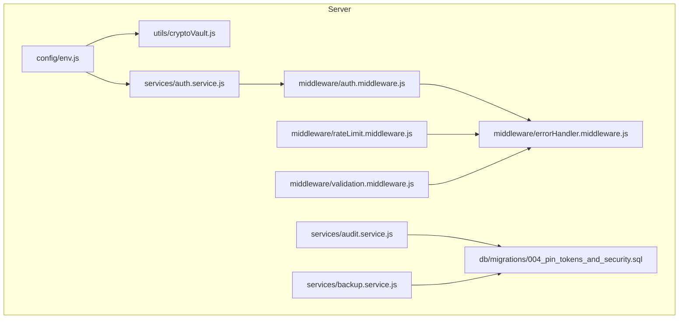
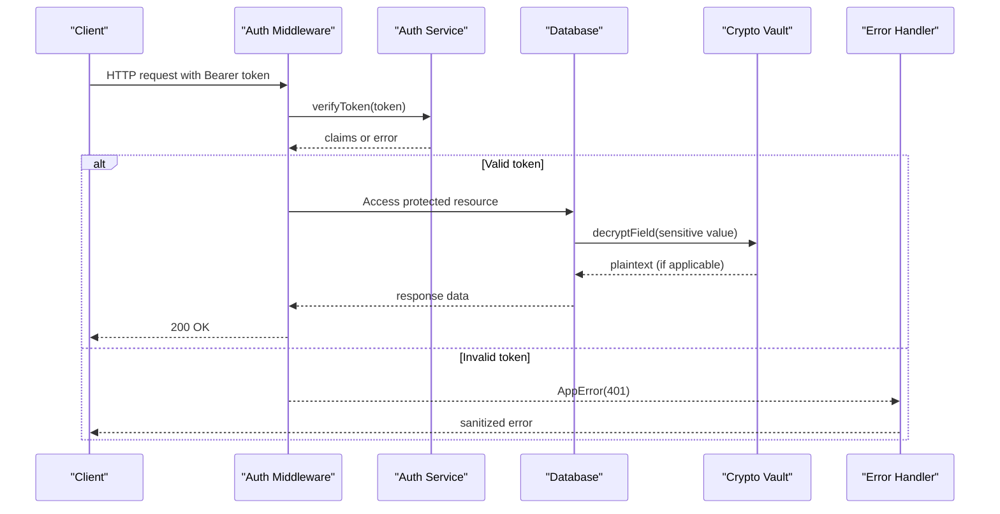
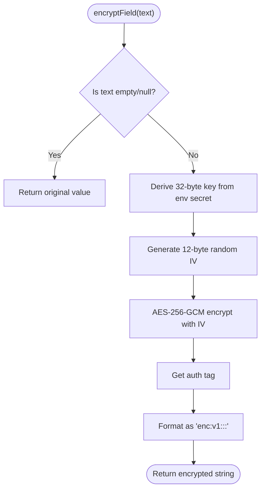
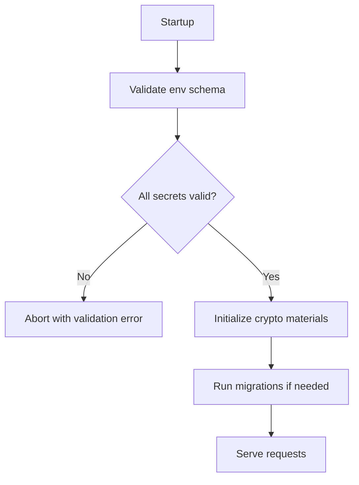
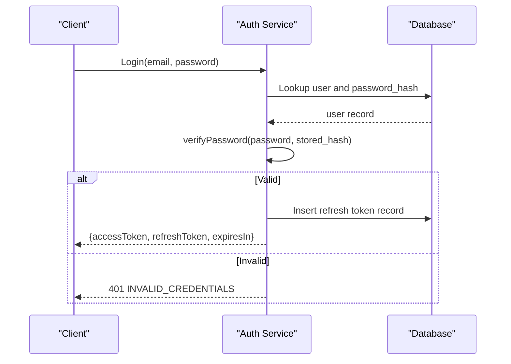
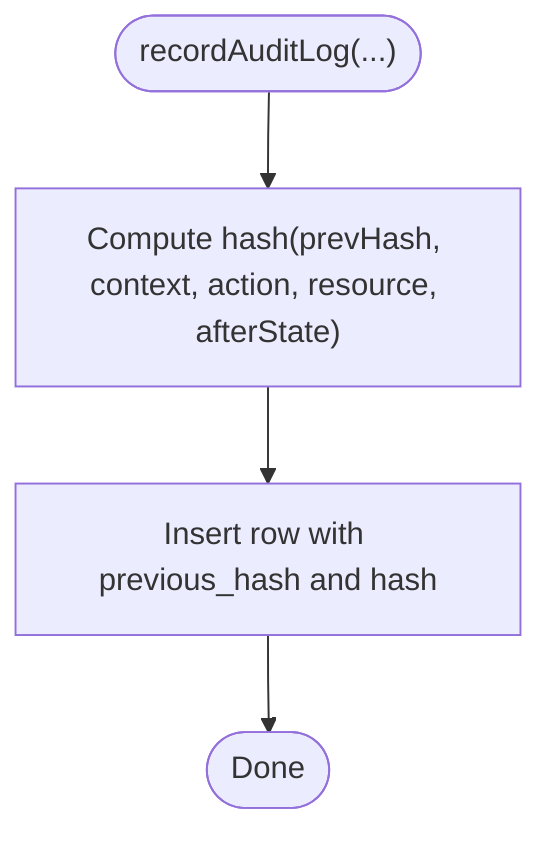
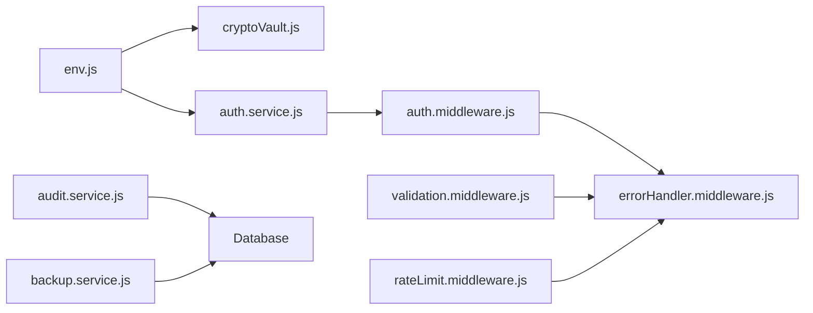

# Cryptographic Security

<cite>
**Referenced Files in This Document**
- [cryptoVault.js](file://server/src/utils/cryptoVault.js)
- [env.js](file://server/src/config/env.js)
- [auth.service.js](file://server/src/services/auth.service.js)
- [auth.middleware.js](file://server/src/middleware/auth.middleware.js)
- [rateLimit.middleware.js](file://server/src/middleware/rateLimit.middleware.js)
- [validation.middleware.js](file://server/src/middleware/validation.middleware.js)
- [errorHandler.middleware.js](file://server/src/middleware/errorHandler.middleware.js)
- [AppError.js](file://server/src/utils/AppError.js)
- [004_pin_tokens_and_security.sql](file://server/src/db/migrations/004_pin_tokens_and_security.sql)
- [audit.service.js](file://server/src/services/audit.service.js)
- [backup.service.js](file://server/src/services/backup.service.js)
</cite>

## Table of Contents
1. Introduction
2. Project Structure
3. Core Components
4. Architecture Overview
5. Detailed Component Analysis
6. Dependency Analysis
7. Performance Considerations
8. Troubleshooting Guide
9. Conclusion
10. Appendices

## Introduction
This document explains the cryptographic security mechanisms implemented to protect sensitive data, including secrets, API keys, and encryption keys. It covers the crypto vault for encrypting PII at rest, secure environment variable management, key derivation, secure random number generation, token-based authentication, rate limiting, validation, error handling, audit logging with a tamper-evident hash chain, and backup procedures. The goal is to provide clear guidance for production deployments while addressing compliance requirements such as data protection, integrity, and confidentiality.

## Project Structure
The cryptographic controls are primarily implemented in the server module:
- Encryption utilities for field-level encryption and decryption
- Environment configuration and validation
- Authentication and authorization middleware
- Rate limiting and input validation
- Centralized error handling
- Audit logging with cryptographic chaining
- Database backups for disaster recovery

**Diagram sources**
- [env.js:1-42](file://server/src/config/env.js#L1-L42)
- [cryptoVault.js:1-59](file://server/src/utils/cryptoVault.js#L1-L59)
- [auth.service.js:1-203](file://server/src/services/auth.service.js#L1-L203)
- [auth.middleware.js:1-55](file://server/src/middleware/auth.middleware.js#L1-L55)
- [rateLimit.middleware.js:1-52](file://server/src/middleware/rateLimit.middleware.js#L1-L52)
- [validation.middleware.js:1-48](file://server/src/middleware/validation.middleware.js#L1-L48)
- [errorHandler.middleware.js:1-43](file://server/src/middleware/errorHandler.middleware.js#L1-L43)
- [audit.service.js:1-142](file://server/src/services/audit.service.js#L1-L142)
- [004_pin_tokens_and_security.sql:1-23](file://server/src/db/migrations/004_pin_tokens_and_security.sql#L1-L23)
- [backup.service.js:1-50](file://server/src/services/backup.service.js#L1-L50)

**Section sources**
- [env.js:1-42](file://server/src/config/env.js#L1-L42)
- [cryptoVault.js:1-59](file://server/src/utils/cryptoVault.js#L1-L59)
- [auth.service.js:1-203](file://server/src/services/auth.service.js#L1-L203)
- [auth.middleware.js:1-55](file://server/src/middleware/auth.middleware.js#L1-L55)
- [rateLimit.middleware.js:1-52](file://server/src/middleware/rateLimit.middleware.js#L1-L52)
- [validation.middleware.js:1-48](file://server/src/middleware/validation.middleware.js#L1-L48)
- [errorHandler.middleware.js:1-43](file://server/src/middleware/errorHandler.middleware.js#L1-L43)
- [audit.service.js:1-142](file://server/src/services/audit.service.js#L1-L142)
- [004_pin_tokens_and_security.sql:1-23](file://server/src/db/migrations/004_pin_tokens_and_security.sql#L1-L23)
- [backup.service.js:1-50](file://server/src/services/backup.service.js#L1-L50)

## Core Components
- Crypto Vault: Field-level encryption using AES-256-GCM with per-field IVs and authenticated tags; derived key from an environment-provided secret.
- Environment Configuration: Strict schema validation for all secrets and keys, enforcing minimum lengths and required values.
- Authentication: JWT access and refresh tokens with HS256, short-lived access tokens, single-use refresh rotation, and database-backed ledger.
- Password Security: PBKDF2 hashing with unique salts and high iteration count; constant-time comparison.
- Input Validation and Rate Limiting: Zod-based validation and per-endpoint rate limits to mitigate abuse.
- Error Handling: Centralized handler that prevents leaking internal details to clients.
- Audit Trail: Tamper-evident hash chain for critical state changes.
- Backups: Point-in-time snapshots with integrity checks.

**Section sources**
- [cryptoVault.js:1-59](file://server/src/utils/cryptoVault.js#L1-L59)
- [env.js:1-42](file://server/src/config/env.js#L1-L42)
- [auth.service.js:1-203](file://server/src/services/auth.service.js#L1-L203)
- [rateLimit.middleware.js:1-52](file://server/src/middleware/rateLimit.middleware.js#L1-L52)
- [validation.middleware.js:1-48](file://server/src/middleware/validation.middleware.js#L1-L48)
- [errorHandler.middleware.js:1-43](file://server/src/middleware/errorHandler.middleware.js#L1-L43)
- [audit.service.js:1-142](file://server/src/services/audit.service.js#L1-L142)
- [backup.service.js:1-50](file://server/src/services/backup.service.js#L1-L50)

## Architecture Overview
The system applies defense-in-depth across layers:
- Secrets and keys are validated at startup and used to derive cryptographic material.
- Sensitive fields are encrypted before persistence and decrypted only when needed.
- Authentication enforces identity and scope via short-lived tokens.
- Inputs are validated and rate-limited to reduce attack surface.
- Errors are sanitized to avoid information leakage.
- Audit logs form a verifiable chain for compliance.
- Backups ensure recoverability with integrity verification.

**Diagram sources**
- [auth.middleware.js:1-55](file://server/src/middleware/auth.middleware.js#L1-L55)
- [auth.service.js:1-203](file://server/src/services/auth.service.js#L1-L203)
- [cryptoVault.js:1-59](file://server/src/utils/cryptoVault.js#L1-L59)
- [errorHandler.middleware.js:1-43](file://server/src/middleware/errorHandler.middleware.js#L1-L43)

## Detailed Component Analysis

### Crypto Vault: Secure Storage of Secrets and PII
- Algorithm selection: AES-256-GCM provides authenticated encryption with associated data (AEAD), ensuring confidentiality and integrity.
- Key derivation: A SHA-256 digest of the raw environment secret produces a fixed-length key suitable for AES-256-GCM.
- Randomness: Per-operation 12-byte IV generated via cryptographically secure random bytes.
- Format: Encrypted payloads use a structured prefix containing version, IV, auth tag, and ciphertext for safe transport and parsing.
- Decryption safety: Non-conforming inputs bypass decryption; failures return sanitized fallbacks to avoid leaking internals.

**Diagram sources**
- [cryptoVault.js:1-59](file://server/src/utils/cryptoVault.js#L1-L59)

**Section sources**
- [cryptoVault.js:1-59](file://server/src/utils/cryptoVault.js#L1-L59)

### Environment Variable Management and Key Rotation
- Validation: All secrets are parsed through a strict schema that enforces types, ranges, and minimum lengths. Missing or invalid values fail fast at startup.
- Production posture: In non-production environments, defaults are provided for convenience; in production, strong secrets must be configured explicitly.
- Rotation strategy:
  - Rotate ENCRYPTION_KEY by provisioning a new secret and re-encrypting stored fields with the new key. Maintain a migration path to support decryption with previous keys during transition.
  - Rotate JWT_SECRET by issuing new tokens and invalidating old ones; enforce short-lived access tokens to minimize exposure.
  - For refresh tokens, rely on single-use rotation and revocation to limit reuse risk.

**Diagram sources**
- [env.js:1-42](file://server/src/config/env.js#L1-L42)

**Section sources**
- [env.js:1-42](file://server/src/config/env.js#L1-L42)

### Authentication and Token Lifecycle
- Password hashing: PBKDF2 with unique per-user salt and a high iteration count; constant-time comparison to prevent timing attacks.
- Tokens: HS256-signed JWTs with explicit issuer and audience; short-lived access tokens (minutes) and longer-lived refresh tokens (days).
- Refresh rotation: Single-use refresh tokens backed by a database ledger; rotation revokes the prior refresh token atomically.
- Middleware: Extracts and verifies tokens, attaches authoritative identity to the request context.

**Diagram sources**
- [auth.service.js:1-203](file://server/src/services/auth.service.js#L1-L203)

**Section sources**
- [auth.service.js:1-203](file://server/src/services/auth.service.js#L1-L203)
- [auth.middleware.js:1-55](file://server/src/middleware/auth.middleware.js#L1-L55)

### Input Validation and Rate Limiting
- Validation: Zod schemas validate request bodies, queries, and parameters, returning structured errors without exposing internals.
- Rate limiting: Endpoint-specific limits protect against brute-force and abuse, with standardized headers and consistent error responses.

**Section sources**
- [validation.middleware.js:1-48](file://server/src/middleware/validation.middleware.js#L1-L48)
- [rateLimit.middleware.js:1-52](file://server/src/middleware/rateLimit.middleware.js#L1-L52)

### Error Handling and Information Disclosure Prevention
- Centralized handler maps application errors to sanitized HTTP responses, preventing leaks of stack traces, SQL, or paths.
- Structured logging captures correlation IDs and contextual metadata for observability.

**Section sources**
- [errorHandler.middleware.js:1-43](file://server/src/middleware/errorHandler.middleware.js#L1-L43)
- [AppError.js:1-20](file://server/src/utils/AppError.js#L1-L20)

### Audit Trail and Data Integrity
- Hash chain: Each audit block includes a hash computed over previous hash, tenant/restaurant context, action, resource type, resource ID, and after-state snapshot.
- Verification: A verifier walks the chain to detect any tampering and reports the first broken block.
- PIN tokens: Single-use cryptographic confirmation tokens with expiration and usage tracking.

**Diagram sources**
- [audit.service.js:1-142](file://server/src/services/audit.service.js#L1-L142)
- [004_pin_tokens_and_security.sql:1-23](file://server/src/db/migrations/004_pin_tokens_and_security.sql#L1-L23)

**Section sources**
- [audit.service.js:1-142](file://server/src/services/audit.service.js#L1-L142)
- [004_pin_tokens_and_security.sql:1-23](file://server/src/db/migrations/004_pin_tokens_and_security.sql#L1-L23)

### Backup and Disaster Recovery
- Automated snapshots: SQLite WAL checkpoint followed by VACUUM INTO to produce a consistent backup file.
- Integrity check: Post-backup integrity verification ensures the snapshot is usable.
- Logging: Timestamped logs capture success/failure and size metrics.

**Section sources**
- [backup.service.js:1-50](file://server/src/services/backup.service.js#L1-L50)

## Dependency Analysis
- Crypto Vault depends on Node’s crypto module and environment variables for key material.
- Auth service depends on crypto for PBKDF2 and jose for JWT operations; it also interacts with the database for refresh token ledger and user lookup.
- Middleware components depend on shared error types and logger for consistent behavior.
- Audit service depends on database for persistent hash chains and uses crypto for hashing.
- Backup service depends on database pragmas and filesystem for snapshot creation.

**Diagram sources**
- [env.js:1-42](file://server/src/config/env.js#L1-L42)
- [cryptoVault.js:1-59](file://server/src/utils/cryptoVault.js#L1-L59)
- [auth.service.js:1-203](file://server/src/services/auth.service.js#L1-L203)
- [auth.middleware.js:1-55](file://server/src/middleware/auth.middleware.js#L1-L55)
- [validation.middleware.js:1-48](file://server/src/middleware/validation.middleware.js#L1-L48)
- [rateLimit.middleware.js:1-52](file://server/src/middleware/rateLimit.middleware.js#L1-L52)
- [errorHandler.middleware.js:1-43](file://server/src/middleware/errorHandler.middleware.js#L1-L43)
- [audit.service.js:1-142](file://server/src/services/audit.service.js#L1-L142)
- [backup.service.js:1-50](file://server/src/services/backup.service.js#L1-L50)

**Section sources**
- [env.js:1-42](file://server/src/config/env.js#L1-L42)
- [cryptoVault.js:1-59](file://server/src/utils/cryptoVault.js#L1-L59)
- [auth.service.js:1-203](file://server/src/services/auth.service.js#L1-L203)
- [auth.middleware.js:1-55](file://server/src/middleware/auth.middleware.js#L1-L55)
- [validation.middleware.js:1-48](file://server/src/middleware/validation.middleware.js#L1-L48)
- [rateLimit.middleware.js:1-52](file://server/src/middleware/rateLimit.middleware.js#L1-L52)
- [errorHandler.middleware.js:1-43](file://server/src/middleware/errorHandler.middleware.js#L1-L43)
- [audit.service.js:1-142](file://server/src/services/audit.service.js#L1-L142)
- [backup.service.js:1-50](file://server/src/services/backup.service.js#L1-L50)

## Performance Considerations
- AES-256-GCM encryption/decryption is efficient; ensure batching where possible and avoid encrypting large payloads unnecessarily.
- PBKDF2 iterations are intentionally high to resist brute force; consider tuning based on hardware while maintaining security margins.
- JWT signing/verification is lightweight; keep payloads minimal to reduce overhead.
- Rate limiting should be tuned per endpoint to balance security and usability.
- Audit hashing adds minimal overhead but provides strong integrity guarantees; consider periodic verification jobs.

[No sources needed since this section provides general guidance]

## Troubleshooting Guide
- Decryption failures: If encrypted fields cannot be decrypted, the system returns sanitized fallbacks. Check for key mismatches, corrupted storage, or malformed formats.
- Authentication errors: Invalid or expired tokens result in 401 responses. Verify token lifecycle and refresh rotation logic.
- Validation errors: Request body/query/parameter mismatches return structured errors; inspect schema definitions.
- Rate limit errors: Excessive requests trigger 429 responses; adjust client retry strategies or increase limits cautiously.
- Backup issues: Failed backups may indicate database locks or disk space problems; review logs and ensure WAL checkpoint succeeds.

**Section sources**
- [cryptoVault.js:1-59](file://server/src/utils/cryptoVault.js#L1-L59)
- [auth.service.js:1-203](file://server/src/services/auth.service.js#L1-L203)
- [validation.middleware.js:1-48](file://server/src/middleware/validation.middleware.js#L1-L48)
- [rateLimit.middleware.js:1-52](file://server/src/middleware/rateLimit.middleware.js#L1-L52)
- [errorHandler.middleware.js:1-43](file://server/src/middleware/errorHandler.middleware.js#L1-L43)
- [backup.service.js:1-50](file://server/src/services/backup.service.js#L1-L50)

## Conclusion
The system implements robust cryptographic controls for confidentiality, integrity, and availability:
- Field-level encryption with AES-256-GCM and secure randomness protects sensitive data at rest.
- Strict environment validation and key rotation practices reduce secret exposure risks.
- Strong password hashing and short-lived JWTs secure authentication flows.
- Input validation and rate limiting harden the API surface.
- Tamper-evident audit logs and verified backups support compliance and recovery.
Adhering to these practices ensures a secure, compliant, and resilient production deployment.

[No sources needed since this section summarizes without analyzing specific files]

## Appendices

### Compliance Notes
- Data minimization: Only encrypt fields that require confidentiality.
- Access control: Enforce least privilege for accessing decrypted data.
- Auditability: Use the audit chain to demonstrate integrity of critical state changes.
- Retention: Define retention policies for encrypted data and audit logs.
- Incident response: Include steps for key rotation and token revocation during incidents.

[No sources needed since this section provides general guidance]