# Security & Authentication

<cite>
**Referenced Files in This Document**
- [auth.controller.js](file://server/src/controllers/auth.controller.js)
- [auth.service.js](file://server/src/services/auth.service.js)
- [auth.middleware.js](file://server/src/middleware/auth.middleware.js)
- [rbac.middleware.js](file://server/src/middleware/rbac.middleware.js)
- [rateLimit.middleware.js](file://server/src/middleware/rateLimit.middleware.js)
- [validation.middleware.js](file://server/src/middleware/validation.middleware.js)
- [errorHandler.middleware.js](file://server/src/middleware/errorHandler.middleware.js)
- [AppError.js](file://server/src/utils/AppError.js)
- [cryptoVault.js](file://server/src/utils/cryptoVault.js)
- [env.js](file://server/src/config/env.js)
- [auth.routes.js](file://server/src/routes/auth.routes.js)
- [auth.schema.js](file://server/src/schemas/auth.schema.js)
- [security_and_auth.test.js](file://server/tests/security_and_auth.test.js)
- [README.md](file://security-suite/README.md)
- [config.js](file://security-suite/config.js)
</cite>

## Table of Contents
1. [Introduction](#introduction)
2. [Project Structure](#project-structure)
3. [Core Components](#core-components)
4. [Architecture Overview](#architecture-overview)
5. [Detailed Component Analysis](#detailed-component-analysis)
6. [Dependency Analysis](#dependency-analysis)
7. [Performance Considerations](#performance-considerations)
8. [Troubleshooting Guide](#troubleshooting-guide)
9. [Compliance, Audit Logging, and Incident Response](#compliance-audit-logging-and-incident-response)
10. [Security Testing Suite Usage](#security-testing-suite-usage)
11. [Conclusion](#conclusion)

## Introduction
This document provides comprehensive security documentation for the Inkiro platform. It covers authentication using JWT tokens (generation, validation, refresh), role-based access control (RBAC), middleware chain (rate limiting, input validation, error handling), cryptographic operations for sensitive data, and guidance on compliance, audit logging, incident response, and security testing.

## Project Structure
The security surface spans controllers, services, middleware, schemas, configuration, utilities, tests, and a dedicated security suite:
- Controllers handle HTTP endpoints for login, token refresh, and user info.
- Services implement cryptographic primitives, JWT issuance/verification, and refresh rotation.
- Middleware enforces authentication, authorization, rate limits, input validation, and centralized error handling.
- Schemas define strict input validation rules.
- Configuration validates environment variables including secrets and CORS origins.
- Utilities provide encryption/decryption for PII and standardized errors.
- Tests validate password hashing, JWT behavior, and authentication flows.
- The security suite orchestrates automated audits across server, client, and mobile targets.

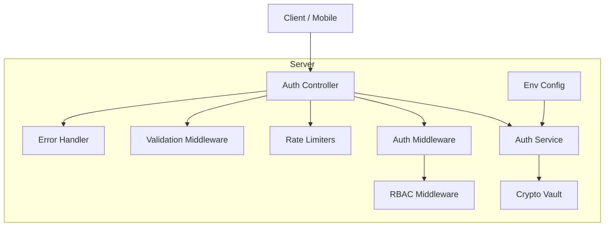

**Diagram sources**
- [auth.controller.js:1-53](file://server/src/controllers/auth.controller.js#L1-L53)
- [auth.service.js:1-203](file://server/src/services/auth.service.js#L1-L203)
- [auth.middleware.js:1-55](file://server/src/middleware/auth.middleware.js#L1-L55)
- [rbac.middleware.js:1-32](file://server/src/middleware/rbac.middleware.js#L1-L32)
- [rateLimit.middleware.js:1-52](file://server/src/middleware/rateLimit.middleware.js#L1-L52)
- [validation.middleware.js:1-48](file://server/src/middleware/validation.middleware.js#L1-L48)
- [errorHandler.middleware.js:1-43](file://server/src/middleware/errorHandler.middleware.js#L1-L43)
- [cryptoVault.js:1-59](file://server/src/utils/cryptoVault.js#L1-L59)
- [env.js:1-42](file://server/src/config/env.js#L1-L42)

**Section sources**
- [auth.controller.js:1-53](file://server/src/controllers/auth.controller.js#L1-L53)
- [auth.service.js:1-203](file://server/src/services/auth.service.js#L1-L203)
- [auth.middleware.js:1-55](file://server/src/middleware/auth.middleware.js#L1-L55)
- [rbac.middleware.js:1-32](file://server/src/middleware/rbac.middleware.js#L1-L32)
- [rateLimit.middleware.js:1-52](file://server/src/middleware/rateLimit.middleware.js#L1-L52)
- [validation.middleware.js:1-48](file://server/src/middleware/validation.middleware.js#L1-L48)
- [errorHandler.middleware.js:1-43](file://server/src/middleware/errorHandler.middleware.js#L1-L43)
- [cryptoVault.js:1-59](file://server/src/utils/cryptoVault.js#L1-L59)
- [env.js:1-42](file://server/src/config/env.js#L1-L42)

## Core Components
- JWT-based authentication with short-lived access tokens and long-lived refresh tokens persisted in the database.
- Role-based access control with an explicit role hierarchy where administrators bypass role checks.
- Rate limiting per endpoint category to mitigate brute-force and abuse.
- Strict input validation via Zod schemas applied at route boundaries.
- Centralized error handling that prevents information leakage and standardizes responses.
- Cryptographic utilities for secure password hashing and field-level encryption of PII.
- Environment validation enforcing minimum secret lengths and safe defaults.

**Section sources**
- [auth.service.js:21-120](file://server/src/services/auth.service.js#L21-L120)
- [auth.service.js:122-203](file://server/src/services/auth.service.js#L122-L203)
- [rbac.middleware.js:1-32](file://server/src/middleware/rbac.middleware.js#L1-L32)
- [rateLimit.middleware.js:1-52](file://server/src/middleware/rateLimit.middleware.js#L1-L52)
- [validation.middleware.js:1-48](file://server/src/middleware/validation.middleware.js#L1-L48)
- [errorHandler.middleware.js:1-43](file://server/src/middleware/errorHandler.middleware.js#L1-L43)
- [cryptoVault.js:1-59](file://server/src/utils/cryptoVault.js#L1-L59)
- [env.js:1-42](file://server/src/config/env.js#L1-L42)

## Architecture Overview
The authentication flow uses a layered middleware pipeline:
- Input validation ensures request integrity.
- Authentication extracts and verifies JWTs, attaching identity to the request.
- Authorization enforces RBAC policies.
- Rate limiters protect endpoints from abuse.
- Error handler centralizes structured error responses.

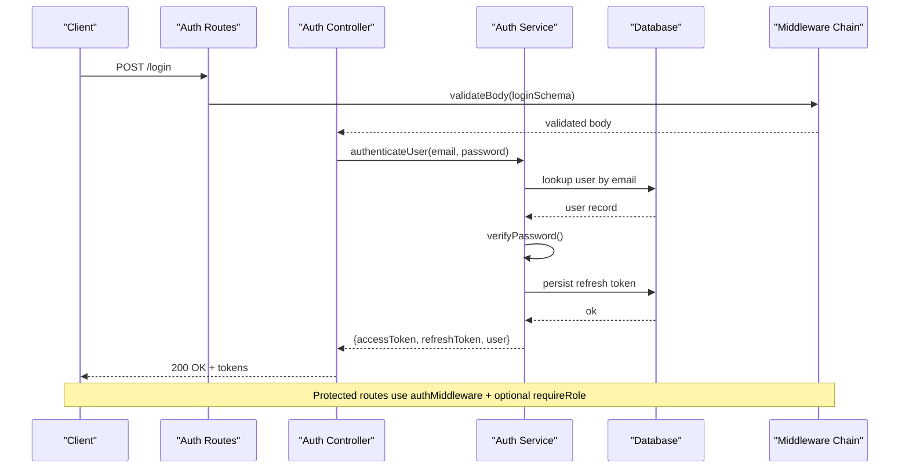

**Diagram sources**
- [auth.routes.js:1-13](file://server/src/routes/auth.routes.js#L1-L13)
- [auth.controller.js:1-53](file://server/src/controllers/auth.controller.js#L1-L53)
- [auth.service.js:163-203](file://server/src/services/auth.service.js#L163-L203)
- [validation.middleware.js:1-48](file://server/src/middleware/validation.middleware.js#L1-L48)
- [auth.middleware.js:1-55](file://server/src/middleware/auth.middleware.js#L1-L55)

## Detailed Component Analysis

### JWT Authentication Flow
- Token generation issues short-lived access tokens with tenant and restaurant context and strict issuer/audience claims.
- Refresh tokens are issued with a unique JTI and persisted to the database; rotation revokes the old token and issues a new pair.
- Verification enforces issuer, audience, and signature integrity.

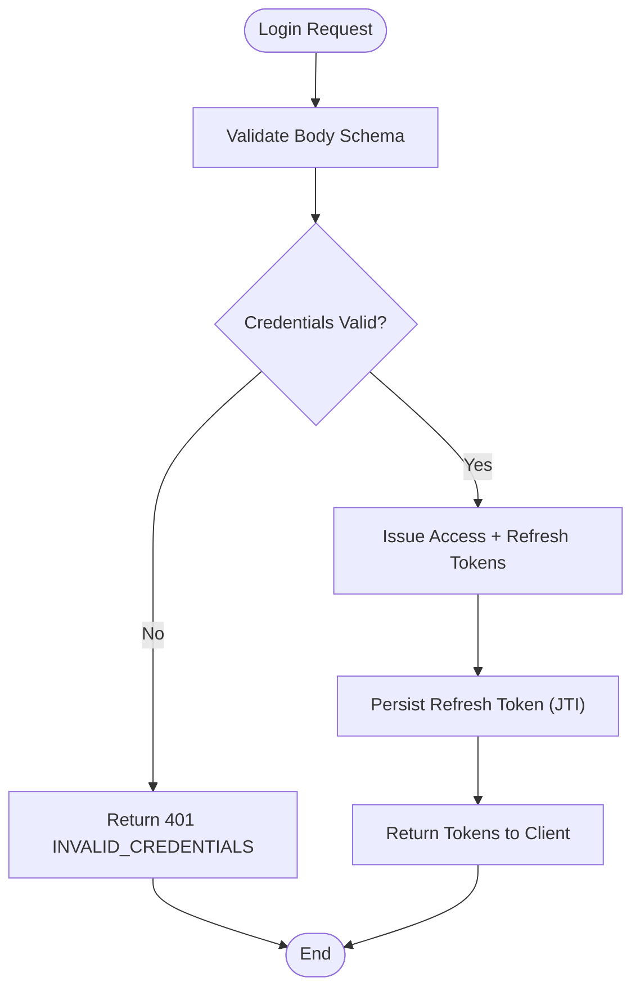

**Diagram sources**
- [auth.controller.js:9-30](file://server/src/controllers/auth.controller.js#L9-L30)
- [auth.service.js:47-105](file://server/src/services/auth.service.js#L47-L105)
- [auth.service.js:122-161](file://server/src/services/auth.service.js#L122-L161)
- [auth.schema.js:1-7](file://server/src/schemas/auth.schema.js#L1-L7)

**Section sources**
- [auth.service.js:47-120](file://server/src/services/auth.service.js#L47-L120)
- [auth.service.js:122-203](file://server/src/services/auth.service.js#L122-L203)
- [auth.controller.js:9-30](file://server/src/controllers/auth.controller.js#L9-L30)
- [auth.schema.js:1-7](file://server/src/schemas/auth.schema.js#L1-L7)

### Authentication Middleware
- Extracts bearer token from headers or query parameter.
- Verifies JWT and attaches identity to request object.
- Supports optional enforcement for public endpoints.

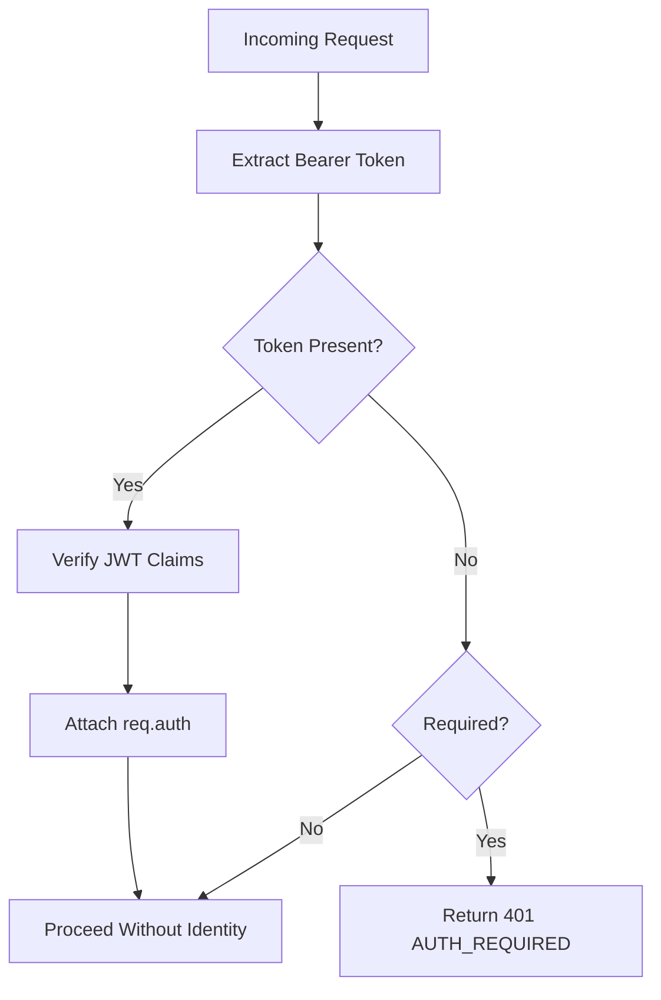

**Diagram sources**
- [auth.middleware.js:1-55](file://server/src/middleware/auth.middleware.js#L1-L55)

**Section sources**
- [auth.middleware.js:1-55](file://server/src/middleware/auth.middleware.js#L1-L55)

### Role-Based Access Control (RBAC)
- Enforces allowed roles per route.
- Administrators can bypass specific role checks when configured.
- Returns clear forbidden errors when unauthorized.

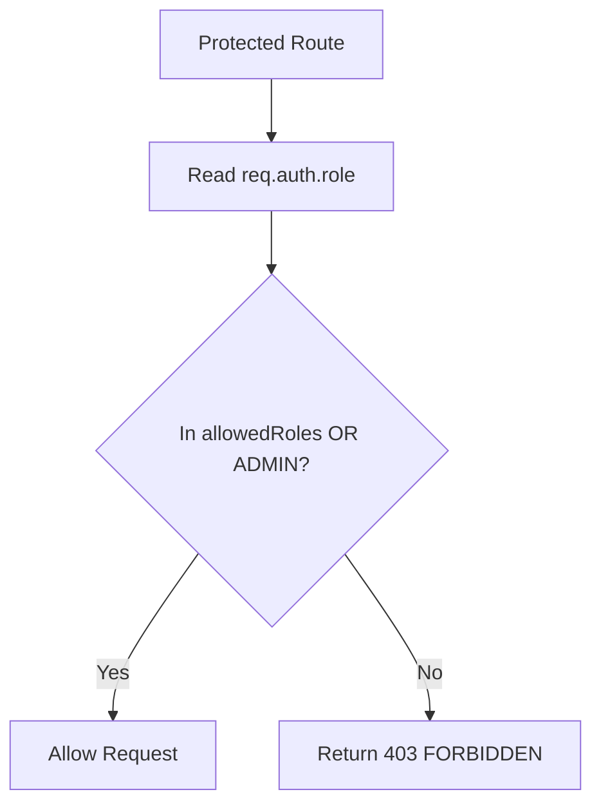

**Diagram sources**
- [rbac.middleware.js:1-32](file://server/src/middleware/rbac.middleware.js#L1-L32)

**Section sources**
- [rbac.middleware.js:1-32](file://server/src/middleware/rbac.middleware.js#L1-L32)

### Rate Limiting
- Separate limiters for authentication, public APIs, dashboard APIs, and telephony webhooks.
- Uses IP or authenticated user keys to throttle requests.
- Returns standardized 429 responses.

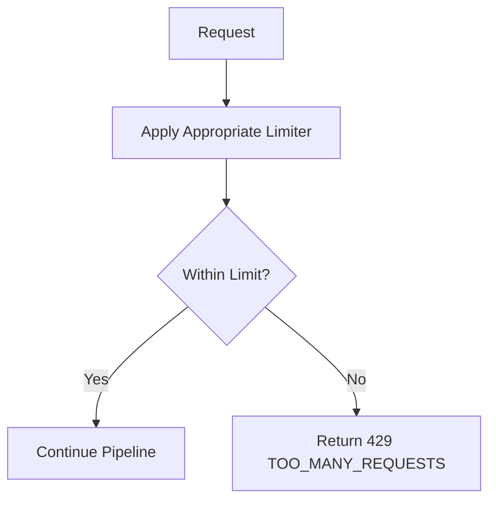

**Diagram sources**
- [rateLimit.middleware.js:1-52](file://server/src/middleware/rateLimit.middleware.js#L1-L52)

**Section sources**
- [rateLimit.middleware.js:1-52](file://server/src/middleware/rateLimit.middleware.js#L1-L52)

### Input Validation
- Validates request bodies, query parameters, and URL parameters using Zod schemas.
- Produces structured validation errors with details.

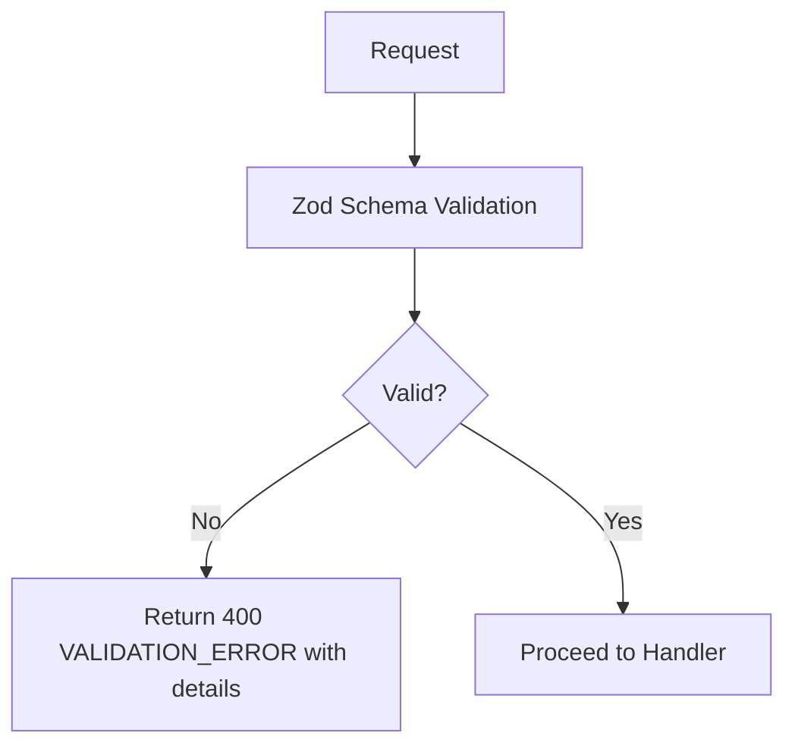

**Diagram sources**
- [validation.middleware.js:1-48](file://server/src/middleware/validation.middleware.js#L1-L48)
- [auth.schema.js:1-7](file://server/src/schemas/auth.schema.js#L1-L7)

**Section sources**
- [validation.middleware.js:1-48](file://server/src/middleware/validation.middleware.js#L1-L48)
- [auth.schema.js:1-7](file://server/src/schemas/auth.schema.js#L1-L7)

### Cryptographic Operations and Secure Storage
- Password hashing uses PBKDF2 with unique salts and high iteration count.
- JWT signing uses HS256 with strict issuer/audience and short expiration.
- Field-level encryption uses AES-256-GCM with versioned format for PII.
- Environment validation enforces minimum secret lengths.

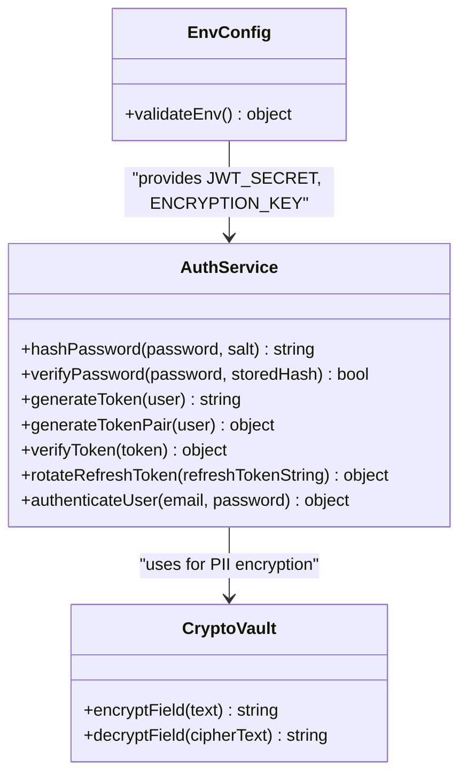

**Diagram sources**
- [cryptoVault.js:1-59](file://server/src/utils/cryptoVault.js#L1-L59)
- [auth.service.js:21-120](file://server/src/services/auth.service.js#L21-L120)
- [env.js:1-42](file://server/src/config/env.js#L1-L42)

**Section sources**
- [auth.service.js:21-120](file://server/src/services/auth.service.js#L21-L120)
- [cryptoVault.js:1-59](file://server/src/utils/cryptoVault.js#L1-L59)
- [env.js:1-42](file://server/src/config/env.js#L1-L42)

### Error Handling and Information Exposure
- Centralized error handler logs structured errors and returns controlled messages.
- Prevents internal stack traces and SQL details from leaking to clients.
- Standardized error type carries status codes and exposure flags.

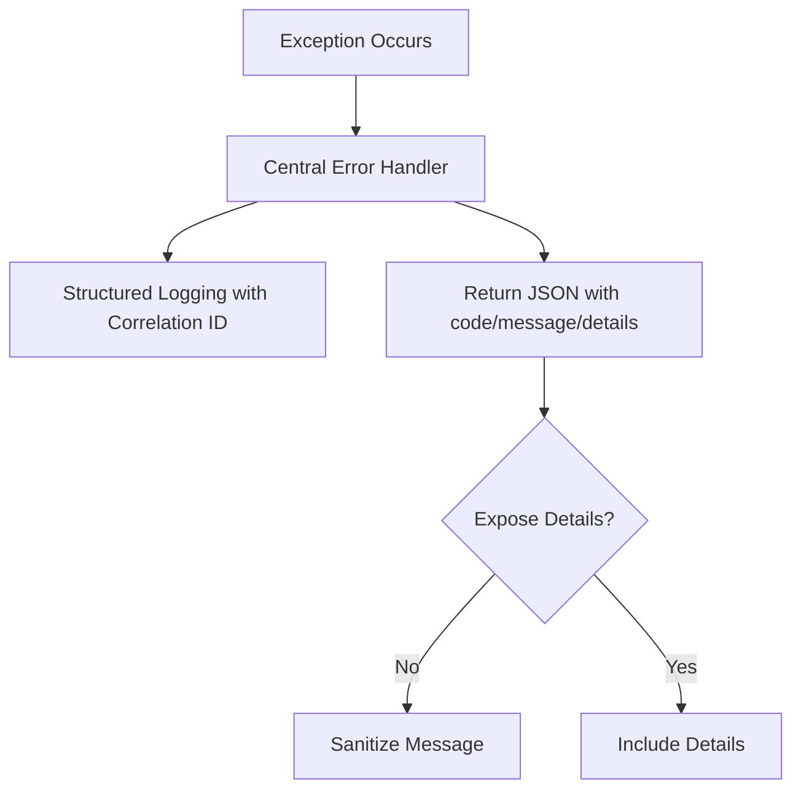

**Diagram sources**
- [errorHandler.middleware.js:1-43](file://server/src/middleware/errorHandler.middleware.js#L1-L43)
- [AppError.js:1-20](file://server/src/utils/AppError.js#L1-L20)

**Section sources**
- [errorHandler.middleware.js:1-43](file://server/src/middleware/errorHandler.middleware.js#L1-L43)
- [AppError.js:1-20](file://server/src/utils/AppError.js#L1-L20)

## Dependency Analysis
- Controllers depend on services for authentication logic and token management.
- Middleware depends on services for token verification and on schemas for validation.
- Services depend on database for user lookups and refresh token persistence.
- Configuration validates environment variables consumed by services and middleware.

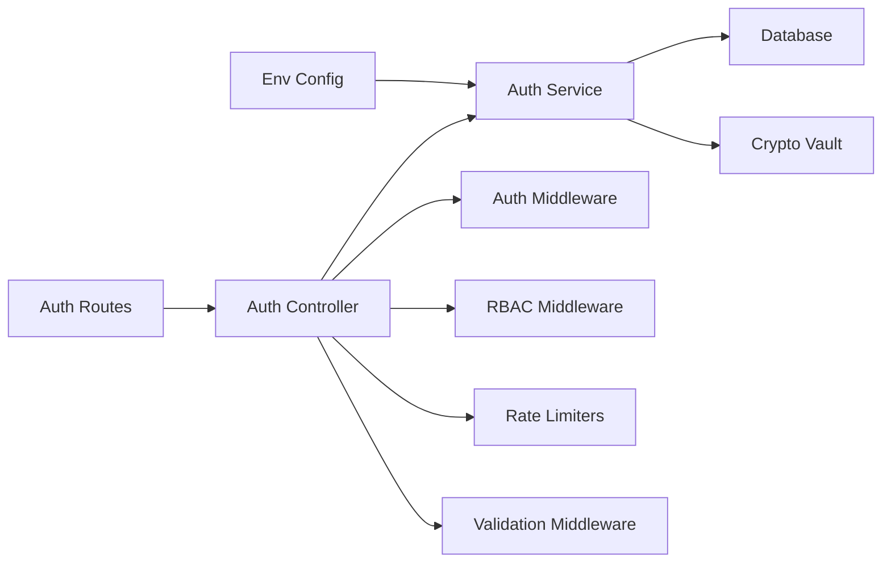

**Diagram sources**
- [auth.routes.js:1-13](file://server/src/routes/auth.routes.js#L1-L13)
- [auth.controller.js:1-53](file://server/src/controllers/auth.controller.js#L1-L53)
- [auth.service.js:1-203](file://server/src/services/auth.service.js#L1-L203)
- [auth.middleware.js:1-55](file://server/src/middleware/auth.middleware.js#L1-L55)
- [rbac.middleware.js:1-32](file://server/src/middleware/rbac.middleware.js#L1-L32)
- [rateLimit.middleware.js:1-52](file://server/src/middleware/rateLimit.middleware.js#L1-L52)
- [validation.middleware.js:1-48](file://server/src/middleware/validation.middleware.js#L1-L48)
- [cryptoVault.js:1-59](file://server/src/utils/cryptoVault.js#L1-L59)
- [env.js:1-42](file://server/src/config/env.js#L1-L42)

**Section sources**
- [auth.routes.js:1-13](file://server/src/routes/auth.routes.js#L1-L13)
- [auth.controller.js:1-53](file://server/src/controllers/auth.controller.js#L1-L53)
- [auth.service.js:1-203](file://server/src/services/auth.service.js#L1-L203)
- [auth.middleware.js:1-55](file://server/src/middleware/auth.middleware.js#L1-L55)
- [rbac.middleware.js:1-32](file://server/src/middleware/rbac.middleware.js#L1-L32)
- [rateLimit.middleware.js:1-52](file://server/src/middleware/rateLimit.middleware.js#L1-L52)
- [validation.middleware.js:1-48](file://server/src/middleware/validation.middleware.js#L1-L48)
- [cryptoVault.js:1-59](file://server/src/utils/cryptoVault.js#L1-L59)
- [env.js:1-42](file://server/src/config/env.js#L1-L42)

## Performance Considerations
- Short-lived access tokens reduce exposure window and minimize server-side state.
- Refresh token rotation is single-use and persisted to prevent replay attacks.
- Rate limiters protect backend resources and reduce abuse impact.
- Strong password hashing incurs CPU cost but improves security posture; ensure appropriate resource sizing.
- Avoid logging sensitive payloads; rely on correlation IDs for tracing.

[No sources needed since this section provides general guidance]

## Troubleshooting Guide
Common issues and resolutions:
- Invalid or tampered JWT: Ensure correct issuer/audience and secret configuration; verify token structure and signature.
- Missing or invalid credentials: Confirm user exists and password matches hashed value; check account status.
- Too many requests: Adjust rate limiter thresholds if legitimate traffic spikes occur; monitor 429 responses.
- Validation failures: Inspect schema definitions and adjust client payloads accordingly.
- Unexpected internal errors: Use correlation IDs from error responses to locate logs and diagnose root causes.

**Section sources**
- [auth.service.js:110-120](file://server/src/services/auth.service.js#L110-L120)
- [auth.service.js:163-203](file://server/src/services/auth.service.js#L163-L203)
- [rateLimit.middleware.js:1-52](file://server/src/middleware/rateLimit.middleware.js#L1-L52)
- [validation.middleware.js:1-48](file://server/src/middleware/validation.middleware.js#L1-L48)
- [errorHandler.middleware.js:1-43](file://server/src/middleware/errorHandler.middleware.js#L1-L43)

## Compliance, Audit Logging, and Incident Response
- Compliance considerations:
  - Enforce strong secrets via environment validation and runtime checks.
  - Use encrypted storage for sensitive fields with versioned formats to support key rotation.
  - Apply least privilege via RBAC and restrict administrative actions.
  - Maintain rate limits to mitigate denial-of-service risks.
- Audit logging:
  - Centralized error handler logs structured events with correlation IDs.
  - Authentication events log successful authentications with user roles.
  - Ensure logs exclude sensitive data and include sufficient context for forensics.
- Incident response procedures:
  - Revoke compromised refresh tokens by marking them revoked in the database.
  - Rotate secrets (JWT secret, encryption key) following key rotation best practices.
  - Use correlation IDs to trace affected requests and scope incidents.
  - Monitor 401/403/429 responses for signs of abuse or compromise.

**Section sources**
- [env.js:1-42](file://server/src/config/env.js#L1-L42)
- [cryptoVault.js:1-59](file://server/src/utils/cryptoVault.js#L1-L59)
- [auth.service.js:122-161](file://server/src/services/auth.service.js#L122-L161)
- [errorHandler.middleware.js:1-43](file://server/src/middleware/errorHandler.middleware.js#L1-L43)
- [auth.controller.js:163-203](file://server/src/services/auth.service.js#L163-L203)

## Security Testing Suite Usage
- Run full security audits across server, client, and mobile components.
- Execute targeted scans for specific subsystems.
- Integrate AI-driven autonomous penetration testing with Strix.
- Generate structured reports for CI/CD pipelines and remediation tracking.

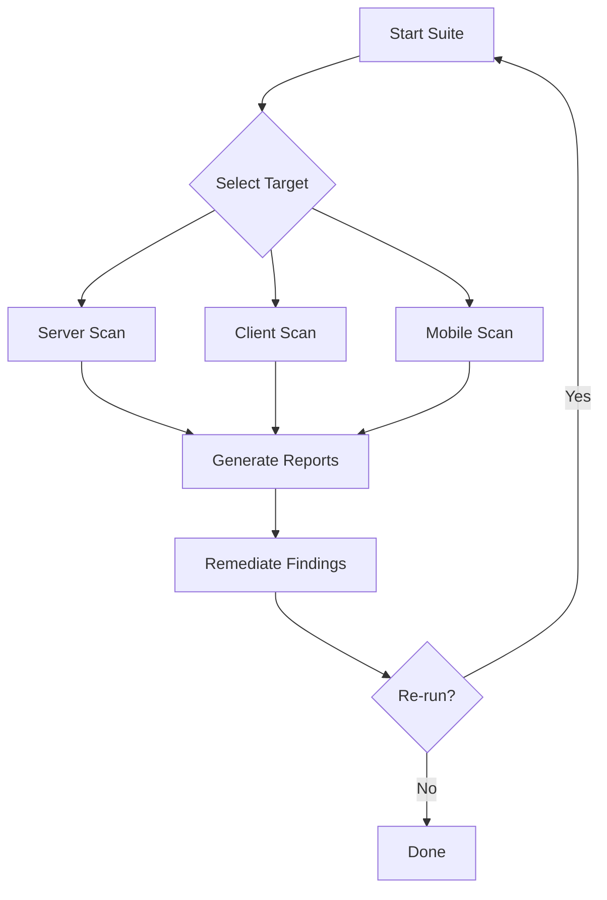

**Diagram sources**
- [README.md:1-83](file://security-suite/README.md#L1-L83)
- [config.js:1-33](file://security-suite/config.js#L1-L33)

**Section sources**
- [README.md:1-83](file://security-suite/README.md#L1-L83)
- [config.js:1-33](file://security-suite/config.js#L1-L33)

## Conclusion
The Inkiro platform implements a robust security model centered on JWT-based authentication, strict input validation, role-based access control, rate limiting, and centralized error handling. Cryptographic operations secure passwords and sensitive data, while environment validation ensures strong secrets. The integrated security suite supports continuous vulnerability assessment and remediation. Adhering to the outlined practices will help maintain confidentiality, integrity, and availability across the platform.

[No sources needed since this section summarizes without analyzing specific files]